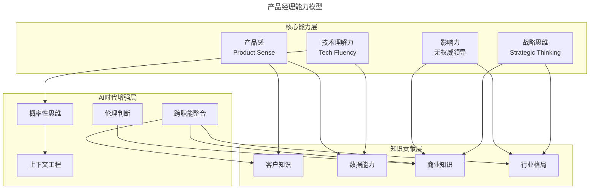
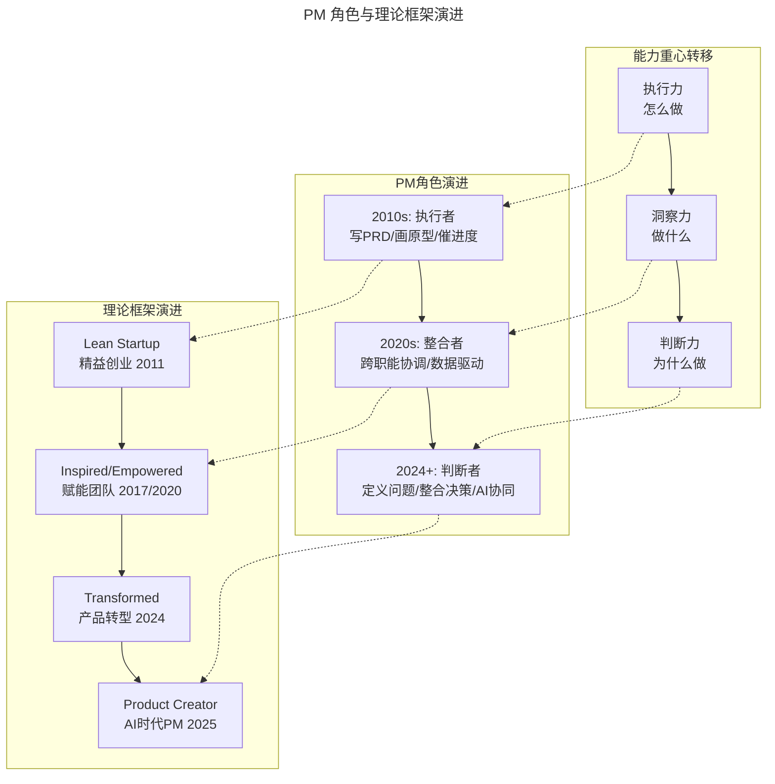
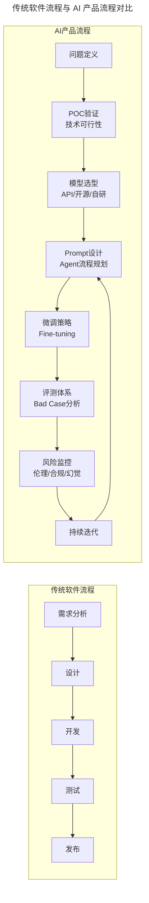
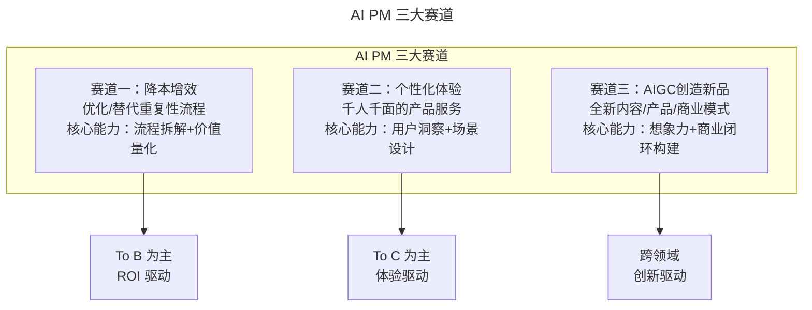
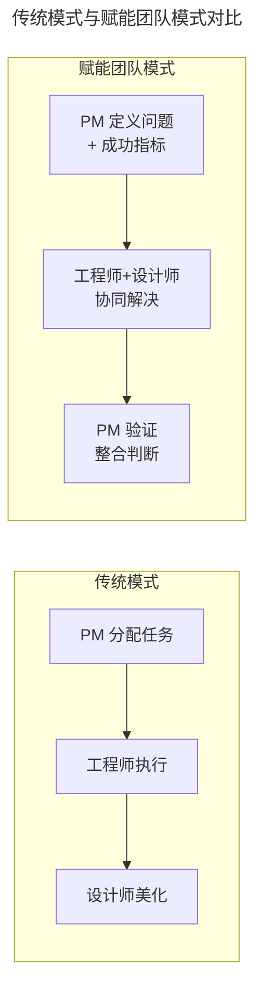

# 01 | 什么是优秀的产品经理？

> **适用范围**：产品经理（入门、进阶、资深各阶段）、产品负责人、希望转型产品经理的工程师/设计师、需要招聘 PM 的管理者。适用于角色认知、能力模型构建、AI 时代 PM 转型等场景。
>
> **更新摘要（v2 · 2026-08 更新）**：
> - 结构化升级为 6 节骨架（导言 / 核心方法论 / 关键流程 / 工具与实战 / 常见误区 / 进阶延展）
> - 整合 Marty Cagan 四大知识贡献框架与 AI 时代 PM 新物种内容
> - 保留全部 Mermaid 图并补充 `--- title: ... ---` frontmatter，每张图后追加文字解读

---

## 1. 导言

### 1.1 一个越来越难回答的问题

做了产品经理这么多年，最难的事情依然是和长辈、朋友们解释我是做什么的。这段对话放在 2017 年和放在 2026 年，尴尬程度不减反增——因为 AI 时代的到来，让"产品经理到底做什么"这个问题变得更加模糊。当 AI 可以帮你写 PRD、画原型、做竞品分析，甚至直接生成可运行的产品原型时，产品经理的独特价值到底在哪里？

要回答这个问题，我们需要从产品经理的角色本质出发，理解这个角色在过去十年间的深刻演变。

### 1.2 本文结构

本文从产品经理的定义、能力模型、常见误解、AI 时代新物种、最新实践五个层面，全面解读"什么是优秀的产品经理"。

---

## 2. 核心方法论

### 2.1 产品经理的定义：从"执行者"到"整合判断者"

传统上，产品经理被定义为：**带领产品团队，在高效的时间内推出满足用户需求的产品**。这个定义包含四个维度：
1. **团队领导**：带领和鼓舞产品团队，具备管理能力、人际关系处理能力和工作流程制定能力。
2. **用户需求理解**：通过市场调查、用户调研，从用户不经意的小抱怨中找到巨大机会。
3. **高效执行**：做好项目管理，提前计划，快速解决阻碍进程的问题（blocker）。
4. **战略眼光**：策略性地制定产品下一步规划。

这四个维度至今仍然成立，但已经不足以定义 2026 年的产品经理。**当 AI 让"执行"变得极其廉价时，"做什么"的判断力就比"怎么做"的执行力更加稀缺。**

### 2.2 Marty Cagan 的四大知识贡献框架

硅谷产品大师 Marty Cagan（SVPG 创始人，《Inspired》《Empowered》《Transformed》作者）在 2023 年提出，产品经理必须为团队带来四个关键知识贡献（The Product Manager Contribution, 2023）：

1. **深入的客户知识（Deep Customer Knowledge）**：不是表面的"用户想要什么"，而是理解用户为什么购买、如何使用、在什么场景下遇到什么问题。
2. **数据与分析能力（Data & Analytics Proficiency）**：熟练运用数据验证假设、追踪产品表现、发现增长机会。
3. **业务与商业知识（Business Understanding）**：涵盖上市策略（go-to-market）、利益相关者关系、经济模型、合规性要求。
4. **行业与竞争格局（Industry & Competitive Landscape）**：掌握竞争动态和技术趋势，洞察窗口期。

> Cagan 强调："这些是你绝对需要为团队带来的四个关键贡献。这些知识不会来自产品设计师，也不会来自工程师。"

### 2.3 产品经理的能力模型

> **图解**：产品经理能力模型分三层——核心能力层（产品感、影响力、技术理解力、战略思维）、知识贡献层（客户、数据、商业、行业）、AI 时代增强层（概率性思维、上下文工程、伦理判断、跨职能整合），核心能力驱动知识贡献，AI 时代能力进一步增强各层。

#### 产品感（Product Sense）

产品感是区分优秀 PM 和普通 PM 的分水岭。它不是天赋，而是通过大量实践积累的**对产品机会的直觉性判断力**。产品感来自：客户对话（深度访谈和现场观察）、数据分析（追问"为什么"）、竞品沉浸（理解对手战略意图）、支持工单分类、销售电话旁听、市场沉浸。

#### 影响力（无权威领导）

产品经理在大多数组织中并不是工程师或设计师的直属上级，必须通过**影响力而非权威**来推动决策。影响力的来源：专业权威、信任积累、叙事能力、透明决策。

#### 技术理解力（Tech Fluency）

产品经理不需要写代码，但必须足够理解技术来评估方案可行性、与工程师深度对话、理解技术约束对产品决策的影响。**AI 时代的新要求**：理解大模型的能力边界、幻觉风险、Prompt 工程和微调策略。

#### 战略思维（Strategic Thinking）

不局限于当前版本，规划产品的长期演进路径；在资源有限时做出明智取舍；理解产品在公司整体战略中的位置；预判市场变化并提前布局。

### 2.4 方法论全景图

> **图解**：PM 角色从 2010 年代"执行者"演进到 2024+"判断者"，能力重心从"怎么做"转向"为什么做"；理论框架从精益创业演进到 AI 时代的 Product Creator，两者同步呼应。

---

## 3. 关键流程

### 3.1 初级视角：从"翻译官"到"问题定义者"

对于 1-3 年经验的 PM，最关键的角色转变是：**从"翻译官/补丁官"升级为"问题定义者"**。传统模式下，产品经理的职责像翻译官，在用户、业务和技术之间翻译传达需求。AI 时代，原型设计、需求分析、流程设计等核心技能已被模型和 Agent 渗透式吸收。

**AI 替代的是活儿，不是人。** 产品经理的核心能力不再是"把事儿做对"，而是"怎么做对的事儿"——由好奇心驱动的发现问题的能力和定义问题的把控能力。

### 3.2 资深视角：整合判断力是 AI 无法替代的核心

对于 3-5 年经验的 PM，需要理解一个深层的结构性变化：**当构建成本下降时，构建错误东西的成本就成了主要成本。**

"错误的东西"几乎从不会在单一维度上出错。它错是因为以一种制造合规噩梦的方式解决了真实问题，或者取悦了用户但破坏了单位经济学，或者技术优雅但不适合销售流程。

**这些是整合失败，不是原型制作失败。** 当交付既便宜又快时，传统的"缓慢发布 = 天然跨维度审查"的调速器消失了。PM 作为整合者，变成了一个优化了速度但未优化一致性的系统中的关键检查点。

### 3.3 专家视角：PM 角色的不可简化核心

对于 5 年+ 的 PM/总监，需要回答：**当每个人都能制作原型时，PM 的差异化在哪里？**

答案是：PM 的差异化必须来自**没有任何原型制作技能可以替代的整合判断力**。客户理解更重要了、数据熟练度更重要了、商业知识更重要了、行业知识更重要了。将所有四个知识领域保持在脑中，并使用整合理解做出没有任何专家能从其单独视角做出的判断的 PM，是 AI 加速产品组织中最稀缺的输入——不是因为他们能比工程师更快地原型设计，而是因为他们知道该构建哪个原型、从中提取什么信号。

### 3.4 AI PM 的独特工作流程

> **图解**：传统软件流程是线性的"需求→设计→开发→测试→发布"；AI 产品流程是循环的"问题定义→POC 验证→模型选型→Prompt 设计→微调→评测→风险监控→持续迭代"，核心区别在于 AI 流程包含模型、评测、风险等新环节且持续迭代。

---

## 4. 工具与实战

### 4.1 AI PM 的三大赛道

> **图解**：AI PM 三大赛道——降本增效（To B，ROI 驱动，如智能客服）、个性化体验（To C，体验驱动，如推荐引擎）、AIGC 创造新品（跨领域，创新驱动，如 AI 写真）。

### 4.2 AI PM 的三大核心软实力

1. **极致的适应力**：AI 的本质是不确定性，AI PM 必须从追求"一次性完美交付"的心态，转变为拥抱"在持续优化中逼近完美"的实验心态。
2. **超强的同理心**：多维度的共情能力——站在用户角度感受喜怒哀乐，钻进算法工程师脑袋理解技术执念，切换到业务方计算 ROI。AI PM 是所有人思维的"连接器"。
3. **跨职能整合力**：AI 团队角色更复杂（算法工程师关心 F1-score，业务方关心 DAU 和 GMV，用户关心产品好不好用），AI PM 是唯一能把不同维度目标统一到一个共同愿景下的角色。

### 4.3 最新实践（2024-2026）

- **Product Creator 时代到来**：Marty Cagan 2025 年提出，AI 原型工具让任何有"产品感"并能操作新工具的人都可以充当"产品创造者"。PM 的整合判断力仍然是确保产品方向正确的关键。
- **Product Ops 兴起**：产品运营/产品中台作为独立职能快速兴起，负责实验基础设施、数据管道、跨团队流程优化、产品决策数据支撑。
- **从 Prompt Engineering 到 Context Engineering**：关键不是写好一条提示词，而是设计好整个上下文环境——包括系统提示、RAG 策略、Agent 工作流编排、多轮对话状态管理。
- **AI PM 的行业专业化**：通用型 AI 产品经理竞争力下降，深耕特定行业（金融、医疗、教育、制造）的 AI PM 更加稀缺。

---

## 5. 常见误区

### 5.1 传统误区

| 误区 | 真相 |
|------|------|
| **产品经理是老板** | 在赋能产品团队模型中，PM 的角色是设定问题语境，工程师和设计师自主决定"如何解决" |
| **工作就是画 UI 图 / 写 PRD** | 最重要的工作是"决定该做什么"，区分优秀 PM 和普通 PM 的是他们思考的部分 |
| **就是催工程师干活** | 产品拖延往往是需求变更、预估不准、沟通问题、设计繁琐，需发现并解决问题 |

### 5.2 AI 时代新误区

| 误区 | 真相 |
|------|------|
| **AI 时代产品经理会消失** | 技术替代的是任务，不是角色。只会答题的 PM 会被淘汰，但擅长定义问题的 PM 依然稀缺 |

| 维度 | AI 改变了什么 | AI 没改变什么 |
|------|-------------|-------------|
| 执行层 | 原型设计、PRD 撰写可自动化 | 判断该构建什么原型的决策力 |
| 沟通层 | 信息传递效率提升 | 跨职能整合与利益相关者关系建设 |
| 分析层 | 数据处理速度和覆盖面扩大 | 辨别真实信号的判断力 |
| 创造层 | 内容和代码生成能力增强 | 定义问题和发现机会的好奇心 |

---

## 6. 进阶延展

### 6.1 赋能团队模式 vs 传统模式

> **图解**：传统模式是"PM 分配任务→工程师执行→设计师美化"的流水线；赋能团队模式是"PM 定义问题+成功指标→工程师+设计师协同解决→PM 验证整合判断"，后者在 Figma、Notion、Stripe 等公司被广泛采用。

### 6.2 关键术语表

| 术语 | 英文 | 定义 |
|------|------|------|
| 产品感 | Product Sense | 对产品机会的直觉性判断力 |
| 整合判断力 | Integrative Judgment | 跨越客户、数据、商业、行业四个维度的综合判断能力 |
| 赋能产品团队 | Empowered Product Team | PM 定义问题和成功指标，工程师与设计师自主决定解决方案 |
| 产品创造者 | Product Creator | AI 时代任何有产品感并能操作 AI 原型工具的人 |
| 上下文工程 | Context Engineering | 强调设计整个上下文环境而非单条提示词 |
| POC 验证 | Proof of Concept | 正式立项前用最小成本快速验证技术可行性 |

### 6.3 思考题

1. **基础题**：如果你要为一家创业公司招聘一个产品经理，你会如何制定评判标准？请结合 Cagan 的四大知识贡献框架来设计面试问题。
2. **进阶题**：假设你是一家 AI 教育公司的产品经理，团队开发了一个 AI 辅导老师产品，上线后发现 AI 有时会给出错误的知识点解释（幻觉问题）。你会如何处理这个 Bad Case？
3. **挑战题**：Marty Cagan 在 2023 年强调 PM 四大知识贡献不可妥协，但在 2025 年又提出"Product Creator"概念。你认为这两个观点是否矛盾？

### 6.4 延伸阅读

- Marty Cagan, *Inspired* / *Empowered* / *Transformed*
- Marty Cagan, "The Product Manager Contribution" (SVPG, 2023)
- Marty Cagan, "AI Product Management 2 Years In" (SVPG, 2025)
- Eric Ries, *The Lean Startup* (2011)
- Lenny Rachitsky, *Lenny's Newsletter*
- Reforge 产品增长和产品管理培训平台
