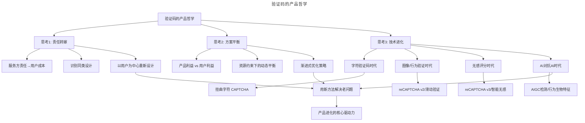
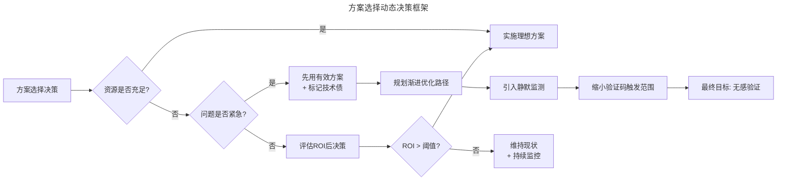
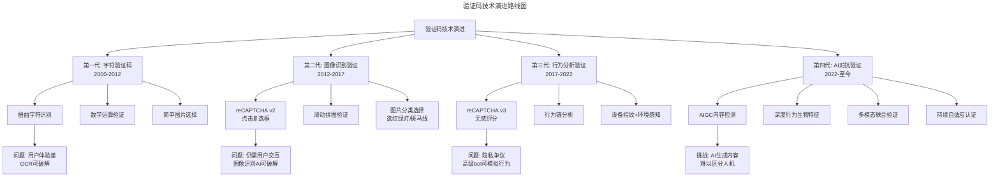

# 01 | 验证码是个好设计吗？

> **适用范围**：产品经理、用户体验设计师、安全产品负责人、需要审视产品设计哲学的从业者。适用于设计哲学思考、责任转嫁识别、方案平衡决策、技术进化判断、AI 时代产品设计等场景。
>
> **更新摘要（v2 · 2026-08 更新）**：
> - 结构化升级为 6 节骨架（导言 / 核心方法论 / 关键流程 / 工具与实战 / 常见误区 / 进阶延展）
> - 整合原"更新说明 v2.0"与核心摘要，补充验证码技术演进路线图（reCAPTCHA v3/国内服务商迭代）
> - 保留全部 Mermaid 图并补充 `--- title: ... ---` frontmatter，每张图后追加文字解读

---

## 1. 导言

验证码（CAPTCHA）本质上是一种将服务方安全责任转嫁给用户的设计——它有效，但并非好设计。随着 AI 技术的飞速发展，验证码经历了从扭曲字符→图像识别→行为分析→无感评分的进化路径，但 AI 生成能力的爆发又带来了"AI 对抗 AI"的新挑战。本文从设计哲学、方案平衡与技术进化三个维度，深入剖析验证码背后的产品思维，并探讨在 AIGC 时代如何用新方法解决老问题。

当你注册或者登录某个应用的时候，经常会遇到验证码。它们曾经是一串歪歪扭扭的字符，后来变成了图片识别、滑动拼图，如今则可能完全无感——你甚至不知道自己刚刚通过了一次验证。

验证码的英文名是 CAPTCHA，这不是一个正规的单词，而是个缩写，全称是：Completely Automated Public Turing test to tell Computers and Humans Apart，翻译过来是：用来区分人类和电脑的全自动图灵测试。据维基百科的描述，验证码出现于 2000 年代初，是为了防止机器（程序）假扮成人，去占用原本为用户准备的资源。比如，利用脚本程序不断地模拟尝试登录以便破解账号密码，或者利用恶意代码在 BBS 中发布大量广告或诈骗内容。

可以看到，它的设计初衷是为了区分人和机器，实现方式是在正常流程中增加了一道门槛，人可以翻过去，而机器会被挡住。从某种意义上说，它可能是个有效设计，但我不认为它是个好设计。因为挡住机器这件事本应该是服务提供方的责任，而服务方却将其成本转嫁给了用户。这件事引发了我的思考。

### 1.1 方法论框架

> **图解**：验证码的产品哲学三个核心思考维度——责任转嫁（服务方责任→用户成本→识别同类设计→以用户为中心重新设计）、方案平衡（产品利益 vs 用户利益→资源约束下的动态平衡→渐进式优化策略）、技术进化（字符→图像/行为→无感评分→AI 对抗 AI）。三个维度最终汇聚于一个关键洞察：**用新方法解决老问题，是产品进化的核心驱动力**。

---

## 2. 核心方法论

### 2.1 思考一：不要将责任推卸给用户

**基础层：识别责任转嫁**——不知道你有没有想过，让用户辨别和输入扭曲的验证码，其实是因为服务提供方的能力欠缺，无法静默区分人和机器，而输入验证码本身，这一操作对用户来说其实并无价值。

有一次我接到用户打来电话，抱怨自己搞不定验证码。我向他解释我们正在被攻击，所以临时调高了验证码的级别。电话的最后，我习惯性地向他道歉，用户却很体贴地安慰我说没必要道歉，毕竟被攻击不是我们的错。当时我心头一热，脸上一红。他说的没错，被攻击确实不是我们的错，但更不是用户的错，让他们付出成本，花费时间，去辨别图片里的那个圆圈究竟是 O 还是 0 还是 6，其实就是让他们承担我们本应该承担的责任。

举一反三，如果再激进一点考虑，我们的软件服务中还有不少推卸责任的设计，比如让用户在成千上万的商品中筛选和比价，比如各种复杂的界面参数设置和兴趣选择。要是想得再发散一点，所有的银行账户密码似乎也没有必要，超市排队也是一样。如果用户不需要付出筛选和比价的成本，或不需要花费精力记住账户密码，却可以享受到同样高质量的服务，是不是更好呢？

**进阶层：系统性识别"责任转嫁"模式**——责任转嫁并非个别现象，而是一种系统性的设计缺陷。我们可以建立一个识别框架：

| 责任转嫁类型 | 典型表现 | 用户付出的成本 | 理想解决方案 |
|------------|---------|--------------|------------|
| 安全责任转嫁 | 验证码、复杂密码规则 | 时间、认知负荷 | 无感验证、生物识别 |
| 决策责任转嫁 | 海量商品无筛选、复杂设置项 | 选择成本、决策疲劳 | 智能推荐、默认最优 |
| 数据责任转嫁 | 手动填写冗长表单 | 时间、隐私风险 | 自动填充、数据授权 |
| 学习责任转嫁 | 不直观的交互、隐藏功能 | 学习成本、挫败感 | 渐进式引导、直觉设计 |

**高阶层：从"责任转嫁"到"能力溢出"的设计哲学**——基于这样的思考，我们是不是应该马上去掉这些推卸责任的设计？答案是：需要，但路径比想象中复杂。更深层的产品哲学是：**好的设计不是消除所有用户成本，而是将必要成本转化为用户愿意付出的价值交换**。比如，用户愿意花时间设置个性化偏好，是因为这带来了更好的体验；但用户不愿意花时间填验证码，因为这对他毫无价值。关键判断标准是：**用户付出的成本是否最终回馈给了用户自身？如果不是，那就是责任转嫁。**

### 2.2 思考二：方案选择的平衡

**基础层：有效设计未必是好设计**——有效的设计确实未必是好设计，比如我自己曾经参与设计的产品中也用到验证码，而且在某些特殊阶段（像刚才提到的被定向攻击），我们还会升级验证码机制，让验证码出现的频率更高，而且更加难以辨认，从而在某些关键入口抵抗一些有针对性的攻击。这一策略是有效的，但对用户的伤害也很大，升级验证码机制后，用户登录过程中耗费的时间会显著增加，通过率也会下降，还有大量的用户抱怨一股脑地涌进来。

然而从服务提供方的角度来看，它却用最低的成本快速地解决了当时面临的问题。这是产品设计方案选择过程中不得不做出的"平衡"，很多时候我们没有办法第一时间实施对用户的完美方案，这就需要在产品利益和用户利益之间，找到微妙的动态平衡点。

所以让一个产品经理讲用户价值其实不难，天花乱坠说完美方案也不难，难的是在实际工程里做出合适的决定。做工程大部分时候都满身污垢，能在其中保持镇定，保持平衡并不容易。

**进阶层：动态平衡的决策框架**——我们当时在扛过了几轮攻击之后，投入了一些技术资源，引入了更多静默监测的策略。比如记录用户密码、记录用户上次登录的位置/设备，或通过一些页面动作来做出判断，保证大部分老用户和一部分新用户不会受到验证码的打扰。我们并没有做到完美，因为资源永远有限，我们需要把它更多投入到我们的竞争优势上，所以还是保留了验证码机制。在某些情况下还是用这种原始、粗暴，但有效的手段来解决问题——这就是我们选择的平衡。

> **图解**：方案选择动态决策框架——在资源受限时，先用有效方案止血，同时标记技术债，规划渐进优化路径（引入静默监测→缩小验证码触发范围→最终目标无感验证）。核心思路：**在资源受限时，先用有效方案止血，同时标记技术债，规划渐进优化路径**。

**高阶层：平衡中的伦理维度**——方案选择不仅是效率问题，也涉及伦理。当我们在产品利益和用户利益之间做平衡时，需要问自己一个问题：**我们是在"暂时妥协"，还是在"习惯性妥协"？** 暂时妥协有明确的退出条件和优化计划；习惯性妥协则是把"别人也这么做"当借口，永远不去改善。区分两者的标准是：是否有可衡量的优化指标和明确的时间节点。

---

## 3. 关键流程

### 3.1 思考三：验证码的进化

**基础层：从字符到无感**——Google 在 2014 年左右发布了 reCAPTCHA v2，本着"对人类友好，对机器难搞"的原则，用户只需要简单点击一个"我不是机器人"的复选框就可以，不再需要分辨歪歪扭扭的验证码。reCAPTCHA 通过收集用户环境和行为数据，综合分析、智能区分人和机器。除此之外，阿里也发布了自己的滑动验证码，还有国内一些第三方的验证码服务也在快速迭代进化。毕竟 Google 的服务不太稳定，他们还是获得了自己的生长空间。这些更高级的验证码服务，大部分都在标榜自己的"人工智能"属性，不管真假，这确实是个非常典型的机器学习应用场景，提供各种行为特征，训练算法去分辨人和机器。

**进阶层：验证码技术的全面进化**——如今，验证码技术已经经历了翻天覆地的变化：

**reCAPTCHA v3：完全无感评分机制**——Google 于 2018 年推出 reCAPTCHA v3，彻底取消了任何用户交互操作。它通过分析用户在页面上的行为模式（鼠标移动轨迹、点击节奏、浏览习惯等），给出一个 0-1 的风险评分。网站管理员可以自行设定阈值，决定什么评分以下的访问需要进一步验证。这意味着绝大多数正常用户完全感知不到验证的存在。

**国内验证码服务的迭代**——国内验证码服务在过去几年大幅迭代：

| 服务商 | 核心产品 | 技术特点 | 适用场景 |
|-------|---------|---------|---------|
| 极验（GeeTest） | 行为验证4.0 | 深度学习行为特征分析，自适应难度 | 互联网服务、金融 |
| 顶象 | 智能无感验证 | 设备指纹+行为链+环境风险 | 金融、电商 |
| 数美 | 智能验证码 | AIGC检测+实时风控 | 社交、内容平台 |
| 阿里 | 滑动验证/智能验证 | 生态数据协同+行为分析 | 电商、云计算 |
| 腾讯 | 天御验证 | 社交图谱+设备风险识别 | 社交、游戏 |

**验证码技术演进路线图**：

> **图解**：验证码技术演进路线图——第一代字符验证码（2000-2012，问题：用户体验差、OCR 可破解）→第二代图像识别验证（2012-2017，问题：仍需用户交互、图像识别 AI 可破解）→第三代行为分析验证（2017-2022，问题：隐私争议、高级 bot 可模拟行为）→第四代 AI 对抗验证（2022-至今，挑战：AI 生成内容难以区分人机）。

**高阶层：AIGC 时代的新挑战**——2022 年以来，大语言模型和 AIGC 技术的爆发给验证码带来了前所未有的挑战：

**1. AI 生成内容模糊了人机边界**——当 AI 可以生成逼真的图像、流畅的文本、甚至模拟人类的鼠标移动轨迹时，传统的"图灵测试"思路面临根本性挑战。GPT-4 可以轻松通过 reCAPTCHA v2 的图像识别测试，而各种行为模拟工具可以伪造逼真的用户行为数据。

**2. "AI 对抗 AI"成为新范式**——验证码领域正在进入"AI 对抗 AI"的新阶段：攻击方使用 AI 生成更逼真的伪造行为，防御方则使用更先进的 AI 模型来检测异常。这形成了一个军备竞赛，而用户可能成为最大的受害者——因为当防御方升级 AI 检测时，往往需要用户配合做更多的验证操作。

**3. 深度行为生物特征验证**——新一代验证方案开始关注更深层次的行为生物特征，如：键盘敲击节奏和力度模式；触屏滑动压力和速度曲线；眼球追踪和注视热力图；认知反应时间模式。这些特征更难被 AI 模拟，但也引发了更大的隐私争议。

**4. 持续自适应认证（Continuous Adaptive Authentication）**——未来的方向不再是"一次性验证"，而是贯穿整个用户会话的持续认证。系统在用户使用产品的全过程中，持续评估风险评分，动态调整安全策略。这意味着验证码可能从"一个组件"变成"一个持续运行的后台服务"。

---

## 4. 工具与实战

### 4.1 从验证码到更广阔的产品进化

我们把这个思路放大来看，如果可以把过去看似理所应当，其实是由于服务提供方的成本考虑，而把责任推卸给用户的那些功能或流程拿出来重新思考设计，再搭配成熟的机器学习算法，或许就可以带来一系列革命性的用户体验进化。比如免密支付，让用户不必再耗费精力记录密码——如今生物识别支付已经成为主流；比如无人超市，让用户无需排队付款——然而这个案例的演进比预想中曲折得多。

**案例复盘：无人超市的退潮**——2017-2019 年间，Amazon Go、缤果盒子、淘咖啡等无人超市概念火爆一时，被视为"用新方法解决老问题"的典范。然而几年过去，大规模退潮发生了：缤果盒子大量关店，Amazon Go 扩张远不及预期，国内多家无人零售企业倒闭或转型。核心原因在于：无人超市虽然解决了"排队付款"的用户成本，却引入了新的问题——商品损耗率居高不下、技术维护成本远超人工成本、购物体验反而不如传统便利店（没有店员协助）。这提醒我们：**用新方法解决老问题时，必须确保新方法不会引入更大的新问题**。

而另一些领域的进化则更为成功：

| 领域 | 老问题 | 新方法 | 进化效果 |
|------|-------|--------|---------|
| 支付认证 | 记忆复杂密码 | 生物识别+风控模型 | ✅ 大幅改善 |
| 内容推荐 | 用户手动筛选 | 个性化推荐算法 | ✅ 大幅改善 |
| 客服支持 | 等待人工客服 | AI智能客服+人工兜底 | ⚠️ 部分改善 |
| 自动驾驶 | 人工驾驶疲劳 | L2/L3辅助驾驶 | ⚠️ 渐进改善中 |
| 无人零售 | 排队付款 | 计算机视觉自动结算 | ❌ 大规模退潮 |

这个伟大的变革时代提供了新的方法和工具，让我们有机会重新去审视过去由于技术和工具的限制而不得不做出的妥协。用新方法解决老问题，或许不需要什么翻天覆地的变化，只是撬松一两块被惯性封印的砖，就已经算得上强有力的推动了。这是验证码给我最后，也是最重要的启发。

所以说，一个简单的验证码，背后却并不简单，我们能从中看到设计原则、设计哲学，甚至技术演化改变用户体验的过程。

### 4.2 实战要点

| 要点 | 说明 | 适用场景 |
|------|------|----------|
| 识别责任转嫁 | 审视产品中哪些设计是将服务方责任转嫁给用户 | 产品评审、体验走查 |
| 动态平衡决策 | 在资源受限时先用有效方案，规划渐进优化路径 | 需求优先级排序 |
| 技术进化意识 | 关注新技术能否解决老问题，但警惕引入更大新问题 | 技术选型、产品规划 |
| AI对抗思维 | 在安全领域预判AI攻击手段，提前布局防御 | 安全产品设计 |
| 伦理底线 | 区分"暂时妥协"和"习惯性妥协"，设定优化退出条件 | 产品决策复盘 |

---

## 5. 常见误区

| 误区 | 表现 | 正确做法 |
|------|------|---------|
| **把有效当做好** | 认为验证码等有效设计就是好设计 | 有效≠好，审视是否将服务方责任转嫁给用户 |
| **追求完美方案** | 认为应该马上消除所有用户成本 | 好的设计是将必要成本转化为用户愿意付出的价值交换 |
| **习惯性妥协** | 把"别人也这么做"当借口，永远不改善 | 区分暂时妥协与习惯性妥协，设定优化退出条件 |
| **新方法引入新问题** | 无人超市解决排队却引入损耗和成本问题 | 用新方法解决老问题时，确保不会引入更大的新问题 |

---

## 6. 进阶延展

### 6.1 三层深度视角

**🟢 进阶视角（1-3 年）**：培养"责任转嫁"意识。审视自己负责的产品中，哪些设计是将服务方责任转嫁给用户？这些设计是否有更好的替代方案？

**🔵 资深视角（3-5 年）**：掌握动态平衡的决策框架。在资源受限时，如何先用有效方案止血，同时规划渐进优化路径？如何区分"暂时妥协"和"习惯性妥协"？

**🟣 专家视角（5 年+）**：在 AI 时代构建产品进化的战略思维。如何用新方法解决老问题？如何在"AI 对抗 AI"的军备竞赛中保护用户体验？如何推动组织从"责任转嫁"到"能力溢出"的转变？

### 6.2 延伸阅读

- 《设计中的视觉思维》——理解用户感知的底层逻辑
- reCAPTCHA v3 官方文档——了解无感评分机制的技术实现
- 极验行为验证白皮书——国内验证码技术演进参考
- 《AI 安全》——AIGC 时代的安全挑战与应对
- FTC 2023 Report on Dark Patterns in Authentication——监管视角下的验证码设计规范
