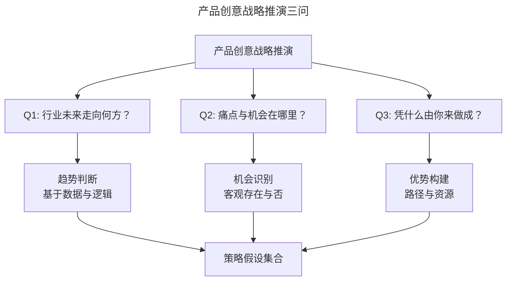
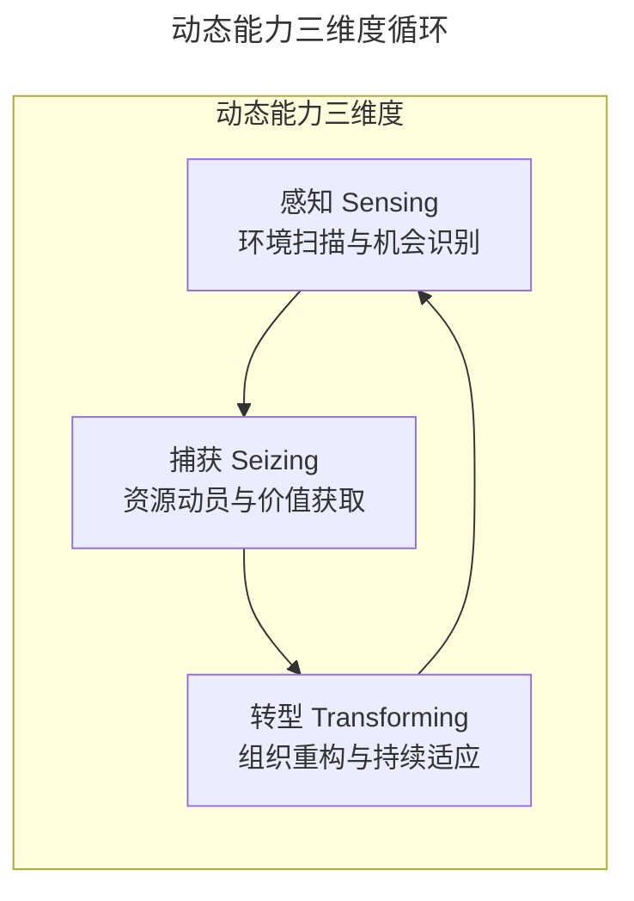
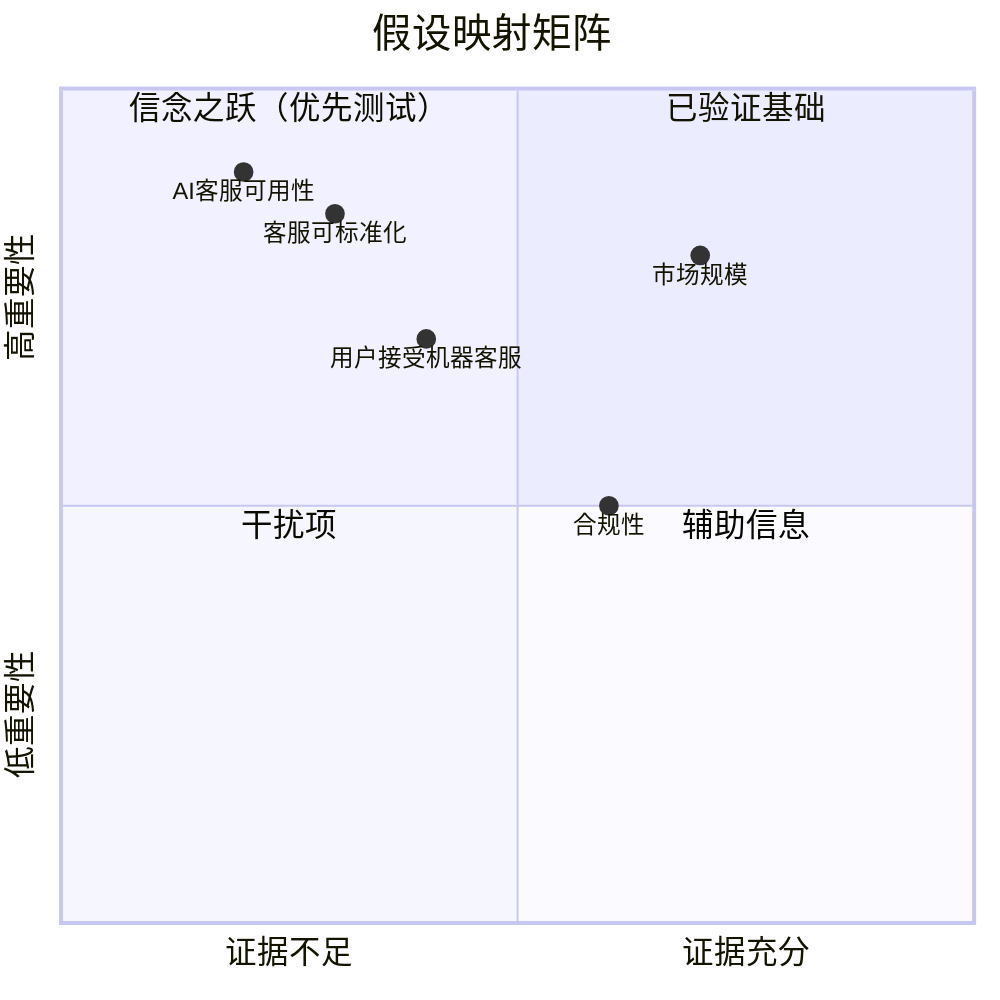
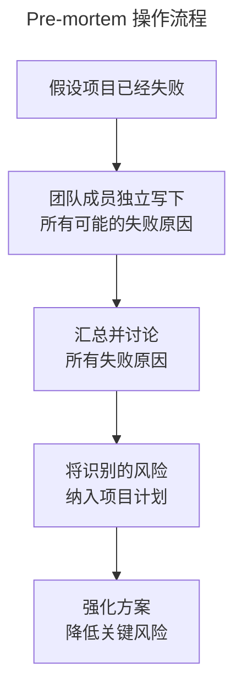
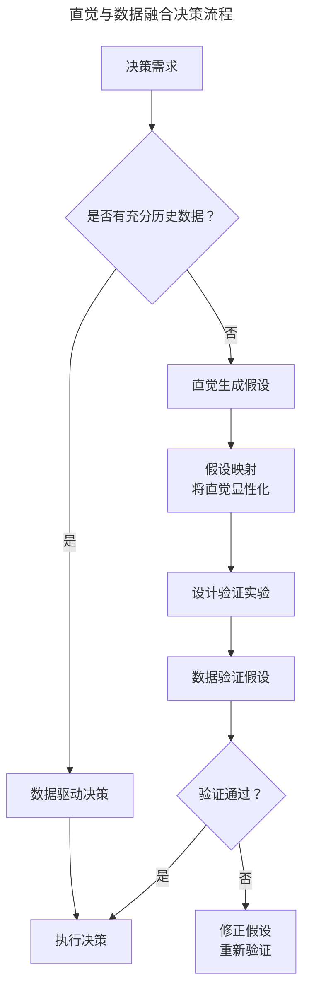

# 02 | 产品创意的战略推演与锤炼

> **适用范围**：产品经理、产品负责人、创业者、需要做战略判断的团队负责人。适用于行业趋势判断、痛点机会识别、竞争优势构建、假设验证、直觉与数据融合决策等场景。
>
> **更新摘要（v2 · 2026-08 更新）**：
> - 结构化升级为 6 节骨架（导言 / 核心方法论 / 关键流程 / 工具与实战 / 常见误区 / 进阶延展）
> - 保留 SVPG 产品战略四支柱框架与 VRIO/Dynamic Capabilities 竞争优势理论
> - 保留全部 Mermaid 图并补充 `--- title: ... ---` frontmatter，每张图后追加文字解读
> - 参考资料融入进阶延展

---

## 1. 导言

产品创意的战略推演是将模糊的创意转化为可执行策略的关键环节。本文基于 SVPG 产品战略四支柱框架与 VRIO/Dynamic Capabilities 竞争优势理论，系统阐述从行业趋势判断、痛点机会识别到竞争优势构建的完整推演方法论。结合 Assumption Mapping（假设映射）与 Pre-mortem（事前验尸）分析技术，提出将直觉与数据融合的结构化决策流程，并引入 2024–2026 年 AI 增强竞争情报的最新实践。

### 1.1 核心定义

**产品创意战略推演（Strategic Reasoning for Product Ideas）** 是指在信息采集与创意验证之间，通过结构化的逻辑推演，对行业趋势、市场机会与自身优势进行系统性分析，从而将模糊的产品创意转化为具有清晰逻辑链条的策略假设的过程。

战略推演需回答三个核心问题：

> **图解**：产品创意战略推演回答三个核心问题——行业未来走向何方（趋势判断）、痛点与机会在哪里（机会识别）、凭什么由你来做成（优势构建），三个问题的答案汇集成策略假设集合。

### 1.2 与相关概念辨析

| 概念 | 定义 | 与战略推演的关系 |
|------|------|-----------------|
| 战略推演 | 对行业、机会与优势的结构化分析 | 本主题 |
| 商业计划 | 详细的执行方案与财务预测 | 推演的输出物之一 |
| 竞争分析 | 对竞争格局的系统研究 | 推演的输入之一 |
| 假设映射 | 将隐含假设显性化并排序 | 推演的核心工具 |
| 事前验尸 | 假设项目失败并反推原因 | 推演的风险校验工具 |

---

## 2. 核心方法论

### 2.1 行业趋势判断：从数据到逻辑

行业趋势判断需遵循**事实→推论→假设**的三层逻辑结构：

| 层次 | 定义 | 特征 | 可验证性 |
|------|------|------|---------|
| 事实（Fact） | 基于数据的客观陈述 | 可量化、可追溯 | 高 |
| 推论（Inference） | 基于事实的逻辑延伸 | 逻辑自洽、有依据 | 中 |
| 假设（Assumption） | 缺乏充分依据的判断 | 需后续验证 | 低 |

**逻辑自洽性原则**：推演过程中，逻辑推理的正确性比前提的准确性更为基础。三段论示例：
- **正确推理**：所有女性偏好蓝色（前提 A）→ 目标用户是女性（前提 B）→ 目标用户偏好蓝色（结论）。若结论错误，问题在于前提 A，推理本身无误。
- **错误推理**：目标用户偏好红色（前提 A）→ 目标用户是女性（前提 B）→ 所有女性偏好红色（结论）。前提正确但推理逻辑错误，结论必然不可靠。

### 2.2 痛点与机会识别

痛点与机会的识别需遵循**客观性原则**：机会的存在不依赖于特定团队或特定路径。需先证明"机会客观存在"，再讨论"由谁以何种方式把握"：

| 判断层次 | 核心问题 | 示例 |
|----------|---------|------|
| 机会存在性 | 该痛点是否客观存在？ | O2O 服务商的客服成本随业务量指数增长 |
| 机会规模 | 该痛点影响的市场规模有多大？ | 受影响的服务商数量与客单价 |
| 机会时机 | 当前是否是解决该痛点的最佳时机？ | AI 客服技术的成熟度是否已达到可用水平 |
| 机会壁垒 | 把握该机会需要哪些前提条件？ | 客服流程标准化程度、语料积累 |

### 2.3 竞争优势构建：VRIO 分析框架

**VRIO 框架**（Barney, 1991）用于评估企业资源是否构成持续竞争优势：

| 维度 | 问题 | 判断标准 |
|------|------|---------|
| **V**aluable（价值性） | 该资源是否有助于把握机会或抵御威胁？ | 是否直接支撑核心价值主张 |
| **R**are（稀缺性） | 该资源是否为少数企业所拥有？ | 竞争对手获取难度 |
| **I**mitable（不可模仿性） | 该资源是否难以被复制或替代？ | 复制成本与时间 |
| **O**rganized（组织性） | 企业是否组织得当以利用该资源？ | 组织架构与流程支撑 |

| VRIO 组合 | 竞争优势类型 | 持续性 |
|-----------|-------------|--------|
| V + R + I + O | 持续竞争优势 | 长期 |
| V + R + ~I + O | 暂时竞争优势 | 中期 |
| V + ~R + ~I + O | 竞争对等 | 无优势 |
| ~V | 竞争劣势 | 需改变 |

**Dynamic Capabilities（动态能力）**——Teece（1997, 2018）提出，弥补了 VRIO 在快速变化环境中的不足：

> **图解**：动态能力三个维度形成循环——感知（Sensing，环境扫描与机会识别）、捕获（Seizing，资源动员与价值获取）、转型（Transforming，组织重构与持续适应）。

| 维度 | 产品策略含义 | 实践方法 |
|------|-------------|---------|
| 感知（Sensing） | 市场研究、竞争情报、技术侦察 | AI 竞争情报工具、持续用户访谈 |
| 捕获（Seizing） | 快速原型、战略合作伙伴、人才获取 | Design Sprint、MVP 验证 |
| 转型（Transforming） | 产品转型、平台重构、组织调整 | 数据驱动的迭代决策 |

### 2.4 直觉与数据的融合决策

**直觉的本质**：直觉并非神秘力量，而是**压缩的经验（Compressed Experience）**——由多年领域实践积累形成的模式识别能力（Gary Klein, *Sources of Power*）。Klein 的**识别优先决策模型（Recognition-Primed Decision, RPD）** 表明，专家决策的核心机制是将当前情境识别为过去经验的相似模式，而非系统性地比较所有选项。

**数据与直觉的适用场景**：

| 决策类型 | 推荐方法 | 原因 |
|----------|---------|------|
| 优化类决策（已知空间） | 数据驱动 | 有历史数据支撑，A/B 测试可量化效果 |
| 探索类决策（未知空间） | 直觉引导 | 无历史数据，需基于经验判断方向 |
| 假设生成 | 直觉优先 | 直觉擅长模式识别与创意生成 |
| 假设验证 | 数据优先 | 数据提供客观的验证标准 |

---

## 3. 关键流程

### 3.1 假设与风险的量化

推演中的假设越多，风险越高；但假设越多，若验证通过，机会也越大。不存在任何风险的机会通常已被占据。关键在于将假设显性化并量化其影响：

| 假设类型 | 风险等级 | 验证成本 | 示例 |
|----------|---------|---------|------|
| 技术假设 | 高 | 中 | AI 客服在工业场景中的可用性 |
| 市场假设 | 高 | 低 | 客服需求是否可标准化 |
| 行为假设 | 中 | 低 | 用户是否接受机器客服 |
| 监管假设 | 中 | 低 | 自动化客服是否合规 |

### 3.2 Assumption Mapping 实践

采用重要性 × 证据量矩阵对假设进行优先级排序：

> **图解**：假设映射矩阵通过"重要性 × 证据量"四象限（已验证基础、信念之跃、干扰项、辅助信息）对假设排序。**操作原则**：优先测试"高重要性 + 低证据量"象限的假设（信念之跃），这些是决定项目成败的关键不确定性。

### 3.3 Pre-mortem 分析：事前验尸

Pre-mortem（事前验尸）由 Gary Klein 在 HBR（2007）中提出，是一种逆向思维的风险识别技术：

> **图解**：Pre-mortem 流程——假设项目已经失败→团队成员独立写下所有可能的失败原因→汇总并讨论→将识别的风险纳入项目计划→强化方案降低关键风险。

**操作步骤**：① 设定场景（"假设现在是 12 个月后，这个项目已经彻底失败了"）；② 独立生成（每位成员独立写下所有能想到的失败原因，5-10 分钟）；③ 汇总分享（逐一分享，确保每个人的声音被听到）；④ 优先级排序（按影响程度与发生概率排序）；⑤ 纳入计划（将高优先级风险纳入项目计划，设计应对措施）。

**Pre-mortem 的心理学优势**：核心价值在于创造**心理安全感**——当所有人都在"想象失败"而非"预测失败"时，持不同意见者可以安全地表达担忧，而不会被贴上"不积极"或"唱反调"的标签。Klein 的研究表明，Pre-mortem 可使团队识别的风险数量增加 30%。

### 3.4 融合决策流程

> **图解**：融合决策流程——有充分历史数据时直接数据驱动决策；否则直觉生成假设→假设映射显性化→设计验证实验→数据验证假设→验证通过执行，否则修正假设重新验证。**关键原则**：用数据验证直觉，用直觉生成假设。

---

## 4. 工具与实战

### 4.1 趋势判断的数据支撑体系

| 数据类型 | 来源 | 适用场景 | 局限性 |
|----------|------|---------|--------|
| 人口统计数据 | 国家统计局、联合国人口司 | 市场规模估算 | 滞后性，无法预测突变 |
| 市场统计数据 | 艾瑞、QuestMobile、Statista | 行业规模与渗透率 | 样本偏差，定义不一致 |
| 调研数据 | 问卷、访谈、焦点小组 | 用户态度与偏好 | 社会期望偏差 |
| 宏观经济数据 | 世界银行、IMF、央行 | 消费结构变化 | 宏观与微观的映射不确定 |
| 跨国对标数据 | 同一发展阶段的他国经验 | 长期趋势预判 | 文化与制度差异 |

### 4.2 AI 增强趋势分析（2024–2026）

| 工具/方法 | 功能 | 适用场景 |
|-----------|------|---------|
| Perplexity AI | 实时综合多源信息 | 快速行业概览 |
| Elicit | 学术论文综合 | 获取经过同行评审的趋势判断 |
| Gartner Hype Cycle | 技术成熟度定位 | 判断技术趋势所处阶段 |
| McKinsey / a16z 报告 | 权威行业分析 | 获取深度行业洞察 |

### 4.3 直觉的适用边界

| 条件 | 直觉可靠性 | 说明 |
|------|-----------|------|
| 领域经验 > 10 年 | 高 | 充分的模式积累 |
| 反馈循环完整 | 高 | 决策结果可追溯与修正 |
| 情绪稳定状态 | 高 | 避免冲动伪装为直觉 |
| 领域经验 < 3 年 | 低 | 模式积累不足 |
| 高压/焦虑状态 | 低 | 认知偏差放大 |
| 群体压力环境 | 低 | 从众效应干扰 |

> **警示**：切勿将冲动（Impulse）等同于直觉（Intuition）。冲动的特征是紧迫感与情绪驱动，直觉的特征是平静感与模式识别。有效的直觉需要充分的产品经验与完整的反思循环作为基础。

---

## 5. 常见误区

### 5.1 常见竞争优势误判

| 误判类型 | 错误认知 | 正确理解 |
|----------|---------|---------|
| 能力幻觉 | "我们的产品运营能力很强" | 能力需可量化对比，非自我评价 |
| 资源幻觉 | "我们有丰富的行业经验" | 经验需转化为可复用的流程与资产 |
| 先发优势幻觉 | "我们是第一个做的" | 先发优势仅在存在网络效应或高转换成本时成立 |
| 团队幻觉 | "我们团队很优秀" | 优秀团队是必要条件，非充分条件 |

> **核心原则**：竞争优势必须具体、可量化、可防御。"产品运营能力"或"思维能力"等泛化描述不构成竞争优势。有效的竞争优势通常表现为：独占性数据资产、网络效应、高转换成本、或专有技术壁垒。

### 5.2 战略推演误区

| 误区 | 表现 | 正确做法 |
|------|------|---------|
| **观点空泛** | 趋势判断停留在观点层面无逻辑链条 | 明确"事实→推论→假设"三层结构，标注靶点 |
| **忽视机会客观性** | 先讨论"由谁做"而非"机会是否存在" | 先证明机会客观存在，再讨论把握方式 |
| **假设不分优先级** | 所有假设同等对待，平均用力验证 | 用假设映射矩阵优先测试"信念之跃" |
| **误把冲动当直觉** | 高压下凭情绪仓促决策 | 区分冲动与直觉，直觉需经验与反思基础 |

---

## 6. 进阶延展

### 6.1 AI 增强竞争情报

AI 正在重塑竞争分析的效率与深度：

| 能力 | 传统方法 | AI 增强方法 |
|------|---------|------------|
| 竞品动态追踪 | 人工定期检查 | AI 自动监控网站、定价、招聘变化 |
| 竞争定位分析 | 手动制作 Battle Card | AI 自动生成竞争定位文档 |
| 胜负分析 | 销售人员主观汇报 | AI 分析通话录音与 CRM 数据 |
| 竞争预测 | 基于经验判断 | ML 模型基于招聘、专利、供应链信号预测 |

**代表工具**：Klue（Compete Agent、Auto Insights）、Crayon（自动化竞品监控）。

### 6.2 从静态推演到动态验证

传统战略推演是"一次性"活动，2024–2026 年的趋势是将其嵌入**持续发现循环**：
- 每周进行小规模假设测试，而非季度性的大规模推演。
- 使用 OST（机会解决方案树）持续更新推演结论。
- AI 辅助的实时竞争情报替代周期性竞争分析。

### 6.3 创业失败数据的启示

CB Insights（2026）对 431 家 VC 支持的失败创业公司分析显示：

| 失败原因 | 占比 | 与推演的关联 |
|----------|------|-------------|
| 资金耗尽 | 70% | 最终原因，非根因 |
| 产品市场匹配失败 | 43% | 推演阶段对需求假设验证不足 |
| 时机错误 | 29% | 趋势判断偏差 |
| 单位经济不可持续 | 19% | 商业模式假设未充分验证 |

**典型案例**：Quibi（融资 $1.75B）的每一个核心假设均被证伪——用户不需要付费的移动端短视频、通勤场景被 COVID 消除、明星效应不等于用户需求。若在推演阶段进行充分的 Assumption Mapping 与 Pre-mortem，这些风险本可被提前识别。

### 6.4 参考文献

1. Barney, J. B. (1991). Firm Resources and Sustained Competitive Advantage. *Journal of Management*, 17(1), 99-120.
2. Teece, D. J. (2018). Profiting from Innovation in the Digital Economy. *Research Policy*, 47(8), 1379-1397.
3. Cagan, M. (2020). *Empowered: Ordinary People, Extraordinary Products*. Wiley.
4. Klein, G. (2007). Performing a Project Premortem. *Harvard Business Review*, 85(9), 18-19.
5. Klein, G. (1998). *Sources of Power: How People Make Decisions*. MIT Press.
6. Torres, T. (2021). *Continuous Discovery Habits*. Product Talk LLC.
7. Gothelf, J. & Seiden, J. (2016). *Lean UX*. O'Reilly Media.
8. CB Insights. (2026). *Top Reasons Startups Fail*.
9. Rumelt, R. (2011). *Good Strategy, Bad Strategy*. Crown Business.
