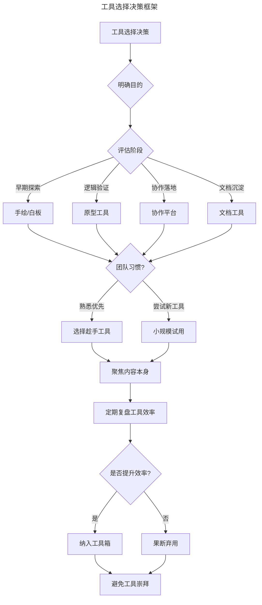
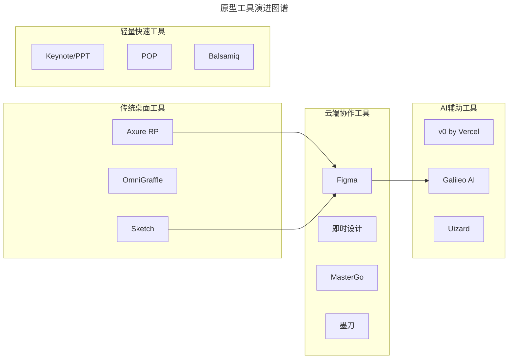
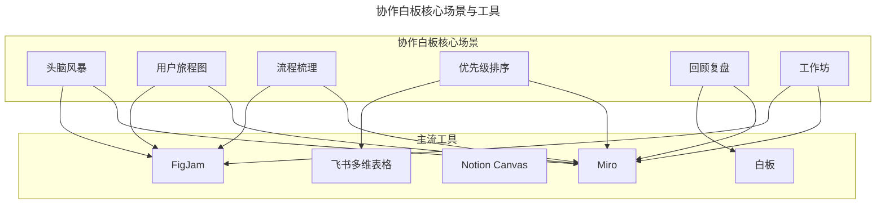
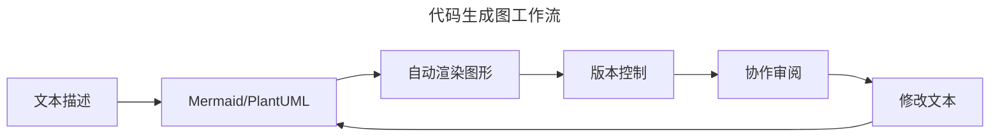
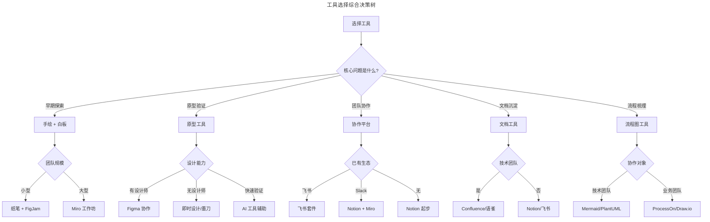

# 02 | 产品经理工具指南

> **适用范围**：产品经理（需要建立工具决策框架）、产品负责人、需要做原型/文档/流程图/协作的团队成员。适用于工具选型、原型制作、协作流程搭建、AI 辅助设计等场景。
>
> **更新摘要（v2 · 2026-08 更新）**：
> - 结构化升级为 6 节骨架（导言 / 核心方法论 / 关键流程 / 工具与实战 / 常见误区 / 进阶延展）
> - 保留 Figma、即时设计、MasterGo、Miro、FigJam、v0、Galileo AI、Uizard 等 2026 年主流工具全景
> - 保留全部 Mermaid 图并补充 `--- title: ... ---` frontmatter，每张图后追加文字解读

---

## 1. 导言

产品经理在日常工作中会用到大量的软件工具，每种工具都有它适合的场景。所谓"工欲善其事，必先利其器"，恰当地选择不同的工具，对产品经理来说非常重要。每种工具的背后也对应着产品经理相应的技能以及思考。

在 AI 与云协作工具快速迭代的今天，工具生态发生了巨大变化。本文将从工具选择哲学出发，系统梳理产品经理的工具箱，帮助你建立清晰的工具决策框架。

> **核心摘要**：产品经理的工具选择应遵循"目的驱动、趁手为上、不被捆绑"的原则。工具是通向目的的路径，而非目的本身。在 AI 与协作工具快速迭代的今天，产品经理需要建立清晰的工具决策框架，在早期用手绘聚焦骨架，中期用原型验证逻辑，后期用协作工具推进落地。核心能力不在于熟练操作多少工具，而在于能否选择恰当的工具解决特定问题。

---

## 2. 核心方法论

### 2.1 工具选择的核心哲学

> **图解**：工具选择是一个动态决策过程，核心在于明确目的、匹配阶段、适应团队习惯。最终目标是让工具"隐形"，让使用者意识不到它的存在，得以全心全意聚焦于目标本身。

### 2.2 纸笔 + 扫描工具：早期探索的黄金组合

选择用纸笔主要有三个原因：

1. **沉浸感与注意力聚焦**：纸和笔像是身体的一部分，不需要用额外的精力考虑怎样使用，可以把所有的精力放到内容本身。在需要深度思考的场景下，纸笔的沉浸感是任何数字工具难以替代的。
2. **强制忽略细节**：纸的面积有限，而且笔头通常比较粗，所以在画图的时候不会被细节问题牵扯精力，可以把注意力放到产品逻辑骨架上。这是一种"约束即自由"的设计哲学——有限的画布反而激发了对核心结构的思考。
3. **避免设计倾向误导**：用手绘的方式做早期线框图还有个好处：它横不平竖不直，形式上足够随意，不会限制和误导设计师后期对页面的重新布局和设计。有时候即便是用软件画产品线框图，也会用素描风格，就是为了避免过早在设计上有所倾向。

**工具推荐**：

| 工具 | 平台 | 特点 | 适用场景 |
|------|------|------|----------|
| Scanner Pro | iOS | 边缘识别精准，对比度增强 | 纸稿数字化存档 |
| 扫描全能王 | 全平台 | OCR 识别，多格式导出 | 文档扫描归档 |
| 印象笔记扫描 | 全平台 | 与笔记系统无缝集成 | 灵感快速捕捉 |
| Apple Notes | iOS/Mac | 手写识别，iCloud 同步 | 快速手写记录 |

> **实践建议**：推荐尝试用铅笔。削铅笔的仪式感能暗示自己进入思考和工作的状态；铅笔划过纸面的声音比钢笔更舒适；还可以通过力度和角度调节笔划粗细和深浅。彩色铅笔则可以用来区分不同模块或优先级。

---

## 3. 关键流程

### 3.1 原型工具：从静态到动态的演进

原型工具是产品经理的核心武器，过去十年经历了从桌面软件到云端协作的范式转移。

**主流原型工具全景**：

> **图解**：原型工具正经历三大趋势——从桌面走向云端协作、从单一功能走向设计开发一体化、从手工绘制走向 AI 辅助生成。Figma 已成为行业标杆，AI 工具正在重塑早期原型的工作流。

**Figma：当前行业标准**——Figma 已从"挑战者"成长为设计协作领域的绝对主流。核心优势：实时协作（多人同时编辑）、跨平台（基于 Web，Windows/Mac/Linux 通用）、设计系统（组件库、样式库、变量系统）、Dev Mode（自动生成代码规格）、插件生态、FigJam（内置白板）。定价策略：免费版支持个人使用，专业版约 $15/月/人。使用建议：善用 Auto Layout、建立团队组件库、利用 Dev Mode 减少沟通成本、配合 FigJam 做前期梳理。

**国产设计工具崛起**：

| 工具 | 核心特点 | 适用场景 |
|------|----------|----------|
| **即时设计** | 完全免费、中文生态、插件丰富 | 国内中小团队、个人开发者 |
| **MasterGo** | 企业级协作、设计系统支持 | 大型企业、设计规范建设 |
| **墨刀** | 原型专注、移动端预览、团队协作 | 快速原型、移动应用设计 |

**传统工具的现状**——Axure RP（曾经的原型霸主，市场份额持续下滑，学习曲线陡峭，适合需要复杂交互逻辑的 To B 产品）；OmniGraffle（Mac 平台经典，仅支持静态原型，价格不菲）；Sketch（受 Figma 冲击市场份额大幅萎缩，跨平台协作能力是硬伤）；POP（轻量级，适合纸稿原型快速交互验证，但更新频率低）。

### 3.2 在线协作白板：团队协作的新基础设施

在线协作白板已成为现代产品团队的标配工具，支持头脑风暴、流程梳理、回顾复盘等多种场景。

> **图解**：协作白板已成为产品团队的核心工作空间。Miro 功能最全面，FigJam 与 Figma 生态无缝集成，国产工具（飞书、白板）在本地化体验上有优势。

**Miro**（功能最全面）：无限画布、丰富模板、集成生态（与 Jira/Slack/Notion 集成）、企业级功能（权限管理、SSO、审计日志）。

**FigJam**（Figma 生态协作白板）：设计工作流集成、轻量易用、互动功能（投票、表情反馈、计时器）。

**国产协作工具**：飞书多维表格（与飞书生态深度集成）、白板（腾讯生态、免费）、Notion Canvas（与 Notion 笔记联动）。

### 3.3 UML 与流程图工具

UML 是面向对象设计的产物，虽然完整 UML 规范使用频率下降，但其中的核心图示（类图、时序图、状态图）仍是产品经理的重要工具。

**代码生成图的兴起（Mermaid 与 PlantUML）**：

> **图解**：代码生成图工作流——文本描述→Mermaid/PlantUML→自动渲染图形→版本控制→协作审阅→修改文本，形成循环。**优势**：文本格式便于 Git 版本管理、修改即改图、与 Markdown 文档无缝集成。**劣势**：学习曲线、复杂图形表达受限、不适合非技术背景协作对象。

**工具选择**：Mermaid（Markdown 嵌入、版本可控，适合技术文档）；PlantUML（语法丰富、支持全 UML）；Draw.io（免费、功能全面）；ProcessOn（中文友好、模板丰富）；LucidChart（企业级、协作功能强）。

### 3.4 文档协作工具

现代产品团队的文档工作流已从"本地文件+邮件附件"演进为"云端协作+实时同步"：

| 工具 | 核心特点 | 适用场景 |
|------|----------|----------|
| **Notion** | All-in-one、数据库功能强大 | 个人知识管理、中小团队 |
| **飞书文档** | 企业级、与飞书生态集成 | 国内企业、已使用飞书的团队 |
| **Confluence** | 与 Jira 深度集成、企业级 | 大型技术团队、敏捷开发 |
| **语雀** | 阿里生态、知识库管理 | 国内团队、技术文档 |

**Notion 工作流建议**：使用数据库管理需求池、迭代计划；建立产品文档模板库；利用 AI 功能辅助写作和总结；与 Figma、Slack 等工具集成。

---

## 4. 工具与实战

### 4.1 AI 辅助设计工具：新范式崛起

AI 正在重塑原型设计的工作流，从"从零绘制"转向"描述生成+迭代优化"：

| 工具 | 核心能力 | 输入方式 | 适用场景 |
|------|----------|----------|----------|
| **v0 by Vercel** | 文字生成 UI 组件 | 自然语言描述 | 快速生成 React 组件 |
| **Galileo AI** | 文字生成高保真 UI | 自然语言描述 | 早期概念验证、灵感探索 |
| **Uizard** | 线框图转高保真 | 上传草图/截图 | 设计稿快速迭代 |
| **Figma AI** | 智能填充、自动布局 | 内置于 Figma | 设计效率提升 |

> **使用建议**：AI 工具适合早期探索，不应替代深度设计思考；生成的结果需要人工审视和优化；将 AI 视为"超级助手"而非"替代者"；关注版权和隐私政策，避免敏感信息输入。

### 4.2 思维导图：结构化思考的利器

产品经理经常需要结构化拆解思考，思维导图是一种很好的发散-聚类框架。

**主流思维导图工具**：XMind（全平台，模板丰富、免费版够用）；MindNode（Mac/iOS，界面简洁、Apple 生态深度集成）；MindManager（Windows，企业级、与 Office 集成）；Miro（Web，在线协作、无限画布）。

**使用技巧**：熟知快捷键（回车同级添加节点，Tab 添加子节点）；避免自动布局陷阱；善用浮动节点（记录暂时无法归类的想法）；与原型工具联动。

### 4.3 工具选择决策框架

> **图解**：工具选择应从问题出发，结合团队规模、已有生态、协作对象等因素综合决策。核心原则是"减少工具数量、强化工具深度"，避免工具碎片化带来的认知负担。

### 4.4 实战要点

| 要点 | 说明 | 适用场景 |
|------|------|----------|
| 目的优先 | 先明确要解决什么问题，再选择工具 | 所有场景 |
| 趁手为上 | 熟悉的工具胜过"更好"但不熟悉的工具 | 时间紧迫的项目 |
| 避免工具崇拜 | 工具玩得再溜也不可能成为产品专家 | 日常提醒 |
| 团队统一 | 团队使用统一工具降低协作成本 | 团队协作场景 |
| 定期复盘 | 每季度评估工具效率，果断弃用低效工具 | 工具管理 |
| AI 辅助 | 将 AI 工具纳入工作流，但保持审视 | 早期探索阶段 |
| 版本控制 | 重要文档和图示纳入 Git 管理 | 技术团队协作 |

---

## 5. 常见误区

| 误区 | 表现 | 正确做法 |
|------|------|---------|
| **工具崇拜** | 认为掌握工具越多越厉害 | 工具玩得再溜也不可能成为产品专家 |
| **追求最新工具** | 每出新工具就换，不熟悉却弃用旧工具 | 熟悉的工具胜过"更好"但不熟悉的工具 |
| **工具碎片化** | 每个场景用不同工具，增加认知负担 | 减少工具数量、强化工具深度 |
| **团队不统一** | 各用各的工具，协作成本高 | 团队使用统一工具 |
| **AI 替代思考** | 完全依赖 AI 生成的设计/原型 | AI 是"超级助手"而非"替代者"，需人工审视 |

---

## 6. 进阶延展

### 6.1 总结

熟练地使用工具是成为产品经理的必要条件，但使用工具本身并不是目的，工具只是通向目的的路径。

画家之所以伟大是因为画出了伟大的作品，而不是因为他能够熟练使用各种型号的画笔。楼下理发店的 Tom 和 Kevin 之所以能升总监，也是因为他们能给人剪好头发，而不是因为剪子玩儿得溜。工具是为我们服务的，不要成为它的奴隶。

在 AI 与协作工具快速迭代的今天，产品经理需要建立清晰的工具决策框架：早期用手绘聚焦骨架，中期用原型验证逻辑，后期用协作工具推进落地。核心能力不在于熟练操作多少工具，而在于能否选择恰当的工具解决特定问题，并让工具"隐形"，全心全意聚焦于目标本身。

### 6.2 延伸阅读

- 《设计工具的演进：从 Sketch 到 Figma》
- 《AI 辅助设计工具实践指南》
- 《Notion 产品经理工作流搭建》
- 《Mermaid 语法速查手册》
