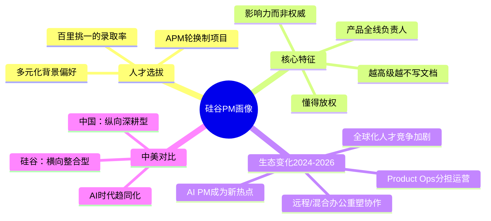
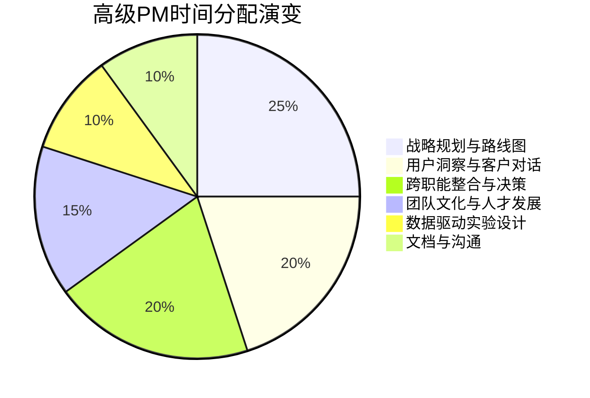
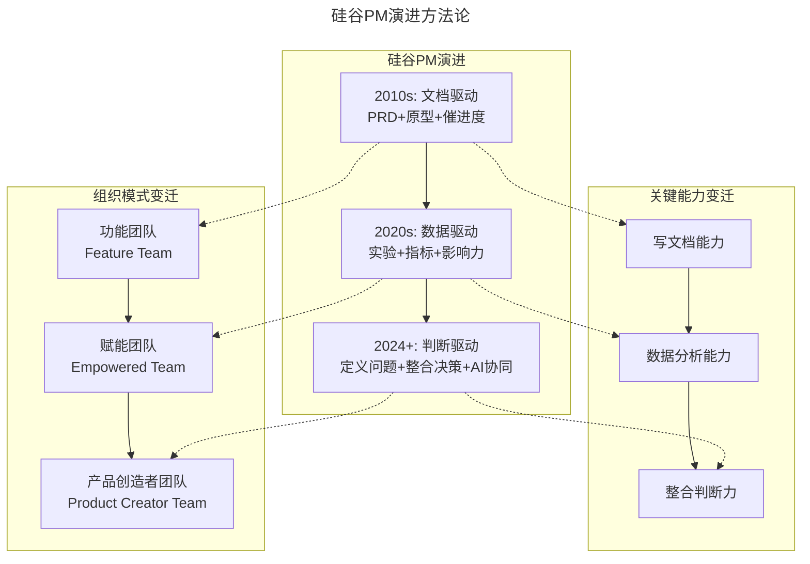

# 02 | 硅谷的产品经理是什么样子的？

> **适用范围**：产品经理（各阶段）、希望了解硅谷 PM 角色的从业者、需要借鉴硅谷经验的管理者。适用于角色认知、APM 培养项目借鉴、影响力领导、中美 PM 对比、AI 时代 PM 演进等场景。
>
> **更新摘要（v2 · 2026-08 更新）**：
> - 结构化升级为 6 节骨架（导言 / 核心方法论 / 关键流程 / 工具与实战 / 常见误区 / 进阶延展）
> - 保留 APM 项目、影响力领导、PM 比例、放权艺术、中美对比等核心内容
> - 保留全部 Mermaid 图并补充 `--- title: ... ---` frontmatter，每张图后追加文字解读

---

## 1. 导言

### 1.1 硅谷的产品经理热

如果你问斯坦福大学的大四学生，竞争最激烈的工作是什么？他们的答案已经不是投资银行分析师，或者麦肯锡的咨询顾问，也不是谷歌的工程师，而是：产品经理。

不仅是本科学生，斯坦福大学和哈佛大学的 MBA 毕业生也在疯狂地准备产品经理面试，而斯坦福大学商学院甚至开设了产品经理课程，这是史无前例的。这么多最优秀的学生的梦想，就是能进入谷歌的轮换制产品经理项目（Associate Product Manager Program，简称 APM 项目）。

### 1.2 核心导图

> **图解**：硅谷 PM 画像涵盖人才选拔（APM 项目、百里挑一录取率、多元化背景）、核心特征（影响力而非权威、产品全线负责人、越高级越不写文档、懂得放权）、生态变化（AI PM 热点、远程办公、Product Ops、全球化竞争）、中美对比（横向整合 vs 纵向深耕、AI 时代趋同）。

### 1.3 APM 项目：产品经理的"黄埔军校"

Yahoo 的前 CEO 玛丽莎·梅耶尔（Marissa Mayer）曾经在谷歌担任产品经理，她建立了谷歌后来闻名遐迩的 APM 项目，每年在全球挑选和培养三四十个刚毕业的、"最聪明"的年轻人，让他们一上来就直接带团队管产品。这些年轻人会得到对公司成功非常重要的顶级项目，并且会有专人对他们进行各方面的培训，还会组织一次环游世界的游学，玛丽莎亲自带领他们和世界各地的用户交流，拓展他们的视野。

这个项目培养出了一批硅谷的顶级产品领袖：红杉资本首位女性高级合伙人杰斯·李（Jess Lee）；Dropbox 的产品总监杰夫·巴蒂尔马（Jeff Bartelma）；Asana 的创始人贾斯丁·罗森斯坦（Justin Rosenstein）；被 Salesforce 以 7.5 亿美元收购的 Quip 的创始人、曾任 Facebook 首席技术官的布莱特·泰勒（Bret Taylor）；A/B 测试公司 Optimizely 的两位创始人丹·斯洛克（Dan Siroker）和皮特·库曼（Pete Koomen）。

在这之后，Facebook、LinkedIn、Uber 等公司开始建立了自己的产品经理项目，为期一到两年，项目结束之后，这些年轻人会立即被委以重任。

> **2026 年更新**：APM 项目依然是硅谷最抢手的入门通道，但竞争格局已经发生变化。Google、Meta 等公司的 APM 项目录取率依然极低（据行业估算低于 1%），但新的竞争者已经出现——Anthropic、OpenAI 等 AI 原生公司的 PM 岗位正在成为新一代毕业生的首选目标。2024-2025 年，AI 产品经理岗位需求增速高达 60%（据主流招聘平台数据），薪资比普通产品经理高 30%-50%。

### 1.4 为什么硅谷人会对产品经理抱有这么大的热情？

**首先是薪资。** 2016 年，美国的招聘网站 Hired 发布的薪水调查显示，在硅谷收入最高的职位并不是软件工程师，而是产品经理。苹果公司的高级产品经理年薪高达 17 万美元。到 2025-2026 年，据 levels.fyi 等薪酬数据平台显示，Google 的高级产品经理（L6/Senior PM）总薪酬可达 40-60 万美元，Staff PM（L7）可达 60-100 万美元，而 AI 方向的 PM 薪资溢价更为显著。

**其次是职业发展。** 很多 CEO 之前都是产品经理出身——Yahoo 的前 CEO 玛丽莎、谷歌的 CEO 桑德尔·皮蔡（Sundar Pichai）、盖茨的夫人梅琳达·盖茨全部都是产品经理出身。在谷歌、Facebook 这样的科技巨鳄中，产品经理可以一步步晋升到副总裁级别，并没有什么职业瓶颈。而如果你选择创业，产品经理所需要的技能和创业公司的 CEO 非常匹配，所以产品经理又是很好的创业训练营。**很多硅谷的人说，产品经理是离 CEO 最近的职位。**

> **2026 年补充**：在 AI 时代，"离 CEO 最近"这个说法有了新的含义。当构建变得容易时，决定"构建什么"的判断力成为组织中最稀缺的能力，而 PM 正是这种判断力的承载者。Anthropic、OpenAI 等 AI 公司的 PM 直接参与模型能力与商业策略的对接，其战略影响力比以往更大。

---

## 2. 核心方法论

### 2.1 什么样的背景才能成为产品经理？

这个问题上，各个公司有各自的招聘哲学。谷歌的产品经理全部要求是技术背景出身，面试的内容也包括了编程面试。但是 Facebook 和 Uber 这样的公司，并没有对技术背景的硬性要求，而是喜欢招一些多元化背景的人。我在 Facebook 的同事有之前的职业音乐家、艺术家，也有投资银行家、咨询师、天使投资人、新闻记者等各行各业出身的人。

可以说，硅谷的产品经理尽管百里挑一，录取难度极高，但是还真没有一个固定的模板，要求一定是什么专业或者什么背景出身。

> **2026 年补充**：AI 时代对 PM 背景的要求正在发生微妙变化。虽然多元化背景仍然被重视，但"技术理解力"的门槛在提高。2025 年的招聘数据显示，AI PM 岗位普遍要求"熟悉大模型技术能力"、"理解模型能力边界"，这比 2017 年"了解 API 和数据库"的要求深了一个量级。但值得注意的是，**技术理解力 ≠ 计算机专业**——许多优秀的 AI PM 来自语言学、认知科学、统计学等非传统 CS 背景，他们的优势在于理解人机交互的本质。

### 2.2 影响他人，而不是直接管理

**从行政管理角度来说，产品经理需要的是影响他人，而不是直接管理他们。** 硅谷的很多公司，产品经理并不担任行政职务，也就是说工程师和设计师有各自的老板，并不汇报给产品经理。在 Facebook 和谷歌这样的公司，工程师导向的文化背景下，产品经理并不能要求工程师做什么工程师就照做。这就要求，**产品经理得晓之以情动之以礼，能够用诱人的未来蓝图、逻辑性的数据支持，和切实可行的运作方案，让工程师们受到启发，激发他们的工作热情和潜能，从而实现自己的产品蓝图。**

> **2026 年补充**：在赋能产品团队（Empowered Product Team）模型中，影响力领导有了更清晰的框架。PM 的角色不是分配任务，而是：定义需要解决的用户/业务问题；设定衡量成功的指标；让工程师和设计师自主决定解决方案；通过整合判断验证方案是否同时满足用户需求、技术可行性和商业可行性。这种模式在 Figma、Notion、Stripe、Linear 等新一代 SaaS 公司中被广泛采用。

### 2.3 PM 与工程师的比例：从 1:7 到动态配比

**产品经理和工程师们的比例，每个公司有所不同，但一般 7 个工程师对应一个产品经理算是一个比较常见的比例。**

> **2026 年补充**：这个比例在 AI 时代变得更加动态和情境化：

| 公司类型 | PM:工程师比例 | 原因 |
|---------|-------------|------|
| 传统 SaaS 公司 | 1:6-1:8 | 成熟产品，需求相对稳定 |
| AI 原生公司 | 1:4-1:6 | AI 产品不确定性高，需要更密集的 PM 参与 |
| 早期创业公司 | 1:10+ | 创始人/CEO 本身承担 PM 角色 |
| 平台/基础设施团队 | 1:12+ | 需求来自内部，PM 更多做协调 |
| 增长团队 | 1:3-1:5 | 实验密度高，需要 PM 密集驱动 |

值得注意的是，AI 时代出现了"PM 自己也能构建"的新现象——借助 AI 编程工具，PM 可以独立完成原型验证甚至小型功能的开发，这在一定程度上改变了 PM 与工程师的协作模式。

### 2.4 越高级的产品经理，越不会花大时间写需求文档

在硅谷，一个优秀的产品经理其工作不仅仅是写出一个完美的产品功能文档。实际上，越是高级的产品经理，越不会花大部分时间在写文档上。对他们来说，如何能够思考产品两年三年之后的长期计划，如何能够把一个产品领域分成几个不同的功能线，如何制定有效率、有创新能力的团队文化，让团队里的设计师、工程师、运营经理等能够最大限度发挥自己的工作积极性，如何管理一个不断扩大的产品团队等等，才是应该花时间的大头。

在 Facebook，你很少看到产品经理花很多时间画流程功能设计图，大部分时候产品经理会讲清楚产品解决的问题，如何衡量产品的成功标准，然后会和设计师们在白板面前写写画画，在沟通中设计产品的体验过程。

> **2026 年补充**：AI 时代让"不写文档"从一种高级 PM 的工作习惯变成了所有 PM 的生存策略。当 AI 可以在几分钟内生成 PRD 初稿、自动完成竞品分析、快速产出原型时，PM 如果还把核心竞争力放在"写文档"上，就是在和 AI 比拼它最擅长的领域。高级 PM 的时间分配正在向以下方向转移：

> **图解**：高级 PM 的时间分配——战略规划与路线图（25%）、用户洞察与客户对话（20%）、跨职能整合与决策（20%）、团队文化与人才发展（15%）、数据驱动实验设计（10%）、文档与沟通（10%），文档只占最小比例。

### 2.5 并非事无巨细，应该懂得放权

一个好的产品经理，知道什么决定需要自己拍板，什么决定可以交给团队的其他人完成。好的产品经理还是一个很好的沟通者，能够组织一个有效的产品设计会议，让工程师和设计师能够快速地了解彼此的限制条件，从而设计出投入最少、回报最大的产品功能体验。

> **2026 年补充**：放权的艺术在 AI 时代有了新的维度。PM 现在需要决定：哪些决策可以让 AI 辅助完成（竞品数据收集、用户反馈分类、A/B 测试结果分析）；哪些决策可以让团队自主完成（技术方案选择、UI 设计细节、实验参数调整）；哪些决策必须 PM 亲自把关（产品方向取舍、跨团队资源分配、商业模型调整、伦理与合规判断）。

---

## 3. 关键流程

### 3.1 中美产品经理对比：从差异到趋同

**传统差异**：

| 维度 | 硅谷 PM | 中国 PM |
|------|---------|---------|
| 职能范围 | 横向整合型：跨职能协调，偏战略 | 纵向深耕型：从需求到上线全链路负责 |
| 技术要求 | 部分公司要求 CS 背景，部分多元化 | 通常要求技术理解力，但更重业务敏感度 |
| 决策模式 | 影响力驱动，共识决策 | 更强的执行推动力，自上而下决策更常见 |
| 文档文化 | 轻文档，重沟通 | 重文档，PRD 精细化程度高 |
| 团队比例 | 1 PM : 6-8 工程师 | 1 PM : 3-5 工程师（PM 职责更广） |
| 用户研究 | 专职 UX Researcher 配合 | PM 常兼任用户研究 |

**差异背后的结构性原因**：
- **市场结构**：中国市场层次更丰富——人口数量众多，社会形态更多样，用户属性和行为差异大，PM 需要对细分场景有更深的理解。
- **组织文化**：硅谷的工程师文化更强，PM 需要通过影响力推动；中国公司的业务导向更强，PM 有更大的执行推动力。
- **发展阶段**：中国互联网经历了"Copy to China"到"Copy from China"的转变，PM 的角色也从执行者逐步升级为创新者。

### 3.2 AI 时代的趋同化趋势

2024-2026 年，中美 PM 角色正在出现趋同化：
1. **AI PM 的技能要求趋同**：无论中美，AI PM 都需要理解大模型能力边界、Prompt 设计、评测体系，这些技能要求是全球统一的。
2. **远程协作打破地域壁垒**：混合办公模式下，硅谷 PM 和中国 PM 面临的协作挑战越来越相似。
3. **PLG（Product-Led Growth）模式普及**：产品驱动增长的模式在全球范围内被采用，PM 的增长职责趋同。
4. **开源和全球化产品**：Notion、Figma、Linear 等全球化产品的 PM 需要同时理解多个市场。

### 3.3 全球化 PM 的新能力模型

对于总监级别的 PM，需要思考如何构建全球化产品团队：
- **文化智商（Cultural Intelligence）**：理解不同市场的用户行为差异，避免"一个产品打天下"的陷阱。
- **分布式团队管理**：跨时区、跨文化的团队协作能力。
- **本地化与全球化的平衡**：核心产品体验统一，但允许本地化适配。
- **合规与伦理的全球视野**：不同地区的数据隐私法规（GDPR、中国数据安全法等）对产品决策的影响。

---

## 4. 工具与实战

### 4.1 最新实践（2024-2026）

**趋势一：AI 原生公司的 PM 崛起**——Anthropic、OpenAI、Midjourney 等 AI 原生公司的 PM 角色与传统科技公司有显著不同：更强的技术理解力要求（需要理解 Transformer 架构、RLHF、模型评估等）；更频繁的模型能力与产品功能的对齐工作；更高的不确定性管理（模型能力在持续演进，产品策略需要动态调整）；更复杂的伦理与安全考量。

**趋势二：远程/混合办公重塑 PM 协作**——2020 年后的远程办公浪潮永久性地改变了 PM 的工作方式：异步沟通工具（Notion、Linear、Loom）取代了大量同步会议；文档文化从"轻文档"转向"结构化异步文档"——不是写更长的 PRD，而是写更清晰的决策记录；白板协作从物理白板迁移到 Miro、FigJam 等数字工具；PM 需要更刻意地创造"偶然碰撞"的机会，弥补远程办公中缺失的走廊对话。

**趋势三：Product Ops 分担 PM 运营负担**——Product Operations 作为独立职能的兴起，让 PM 从实验基础设施搭建和维护、数据管道和工具链标准化、跨团队流程优化、产品决策的数据支撑等事务中解放出来。这意味着 PM 可以更专注于战略判断和用户洞察——恰恰是 AI 最难替代的部分。

**趋势四：PM 的"构建者"身份回归**——2025 年，Marty Cagan 提出"Product Creator"概念，鼓励 PM 亲自使用 AI 工具构建原型。这不是让 PM 变成工程师，而是让 PM 能够更快地验证产品假设、更准确地评估技术可行性、更有效地与工程师沟通。

### 4.2 方法论全景图

> **图解**：硅谷 PM 演进从文档驱动（2010s）→数据驱动（2020s）→判断驱动（2024+），关键能力从写文档能力→数据分析能力→整合判断力，组织模式从功能团队→赋能团队→产品创造者团队，三者同步演进。

---

## 5. 常见误区

| 误区 | 表现 | 正确做法 |
|------|------|---------|
| **认为 PM 是管理者** | 把 PM 当工程师/设计师的行政上级 | PM 靠影响力而非权威推动决策 |
| **认为 PM 就是写文档** | 把核心竞争力放在写 PRD 上 | 越高级越不写文档，聚焦战略、团队、放权 |
| **事无巨细** | 每个决定都亲力亲为 | 懂得放权，明确哪些决策自己把关 |
| **追求统一模板** | 认为 PM 一定有固定背景模板 | 硅谷 PM 背景多元化，无固定模板 |
| **技术理解力 = 计算机专业** | 以为 AI PM 必须 CS 出身 | 技术理解力 ≠ 计算机专业，人机交互理解同样重要 |

---

## 6. 进阶延展

### 6.1 关键术语表

| 术语 | 英文 | 定义 |
|------|------|------|
| APM 项目 | Associate Product Manager Program | 硅谷顶级公司的产品经理轮换制培养项目，面向应届毕业生 |
| 赋能产品团队 | Empowered Product Team | PM 定义问题和成功指标，工程师与设计师自主决定解决方案的组织模式 |
| Product Ops | Product Operations | 负责实验基础设施、数据管道、跨团队流程标准化的独立职能 |
| Product Creator | 产品创造者 | AI 时代任何有产品感并能操作 AI 原型工具的人都可以充当的角色 |
| PLG | Product-Led Growth | 产品驱动增长，通过产品自身体验驱动用户获取、激活和留存 |
| 文化智商 | Cultural Intelligence | 理解不同文化背景下用户行为差异并据此调整产品策略的能力 |

### 6.2 思考题

1. **基础题**：如果你曾经和产品经理工作过（或者自己是产品经理），欢迎留言和我讲讲你见过的优秀产品经理最突出的特点是什么？你见过的最差劲的产品经理最大的缺点又是什么？
2. **进阶题**：在你的公司，产品经理是"横向整合型"还是"纵向深耕型"？这种模式的优势和劣势分别是什么？如果让你重新设计 PM 的角色边界，你会怎么调整？
3. **挑战题**：假设你是一家 AI 原生公司的 VP of Product，需要在中国和硅谷分别组建 PM 团队。你会如何设计两个团队的职责边界、招聘标准和协作模式？在 AI 时代，你认为中美 PM 的差异会继续扩大还是逐渐趋同？请给出你的论证。

### 6.3 延伸阅读

- Ken Norton, "How to Hire a Product Manager" (2005) — 产品经理招聘的经典文章
- Marty Cagan, *Inspired* (2nd Edition, 2017) — 第 4 章"Product Management in Technology Product Companies"
- Marty Cagan, "The Product Manager Contribution" (SVPG, 2023) — PM 四大知识贡献框架
- Lenny Rachitsky, "How the best product teams are structured" (*Lenny's Newsletter*, 2023)
- Shreyas Doshi, "The Product Manager's Career Path" — PM 职业路径的深度思考
- levels.fyi — 科技公司薪酬数据平台
