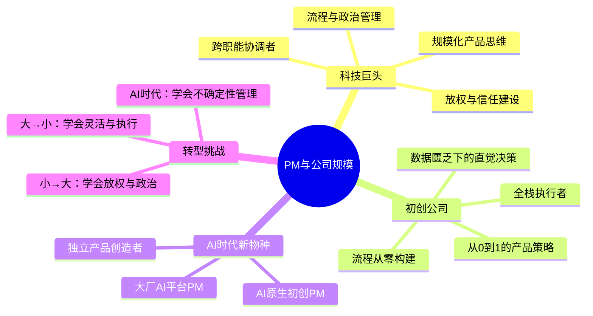
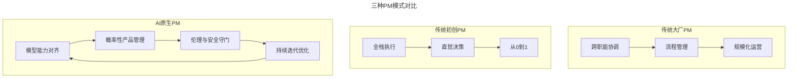
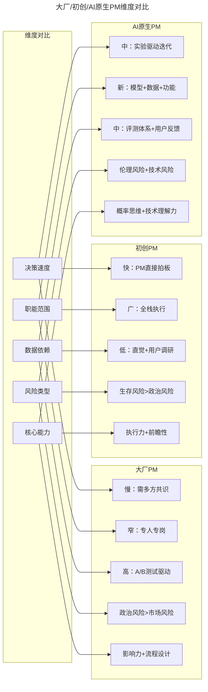
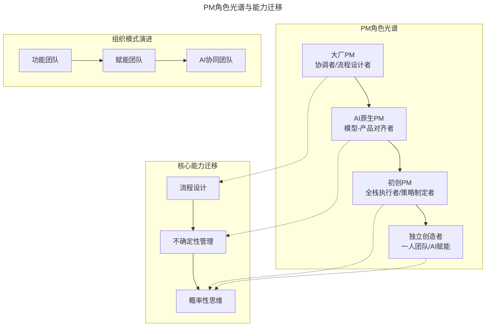

# 03 | 科技巨头和初创公司的产品经理有什么不同？

> **适用范围**：产品经理（各阶段）、考虑大公司/初创公司转型的从业者、AI 原生公司 PM。适用于角色认知、组织适应、大厂/初创对比、AI 时代 PM 新形态等场景。
>
> **更新摘要（v2 · 2026-08 更新）**：
> - 结构化升级为 6 节骨架（导言 / 核心方法论 / 关键流程 / 工具与实战 / 常见误区 / 进阶延展）
> - 保留大厂/初创/AI 原生三种模式对比与双向转型挑战
> - 保留全部 Mermaid 图并补充 `--- title: ... ---` frontmatter，每张图后追加文字解读

---

## 1. 导言

### 1.1 核心导图

> **图解**：PM 与公司规模的关系——科技巨头（跨职能协调者、流程政治管理、放权、规模化思维）、初创公司（全栈执行者、直觉决策、从 0 到 1、流程从零构建）、AI 时代新物种（AI 原生初创 PM、大厂 AI 平台 PM、独立产品创造者），以及双向转型挑战。

### 1.2 问题的提出

对于不同的公司来说，产品经理的定义可能会差非常多。在科技巨头当一个产品经理，和在一个刚刚成立的小公司做，需要的技能和要求其实非常不一样。

而在 2024-2026 年的 AI 时代，这种差异又有了新的维度——AI 原生初创公司（如 Anthropic、Midjourney）的 PM 角色，既不同于传统大厂 PM，也不同于传统初创公司 PM，形成了一种全新的"第三种模式"。

---

## 2. 核心方法论

### 2.1 在科技巨头做产品经理

像谷歌、Facebook 这样的公司，至少有几百个产品经理，上万名员工，一般每一个技能都会有专门的人来对应，而且划分得非常细。比如，单单市场营销我就有三个同事负责：一个人负责市场调查；一个人负责产品的发布策略；一个人负责新产品发布的用户文档、网站更新。所以，把所有的设计、工程、法律、市场、营销、运营、公关等等这些部门加在一起，负责我这边产品的人就可能有 40 多个。对于这么一个庞大的产品团队，这么细分的职能划分，我的工作是要知道什么时间让什么人做什么事，确保每个人的部分成功有机结合在一起。

### 2.2 大公司 PM 的核心挑战

**1. 放权与决策边界**：要思考怎样界定他们每个人工作的成功，什么决定需要我自己做，什么决定可以让大家去做。在这样一个很大的团队里，作为产品经理，我不可能每一个决定都亲力亲为，所以要知道什么时候可以放手。

**2. 流程设计与效率优化**：要思考怎样建立一个有效的、可持续的工作流程。比如，什么会应该找什么人来参加，不可能每个会都乌拉拉 40 个人全部参加。还有，在这些人有不同意见的时候，能不能有一个客观公正的做出决定的标准。

**3. 团队扩展与知识传承**：这么大的一个团队还有一个问题，就是总会有新人来，总会有旧人走。因此，怎样能快速帮助新人适应环境、了解产品的背景知识、快速上手，做好新人旧人之间的衔接非常重要。如果你在大公司做一个从 0 到 1 的产品，最常见的方式是先组一个非常小的团队试试手，一旦能够证明一定价值了，公司会立马增大投入，快速招人，所以很有可能一年内团队的规模就涨一倍。你要思考，这个时候怎样能够重新设定工作的流程、帮助更多的新人适应环境、在团队不断扩大的情况下仍能确保高效地做出决定。

**4. 办公室政治与利益平衡**：在一个大公司人很多，所以办公室政治肯定是不可避免的，特别是对于产品经理而言。很多时候，最困难的往往不是产品发布之后的外界反应，而是自己内部人的反应就已将你整得头大。或者，如果有一个非常好的项目，很快别的组就会纷至沓来要和你争一杯羹；还有可能，上司突然换了人，公司重点突然转移了，或者你的部门突然开始重组。在这些变化不断的内部环境中，如何才能让自己的团队稳定平和，反而成了一门艺术。所以一个好的大公司产品经理，非常擅长和他人找到利益的共同平衡点，不断制造双赢的机会，这样才能让你的职场生涯稳步向前。

### 2.3 在初创公司做产品经理

在小型初创公司做产品经理，讲究一个快狠准。公司每天都在生死存亡之间，甚至来不及招人，也没有一个成熟的新人培训体系，更没有一个清晰的职能划分，所以说每天产品经理都得"吃百家饭"做各种各样的事情，甚至很多时候都需要亲力亲为。

没有数据科学家？那就得自己做数据分析，Tableau、SQL 来一堆。没有设计师？很多产品经理自己就会画草图，让工程师比划比划也就这么发布了。这在大公司绝对是不可想象的。

### 2.4 初创公司 PM 的核心特色

**1. 快速学习，赶鸭子上架**：在初创公司做产品经理，能够快速地学习提高。赶鸭子上架，说来就来，快速学习一些新知识新技能，然后就可以马上拿来用，甚至是在使用中不断学习提高。

**2. 数据匮乏下的直觉决策**：在初创公司做产品经理，能够在数据缺乏的情况下利用用户调研等方式找到正确的方向。很多时候你做的产品可能本来也没有人用，做完之后还是没有人用，所以根本没有办法像大公司那样把 0.1% 的用户拿出来做对比实验，精准测试结果。所以这就倒逼产品经理要做很多的用户调研，亲自和用户沟通、问问题，找一些非常有创意的方式来快速证明你的假设，甚至很多时候还要相信自己的直觉。

**3. 前瞻性的产品策略制定**：初创公司做产品经理的另一个要求是，要非常有前瞻性，能够制定产品策略。大公司的很多产品经理，已经知道自己要做什么，如果你是做视频广告的，公司估计已经有了广告的策略，你只需要思考如何把它转化成视频。但是如果是小公司的产品经理，很多时候还没有一个固定的框架，你需要思考整个公司的框架应该怎么走，这样的思考其实是非常需要前瞻性的，你做的可能是很多大公司的高管才会做的事情。

**4. 从零构建工作流程**：对于初创公司的产品经理非常非常重要的是，公司是一个刚刚起步的阶段，可能缺乏最最基本的流程和工作方法。比如说，根本没有什么产品需求会，需要你从头开始设计；也没有什么工程经理，需要你充当工程经理的角色；也没有一个能够让大家认同的决策方式，甚至是产品发布这样的大事也就是按个按钮就发出去了。所以，产品经理需要有意识地设计能够让公司更高效地做出决定、让团队合作更默契的一些工作方式。

---

## 3. 关键流程

### 3.1 AI 时代的第三种模式：AI 原生公司 PM

2024-2026 年，一种新的公司类型出现了——AI 原生公司（AI-Native Company）。这些公司以大模型为核心产品，其 PM 角色既不同于传统大厂，也不同于传统初创公司。

> **图解**：三种 PM 模式——传统大厂（跨职能协调→流程管理→规模化运营）、传统初创（全栈执行→直觉决策→从 0 到 1）、AI 原生（模型能力对齐→概率性产品管理→伦理与安全守门→持续迭代优化，形成循环）。

### 3.2 AI 原生公司 PM 的独特挑战

**1. 模型能力与产品功能的持续对齐**：大模型的能力在不断演进，今天做不到的事情明天可能就能做到了，今天做得很好的事情明天可能就被新模型颠覆了。AI PM 需要持续跟踪模型能力的演进、动态调整产品路线图、在模型能力不确定的情况下设计灵活的产品架构。

**2. 概率性产品管理**：传统软件是确定性的——输入 A 必然输出 B。AI 产品是概率性的——同样的输入可能产生不同的输出。这意味着：传统的"功能完成"定义不再适用，需要定义"可接受的质量阈值"；测试从"验证功能正确性"变为"评估输出质量分布"；产品上线后需要持续监控和优化，而非"发布即完成"。

**3. 伦理与安全守门**：AI 产品的风险远高于传统软件——模型可能产生歧视性输出、泄露隐私、传播虚假信息。AI PM 需要：在产品设计中预置安全护栏；建立持续的内容审核机制；制定 Bad Case 的响应流程。

**4. 四类需求的并行管理**：AI PM 需要同时处理——数据需求（训练和评测数据的获取、清洗、标注）、模型需求（模型选型、微调策略、能力边界评估）、评测需求（建立评测体系、持续评估输出质量）、功能需求（用户界面、交互流程、产品功能设计）。

### 3.3 小公司到大公司

很多在科技巨头工作的产品经理们来自于小公司，甚至以前是初创公司的 CEO。他们中的很多人来到大公司之后，会感觉到文化上的不适应。我见过很多人，以前自己的公司做得非常好，卖了很多钱，但是来到大公司以后却水土不服，甚至没呆多久就黯然离开。

**不适应的原因**：① 办公室政治——不知道如何权衡不同部门之间的利益关系；② 过度亲力亲为——对每个小细节管得太多，反而让团队觉得没有发挥空间，导致效率低下；③ 向上管理不足——不知道什么事情该汇报，什么事情该自己决定。

**适应建议**：① 一开始放低姿态，努力学习，先和同事们建立良好的互信关系；② 积极向同事们寻求建议和反馈；③ 和新领导刚开始工作的时候，就问问老板他是什么风格，希望什么样的事情自己汇报。

> **2026 年补充**：AI 时代为"小到大"的转型增加了新的维度。大公司的 AI 产品团队通常有专门的算法工程师、数据科学家、ML 工程师等角色，PM 不需要亲自做模型训练，但需要理解模型能力边界、评估指标（如 F1-score、AUC、BLEU 等），以及如何在模型能力约束下设计产品体验。这种"技术理解力"的要求比传统大公司更高。

### 3.4 大公司到小公司

很多大公司的产品经理，会创建自己的公司，或者到初创公司担任产品经理的职位。他们中的很多人，同样会有很多不适应的地方。

**不适应的原因**：① 凡事过于讲流程、不够灵活；② 做事风格过于蜻蜓点水，执行能力比较差；③ 做决定的时候可能过于在乎让所有人满意，决断力上不敢发挥；④ 适应不了小公司每天做一百件杂事的环境。

**适应建议**：① 先融入小公司的工作环境，积极了解公司的文化；② 关注"当日事当日毕"，如果有的事情能够马上解决，就不要拖延；③ 不要觉得这件事不属于自己的份内事，就不需要自己做，遇到事情先主动承担。

> **2026 年补充**：AI 时代为"大到小"的转型带来了一个独特优势——AI 工具让小公司的 PM 可以拥有大公司级别的生产力。借助 AI 编程工具、AI 设计工具、AI 数据分析工具，一个 PM 可以完成以前需要整个团队才能完成的工作。这意味着从大公司到小公司的 PM，不再需要完全放弃大公司的工作方式，而是可以带着大公司的系统性思维，用 AI 工具弥补小公司的资源不足。

---

## 4. 工具与实战

### 4.1 三种模式的系统对比

> **图解**：三种模式在决策速度、职能范围、数据依赖、风险类型、核心能力五个维度上对比——大厂（慢/窄/高/政治风险/影响力）、初创（快/广/低/生存风险/执行力）、AI 原生（中/新/中/伦理技术风险/概率思维）。

**对比表**：

| 维度 | 大厂 PM | 初创 PM | AI 原生 PM |
|------|---------|---------|-----------|
| 决策速度 | 慢：需多方共识 | 快：PM 直接拍板 | 中：实验驱动迭代 |
| 职能范围 | 窄：专人专岗 | 广：全栈执行 | 新：模型+数据+功能 |
| 数据依赖 | 高：A/B 测试驱动 | 低：直觉+用户调研 | 中：评测体系+用户反馈 |
| 核心风险 | 政治风险 > 市场风险 | 生存风险 > 政治风险 | 伦理风险 + 技术风险 |
| 核心能力 | 影响力 + 流程设计 | 执行力 + 前瞻性 | 概率思维 + 技术理解力 |
| 产品定义 | 功能完成 = 发布 | 能用 = 发布 | 质量阈值达标 = 发布 |
| 迭代模式 | 版本发布 | 持续部署 | 持续监控+优化 |

### 4.2 最新实践（2024-2026）

**趋势一：独立产品创造者（Indie Product Creator）**——AI 工具的普及催生了一种新的 PM 形态。一个人借助 AI 编程工具、AI 设计工具和 AI 营销工具，可以完成以前需要 10 人团队才能完成的工作。这种模式特别适合验证产品假设的早期阶段、面向小众市场的垂直产品、个人品牌驱动的产品。

**趋势二：大公司的"内部创业"模式**——Google 的 Area 120、Meta 的 New Product Experimentation（NPE）等内部创业项目，试图在大公司内部复制初创公司的敏捷性。这些项目通常由小团队（3-5 人）独立运作、快速验证、PM 角色更接近初创公司 PM。

**趋势三：AI 原生公司的"模型-产品"双轮驱动**——Anthropic、OpenAI 等 AI 原生公司的 PM 需要同时理解模型能力和产品需求，形成"模型-产品"双轮驱动：模型能力突破→寻找产品应用场景；产品需求洞察→反向驱动模型能力优化。这种双向驱动是 AI 原生公司 PM 最独特的挑战。

### 4.3 方法论全景图

> **图解**：PM 角色光谱——大厂 PM（协调者/流程设计者）→AI 原生 PM（模型-产品对齐者）→初创 PM（全栈执行者/策略制定者）→独立创造者（一人团队/AI 赋能）；核心能力从流程设计→不确定性管理→概率性思维迁移；组织模式从功能团队→赋能团队→AI 协同团队演进。

---

## 5. 常见误区

| 误区 | 表现 | 正确做法 |
|------|------|---------|
| **小→大：过度亲力亲为** | 对每个细节管得太多，团队没发挥空间 | 学会放权，界定决策边界 |
| **小→大：忽视政治** | 不适应办公室政治，难以权衡部门利益 | 学会利益平衡，制造双赢机会 |
| **大→小：过于讲流程** | 凡事讲流程不够灵活，不适应动荡环境 | 融入小公司环境，主动提出有用流程 |
| **大→小：决断力不足** | 过于在乎让所有人满意，不敢冒险 | 敢于做风险大的决定，当日事当日毕 |
| **把 AI 当全能** | 以为 AI 工具能替代所有判断 | AI 是生产力放大器，但战略判断仍需 PM |

---

## 6. 进阶延展

### 6.1 关键术语表

| 术语 | 英文 | 定义 |
|------|------|------|
| 规模化思维 | Scale Thinking | 在设计产品功能时考虑可扩展性、可复用性和全球化适配的思维方式 |
| 政治资本 | Political Capital | 在组织中通过成功的产品发布和关系建设积累的信任和影响力 |
| 概率性产品管理 | Probabilistic Product Management | 针对 AI 产品输出不确定性的管理方法，定义质量阈值而非功能完成标准 |
| 模型-产品双轮驱动 | Model-Product Flywheel | AI 原生公司中模型能力突破与产品需求洞察相互驱动的循环模式 |
| 独立产品创造者 | Indie Product Creator | 借助 AI 工具独立完成产品设计、开发和发布的个人 PM |
| 质量阈值 | Quality Threshold | AI 产品中定义"可接受输出质量"的最低标准 |

### 6.2 思考题

1. **基础题**：如果你现在是一个大公司的产品经理，思考一下你如果跳槽到初创公司，可能会在哪些方面不适应？反过来呢？
2. **进阶题**：假设你是一家 AI 原生初创公司的第一个 PM，公司刚完成种子轮融资，核心产品是一个 AI 写作助手。你会如何设计前 3 个月的产品路线图？需要考虑哪些模型能力的不确定性？
3. **挑战题**：AI 工具正在模糊"大公司 PM"和"初创公司 PM"的边界——一个 PM 借助 AI 可以拥有以前整个团队的产出能力。你认为这种趋势会如何改变 PM 的职业路径？未来是否会出现更多"一人产品团队"的模式？这对 PM 的能力要求会产生什么影响？

### 6.3 延伸阅读

- Marty Cagan, *Empowered* (2020) — 第 7 章"Product Teams in Startups vs. Large Companies"
- Ben Horowitz, *The Hard Thing About Hard Things* (2014) — 创业公司管理的经典
- Lenny Rachitsky, "How startup PMs differ from big tech PMs" (*Lenny's Newsletter*)
- Shreyas Doshi, "The Three Levels of Product Leadership" — 产品领导力的三个层级
- Elad Gil, *High Growth Handbook* (2018) — 高增长公司的管理指南
- Marty Cagan, "AI Product Management 2 Years In" (SVPG, 2025)
