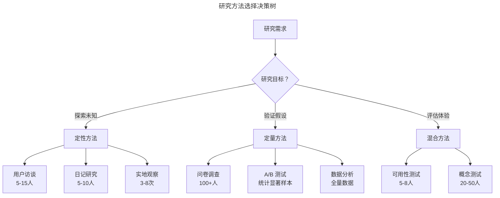
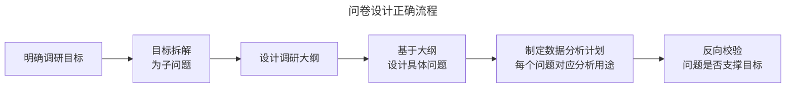
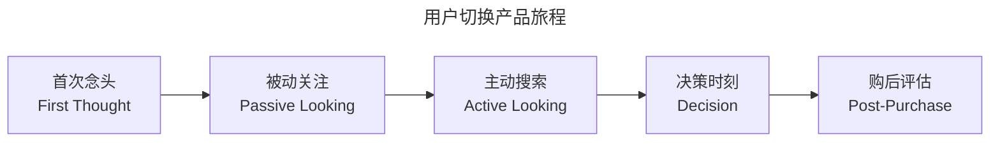
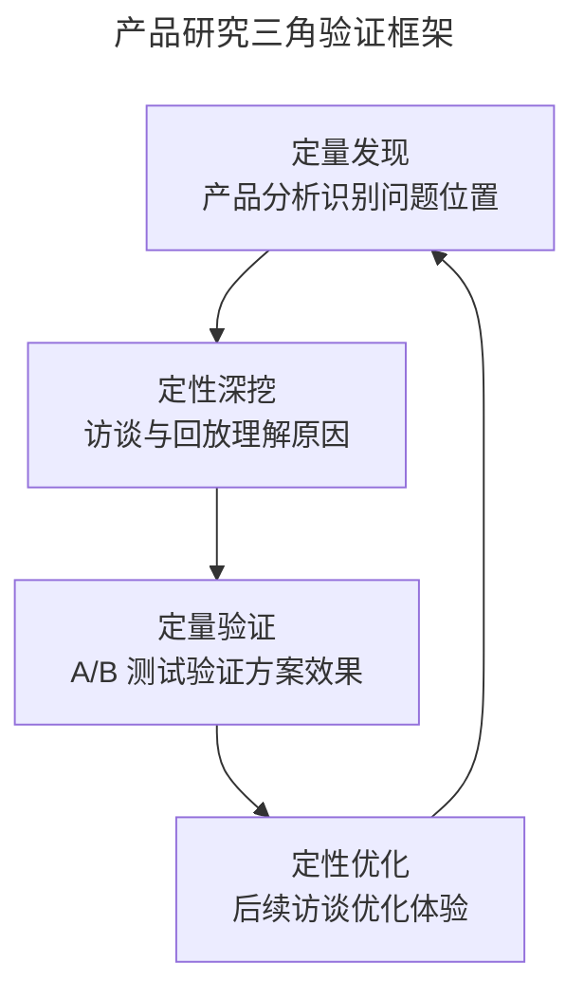

# 03 | 用户调研的方法论与陷阱规避

> **适用范围**：产品经理、用户研究员、需要验证产品创意的创业者。适用于用户研究方法选择、问卷设计、访谈技巧、AI 辅助研究等场景。
>
> **更新摘要（v2 · 2026-08 更新）**：
> - 结构化升级为 6 节骨架（导言 / 核心方法论 / 关键流程 / 工具与实战 / 常见误区 / 进阶延展）
> - 保留 The Mom Test、JTBD 访谈技术、Say-Do Gap 等核心方法论
> - 保留全部 Mermaid 图并补充 `--- title: ... ---` frontmatter，每张图后追加文字解读

---

## 1. 导言

用户调研是产品创意验证的关键手段，但调研结果的可靠性受制于多种认知偏差与方法论缺陷。

> **摘要**：本文系统梳理现代用户研究方法体系，从传统问卷到持续发现实践，深入分析社会期望偏差、假设性问题陷阱、引导性提问等核心问题，并结合 The Mom Test 方法论、JTBD 访谈技术、AI 辅助研究工具（2024–2026），提出"行为数据优先于陈述偏好"的研究原则与混合方法研究框架。

---

## 2. 核心方法论

### 2.1 用户研究方法体系

| 方法类型 | 代表方法 | 数据类型 | 适用阶段 | 样本量 |
|----------|---------|---------|---------|--------|
| 定性探索 | 用户访谈、日记研究、实地观察 | 定性 | 发现阶段 | 5–15 |
| 定量验证 | 问卷调查、A/B 测试、数据分析 | 定量 | 验证阶段 | 100+ |
| 混合方法 | 可用性测试、概念测试、焦点小组 | 混合 | 评估阶段 | 10–50 |
| 行为观测 | Session Replay、埋点分析、漏斗分析 | 定量 | 持续监控 | 全量 |

### 2.2 研究方法选择决策树

> **图解**：研究方法选择决策树——探索未知用定性方法（用户访谈、日记研究、实地观察），验证假设用定量方法（问卷、A/B 测试、数据分析），评估体验用混合方法（可用性测试、概念测试）。

### 2.3 持续发现（Continuous Discovery）

Teresa Torres 在 *Continuous Discovery Habits*（2021）中提出的产品研究新范式，将用户研究从"项目制"转变为"持续制"：

| 维度 | 传统项目制研究 | 持续发现 |
|------|--------------|---------|
| 频率 | 每季度 1–2 次 | 每周 2–3 次用户访谈 |
| 团队参与 | 研究员独立执行 | 产品三人组（PM + 设计师 + 工程师）共同参与 |
| 洞察分享 | 季度研究报告 | 实时共享至研究知识库 |
| 决策影响 | 研究报告可能被搁置 | 洞察直接驱动每周决策 |

### 2.4 The Mom Test 方法论

Rob Fitzpatrick 在 *The Mom Test*（2013）中提出的三条访谈规则，已成为产品研究的黄金标准：

| 规则 | 含义 | 反模式 |
|------|------|--------|
| 谈论他们的生活，而非你的创意 | 不推销想法，询问当前行为与痛点 | "你觉得这个想法怎么样？" |
| 询问过去的具体行为，而非未来的泛泛意见 | 过去行为是未来行为的最佳预测 | "你会使用这个功能吗？" |
| 少说多听 | 访谈者说话时间不超过 20% | 花大量时间解释产品概念 |

**好问题 vs 坏问题**：

| 坏问题 | 失败原因 | 好问题 |
|--------|---------|--------|
| "你觉得这是个好主意吗？" | 邀请观点与奉承 | "你目前如何解决这个问题？" |
| "你会买这个吗？" | 假设性，高估意愿 | "上次解决这个问题的花费是多少？" |
| "你想要什么功能？" | 用户不擅长设计解决方案 | "做这件事最困难的部分是什么？" |
| "你会使用一个能做 X 的产品吗？" | 抽象，无承诺 | "告诉我上次你尝试做 X 的经历" |

**验证阈值**：至少获得 3–5 个独立数据点（不同受访者）确认同一痛点，方可将其视为已验证。单一来源的痛点确认不具备决策参考价值。

### 2.5 JTBD 访谈技术

JTBD 的核心前提：用户不是购买产品，而是"雇佣"产品完成生活中的某个任务。理解任务（Job）而非产品类别，是创新的关键。

**Job Statement 格式**：**"当 [情境] 时，我想要 [动机]，以便 [期望成果]"**

| 好的 Job Statement | 差的 Job Statement |
|-------------------|-------------------|
| "当通勤时，我想要感到时间被有效利用，以便开始工作时感觉领先" | "我想要一个播客 App" |
| "当处理客户投诉时，我想要快速找到历史记录，以便一次性解决问题" | "我想要一个 CRM 系统" |

**进步四力模型（Four Forces of Progress）**——驱动或阻碍产品切换的四种力量：

| 力量 | 方向 | 含义 |
|------|------|------|
| 推力（Push） | 促进切换 | 当前方案的痛点与不满 |
| 拉力（Pull） | 促进切换 | 新方案的吸引力 |
| 焦虑（Anxiety） | 阻碍切换 | 对新方案的不确定性与担忧 |
| 惯性（Habit） | 阻碍切换 | 维持现状的舒适与惯性 |

**切换条件**：推力 + 拉力 > 焦虑 + 惯性

---

## 3. 关键流程

### 3.1 问卷设计的正确流程

**陷阱一：缺乏目标清单与分析计划**——在未明确调研目标与分析计划的情况下直接设计问卷，导致问题与目标脱节。

> **图解**：问卷设计正确流程——明确调研目标→目标拆解为子问题→设计调研大纲→设计具体问题→制定数据分析计划→反向校验问题是否支撑目标。核心是每个问题必须对应一个具体分析用途，无法回答"这个问题的答案将如何影响决策"的问题应被删除。

### 3.2 调研问卷的核心陷阱

**陷阱二：问题表述不当**——将调研目标直接转换为问题表述，要求受访者完成本应由调研者完成的信息提取工作。

| 错误示例 | 问题 | 正确替代 |
|----------|------|---------|
| "你通勤中的网络条件如何？" | 用户无法判断"网络条件" | "通勤中能否顺畅观看短视频？" |
| "你对这个功能满意吗？" | 满意度标准因人而异 | "过去一周你使用该功能几次？遇到了什么问题？" |
| "你觉得这个产品怎么样？" | 过于宽泛 | "上次使用类似产品时，最让你困扰的是什么？" |

**陷阱三：假设性问题**——对未曾经历的情境，人们无法准确预测自身行为。

| 假设性问题 | 为何无效 | 替代方案 |
|-----------|---------|---------|
| "如果产品能保证真货率，你会更愿意购买吗？" | 用户会美化选择 | "上次购买到假货时，你做了什么？" |
| "如果我们做这个功能，你会付费吗？" | 付费意愿 ≠ 付费行为 | "你目前解决这个问题的方案花了多少钱？" |

> **数据支撑**：元分析研究表明，陈述的购买意愿高估实际购买行为 2–5 倍（Say-Do Gap）。McKinsey/NIQ（2023）对 600,000+ SKU 的研究发现，65–80% 消费者声称愿意为可持续产品支付溢价，但实际仅 26% 付诸行动。

**陷阱四：引导性提问**——通过问题表述、上下文或排序暗示期望答案，使调研结果失去客观性。

| 引导方式 | 示例 | 修正 |
|----------|------|------|
| 立场嵌入 | "在房地产市场不景气的预期下，你认为买房是优质投资吗？" | "你如何看待当前房地产市场的投资价值？" |
| 情感暗示 | "每天通勤中大量时间被浪费，你是否愿意利用这段时间提升自己？" | "通勤中你通常做什么？是否希望有其他选择？" |
| 顺序引导 | 先问正面评价再问负面评价 | 随机化正负面问题顺序 |

### 3.3 Switch Interview（切换访谈）

由 Bob Moesta 和 Chris Spiek 发展的 JTBD 核心访谈技术，聚焦于用户"切换"产品的时刻：

> **图解**：用户切换产品旅程五阶段——首次念头→被动关注→主动搜索→决策时刻→购后评估，各阶段对应不同关键问题，如"你什么时候第一次意识到需要某个东西？""是什么让你选择了这个产品？"

---

## 4. 工具与实战

### 4.1 行为数据 vs 陈述偏好：Say-Do Gap 实证

| 研究领域 | 陈述偏好 | 实际行为 | 差距倍数 |
|----------|---------|---------|---------|
| 购买意愿 | 60–80% 表示愿意购买 | 实际购买率 | 2–5× 高估 |
| 可持续消费 | 65–80% 愿付溢价 | 26% 实际支付 | ~3× 高估 |
| 新功能使用 | 80%+ 表示感兴趣 | 实际使用率通常 <20% | 4× 高估 |

**实践原则**：
1. **永远不要仅依赖陈述偏好做 Go/No-Go 决策**，必须用行为数据三角验证。
2. **陈述偏好用于理解"为什么"**，行为数据用于理解"是什么"。
3. **联合分析（Conjoint Analysis）** 比直接偏好问题更可靠。
4. **A/B 测试** 是产品决策中揭示偏好（Revealed Preference）的金标准。
5. **代理行为指标**：若无法 A/B 测试，寻找现有行为代理。

### 4.2 AI 辅助用户研究工具矩阵（2024–2026）

| 类别 | 工具 | AI 核心能力 | 最佳场景 |
|------|------|------------|---------|
| 研究知识库 | Dovetail | 自动转录、AI 标签、情感分析、主题聚类 | 集中管理研究洞察 |
| 可用性测试 | Maze AI | AI 驱动的原型测试分析、热力图 | 快速原型验证 |
| 用户测试 | UserTesting AI | 视频会话自动提取关键片段、摩擦评分 | 视频类用户研究 |
| 微调研 | Sprig | AI 驱动的产品内微调研部署 | 持续收集用户反馈 |
| 研究综合 | Notably AI | AI 编码、自动主题生成、聚类分析 | 快速综合访谈数据 |
| 合成测试 | Synthetic Users | AI 模拟目标用户进行概念测试 | 早期概念筛选 |

### 4.3 混合方法研究框架

> **图解**：产品研究三角验证框架形成闭环——定量发现识别问题位置→定性深挖理解原因→定量验证方案效果→定性优化体验，再回到定量发现，实现持续迭代验证。

---

## 5. 常见误区

### 5.1 过度依赖问卷

问卷是成本最低但偏差最大的研究方法。核心局限：

| 局限 | 原因 | 应对策略 |
|------|------|---------|
| 社会期望偏差 | 受访者倾向于给出"正确"答案 | 匿名化、间接提问、行为数据交叉验证 |
| 情境缺失 | 问卷脱离真实使用场景 | 结合实地观察与行为数据 |
| 认知负荷 | 长问卷导致回答质量下降 | 控制在 5 分钟内 |
| 选择偏差 | 回答问卷的用户不代表目标群体 | 报告回应率，加权调整 |

> **优先级原则**：能用整体行为数据推断的，不做可用性测试；能做可用性测试的，不用调查问卷。行为数据（Revealed Preference）的可靠性是陈述偏好（Stated Preference）的 3–5 倍。

### 5.2 AI 辅助研究的关键警示

| 风险 | 说明 | 应对 |
|------|------|------|
| AI 幻觉 | AI 生成的研究洞察可能包含不存在的信息 | 人工审核所有 AI 生成结论 |
| 转录精度 | AI 转录在口音、专业术语场景下精度 85–95% | 关键访谈人工校对 |
| 隐私合规 | AI 工具处理用户数据需满足合规要求 | 选择合规工具，数据脱敏 |
| 合成用户局限 | AI 模拟用户不能替代真实用户验证 | 仅用于早期筛选，不用于最终决策 |

---

## 6. 进阶延展

### 6.1 前沿趋势与演进（2024–2026）

- **从问卷到持续行为观测**：Session Replay 工具（FullStory、PostHog）与产品分析平台（Amplitude、Mixpanel）结合，使团队可以在不干扰用户的情况下获取真实行为数据。
- **AI 主持的访谈**：Outset AI 可同时进行数百场结构化访谈。但 AI 访谈缺乏人类访谈者的即时追问能力与情感共鸣，适用于结构化信息采集，不适用于深度探索性研究。
- **隐私优先的研究设计**：第一方数据价值上升，第三方 Cookie 逐步淘汰；联邦学习（Federated Learning）与差分隐私（Differential Privacy）技术开始应用于用户研究场景。

### 6.2 参考文献

- Fitzpatrick, R. (2013). *The Mom Test*.
- Torres, T. (2021). *Continuous Discovery Habits*.
- Christensen, C. M. (2016). *Competing Against Luck*.
- Moesta, B. & Spiek, C. (2020). *Demand-Side Sales 101*.
- Presser, S. et al. (2004). *Methods for Testing and Evaluating Survey Questions*.
- McKinsey & Company / NIQ. (2023). *Consumers care about sustainability*.
- LaPiere, R. T. (1934). *Attitudes vs. Actions*.
