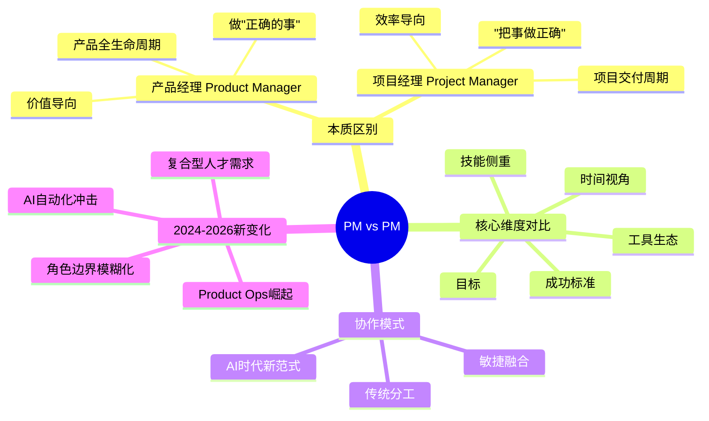
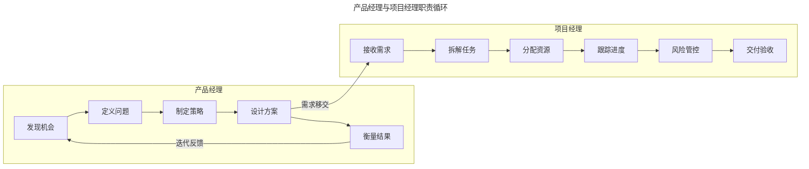
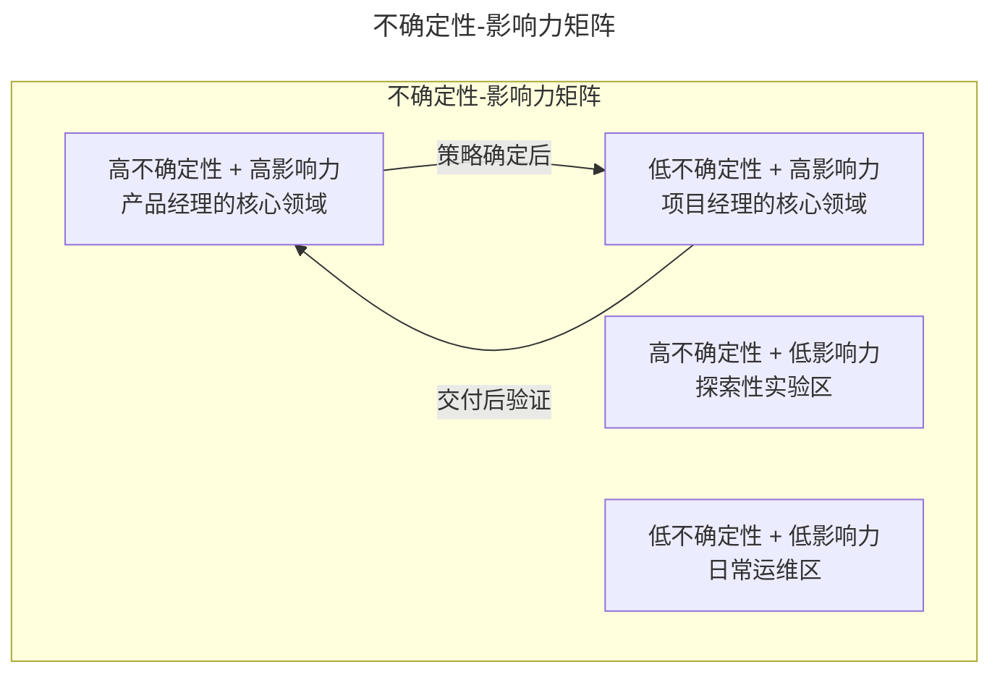
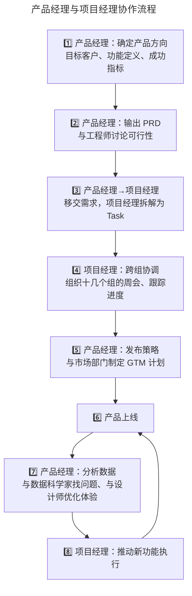
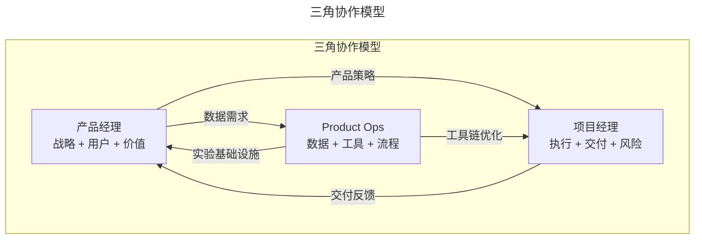
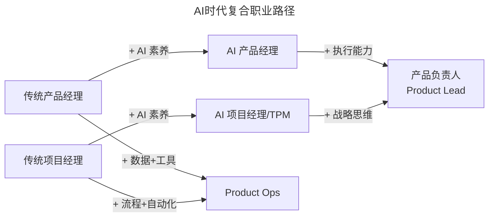

# 04 | 产品经理和项目经理有什么区别？

> **适用范围**：产品经理、项目经理、需要理解两者协作关系的从业者、考虑职业选择的求职者。适用于角色认知、职责分工、协作模式、AI 时代角色重构等场景。
>
> **更新摘要（v2 · 2026-08 更新）**：
> - 结构化升级为 6 节骨架（导言 / 核心方法论 / 关键流程 / 工具与实战 / 常见误区 / 进阶延展）
> - 保留"做正确的事 vs 把事做正确"本质区别与 PM vs PM 多维对比
> - 保留全部 Mermaid 图并补充 `--- title: ... ---` frontmatter，每张图后追加文字解读

---

## 1. 导言

产品经理（Product Manager）和项目经理（Project Manager），同样简称为 PM，却代表着截然不同的职业逻辑。在 AI 重塑工作方式的 2025 年，这两个角色的边界正在经历前所未有的模糊与重构。理解它们的区别，不仅是求职者的基本功，更是每一位从业者重新定位自身价值的前提。

### 1.1 核心导图

> **图解**：产品经理与项目经理的区别——产品经理做"正确的事"（产品全生命周期、价值导向），项目经理"把事做正确"（项目交付周期、效率导向）；并在 AI 时代经历角色重构（AI 自动化冲击、Product Ops 崛起、边界模糊化、复合型人才需求）。

---

## 2. 核心方法论

### 2.1 本质区别：做"正确的事" vs "把事做正确"

**产品经理：发现价值，定义方向**——产品经理的核心使命是带领产品团队做出正确决策，开发出用户想要的产品。他们的成败取决于产品的市场表现——可能只加了一个按钮，但这个按钮牵一发而动全身，瞬间带来百万用户增长，那这个产品经理就是成功的。产品经理的工作本质是在信息有限、方向不明确的情况下为团队指引方向：先做什么、后做什么、为什么这么做。产品经理通常固定在一个产品上，随着产品的不断发展，持续提升体验、增长用户。

> 🟢 **进阶视角（1-3 年）**：产品经理 = 需求翻译器 + 优先级裁判。你的核心工作是收集需求、写 PRD、排优先级，确保团队在做"最重要的事"。
> 🔵 **资深视角（3-5 年）**：产品经理 = 价值发现者 + 战略制定者。你不仅要回答"做什么"，更要回答"为什么做"和"如何衡量成功"。
> 🟣 **专家视角（5 年+）**：产品经理 = 商业模式架构师 + 组织能力设计者。在 AI 时代，你更是"人机协作的编排者"（Orchestrator）。

**项目经理：组织执行，确保交付**——项目经理的核心使命是组织团队在有限时间内按期完成复杂项目。很多科技公司的项目经理位于底层技术部门——底层架构、数据系统、基础设施等。这些部门的项目通常技术难度极高、依赖关系复杂，需要项目经理将大项目拆解为小任务，分配给最合适的工程师，并在某个工程师被阻塞时灵活调整任务分配，确保按期交付。项目经理的成功标准是能否按期、按质、按预算完成项目。

> **图解**：产品经理负责"发现机会→定义问题→制定策略→设计方案→衡量结果"的循环，项目经理负责"接收需求→拆解任务→分配资源→跟踪进度→风险管控→交付验收"的执行链，设计完成后需求移交项目经理，结果评估后迭代反馈产品经理。

### 2.2 另一类项目经理：流程运营者

还有一类项目经理不直接管理技术项目，而是组织工作流程。例如：一个 100 人的开发团队，会议应该怎么进行、多久开一次；一个几千人的地推团队，如何建立监督机制；预估公司下半年应该招多少人、预算是多少。这类项目经理更接近运营经理（Operations Manager），目标是设计一套高效方案，让工作快速推进。

### 2.3 核心维度对比

| 维度 | 产品经理 (Product Manager) | 项目经理 (Project Manager) |
|------|---------------------------|---------------------------|
| **核心问题** | 做什么？为什么做？ | 怎么做？什么时候做完？ |
| **成功标准** | 产品指标（DAU、留存、收入） | 项目指标（按时交付、预算控制） |
| **时间视角** | 长期（产品全生命周期） | 短期（项目交付周期） |
| **不确定性** | 高（方向未明，需探索） | 低（方向已定，需执行） |
| **核心技能** | 用户洞察、商业判断、数据驱动 | 资源协调、风险管控、进度追踪 |
| **工具生态** | Figma、Amplitude、Miro | JIRA、Linear、Asana、MS Project |
| **稳定性** | 相对固定在一个产品 | 经常切换不同项目 |
| **决策类型** | 战略性、方向性 | 战术性、执行性 |

**不确定性-影响力矩阵**：

> **图解**：不确定性-影响力矩阵——高不确定性+高影响力是产品经理的核心领域，低不确定性+高影响力是项目经理的核心领域。策略确定后从产品经理领域流向项目经理领域，交付后验证则反向流动。

> 🔵 **资深视角**：两者的分界线不在"做什么 vs 怎么做"，而在**不确定性管理**。产品经理管理的是"我们是否在做正确的事"（价值风险），项目经理管理的是"我们能否把事做对"（执行风险）。
> 🟣 **专家视角**：在 Empowered Product Team 模型下（Marty Cagan, 2023），产品经理定义的是**问题 + 成功指标**，而"怎么做"由工程师和设计师自主决定。这意味着传统的项目经理职能正在被重新分配。

---

## 3. 关键流程

### 3.1 经典协作流程

以作者在硅谷的实际经历为例，一个技术难度较高的产品，产品经理和项目经理的协作流程如下：

> **图解**：经典协作流程——产品经理确定方向→输出 PRD→移交需求给项目经理拆解 Task→项目经理跨组协调→产品经理制定发布策略→产品上线→产品经理分析数据→项目经理推动新功能执行，形成循环。这个流程揭示了关键模式：产品经理负责"发现问题→定义问题→衡量结果"的循环，项目经理负责"拆解任务→分配资源→确保交付"的执行链。

### 3.2 协作中的常见摩擦

| 摩擦点 | 根因 | 解决方案 |
|--------|------|----------|
| 需求频繁变更 | 产品经理未充分验证假设 | 建立 Discovery 阶段，上线前完成用户测试 |
| 交付时间与质量矛盾 | 项目经理过度压缩时间 | 引入 Sprint Review，让双方对质量标准达成共识 |
| 优先级冲突 | 两者衡量成功的标准不同 | 建立 OKR 对齐机制，确保项目目标服务于产品目标 |
| 信息不对称 | 产品经理不了解技术约束 | 邀请项目经理参与早期需求讨论 |

> 🟢 **进阶视角**：大部分团队没有专职项目经理，产品经理需要身兼两职。学会基本的项目管理技能（任务拆解、进度追踪、风险预警）是基本功。
> 🔵 **资深视角**：当团队规模扩大，产品经理应该主动争取项目经理支持。把执行协调工作交给项目经理，自己才能把更多时间投入产品策略和用户洞察。
> 🟣 **专家视角**：在 Spotify 的 Squad 模型和 Google 的 OKR 体系下，产品经理和项目经理的协作已经从"接力赛"变为"双人舞"。产品经理定义 Why 和 What，项目经理定义 How 和 When，两者在 Sprint Planning 和 Retrospective 中持续对齐。

### 3.3 Product Ops：第三种角色的崛起

在产品经理和项目经理之间，一个新角色正在快速崛起——**Product Ops（产品运营）**：

> **图解**：Product Ops 与产品经理、项目经理形成三角协作模型——产品经理提供产品策略给项目经理，提出数据需求给 Product Ops；Product Ops 提供工具链优化给项目经理、实验基础设施给产品经理；项目经理反馈交付结果给产品经理。

**Product Ops 的核心职责**：工具链管理（统一管理 Amplitude、Mixpanel、LaunchDarkly 等产品工具）；实验基础设施（搭建 A/B 测试平台，标准化实验流程）；数据管道（确保产品决策所需的数据及时、准确）；流程标准化（建立 PRD 模板、Review 流程、发布检查清单）。

---

## 4. 工具与实战

### 4.1 AI 自动化对项目经理的冲击

传统项目经理的大量工作——任务拆解、进度追踪、风险预警、会议组织——正是 AI 工具最擅长自动化的领域：

| 传统项目经理工作 | AI 自动化替代 | 2025 年成熟度 |
|-----------------|-------------|-------------|
| 手动拆解 Epic 为 Task | LLM 自动生成子任务 | ⭐⭐⭐⭐ |
| 每日站会跟进进度 | AI Agent 自动收集状态 | ⭐⭐⭐ |
| 识别进度风险 | 基于历史数据的预测模型 | ⭐⭐⭐⭐ |
| 跨团队会议组织 | AI 日程协调 + 自动纪要 | ⭐⭐⭐⭐⭐ |
| 资源分配优化 | 约束求解算法 | ⭐⭐⭐ |

> **关键趋势**：JIRA、Linear、Asana 等工具已深度集成 AI 功能。根据 Gartner 2025 年报告，超过 45% 的企业在使用 JIRA 三年后开始考虑替代方案，核心驱动力之一就是 AI 原生工具的崛起。

### 4.2 角色边界的模糊化

AI 时代，产品经理和项目经理的边界正在三个方向上模糊：

**方向一：产品经理向下延伸**——AI 工具让产品经理可以更高效地完成项目管理：Cursor 辅助写 PRD、Linear AI 自动排期、Notion AI 生成会议纪要。一个产品经理 + AI 工具 ≈ 产品经理 + 初级项目经理。

**方向二：项目经理向上延伸**——AI 项目经理需要理解算法逻辑、评估模型可行性、定义评估指标——这些原本是产品经理的领域。掌握 AI 技能的项目经理薪资比传统项目经理高出 30%-50%。

**方向三：新角色的诞生**——AI Product Manager（既懂产品又懂 AI 技术边界）；Technical Program Manager, TPM（在 Google、Meta 等公司，TPM 是产品经理和项目经理的融合体）；Product Ops（专注工具链和流程基础设施）。

### 4.3 AI 时代的能力模型对比

| 能力维度 | 传统产品经理 | 传统项目经理 | AI 时代融合趋势 |
|---------|------------|------------|---------------|
| 用户洞察 | ⭐⭐⭐⭐⭐ | ⭐⭐ | 产品经理核心壁垒，不可替代 |
| 商业判断 | ⭐⭐⭐⭐⭐ | ⭐⭐ | 产品经理核心壁垒，不可替代 |
| 执行协调 | ⭐⭐⭐ | ⭐⭐⭐⭐⭐ | AI 自动化替代 40%-60% |
| 风险管控 | ⭐⭐ | ⭐⭐⭐⭐⭐ | AI 预测模型替代 30%-50% |
| AI 素养 | ⭐⭐ | ⭐⭐ | 两者均需提升至 ⭐⭐⭐⭐ |
| 数据工程 | ⭐⭐⭐ | ⭐⭐ | Product Ops 承接 |
| Context Engineering | ⭐⭐ | ⭐ | AI 时代产品经理新核心技能 |

### 4.4 AI 时代的复合路径

> **图解**：AI 时代复合职业路径——传统产品经理加 AI 素养成为 AI 产品经理，传统项目经理加 AI 素养成为 AI 项目经理/TPM，两者进一步成长为产品负责人；或分别转向 Product Ops。

> 🟢 **进阶建议**：先在一个方向上建立扎实基础（产品或项目），再横向扩展。不要一开始就追求"全栈"。
> 🔵 **资深建议**：无论选择哪条路径，**AI 素养**是 2025 年的必修课。
> 🟣 **专家建议**：长期来看，**产品经理的不可替代性更高**——因为"发现正确的事"比"把事做正确"更难被 AI 替代。但项目经理如果能转型为 TPM 或 Product Ops，同样能找到高价值定位。

---

## 5. 常见误区

| 误区 | 表现 | 正确做法 |
|------|------|---------|
| **混淆两者** | 分不清"做什么"和"怎么做" | 产品经理管"做什么"，项目经理管"怎么做" |
| **忽视不确定性** | 只看到"做什么 vs 怎么做"表面区别 | 核心在于不确定性管理（价值风险 vs 执行风险） |
| **产品经理身兼多职不学项目管理** | 团队没专职项目经理就放弃管理技能 | 学会基本项目管理技能是基本功 |
| **项目经理死守传统** | 不拥抱 AI 自动化工具 | 掌握 AI 辅助项目管理工具，转型 TPM/Product Ops |

---

## 6. 进阶延展

### 6.1 方法论全景

```mermaid
---
title: 产品经理与项目经理方法论全景
---
flowchart TB
    subgraph 产品经理方法论
        A1[Discovery<br/>用户访谈/数据挖掘] --> A2[Definition<br/>PRD/Roadmap/OKR]
        A2 --> A3[Delivery<br/>Sprint/Review/GTM]
        A3 --> A4[Measurement<br/>指标体系/实验分析]
        A4 --> A1
    end
    subgraph 项目经理方法论
        B1[Initiation<br/>项目章程/范围定义] --> B2[Planning<br/>WBS/甘特图/资源分配]
        B2 --> B3[Execution<br/>站会/看板/风险日志]
        B3 --> B4[Monitoring<br/>EVM/里程碑评审]
        B4 --> B5[Closure<br/>复盘/知识沉淀]
        B5 --> B1
    end
    subgraph AI时代融合方法论
        C1[AI辅助Discovery<br/>LLM分析用户反馈] --> C2[AI辅助Planning<br/>自动生成WBS]
        C2 --> C3[AI辅助Execution<br/>Agent跟踪进度]
        C3 --> C4[AI辅助Measurement<br/>预测模型/异常检测]
        C4 --> C1
    end
```

> **图解**：产品经理方法论（Discovery→Definition→Delivery→Measurement 循环）、项目经理方法论（Initiation→Planning→Execution→Monitoring→Closure 循环），在 AI 时代融合为"AI 辅助 Discovery→Planning→Execution→Measurement"循环。

### 6.2 关键术语

| 术语 | 英文 | 释义 |
|------|------|------|
| 路线图 | Roadmap | 产品发展的时间线规划，展示优先级和里程碑 |
| 需求文档 | PRD (Product Requirements Document) | 产品经理输出的核心文档，定义产品做什么 |
| 工作分解结构 | WBS (Work Breakdown Structure) | 项目经理将大项目拆解为可管理任务的工具 |
| 技术项目经理 | TPM (Technical Program Manager) | 融合技术理解力和项目管理能力的复合角色 |
| 产品运营 | Product Ops | 专注产品工具链、数据管道、流程标准化的职能 |
| 挣值管理 | EVM (Earned Value Management) | 项目经理衡量进度和成本效率的方法 |
| OKR | Objectives and Key Results | 目标与关键结果，产品经理和项目经理的对齐工具 |
| 价值风险 | Value Risk | "用户是否会用"的风险，产品经理核心关注 |
| 执行风险 | Execution Risk | "能否按时交付"的风险，项目经理核心关注 |
| Context Engineering | 上下文工程 | AI 时代产品经理设计 AI 系统输入上下文的新技能 |

### 6.3 思考题

1. 🟢 **进阶题**：在你当前的工作中，你花更多时间在"做什么"还是"怎么做"上？这个比例是否合理？
2. 🔵 **资深题**：如果你的团队引入一个 Product Ops 角色，你会把哪些工作交给 ta？这会如何改变你和项目经理的协作方式？
3. 🟣 **专家题**：AI 自动化将替代项目经理 40%-60% 的执行协调工作。作为产品经理，你认为这会如何改变产品团队的组成和协作模式？产品经理是否需要重新定义自己的"不可替代性"？

### 6.4 延伸阅读

1. Marty Cagan, *Empowered: Ordinary People, Extraordinary Products* (2020)
2. Project Management Institute, *PMBOK Guide 7th Edition* (2021)
3. Teresa Torres, *Continuous Discovery Habits* (2021)
4. ProductOps.org, *Product Operations Maturity Model* (2024)
5. Gartner, *Software Engineering Platforms Hype Cycle* (2025)
