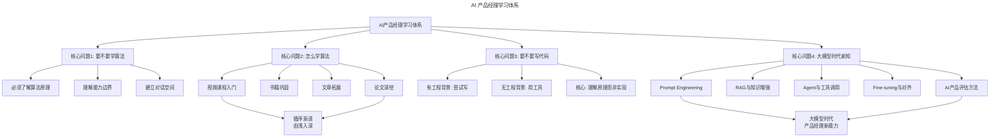
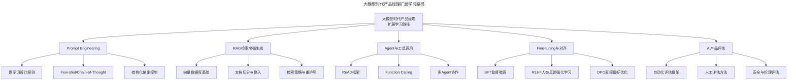
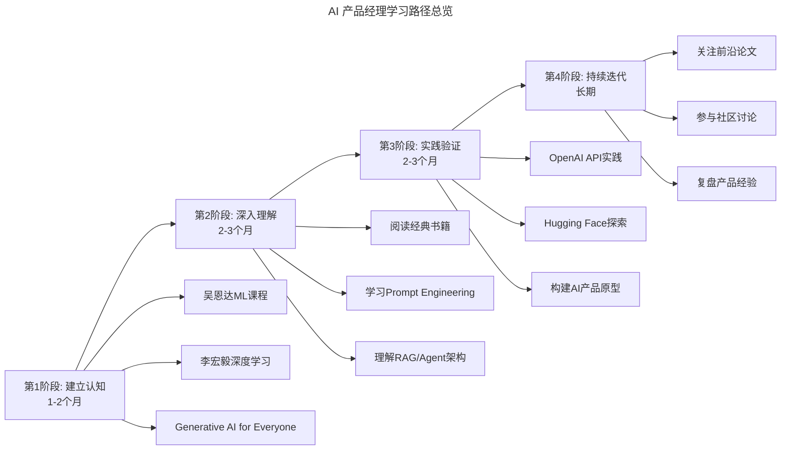

# 04 | 如何当好AI时代的产品经理？（学习篇）

> **适用范围**：AI 时代的产品经理、希望转型 AI 产品的从业者、需要建立 AI 技术认知的技术管理者。适用于 AI 知识学习路径、大模型技术理解、AI 产品设计等场景。
>
> **更新摘要（v2 · 2026-08 更新）**：
> - 结构化升级为 6 节骨架（导言 / 核心方法论 / 关键流程 / 工具与实战 / 常见误区 / 进阶延展）
> - 保留渐进式学习框架与 Prompt Engineering、RAG、Agent 等大模型时代关键知识
> - 保留全部 Mermaid 图并补充 `--- title: ... ---` frontmatter，每张图后追加文字解读

---

## 1. 导言

**"唯一能持久的竞争优势是胜过竞争对手的学习能力。"——盖亚斯**

在如今的科技行业中，人工智能的普及已成显著趋势，资本布局初具规模，从业者的梯队也逐渐形成。可以预见的一点是：在接下来相当长的一段时间内，人工智能会渗透到整个互联网行业中，成为业界标配。这种规模的技术变革，很可能会改变游戏规则，从而产生大量的新机会。

目前，人工智能还是一个学术密集型以及技术密集型的领域。大量的资讯和材料都指向了工程师受众。那么，对于产品经理来说，如何在这个领域中调整自己的认知和状态，跟上发展的节奏呢？

> **核心摘要**：AI 时代的产品经理必须了解算法——这不是可选项，而是必修课。随着大语言模型的爆发，AI 已从"隐藏在功能之下"变为"直接面向用户"的交互范式，产品经理的学习路径也需随之升级。本文构建了从视频课程→书籍→论文→实践工具的渐进式学习框架，并针对大模型时代新增了 Prompt Engineering、RAG、Agent 等关键知识领域，帮助产品经理建立与工程师对话的话语空间。

> **图解**：AI 产品经理学习体系围绕四大核心问题展开——要不要学算法、怎么学算法、要不要写代码、大模型时代新知。前三个是经典框架，第四个是本次更新新增的大模型时代维度。

---

## 2. 核心方法论

### 2.1 第一个问题：AI 时代的产品经理，要不要学算法

**基础层：为什么必须了解算法**——在过去的时代里，技术体系相对成熟，对产品经理来说有很多手段可以了解技术的能力和边界。但在人工智能时代，很多手段失效了，因为人工智能的能力大都隐藏在我们能感知到的功能之下，很难从场景出发理解内部机制。**想要做人工智能的产品经理是必须要了解算法的。**

**进阶层：大模型时代的认知升级**——2022 年之后，大语言模型（LLM）的出现使 AI 能力不再"隐藏在功能之下"，ChatGPT 直接以对话形式面向用户。但这带来一种**更危险的错觉**：你以为你理解了，其实你只理解了表面。如果你不了解 Token 机制、上下文窗口、温度参数、幻觉问题等底层概念，就无法设计出可靠的 AI 产品。

**高阶层：从"了解算法"到"理解 AI 系统"**：

| 认知层次 | 传统 AI 时代 | 大模型时代 |
|---------|-----------|-----------|
| L1: 感知 | 使用 AI 产品 | 使用 AI 产品 + 理解 Prompt |
| L2: 理解 | 了解算法原理和边界 | 理解模型能力、限制与对齐 |
| L3: 设计 | 设计算法产品化方案 | 设计 AI 系统架构（RAG/Agent/Pipeline） |
| L4: 评估 | 评估算法效果指标 | 评估 AI 系统整体质量（含安全/伦理） |

### 2.2 第三个问题：要不要真的写程序

**基础层：量力而行**——如果你之前就有工程能力，就尝试着写一点；如果完全没有相关背景，不写也罢。如果要写，千万不要写具体的算法实现，直接调用成熟框架用 Scikit-Learn 跑个聚类，或用 NLP 框架跑个 NER 看看结果。

> **核心观点**：产品经理与工程师最大的差异就是我们不需要写程序。我们的核心价值也不在这里，我们要掌握的不是细节和实现，而是要明白每种算法背后的原理、机制和边界。只有这样，才能跟工程师站到同一个话语空间中，去实际推进具体的产品工作。

**进阶层：大模型时代的"写代码"新范式**——过去写代码意味着从零实现算法，门槛极高；现在大模型本身就可以帮你写代码。产品经理可以通过以下方式低成本实践：
- **OpenAI API / Claude API 直接调用**：几行代码就能调用 GPT-4 或 Claude 的能力，快速验证想法。
- **Hugging Face 生态**：在 Models 页面体验开源模型、在 Spaces 体验 AI 应用、使用 Inference API 快速测试模型效果。
- **LangChain / LlamaIndex**：LangChain 编排 LLM 调用链构建 Agent；LlamaIndex 专注于 RAG 场景。
- **无代码/低代码 AI 工具**：OpenAI Playground、Dify/Coze（可视化构建 AI 应用）、Flowise、Streamlit。

**高阶层：从"写不写代码"到"如何验证假设"**：

| 验证方式 | 门槛 | 速度 | 可信度 | 适用场景 |
|---------|------|------|--------|---------|
| 纸面推演 | 极低 | 极快 | 低 | 早期想法筛选 |
| Prompt 实验 | 低 | 快 | 中 | LLM 能力验证 |
| 无代码工具 | 低 | 快 | 中 | 交互原型验证 |
| API 调用 | 中 | 中 | 较高 | 技术可行性验证 |
| 完整原型 | 高 | 慢 | 高 | 用户测试 |

> **关键洞察**：大模型时代，产品经理的"技术门槛"实际上降低了——你不需要理解算法的数学原理，也能通过 Prompt 和 API 快速验证产品想法。但"认知门槛"反而提高了——你需要理解 AI 系统的整体架构、限制和风险，才能设计出可靠的产品。

---

## 3. 关键流程

### 3.1 第二个问题：产品经理怎么学算法

**渐进式学习路径**（从视频开始）：先假设产品经理没有很强的数学和工程背景，需要理性设置学习目标、调整学习心态。

**视频课程推荐（2026 年更新版）**：

| 课程 | 讲师 | 特点 | 适合人群 |
|------|------|------|---------|
| Machine Learning Specialization | 吴恩达 | 深入浅出、体系完整 | 零基础入门 |
| Deep Learning Specialization | 吴恩达 | 深度学习系统课程 | 有 ML 基础后进阶 |
| 机器学习/深度学习 | 李宏毅 | 中文授课、案例生动、紧跟前沿 | 中文用户首选 |
| CS229 | 斯坦福 | 更偏学术、数学要求较高 | 有数学基础者 |
| Generative AI for Everyone | 吴恩达 | 专注生成式 AI、非技术向 | 产品经理/管理者 |
| ChatGPT Prompt Engineering | OpenAI + DeepLearning.AI | 实战导向、API 使用 | 需要实操能力者 |

**学习方法要点**：初看视频会痛苦，先囫囵吞枣，坚持过去；看完视频趁热打铁读机器学习相关的书，一次多买几本交叉阅读；之后大量阅读与实践相关的文章（中英文并重）；遇到感兴趣的领域读一点论文，先读综述（搜"关键词+综述"或"关键词+Review"），点到为止不要太求甚解。

### 3.2 大模型时代的学习路径扩展

> **图解**：大模型时代产品经理扩展学习路径覆盖五大领域——Prompt Engineering（提示词设计、Few-shot/Chain-of-Thought、结构化输出）、RAG（向量数据库、文档切分、检索策略）、Agent（ReAct、Function Calling、多 Agent 协作）、Fine-tuning 与对齐（SFT、RLHF、DPO）、AI 产品评估（自动化/人工/安全伦理评估）。

**1. Prompt Engineering（提示词工程）**——大模型时代产品经理最核心的新技能，不是简单的"写提示词"，而是一套系统性的方法论：零样本/少样本提示、思维链提示（Chain-of-Thought）、结构化输出控制（JSON Mode/Function Calling）、提示词模板设计与版本管理。

**2. RAG（检索增强生成）**——当前构建 AI 产品最主流的架构范式之一。产品经理需要理解：为什么纯大模型不够（知识截止、幻觉问题、私有数据）、向量数据库的基本概念、文档切分策略的影响、检索策略（稠密检索、混合检索、重排序）。

**3. Agent 与工具调用**——AI Agent 是大模型时代的产品新范式，需要理解 ReAct 框架（推理 + 行动的循环）、Function Calling（让大模型调用外部工具）、多 Agent 协作、Agent 的可靠性与可控性设计。

**4. Fine-tuning 与对齐**——产品经理不需要亲自做微调，但需要理解不同方案的适用场景：

| 方案 | 适用场景 | 成本 | 数据需求 |
|------|---------|------|---------|
| Prompt Engineering | 快速验证、简单任务 | 极低 | 无 |
| RAG | 需要外部知识、私有数据 | 低 | 文档数据 |
| SFT 微调 | 特定领域、风格定制 | 中 | 千级高质量 QA 对 |
| RLHF/DPO 对齐 | 价值观对齐、安全控制 | 高 | 万级偏好数据 |
| 预训练 | 基础能力构建 | 极高 | 万亿级 Token |

---

## 4. 工具与实战

### 4.1 AI 产品经理学习路径总览

> **图解**：AI 产品经理学习路径四阶段——建立认知（1-2 个月，吴恩达 ML、李宏毅深度学习、Generative AI）→ 深入理解（2-3 个月，经典书籍、Prompt Engineering、RAG/Agent 架构）→ 实践验证（2-3 个月，OpenAI API、Hugging Face、构建原型）→ 持续迭代（长期，前沿论文、社区讨论、复盘经验）。

### 4.2 实战要点

| 要点 | 说明 | 适用场景 |
|------|------|----------|
| 必须了解算法 | 不需要实现，但必须理解原理和边界 | 与工程师沟通、产品可行性判断 |
| 渐进式学习 | 视频→书籍→文章→论文，不要跳步 | 制定个人学习计划 |
| 大模型新知必学 | Prompt Engineering、RAG、Agent 是 AI 产品经理新基本功 | AI 产品设计 |
| 量力而行写代码 | 有背景就写，没背景用无代码工具 | 技术实践 |
| 快速验证假设 | 用最低成本验证产品想法，代码只是手段之一 | 产品探索期 |
| 警惕"可感知性错觉" | 能用 AI 产品 ≠ 理解 AI 系统，需要深入底层概念 | 避免设计缺陷 |

---

## 5. 常见误区

| 误区 | 表现 | 正确做法 |
|------|------|---------|
| **陷入"可感知性错觉"** | 以为能用 AI 产品就等于理解 AI 系统 | 深入理解 Token、上下文窗口、幻觉等底层概念 |
| **死磕数学原理** | 试图读懂的算法书里"显而易见"的结论 | 跳过数学推导，聚焦原理、机制和边界 |
| **从头写算法** | 从零实现 SVM 或神经网络 | 调用成熟框架，聚焦理解而非实现 |
| **读论文死磕** | 看不懂论文还硬啃 | 先读综述，点到为止，不懂就跳过换一篇 |
| **忽视 AI 非技术维度** | 只关注技术忽略合规、安全、伦理 | 关注数据合规、AI 安全、AI 伦理、商业模式 |

---

## 6. 进阶延展

### 6.1 构建 AI 产品经理的知识体系

大模型时代的产品经理需要构建一个"T型"知识结构：
- **横向**：对 AI 技术全貌有基本认知（ML→DL→LLM→多模态→Agent）。
- **纵向**：在自己负责的产品领域有深度理解（如 NLP、CV、推荐系统等）。

同时关注 AI 的非技术维度：数据合规（个人信息保护法、GDPR）、AI 安全（提示注入攻击、数据泄露、模型越狱）、AI 伦理（偏见与公平性、透明度、可解释性）、商业模式（Token 计费模型、AI 产品成本结构）。

### 6.2 延伸阅读

- 吴恩达 Machine Learning Specialization（2022 新版）—— Coursera
- 李宏毅机器学习/深度学习课程（2024-2025 更新版）—— YouTube/B 站
- OpenAI Prompt Engineering Guide—— 官方最佳实践
- 《Build a Large Language Model (From Scratch)》—— Sebastian Raschka
- LangChain 官方文档—— 理解 AI 应用编排
- Hugging Face Course—— 开源模型生态入门
- 《AI 产品经理实战手册》—— 系统性 AI 产品设计方法论
