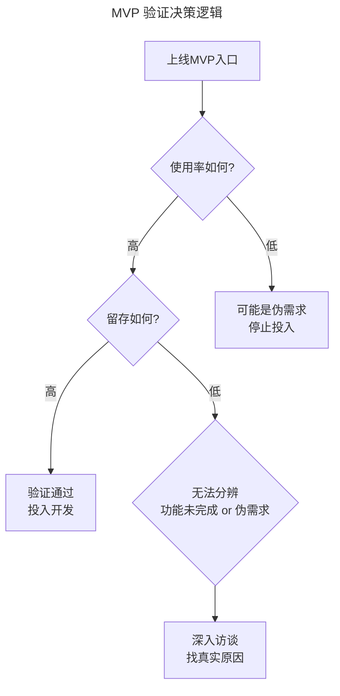

# 04 | 用最少的资源给你的产品试试水

> **适用范围**：产品经理、创业者、需要验证产品创意的团队负责人。适用于 MVP 验证、伪需求识别、用户动机测试、产品商业化验证等场景。
>
> **更新摘要（v2 · 2026-08 更新）**：
> - 结构化升级为 6 节骨架（导言 / 核心方法论 / 关键流程 / 工具与实战 / 常见误区 / 进阶延展）
> - 保留"未完成的功能键"、伪需求识别、商业化验证三大主题
> - 补充 AI 时代 MVP 验证的更新视角

---

## 1. 导言

如果前面的信息收集、沙盘推演和做调研都算是纸上谈兵的话，这一部分则是到了真刀真枪动手的阶段。只不过在全面投入和集团军作战之前，我们通常需要用尽可能少的资源去试试水，验证我们在做推演阶段的一系列假设。

**MVP 是最小可用产品（Minimum Viable Product）的首字母缩写**，意思是：剧烈缩减产品范围，用最少的资源构建出符合预期的最小功能集合并投入验证。

从产品经理的视角来看，就是围绕一个核心问题，创造性地提供解决方案，实现一到两个核心用例。以验证这个核心问题是真实存在的，或者解决方案是用户喜闻乐见的。

MVP 算是精益思想在科技行业中的一种应用方法论，核心是：不断用尽可能少的投入创造尽可能多的价值。说白了就是：走一步看一步，不憋大招，低头拉一步车，抬头看一步路。

市面上介绍 MVP 的书或资料已经有很多，再写也很难写出新意，所以，我这次打算通过几个案例，试着介绍一下 MVP 作为一个工具，怎样在我们的产品规划和设计过程中为我们创造价值。

---

## 2. 核心方法论

### 2.1 未完成的功能键

第一个案例是我很久以前在书上看到的，说的是维珍航空计划在自己的机上娱乐系统中加入一个新功能，为了测试乘客是否真的会对这个功能产生兴趣，设计人员在还没有设计任何功能的情况下，就向菜单中添加了一个入口按钮。如果真的有乘客点到了这个按钮，系统会显示："该功能尚未完成，或许下一次搭乘维珍航空的班机时你就可以使用它了。"通过这个按钮的点击率数据，来验证用户动机和需求。

类似的快速验证案例有很多，比如微信在刚改版订阅号展示方式时，长按订阅号文章会弹出菜单"未完成的功能"。又或者前些日子在朋友圈看到的一个案例，某软件的"设置"菜单点击后没有任何可设置项，而是弹出一个表单，向用户询问，他希望在这里设置什么。

> **核心价值**：类似的 MVP 设计是最常见，也是最容易实施的，它的目的是验证用户动机或习惯，它甚至不考虑解决方案，而是用最少的资源去验证场景是否存在。这应该是所有产品创意和产品设计的逻辑起点，也是用户转化漏斗的开口。

### 2.2 从"未完成的功能键"得到的启发

除了可以借鉴这些未完成的功能，验证自己的产品逻辑之外，我们还应该得到的另一个启发，就是提醒自己想一想"我们是否已经论证了产品创意的起点"，或者说我们有没有回答一个问题："用户真的会感兴趣吗"。后续所有的设计、研发和资源投入，都将会建立在这个前提之上。

### 2.3 MVP 的商业化验证作用

除了从微观的角度验证用户动机之外，MVP 有时还可以验证产品模式是否成立。比如坊间流传的比尔·盖茨忽悠 IBM 的故事，说的是在 IBM 跟微软合作之初，盖茨号称自己的软件多么多么牛，IBM 答应合作试试。但其实当时微软什么都没有，合作谈完之后他花 5 万美金买下了 DOS，稍作修改就发布了。

还有 Dropbox，最先出现的是一段有点简陋的纸片视频，结果一炮走红，万人空巷，而此时产品根本连影都还没有呢，用户的积极反应和强烈的付费意愿成了 Dropbox 的产品起点。

---

## 3. 关键流程

### 3.1 一个失败的产品创意：伪需求的识别

这里，我可以分享一个真实经历，曾经我们在设计用户管理工具时（内部系统），有个想法为客服同事提供数据统计工具（统计用户分布、订单分布等等）。经过调研，客服同事的反响也不错，表示对工作有价值，还列出了一系列希望看到的数据项。

可是因为"数据分析"本来并不在他们的工作流程中，这个设计是否真的会被使用，我自己心里也没谱。所以我一边做具体的报表需求分析，一边找工程师直接在系统中加了一个数据功能的入口，打开页面只有几个简单但重要的数据加和汇总，以及几个报表名字，下面标注：开发中，敬请期待。

然后我就开始盯这张页面的 PV，在自己心里设计了几种可能出现的情况：
- **最理想的情况**：使用率和留存都很高，大家会不断回来看数据，并且会有声音催促我们尽快完成报表开发。
- **次之**：使用率一般，但留存不错，也就是说确实对一部分人有价值，或许可以通过培训推广开。
- **纠结情况**：开始时使用率高，但留存差，这种情况下我们很难通过数据来分辨，究竟是因为功能没做完导致大家不来，还是因为它本身就是伪需求。

为了尽量避免模糊，早期我们投了一些资源，根据优先级和成本做了几个重要的数据指标，这些指标背后的算法也没有完全自动化，而是我定时线下算好了手动更新上去。我还默默做了打算，如果真的出现这种情况，就根据日志找到点进这个页面的用户，推心置腹地聊一聊，争取问出真实原因。

事实证明我想多了。数据分析功能入口上线之后，几乎没什么人点进来，而且留存也很糟糕。沮丧和庆幸交织之余，我还是找了一些点进来和没有点进来的同事聊了聊。他们依然对这个功能赞不绝口，而且认为能看到数据当然很好，只不过这确实不是他们工作流程中的刚需，看不到也不影响。

> **重要警示**：当你有了一个点子，并且你去拿这个点子去询问别人的意见，别人都特别客气而且礼貌地说："哎呀，很好呀很好呀，我觉得有用啊"。这个时候通常是会有危险的。他们越客气，表面很急迫，但是实际上是一个伪需求，做上去没人用。这一点，大家一定要小心。

后来，这个功能当时被暂停，直到工作流程和考核方式发生变化才又被重新提出来，那是后话了。

---

## 4. 工具与实战

### 4.1 MVP 验证的类型与应用场景

| MVP 类型 | 核心目的 | 资源投入 | 典型案例 |
|---------|---------|---------|---------|
| 未完成的功能键 | 验证用户动机/场景存在 | 极低 | 维珍航空、微信订阅号 |
| 简单功能入口 | 验证功能是否被使用 | 低 | 数据分析功能入口 |
| 纸片视频 | 验证产品模式/商业化 | 极低 | Dropbox |
| 购买 DOS 交付 | 验证商业化合作 | 低 | 比尔·盖茨/IBM |

### 4.2 MVP 验证的决策逻辑

> **图解**：MVP 验证决策逻辑——上线 MVP 入口后看使用率：使用率高再看留存；使用率低可能是伪需求，停止投入；留存高验证通过投入开发；留存低则可能无法分辨是功能未完成还是伪需求，需要深入访谈找真实原因。

### 4.3 AI 时代 MVP 验证的更新（2024-2026）

| 传统 MVP 验证 | AI 时代增强 | 价值 |
|--------------|-----------|------|
| 未完成的功能键 | AI 驱动的假门测试 + 行为预测 | 更精准识别需求 |
| 人工分析点击率 | AI 自动分析用户行为模式 | 效率提升 |
| 人工访谈找原因 | AI 辅助用户反馈聚类分析 | 更快定位根因 |
| 纸片视频 | AI 生成概念演示 + 合成用户测试 | 更快验证商业假设 |

> **核心原则不变**：无论工具如何演进，MVP 的核心价值仍是"用最少资源验证核心假设"。AI 增强了验证的效率和精准度，但"用户是否真的感兴趣"这一创意起点仍需产品经理的判断力来回答。

---

## 5. 常见误区

| 误区 | 表现 | 正确做法 |
|------|------|---------|
| **轻信客气反馈** | 别人礼貌说"很好"，实际是伪需求 | 用行为数据验证，警惕"客气认可" |
| **忽略创意起点** | 未论证"用户真的感兴趣"就投入开发 | 用未完成功能键等验证场景是否存在 |
| **MVP 一味求大** | 没有剧烈缩减产品范围 | 围绕一个核心问题，实现 1-2 个核心用例 |
| **忽视数据埋点** | 上线 MVP 不打点，无法判断使用率留存 | 提前做好数据采集设计 |
| **无法分辨原因** | 使用率高留存差，难以判断是功能未完成还是伪需求 | 深入访谈，找真实原因 |

---

## 6. 进阶延展

### 6.1 总结

今天我跟你初步分享了 MVP 最小可用产品这一应用工具。通过类似于"未完成的功能键"这样的快速检验案例，你可以用最小的资源测试产品的应用场景是否存在。当然了，在使用工具的过程中，也不要忘记了去验证产品的创意起点，也就是"用户是不是真的会对此感兴趣"。

然后我还跟你分享了一个我在实际过程中去应用了 MVP，然后通过 MVP 发现了我自己的想法是伪需求，并且叫停了工程这样的一个经历。

你有没有用过 MVP 的方法呢，在试水中又遇见了哪些事情，你可以提出具体的问题，我们一起思考，共同成长。

### 6.2 延伸阅读

- 下一篇："如何快速利用 MVP 思想"——MVP 的实践原则与低成本方案
- 《精益创业》（Eric Ries）
- 《Running Lean》（Ash Maurya）
