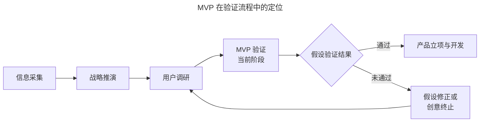
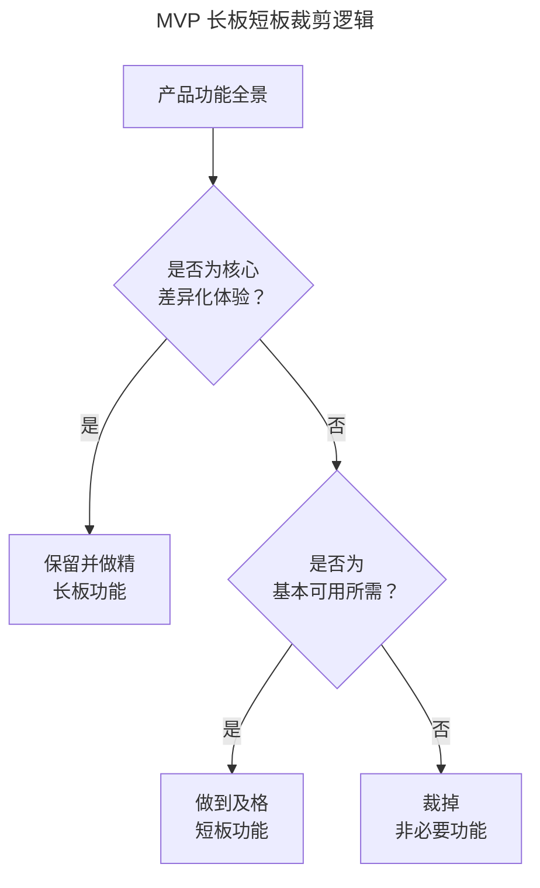
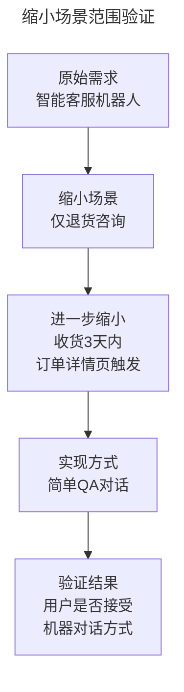
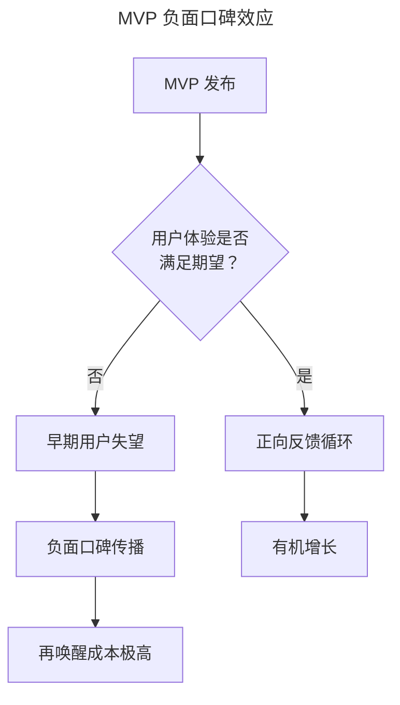

# 04 | 最小资源验证：MVP 的理论与实践

> **适用范围**：产品经理、创业者、需要验证产品创意的团队负责人。适用于产品创意验证、MVP 设计、假门测试、Concierge MVP、AI 辅助快速原型等场景。
>
> **更新摘要（v2 · 2026-08 更新）**：
> - 结构化升级为 6 节骨架（导言 / 核心方法论 / 关键流程 / 工具与实战 / 常见误区 / 进阶延展）
> - 保留假门测试、Concierge MVP、Wizard of Oz 等经典模式与四象限决策框架
> - 保留全部 Mermaid 图并补充 `--- title: ... ---` frontmatter，每张图后追加文字解读

---

## 1. 导言

最小可用产品（Minimum Viable Product, MVP）是精益思想在产品开发中的核心实践工具，旨在以最少资源验证最关键的产品假设。

> **摘要**：本文系统阐述 MVP 的概念体系、验证逻辑与实施策略，涵盖假门测试（Fake Door Test）、Concierge MVP、Wizard of Oz 等经典模式，结合 2024–2026 年 AI 辅助快速原型与无代码工具的最新实践，提出 MVP 验证的四象限决策框架与质量校验标准，并深入分析 MVP 方法的适用边界与负面效应。

---

## 2. 核心方法论

### 2.1 MVP 的概念体系

**最小可用产品（MVP）**是指以最少的开发资源，构建出能够验证核心产品假设的最小功能集合，并将其投入真实用户环境进行验证的产品形态（Ries, 2011）。

MVP 的三个构成要素：

| 要素 | 含义 | 判断标准 |
|------|------|---------|
| Minimum（最小） | 功能范围被极致裁剪 | 每个功能都直接服务于核心假设验证 |
| Viable（可用） | 能够完成核心用例 | 用户可以完成端到端的关键流程 |
| Product（产品） | 具备产品的完整体验闭环 | 用户可感知、可交互、可评价 |

### 2.2 MVP 与相关概念辨析

| 概念 | 定义 | 与 MVP 的关系 |
|------|------|-------------|
| MVP | 最小功能集合验证核心假设 | 本主题 |
| 原型（Prototype） | 用于概念验证的交互模型 | MVP 可能包含原型，但原型不一定是 MVP |
| PoC（概念验证） | 验证技术可行性 | MVP 的子集，聚焦技术维度 |
| Spike（技术探针） | 时间盒限定的技术验证 | 通常在 MVP 之前执行 |
| Beta 版 | 面向部分用户的功能完整版本 | MVP 可能发展为 Beta，但功能范围不同 |

### 2.3 MVP 在验证流程中的定位



> **图解**：MVP 验证位于"信息采集→战略推演→用户调研→MVP 验证"流程的第四环，验证结果通过则进入产品立项与开发，未通过则假设修正或创意终止，回到用户调研循环。

### 2.4 MVP 的验证目标：从用户动机到商业模型

MVP 可在不同层面进行验证，其验证深度与资源投入呈正相关：

| 验证层面 | 核心问题 | 典型方法 | 资源投入 |
|----------|---------|---------|---------|
| 动机验证 | 用户是否对此感兴趣？ | 假门测试、着陆页测试 | 极低 |
| 行为验证 | 用户是否会持续使用？ | 功能 MVP、Concierge MVP | 中等 |
| 模式验证 | 商业模式是否成立？ | 付费墙测试、预售 | 中高 |
| 规模验证 | 规模化后单位经济是否可行？ | 地理扩展测试、渠道测试 | 高 |

### 2.5 使用率 × 留存率决策矩阵

| | 高留存 | 低留存 |
|---|---|---|
| **高使用率** | ✅ **验证通过**：需求真实，体验良好 | ⚠️ **需调查**：需求可能真实，但体验或功能不足 |
| **低使用率** | 🔍 **小众机会**：需求存在但受众有限 | ❌ **伪需求**：需求不成立，应停止投入 |

**伪需求识别的关键信号**：
- 用户口头表达高度认可，但实际行为数据冷淡
- 使用率随时间快速衰减，无自然回流
- "很好，但不是刚需"——用户礼貌性认可但不形成习惯

---

## 3. 关键流程

### 3.1 假门测试（Fake Door Test）

假门测试是最低成本的 MVP 形态，用于验证用户动机的存在性：

```mermaid
---
title: 假门测试操作流程
---
graph LR
    A[在界面中添加<br/>功能入口按钮] --> B[用户点击后<br/>显示"功能开发中"]
    B --> C[追踪点击率<br/>与重复点击行为]
    C --> D{点击率是否<br/>达到预期阈值？}
    D -->|是| E[验证通过<br/>启动功能开发]
    D -->|否| F[验证未通过<br/>重新评估需求]
```

> **图解**：假门测试流程——在界面中添加功能入口按钮，用户点击后显示"功能开发中"，追踪点击率与重复点击行为，点击率达到预期阈值则验证通过启动开发，否则重新评估需求。

**经典案例**：维珍航空机上娱乐系统添加未完成功能按钮验证乘客兴趣；微信订阅号改版长按文章弹出"未完成的功能"测试新交互接受度；某设置页面点击后弹出表单收集用户需求优先级。

> **关键警示**：假门测试仅验证动机存在性，不验证持续使用意愿。高点击率 + 低留存率是常见模式，需进一步区分是需求不成立还是实现不满足。

### 3.2 策略一：提前推演，测试驱动

在设计 MVP 之前，必须明确以下要素：

| 要素 | 问题 | 示例 |
|------|------|------|
| 验证目标 | 要验证的核心假设是什么？ | "客服人员是否会在工作流中主动查看数据统计" |
| 数据采集 | 需要采集哪些数据项？ | PV、UV、留存率、回访频率 |
| 预期结果 | 各数据项的可能结果范围？ | 使用率 >15% 且 7 日留存 >30% |
| 结论映射 | 不同结果对应什么结论？ | 高使用低留存 → 可能是功能不足 |
| 基准数据 | 同区域类似功能的使用率基准？ | 内部其他后台功能平均使用率 12% |

> **与 TDD 的类比**：如同测试驱动开发（Test-Driven Development）先写测试再写代码，MVP 设计应先定义"验证成功的标准"再定义"产品功能的范围"。**打点不可遗漏**：验证前必须完成数据埋点。

### 3.3 策略二：验证长板，而非短板

MVP 的裁剪原则：保留长板，裁掉短板。



> **图解**：MVP 功能裁剪逻辑——核心差异化体验保留做精（长板），基本可用所需做到及格（短板），非必要功能裁掉。在竞争充分的市场中，立住脚靠的是在单一维度上做到 10 倍好。

| 案例 | 长板 | 短板（可接受的不及格） | 结果 |
|------|------|----------------------|------|
| 12306 首版 | 有票（核心供给） | 用户体验、性能、界面 | 用户"捏着鼻子也要用" |
| Instagram 早期 | 图片滤镜与分享体验 | 评论功能、用户管理 | 核心体验驱动爆发式增长 |
| Dropbox 视频 MVP | 文件同步概念验证 | 无实际产品 | 视频吸引 75,000 等待用户 |

### 3.4 策略三：创造性低成本方案

**人工替代系统（Concierge MVP / Wizard of Oz）**：

| 传统方案 | Concierge MVP | 适用条件 |
|----------|--------------|---------|
| 系统自动计算报表 | 人工计算后手动更新 | 验证用户是否真的需要数据功能 |
| 完整电商系统 | 购买按钮 → 表单收集 → 人工发货 | 验证转化率 |
| AI 推送服务 | 人工筛选内容后推送 | 验证推送价值 |
| 自动化客户服务 | 人工客服模拟 AI 对话 | 验证用户接受度 |

> **核心原则**：先用人力顶住测试，若服务确实有需求，再快速迭代用系统化能力替代。

**利用第三方系统**：电商用有赞/微店/Shopify，内容发布用公众号/Substack，CRM 用 Excel/Sheets，支付始终用 Stripe/支付宝/微信支付。2024–2026 年工具生态让构建 MVP 门槛持续降低，应尽可能利用第三方服务快速验证假设。

**缩小场景范围**：



> **图解**：通过业务规则将场景收窄至最小可验证单元，如"智能客服机器人"缩小为"仅退货咨询"再到"收货 3 天内订单详情页触发的简单 QA 对话"，使 MVP 实现成本最低化，同时保持验证结论有效性。

---

## 4. 工具与实战

### 4.1 AI 原型工具（2024–2026）

| 工具 | 能力 | 验证场景 |
|------|------|---------|
| v0.dev (Vercel) | 文本生成可交互 UI 原型 | 快速验证界面概念 |
| Galileo AI | 文本生成 UI 设计稿 | 设计概念验证 |
| Figma AI | 自动布局与设计建议 | 设计迭代加速 |
| Cursor / Replit | AI 辅助代码生成 | 功能原型快速构建 |
| Bolt.new | AI 全栈应用生成 | 端到端 MVP 快速构建 |

### 4.2 无代码 / 低代码平台

| 平台 | 适用 MVP 类型 | 上手难度 |
|------|-------------|---------|
| Bubble | 全功能 Web 应用 | 中 |
| Webflow | 营销着陆页 + 博客 | 低 |
| Retool | 内部工具 / 后台面板 | 中 |
| FlutterFlow | 移动应用 | 中 |
| Make / Zapier | 自动化工作流 | 低 |

### 4.3 AI 驱动的验证加速

| 验证阶段 | 传统耗时 | AI 加速后 | 加速方式 |
|----------|---------|----------|---------|
| 原型构建 | 1–2 周 | 数小时–1 天 | AI 代码/设计生成 |
| 用户招募 | 1–2 周 | 1–3 天 | AI 驱动的用户匹配 |
| 数据分析 | 3–5 天 | 数小时 | AI 自动洞察提取 |
| 竞品分析 | 1–2 周 | 数小时 | AI 竞争情报工具 |

---

## 5. 常见误区

### 5.1 MVP 的局限性

| 局限 | 说明 | 典型场景 |
|------|------|---------|
| 体验型产品 | 产品竞争力依赖体验细节叠加，MVP 无法构建 | 设计工具、创意软件 |
| 网络效应产品 | 需要临界用户量才能验证，MVP 规模不足 | 社交平台、市场平台 |
| 高信任度产品 | MVP 的粗糙体验损害品牌信任 | 金融产品、医疗产品 |
| Peter Thiel 批评 | 精益思想是"缺乏规划的托辞" | 从 0 到 1 的创新 |

### 5.2 负面口碑效应



> **图解**：MVP 发布后若用户体验不满足期望，早期用户失望引发负面口碑传播，导致再唤醒成本极高；若满足期望则进入正向反馈循环实现有机增长。关键风险在于愿意尝鲜早期产品的用户往往在小圈子中具有影响力。

### 5.3 MVP 适用性评估框架

| 评估维度 | 适合 MVP | 不适合 MVP |
|----------|---------|-----------|
| 产品类型 | 工具型、效率型 | 体验型、品牌型 |
| 竞争阶段 | 蓝海/新赛道 | 红海/成熟市场 |
| 用户期望 | 容忍不完美 | 期望高完成度 |
| 验证假设数量 | 1–2 个核心假设 | 多假设交织 |
| 品牌风险 | 低品牌风险 | 高品牌风险 |
| 网络效应 | 无/弱 | 强 |

> **决策原则**：MVP 是一种工具而非信仰。理解其长处与短处，在适用场景中善用，在不适用场景中选择替代方案（如封闭测试、设计冲刺、模拟验证等）。

---

## 6. 进阶延展

### 6.1 前沿趋势与演进（2024–2026）

- **从 MVP 到 MVE（Minimum Viable Experiment）**：趋势是从构建"最小产品"转向设计"最小实验"，不一定要做出可用的产品，而是设计最小化的实验来验证最关键的假设。假门测试、着陆页测试、合成用户测试均属于 MVE 范畴。
- **合成用户测试**：AI 模拟目标用户进行概念测试，可在接触真实用户前快速排除明显不可行的方案。**关键警示**：合成用户测试不能替代真实用户验证，仅用于早期筛选。
- **产品三人组驱动的持续验证**：PM + 设计师 + 工程师组成的产品三人组（Product Trio）共同参与验证，减少信息传递损耗，加速验证循环。

### 6.2 参考文献

- Ries, E. (2011). *The Lean Startup*. Crown Business.
- Thiel, P. (2014). *Zero to One*. Crown Business.
- Torres, T. (2021). *Continuous Discovery Habits*. Product Talk LLC.
- Cagan, M. (2020). *Empowered*. Wiley.
- Gothelf, J. & Seiden, J. (2016). *Lean UX*. O'Reilly Media.
- Knapp, J. (2016). *Sprint*. Simon & Schuster.
