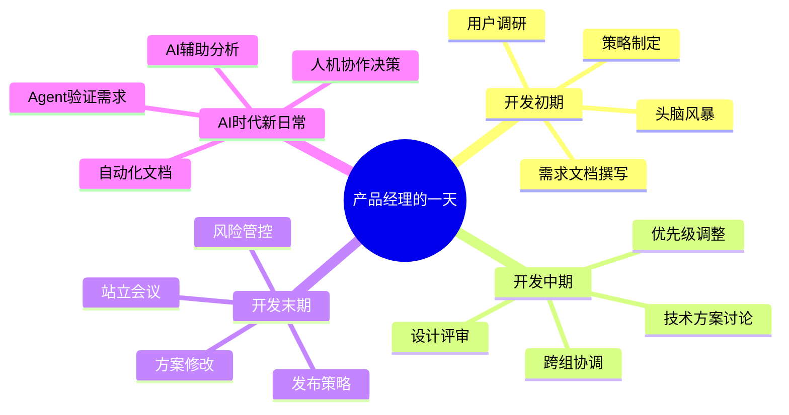
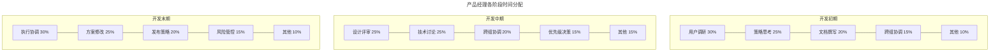
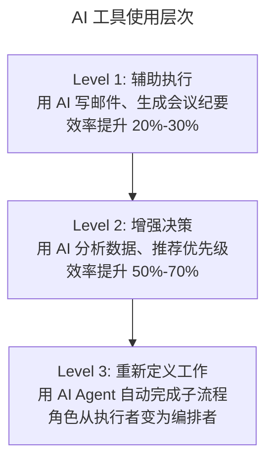
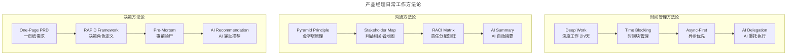

# 05 | 硅谷产品经理每天在做什么？

> **适用范围**：产品经理（各阶段）、希望了解 PM 日常工作的从业者、需要优化时间分配的管理者。适用于日常工作流程、时间管理、AI 时代角色转变等场景。
>
> **更新摘要（v2 · 2026-08 更新）**：
> - 结构化升级为 6 节骨架（导言 / 核心方法论 / 关键流程 / 工具与实战 / 常见误区 / 进阶延展）
> - 保留 2018 vs 2025 工作方式对比与全流程 AI 工具矩阵
> - 保留全部 Mermaid 图并补充 `--- title: ... ---` frontmatter，每张图后追加文字解读

---

## 1. 导言

有人说产品经理每天就是和工程师冲突，也有人说产品经理每天各种开会，还有人说产品经理每天就是坐在电脑前画画 UI。作为一个在硅谷工作多年的产品经理，我每天的日程其实都在变化。更关键的是，2025 年的今天，AI 工具正在深刻重塑产品经理的每一天——不是替代，而是让产品经理从"执行者"回归"思考者"。

### 1.1 核心导图

> **图解**：产品经理的一天按产品开发阶段划分——开发初期（用户调研、头脑风暴、策略制定、需求文档撰写）、开发中期（设计评审、技术方案、跨组协调、优先级调整）、开发末期（站立会议、方案修改、发布策略、风险管控），并在 AI 时代增加 AI 辅助分析、Agent 验证需求、自动化文档、人机协作决策。

### 1.2 案例背景：发布新版视频版权管理系统

我们要发布一个最新版的视频版权管理系统，目标群体是视频制作者，包括传媒公司、音乐公司、电视台等。第一版产品可以帮助视频制作者非常轻松地管理自己的版权内容，在 Facebook 上为他们寻找侵犯自己版权的内容。现在，我们需要确定下一个版本应该有什么新的功能。

通过一系列的市场调研和用户调研发现，第一版的产品虽然可以帮助视频制作者找到使用他们版权内容的视频，但还是需要他们手动找出哪些视频是已经购买了版权的人发的，哪些视频是侵权用户发的。那些大的媒体公司会有数以千计的侵权视频，手动报告对他们来讲非常痛苦。因此，我们决定第二版的产品主要解决这个问题。

---

## 2. 核心方法论

### 2.1 开发初期的日程

**2 月 15 日（2018 年版）**：

| 时间 | 活动 | 核心目的 |
|------|------|---------|
| 10:00 | 用户调研 | 确认手动低效是最大痛点 |
| 12:00 | 团队"头脑风暴"产品功能 | 探索解决方案 |
| 13:00 | 午饭 | — |
| 13:30 | 和其他组产品经理谈合作 | 跨组资源协调 |
| 14:30 | 和工程经理讨论成功指标 | 定义"什么算成功" |
| 15:00 | 思考时间：整合用户调研结果 | 撰写 PRD |
| 17:00 | 和营销经理讨论市场调研 | 验证方向 |
| 18:00 | 晚饭 | — |
| 19:00 | 回复邮件和工作信息 | 日常沟通 |

这天早上，我首先完成了最后一个用户调查。然后我就和工程师一起讨论，有什么方式能够解决这个问题。因为我们现在所想的功能需要使用另一个产品的一些功能，所以我需要和这个组的产品经理讨论怎么能够利用他们已有的资源。之后，我去了成功指标的会，讨论怎么才算解决了手动低效这个问题。最后我们一致决定，对比视频制作者在有这个功能之前和现在每天举报视频的数量，如果能够提升 10% 就算成功。

然后我花了很多时间在思考，把前几天做的用户调研以及和大家"头脑风暴"的内容进行整合，撰写产品需求文档。对我来说每天能有属于自己的时间非常不容易，但是我只有在这样的时间里才能真正思考，所以我非常珍惜这两个小时。最后一个会，主要是看营销经理给我的市场调查报告，然后我发现市场调查的结果和用户调研的结果非常相似，并且一个竞争对手已经有了类似的功能。

### 2.2 同一天在 2025 年会怎样？

| 时间 | 活动 | AI 增效点 |
|------|------|----------|
| 9:00 | AI 分析 10 万条用户评论 | DeepSeek-R1 语义聚类，3 小时提炼"隐形需求" |
| 10:00 | 用户调研（视频访谈） | AI 实时转录 + 情感分析 |
| 11:00 | 头脑风暴（Miro + AI） | AI 生成 5 套方案供讨论 |
| 12:00 | 午饭 | — |
| 13:00 | 跨组协作（Slack AI 摘要） | AI 自动同步上下文 |
| 13:30 | 成功指标讨论 | AI 基于历史数据推荐合理阈值 |
| 14:30 | PRD 撰写（Cursor + Claude） | AI 辅助生成初稿，人工精修 |
| 16:00 | 竞品分析（AI 自动抓取） | Dify 工作流自动生成 SWOT |
| 17:00 | 思考时间 | 节省出的 2 小时用于深度思考 |

> 🟢 **进阶视角**：AI 工具的核心价值不是替代你写文档，而是**把重复性工作压缩到 20% 的时间**，让你有 80% 的时间做真正需要人类判断的事——用户洞察、策略决策、跨团队影响力。
> 🔵 **资深视角**：2025 年产品经理的时间分配正在发生结构性变化。传统上，产品经理 60% 的时间花在"信息搬运"，只有 40% 在"价值创造"。AI 工具正在把这个比例翻转。
> 🟣 **专家视角**：真正的变化不是"用 AI 写 PRD 更快"，而是**产品经理的角色从"文档生产者"变为"AI 策展人"（AI Curator）**。你不再从零开始写 PRD，而是审核 AI 生成的初稿、补充上下文、做出判断。

---

## 3. 关键流程

### 3.1 开发末期的日程

**4 月 20 日（2018 年版）**：

| 时间 | 活动 | 核心目的 |
|------|------|---------|
| 10:00 | 站立会议（Stand-Up） | 同步进度、发现阻塞 |
| 10:30 | 和设计师一对一 | 修改设计方案 |
| 11:00 | 和工程师、设计师一起决定方案 | 解决架构限制问题 |
| 11:30 | 和老板一对一 | 汇报进展、请求支持 |
| 12:00 | 和新来同事吃午饭 | 招聘影响力 |
| 13:30 | 部门产品经理组会 | 信息同步、跨组学习 |
| 14:00 | 自由时间：到工程师桌前沟通 | 快速解决小问题 |
| 15:00 | 讨论小功能优先级 | 砍掉低优先级功能 |
| 16:00 | 面试产品经理 | 团队建设 |
| 17:00 | 讨论营销公关策略 | 发布协调 |

这时离我们预定 5 月 5 日进行产品发布的时间已经非常近了，最重要的开发部分其实已经完成。但是上周，其中一个工程师发现已有的架构无法实现设计师的这个功能，所以需要设计师用我们能够支持的方式，修改之前的设计，这就有可能增加开发时间，发布时间有可能被拖到 5 月 8 日。

我今天最重要的任务是，帮助设计师修改产品设计方案，从而解决我们现在的架构限制问题。之后，我和老板每周的单聊时间开始了。其实产品经理还有一个重要的任务，就是帮助团队招人，所以我的午饭是和一个刚来公司不久正在选组的工程师吃的，目的就是向他推荐我们组。

下午一点半，是我们整个部门的产品经理要一起开的例会，一周开一次，整个部门 20 多个产品经理都要参加。之后我有一些自由时间，一般会找到具体的工程师，到他们的办公桌前，问问他们有什么需要我帮忙的。我发现，这样的形式比动辄开会要高效很多。3 点我要和技术主管、工程经理一起讨论一下现在还没有完成的 5 个小功能里面，需不需要砍掉几个功能，最终我们决定砍掉 2 个功能，保留剩下的 3 个。4 点我面试了一个产品经理。5 点的会是临时加的，因为 5 月 5 日发布的可能性不大，所以我们想讨论一下推迟发布的事情。

### 3.2 同一天在 2025 年会怎样？

| 时间 | 活动 | AI 增效点 |
|------|------|----------|
| 9:30 | 异步 Stand-Up（Slack + AI 摘要） | AI 自动汇总每人进度，标记阻塞项 |
| 10:00 | 设计方案修改（Figma + AI） | AI 生成 3 套备选方案 |
| 10:30 | 方案评审（工程师 + 设计师） | AI 标注技术可行性风险 |
| 11:00 | 和老板一对一 | AI 生成本周进展摘要 |
| 11:30 | 招聘：审阅候选人资料 | AI 筛选 + 匹配度评分 |
| 12:00 | 午饭 | — |
| 13:00 | 部门 PM 组会（AI 纪要） | AI 自动生成会议纪要和 Action Item |
| 13:30 | 优先级讨论 | AI 基于用户数据推荐优先级排序 |
| 14:00 | 面试产品经理 | AI 辅助评估分析能力 |
| 14:45 | 发布策略讨论 | AI 分析历史发布数据推荐最优时间窗 |
| 15:30 | 深度思考时间 | AI 处理了 80% 日常事务后的"红利" |

### 3.3 不同阶段的时间分配

> **图解**：不同阶段时间分配——开发初期（用户调研 30%、策略思考 25%、文档撰写 20%、跨组协调 15%）、开发中期（设计评审 25%、技术讨论 25%、跨组协调 20%、优先级决策 15%）、开发末期（执行协调 30%、方案修改 25%、发布策略 20%、风险管控 15%）。

### 3.4 2018 vs 2025 时间分配对比

| 活动类型 | 2018 年占比 | 2025 年占比 | 变化原因 |
|---------|-----------|-----------|---------|
| 文档撰写 | 20% | 8% | AI 辅助生成 PRD、会议纪要 |
| 信息同步会议 | 25% | 12% | 异步沟通 + AI 摘要 |
| 用户调研 | 15% | 20% | AI 处理定量分析，PM 聚焦定性洞察 |
| 策略思考 | 10% | 25% | 从执行中释放的时间 |
| 跨组协调 | 15% | 10% | AI 自动同步上下文 |
| 面试/招聘 | 5% | 8% | 团队扩张需求 |
| 数据分析 | 10% | 7% | AI 自动化报表，PM 聚焦解读 |

> 🔵 **资深视角**：2025 年最大的变化是**"思考时间"的回归**。2018 年，产品经理经常感叹"没有时间思考"；2025 年，AI 工具处理了 80% 的重复劳动后，产品经理终于可以把更多时间花在真正重要的事上。
> 🟣 **专家视角**：时间分配的变化背后是**角色定位的根本性转变**——从"信息枢纽"到"决策引擎"。当 AI 可以自动同步信息、生成文档、分析数据时，产品经理的核心价值不再是"知道最多信息的人"，而是"做出最好判断的人"。

---

## 4. 工具与实战

### 4.1 全流程 AI 工具矩阵

| 产品阶段 | 核心任务 | AI 工具 | 效率提升 |
|---------|---------|--------|---------|
| Discovery | 用户反馈分析 | DeepSeek-R1 / ChatGPT | 语义聚类，3 小时完成 10 万条评论分析 |
| Discovery | 竞品监控 | Dify + RAG 工作流 | 自动抓取 + SWOT 生成 |
| Definition | PRD 撰写 | Cursor + Claude / Notion AI | 初稿生成，人工精修 |
| Definition | 原型设计 | 墨刀 AI / v0.dev | 输入描述生成交互方案 |
| Delivery | 项目管理 | Linear AI / JIRA Intelligence | 自动任务拆解 + 风险预警 |
| Delivery | 代码生成 | Trae / Cursor | MVP 开发周期从 2 周压缩至 3 天 |
| Measurement | 需求验证 | Manus Agent | 模拟真实用户验证流程 |
| Measurement | 数据分析 | Amplitude AI / Mixpanel AI | 自动洞察 + 异常检测 |

### 4.2 AI 工具使用的三个层次

> **图解**：AI 工具使用三个层次——Level 1 辅助执行（用 AI 写邮件、生成会议纪要，效率提升 20%-30%）、Level 2 增强决策（用 AI 分析数据、推荐优先级，效率提升 50%-70%）、Level 3 重新定义工作（用 AI Agent 自动完成子流程，角色从执行者变为编排者）。

> 🟢 **进阶建议**：从 Level 1 开始——用 Notion AI 写会议纪要、用 ChatGPT 辅助写 PRD。
> 🔵 **资深建议**：直接瞄准 Level 2——用 AI 分析用户数据、生成竞品报告、推荐优先级。关键是**学会写好的 Prompt（或 Context）**。
> 🟣 **专家建议**：探索 Level 3——用 Dify 搭建自动化工作流，用 Manus Agent 验证需求，用 AI Agent 处理日常协调。

### 4.3 最新实践（2024-2026）

**实践一：异步优先（Async-First）的工作方式**——2024-2025 年，硅谷越来越多的团队采用"异步优先"工作模式：Loom 视频消息替代同步会议、Slack AI 摘要替代全员同步会、Notion 文档 + AI 评论替代面对面评审、Linear 异步更新替代每日站会。效果：某 Meta 团队报告，采用异步优先后，会议时间减少 40%，产品经理的深度思考时间增加 60%。

**实践二：AI Agent 辅助的日常流程**——早上：AI Agent 自动汇总昨天的用户反馈、数据异常、竞品动态；上午：基于 AI 汇总，产品经理决定今天需要深入关注的 2-3 个问题；下午：用 AI 工具快速完成文档、原型、分析等执行工作；晚上：AI Agent 自动生成本日工作摘要，同步给相关方。

**实践三：远程/混合办公下的日程设计**——核心协作时间（Core Hours）：10:00-14:00，用于必须同步的会议；深度工作时间（Focus Time）：14:00-17:00，关闭通知；异步沟通时间：其余时间，通过文档和 AI 摘要同步。

### 4.4 方法论全景

> **图解**：产品经理日常工作方法论——时间管理（Deep Work 深度工作 2h/天、Time Blocking、Async-First、AI Delegation）、沟通（Pyramid Principle、Stakeholder Map、RACI Matrix、AI Summary）、决策（One-Page PRD、RAPID Framework、Pre-Mortem、AI Recommendation）。

---

## 5. 常见误区

| 误区 | 表现 | 正确做法 |
|------|------|---------|
| **认为 PM 就是开会/画 UI** | 每天被动参加各种会议 | 主动规划深度思考时间 |
| **把省下的时间填入更多会议** | AI 释放时间后又排满会议 | 把节省的时间用于深度思考 |
| **从零开始写文档** | 不用 AI，死磕文档 | 审核 AI 初稿，补充上下文做判断 |
| **只在 Level 1 使用 AI** | 只用 AI 写邮件/纪要 | 逐步进入 Level 2/3，用 AI 增强决策 |
| **忽视异步优先** | 所有沟通都开同步会 | 采用异步优先，减少同步会议 |

---

## 6. 进阶延展

### 6.1 产品经理日常工作的核心模式

**三种沟通模式**：

| 模式 | 适用场景 | 效率 | 2025 年优化 |
|------|---------|------|-----------|
| 正式会议 | 需要集体决策 | 中 | AI 纪要 + Action Item 追踪 |
| 一对一沟通 | 快速解决具体问题 | 高 | Slack Huddle + AI 上下文同步 |
| 异步沟通 | 信息同步、非紧急讨论 | 高 | AI 摘要 + 智能通知 |

**两种思考模式**——反应式思考（Reactive，响应工程师的问题、处理紧急需求）是 2018 年产品经理的默认模式；主动式思考（Proactive，深度分析用户数据、思考产品方向）是 2025 年产品经理应该追求的模式——AI 工具的真正价值，就是帮你从反应式切换到主动式。

**一个关键原则**：**每天至少保留 2 小时的"深度思考时间"（Deep Work Time）**——不看邮件、不回消息、不开会，只做需要高度专注的思考工作。2018 年这很难做到，2025 年 AI 帮你处理了大部分日常事务后，这应该成为标配。

### 6.2 关键术语

| 术语 | 英文 | 释义 |
|------|------|------|
| 站立会议 | Stand-Up / Daily Scrum | 每日短会，同步进度和阻塞项 |
| 深度工作 | Deep Work | 需要高度专注、不受干扰的思考时间 |
| 异步优先 | Async-First | 优先使用异步沟通，减少同步会议 |
| 头脑风暴 | Brainstorming | 团队发散思维、探索解决方案的会议 |
| 成功指标 | Success Metrics | 衡量产品功能是否达成目标的量化标准 |
| 时间块 | Time Blocking | 将日程划分为专注的时间块，避免碎片化 |
| AI 策展人 | AI Curator | 审核、精修 AI 生成内容，做出最终判断的角色 |
| 需求漂移 | Requirement Drift | 开发过程中需求偏离原始定义的现象 |
| 核心协作时间 | Core Hours | 远程团队约定的必须在线同步时间段 |
| RAPID | RAPID Framework | 决策角色框架：Recommend/Agree/Perform/Input/Decide |

### 6.3 思考题

1. 🟢 **进阶题**：你现在每天花最多时间的三件事是什么？如果 AI 能帮你自动化其中一件，你会把省下的时间用在哪里？
2. 🔵 **资深题**：在"异步优先"的工作模式下，产品经理如何确保跨团队的信息对齐和决策效率？哪些场景仍然必须同步沟通？
3. 🟣 **专家题**：当 AI Agent 可以自动完成 80% 的日常执行工作，产品经理的"不可替代性"在哪里？你如何证明自己的价值不是"信息搬运"，而是"价值判断"？

### 6.4 延伸阅读

1. Cal Newport, *Deep Work: Rules for Focused Success in a Distracted World* (2016)
2. Teresa Torres, *Continuous Discovery Habits* (2021)
3. Lenny Rachitsky, "How the best product managers spend their time" (2023)
4. a16z, "42 Most Popular AI Products" (2024)
5. Gartner, "AI-Augmented Product Management" (2025)
