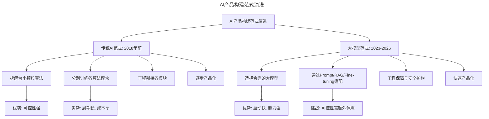
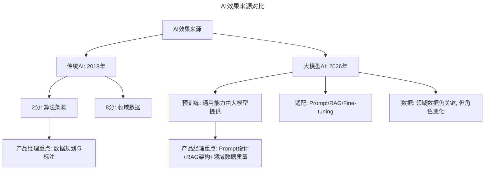
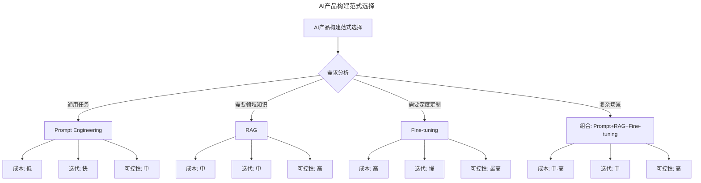
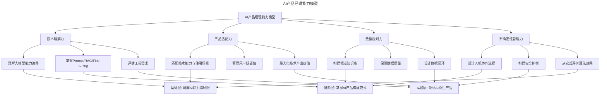

# 如何当好AI时代的产品经理？（实践篇）

> **适用范围**：AI 时代的产品经理、需要构建 AI 产品的从业者、创业者、技术管理者。适用于 AI 产品设计、Prompt/RAG/Fine-tuning 选择、数据规划、不确定性管理、AI 原生产品设计等场景。
>
> **更新摘要（v2 · 2026-08 更新）**：
> - 结构化升级为 6 节骨架（导言 / 核心方法论 / 关键流程 / 工具与实战 / 常见误区 / 进阶延展）
> - 整合原"更新说明 v2.0"与核心摘要，补充大模型时代端到端进展、Prompt/RAG/Fine-tuning 范式
> - 保留全部 Mermaid 图并补充 `--- title: ... ---` frontmatter，每张图后追加文字解读

---

## 1. 导言

AI 时代的产品经理需要深入理解算法的小粒度过程、重视工程力量、利用产品设计最大化算法产出、做好数据规划、并接受算法的不确定性。在大模型时代，这些原则仍然成立，但具体实践方式发生了根本变化：端到端模型（GPT-4、Whisper 等）已取得巨大进展，"2 分靠算法 8 分靠数据"的格局正在被预训练大模型改写，Prompt Engineering 和 RAG 成为 AI 产品构建的主流范式，自动驾驶 L4 已在限定场景落地。AI 产品经理需要从"算法+工程"思维升级为"大模型+应用"思维。

> **更新说明**：本文档于 2026-06 更新，主要更新点：补充大模型时代端到端进展（GPT-4/Whisper 等）；重新审视"2 分靠算法 8 分靠数据"在大模型时代的新含义；增加 Prompt Engineering、RAG、Fine-tuning 等主流 AI 产品构建范式；更新自动驾驶 L4/L5 进展；增加 AI 产品经理能力模型与 Mermaid 流程图；增加专业深度分层。

---

## 2. 核心方法论

### 2.1 原则一：产品与算法的结合粒度要小

**原始观点**——产品经理应当把大颗粒的整体性领域算法拆成小颗粒的算法单元，并在此基础上寻找产品化可能。这句话的意思是说，我们不能给算法团队提出一个很大的领域型需求，然后就坐等算法的突破，产品经理应当更小粒度地看待每个具体算法过程和环节，并评估是否有能够被产品化的成果。

比如，我们不能要求算法团队交付一个"聊天机器人"，这个需求粒度太大了，彻底完成会受制于各种因素，更是一个长期的过程。产品经理应该深入到领域内，比如看到自然语言理解（NLU），甚至看到其中本体库搭建和句子的语法树等等，可能部分完成的本体库已经可以包装为一个初级的人机交互引导产品。

我们在无码科技做 Readhub.me 时，产品经理会尽量避免提出像实现命名实体识别（NER）或实现信息抽取（IE）之类，这样大而化之的需求；而是尽量参与到算法过程中，分步去看过程产出。比如命名实体识别过程中我们需要分词，分词作为一个中间算法，是否可以被直接产品化；再比如信息抽取需要先找到大信息量的文本片段，这个过程的产出，是否可以作为文章摘要或文本标签等等。

过去产品和技术泾渭分明，但在 AI 时代，我认为这个界限应该被打破，产品经理要融入到技术过程中去，不止关注需求，更要关注供给，这样才能做出真正的好产品。

**大模型时代的更新**——2018 年的观点：拆解大颗粒需求为小颗粒算法单元，逐步产品化。2026 年的现实：大模型（GPT-4、Claude 3、Gemini 等）已经将许多"小颗粒算法单元"整合为统一的端到端能力。命名实体识别、分词、信息抽取、文本摘要——这些在 2018 年需要分别训练的算法，现在一个大模型 API 调用就能完成。

> **图解**：AI 产品构建范式从"拆解+分别训练"演进为"大模型+适配"。传统范式（拆解为小颗粒算法→分别训练→工程衔接→逐步产品化）优势可控性强、劣势周期长成本高；大模型范式（选择大模型→Prompt/RAG/Fine-tuning 适配→工程保障与安全护栏→快速产品化）优势启动快能力强、挑战可控性需额外保障。**核心原则不变**：产品经理仍需深入理解技术过程，只是从"理解算法模块"变为"理解大模型的能力边界与适配方式"。

### 2.2 原则二：要重视工程的力量

**原始观点**——当我们说人工智能的时候，总是希望算法可以解决所有问题，给出一个干净而准确的结果。吴恩达教授在去年神经信息处理系统大会（NIPS）上也提到深度学习会向端到端的方向发展。就是说，比如我做一个语音交互的机器人，过去的思路可能是人说话，先经过语音识别的算法变成文字，然后再用自然语言处理的过程去理解这些文字的意图，最后做出反应；而端到端的思路是直接把输入，也就是人的说话声音灌到算法盒子里，算法输出的直接就是最终的反应，不去编排中间过程。

但是，完全端到端在工业界有效程度没那么高，我们还是需要大量的工程工作去对算法模块做衔接，对算法的输入输出做清洗和筛选。我们不能在工业界套用学界的做事方式和标准，比如算法能做到 63 分，这时我们继续拼命优化算法，努力提升到 65 分，这就不如找个皮实一点的 60 分的算法，加上工程手段，或许可以快速做到 70 分甚至更高。

工程至少可以在三个方面快速提高产品的价值分值：一是通过规则在算法的基础上对输入和输出数据做筛选和过滤（很多时候体现为大量的正则表达式）；二是通过工程帮助算法做降维，比如做人脸识别，我们不用把摄像头拍下的整张图片送进神经网络，而是通过工程的方法把图片中的脸截出来并且特征化之后再往算法里送；三是协助算法的训练，比如做手写数字识别，样本量不够的情况下，可以用工程的方法添加旋转和噪点，生成一些新的训练数据。

**大模型时代的端到端进展**——2018 年的判断：完全端到端在工业界有效程度没那么高。2026 年的现实：端到端在大模型时代已取得巨大进展：

| 领域 | 2018年 | 2026年 |
|------|--------|--------|
| 语音识别 | 需要分步处理 | Whisper端到端，接近人类水平 |
| 机器翻译 | 需要分步对齐 | GPT-4直接翻译，质量接近专业译员 |
| 对话系统 | 需要NLU+DM+NLG | 大模型端到端对话，质量大幅提升 |
| 图像识别 | 需要预处理+分类 | CLIP端到端理解，零样本分类 |
| 代码生成 | 几乎不可能 | GitHub Copilot端到端代码生成 |

**但工程力量仍然重要**：虽然端到端能力大幅提升，但工程在以下方面仍然不可或缺：输入预处理（清洗用户输入、格式化、上下文管理）；输出后处理（格式约束、安全过滤、事实性校验）；RAG 架构（检索增强生成需要工程构建知识库、设计检索策略）；安全护栏（防止大模型产生有害输出）；性能优化（缓存、批处理、模型量化降低成本）。

---

## 3. 关键流程

### 3.1 原则三：利用产品最大化算法和工程的产出结果

**原始观点**——产品经理的职责是用产品为用户创造价值，至于这个价值有多少分来自算法，其实并不是成功的核心。刚才我们提到可能算法做到 60 分，加上工程可以做到 70 分，而一个常见的问题是，产品经理将一个 70 分的能力用到了 90 分或者 50 分的场景中，结果是造成用户的失落或技术能力的浪费。

比如，我们都知道自动驾驶有几个不同的级别，从完全不能自动化的 L0 到完全自动驾驶的 L5。如果现在我们的技术做到了 L4，非常牛了，这个级别下，大部分情况下都可以达到完全自动驾驶。结果产品经理在此基础上，做了一个没有方向盘和窗户的产品，用户吃着火锅唱着歌把车开到村里，结果在田间地头，车翻了；又或者，产品经理做了一个传统的汽车模式，有方向盘有档把，还需要人来操作，完全没有把 L4 的技术能力用上，浪费了技术的输出。

所以说，AI 时代的产品经理应该非常了解算法的能力边界，并设计出恰如其分的产品，同时也要管理好用户的期望值，既不让用户觉得失落，也要发挥算法的最大价值。

**自动驾驶进展更新（2026 年）**：

| 级别 | 2018年状态 | 2026年状态 |
|------|------------|------------|
| L2 | 特斯拉Autopilot | 已普及，几乎所有新车标配 |
| L3 | 极少落地 | 奔驰Drive Pilot在德国高速落地 |
| L4 | 几乎未落地 | Waymo在旧金山/凤凰城全无人运营 |
| L5 | 遥远 | 仍未实现，但端到端自动驾驶快速推进 |

**2026 年关键进展**：Waymo 在旧金山和凤凰城已实现 L4 全无人驾驶运营，百度 Apollo 在武汉亦实现 L4 无人出租车。但 L5（全场景全无人驾驶）仍未实现——这验证了原文的核心观点：产品经理必须精确匹配技术能力与使用场景。

### 3.2 原则四：做好数据规划

**原始观点**——人工智能产品经理还有一个非常重要的职责，就是规划、收集以及组织算法所需要的数据。如何保证训练、测试集中的数据特性分布和最终场景中的数据一致；如何获取足量的数据，并对它们进行低成本高效率的标注；用什么样的方式清洗数据，甚至基于数据做出统计学分析，为算法提供参考，这一切内容都需要产品经理去完成。

业内有一种说法是：当前的人工智能效果，2 分靠算法，8 分靠数据（剩下的 90 分靠运气，开玩笑的）。尤其是大量的深度学习应用，对数据的质和量提出了很高的要求。

产品经理应该要理解算法的数据输入要求和未来的算法应用场景，找到合适的数据源，合理合法地把这些数据收集下来，清洗干净；并有规划地划分开发、训练和测试集，以保证数据价值的最大化。另外产品经理还应当想办法在业务中设计数据的闭环，通过产品的持续运转，不断生成更多数据提供给算法做训练。目前大部分的训练过程还是离线的，但如果未来在线学习持续发展，通过这样的业务流程设计，就可以做到在线算法迭代更新。

最后还有一个经验是，盲目扩大数据量并不总是有用的，如果数据的多样性得不到保证，扩大数据规模对算法结果没有太大帮助，甚至如果数据特性分布出现问题导致训练数据有偏，还可能会造成算法的过度拟合和表现下降。

**"2 分靠算法 8 分靠数据"在大模型时代的新含义**——2018 年：2 分靠算法，8 分靠数据——因为算法相对成熟，数据质量决定效果。2026 年：这个说法在大模型时代有了新的解读：

> **图解**：在传统 AI 时代，产品经理的重点是数据规划与标注；在大模型时代，预训练模型的通用能力已由大模型提供，产品经理的重点转向 Prompt 设计、RAG 架构和领域数据质量。

**大模型时代的数据角色变化**：

| 维度 | 传统AI | 大模型AI |
|------|--------|----------|
| 数据量 | 大量标注数据 | 少量高质量数据+大量通用数据 |
| 数据类型 | 标注数据为主 | 文档、知识库、对话历史 |
| 数据作用 | 训练模型 | RAG检索源、Fine-tuning数据 |
| 产品经理重点 | 数据标注管理 | 知识库构建、数据质量保障 |

**主流 AI 产品构建范式**——**Prompt Engineering**：通过精心设计提示词引导大模型产生期望输出。这是成本最低、迭代最快的 AI 产品构建方式。**RAG（Retrieval-Augmented Generation）**：将领域知识存储在向量数据库中，用户提问时先检索相关知识，再将检索结果作为上下文提供给大模型。这是目前最主流的 AI 产品构建范式——既利用了大模型的通用能力，又注入了领域知识。**Fine-tuning**：在大模型基础上用领域数据进行微调，使模型在特定任务上表现更好。成本较高，但在需要高度定制化的场景中不可替代。

> **图解**：AI 产品构建范式应根据需求选择——通用任务用 Prompt Engineering，需要领域知识用 RAG，需要深度定制用 Fine-tuning，复杂场景组合使用。产品经理需要理解每种范式的成本、迭代速度和可控性。

### 3.3 原则五：去完美主义，理解算法的不确定性

**原始观点**——从某种意义上说，机器学习的不确定性是必然的，它跟传统的面向流程和规则的思路截然不同，在这样的框架下，就需要转变产品设计的思路，摒除完美主义，利用产品机制去消化算法带来的不确定性。

比如，机器学习用在反欺诈或垃圾邮件监测上，就是存在概率的。一封邮件是否是垃圾邮件，在算法完成推理前（尤其是深度学习），即便算法的作者恐怕也无法给出准确的预测。算法有可能会错判和漏判，这都是产品经理需要理解和考虑的场景，并且要去通过产品设计去消化它。比如反欺诈要准备申诉的流程和入口，垃圾邮件可能需要提醒机制和独立的文件夹等等。

除此之外，我们评价一个算法有效性的方式，也要从局部转向宏观，不能通过一条数据的推理结果去评价一个算法。有时算法迭代升级，可能整体效果更好了，但单看某一条具体的测试数据，却可能比原来糟糕。比如我们做命名实体识别，算法升级之后，在测试集中跑出来的 F 值更高了，但可能某一条升级之前能够正确识别的语料在升级之后却不能识别了。这是很正常的现象，尽管有点反直觉，但我们必须要把思维模式转变过来。

**大模型时代的不确定性新特征**——大模型的不确定性比传统机器学习更加复杂：

| 不确定性类型 | 传统ML | 大模型 |
|--------------|--------|--------|
| 分类错误 | 可量化（精确率/召回率） | 更难量化（开放式输出） |
| 幻觉 | 不存在 | 核心挑战，需专门应对 |
| 输出不一致 | 较少 | 同一输入不同输出 |
| 安全风险 | 较可控 | 更复杂（越狱、偏见等） |

**应对大模型不确定性的产品设计**：人机协作（AI 生成初版，人工审核确认）；置信度展示（让用户了解 AI 的确定程度）；多轮对话（通过追问澄清用户意图）；引用溯源（RAG 中展示信息来源，便于验证）；安全护栏（输入输出过滤，防止有害内容）。

---

## 4. 工具与实战

### 4.1 AI 产品经理能力模型

> **图解**：AI 产品经理能力模型从四个维度展开——技术理解力、产品适配力、数据规划力、不确定性管理力。每个维度对应不同的专业深度层级：基础层理解 AI 能力与局限，进阶层掌握 AI 产品构建范式，高阶层设计 AI 原生产品。

### 4.2 实战要点

| 要点 | 说明 | 适用场景 |
|------|------|----------|
| 深入理解技术过程 | 从理解算法模块到理解大模型能力边界 | 所有AI产品 |
| 工程力量仍然重要 | 端到端虽进步，但RAG/安全护栏/性能优化仍需工程 | 所有AI产品 |
| 精确匹配能力与场景 | 技术能力与使用场景必须精确匹配，避免过度或不足 | 自动驾驶、医疗AI等高风险场景 |
| 选择合适的构建范式 | Prompt/RAG/Fine-tuning根据需求选择 | 所有AI产品 |
| 数据角色已变化 | 从标注数据到知识库构建，数据质量仍关键 | 所有AI产品 |
| 设计不确定性消化机制 | 人机协作、置信度展示、引用溯源、安全护栏 | 所有AI产品 |

### 4.3 专业深度分层

**基础层**：理解大模型的能力与局限；精确匹配技术能力与使用场景；从宏观评价算法效果。

**进阶层**：掌握 Prompt Engineering、RAG、Fine-tuning 等构建范式；设计人机协作流程消化不确定性；构建领域知识库保障数据质量。

**高阶层**：设计 AI 原生产品（非"传统产品+AI 功能"）；设计数据闭环实现持续优化；构建完整的安全护栏与治理体系。

---

## 5. 常见误区

| 误区 | 表现 | 正确做法 |
|------|------|---------|
| **把大模型当黑盒** | 不理解模型能力边界就盲目使用 | 深入理解大模型的能力边界与适配方式 |
| **忽视工程力量** | 以为端到端就不需要工程 | RAG/安全护栏/性能优化仍需工程 |
| **能力场景错配** | 把 70 分能力用到 90 分或 50 分场景 | 精确匹配技术能力与使用场景 |
| **盲目扩大数据** | 认为数据越多越好 | 关注数据多样性，避免数据有偏 |
| **用局部评价算法** | 用单条数据推理结果评价算法 | 从宏观评价算法整体效果 |
| **完美主义** | 追求算法的确定性输出 | 设计产品机制消化算法的不确定性 |

---

## 6. 进阶延展

### 6.1 核心结论

AI 时代的产品经理五大原则——产品与算法结合粒度要小、重视工程的力量、利用产品最大化算法和工程的产出、做好数据规划、去完美主义理解算法不确定性——在大模型时代依然成立，但具体实践方式发生了根本变化：产品经理需要从"算法+工程"思维升级为"大模型+应用"思维。

**2018 vs 2026 核心变化**：从"拆解算法单元"到"理解大模型能力边界"；从"数据标注管理"到"知识库构建+Prompt 设计"；从"端到端不成熟"到"端到端+工程护栏"；从"算法不确定性管理"到"大模型幻觉/安全风险管理"。

### 6.2 延伸阅读

- "Prompt Engineering Guide"（DAIR.AI，promptingguide.ai）——Prompt 工程完整指南
- "Retrieval-Augmented Generation for AI-Driven Products"（2024）
- "Fine-tuning Large Language Models: A Practical Guide"（2024）
- 吴恩达："AI for Everyone"——AI 产品经理入门
- "Building LLM Applications: A Comprehensive Guide"（2025）
