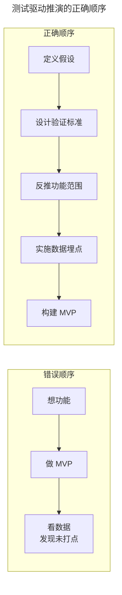
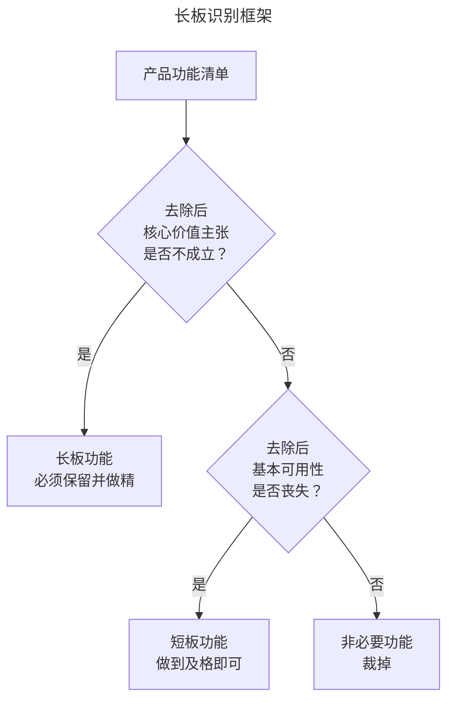
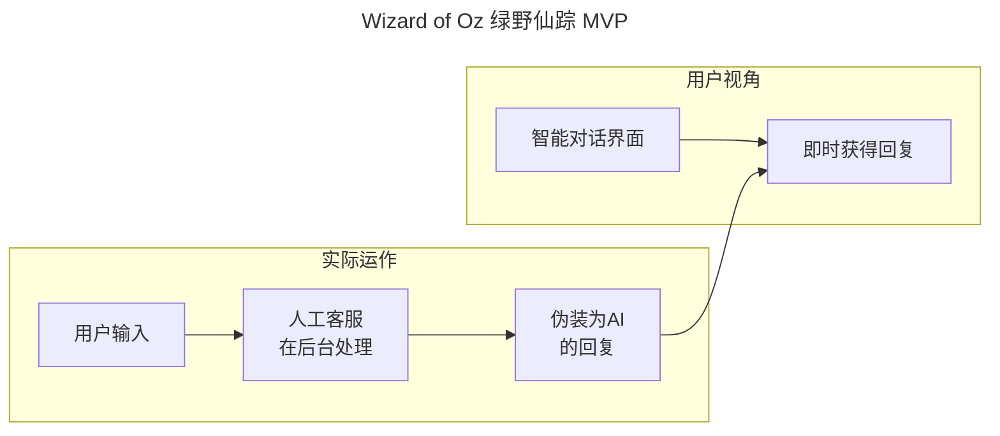

# 05 | MVP 实施原则与低成本验证策略

> **适用范围**：产品经理、创业者、需要验证产品创意的团队负责人。适用于 MVP 实施、低成本验证策略、Concierge/Wizard of Oz MVP、AI 时代快速原型等场景。
>
> **更新摘要（v2 · 2026-08 更新）**：
> - 结构化升级为 6 节骨架（导言 / 核心方法论 / 关键流程 / 工具与实战 / 常见误区 / 进阶延展）
> - 保留测试驱动推演、长板优先、创造性低成本实现、方法边界认知四大原则
> - 保留全部 Mermaid 图并补充 `--- title: ... ---` frontmatter，每张图后追加文字解读
> - 参考资料融入进阶延展

---

## 1. 导言

MVP 的价值不仅在于概念层面的"最小验证"，更在于实施层面的策略选择与执行质量。本文在上一篇 MVP 理论框架的基础上，深入探讨 MVP 实施的四大核心原则——测试驱动推演、长板优先验证、创造性低成本实现、以及方法边界认知，系统化地阐述 Concierge MVP、Wizard of Oz、第三方系统借力、场景收窄等策略的操作细节与适用条件，并结合 2024–2026 年无代码/AI 原型工具的最新进展，提出 MVP 实施的质量保障框架。

---

## 2. 核心方法论

### 2.1 原则一：测试驱动推演

**先定义验证标准，再定义功能范围**——MVP 设计的常见错误是先思考"做什么功能"，再考虑"怎么验证"。正确顺序应反转——如同测试驱动开发（Test-Driven Development, TDD）先写测试用例再写实现代码，MVP 设计应先定义验证成功的标准，再据此反推功能范围。

> **图解**：错误顺序是"想功能→做 MVP→看数据发现未打点"；正确顺序是"定义假设→设计验证标准→反推功能范围→实施数据埋点→构建 MVP"，先定义验证标准再反推功能范围，避免漏打点。

**推演清单**：

| 推演项 | 具体问题 | 示例 |
|--------|---------|------|
| 核心假设 | 要验证的 1–2 个最关键假设 | "客服人员会主动查看数据统计" |
| 数据项 | 需要采集哪些数据来验证假设 | PV、UV、7日留存、回访频率 |
| 预期结果 | 每个数据项的可能取值范围 | 使用率 10–30%，留存 20–50% |
| 结论映射 | 不同结果组合对应什么结论 | 高使用低留存 → 需区分功能不足 vs 需求不真 |
| 基准参照 | 同类型功能的行业/内部基准 | 内部后台工具平均使用率 12% |
| 埋点方案 | 哪些行为需要埋点 | 页面曝光、按钮点击、停留时长 |

**预期数字的校准价值**：① 暴露逻辑漏洞（若无法给出合理预期，说明对用户行为理解不足）；② 加速决策（实际数据出炉后可立即对照预期做出判断）；③ 训练判断力（长期积累"预期 vs 实际"偏差数据，逐步校准产品直觉）。**关键警示**：数据埋点不可遗漏。未打点的 MVP 验证不仅浪费资源，还会使团队在决策时缺乏依据。

### 2.2 原则二：验证长板，而非短板

**长板优先的逻辑**——MVP 的裁剪逻辑不是"平均地减少功能"，而是"集中资源于差异化价值点"。在竞争充分的市场中，产品立住脚靠的是在单一维度上做到现有方案的 10 倍好（Peter Thiel 的 10X 原则），而非所有维度都做到 80 分。

| 功能类别 | 处理策略 | 资源分配 |
|----------|---------|---------|
| 核心差异化功能（长板） | 做精做透 | 70–80% 资源 |
| 基本可用功能（及格线） | 做到可用 | 15–20% 资源 |
| 非必要功能（裁掉） | 暂不实现 | 0–5% 资源 |

**长板识别框架**：

> **图解**：长板识别框架——逐一检查产品功能清单，去除后核心价值主张不成立的是长板功能（保留做精），去除后基本可用性丧失的是短板功能（做到及格），否则为非必要功能（裁掉）。

**典型案例分析**：

| 产品 | 长板（MVP 必须做精） | 短板（可接受不及格） | 裁掉 |
|------|---------------------|---------------------|------|
| 12306 | 有票（核心供给能力） | 界面体验、性能、交互 | 个性化推荐 |
| Instagram | 图片滤镜与分享 | 评论功能、用户管理 | 直接消息、故事功能 |
| Dropbox | 文件同步可靠性 | 协作功能、版本历史 | 团队管理 |
| Slack | 实时消息与频道 | 文件管理、搜索 | 高级权限管理 |

> **核心洞察**：12306 首版体验极差，但长板完全体现——"有票"这一核心供给使得用户"捏着鼻子也要用"。后续逐步补齐短板，因为核心需求被满足。

---

## 3. 关键流程

### 3.1 原则三：创造性低成本方案

**Concierge MVP（礼宾式 MVP）**——用人工方式完整模拟产品服务的交付流程，对用户而言体验与最终产品无异，但后端完全依赖人工操作：

| 维度 | 最终产品 | Concierge MVP |
|------|---------|--------------|
| 数据报表 | 系统实时计算，自动展示 | 人工线下计算，手动更新至页面 |
| 电商购买 | 完整购物车、支付、物流 | 购买按钮 → 表单 → 人工发货 |
| 内容推送 | 算法个性化推送 | 人工筛选内容，手动推送 |
| 客服对话 | AI 自动回复 | 人工客服模拟 AI 对话 |

**适用条件**：验证的核心假设是"用户是否需要此服务"而非"系统是否能自动化"；用户量可控（通常 <100 人）；人工操作的边际成本在验证期间可接受。

**Wizard of Oz（绿野仙踪 MVP）**——用户界面呈现为自动化系统，但后端由人工操作驱动。与 Concierge MVP 的区别在于：Wizard of Oz 对用户隐藏了人工参与的事实。

> **图解**：用户视角看到的是"智能对话界面→即时获得回复"，实际运作是"用户输入→人工客服后台处理→伪装为 AI 的回复"。

**适用场景**：验证 AI/自动化产品在用户体验层面的可行性；需要模拟真实产品体验以获取高质量反馈；技术实现难度高但人工模拟成本低。**伦理考量**：Wizard of Oz 涉及对用户的"善意欺骗"，需在验证结束后向参与者说明；在 B2B 场景中，建议提前告知"服务由人工辅助提供"。

**利用第三方系统**——核心策略：在自建基础设施之前，优先利用现有第三方服务快速上线验证。

| 需求层级 | 第三方方案 | 自建时机 |
|----------|-----------|---------|
| 内容发布 | 微信公众号 / Substack / Ghost | 需要定制化内容体验 |
| 电商交易 | 有赞 / 微店 / Shopify | 订单量超过第三方成本拐点 |
| 客户管理 | Excel / Google Sheets / Airtable | 数据复杂度超过表格能力 |
| 支付 | Stripe / 支付宝 / 微信支付 | 始终使用第三方 |
| 数据分析 | Amplitude 免费版 / PostHog 开源版 | 需要自定义分析模型 |
| 用户反馈 | Canny / Typeform / Tally | 需要深度自定义反馈流程 |

**决策原则**：当第三方服务的成本低于自建的机会成本时，优先使用第三方。自建的时机是：验证通过 + 规模化需求明确 + 第三方功能/性能无法满足。

**缩小场景范围**——通过业务规则将验证场景收窄至最小可验证单元：

| 原始需求 | 场景收窄策略 | 收窄后验证范围 |
|----------|------------|--------------|
| 智能客服机器人 | 仅处理退货咨询 | 退货场景的机器对话接受度 |
| 全品类电商 | 仅销售 3–5 个 SKU | 目标用户的购买转化率 |
| 全球化 SaaS | 仅支持单一语言/地区 | 核心功能的价值验证 |
| 通用数据分析 | 仅展示 3–5 个关键指标 | 用户是否真正查看数据 |

**操作要点**：① 识别验证所需的最小行为样本；② 通过业务规则（时间、地点、用户属性、触发条件）约束入口；③ 确保收窄后的场景仍能回答核心验证问题；④ 验证通过后再逐步扩大场景范围。

### 3.2 原则四：认知 MVP 的适用边界

**MVP 的反对声音**——Peter Thiel 在 *Zero to One*（2014）中对精益思想的批评最为知名："精益思想只不过是缺乏规划的托辞，最多帮助创业者进行小修小补的把戏。"Thiel 认为真正的创新需要完整的愿景与大胆的投入。

**MVP 不适用的产品类型**：

| 产品类型 | MVP 失效原因 | 替代验证方式 |
|----------|-------------|-------------|
| 体验驱动型 | 竞争力依赖体验细节叠加 | 封闭 Beta + 深度用户测试 |
| 网络效应型 | 需临界用户量才可验证 | 模拟验证 + 小范围种子用户 |
| 高信任度型 | 粗糙体验损害品牌信任 | 白名单测试 + NDA 保护 |
| 监管敏感型 | 合规要求限制了功能裁剪 | 合规先行 + 功能逐步开放 |
| 平台生态型 | 价值依赖多方参与者 | 先做单边，再扩展双边 |

---

## 4. 工具与实战

### 4.1 MVP 的负面效应

| 负面效应 | 机制 | 影响程度 | 缓解策略 |
|----------|------|---------|---------|
| 口碑损伤 | 早期用户失望并传播负面评价 | 高 | 选择容忍度高的早期用户群体 |
| 再唤醒成本高 | 负面印象形成后难以扭转 | 高 | 在产品成熟后再触达早期流失用户 |
| 团队士气受损 | 发布后效果不佳影响信心 | 中 | 预设"MVP 是学习而非成功"的心态 |
| 机会成本 | MVP 周期占用了其他验证方式的时间 | 中 | 严格控制 MVP 周期（2–4 周） |
| 过早优化 | 基于小样本数据做大规模决策 | 高 | 确认统计显著性后再扩大投入 |

### 4.2 MVP 适用性自检清单

| 检验项 | 通过标准 | 判断 |
|--------|---------|------|
| 核心假设是否 ≤ 2 个？ | 是 | 适合 MVP |
| 验证是否可在 2–4 周内完成？ | 是 | 适合 MVP |
| MVP 体验是否不会严重损害品牌？ | 是 | 适合 MVP |
| 是否存在低成本的替代验证方式？ | 否 | MVP 是合理选择 |
| 失败的代价是否可承受？ | 是 | 适合 MVP |

### 4.3 AI 增强的快速 MVP 构建（2024–2026）

**AI 原型生成工具**：

| 工具 | 核心能力 | MVP 构建周期 | 适用场景 |
|------|---------|-------------|---------|
| v0.dev | 文本生成 React 组件 | 数小时 | Web 界面原型 |
| Galileo AI | 文本生成 UI 设计 | 数小时 | 设计概念验证 |
| Bolt.new | AI 全栈应用生成 | 1–3 天 | 端到端功能原型 |
| Cursor + Claude | AI 辅助代码编写 | 1–5 天 | 功能型 MVP |
| Replit Agent | AI 自主编程 | 数小时–1 天 | 快速功能验证 |

**无代码/低代码平台**：

| 平台 | MVP 类型 | 上手难度 | 定制灵活性 |
|------|---------|---------|-----------|
| Bubble | 全功能 Web 应用 | 中 | 高 |
| Webflow | 营销着陆页 | 低 | 中 |
| Retool | 内部工具/后台 | 中 | 高 |
| FlutterFlow | 移动应用 | 中 | 中高 |
| Make / Zapier | 工作流自动化 | 低 | 中 |
| Softr | Airtable 前端 | 低 | 中 |

**验证加速效果**：

| 阶段 | 传统周期 | AI/无代码加速后 | 加速比 |
|------|---------|----------------|--------|
| 原型构建 | 1–2 周 | 数小时–1 天 | 5–10× |
| 用户测试 | 1–2 周 | 1–3 天 | 3–5× |
| 数据分析 | 3–5 天 | 数小时 | 5–10× |
| 迭代优化 | 1–2 周/轮 | 1–3 天/轮 | 3–5× |

---

## 5. 常见误区

| 误区 | 表现 | 正确做法 |
|------|------|---------|
| **先想功能再验证** | 先思考"做什么功能"再考虑"怎么验证" | 先定义验证标准，再反推功能范围 |
| **忘记打点** | 上线 MVP 不打点，无法判断结果 | 数据埋点不可遗漏 |
| **平均裁剪功能** | 所有功能同等对待 | 集中资源于长板（差异化价值点） |
| **强制使用 MVP** | 不适用场景也硬套 MVP | 理解"最小验证"精神，灵活选择替代方案 |
| **基于小样本扩大投入** | 小样本数据就做大规模决策 | 确认统计显著性后再扩大投入 |
| **合成用户做最终决策** | 用合成用户测试替代真实用户验证 | 合成用户仅作早期筛选，最终需真实用户数据 |

---

## 6. 进阶延展

### 6.1 前沿趋势与演进（2024–2026）

**从 MVP 到 MVE（Minimum Viable Experiment）**——2024–2026 年的趋势是从"构建最小产品"转向"设计最小实验"。MVE 不要求做出可用产品，而是设计最小化的实验来验证最关键的假设。假门测试、着陆页测试、合成用户测试均属于 MVE 范畴。

**产品三人组（Product Trio）验证模式**——PM + 设计师 + 工程师组成的产品三人组共同参与验证全过程，而非 PM 独立设计后交给工程团队实现：

| 传统模式 | Product Trio 模式 |
|----------|-------------------|
| PM 设计 → 工程实现 → 迭代 | 三人共同设计、共同验证、共同迭代 |
| 信息传递损耗大 | 实时协作，零信息损耗 |
| 验证周期 2–4 周 | 验证周期 1–2 周 |
| 设计与实现脱节 | 设计即实现，实现即验证 |

**合成用户（Synthetic Users）的早期筛选**——AI 模拟目标用户进行概念测试，可在接触真实用户前快速排除明显不可行的方案。适用场景：概念方向选择（多方案对比）；价值主张验证（用户是否理解核心价值）；用户语言测试（价值主张表述是否清晰）。**严格限制**：合成用户测试不能替代真实用户验证，其价值限于早期筛选，最终决策必须基于真实用户行为数据。

> **决策原则**：MVP 是一种工具而非信仰。在适用场景中善用，在不适用场景中选择替代方案。核心是理解"最小验证"的精神——以最低成本获取最关键的学习，而非拘泥于 MVP 这一种形式。

### 6.2 参考文献

1. Ries, E. (2011). *The Lean Startup*. Crown Business.
2. Thiel, P. (2014). *Zero to One*. Crown Business.
3. Torres, T. (2021). *Continuous Discovery Habits*. Product Talk LLC.
4. Cagan, M. (2020). *Empowered: Ordinary People, Extraordinary Products*. Wiley.
5. Gothelf, J. & Seiden, J. (2016). *Lean UX*. O'Reilly Media.
6. Blank, S. (2020). *The Startup Owner's Manual*. Wiley.
