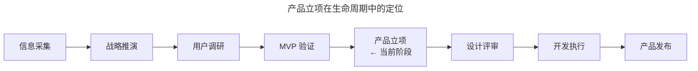
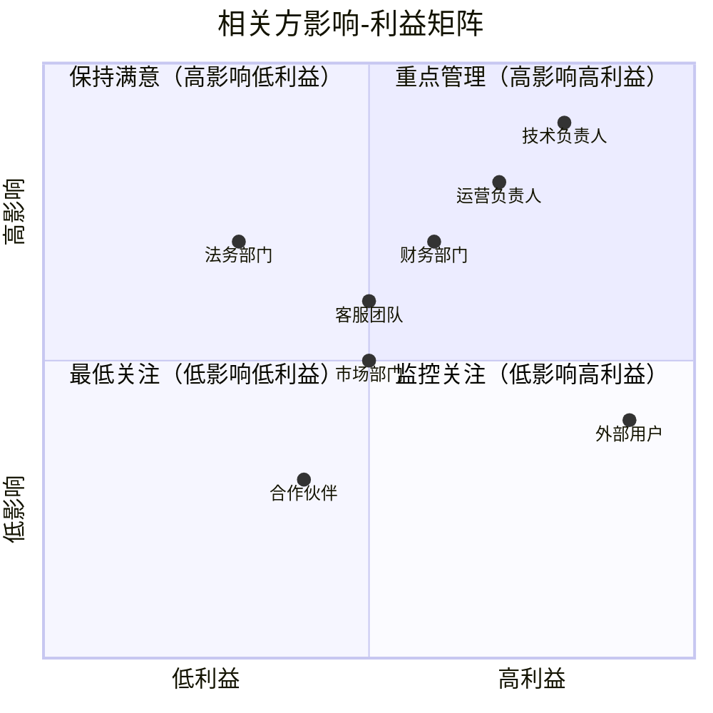
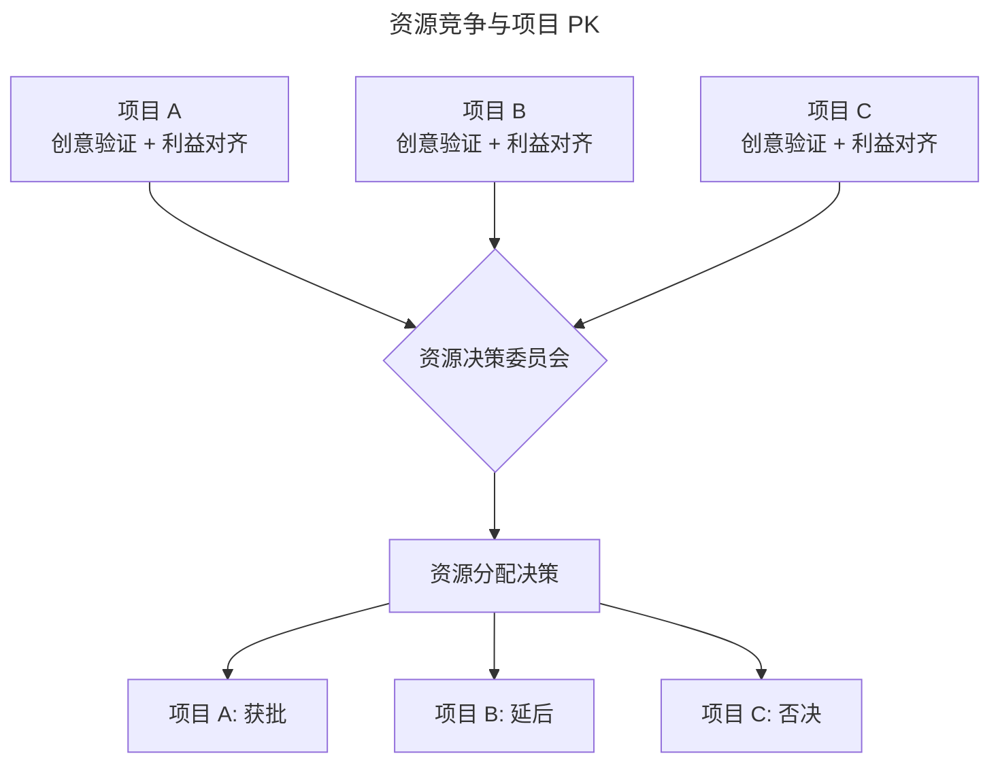

# 06 | 产品立项的系统化流程

> **适用范围**：产品经理（需要推动产品立项）、产品负责人、创业者、需要争取资源的团队负责人。适用于相关方识别、利益对齐、资源估算、立项决策等场景。
>
> **更新摘要（v2 · 2026-08 更新）**：
> - 结构化升级为 6 节骨架（导言 / 核心方法论 / 关键流程 / 工具与实战 / 常见误区 / 进阶延展）
> - 保留相关方识别、利益对齐、资源估算、资源锁定四阶段模型与 OKR 对齐
> - 保留全部 Mermaid 图并补充 `--- title: ... ---` frontmatter，每张图后追加文字解读
> - 参考资料融入进阶延展

---

## 1. 导言

产品立项是产品从创意验证到资源投入的关键转折点，其核心任务是在组织内部完成对产品创意的"销售"——识别相关方、协调利益、估算资源、锁定投入。本文基于 Stakeholder Management 与 OKR 对齐理论，系统阐述产品立项的四阶段流程：相关方识别与影响分析、利益对齐与联合构建、资源估算与计划安排、资源锁定与立项决策，并结合 2024–2026 年跨职能协作工具与 OKR 管理平台的最新实践，提出立项质量的自检框架。

### 1.1 核心定义

**产品立项（Product Kickoff / Project Chartering）** 是指在完成产品创意验证与设计之后，通过系统化的组织协调与资源争取流程，使产品项目获得正式的资源承诺与执行授权的过程。

立项的本质是**组织内部的"销售"过程**：产品经理将前期信息收集、用户调研、逻辑推演与 MVP 测试的成果，全面而有条理地呈现给资源决策者，使其"购买"（Buy-in）产品创意并投入资源。

### 1.2 立项在产品生命周期中的定位

> **图解**：产品立项位于产品生命周期的关键节点——信息采集→战略推演→用户调研→MVP 验证→产品立项→设计评审→开发执行→产品发布。立项是创意验证与资源投入之间的转折点。

### 1.3 立项的四阶段模型

| 阶段 | 核心任务 | 关键产出 |
|------|---------|---------|
| 1. 相关方识别 | 识别所有受项目影响的内外部角色 | 相关方地图 |
| 2. 利益对齐 | 理解并协调各方利益诉求 | 利益对齐矩阵 |
| 3. 资源估算 | 合理估算投入并安排计划 | 项目计划与资源需求 |
| 4. 资源锁定 | 争取资源决策者的 Buy-in | 立项批准与资源承诺 |

---

## 2. 核心方法论

### 2.1 相关方识别与影响分析

**相关方分类**：

| 类别 | 角色 | 关注点 | 影响方式 |
|------|------|--------|---------|
| 技术部门 | 开发、测试、运维 | 技术可行性、工作量、系统稳定性 | 资源投入与时间承诺 |
| 运营部门 | 用户运营、内容运营 | 拉新/留存指标、运营工具支持 | 推广资源与用户触达 |
| 业务部门 | 销售、客服、商务 | 业务流程影响、客户反馈 | 业务配合与一线数据 |
| 财务部门 | 财务、法务 | 投入产出比、合规风险 | 预算审批与合规审查 |
| 市场部门 | 品牌、公关、市场 | 品牌影响、市场机会 | 市场推广与品牌资源 |
| 外部相关方 | 用户、合作伙伴、监管方 | 用户体验、合作利益、合规 | 使用反馈与合作条件 |

**相关方影响矩阵**：

> **图解**：相关方影响-利益矩阵——技术负责人、运营负责人（高影响高利益，重点管理）；财务、客服、法务（高影响，保持满意/监控）；外部用户（高利益低影响，监控关注）；市场、合作伙伴（中低，最低关注）。

**相关方遗漏的典型后果**：

| 遗漏场景 | 后果 | 根因分析 |
|----------|------|---------|
| 未通知客服部门 | 上线后用户来电咨询，客服不知情 | 设计过程中缺失"与用户沟通"环节 |
| 未协调依赖方 | 发布后导致依赖系统异常 | 技术依赖关系未梳理 |
| 未告知市场部门 | 市场推广与产品节奏脱节 | 发布计划未与市场日历对齐 |
| 未咨询法务 | 功能设计存在合规风险 | 合规审查流程未前置 |

> **核心原则**：识别相关方不仅是"场面活"，更是产品经理借此机会系统思考产品功能如何影响整体业务的过程。不同职能的立场与资源，正是公司整体有效运转的基础。

### 2.2 利益对齐与联合构建

**利益对齐的核心方法**——了解各方利益最有效的方式是直接询问——"你们当前的 KPI/OKR 是什么？"：

| 部门 | 典型 OKR | 产品如何对齐 |
|------|---------|-------------|
| 运营 | 季度 KPI：日新增用户 | 小程序作为新流量入口，讲"拉新"故事 |
| 市场 | 品牌影响力提升 | 新流量入口扩大品牌触达面 |
| 财务 | 投入产出比优化 | 算清资源投入与预期收益 |
| 客服 | 客户满意度提升 | 新功能减少用户投诉 |
| 技术 | 技术债务控制 | 新项目不增加技术债，或同步偿还 |

**利益对齐矩阵**：

| 相关方 | 核心利益 | 产品对其的价值 | 所需支持 | 对齐策略 |
|--------|---------|--------------|---------|---------|
| 运营 | 拉新 | 新流量入口 | 推广资源 | 用拉新数据说服 |
| 市场 | 品牌曝光 | 新传播场景 | 品牌资源 | 用品牌触达数据说服 |
| 财务 | ROI | 收入增长 | 预算审批 | 用投入产出比说服 |
| 技术 | 稳定性 | 技术升级机会 | 开发资源 | 用技术收益说服 |

**"见人说人话"的专业性**——产品经理需要用不同语言向不同相关方说明同一项目的价值，这并非"见人说人话"的圆滑，而是**跨职能沟通的专业能力**：

| 沟通对象 | 语言 | 价值表述 |
|----------|------|---------|
| 技术团队 | 技术语言 | 架构优化、技术债偿还、新技术实践 |
| 运营团队 | 数据语言 | 拉新率、留存率、转化率 |
| 财务团队 | 财务语言 | ROI、CAC、LTV、Payback Period |
| 高管团队 | 战略语言 | 市场份额、竞争壁垒、战略对齐 |

### 2.3 资源估算与计划安排

**估算的三要素**：

| 要素 | 原则 | 说明 |
|------|------|------|
| 谁做谁估 | 执行者负责估算 | 避免非执行者给出不切实际的承诺 |
| 多估几次 | 至少 2–3 轮估算 | 逐步收敛至合理区间 |
| 留足余量 | 预留 20–30% 缓冲 | 应对不确定性 |

**估算方法对比**：

| 方法 | 精度 | 适用阶段 | 操作方式 |
|------|------|---------|---------|
| T-shirt 估算（S/M/L/XL） | 低 | 早期粗估 | 快速分类 |
| 故事点估算 | 中 | Sprint 级别 | Planning Poker |
| 三点估算（乐观/最可能/悲观） | 中高 | 关键路径 | PERT 分析 |
| 专家评估 | 中 | 技术复杂项 | Delphi 方法 |

**估算的心理学**——大部分人对估算存在天然抵触——"我会努力的，但不想做任何承诺"。原因在于估算被视为"缺乏依据的承诺"。缓解策略：将估算定位为"概率性预测"而非"确定性承诺"；使用范围而非点值（如"2–4 周"而非"3 周"）；明确估算的前提条件与假设；区分估算（Estimate）与承诺（Commitment）。

---

## 3. 关键流程

### 3.1 资源锁定与立项决策

**资源竞争与项目 PK**——资源永远不够用。即便完成了相关方识别、利益对齐与资源估算，最终仍需与其他项目竞争资源。

> **图解**：多个完成创意验证与利益对齐的项目进入资源决策委员会，做出资源分配决策——项目 A 获批、项目 B 延后、项目 C 否决。

**Buy-in 的本质**——Buy-in 是资源决策者对项目投入资源的正式承诺。对决策者而言，采纳一个创意意味着付出代价——用资源去"购买"这个创意的预期回报。产品经理的任务是将前期所有成果——信息收集、用户调研、逻辑推演、MVP 测试结果——在此刻全面而有条理地铺展开来，将产品创意"卖出去"。

**立项陈述的核心要素**：

| 要素 | 内容 | 数据支撑 |
|------|------|---------|
| 市场机会 | 市场规模、增长趋势、竞争格局 | 行业报告、竞品分析 |
| 用户需求 | 目标用户、核心痛点、验证结果 | 用户访谈、MVP 数据 |
| 产品方案 | 核心功能、差异化价值、技术方案 | 原型、设计稿 |
| 商业模型 | 收入模型、单位经济、增长路径 | 财务测算 |
| 资源需求 | 人力、时间、资金 | 估算结果 |
| 风险与应对 | 关键风险、缓解措施 | Pre-mortem 结果 |
| 里程碑 | 关键节点、可衡量的阶段性成果 | 项目计划 |

---

## 4. 工具与实战

### 4.1 立项态度

| 态度 | 表现 | 后果 |
|------|------|------|
| 专业投入 | 全力准备，认真对待每个环节 | 立项通过率高，项目执行顺畅 |
| 敷衍了事 | 认为立项通过才是工作开始 | 立项通过率低，执行中频繁返工 |
| 过度自信 | 忽视风险，回避质疑 | 立项后问题频发，资源浪费 |
| 过度谨慎 | 不敢争取资源，被动等待 | 错失机会，项目被延后 |

> **核心原则**：产品经理的职业发展必须靠不断积累产品经验来达成。只有持续做项目（尤其是自己创意提出的项目）才能获得反馈，有反馈才有反思和调整，然后做更多尝试。否则所有原则、方法、思考都是空中楼阁。

### 4.2 跨职能协作工具

| 工具 | 立项场景 | 核心能力 |
|------|---------|---------|
| Notion | 立项文档、相关方地图 | 文档协作、数据库、模板 |
| Linear | 项目计划、里程碑 | 工程导向的项目管理 |
| Asana | 跨团队任务协调 | 多项目视图、时间线 |
| Loom | 立项陈述视频 | 异步沟通、视频录制 |
| Miro | 相关方地图、利益对齐 | 白板协作、可视化 |

### 4.3 OKR 驱动的立项对齐

2024–2026 年，OKR（Objectives and Key Results）已成为立项对齐的标准工具。项目立项需明确其对齐的公司/部门级 OKR，使资源分配决策有据可依。

| 层级 | OKR 示例 | 立项对齐方式 |
|------|---------|-------------|
| 公司级 | O: 成为垂直领域第一 | 项目如何贡献市场份额 |
| 部门级 | O: 提升用户留存至 40% | 项目如何提升留存指标 |
| 团队级 | O: 完成小程序 MVP | 项目里程碑与团队 OKR 绑定 |

### 4.4 数据驱动的立项决策

2024–2026 年的趋势是立项决策越来越依赖数据支撑：MVP 验证数据成为立项的必要条件（非充分条件）；A/B 测试结果用于量化预期收益；单位经济模型（Unit Economics）用于评估商业可行性；北极星指标（North Star Metric）用于对齐项目与公司战略。

---

## 5. 常见误区

### 5.1 立项失败原因

| 原因 | 占比 | 预防措施 |
|------|------|---------|
| 利益未对齐 | 35% | 提前与关键相关方 1:1 沟通 |
| 数据支撑不足 | 25% | 完成充分的用户调研与 MVP 验证 |
| 估算不合理 | 20% | 执行者参与估算，多轮收敛 |
| 风险未识别 | 15% | 执行 Pre-mortem 分析 |
| 其他 | 5% | — |

### 5.2 立项误区

| 误区 | 表现 | 正确做法 |
|------|------|---------|
| **遗漏相关方** | 未通知客服/市场/法务等部门 | 系统识别所有受项目影响的相关方 |
| **敷衍了事** | 认为立项通过才是工作开始 | 全力准备，认真对待每个环节 |
| **过度自信** | 忽视风险，回避质疑 | 执行 Pre-mortem，充分识别风险 |
| **过度谨慎** | 不敢争取资源，被动等待 | 专业地争取资源，展示价值 |

---

## 6. 进阶延展

### 6.1 立项质量自检框架

| 检验项 | 通过标准 | 状态 |
|--------|---------|------|
| 相关方识别 | 所有可能受影响的部门/角色均已识别 | ☐ |
| 利益对齐 | 每个关键相关方的利益诉求已明确且对齐 | ☐ |
| 资源估算 | 估算由执行者完成，包含余量 | ☐ |
| 风险识别 | 关键风险已识别，缓解措施已设计 | ☐ |
| 数据支撑 | 核心论点有用户调研或 MVP 数据支撑 | ☐ |
| 里程碑定义 | 关键节点与可衡量成果已明确 | ☐ |
| 决策者 Buy-in | 资源决策者已正式承诺 | ☐ |

### 6.2 参考文献

1. Cagan, M. (2020). *Empowered: Ordinary People, Extraordinary Products*. Wiley.
2. Doerr, J. (2018). *Measure What Matters*. Portfolio.
3. Freeman, R. E. (1984). *Strategic Management: A Stakeholder Approach*. Pitman.
4. PMI. (2021). *A Guide to the Project Management Body of Knowledge (PMBOK Guide)*. 7th ed.
5. Torres, T. (2021). *Continuous Discovery Habits*. Product Talk LLC.
6. Gothelf, J. & Seiden, J. (2016). *Lean UX*. O'Reilly Media.
