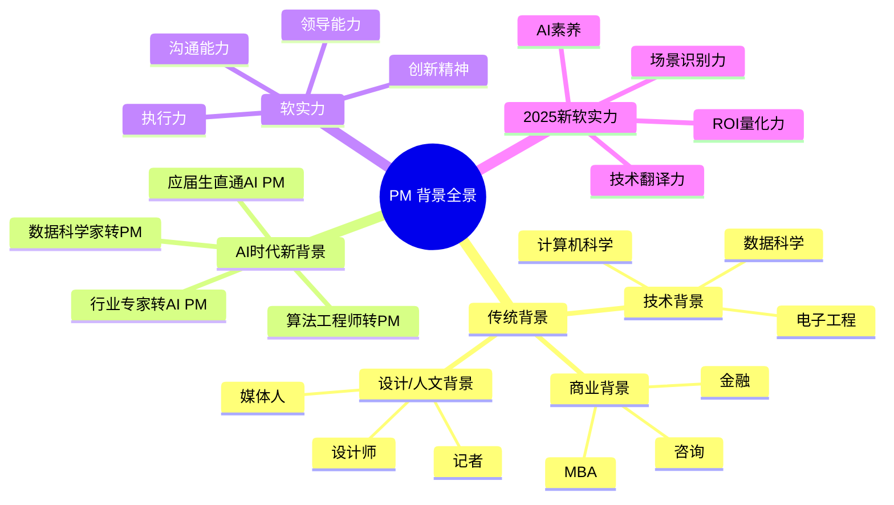
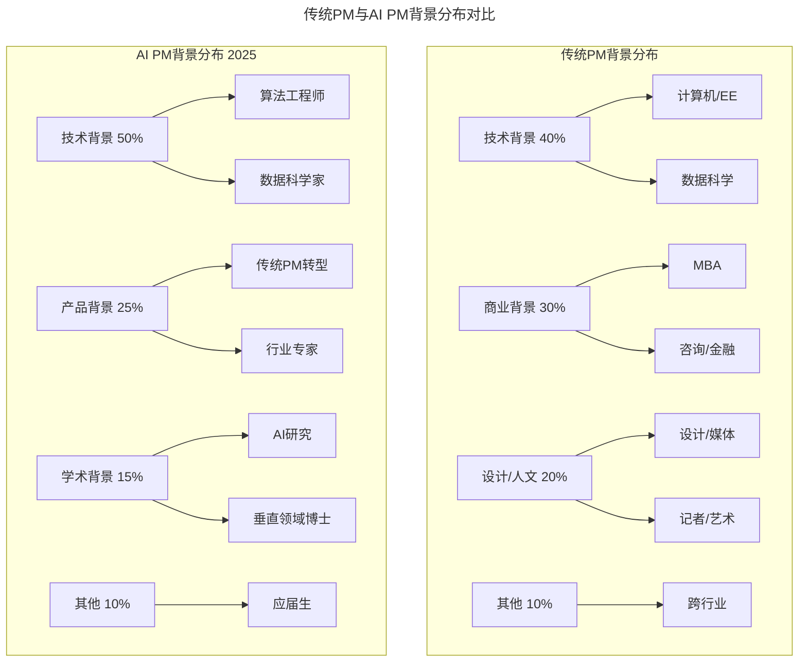
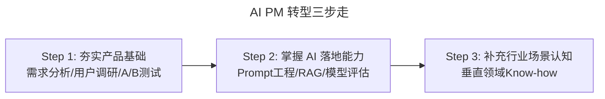
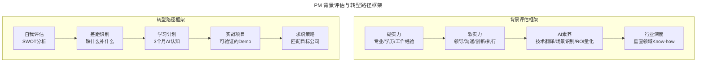

# 06 | 硅谷产品经理们都来自什么背景？

> **适用范围**：产品经理（各阶段）、考虑转型 AI 产品经理的从业者、招聘 PM 的管理者。适用于职业路径规划、背景匹配评估、软实力培养、AI 时代转型等场景。
>
> **更新摘要（v2 · 2026-08 更新）**：
> - 结构化升级为 6 节骨架（导言 / 核心方法论 / 关键流程 / 工具与实战 / 常见误区 / 进阶延展）
> - 保留四大软实力与 AI 时代新增四大软实力
> - 保留全部 Mermaid 图并补充 `--- title: ... ---` frontmatter，每张图后追加文字解读

---

## 1. 导言

对于什么背景的人最适合做产品经理，一直是众说纷纭。有的说没当过工程师的"善于表演的人"不是好的产品经理；有的说产品经理谁都可以干，只要能吹牛冲突就行了；也有的说最好的产品经理从来都是"奇怪"的人，比如贝索斯以前是高频交易的明星员工、乔布斯是个写书法的隐士等等。

2025 年，这个问题有了新的维度：AI 产品经理的崛起，正在重新定义"什么背景适合做 PM"。本文将覆盖传统背景分析 + AI 时代的新路径。

### 1.1 核心导图



> **图解**：PM 背景全景——传统背景（技术、商业、设计/人文）、AI 时代新背景（算法工程师转 PM、数据科学家转 PM、行业专家转 AI PM、应届生直通）、软实力（领导、沟通、创新、执行）及 2025 新软实力（AI 素养、技术翻译力、场景识别力、ROI 量化力）。

---

## 2. 核心方法论

### 2.1 硅谷各公司的产品经理背景

硅谷的公司众多，产品之间相差悬殊，公司文化更是风格迥异。下面纯粹是我的个人体验，数据不一定有代表性。

**技术导向型公司**：

| 公司 | 背景要求 | 原因 |
|------|---------|------|
| Atlassian / MongoDB / Docker | 必须有技术背景，真正做过程序员 | 用户是程序员，PM 必须理解用户 |
| Google | 计算机或电子工程科班，APM 必须通过代码面试 | 工程师文化浓厚 |
| Apple（硬件组） | 电子工程背景，Program Manager | 硬件开发需要工程知识 |
| Apple（软件组） | 大部分技术背景，少数 MBA | 技术深度仍是核心 |

**商业导向型公司**：

| 公司 | 背景要求 | 原因 |
|------|---------|------|
| Amazon | 大量 MBA，通过 MBA PM 进阶项目 | 商业分析 + 运营效率是核心 |
| Uber / Lyft | 偏好从 Facebook、Google 挖人 | 需要成熟的产品方法论 |

**文化/创意导向型公司**：

| 公司 | 背景要求 | 原因 |
|------|---------|------|
| Instagram | 文艺范——艺术、媒体、创业 CEO | 产品调性需要审美和品味 |
| Snapchat | 斯坦福/哈佛毕业生 + 广告传媒背景 | 年轻化 + 广告变现 |
| Facebook | 最多元——文科、咨询、记者、天体物理博士、音乐家 | 产品线广泛，不同背景匹配不同产品线 |

**2025 年新增：AI 原生公司**：

| 公司 | 背景要求 | 原因 |
|------|---------|------|
| OpenAI | 算法背景 + 产品经验，年薪 16.2-28 万美元 | 需要深度理解模型能力边界 |
| Anthropic | AI 安全研究背景 + 产品思维，年薪 20-30 万美元 | 安全对齐是核心 |
| 字节跳动（豆包） | 大模型应用经验，月薪最高 6 万 | 需要快速迭代 AI 产品 |
| Midjourney | 创意 + 技术复合背景 | AI 创作工具需要审美判断 |

### 2.2 背景分布对比



> **图解**：传统 PM 背景分布（技术 40%、商业 30%、设计/人文 20%、其他 10%）；AI PM 背景分布 2025（技术 50%、产品 25%、学术 15%、其他 10%），技术背景占比上升，出现学术背景新类别。

> 🟢 **进阶视角**：硅谷对产品经理的背景并没有一个特定的要求。对于一个产品新人来说，首先找到自己的优势，然后再利用自己之前的背景，才是最好的方式。
> 🔵 **资深视角**：不同背景的 PM 适合不同的产品线和公司阶段。技术背景适合 0→1 的产品构建，商业背景适合增长和变现阶段，设计/人文背景适合体验驱动型产品。关键是**背景与产品阶段的匹配**。
> 🟣 **专家视角**：2025 年最重要的趋势是**"行业 Know-how + AI 素养"正在取代纯技术背景成为最高价值的组合**。在医疗、金融、制造等强合规行业，懂行业规则的 AI 产品经理，比纯技术背景的人值钱得多。

---

## 3. 关键流程

### 3.1 产品经理的四大软实力

简历、专业以及工作背景并不完全是衡量一个产品经理优劣的标准，软实力才是更重要的。软实力很多时候是通过以前的经历体现的。

**领导能力**——一个好的产品经理能够领导一个团队，可以让团队里的每个人都能发挥自己的优势，能团结不同兴趣、不同性格以及不同利益的人。这样的技能，可以通过学生时代的领导经验、就职于其他行业或者岗位的团队领导经验、业余活动或者参加的社会组织，甚至是创业经历来体现。所以，对于没有做过产品经理的人，HR 一般会看之前有没有领导团队的经验；对于做过产品经理的人，HR 一般会问你领导团队的心得。

**沟通能力**——一个高效的产品经理应该能够进行高效的沟通——和老板以及公司高层的沟通、和其他团队的沟通、和团队成员的沟通，在团队遇到困难的时候如何激励大家，在团队成员出现矛盾的时候如何解决争端，怎么沟通坏消息等等。

**创新精神**——优秀的产品经理虽然来自于不同的背景，但都富有创造力和创新精神。他们有自己的专利、写诗写歌，或者是在之前的工作中提出了不一样的工作方式为公司增加了价值等等。所以在招聘的时候 HR 会非常在乎产品经理之前是否有体现创造能力的经历。

**勇往直前的执行力**——在万事俱备的情况下做成事情并没有什么难度，几乎每个产品经理都需要在资源非常有限、时间很紧张的情况下力挽狂澜、勇往直前。执行力可以体现在生活的方方面面，有的人立志减肥，三个月之后真的瘦下来了；有的人从零开始锻炼，参加了多次马拉松。很多优秀的产品经理虽然不是科班出身，但是具备指哪打哪的超强执行力，所以脱颖而出。

### 3.2 AI 时代新增的四大软实力

2025 年，传统四大软实力仍然重要，但 AI 时代新增了四个关键能力维度：

**AI 素养（AI Literacy）**——不需要你会写代码，但你必须理解 AI 的能力边界：什么问题 AI 能解决，什么不能；模型准确率、推理速度、Token 消耗如何映射为业务指标；Prompt Engineering / Context Engineering 的基本原理；AI 产品的"可控性"和"透明性"设计原则。

**技术翻译力（Technical Translation）**——AI 产品经理是"技术落地与业务价值的转换器"，既要能听懂算法工程师的"技术语言"，又要能将复杂的 AI 能力转化为用户可感知的产品功能：

```mermaid
---
title: 技术翻译力模型
---
flowchart LR
    A[算法工程师<br/>"模型 F1-score 0.85<br/>推理延迟 200ms<br/>Token 消耗 2K/请求"] -->|技术翻译| B[AI 产品经理]
    B -->|价值转化| C[业务方<br/>"准确率 85%<br/>响应时间 0.2 秒<br/>单次成本 ¥0.03"]
    B -->|体验设计| D[用户<br/>"快速给出靠谱答案<br/>偶尔出错可以纠正<br/>价格合理"]
```

> **图解**：技术翻译力——AI 产品经理将算法工程师的技术语言（F1-score、推理延迟、Token 消耗）翻译为业务方的价值语言（准确率、响应时间、单次成本）和用户的体验语言（快速、靠谱、可纠正、价格合理）。

**场景识别力（Scenario Identification）**——传统 PM 问"用户想要什么功能"，AI 产品经理问"这个业务痛点，AI 能不能解决、怎么解决、值不值得解决"。场景识别力包括：从业务痛点中识别 AI 可解决的子问题；评估 AI 解决方案 vs 传统方案的 ROI；设计 AI 产品的"人机协作"边界。

**ROI 量化力（ROI Quantification）**——AI 产品的成本结构与传统产品完全不同：数据采集成本、模型训练成本（一次性 + 持续迭代）、推理算力成本（按调用量计费）、标注成本、合规成本。AI 产品经理需要像财务一样精明——每一项功能上线，都要算清楚它的 Token 消耗比与 ROI。

---

## 4. 工具与实战

### 4.1 AI 时代四类人的转型路径

2025 年，AI 产品经理岗位的门槛正在降低，但天花板在快速抬升。以下四类人最适合转型：

| 人群 | 优势 | 转型策略 | 预期薪资溢价 |
|------|------|---------|------------|
| 传统产品经理 | 懂用户、懂业务、懂产品全流程 | 补充 AI 技术认知，从单个 AI 功能模块入手 | +20%-30% |
| 程序员/技术背景 | 有技术深度，能和算法团队无缝对接 | 强化产品思维与商业视角 | +30%-50% |
| 业务/运营/分析师 | 懂行业痛点、懂用户场景 | 学习 AI 产品设计方法，用技术驱动业务 | +40%-60% |
| 应届生/小白 | 可塑性强，无历史包袱 | 掌握大模型基础原理 + 产品核心逻辑 | 直接进入高薪赛道 |

**转型三步走**：



> **图解**：AI PM 转型三步走——夯实产品基础（需求分析/用户调研/A/B 测试）→掌握 AI 落地能力（Prompt 工程/RAG/模型评估）→补充行业场景认知（垂直领域 Know-how）。

> 🟢 **进阶建议**：如果你是传统 PM，不要一上来就啃算法教科书。重点理解应用场景，而不是技术细节。
> 🔵 **资深建议**：转型最有说服力的不是证书，而是**可验证的实战项目**——自己搭建的 AI 应用 Demo、参与的 AI 功能迭代案例。
> 🟣 **专家建议**：长期来看，**垂直行业 Know-how + AI 素养**是最高价值的组合。通用 AI 知识会逐渐普及，但行业深度是不可替代的。

### 4.2 2025 年 PM 背景的薪资真相

| 岗位 | 经验 | 月薪范围 | 关键背景要求 |
|------|------|---------|------------|
| 初级传统 PM | 0-2 年 | 15-25K | 本科 + 实习经验 |
| 初级 AI PM | 0-2 年 | 20-35K | AI 项目经验 + 技术理解 |
| 资深传统 PM | 3-5 年 | 25-40K | 产品成功案例 |
| 资深 AI PM | 3-5 年 | 35-60K | AI 产品落地经验 |
| 传统 PM 总监 | 5 年+ | 40-60K | 团队管理 + 战略 |
| AI PM 专家 | 5 年+ | 50-80K+ | 行业 Know-how + AI 深度 |
| OpenAI PM | 3 年+ | 16.2-28 万美元/年 | 算法背景 + 产品经验 |
| Anthropic PM | 3 年+ | 20-30 万美元/年 | AI 安全 + 产品思维 |

> 数据来源：综合智联招聘、LinkedIn、levels.fyi 2025 年数据；AI 技能工资溢价（56%）引自 PwC《2025 全球 AI 就业晴雨表》（Global AI Jobs Barometer）。

### 4.3 最新实践（2024-2026）

**实践一：APM 项目的 AI 化**——传统 APM（Associate Product Manager）项目正在加入 AI 元素：Google APM 2025 新增 AI 产品轮岗；Meta RPM 增加 AI/ML 产品模块；新兴 AI APM（OpenAI、Anthropic 等公司开设专门的 AI PM 培训项目）。

**实践二："一人公司"模式**——AI 工具让个人可以同时承担产品、设计、开发、运营多个角色：Indie Product Creator（一个人 + AI 工具 = 全栈产品能力）；这类"超级个体"正在成为 AI 时代的新型产品经理；关键能力是产品判断力 + AI 工具熟练度 + 快速验证能力。

**实践三：行业专家转 AI PM 的加速通道**——2025 年，医疗、金融、教育、制造等行业的领域专家正在批量转型 AI PM：医生 → 医疗 AI 产品经理；金融分析师 → 金融 AI 产品经理；教师 → 教育 AI 产品经理。他们的行业 Know-how 比纯技术背景更有价值。

---

## 5. 常见误区

| 误区 | 表现 | 正确做法 |
|------|------|---------|
| **认为必须技术背景** | 以为没当过工程师就不能做 PM | 硅谷 PM 背景多元化，关键看软实力 |
| **以为 PM 人人可干** | 认为只要能吹牛就能做 PM | 软实力（领导/沟通/创新/执行）更重要 |
| **忽视软实力积累** | 只补硬技能，忽视软实力 | 通过经历积累领导、沟通、创新、执行力 |
| **传统 PM 死磕算法** | 转型 AI PM 一上来啃算法教科书 | 重点理解应用场景，而非技术细节 |
| **迷信证书** | 认为 AI PM 证书就能证明能力 | 转型最有力的是可验证的实战项目 |

---

## 6. 进阶延展

### 6.1 方法论全景



> **图解**：PM 背景评估框架——硬实力→软实力→AI 素养→行业深度递进；转型路径框架——自我评估（SWOT）→差距识别→学习计划（3 个月 AI 认知）→实战项目（可验证的 Demo）→求职策略（匹配目标公司）。

### 6.2 关键术语

| 术语 | 英文 | 释义 |
|------|------|------|
| APM 项目 | Associate Product Manager Program | 针对应届毕业生的产品经理培养项目 |
| 技术翻译力 | Technical Translation | 将技术语言转化为业务语言的能力 |
| 场景识别力 | Scenario Identification | 从业务痛点中识别 AI 可解决子问题的能力 |
| 行业 Know-how | Domain Expertise | 垂直行业的深度知识和经验 |
| 工资溢价 | Salary Premium | 具备特定技能带来的额外薪资 |
| 超级个体 | Indie Product Creator | 一个人 + AI 工具完成全栈产品能力的新型 PM |
| Context Engineering | 上下文工程 | 设计 AI 系统输入上下文的新技能 |
| TCO | Total Cost of Ownership | 总拥有成本，AI 产品的成本评估模型 |
| Token 消耗比 | Token Cost Ratio | AI 推理成本与业务收益的比值 |

### 6.3 思考题

1. 🟢 **进阶题**：思考一下你的经历和背景，有哪些可以体现你领导能力、沟通能力、创新、执行力的实例？这些实例如何转化为 PM 面试中的故事？
2. 🔵 **资深题**：如果你要转型为 AI 产品经理，你当前背景的最大优势和最大短板分别是什么？你会如何用 3 个月时间补齐短板？
3. 🟣 **专家题**：当 AI 知识逐渐普及，产品经理的差异化竞争力将来自哪里？是行业深度、用户洞察、还是商业判断？你如何构建自己的"护城河"？

### 6.4 延伸阅读

1. Gayle Laakmann McDowell, *Cracking the PM Interview* (2013)
2. Lenny Rachitsky, "How to break into product management" (2023)
3. a16z, "Who is the AI Product Manager?" (2024)
4. LinkedIn Economic Graph, "AI Skills Premium Report" (2025)
5. Product School, "AI Product Manager Certification Guide" (2025)
