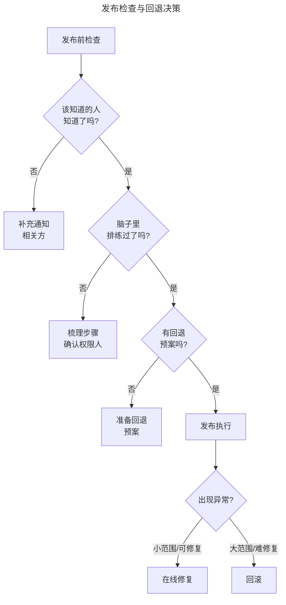

# 07 | 产品发布的那些坑儿

> **适用范围**：产品经理、项目经理、需要负责产品发布的团队负责人。适用于发布管理、相关方通知、流程预演、回退预案、发布掉坑规避等场景。
>
> **更新摘要（v2 · 2026-08 更新）**：
> - 结构化升级为 6 节骨架（导言 / 核心方法论 / 关键流程 / 工具与实战 / 常见误区 / 进阶延展）
> - 保留"三个检查思路"（相关方通知、流程预演、回退预案）
> - 移除失效图片引用（发布检查清单手稿），改为文字化描述

---

## 1. 导言

上次的分享，我们讲到了产品的立项以及立项过程中的一些关注点。在项目立项后，就需要组成项目团队、设计、评审、开发、做项目管理与执行等等。这部分内容在上一季专栏中聊过，这里就不再展开了，今天的分享，我想跟你说说关于发布的一些经验和注意事项。

产品发布是临门一脚，虽然不算是决定性的关键时刻，但如果做得不好，也会导致慌乱，影响大家对项目和项目组的信心。过去我在发布中碰过无数的钉子，有很多有意思的经历，讲出来或许可以帮你避免类似的坑。

我过去在发布上摔了很多跟头，经常是信心满满地发布，灰头土脸地回滚。我遇到的问题也五花八门，比如先发了代码没做数据库变更，或者发了数据库变更忘了及时订正数据，又或者时间没协调好，发布计划中第一步还没做完第三步就到点儿执行了，甚至是临发布了发现有个流程负责人在飞机上不能接电话等等。

这个事情为我养成了两个习惯，一个是每到项目发布就非常紧张，如临大敌，草木皆兵，为此经常被同事调侃；另一个是我自己一直以来悄悄记录着一个发布时的检查清单，在很长一段时间里，每当自己负责的项目发布时，我都会对着看一遍。

> **说明**：原版附有一张作者早年记录的"发布检查清单"手稿图片，因图片失效已移除。这里面的每一条，基本都是因为碰过钉子才记下来的，有的还碰了不止一次。要在发布环节做到"一切尽在掌握"，可以总结为三个检查思路。

---

## 2. 核心方法论

### 2.1 检查思路一：该知道的人知道了吗

这是最关键的一步，大部分的发布问题都出在"有人不知道"，也就是相关方对发布的范围或时间不知情。

这里指的相关方首先是技术和流程上的相关方。比如检查清单中的第一条，就是项目发布了，该互相庆祝也庆祝完了，大家收拾东西准备下班了，这时发现隔壁部门的系统挂了，原因是我们改了某个业务状态逻辑没有提前通知对方。类似的还有时我们依赖别人的接口或服务，甚至是业务刚上线借用了别人的服务器，结果发布的时候没提前跟人家说好，流量一下上来了，把人家的服务或服务器给干挂了。

还有业务部门和用户的相关方，这个在前面讲立项过程的时候也提过。

> **关键观点**：最后还要多提一句发布通知，这是在大公司里养成的习惯，简短地跟相关人说一下什么东西发布了，可能会带来些什么改变等等。发布通知尽可能冷静克制，发到合适的人就好了，别漏掉谁，也别什么事儿都兴师动众给全公司发邮件。一般发布通知最后会有一两句致谢，真诚简短足矣，不要加戏。经常看到大公司的致谢特别长，其实显得特别不真诚，反而过犹不及，有点官僚主义。

### 2.2 检查思路二：脑子里排练过吗

这个过程跟做产品设计时理解用户场景的过程类似，我们应当尽量在脑海中把整个发布过程演一遍。有时候严肃一点的项目会有明确的发布计划，发布计划会列明每一步做什么，先后顺序和负责人，可能的异常情况和预案。

几乎所有的发布意外都会跟准备不充分有关系，如果没有提前做好计划，或者某些环节被忽略、没有预留出足够的时间等等情况下，那就很有可能在发布的过程中出了问题。

而且类似的问题经常是：测试环境一切正常，发布到生产环境就不工作了。慌乱中很可能会节外生枝，比如早先我们没有服务治理之类的东西，有一些特定的服务需要在负载均衡上指定特定的服务器。但是测试环境是单点，不会出问题，结果发到生产环境集群上就忘记了这个步骤，导致连环挂，查了很久才找到原因。

除了技术问题之外，把所有的流程在脑海中排练一遍，也可以帮助我们去识别流程上一些关键步骤的权限人，比如管数据库或服务器的同事，不要到了执行到了某一步的时候才去找人。

### 2.3 检查思路三：万一出意外有退路吗

凡事都应当往好的方向努力，往坏的方向打算，发布也是如此，充分准备的同时也要准备好出现意外时的预案。

发布过程中出现问题的时候，可以根据影响用户的范围决定是回滚还是在线修，能不回滚尽量别回滚，毕竟会伤害团队士气。所以为了尽量留出余量，发布时间也尽可能慎重选择。不要在业务高峰时间段发布，即便真出了问题也可以坚持一会儿尽量修复掉。另外也尽量避免在周末晚上发布，可能发完大家回家过周末了，万一出问题想召集人解决都很难。

如果确实救不回来了，就开始按部就班地回滚，如果项目规模很大，回滚的顺序也很重要，这个没有什么特别的技术含量，提前有个准备就可以。常在河边走，早晚要湿鞋，遇到了不要慌乱，沉住气处理好就行了。

---

## 3. 关键流程

### 3.1 发布检查清单（三大思路）示例

结合三个检查思路，一个实用的发布检查清单应包含：

**相关方通知类**：
- 依赖的服务/接口/服务器负责人已通知并确认
- 业务部门（客服、运营、销售）已培训并准备 FAQ
- 用户相关方已收到功能更新说明
- 发布通知已起草并审核（冷静克制、精准定向、简短真诚）

**流程预演类**：
- 发布步骤及先后顺序已明确
- 每步的权限人已确认在岗且可联系
- 测试环境与生产环境配置一致性已确认（尤其负载均衡、集群配置）
- 数据库变更/数据订正脚本已准备并测试
- 每步耗时与总耗时已预估，预留足够时间

**回退预案类**：
- 回退触发条件已明确
- 回退顺序已确定
- 数据回退方案已准备
- 发布时间避开业务高峰和周末晚上

### 3.2 发布执行的决策逻辑

> **图解**：发布检查与回退决策——发布前依次检查"该知道的人知道了吗"（否则补充通知）、"脑子里排练过了吗"（否则梳理步骤）、"有回退预案吗"（否则准备预案），通过后发布执行，出现异常时按影响范围决定在线修复或回滚。

---

## 4. 工具与实战

### 4.1 发布时的三个检查思路

| 检查思路 | 核心问题 | 关键要点 |
|---------|---------|---------|
| 相关方通知 | 该知道的人知道了吗？ | 覆盖技术/业务/用户三层，通知冷静克制、精准定向 |
| 流程预演 | 脑子里排练过了吗？ | 梳理步骤、确认权限人、检查环境一致性、预估时间 |
| 回退预案 | 万一出意外有退路吗？ | 备好回退触发条件、顺序、数据回退方案，选好发布时间 |

### 4.2 发布时间选择原则

- 不在业务高峰时间段发布（出问题可坚持修复）。
- 尽量避免在周末晚上发布（出问题难召集人手）。
- 发布后预留观察期，确保问题能在当班内发现与处理。
- 全球产品需考虑主要用户市场的时区。

---

## 5. 常见误区

| 误区 | 表现 | 正确做法 |
|------|------|---------|
| **通知遗漏** | 改业务状态逻辑没通知依赖部门 | 相关方通知覆盖技术/业务/用户三层 |
| **发布通知过度** | 全公司广播、长篇致谢 | 冷静克制、精准定向、真诚简短 |
| **测试即生产** | 测试环境正常就以为生产正常 | 检查环境一致性，防范负载均衡/集群配置差异 |
| **无回退预案** | 出意外没有退路 | 备好回退顺序、数据回退、触发条件 |
| **高峰/周末发布** | 在业务高峰或周末晚上发布 | 避开高峰和周末，预留修复窗口 |
| **慌乱回滚** | 出问题慌乱决策 | 沉住气，按影响范围决定在线修还是回滚 |

---

## 6. 进阶延展

### 6.1 总结

今天我们分享了产品或项目的发布，它其实是一个非常小而且不怎么核心的环节，我在准备这篇内容的时候也曾经犹豫过，担心它会不会太微不足道了。

但是，考虑到一方面发布具有很重要的里程碑意义，另一方面作为产品经理（也可能是项目经理）需要在各种环节中保持稳定和专业，也是职业素养的体现。要在发布环节做到"一切尽在掌握"，核心就是三个检查思路：该知道的人知道了吗、脑子里排练过了吗、万一出意外有退路吗。

### 6.2 延伸阅读

- 上一篇："如何做好产品立项"——立项四要素与自查要点
- 相关篇目："产品发布的系统化检查与风险管控"——三维检查框架与发布检查清单
- 关于发布管理、持续交付（Continuous Delivery）、灰度发布的实践资料
