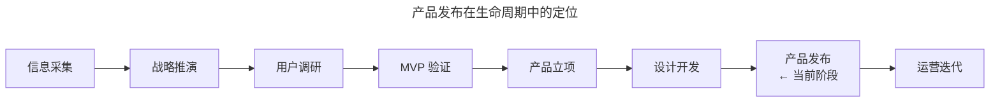
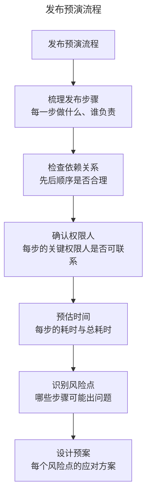
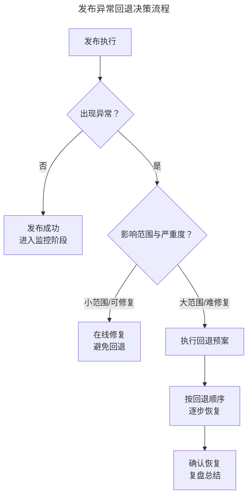
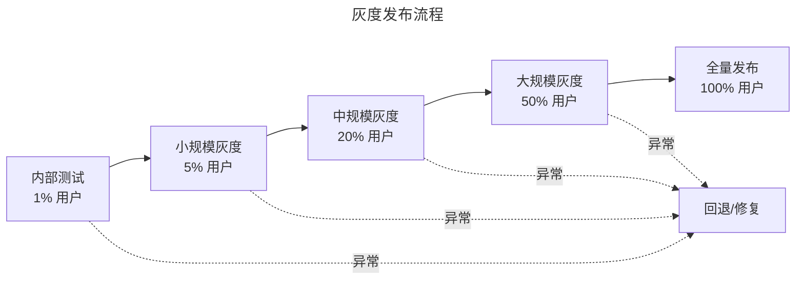
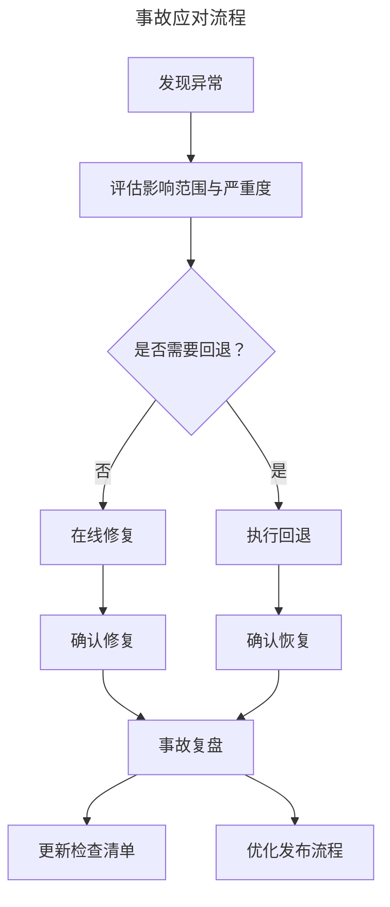

# 07 | 产品发布的系统化检查与风险管控

> **适用范围**：产品经理、技术负责人、DevOps/SRE 工程师、需要负责产品发布的管理者。适用于发布管理、风险管控、灰度发布、回退预案、事故复盘等场景。
>
> **更新摘要（v2 · 2026-08 更新）**：
> - 结构化升级为 6 节骨架（导言 / 核心方法论 / 关键流程 / 工具与实战 / 常见误区 / 进阶延展）
> - 保留相关方通知、流程预演、回退预案三维检查框架
> - 保留全部 Mermaid 图并补充 `--- title: ... ---` frontmatter，每张图后追加文字解读
> - 参考资料融入进阶延展

---

## 1. 导言

产品发布是产品从开发到交付用户的关键里程碑，虽非决定性环节，但执行不当可能导致运营事故、团队信心受损与用户信任丧失。本文基于 Release Management 与 Site Reliability Engineering（SRE）理论，系统阐述产品发布的三维检查框架——相关方通知、流程预演与回退预案，结合 2024–2026 年持续交付（Continuous Delivery）、Feature Flag、灰度发布与可观测性平台的最新实践，提出发布质量的自检清单与风险分级策略。

### 1.1 核心定义

**产品发布（Product Release / Deployment）** 是指将通过验证与开发的产品功能交付至生产环境，使其对目标用户可用的过程。发布管理涵盖技术部署、流程协调、相关方通知与异常应对等全流程。

### 1.2 发布在产品生命周期中的定位

> **图解**：产品发布位于产品生命周期的关键节点——信息采集→战略推演→用户调研→MVP 验证→产品立项→设计开发→产品发布→运营迭代。

### 1.3 发布事故的典型分类

| 事故类型 | 典型场景 | 影响范围 | 严重度 |
|----------|---------|---------|--------|
| 依赖遗漏 | 发布后导致依赖系统异常 | 跨系统 | 高 |
| 数据不一致 | 代码已发布但数据库未变更 | 数据完整性 | 高 |
| 流程失序 | 发布步骤顺序错乱 | 发布进度 | 中 |
| 人员不可达 | 关键权限人在飞机上/休假 | 发布阻塞 | 中 |
| 容量不足 | 新功能流量压垮依赖服务 | 服务可用性 | 高 |
| 通知遗漏 | 相关方不知情导致被动 | 运营配合 | 低–中 |

---

## 2. 核心方法论：三维检查框架

### 2.1 维度一：相关方通知

**核心问题**：该知道的人知道了吗？

大部分发布事故的根因是"有人不知道"。相关方通知需覆盖三个层次：

| 通知层次 | 对象 | 内容 | 时机 |
|----------|------|------|------|
| 技术相关方 | 依赖服务负责人、运维、SRE | 变更内容、影响范围、应急预案 | 发布前 24–48 小时 |
| 业务相关方 | 运营、客服、销售 | 功能变更、用户影响、FAQ | 发布前 24 小时 |
| 用户相关方 | 受影响用户群体 | 功能更新说明、使用指引 | 发布时或发布后 |

**发布通知的撰写原则**：

| 原则 | 说明 | 反模式 |
|------|------|--------|
| 冷静克制 | 客观陈述发布内容与影响 | 夸大其词、过度营销 |
| 精准定向 | 发给需要知道的人 | 全公司广播无关更新 |
| 简短真诚 | 一两句致谢足矣 | 长篇致谢清单，显得虚伪 |
| 不加戏 | 信息传递为目的，非自我表达 | 加入个人感言或多余修饰 |

### 2.2 维度二：流程预演

**核心问题**：脑子里排练过吗？

流程预演是将整个发布过程在脑海中或文档中完整演练一遍，识别潜在的顺序依赖、权限瓶颈与时间冲突。

> **图解**：发布预演流程——梳理发布步骤→检查依赖关系→确认权限人→预估时间→识别风险点→设计预案，形成完整预演闭环。

**预演的关键检查项**：

| 检查项 | 问题 | 常见遗漏 |
|--------|------|---------|
| 环境一致性 | 测试环境与生产环境配置是否一致？ | 负载均衡配置差异 |
| 步骤顺序 | 是否有必须先于另一步的操作？ | 数据库变更必须在代码部署前 |
| 权限人可用性 | 关键步骤的权限人是否在岗？ | DBA 在飞机上 |
| 时间窗口 | 每步是否预留了足够时间？ | 数据订正耗时被低估 |
| 依赖服务 | 依赖方是否已准备就绪？ | 第三方 API 限流未提前申请 |

> **常见陷阱**：测试环境一切正常，生产环境不工作。典型场景：测试环境为单点部署，生产环境为集群部署，遗漏了负载均衡配置步骤；测试环境数据量小，生产环境数据量大，数据迁移脚本超时。

### 2.3 维度三：回退预案

**核心问题**：万一出意外有退路吗？

> **图解**：发布异常回退决策流程——发布执行后判断是否异常：无异常则发布成功进入监控；有异常则评估影响范围与严重度：小范围可修复则在线修复，大范围难修复则执行回退预案，按回退顺序逐步恢复，确认恢复后复盘总结。

**回退决策原则**：

| 情况 | 推荐策略 | 理由 |
|------|---------|------|
| 影响小、可快速修复 | 在线修复 | 回退伤害团队士气 |
| 影响大、修复时间长 | 回退 | 减少用户影响时间 |
| 不确定根因 | 先回退 | 安全优先，排查在回退后进行 |

**回退预案的关键要素**：

| 要素 | 内容 |
|------|------|
| 回退触发条件 | 什么情况下启动回退？（如错误率 >5%、P0 报障 >3 个） |
| 回退顺序 | 各步骤的回退顺序（通常与发布顺序相反，但不总是） |
| 数据回退 | 数据库变更如何回退？是否需要数据订正？ |
| 回退验证 | 回退后如何确认系统恢复正常？ |
| 回退时间预估 | 完整回退需要多长时间？ |

---

## 3. 关键流程

### 3.1 发布时机的选择

**时间窗口原则**：

| 原则 | 说明 | 原因 |
|------|------|------|
| 避开业务高峰 | 不在用户活跃时段发布 | 出问题可坚持修复，影响最小 |
| 避开周末/假日 | 不在团队不在岗时发布 | 出问题难召集人手 |
| 预留修复窗口 | 发布后至少留 2–4 小时观察期 | 确保问题能在当班内发现与处理 |
| 考虑时区 | 全球产品需考虑主要用户市场的时区 | 在用户最不活跃的时段发布 |

**发布时间窗口决策矩阵**：

| 时间段 | 推荐度 | 原因 |
|--------|--------|------|
| 工作日上午 10:00–12:00 | ★★☆☆☆ | 业务高峰，出问题影响最大 |
| 工作日下午 14:00–17:00 | ★★★☆☆ | 团队在岗，但临近下班 |
| 工作日晚间 20:00–22:00 | ★★★★☆ | 用户低谷，团队部分在岗 |
| 周末 | ★☆☆☆☆ | 团队不在岗，出问题难响应 |
| 工作日清晨 6:00–8:00 | ★★★★★ | 用户最少，全天修复时间充裕 |

### 3.2 按风险分级的发布策略

| 风险等级 | 发布策略 | 审批要求 | 监控要求 |
|----------|---------|---------|---------|
| 低风险（UI 调整、文案修改） | 直接发布 | 产品经理确认 | 常规监控 |
| 中风险（新功能、流程变更） | 灰度发布 | 技术 + 产品双确认 | 加强监控 2 小时 |
| 高风险（架构变更、数据迁移） | 蓝绿部署 + 灰度 | 技术 + 产品 + 管理层三方确认 | 专人盯盘 4 小时 |

### 3.3 灰度发布（Canary Release / Phased Rollout）

> **图解**：灰度发布流程——内部测试（1% 用户）→小规模灰度（5%）→中规模灰度（20%）→大规模灰度（50%）→全量发布（100%），任一阶段异常则回退/修复。

| 灰度阶段 | 用户比例 | 持续时间 | 关注指标 |
|----------|---------|---------|---------|
| 内部测试 | 1–5% | 1–2 天 | 功能正确性、错误率 |
| 小规模灰度 | 5–10% | 1–2 天 | 核心指标无明显下降 |
| 中规模灰度 | 20–50% | 2–3 天 | 业务指标平稳 |
| 全量发布 | 100% | — | 持续监控 |

### 3.4 蓝绿部署（Blue-Green Deployment）

| 环境 | 状态 | 说明 |
|------|------|------|
| 蓝环境 | 当前生产 | 承载全部流量 |
| 绿环境 | 新版本 | 部署新代码，初始无流量 |
| 切换 | 流量从蓝到绿 | 通过负载均衡一键切换 |
| 回退 | 流量从绿回蓝 | 新版本有问题时秒级回退 |

---

## 4. 工具与实战

### 4.1 通用发布检查清单

| # | 检查项 | 类别 | 状态 |
|---|--------|------|------|
| 1 | 依赖服务方已通知并确认 | 通知 | ☐ |
| 2 | 客服/运营团队已培训并准备 | 通知 | ☐ |
| 3 | 发布通知已起草并审核 | 通知 | ☐ |
| 4 | 数据库变更脚本已准备并测试 | 技术 | ☐ |
| 5 | 数据订正脚本已准备（如需） | 技术 | ☐ |
| 6 | 配置变更已同步至生产环境 | 技术 | ☐ |
| 7 | 负载均衡/网关配置已更新 | 技术 | ☐ |
| 8 | 监控告警已配置 | 技术 | ☐ |
| 9 | Feature Flag 已配置（如使用） | 技术 | ☐ |
| 10 | 回退预案已文档化 | 预案 | ☐ |
| 11 | 回退触发条件已明确 | 预案 | ☐ |
| 12 | 关键权限人已确认在岗 | 人员 | ☐ |
| 13 | 发布时间窗口已确认 | 时间 | ☐ |
| 14 | 发布后观察期已安排 | 时间 | ☐ |

### 4.2 Feature Flag（功能开关）

Feature Flag 是 2024–2026 年发布管理的核心实践，允许在不重新部署的情况下控制功能的开启与关闭：

| 能力 | 说明 | 发布场景 |
|------|------|---------|
| 灰度控制 | 按百分比逐步开放功能 | 新功能灰度发布 |
| 用户分群 | 按用户属性控制功能可见性 | A/B 测试、VIP 优先体验 |
| 紧急关闭 | 一键关闭异常功能 | 替代回退的快速止损手段 |
| 运维开关 | 按环境控制功能状态 | 测试环境全开、生产环境灰度 |

**代表工具**：LaunchDarkly、Split.io、PostHog Feature Flags、Unleash（开源）。

### 4.3 可观测性平台

2024–2026 年，可观测性（Observability）已成为发布管理的基础设施：

| 类别 | 工具 | 发布场景用途 |
|------|------|-------------|
| 指标监控 | Datadog、Grafana、Prometheus | 实时监控错误率、延迟、吞吐量 |
| 日志分析 | ELK Stack、Loki | 快速定位异常根因 |
| 链路追踪 | Jaeger、Zipkin、Datadog APM | 分布式系统的请求链路追踪 |
| 告警管理 | PagerDuty、Jira Service Management | 发布异常的即时通知 |
| Session Replay | PostHog、FullStory | 观察用户在发布后的实际体验 |

### 4.4 事故应对与复盘

**事故应对流程**：

> **图解**：事故应对流程——发现异常→评估影响范围与严重度→判断是否需要回退→在线修复或执行回退→确认修复/恢复→事故复盘→更新检查清单与优化发布流程。

**Blameless Post-mortem（无责复盘）**——2024–2026 年的行业最佳实践，复盘聚焦于系统与流程的改进，而非个人追责：

| 原则 | 说明 | 反模式 |
|------|------|--------|
| 对事不对人 | 关注"系统为何允许这个错误发生" | "谁犯了这个错" |
| 假设善意 | 每个人都在当时条件下做了最佳判断 | 假设有人疏忽或恶意 |
| 关注流程 | 改进检查清单与流程 | 增加审批层级 |
| 可操作改进 | 每个发现对应具体的改进行动 | 泛泛的"加强注意" |

**复盘文档模板**：

| 章节 | 内容 |
|------|------|
| 事故概述 | 时间、影响范围、严重度 |
| 时间线 | 从发布开始到恢复的完整时间线 |
| 根因分析 | 5 Whys 或 Fishbone 分析 |
| 改进行动 | 具体行动项、负责人、截止日期 |
| 检查清单更新 | 哪些检查项需要新增或修改 |

---

## 5. 常见误区

| 误区 | 表现 | 正确做法 |
|------|------|---------|
| **通知遗漏** | 该知道的人不知道，运营被动 | 三维检查框架中的相关方通知覆盖三层 |
| **测试即生产** | 测试环境正常就以为生产也正常 | 检查环境一致性，防范配置差异 |
| **无回退预案** | 出意外没有退路 | 准备回退触发条件、顺序、验证方案 |
| **高峰期发布** | 在用户活跃时段发布 | 避开业务高峰，选用户低谷时段 |
| **有责复盘** | 复盘聚焦追责而非改进 | 用 Blameless Post-mortem，对事不对人 |

---

## 6. 进阶延展

### 6.1 持续交付与 GitOps

2024–2026 年，持续交付（Continuous Delivery）与 GitOps 已成为发布的主流范式：

| 传统发布 | GitOps 发布 |
|----------|------------|
| 手动执行发布脚本 | Git 提交触发自动部署 |
| 人工检查清单 | 自动化检查门禁 |
| 手动回退 | Git Revert 触发自动回退 |
| 人工监控 | 自动化告警与自愈 |

### 6.2 Progressive Delivery（渐进式交付）

Progressive Delivery 是灰度发布的演进，结合 Feature Flag、可观测性与自动化决策：
1. **部署**：新代码部署至生产环境，Feature Flag 关闭。
2. **灰度**：通过 Flag 逐步开放给更多用户。
3. **验证**：自动化监控核心指标，异常自动回退。
4. **全量**：指标正常，自动推进至全量。

### 6.3 AI 辅助的发布监控

| 能力 | 说明 | 工具 |
|------|------|------|
| 异常检测 | AI 自动检测发布后指标异常 | Datadog Watchdog、Dynatrace Davis AI |
| 根因分析 | AI 辅助快速定位异常根因 | Dynatrace、New Relic AI |
| 自动回退 | 检测到异常自动触发回退 | LaunchDarkly + Datadog 集成 |
| 影响评估 | AI 评估发布对业务指标的影响 | Amplitude Compass、Eppo |

### 6.4 参考文献

1. Humble, J. & Farley, D. (2010). *Continuous Delivery*. Addison-Wesley.
2. Beyer, B., Jones, C., Petoff, J., Murphy, R. (2016). *Site Reliability Engineering*. O'Reilly Media.
3. Kim, G., Humble, J., Debois, P., Willis, J. (2016). *The DevOps Handbook*. IT Revolution.
4. Forsgren, N., Humble, J., Kim, G. (2018). *Accelerate*. IT Revolution.
5. Blank, S. (2020). *The Startup Owner's Manual*. Wiley.
6. Cagan, M. (2020). *Empowered: Ordinary People, Extraordinary Products*. Wiley.
