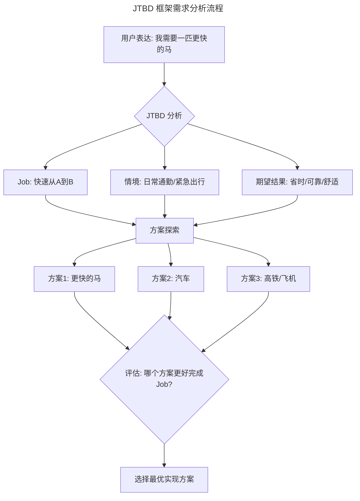
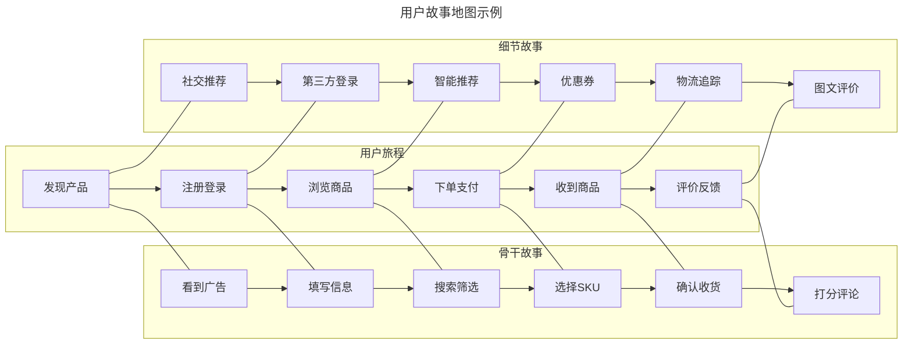
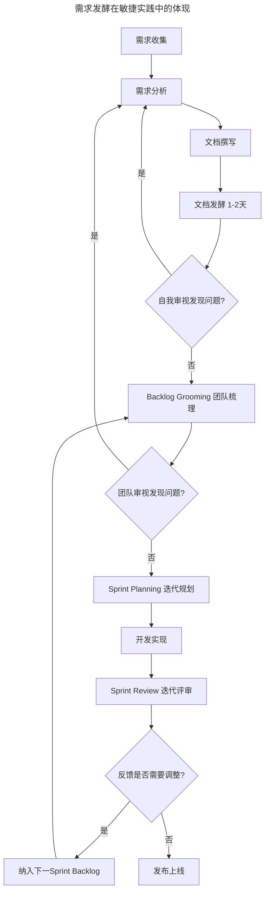
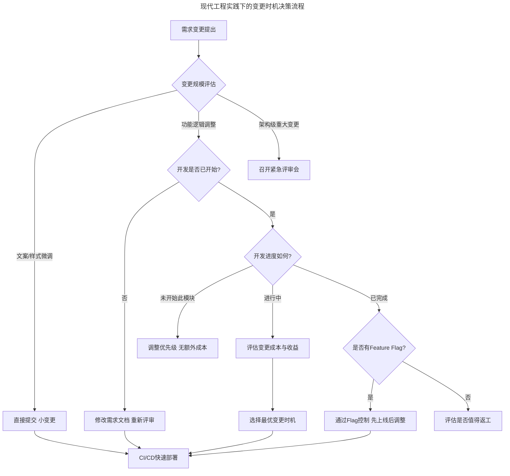
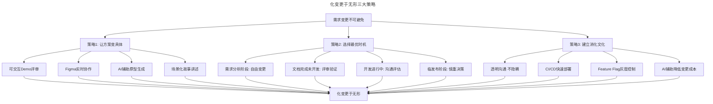
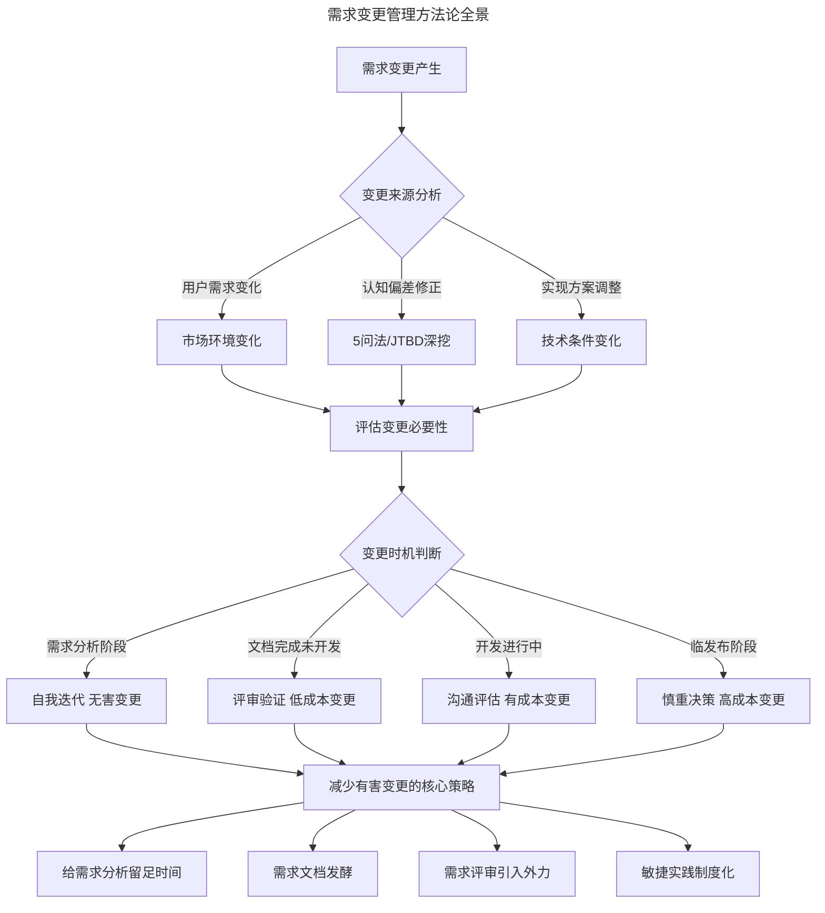

# 07 | 关于需求变更

> **适用范围**：产品经理（需要理解需求变更本质）、需求分析者、需要管理需求变更的团队负责人。适用于需求挖掘、JTBD 框架、5 问法、需求评审、变更时机选择、变更文化建立等场景。
>
> **更新摘要（v2 · 2026-08 更新）**：
> - 结构化升级为 6 节骨架（导言 / 核心方法论 / 关键流程 / 工具与实战 / 常见误区 / 进阶延展）
> - 合并"需求背后的需求"（上）与"化变更于无形"（下）为单篇完整文档
> - 保留全部 Mermaid 图并补充 `--- title: ... ---` frontmatter，每张图后追加文字解读

---

## 1. 导言

**"唯一不变的，就是变化本身。"——斯宾塞·约翰逊**

每当行业中想要黑产品经理时，首个被砸下来的罪责一定是"需求变更"，仿佛需求变更是产品经理最要命的错误，我并不这么看。所谓需求变更其实很复杂，不能一概而论，今天我们就来聊聊它。

> **核心摘要**：需求变更的本质往往不是用户需求本身的变化，而是产品经理对需求理解的深化或实现手段的调整。通过"5问法"和 JTBD 框架挖掘需求背后的真实动机，是产品经理最核心的基本功。给需求分析留出充足的"发酵"时间，并通过需求评审引入外力检验方案，是减少有害变更的关键策略。在 AI 辅助分析和远程协作成为常态的今天，需求变更管理的工具和方法正在经历深刻变革，但"理解真实需求"这一核心能力依然不可替代。

---

## 2. 核心方法论

### 2.1 需求不会变更，变更的是实现

"需求变更"四个字有个不好的暗示，仿佛变更是来源于产品用户的需求变化。实则不然，从整个团队的角度看，需求变更多半其实是指"实现变更"。

用户的需求通常很稳定，变更是由于产品经理对用户需求的分析出现了偏差，或满足用户需求的手段发生了调整。比如，产品经理说需要一匹更快的马，后来换成了要汽车。在这个过程中，用户的需求一直都是"更快到达目的地"，变更的是满足需求的方式。

**基础层：理解"需求"与"实现"的边界**——这里有一个关键区分：**用户需求（Need）** 与 **产品需求（Requirement）** 是两个不同层级的概念：

| 维度 | 用户需求 | 产品需求 |
|------|----------|----------|
| 本质 | 问题与目标 | 解决方案 |
| 稳定性 | 高，核心需求长期不变 | 低，随认知和技术迭代 |
| 变更性质 | 市场环境变化导致 | 认知深化或条件变化导致 |
| 示例 | "更快到达目的地" | "一匹更快的马"→"汽车" |

### 2.2 进阶层：JTBD 框架——从"需求"到"任务"

近年来，**JTBD（Jobs To Be Done）** 框架在产品管理领域获得了广泛应用，它为我们理解"需求不变、实现变更"提供了更系统的理论支撑。JTBD 的核心理念是：**用户不是在"购买"产品，而是在"雇佣"产品来完成某个任务**。

用 JTBD 的视角重新审视"更快的马"这个经典案例：用户要完成的 **Job** 是"从 A 点快速到达 B 点"；"更快的马"只是用户基于已有认知提出的 **现有雇佣方案**；汽车则是更优的 **替代雇佣方案**；Job 本身没有变，变的是完成 Job 的手段。

> **图解**：基于 JTBD 框架的需求分析流程——从用户表达到 Job 识别（快速从 A 到 B、情境、期望结果），再到方案探索（更快的马/汽车/高铁），评估哪个方案更好完成 Job，选择最优实现方案。

### 2.3 高阶层：AI 时代的"需求-实现"边界再思考

随着 AI 技术的快速发展，"需求不变、实现变更"这一原则正在被赋予新的含义。2024-2025 年，大量产品经历了从"规则驱动"到"AI 驱动"的实现方式变革：同样是"帮助用户找到想要的信息"这个需求，实现方式从搜索引擎的关键词匹配，演进到 RAG（检索增强生成）驱动的智能问答，再到 Agent 自主规划搜索策略。用户需求没有变，但实现方式发生了根本性转变。

> **关键观点**：**AI 不是需求，AI 是实现手段**。用户不需要"AI 功能"，用户需要的是更快、更准、更省力地完成他们的 Job。当团队中有人提出"我们需要加一个 AI 功能"时，产品经理的第一反应应该是追问：这个 AI 功能帮助用户完成了什么 Job？是否有更简单的方式达成同样的目标？

### 2.4 挖掘需求背后的需求

对于产品经理来说，挖掘"一匹更快的马"背后真实的用户动机是最重要的基本功，不要停留在用户自己提出的所谓需求上，这些需求只是真正需求的一个线索。

有句关于产品需求挖掘的名言叫作"用户不需要 1/4 英寸的钻头，他需要的是 1/4 英寸的洞。"这句话后来又被继续演绎成更多版本，比如"用户需要的也不是 1/4 英寸的洞，而是在墙上挂一幅画"，甚至是"用户不是需要画，他需要房间的格调"等等。这些听起来像抬杠的演绎，其实就是不断探索和挖掘真正需求的过程。

**"5问法"：经典追问技术**——这就是我在工作中经常用到的"5问法"，针对一个问题，连续以"为什么"来自问，连问 5 次，从而追究其根本原因，找到用户背后真正的动机。这一方法是由丰田佐吉提出的，后来被用在震古烁今的丰田模式里。

比如，做公司内部的订单系统，用户提出希望为订单添加根据最近修改时间排序的支持，你不应该直接去实现，而应该问为什么。可能用户会说，因为每天的订单量太大，审核不完，为了防止订单过期，所以要从最久远的一份开始审核。很多产品经理到这里就结束了，但这还不够，你应该继续问下去，比如可以问为什么订单会过期，或为什么一定要审核。这是我经历过的一个真实案例，随着不断深入挖掘，后来发现有大量的审核工作是可以自动完成的，最终我们做了一个自动审核的功能，彻底解决了这个问题。

> **关键警示**：如果没有多问几个为什么，只是把需求方或用户提出的要求当作需求列表转交给开发，这就是一个产品经理的渎职，如果又因此引发了需求变更，那么产品经理受到工程师鄙视也很合理。大部分产品经理在实习期以后，就不应该再犯这样的错误了。

### 2.5 用户故事地图：从线性列表到立体全景

"5问法"解决了"深"的问题，但需求分析还需要"广"的视角。**用户故事地图（User Story Mapping）** 是 Jeff Patton 提出的方法，它将用户需求按照"用户旅程"和"优先级"两个维度组织，帮助产品经理从全局视角理解需求之间的关系。

> **图解**：用户故事地图示例——电商产品需求全景，用户旅程（发现产品→评价反馈）与骨干故事、细节故事对应，形成立体全景。核心价值：防止遗漏、识别依赖、优先级可视化、减少变更。

### 2.6 AI 辅助需求挖掘：新工具与新陷阱

2024-2025 年，大语言模型（LLM）为需求挖掘提供了新的辅助手段。产品经理可以利用 AI 工具进行：**用户反馈聚类分析**（将大量用户反馈、客服工单、App Store 评论输入 AI，快速识别高频问题和潜在需求）；**竞品功能对比**（利用 AI 快速梳理竞品功能矩阵，发现差异化机会）；**需求假设验证**（在用户访谈前，用 AI 模拟不同用户画像，预演可能的回答方向）。

> **关键警示**：AI 辅助挖掘存在 **"确认偏误放大"** 的风险——如果你带着预设结论去提问，AI 很容易给出"支持你观点"的回答，而不是真正揭示盲点。AI 是加速器，不是替代品，最终的需求判断仍需产品经理亲自走到用户中去验证。

---

## 3. 关键流程

### 3.1 给需求分析留出时间

举个例子，如果产品经理分析需求用了两天，然后工程师接手开发六天，开发到第二天，产品经理跑来了说："抱歉，有个小小的变更"。第一个可能就是分析需求的时间不够，在短时间内，产品经理的方案和逻辑没有完全想透，但为了尽快出结果，紧赶慢赶写完需求文档交给下一个阶段。

开发接手后，产品经理坐在那儿反刍的时候，怎么想怎么觉得有问题，于是提出变更。这是因为"需求分析"过程没有受到足够的重视，所以没有给足产品经理足够的时间。

据我所知，有不少项目都是先确定发布时间，然后减去测试和开发需要的时长，反过来倒逼产品经理完成需求文档的时间点。有意思的是，很多时候这都是产品经理自愿的，因为项目发布的第一负责人通常是产品经理自己。他很有可能在内心鼓励自己说："晚上熬个夜，把文档出一下，用不了多久。"

> **关键观点**：没错，写个文档是用不了多久，但思考是需要时间的。在整个项目进行过程里，变更出现越早代价就会越小。如果变更只出现在产品经理脑子里，对团队的伤害其实是最小的。所以，我特别建议给前期需求分析的过程留点时间和空间，让产品经理能在自己的脑子里跟自己多较较劲，把该变的都变完，交出尽可能稳定的方案。

**需求文档的"发酵"**——我在过去的工作中经常建议产品经理在完成需求分析，写好需求文档之后，把文档放下来，不去想它，做一点别的事情，等个一两天，大脑从需求的情境中脱离出一点之后再重新去读自己写的文档。通常他们都会发现或大或小的问题，我们把这个过程叫作需求文档的发酵。没有比把文档放到那里搁置几天更有效的办法了。

**敏捷实践中的需求"发酵"**——在敏捷开发实践中，需求"发酵"有了更制度化的保障：Sprint Review（迭代评审，小规模周期性的需求验证）、Backlog Grooming/Refinement（需求池梳理，持续"发酵"）、Sprint Planning（迭代规划，深入讨论）。

> **图解**：需求"发酵"在敏捷实践中的制度化体现——需求收集→需求分析→文档撰写→文档发酵（1-2 天）→自我审视发现问题则回到需求分析，否则进入 Backlog Grooming 团队梳理→Sprint Planning 迭代规划→开发实现→Sprint Review 迭代评审，反馈需要调整则纳入下一 Sprint，否则发布上线。

### 3.2 别忘了需求评审

还有一件重要的事情，就是建议增加需求评审。不一定是架上投影仪开大会，找几个人到茶水间聊一会儿也行。尽可能引入外力，比如用户代表、运营、开发、测试、老板等等，千万不要你好我好大家好，一片和气。在方案交到开发阶段之前，把它挂起来先打个遍体鳞伤，否则开发到一半再变更，就只能把产品经理挂起来打个遍体鳞伤了。

**远程协作时代的需求评审新挑战**——2020 年以来，远程办公和混合办公模式已成为大量科技公司的常态。这一变化给需求评审带来了新的挑战：注意力分散（线上会议中参与者更容易分心）、非语言信息缺失（无法观察表情和肢体语言）、讨论深度不足（线上会议的"发言门槛"更高）、时区差异（跨国团队需兼顾不同时区）。应对策略：异步预审 + 同步讨论；缩短单次会议时长（将 2 小时拆成 2-3 次 45 分钟专题评审）；利用协作白板（Miro/FigJam）；录制与回放。

### 3.3 "具体"的力量

大部分的需求评审会都是过场，大家下面玩玩手机，产品经理在上面对着需求文档读一遍，再开开心心散会，除了浪费了时间，什么用都没有。这里最大的问题不是参会的人员不负责任，而是需求评审时的方案不够"具体"。

我曾听说在微信团队里，不少产品在做出来之后，需要先交给张小龙上手体验一下之后才决定生死。我想，或许你也有同感，一个东西画在线框图上总是觉得很远，只有在指尖动一下才能有真切的体会和判断。所以对一些关键性的特性，在资源配置合理的情况下，尽可能做一个与实际情况没太大差异的 Demo 来做评审。数据可以是假的，架构可以是假的，但看起来和用起来要尽量保真。

**基础层：Demo 工具的演进——从 Axure 到 Figma**：

| 工具 | 定位 | 核心优势 | 适用场景 |
|------|------|----------|----------|
| **Figma** | 设计+原型一体化 | 实时协作、组件系统、Dev Mode | 团队协作、设计系统完善的产品 |
| **Framer** | 高保真交互原型 | 代码级交互、动画效果 | 需要展示复杂交互的场景 |
| **ProtoPie** | 传感器交互原型 | 硬件传感器模拟、高保真 | 智能硬件、车载系统等 |
| **Principle** | 动效原型 | 流畅动画、手势交互 | 移动端交互验证 |
| **v0.dev** | AI 生成原型 | 自然语言生成 UI | 快速概念验证 |

如果实在不想学专业工具，用 PowerPoint 和 Keynote 也可以。哪怕没有做成动态的，只是一张张截图，在评审的时候你也可以通过讲故事的方法让它变得具体。比如你可以展示一个界面，边引导大家边说："现在我是一个从朋友圈打开 xx 的用户，我看到的页面是这个样子。"

**进阶层：AI 辅助原型生成——"具体"的加速器**——AI 驱动的原型生成工具（如 v0.dev、Galileo AI、Uizard）为"具体"的力量提供了新的加速手段：**"具体"的门槛大幅降低**（产品经理可以自己快速生成初版）；**方案对比更高效**（同时生成多个方案进行 A/B 对比评审）；**用户测试前置**（在需求评审前用 AI 生成的原型做快速用户测试）。但需要注意：**AI 生成的原型是"看起来具体"，不等于"想清楚了"**。AI 生成的原型应该是讨论的起点，而不是终点。

### 3.4 变更时机的选择

如果变更在所难免，时机选择就很重要，并不是所有变更都"越早越好"，而是要平衡收益和成本。

- **最好的变更**发生在需求分析过程中，在产品经理脑子里，变更发生多少次都没关系，基本是无害的。
- **第二好的时机**是在需求文档结束，工程师接手前，这时的修改可能会造成需求分析延期，但因为需求分析主要是通过脑子完成，所以这里返工的伤害并不大。
- **在工程师接手后**，情况会变得有点复杂，这时的变更就会产生实际的开发成本了。有的变更很小，比如文案之类的，随时发现随时提，提的同时记得改掉文档描述。稍微大一点的功能，则最好在发现变更后就立即跟开发沟通，去判断合适的变更时机。
- **如果项目基本完成开发，箭在弦上准备发布了**，那对于变更一定要更加慎重，这时的态度应该是能不变就不变，可以先上线，通过运营的手段稳一下线上，然后尽快迭代做修改。

> **核心原则**：如果开发接手后有变更的想法，一定尽快跟工程师沟通，不要自己去猜测成本，而是让开发去做判断，然后再综合沉没成本和额外增加的成本去做评估。

**CI/CD 与 Feature Flag：降低变更代价的工程实践**——2024-2025 年，CI/CD（持续集成/持续部署）和 Feature Flag（功能开关）已经成为互联网产品团队的标准工程实践：CI/CD 将发布周期从"月"缩短到"天"甚至"小时"，变更不再需要等到"下一个大版本"；Feature Flag 允许将代码部署与功能发布解耦，产品经理可以随时"开灯"（灰度发布、A/B 测试、紧急回退、未完成功能的安全合并）。

> **图解**：现代工程实践下的变更时机决策流程——评估变更规模（文案微调直接提交、功能逻辑调整看开发进度、架构级重大变更召开紧急评审会），结合 CI/CD 快速部署与 Feature Flag 灰度控制，CI/CD 与 Feature Flag 改变了变更时机的博弈格局。

---

## 4. 工具与实战

### 4.1 让团队能消化需求变更

虽然大家本能上都讨厌需求变更，但我们永远都不可能彻底杜绝需求变更，更何况我认为有时需求变更也有积极意义。因为变更是响应变化，在互联网行业里，每天刀光剑影，瞬息万变，市场上发生的事情传递到产品和服务上，越快越好。如果整个团队抗拒需求变更，甚至建立流程对抗需求变更，久而久之就会越来越不敏感。

**"需求基线"的教训**——我体验过一个叫作"需求基线"的环节，就是需求确认结束以后大家签字画押，承诺绝对不变，连文档的编辑权限都封存，然后开发才接手，所有需求变更都必须审批到高管。这个制度导致的直接结果就是大家开始互相推诿，然后文档变得极其庞杂，效率降低，需求冻结以后，即便发现了问题和错误大家也不乐意提。没过多久，产品经理和工程师在半夜的烧烤摊上把酒言欢，沟通需求变更，产品把变更的内容私下发给工程师，工程师直接改。项目经理睁一只眼闭一只眼，团队士气却一点点回来了。后来大家慢慢意识到，这个本意用来限制甲乙方权责的流程不该在互联网公司中采用，也就逐渐废掉了。

**为什么僵化流程会失败**：① 假设需求可以完全想清楚（但互联网产品的需求本质上是探索性的）；② 用流程替代信任（用制度对抗人性，而非建立团队共识）；③ 忽视变更的积极面（有些变更确实是对市场变化的正确响应）。

**建立"消化变更"的团队文化**：

| 文化特征 | 僵化团队 | 健康团队 |
|----------|----------|----------|
| 对变更的态度 | 恐惧、抗拒 | 接受、评估 |
| 变更沟通方式 | 隐瞒、私下交易 | 透明、及时沟通 |
| 变更决策机制 | 高管审批 | 团队协商 |
| 工程实践 | 大批量发布 | CI/CD + Feature Flag |
| 文档管理 | 冻结封存 | 持续更新、版本可追溯 |

**高阶层：从"消化变更"到"拥抱变化"——AI 时代的组织进化**——2024-2025 年，AI 工具正在从另一个维度改变团队对变更的消化能力：AI 辅助代码重构（大幅降低代码修改的时间成本）、自动化测试覆盖（AI 自动生成测试用例）、智能影响分析（AI 分析变更可能影响的代码和测试范围）。这些技术进步意味着：**变更的工程成本正在系统性降低**。但产品经理不能因此变得随意——**低成本不等于无成本**，AI 降低了变更的"硬成本"，但变更对团队士气和节奏的"软成本"依然存在。

### 4.2 方法论框架：化变更于无形

> **图解**：化变更于无形——三大策略（让方案变具体、选择最优时机、建立消化文化）及其具体实践，汇入"化变更于无形"的核心目标。

### 4.3 实战要点

| 要点 | 说明 | 适用场景 |
|------|------|----------|
| 区分需求与实现 | 用户需求稳定，变更的多是实现方式 | 所有需求变更场景 |
| 5问法深挖动机 | 连续追问5次"为什么"，找到根本原因 | 用户提出具体功能需求时 |
| JTBD框架分析 | 从"用户要完成什么任务"出发 | 需求分析初期、产品规划阶段 |
| 用户故事地图 | 沿用户旅程组织需求，全局视角减少遗漏 | 中大型产品需求梳理 |
| 需求文档发酵 | 写完文档后搁置1-2天再审视 | 所有需求文档撰写后 |
| 敏捷迭代验证 | Sprint Review + Backlog Grooming 持续验证 | 采用敏捷开发的团队 |
| Demo评审替代文档评审 | 用可交互原型替代纯文档串讲 | 关键功能、复杂交互的需求评审 |
| 变更时机分级 | 按变更发生阶段评估成本 | 所有变更场景 |
| Feature Flag | 代码部署与功能发布解耦 | 中大型产品、需要灰度发布的场景 |
| 透明变更沟通 | 变更及时同步，不隐瞒不私下交易 | 所有团队 |

---

## 5. 常见误区

### 5.1 需求分析误区

| 误区 | 表现 | 正确做法 |
|------|------|---------|
| **把需求当实现** | 把"更快的马"当成真实需求 | 区分用户需求（Need）与产品需求（Requirement） |
| **不追问动机** | 把需求方提出的要求当需求列表转交开发 | 用"5问法"连问5次"为什么" |
| **不给需求分析留时间** | 为尽快出结果赶工写文档 | 给需求分析留足时间，允许"发酵" |
| **评审走形式** | 评审会上照着文档读一遍 | 引入外力，用"具体"的 Demo 评审 |

### 5.2 变更管理误区

| 误区 | 表现 | 正确做法 |
|------|------|---------|
| **僵化流程对抗变更** | 用"需求基线"签字画押对抗变更 | 建立"消化变更"的文化 |
| **忽视变更时机** | 临发布才提出重大变更 | 按阶段评估成本，选择最优时机 |
| **低估工程成本** | 以为 AI 降低变更成本就随意变更 | AI 降低"硬成本"，但"软成本"（士气）依然存在 |
| **隐瞒变更** | 私下沟通不透明 | 透明及时沟通，不隐瞒不私下交易 |

---

## 6. 进阶延展

### 6.1 需求变更管理方法论全景

> **图解**：需求变更管理方法论全景——从变更来源分析（用户需求变化、认知偏差修正、实现方案调整）到变更时机判断（需求分析阶段无害、文档完成低成本、开发进行中有成本、临发布高成本），再到减少有害变更的核心策略（给需求分析留足时间、需求文档发酵、需求评审引入外力、敏捷实践制度化）。

### 6.2 延伸阅读

- 74-如何做好需求评审（见本目录）——需求评审的深度方法论
- Clayton Christensen, *Competing Against Luck*——JTBD 框架的经典著作
- Jeff Patton, *User Story Mapping*——用户故事地图的完整方法论
- 丰田生产方式（TPS）中的"5 Whys"分析法原始文献
- Martin Fowler, *Continuous Integration*——CI/CD 的经典文献
- Feature Flag 最佳实践：LaunchDarkly 官方文档
