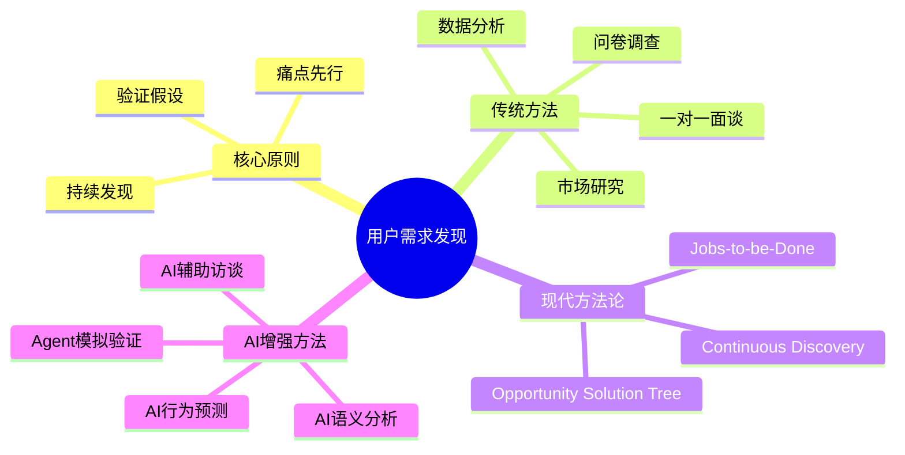
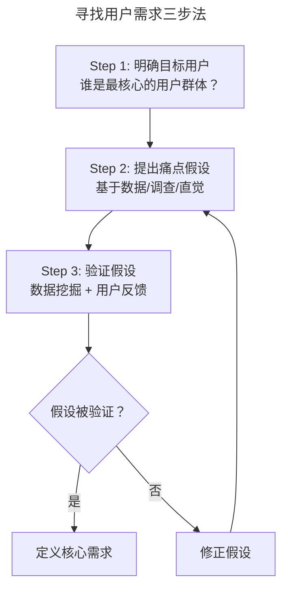
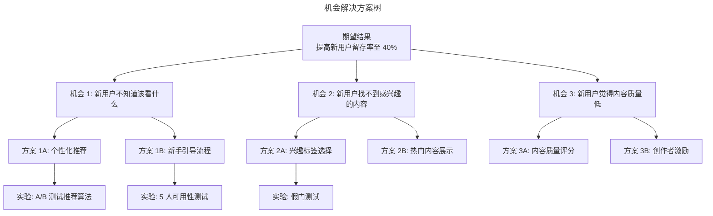
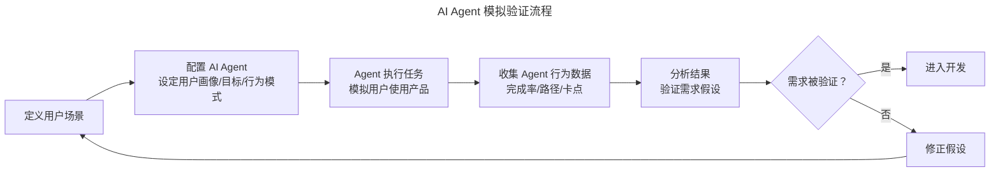
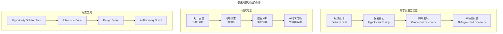

# 07 | 如何寻找用户需求？

> **适用范围**：产品经理、创业者、需要发现用户需求的团队负责人。适用于用户需求挖掘、痛点验证、用户调查、JTBD 框架、AI 增强需求发现等场景。
>
> **更新摘要（v2 · 2026-08 更新）**：
> - 结构化升级为 6 节骨架（导言 / 核心方法论 / 关键流程 / 工具与实战 / 常见误区 / 进阶延展）
> - 保留三步法、一对一面谈/问卷调查、Opportunity Solution Tree、JTBD 框架
> - 保留全部 Mermaid 图并补充 `--- title: ... ---` frontmatter，每张图后追加文字解读

---

## 1. 导言

产品经理每天最常说的词是什么？那必须是用户需求啊。

一个产品存在的意义就是，能够帮助用户解决一个之前无法解决的问题，或者提供一个比之前的解决方法要强 10、100 倍的解决方案。所以如果这个产品无法解决用户需求，那么这个产品根本没有存在的意义，这也就是为什么用户需求是产品开发最重要的部分。

### 1.1 核心导图

> **图解**：用户需求发现——核心原则（痛点先行、验证假设、持续发现）、传统方法（一对一面谈、问卷调查、数据分析、市场研究）、现代方法论（Opportunity Solution Tree、Continuous Discovery、JTBD）、AI 增强方法（AI 语义分析、AI 辅助访谈、AI 行为预测、Agent 模拟验证）。

### 1.2 什么是用户需求

用户需求，是大家每天最常说的词，也是误区最多的词。一个最大的问题就是，产品经理写了几十页的用户需求文档，挂了各种各样精彩绝妙的韦恩图、曲线图、UI 图，结果却发现这个产品解决的痛点实际上根本就不存在。

用户需求一定要立足于用户，一定要验证这个痛点到底是不是真的存在。

**经典反面案例：平衡车（Segway）**——这种靠电力驱动、具有自我平衡能力的交通工具，刚出现的时候惊为天人，各种投资人、发明家都为这样的绝妙设计而感到震撼，但是这个被寄予厚望的发明却并没有顺利落地。平衡车需要经常充电，而且售价非常昂贵。长途、上下班开车最方便，而几公里的路程还是用更便宜更方便的自行车比较好。平衡车解决的问题，并不是一个广大用户真正存在的痛点，这也就是为什么发明了十几年之后，仍然只能在高档宾馆，或者花园景点里见到踪影。

**2025 年的反面案例：强行 AI 化**——现在如火如荼的各种 AI 项目，也是这样的例子。很多项目强行用 AI 来套用某个领域或者某个应用场景，而没有去验证用户是不是真正有这样的痛点；或者用户的痛点是不是足够大到让他们丢弃已有的习惯，使用一个新的产品、适应一个新的方式；或者这个产品加上 AI 之后，是不是真正解决了一个以前解决不了的痛点。

> 🟢 **进阶视角**：**好的产品经理一定会先从痛点出发，确认用户是否真正存在这样的问题。** 不要一上来就得出产品应该长什么样子、有什么功能的结论。
> 🔵 **资深视角**：用户需求发现的本质是**假设验证**，而不是"收集需求"。你提出的每一个需求都是假设，需要通过数据和用户反馈来验证或推翻。产品经理的核心能力不是"想到好点子"，而是"快速验证假设"。
> 🟣 **专家视角**：在 AI 时代，最大的陷阱是**"技术驱动需求"**——先有 AI 能力，再去找应用场景。正确的方式是**"需求驱动技术"**——先有真实痛点，再评估 AI 是否是最佳解决方案。正如 Teresa Torres 所说："不要让客户告诉你他们需要什么，但要让他们告诉你他们遇到了什么问题。"

---

## 2. 核心方法论

### 2.1 寻找用户需求的三步法

**第一步：明确目标用户**——一个给老年人设计的听音乐的产品和一个给 00 后设计的听音乐的产品肯定会完全不一样，因为老年人的痛点和 00 后的需求差得非常远。Facebook 刚刚创立的时候，首先定位在扎克伯格所在的哈佛大学，后来拓展到所有大学生，然后拓展到所有人。所以，在产品刚开始的时候，专注于特定某一类的用户群体才能让产品的设计更有针对性。

**第二步：通过数据分析和用户调查，做出关于用户痛点的假设**——当你要解决的问题已经有了一些解决方案，或者用户的基数足够大可以找到量化的数据时，可以先从数据出发。另一个方式是通过用户调查了解问题，做出假设。比如当你发现，快时尚公司的销售额最近在连年下滑，你的假设可能有以下几个：快时尚公司的设计没有跟上形势；用户的消费标准越来越高，越来越看不上低质量的产品；用户花在时尚上的钱越来越少。

**第三步：进一步挖掘数据和用户反馈，验证用户痛点的存在**——比如已经有了上面的 3 个假设，那怎么知道哪个才是真正的问题呢？这个时候，就需要你进一步了解数据了：快时尚公司的设计真的没有跟上形势吗？用户在时尚的总投入增长了还是下降了？另一方面，你也可以通过用户调查来验证假设，可以采访客户问问他们上一次购物是在什么地方、花了多少钱、对快时尚品牌的印象有没有变化等等。这一步的目的，是为了以最快的速度明确用户的痛点到底是什么，是什么原因导致的。

> **图解**：寻找用户需求三步法——明确目标用户→提出痛点假设→验证假设（数据挖掘 + 用户反馈），假设被验证则定义核心需求，否则修正假设循环。

### 2.2 Jobs-to-be-Done 框架

除了传统的"痛点驱动"方法，**Jobs-to-be-Done（JTBD）** 框架提供了另一种理解用户需求的视角：

> 用户不是在"买产品"，而是在"雇佣"产品来完成一个"任务"。

| 传统视角 | JTBD 视角 |
|---------|----------|
| 用户需要一个更快的马 | 用户需要更快地从 A 到 B |
| 用户需要更薄的手机 | 用户需要在口袋里装一个随时可用的信息终端 |
| 用户需要 AI 写作工具 | 用户需要更高效地将想法转化为文字 |

**JTBD 的核心价值**：帮你跳出"功能思维"，回到"任务思维"。当你理解了用户要完成的"任务"，你才能发现真正的创新机会——因为完成任务的方式可以完全不同。

---

## 3. 关键流程

### 3.1 用户调查的两种核心方法

**一对一面谈（深度访谈）**——**当你有一个大概的假设，知道用户痛点大致在什么领域，但是并不清楚具体有哪些选择，需要非常系统地深入了解具体的痛点，这个时候和用户一对一的面谈效果最好。** 比如，我已经知道微信公众号的模板不够灵活，是一个非常大的痛点。通过用户面谈，我可以了解清楚到底是哪一部分需要更加灵活。通过对用户提出问题，根据他们对问题的回答进一步提问，你可以更加清晰地知道痛点在哪里。

一对一面谈需要注意两个问题：① **用户样本选择要具有代表性**（比如你明明想知道女性群体使用抖音的痛点，但是面谈只采访 20 岁以下的群体，那这样的样本并不具备代表性）；② **要意识到一对一面谈的局限性**（一般采访的人数不会特别多，不要认为某一个用户说的某一句话就一定是真理，需要多找几个例子，看看这个点是不是广泛存在）。

**问卷调查**——**这种情况适用于你已经有一个比较成熟的假设，有几个选项，想知道用户怎么想。** 比如，我已经知道了微信公众号不灵活，我估计有模板的问题、有视频长度的问题，但是不知道哪个更重要。这个时候，通过问卷调查和统计技巧，我可以广泛采样，了解清楚在目标群体中，哪个选项的痛点更大。你也可以在问卷中增加一个空白区域，让用户随便写，但需要引导用户在某个固定的领域进行发挥。

**两种方法对比**：

| 维度 | 一对一面谈 | 问卷调查 |
|------|----------|---------|
| 适用阶段 | 假设探索期 | 假设验证期 |
| 样本量 | 小（5-15 人） | 大（100+ 人） |
| 深度 | 深（追问机制） | 浅（固定选项） |
| 广度 | 窄 | 广 |
| 灵活性 | 高（可实时调整问题） | 低（问卷固定） |
| 偏见风险 | 访谈者引导偏见 | 问卷设计偏见 |
| 时间成本 | 高（每人 45-60 分钟） | 低（分发后自动回收） |

> 🟢 **进阶视角**：先用面谈探索，再用问卷验证。这是最经典的两步法。
> 🔵 **资深视角**：面谈的核心技巧是**追问（Follow-up Question）**——用户说"我觉得这个功能不好用"，你要追问"具体哪里不好用？上次遇到这个问题是什么时候？"只有追问到具体场景和行为，才能发现真正的痛点。
> 🟣 **专家视角**：Teresa Torres 的 Continuous Discovery 方法论要求产品团队**每周接触 2-3 个用户**，持续进行面谈，而不是集中在项目开始时做一轮大调研。

### 3.2 现代方法论：Opportunity Solution Tree

Teresa Torres 提出的 **Opportunity Solution Tree（机会解决方案树）** 是 2020 年代最重要的需求发现框架之一：

> **图解**：机会解决方案树——期望结果（提高新用户留存率至 40%）分解为多个机会（用户不知道该看什么、找不到感兴趣内容、觉得内容质量低），每个机会对应多个方案，每个方案对应实验验证。

**OST 的核心价值**：避免跳过问题直接给方案（先定义"机会"，再想"方案"）；可视化假设链（每一层都是假设，需要验证）；支持并行探索（同时测试多个方案）。

> 🟢 **进阶视角**：OST 帮你避免"一上来就写 PRD"的冲动。先画树，再选方案。
> 🔵 **资深视角**：OST 的关键是**"机会"层**——很多产品经理跳过这一层，直接从"结果"跳到"方案"。但真正的创新往往来自对"机会"的重新定义。
> 🟣 **专家视角**：在 AI 时代，OST 的"方案"层需要增加一个维度——**"AI 是否是最佳解决方案"**。不是所有机会都需要 AI，有些用传统规则引擎就够了。

---

## 4. 工具与实战

### 4.1 AI 增强的用户需求发现

2025 年，AI 正在从三个维度增强用户需求发现：

**AI 辅助定性研究**：

| 传统方式 | AI 增强方式 | 效率提升 |
|---------|-----------|---------|
| 手动整理访谈录音 | AI 实时转录 + 情感分析 | 10x |
| 人工提炼关键洞察 | LLM 语义聚类 + 主题提取 | 5x |
| 主观判断用户情绪 | AI 情感强度量化 | 客观化 |
| 5-15 人访谈样本 | AI 分析 10 万条用户评论 | 1000x |

**实战案例**：某 SaaS 团队用 DeepSeek-R1 分析 10 万条用户评论，AI 通过语义聚类和情感强度分析，3 小时提炼出"隐形需求"——82% 的差评指向"功能入口隐蔽"，而人工分析时仅归类为"体验不佳"。

**AI 辅助定量研究**：

| 传统方式 | AI 增强方式 | 效果提升 |
|---------|-----------|---------|
| 手动设计问卷 | AI 生成问卷初稿 | 起步效率 3x |
| 人工统计分析 | AI 自动洞察 + 异常检测 | 深度 2x |
| 静态用户分群 | AI 动态行为聚类 | 精度 3x |
| 事后分析 | AI 实时预测用户流失 | 时效性 10x |

### 4.2 AI Agent 模拟验证

2025 年最前沿的实践：用 AI Agent 模拟真实用户，在产品上线前验证需求：

> **图解**：AI Agent 模拟验证流程——定义用户场景→配置 AI Agent（设定用户画像/目标/行为模式）→Agent 执行任务模拟用户使用产品→收集行为数据→分析结果验证需求假设，需求被验证则进入开发，否则修正假设循环。

> 🟢 **进阶视角**：AI 工具让用户研究的**入门门槛降低**了——你不需要统计学博士也能做基本的用户分析。但**判断力**仍然是人类的核心价值。
> 🔵 **资深视角**：AI 增强研究的最大风险是**"AI 偏见放大"**——如果训练数据有偏见，AI 的分析结果也会有偏见。所以 AI 分析必须配合人工审核。
> 🟣 **专家视角**：AI Agent 模拟验证是 2025 年最令人兴奋的突破，但它**不能替代真实用户访谈**。Agent 可以验证"功能是否可用"，但无法告诉你"用户是否想要"。真实用户的面谈和观察仍然是不可替代的。

### 4.3 最新实践（2024-2026）

**实践一：Continuous Discovery 的普及**——Teresa Torres 的 Continuous Discovery 方法论在 2024-2025 年被越来越多的团队采用：核心实践是产品团队每周接触 2-3 个用户；工具支持有 UserTesting、Dovetail、Enjoy 等；采用持续发现的团队，产品市场匹配度提升 40%。

**实践二：AI 驱动的需求发现工作流**——前沿团队正在搭建 AI 驱动的需求发现工作流：Dify + RAG（自动抓取竞品数据 + 用户评论，生成 SWOT 分析）；DeepSeek-R1（语义聚类分析大规模用户反馈）；Manus Agent（模拟用户完成复杂任务，验证需求假设）；Amplitude AI（自动发现用户行为异常，提示潜在需求）。

**实践三：产品发现冲刺（Discovery Sprint）**——Google Ventures 的 Design Sprint 方法论在 2025 年演变为"AI-Enhanced Discovery Sprint"：Day 1 AI 分析现有数据生成假设地图；Day 2 团队绘制 Opportunity Solution Tree；Day 3 AI 快速生成原型方案；Day 4 AI Agent 模拟测试 + 真实用户验证；Day 5 团队决策。

### 4.4 方法论全景

> **图解**：需求发现方法论全景——需求发现方法论从痛点驱动→假设验证→持续发现→AI 增强发现演进；研究方法从一对一面谈→问卷调查→数据分析→AI 语义分析；框架工具从 OST→JTBD→Design Sprint→AI Discovery Sprint。

---

## 5. 常见误区

| 误区 | 表现 | 正确做法 |
|------|------|---------|
| **先有方案再找需求** | 先有 AI 能力再去找应用场景（技术驱动需求） | 需求驱动技术，先有真实痛点再评估 AI |
| **不验证痛点** | 写几十页需求文档却没验证痛点是否真实存在 | 用户需求立足于用户，验证痛点是否真实存在 |
| **一上来写 PRD** | 跳过"机会"直接到"方案" | 用 OST 先画树，先定义机会再选方案 |
| **样本不具备代表性** | 想知道女性痛点却只采访 20 岁以下 | 用户样本选择要具有代表性 |
| **迷信 AI 模拟** | 用 AI Agent 模拟验证做最终决策 | AI 模拟仅作辅助，真实用户验证不可替代 |
| **忽视 AI 偏见放大** | 直接采信 AI 分析结果 | AI 分析必须配合人工审核 |

---

## 6. 进阶延展

### 6.1 关键术语

| 术语 | 英文 | 释义 |
|------|------|------|
| 用户需求 | User Need | 用户需要解决的真实痛点或完成的任务 |
| 痛点 | Pain Point | 用户在使用现有方案时遇到的困难或不满 |
| 假设验证 | Hypothesis Testing | 通过数据和用户反馈验证或推翻需求假设 |
| 机会解决方案树 | Opportunity Solution Tree (OST) | Teresa Torres 提出的可视化需求发现框架 |
| 持续发现 | Continuous Discovery | 每周持续接触用户、持续验证假设的研究模式 |
| 任务驱动 | Jobs-to-be-Done (JTBD) | 从用户要完成的"任务"角度理解需求 |
| 深度访谈 | In-Depth Interview | 一对一的用户面谈，通过追问挖掘深层需求 |
| 语义聚类 | Semantic Clustering | AI 将大量文本按语义相似度分组的技术 |
| 假门测试 | Fake Door Test | 在功能开发前用假入口测试用户需求的方法 |
| 需求漂移 | Requirement Drift | 开发过程中需求偏离原始用户痛点 |

### 6.2 思考题

1. 🟢 **进阶题**：如果让你设计一个帮助上班族看新闻的产品，你会通过哪些方式来了解用户需求？你有哪些关于痛点的假设？
2. 🔵 **资深题**：用 Opportunity Solution Tree 画出你当前产品的需求发现树。你发现哪些"机会"被跳过了，直接跳到了"方案"？
3. 🟣 **专家题**：AI Agent 可以模拟用户验证需求，但它无法替代真实用户的面谈。在什么场景下 AI 模拟足够可靠？在什么场景下必须用真实用户？你如何设计一个"AI 模拟 + 真实验证"的混合研究方案？

### 6.3 延伸阅读

1. Teresa Torres, *Continuous Discovery Habits* (2021)
2. Clayton Christensen, *Competing Against Luck* (2016)
3. Jake Knapp, *Sprint* (2016)
4. Marty Cagan, *Inspired* (2nd Edition, 2017)
5. a16z, "AI-Native Product Development" (2024)
