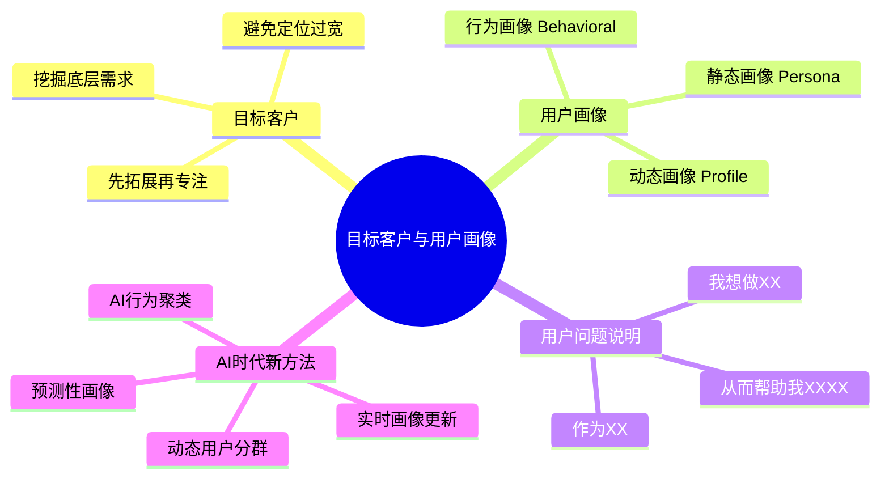
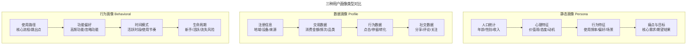
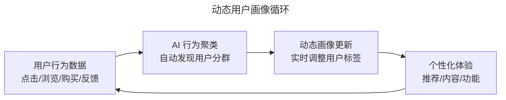
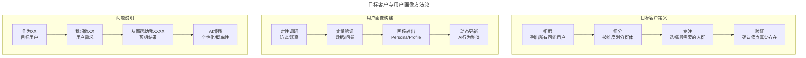

# 08 | 目标客户和用户画像

> **适用范围**：产品经理、创业者、需要定义目标客户与用户画像的团队负责人。适用于目标客户定位、用户画像构建、用户问题说明、AI 时代动态画像等场景。
>
> **更新摘要（v2 · 2026-08 更新）**：
> - 结构化升级为 6 节骨架（导言 / 核心方法论 / 关键流程 / 工具与实战 / 常见误区 / 进阶延展）
> - 保留先拓展再专注、三种用户画像、用户问题说明
> - 保留全部 Mermaid 图并补充 `--- title: ... ---` frontmatter，每张图后追加文字解读

---

## 1. 导言

前文我分享了如何寻找用户需求，那么今天这篇文章我就来讲讲如何定义目标客户和用户画像。

### 1.1 核心导图

> **图解**：目标客户与用户画像——目标客户（先拓展再专注、避免定位过宽、挖掘底层需求）、用户画像（静态 Persona、动态 Profile、行为画像）、用户问题说明（作为 XX、我想做 XX、帮助我 XXXX）、AI 时代新方法（动态用户分群、AI 行为聚类、实时画像更新、预测性画像）。

### 1.2 确定目标客户

目标客户就是你的产品要针对的客户群体。一般在你刚刚开始探索产品路线的时候，目标客户可能不会太明确。**确定目标客户，就是要弄清楚到底怎么划分用户群体，然后截取哪部分用户作为目标客户。**

简单地说，弄清楚目标客户，就是一个**先拓展（思考所有可能的目标客户）再专注（找到更有针对性的目标客户）**的过程。

先拓展，就是要列出会对产品有需求的所有人，并尽可能地细分。再专注，就是要专注于最需要这个产品的人群，即使这个人群规模很小，但是：**能 100% 解决这一小部分人的需求，远胜于只能解决一大群人 50% 的需求。**

这里一定要注意，专注于小群体，并不会让你的产品丧失发展潜力。相反地，当你非常好地解决了这一小部分人的需求后，他们会成为产品的粉丝，自然而然地自发地宣传这个产品。

事实上，一些非常知名并且取得了很大成功的公司，正是这样做的。比如，Facebook 一开始专注于大学生群体，后来才拓展到所有人。再比如，Airbnb 一开始专注于沙发客，后来拓展到了时代旅馆、度假社区等内容。所以，**初版产品一定不是一开始就定位在"所有人"上，先专注于某一类人，这样才会更有成效。**

---

## 2. 核心方法论

### 2.1 两个常见误区

**误区一：对目标客户群体的定位不够有针对性。** 比如，我在《硅谷产品经理每天在做什么？》这篇文章里讲到的视频版权管理系统。从整体数据来看，用户活跃度很高，但是仔细研究就会发现是媒体公司的活跃度提升了整个数据。因为大部分视频侵犯的是媒体公司的版权，所以整体数据很漂亮，让我们误以为这个产品很给力。但实际上，我们这个产品之前的功能只是适用于媒体公司而已，而并不适用于小艺术家。但我们之前定位的目标客户是所有发视频的人，因此设计了一堆对媒体公司来说太低级、小艺术家又没时间用的功能，所以产品发布之后效果并不好。

**误区二：没有研究清楚目标群体最底层的需求是什么。** 我通过一个成功的例子来说一下认识到底层需求的重要性。美国的健身品牌 SoulCycle 成立于 2006 年，一开始只是在曼哈顿上西区有一家规模很小的工作室，但很快就拥有了一群女粉丝。你可能会简单地认为 SoulCycle 的目标群体就是喜爱单车、要锻炼身体的人士。实际上，虽然 SoulCycle 提供的是单车课，却有着夜店般的音乐、激励人心的教练，和一个团结互助的同好群体。因此这个单车课成了很多人解压、展示自己积极心态、打鸡血的地方。这才是这个健身课真正要满足的用户需求，所以 SoulCycle 的目标群体不仅仅是爱锻炼的人，也包含了希望表达自我、战胜自己，和激励自己的人。

> 🔵 **资深视角**：目标客户定义的核心不是"谁可能用"，而是"谁最需要"。**最需要的用户 = 痛点最深 + 现有方案最差 + 付费意愿最强**。这三个维度缺一不可。
> 🟣 **专家视角**：在 AI 时代，目标客户的定义需要增加一个维度——**"AI 能否显著改善体验"**。AI 产品的目标客户应该是"痛点深 + AI 能 10x 改善"的交集。

### 2.2 描绘用户画像

**用户画像对应的英文是 User Persona，或者 User Profile，意思就是：生动描绘用户的特点，把这类用户抽象成一个人，然后用介绍这个人的方式来描绘这一类人。**

比如，你想先专注于运动兴趣，初版产品的目的是帮助有运动爱好的朋友们找到同好，更好地社交。那么，你需要找到这类用户，对他们的特点进行调研，然后进行用户画像。

**用户画像的两方面优点**：① 帮助你更生动地描绘用户特点，有利于你和团队成员进行交流；② 帮助你更深入地了解用户，考虑这个用户的生活方式、爱好、性格特点等，让你可以从更高的视角观察用户、了解用户。

**三种用户画像类型**：

| 类型 | 英文 | 特点 | 适用场景 |
|------|------|------|---------|
| 静态画像 | Persona | 基于调研的虚构人物，包含人口统计、行为、目标 | 产品设计阶段 |
| 数据画像 | Profile | 基于真实用户数据的统计特征 | 精准营销、推荐系统 |
| 行为画像 | Behavioral | 基于用户行为序列的动态特征 | 产品迭代、个性化体验 |

> **图解**：三种用户画像类型对比——静态画像（人口统计→心理特征→行为特征→痛点与目标）、数据画像（注册信息→交易数据→行为数据→社交数据）、行为画像（使用路径→功能偏好→时间模式→生命周期）。

> 🔵 **资深视角**：最常见的错误是画像太"完美"——每个用户都是理想用户。好的画像应该包含**负面画像（Anti-Persona）**——明确"我们不为谁设计"，这比"为谁设计"同样重要。
> 🟣 **专家视角**：2025 年，静态画像正在被**动态画像**取代。AI 可以实时分析用户行为，自动更新用户分群。产品经理需要从"画一个固定的画像"转向"设计一个画像更新的规则引擎"。

---

## 3. 关键流程

### 3.1 用户问题说明

用户问题说明就是一句话，这句话能精炼、简单地描述你到底要为什么用户解决什么问题。

> 用户问题说明的常见形式为：**作为 XX（什么样的用户），我想做 XX（什么事情），从而帮助我 XXXX（达到什么目的）。**

- **"作为 XX"**：说的是目标用户。
- **"我想做 XX"**：说的是用户需求。这里需要注意的非常重要的一点是，**要以用户为第一人称表达**，而不是以产品能够解决的问题为主语表达。不是说"微信能够帮助你和好久不见的朋友沟通"，而应该是"我想和好久不见的朋友沟通"。前者并不代表用户有这样的需求，而后者却是源自于用户本身的需求。
- **"帮助我 XXXX"**：说的是对产品功能的预期。之所以"帮助我 XXXX"在"我想做 XX"之后，是想说明产品功能一定要解决用户真实存在的问题。

比如，作为一个热爱运动的人，我想了解运动爱好知识、向运动达人学习，从而帮助我提升在这个项目上的水平。又或者，作为一个热爱运动的人，我想了解运动爱好知识、了解其他运动达人，从而帮助我结交更多有相同爱好的朋友。这两个例子要解决的问题完全不一样，因此对产品功能的预期也不一样。

> **在 Facebook，我们经常要求新加入的产品经理能够用"用户问题说明"这句话，简明扼要地表达清楚产品功能，如果总结不出来，那就说明这个产品经理对用户需求和目标用户定位不够清晰。**

### 3.2 用户问题说明的 AI 时代升级

传统用户问题说明是静态的，AI 时代需要升级为**动态问题说明**：

| 维度 | 传统用户问题说明 | AI 时代动态问题说明 |
|------|---------------|-------------------|
| 用户 | 固定人群 | 动态分群（基于行为实时更新） |
| 需求 | 单一需求 | 个性化需求（千人千面） |
| 预期 | 确定性结果 | 概率性结果（AI 输出不确定） |
| 表述 | "我想做 XX" | "我想做 XX，AI 帮我优化/推荐/生成" |

AI 产品的用户问题说明示例：
> 作为一名内容创作者，我想让 AI 帮我根据受众偏好自动调整文章风格，从而帮助我提高内容的阅读率和互动率。

注意这里的关键变化：**用户不再只是"想做某事"，而是"想让 AI 帮我优化某事"**。这意味着产品经理需要额外定义：AI 的优化目标是什么；用户如何给 AI 反馈；AI 出错时用户如何纠正。

---

## 4. 工具与实战

### 4.1 AI 时代的动态用户画像

**从静态到动态**——传统用户画像是产品经理手动创建的，一旦确定就很少更新。AI 时代的用户画像是**动态的、数据驱动的、实时更新的**：

> **图解**：动态用户画像循环——用户行为数据→AI 行为聚类自动发现用户分群→动态画像更新实时调整标签→个性化体验，再回到用户行为数据，形成闭环。

**AI 驱动的用户分群方法**：

| 方法 | 原理 | 适用场景 |
|------|------|---------|
| RFM 模型 | 基于最近购买时间/频率/金额 | 电商、订阅产品 |
| K-Means 聚类 | 基于行为特征的自动分群 | 通用 |
| 协同过滤 | 基于相似用户的行为推荐 | 内容、电商 |
| 深度学习嵌入 | 基于用户行为的向量表示 | 复杂行为模式 |
| LLM 语义分析 | 基于用户反馈文本的分群 | 需求发现 |

**预测性画像**——2025 年最前沿的实践，不仅描述用户"现在是什么样"，还预测用户"未来会怎样"：

| 预测类型 | 方法 | 业务价值 |
|---------|------|---------|
| 流失预测 | 基于行为模式的分类模型 | 提前干预，降低流失率 |
| 生命周期价值预测 | 基于历史数据的回归模型 | 优化获客成本 |
| 需求预测 | 基于行为序列的推荐模型 | 个性化推荐 |
| 升级预测 | 基于使用深度的分层模型 | 精准营销 |

> 🔵 **资深视角**：AI 分群的最大风险是**"黑箱分群"**——你得到了一群用户，但不知道为什么他们被分在一起。产品经理必须理解分群的逻辑，否则无法设计针对性的产品功能。
> 🟣 **专家视角**：预测性画像带来了**伦理问题**——预测用户会流失然后干预，是否侵犯了用户自主权？产品经理需要在"商业价值"和"用户尊重"之间找到平衡。

### 4.2 最新实践（2024-2026）

**实践一：AI 原生产品的用户画像**——AI 原生产品（如 ChatGPT、Midjourney）的用户画像与传统产品有本质区别：使用场景极度多样化（有人写代码、有人翻译、有人聊天）；用户能力差异巨大（从 Prompt 新手到 Context Engineering 专家）；使用频率两极分化（重度用户每天 50+ 次，轻度用户每月 1-2 次）。因此 AI 产品的用户画像需要增加：AI 素养等级（新手/进阶/专家）、使用模式（工具型/助手型/创作型）、信任度（完全信任/谨慎验证/怀疑态度）。

**实践二：Product-Led Growth（PLG）中的用户画像**——PLG 模式下，用户画像与增长漏斗深度绑定：激活画像（最易完成 Aha Moment）、转化画像（最易从免费转付费）、扩展画像（最易推荐新用户）、留存画像（最不易流失）。

**实践三：隐私优先的用户画像**——2024-2025 年，随着 GDPR、CCPA 等隐私法规的严格执行，用户画像方法正在调整：从"收集所有数据"转向"最小必要数据"；从"永久存储"转向"定期过期"；从"第三方 Cookie"转向"第一方数据 + 上下文推断"；AI 联邦学习（在不收集原始数据的情况下训练模型）。

### 4.3 方法论全景

> **图解**：目标客户与用户画像方法论——目标客户定义（拓展→细分→专注→验证）、用户画像构建（定性调研→定量验证→画像输出→动态更新）、问题说明（作为 XX→我想做 XX→帮助我 XXXX→AI 增强）。

---

## 5. 常见误区

| 误区 | 表现 | 正确做法 |
|------|------|---------|
| **定位过宽** | 一开始就定位在"所有人"上 | 先专注某一类人，再拓展 |
| **不了解底层需求** | 只看表面（如"爱锻炼"），忽略真实需求（如"解压、自我表达"） | 挖掘最底层的用户需求 |
| **画像太"完美"** | 每个用户都是理想用户 | 包含负面画像（Anti-Persona），明确"不为谁设计" |
| **静态画像不更新** | 画像一旦确定就很少更新 | 转向动态画像，AI 实时更新 |
| **黑箱分群** | 得到分群但不知道分群逻辑 | 理解分群逻辑，否则无法设计针对性功能 |

---

## 6. 进阶延展

### 6.1 关键术语

| 术语 | 英文 | 释义 |
|------|------|------|
| 目标客户 | Target Customer | 产品要针对的核心客户群体 |
| 用户画像 | User Persona / Profile | 生动描绘用户特点的抽象人物 |
| 负面画像 | Anti-Persona | 明确"不为谁设计"的用户画像 |
| 用户问题说明 | User Problem Statement | 描述"为谁解决什么问题"的一句话 |
| 动态分群 | Dynamic Segmentation | 基于用户行为实时更新的分群方法 |
| RFM 模型 | Recency-Frequency-Monetary | 基于最近购买/频率/金额的用户分群模型 |
| 预测性画像 | Predictive Persona | 预测用户未来行为的画像方法 |
| Aha Moment | 顿悟时刻 | 用户首次感受到产品核心价值的时刻 |
| PLG | Product-Led Growth | 产品驱动增长模式 |
| 联邦学习 | Federated Learning | 在不收集原始数据的情况下训练 AI 模型 |

### 6.2 思考题

1. 🟢 **进阶题**：如果你是极客时间 APP 的产品经理，你的目标客户和用户画像是什么？用"作为 XX，我想做 XX，从而帮助我 XXXX"的格式写出来。
2. 🔵 **资深题**：为你的产品创建一个 Anti-Persona（负面画像）。明确"我们不为谁设计"，并解释为什么排除这个群体是正确的决策。
3. 🟣 **专家题**：AI 产品的用户画像需要包含"AI 素养等级"和"信任度"维度。设计一个 AI 产品的用户画像体系，包含至少 3 个 Persona，每个 Persona 的 AI 素养和信任度不同。你如何为不同 Persona 设计差异化的产品体验？

### 6.3 延伸阅读

1. Al Ries & Jack Trout, *Positioning: The Battle for Your Mind* (1981)
2. Alan Cooper, *The Inmates Are Running the Asylum* (1999)
3. Teresa Torres, *Continuous Discovery Habits* (2021)
4. Wes Bush, *Product-Led Growth* (2019)
5. GDPR.eu, "Data Protection & User Profiling" (2024)
