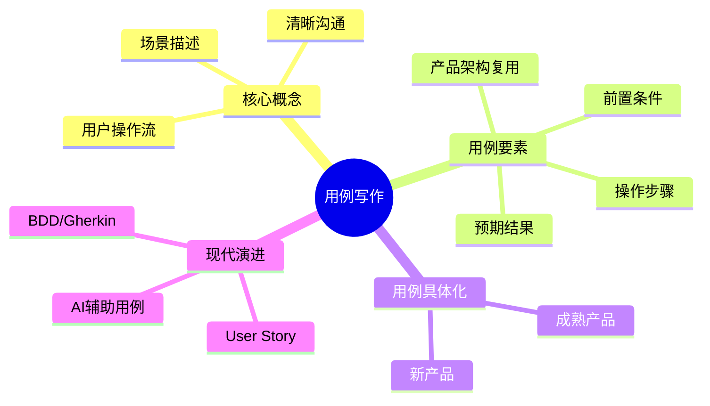
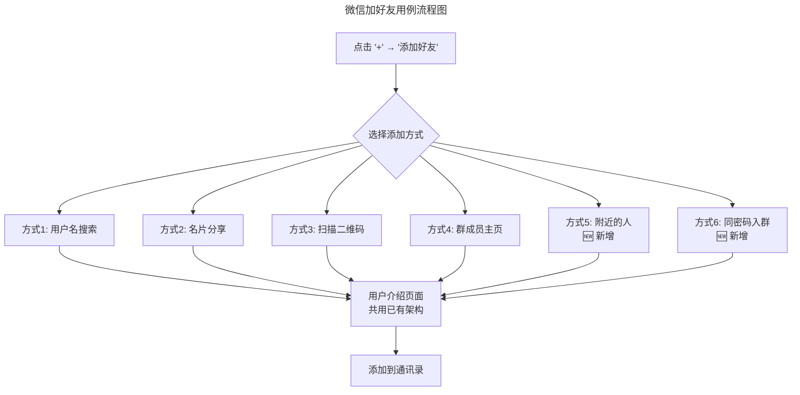
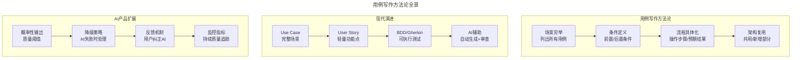

# 09 | 手把手教你写用例：优化微信加好友的功能

> **适用范围**：产品经理（需要掌握用例写作）、需求分析者、需要撰写需求文档的团队。适用于用例写作、User Story、BDD/Gherkin、AI 辅助用例等场景。
>
> **更新摘要（v2 · 2026-08 更新）**：
> - 结构化升级为 6 节骨架（导言 / 核心方法论 / 关键流程 / 工具与实战 / 常见误区 / 进阶延展）
> - 保留微信加好友用例案例、用例具体化、User Story、BDD/Gherkin
> - 保留全部 Mermaid 图并补充 `--- title: ... ---` frontmatter，每张图后追加文字解读

---

## 1. 导言

如果你在科技公司工作，那么你一定对"use case"这个词语不陌生。

"use case"中文是"用例"，维基百科的解释是"软件工程或系统工程中对系统如何反应外界请求的描述，是一种通过用户的使用场景来获取需求的技术"。简单来说，**用例就是描述在什么场景下用户用产品来做什么事儿**。

各种各样的产品经理文章对于用例的解释说法不一，推荐使用的用例格式也有很多种，其实用例的具体格式需要根据具体的产品场景和公司文化来确定。但是，需要注意用例的目的是**清晰沟通这个产品到底需要解决哪几个问题，具体是怎么解决的，以及用户为了解决这个问题需要做哪些操作**。

用例可以用文字来表示，也可以用图表或者流程图来表示，能让设计师和工程师以及产品团队的其他人员清楚、准确地理解，才是最重要的，而不是要一定遵循某个固定的格式。

### 1.1 核心导图



> **图解**：用例写作——核心概念（场景描述、用户操作流、清晰沟通）、用例要素（前置条件、操作步骤、预期结果、产品架构复用）、用例具体化（成熟产品/新产品）、现代演进（User Story、BDD/Gherkin、AI 辅助用例）。

---

## 2. 核心方法论

### 2.1 列出加好友的用例

我举个具体的例子，来跟你解释一下到底什么是用例。假如你是微信的产品经理，你现在需要优化加好友的功能，用例可能会这么写：

首先，添加好友是双向的，彼此都成为了对方的好友。其次，添加好友有不同的途径：

> 第一，**通过用户名添加**；第二，**通过其他朋友分享的名片添加**；第三，**通过扫描二维码添加**；第四，**在群成员中找到该用户，点击进入这个用户的主页，从而添加好友。**

以上四个用例适用于一个用户想添加另一个用户。除此之外，还会出现一个用户想同时添加一群人的情况，比如你在同学聚会的时候想添加所有同学等，这时添加好友的途径有：

> 第五，**找到距离很近的其他用户，同时添加所有在这个距离之内的朋友**；第六，**同时输入相同的密码自动加入同一个群，从而在群中一个个地添加好友。**

**现在已经清楚罗列了所有添加好友的途径，但是这还远远不够，接下来你需要写清楚用例的条件、操作步骤和产品框架。**

### 2.2 什么情况下能开启这个功能呢？

只要用户登录了微信，在任何情况下都可以开启前四个方式。虽然这四种方式都可以帮助用户添加不在身边的人为好友，但是第 1 种和第 3 种更适用于面对面添加好友的情况。虽然用户在任何情况下都可以开启第 5 种和第 6 种方式，但是如果没有一群人在身边，这个功能就有些小题大做了，所以这两种方式适用的场景还是一群人在一起面对面地添加好友。

### 2.3 执行完这个操作以后，用户得到了什么呢？

用户添加对方作为好友是一个双向的过程，从此以后，你就可以查看对方的朋友圈、给对方发消息、把对方加到某一个群里。

### 2.4 如何清晰地表述这个用例怎么利用已经存在的产品架构

简言之就是，哪些部分是用户已经熟悉的、哪些部分是新的，这个问题一般适用于在已有产品上添加新功能的情况。

假设前四个用例在上一版产品中已经发布了，现在需要增加第 5 个和第 6 个用例。你首先应该弄清楚新加这两个功能，到底有哪些部分可以共用以前的四个功能，哪些部分是需要新增加功能的。比如说，进入添加好友的功能，即"入口点"（Entry Point），新增加的第 5 个和第 6 个用例和前 4 个用例添加好友功能的开启方式都是一样的：点击"+"，然后点击"添加好友"，最后选择具体的添加方式。只不过，现在需要在这个菜单里面新增加两个选项而已。

而在这之后的功能就是新的了。前四种用例更多的是搜索和匹配，但是现在需要能让用户进行快速添加。这个新功能的实现其实是利用了地理位置，并假设相同地理位置的用户多半是在一起聚会的。如果此时此刻这些人同时点击了"添加好友"，并且都在一个非常相近的地理位置，就可以把他们的用户名都显示出来，以方便大家添加。找到要添加的用户名，就可以点击进入他的介绍页面，其实这些功能和前四种方式是一模一样的。

在你弄清楚了哪些功能是可以共用的、哪些是需要新增加的后，就要呈现给团队的其他成员了。虽然流程图可以比较清楚地表达这些内容，但是我个人的建议是，不要过于追求复杂的图表，把大量时间花在做图上，而应该思考你表述用例的方式是不是最准确、最清晰的。



> **图解**：微信加好友用例流程图——点击"+"→"添加好友"后选择添加方式（四种已有 + 两种新增），共用已有架构的用户介绍页面，最终添加到通讯录。**注意**：此 Mermaid 图中含 emoji 标记 🆕（原文档已有，予以保留）。

> 🟢 **进阶视角**：写用例的第一步是**穷举所有场景**，不要遗漏。第二步才是**区分共用部分和新增部分**，避免重复设计。
> 🔵 **资深视角**：用例写作的核心原则是**"用户视角 + 工程师可执行"**。太抽象则工程师无法实现，太具体则失去灵活性。好的用例应该描述"做什么"和"预期结果"，而不是"怎么做"。
> 🟣 **专家视角**：在 Empowered Product Team 模型下，用例正在从"详细操作步骤"演变为"问题定义 + 成功标准"。产品经理定义 What 和 Why，工程师自主决定 How。

---

## 3. 关键流程

### 3.1 用例具体化

现在你已经列出了能够添加好友的所有途径，但是要把它转化为工程师和设计师能够进行操作的文档，还需要描述得更清楚，这时就需要把用例"具体化"。

**成熟产品的用例具体化**——比如说，第一个用例的具体流程是这样的：

> 用户点击"+" → "添加好友" → 会有个文本框让用户输入用户名 → 开启搜索 → 必须在用户名完全吻合的情况下，才能显示目标用户名 → 点击进入想要添加的用户的页面 → 点击"添加到通讯录"。

这种方式把一步一步的工作流描述得非常清楚，这其实和产品需求文档上的内容非常相似了。这种表达方式适用于产品已经有了很多成熟框架的情况。

**新产品的用例具体化**——对于一些还不存在已有框架的新产品来说，流程图看上去可能是这样的：

> 用户进入添加好友的页面 → 页面有一个可以搜索用户名的地方 → 显示搜索结果，但是为了避免加错人，需要有一些预防加错人的机制 → 添加目标用户。

这样可以把产品功能实现所需要的组成部分先说清楚，然后再详细思考一个个组成部分应该怎么设计。你只有把这些问题思考清楚了，才能把产品需求写清楚，工程师和设计团队才可以真正开始实施。

**两种具体化方式对比**：

| 维度 | 成熟产品 | 新产品 |
|------|---------|-------|
| 详细程度 | 高（每一步操作） | 中（组成部分 + 关键问题） |
| 关注点 | 操作流程 | 功能组成 + 设计问题 |
| 复用性 | 大量复用已有框架 | 从零构建 |
| 风险 | 低（框架成熟） | 高（不确定性大） |
| 适合方法 | 详细步骤描述 | 组成部分 + 问题清单 |

### 3.2 现代演进：从用例到 User Story

敏捷开发时代，用例演化出了更轻量的 **User Story** 格式：**As a** [type of user], **I want** [some action] **so that** [some goal]。

微信加好友的 User Story 示例：

| ID | User Story | 优先级 |
|----|-----------|-------|
| US-01 | As a 微信用户, I want 通过用户名搜索添加好友, so that 我可以找到并添加认识的人 | P0 |
| US-02 | As a 微信用户, I want 通过扫描二维码添加好友, so that 我可以快速面对面添加 | P0 |
| US-03 | As a 微信用户, I want 通过附近的人同时添加多个好友, so that 聚会时可以快速互加 | P1 |
| US-04 | As a 微信用户, I want 添加好友时看到验证问题, so that 我可以确认对方身份 | P2 |

**用例 vs User Story**：

| 维度 | 用例 (Use Case) | User Story |
|------|-----------------|-----------|
| 粒度 | 粗（一个场景） | 细（一个功能点） |
| 格式 | 自由格式 | 固定模板 |
| 详细程度 | 包含操作步骤 | 只描述意图 |
| 适用阶段 | 需求分析 | Sprint Planning |
| 优势 | 场景完整 | 轻量灵活 |
| 劣势 | 可能过于冗长 | 可能缺少上下文 |

> 🟢 **进阶视角**：用例和 User Story 不是替代关系，而是**互补关系**。用例适合描述完整场景，User Story 适合拆分到 Sprint 中执行。
> 🔵 **资深视角**：好的 User Story 遵循 **INVEST 原则**——Independent（独立）、Negotiable（可协商）、Valuable（有价值）、Estimable（可估算）、Small（小）、Testable（可测试）。
> 🟣 **专家视角**：AI 产品的 User Story 需要额外考虑**概率性输出**——AI 的结果不是确定性的，所以 User Story 的"So that"部分需要定义**可接受的质量阈值**。

---

## 4. 工具与实战

### 4.1 BDD 与 Gherkin：用例的工程化表达

**Behavior-Driven Development（BDD）** 是用例的工程化演进，使用 **Gherkin** 语法将用例转化为可执行的测试：

```gherkin
Feature: 微信添加好友

  Scenario: 通过用户名添加好友
    Given 用户已登录微信
    And 用户在主界面
    When 用户点击 "+" 按钮
    And 用户点击 "添加好友"
    And 用户输入用户名 "张三"
    And 用户点击 "搜索"
    Then 系统显示用户名完全匹配的用户
    When 用户点击 "添加到通讯录"
    Then 系统发送好友请求
    And 对方收到好友请求通知
```

**BDD 的核心价值**：产品经理、工程师、QA 使用同一语言（减少沟通损耗）；用例即测试用例（需求文档和测试用例合二为一）；可自动化执行（CI/CD 流水线中自动验证）。

**AI 产品的 BDD 扩展**——AI 产品的输出具有不确定性，BDD 需要扩展为**概率性断言**：

```gherkin
Feature: AI 推荐好友

  Scenario: 基于共同好友推荐
    Given 用户已登录微信
    And 用户有 5 个以上共同好友的联系人
    When 系统生成好友推荐列表
    Then 推荐列表中至少包含 3 个有共同好友的用户
    And 推荐准确率不低于 70%
    And 推荐结果在 2 秒内返回
```

注意关键变化：从"系统显示 X"变为"准确率不低于 X%"；增加了性能约束（2 秒内返回）；定义了可接受的质量阈值。

### 4.2 AI 辅助用例写作

2025 年，AI 工具正在改变用例写作的方式：

**AI 生成用例初稿**：

| 输入 | AI 输出 | 人工工作 |
|------|--------|---------|
| 功能描述 | User Story 列表 | 审核 + 优先级排序 |
| User Story | Gherkin 测试用例 | 补充边界条件 |
| 竞品截图 | 操作流程描述 | 验证 + 调整 |
| 用户反馈 | 用例改进建议 | 判断 + 决策 |

**AI 检测用例完整性**——AI 可以自动检测用例中的遗漏：边界条件（是否考虑了空输入、超长输入、特殊字符）；异常流程（网络断开、权限不足、并发冲突）；状态转换（用户从"未登录"到"已登录"的状态变化）；AI 特有场景（模型输出为空、输出质量低于阈值、用户反馈纠正）。

> 🟢 **进阶建议**：用 AI 生成用例初稿，但**必须人工审核**。AI 容易遗漏业务特定的边界条件和异常流程。
> 🔵 **资深建议**：把 AI 当作"用例审查员"——你写完用例后，让 AI 检查是否有遗漏的场景和边界条件。
> 🟣 **专家建议**：AI 产品的用例写作需要**定义"质量阈值"而非"确定性结果"**。这是与传统产品用例最大的区别。

### 4.3 最新实践（2024-2026）

**实践一：One-Page PRD 取代长文档**——越来越多团队用一页纸 PRD 替代几十页的需求文档：核心内容是 User Story + 成功指标 + 设计稿链接；用例以 Gherkin 格式嵌入 PRD；AI 辅助生成初稿，人工精修。

**实践二：AI 产品的用例模板**——AI 产品的用例需要额外包含：输入约束（用户可以给 AI 什么输入）；输出质量阈值（准确率、延迟、成本的可接受范围）；降级策略（AI 输出质量低于阈值时如何处理）；反馈机制（用户如何纠正 AI 的错误）；监控指标（上线后如何持续监控 AI 输出质量）。

**实践三：Spec-Driven Development**——2025 年前沿团队采用 Spec-Driven Development：产品经理写 Spec（规格说明）而非 PRD；Spec 包含用例 + 成功标准 + 约束条件；AI 根据 Spec 自动生成代码框架；工程师在 AI 生成的基础上精修。

### 4.4 方法论全景



> **图解**：用例写作方法论全景——用例写作（场景穷举→条件定义→流程具体化→架构复用）、现代演进（Use Case→User Story→BDD/Gherkin→AI 辅助）、AI 产品扩展（概率性输出质量阈值→降级策略→反馈机制→监控指标）。

---

## 5. 常见误区

| 误区 | 表现 | 正确做法 |
|------|------|---------|
| **拘泥固定格式** | 认为用例必须用某个固定格式 | 用文字/图表/流程图均可，清晰沟通最重要 |
| **漏掉场景** | 只写主要用例，遗漏异常场景 | 第一步穷举所有场景，不要遗漏 |
| **用例过于冗长** | 追求复杂图表，忽略表述准确性 | 不要过于追求复杂图表，思考最准确的表述方式 |
| **忽视架构复用** | 不区分共用部分和新增部分 | 明确哪些功能可共用、哪些需新增加 |
| **AI 用例不人工审核** | 直接采信 AI 生成的用例 | 用 AI 生成初稿但必须人工审核 |

---

## 6. 进阶延展

### 6.1 关键术语

| 术语 | 英文 | 释义 |
|------|------|------|
| 用例 | Use Case | 描述在什么场景下用户用产品来做什么事 |
| 用户故事 | User Story | 敏捷开发中轻量级的需求描述格式 |
| 行为驱动开发 | BDD (Behavior-Driven Development) | 用自然语言描述系统行为的开发方法 |
| Gherkin | Gherkin | BDD 中使用的结构化语言（Given/When/Then） |
| 入口点 | Entry Point | 用户开启某个功能的入口 |
| INVEST 原则 | INVEST | User Story 的六个质量标准 |
| 质量阈值 | Quality Threshold | AI 产品可接受的最低输出质量 |
| 降级策略 | Fallback Strategy | AI 输出质量低于阈值时的备选方案 |
| Spec | Specification | 规格说明，比 PRD 更工程化的需求文档 |
| 前置条件 | Precondition | 用例执行前必须满足的条件 |

### 6.2 思考题

1. 🟢 **进阶题**：请你思考一下，微信阅读公众号文章的用例都有哪些呢？请你描述一下已有的用例，并且添加两个新的用例。
2. 🔵 **资深题**：选择你产品中的一个功能，用 Gherkin 格式写出至少 3 个场景的 BDD 用例。注意覆盖正常流程、异常流程和边界条件。
3. 🟣 **专家题**：AI 产品的用例需要定义"质量阈值"而非"确定性结果"。为一个 AI 推荐功能写用例，定义准确率阈值、延迟约束、降级策略和用户反馈机制。当 AI 推荐准确率低于阈值时，产品应该如何优雅地降级？

### 6.3 延伸阅读

1. Alistair Cockburn, *Writing Effective Use Cases* (2000)
2. Mike Cohn, *User Stories Applied* (2004)
3. Dan North, "Introducing BDD" (2006)
4. Gojko Adzic, *Specification by Example* (2011)
5. Marty Cagan, "Product Specs" (2025)
