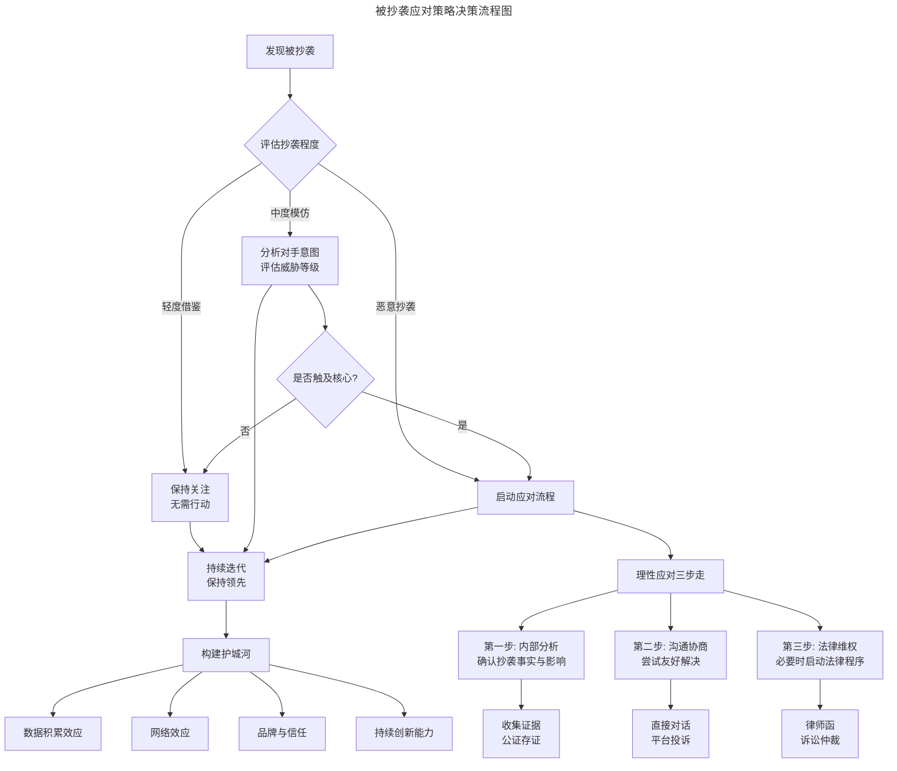
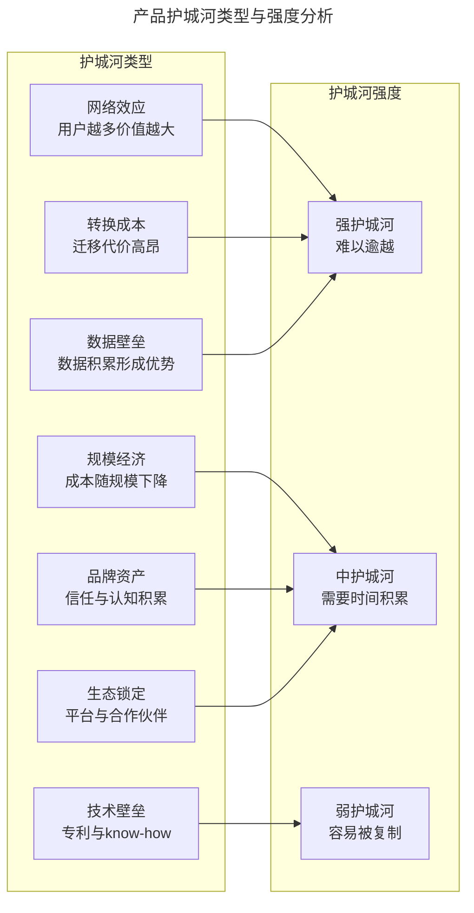
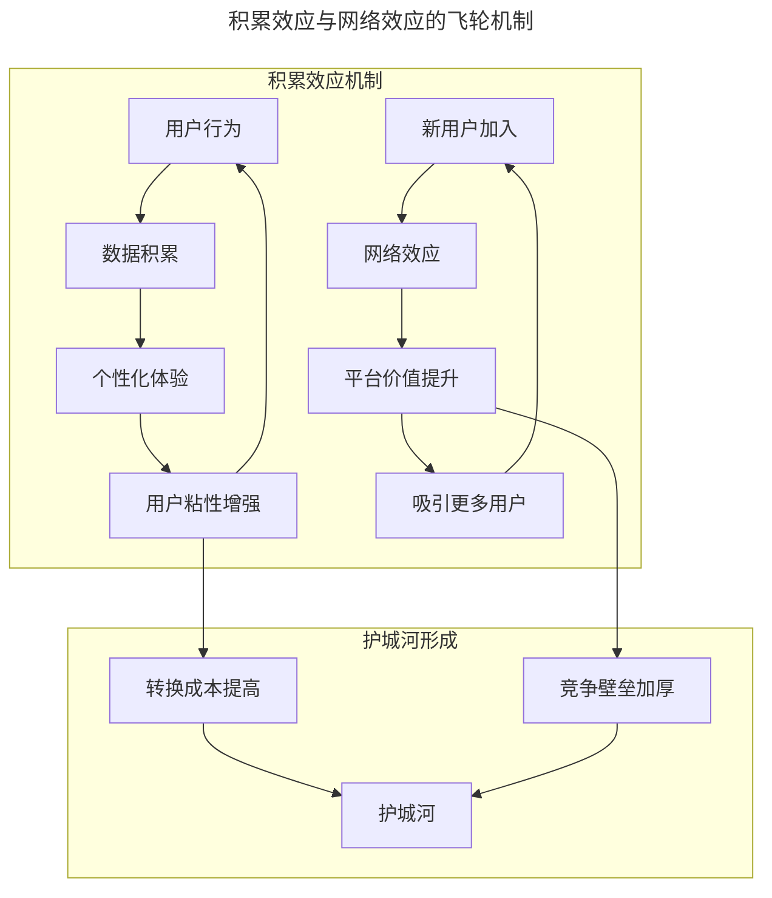
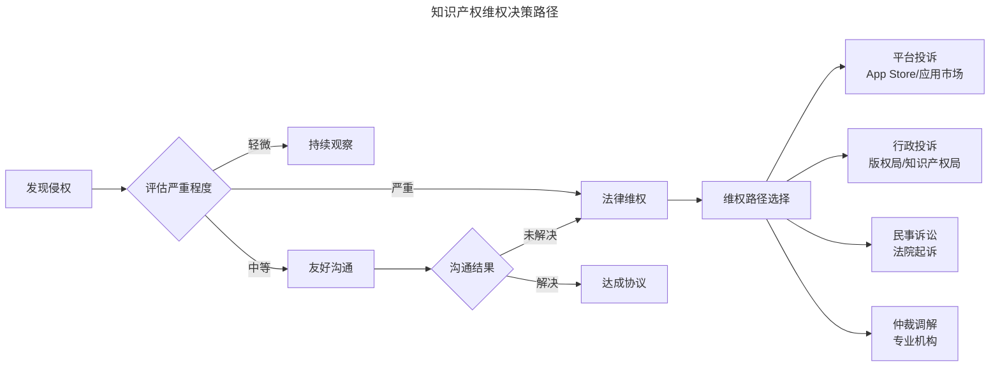
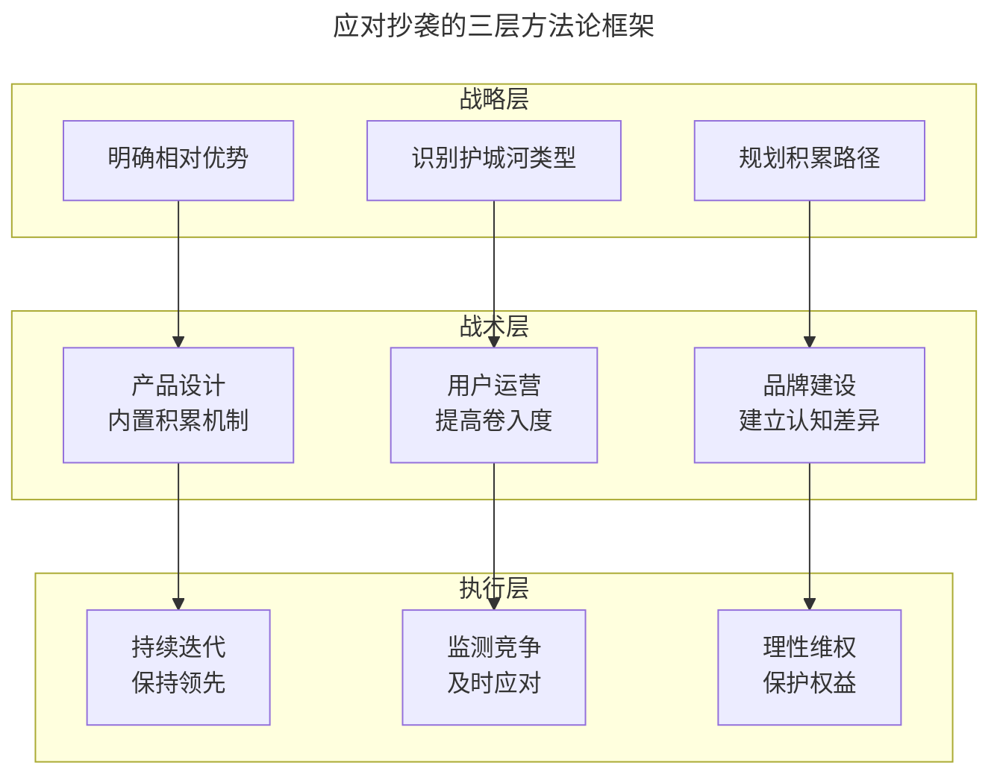

# 产品被抄袭了，怎么办？

> **适用范围**：产品经理、创业者、需要应对抄袭竞争的团队负责人。适用于竞争分析、护城河构建、积累效应设计、知识产权维权、AI 时代抄袭应对等场景。
>
> **更新摘要（v2 · 2026-08 更新）**：
> - 结构化升级为 6 节骨架（导言 / 核心方法论 / 关键流程 / 工具与实战 / 常见误区 / 进阶延展）
> - 保留应对策略框架、Why vs What/How、护城河类型、积累效应、理性维权、AI 时代新形态
> - 保留全部 Mermaid 图并补充 `--- title: ... ---` frontmatter，每张图后追加文字解读

---

## 1. 导言

**"世界上有两种产品，一种没人用，另一种被人抄。"**

身处节奏快、竞争激烈的互联网行业，抄袭是个逃不开的话题。从早期的"如果 BAT 跟你做同样的事情怎么办"，到如今字节跳动、腾讯、阿里、美团等平台型企业的"超级App生态战"，抄袭的形式和内涵都在持续演进。

2023-2025 年间，我们见证了多起引发行业热议的抄袭事件：某大厂小程序被指像素级复刻创业团队产品、短视频平台之间的功能"互相借鉴"、AI 产品之间的界面与交互高度相似等。这些事件背后，折射出互联网竞争从"功能竞争"向"生态竞争"、从"界面抄袭"向"机制复制"的深层演变。

> **核心摘要**：被抄袭是产品成功的"副产品"，说明你的方向得到市场验证。应对抄袭的核心策略是：摆正心态、构建不可复制的竞争壁垒、建立积累效应与网络效应、理性维权。真正的护城河不在界面和功能，而在数据积累、用户网络、团队认知与持续迭代能力。AI 时代，抄袭门槛降低但深度复制更难，产品经理需要重新理解竞争的本质。

---

## 2. 核心方法论

### 2.1 被抄袭后的应对策略框架

> **图解**：该流程图展示了从发现被抄袭到构建长期护城河的完整决策路径——评估抄袭程度（轻度借鉴保持关注、中度模仿分析意图、恶意抄袭启动应对），理性应对三步走（内部分析→沟通协商→法律维权），最终都走向持续迭代与构建护城河，强调理性评估与分层应对的重要性。

### 2.2 摆正心态：被抄是成功的副产品

**被抄说明你做对了什么**——发现有人抄袭你的产品时，首先要摆正心态。被抄说明你一定做对了一些事情——不论是交互设计、业务流程、运营机制还是商业模式。先行者在做出初期尝试时，很多东西建立在假设之上，在得到市场检验前，没人能保证正确。业内同行开始抄你的特性，至少说明他们对方向的认可。

**行业模仿加速市场教育**——人多力量大，整个行业用相似方式做事，可以更快教育市场和建立生态。iPhone 发布前后手机设计的对比是经典案例：发布后几乎所有手机都变成黑色方形触屏。从某种角度说，各手机厂商帮助 iPhone 更快确立了智能手机的标准范式。同样，当 ChatGPT 在 2022 年底引爆 AI 对话产品后，国内外数十款类似产品迅速涌现。这种"抄袭"客观上加速了 AI 产品的市场教育和用户习惯培养。

**新视角：模仿者的困境**——从竞争战略角度，模仿者其实面临"后发劣势"：认知滞后（只能看到"是什么"，难以理解"为什么"）；时机错失（等模仿完成，市场窗口可能已关闭）；资源分散（模仿消耗资源，影响自身创新）；品牌污名（被贴上"抄袭者"标签，影响长期发展）。

### 2.3 抄不走的是气质：Why vs What/How

**表层与深层的区别**——大部分抄袭都是界面和交互的抄袭，能抄走的是"What"和"How"，抄不走的是背后的"Why"和产品气质。产品的每个特性背后都应该有深入思考，产品气质应该一以贯之。以 Readhub 为例，很多交互细节设计都经过取舍：信息流里哪里点击展开、哪里点击跳转，都具备整体性。后来有网站抄这个交互，却影响了自身的信息密度一致性，还牺牲了流量，得不偿失。

**案例分析：Instagram Stories 的后续发展**——2016 年，Instagram 推出 Stories 功能，被广泛认为是"抄袭"Snapchat 的核心功能。然而，Stories 在 Instagram 生态中发展出了独特的生命力：

| 维度 | Snapchat Stories | Instagram Stories | 差异分析 |
|------|------------------|-------------------|----------|
| 用户基数 | 约1.5亿(2016) | 约1亿(2016年底) | Instagram 借助已有用户网络快速规模化 |
| 内容生态 | 强调私密社交 | 融合品牌营销 | Instagram 将 Stories 与商业生态结合 |
| 算法分发 | 时间线排序 | 算法推荐+时间线 | Instagram 利用算法优势提升内容触达 |
| 后续演进 | 保持原有定位 | 发展出 Reels、Shopping | Stories 成为 Instagram 生态的入口之一 |

Instagram Stories 上线仅两年多，到 2019 年初日活用户即突破 5 亿，远超同期 Snapchat。这说明：即使"抄袭"了功能，如果没有理解背后的产品逻辑和生态定位，也难以复制成功。

**AI 时代的"气质"新内涵**——AI 时代，"产品气质"有了新内涵：数据飞轮（用户使用越多，AI 模型越精准，形成数据壁垒）；提示词工程（优秀的提示词设计是产品气质的一部分）；人机协作模式（AI 与人的交互方式体现产品哲学）；伦理与安全（AI 产品的价值观体现团队认知）。这些"气质"层面的要素，是抄袭者难以复制的。

### 2.4 不要将护城河建在脸上

**什么是"护城河建在脸上"**——意思是不要将产品的外表作为护城河，因为外表太容易被抄走了。产品 Idea、界面设计、功能流程都无法成为真正的竞争壁垒。

**真正的护城河类型**：

> **图解**：护城河类型与强度分析——网络效应、转换成本和数据壁垒构成最强护城河（难以逾越），规模经济、品牌资产、生态锁定构成中等护城河（需要时间积累），技术专利在 AI 时代防护力下降（实现路径多样化）。

**新型抄袭模式：超级App与小程序**——2020 年后，一种新型抄袭模式兴起：超级App 通过小程序"借鉴"创业团队产品。

| 平台 | 抄袭模式 | 创业团队困境 | 应对策略 |
|------|----------|--------------|----------|
| 微信小程序 | 快速复刻热门功能 | 流量被截流、用户被分流 | 差异化定位、深耕垂直场景 |
| 抖音小程序 | 热门工具快速内置 | 获客渠道被封锁 | 构建私域、建立品牌认知 |
| 支付宝小程序 | 生活服务功能复制 | 支付场景被垄断 | 专注细分场景、建立服务壁垒 |

这种模式下，创业团队面临"平台既当裁判又当运动员"的困境。应对策略包括：差异化定位（找到平台不愿意或难以覆盖的细分场景）；私域建设（建立直接触达用户的渠道，减少平台依赖）；服务壁垒（在服务深度上建立优势）；品牌认知（让用户记住"原创者"）。

**开源模式对抄袭生态的影响**——开源模式的兴起改变了抄袭的定义边界：开源 ≠ 放弃权益（开源协议 MIT、Apache、GPL 等明确使用边界）；合规使用是借鉴（遵守协议的开源使用是行业常态）；违规使用是抄袭（不遵守协议、抹去版权声明是侵权行为）。案例：2024 年，某 AI 创业公司被指违规使用开源代码且未遵守 GPL 协议，最终被迫公开源代码并道歉。

---

## 3. 关键流程

### 3.1 做有积累效应的事情

**积累效应的核心机制**——抄袭者能抄走产品特性，却抄不走数据和用户。产品设计中要考虑数据积累和用户卷入，设计机制让用户使用越多，产品价值越大；或使用用户越多，产品价值越大（网络效应）。

> **图解**：积累效应与网络效应的飞轮机制——积累效应通过用户行为数据形成个性化体验，网络效应通过用户规模提升平台价值，两者共同构成护城河。

**经典案例深度分析**：
- **淘宝的信用积累**：用户购买行为积累买卖双方信用记录，无形中提高迁移成本。即便有公司一夜之间做出一模一样的产品，也无法对淘宝构成威胁。淘宝的护城河不是界面或功能，而是 20 年积累的信用体系和交易数据。
- **微信的网络效应**：当朋友都使用微信时，会有无形拉力让你转向微信；随着你的加入，朋友对微信的粘度更高。这是典型的双边网络效应。
- **AI 时代的新案例**：

| 产品 | 积累效应机制 | 护城河强度 |
|------|--------------|------------|
| ChatGPT | 用户对话数据优化模型 | 强（数据飞轮） |
| Midjourney | 用户生成图像训练模型 | 中（有开源替代） |
| Notion AI | 用户工作流数据优化建议 | 强（工作流锁定） |
| 抖音 | 用户行为数据优化推荐 | 极强（算法+内容生态） |

**用户卷入策略**——在产品设计中，要尽早让用户"卷入"，在产品中做出投资：数据投资（音乐播放器中标记越多"喜爱的歌曲"，越离不开）；社交投资（社交关系链迁移成本极高）；学习投资（熟练使用某工具后，迁移需要重新学习）；身份投资（名片印上邮箱地址、账号绑定服务等）。

### 3.2 理性维权：有条不紊，不要情绪化

**维权决策框架**——如果抄袭者越过底线，直接伤害利益，不能任由事态发展。此时保持冷静、不要情绪化至关重要。

> **图解**：知识产权维权决策路径——发现侵权后评估严重程度（轻微持续观察、中等友好沟通、严重法律维权），维权遵循"先沟通、后法律"原则，根据侵权严重程度选择平台投诉、行政投诉、民事诉讼或仲裁调解。

**中国知识产权保护环境改善**——法律环境：2020 年《民法典》确立知识产权保护基本原则；2020 年修订、2021 年 6 月施行的《著作权法》提高侵权赔偿上限（法定赔偿上限提至 500 万元）；2022 年施行的《反不正当竞争法》司法解释明确互联网侵权认定标准。司法实践：北京、上海、广州设立知识产权法院；惩罚性赔偿制度落地最高可判 5 倍赔偿；证据保全制度完善。平台机制：App Store、应用市场建立侵权投诉机制；微信、抖音等平台建立版权保护中心；阿里、京东等电商平台建立品牌保护体系。

**维权实操要点**：

| 阶段 | 关键动作 | 注意事项 |
|------|----------|----------|
| 证据收集 | 截图、录屏、公证存证 | 尽早固定证据，避免对方删除 |
| 专利布局 | 核心机制申请专利 | 专利审批周期长，需提前规划 |
| 沟通协商 | 直接对话、律师函 | 保留沟通记录，展示诚意 |
| 平台投诉 | App Store、应用市场 | 准备完整材料，按流程提交 |
| 法律诉讼 | 起诉、仲裁 | 评估成本收益，选择合适管辖 |

**维权的成本收益考量**——成本：律师费数万至数十万、诉讼周期 1-3 年、精力分散影响正常业务。收益：停止侵权保护市场份额、经济赔偿弥补损失、品牌声誉展示维权决心。决策建议：核心业务被侵权坚决维权；边缘功能被模仿评估后决定；维权成本高于收益考虑其他策略。

---

## 4. 工具与实战

### 4.1 AI 时代的抄袭与防御新形态

**AI 降低抄袭门槛**——AI 工具的普及降低了抄袭门槛：界面生成（AI 可快速生成类似界面设计）；代码生成（AI 可辅助编写类似功能代码）；文案生成（AI 可模仿产品文案风格）。这意味着"表层抄袭"更容易，但"深度复制"仍然困难。

**AI 增强防御能力**——同时，AI 也增强了防御能力：侵权监测（AI 可自动监测全网侵权行为）；证据固定（AI 可自动化证据收集和存证）；专利挖掘（AI 可辅助发现可专利点）。

**AI 产品特有的护城河**：

| 护城河类型 | 说明 | 案例 |
|------------|------|------|
| 训练数据 | 独有数据集难以复制 | OpenAI 的 GPT 训练数据 |
| 模型架构 | 自研模型架构优势 | Google 的 Transformer 改进 |
| 算力资源 | 大规模算力门槛 | 训练大模型需要数千 GPU |
| 提示词库 | 优质提示词积累 | Midjourney 的提示词优化 |
| 用户反馈 | RLHF 数据积累 | ChatGPT 的用户反馈数据 |

### 4.2 方法论框架

> **图解**：应对抄袭的三层方法论框架——战略层明确方向（明确相对优势、识别护城河类型、规划积累路径），战术层设计机制（产品设计内置积累机制、用户运营提高卷入度、品牌建设建立认知差异），执行层落地实施（持续迭代、监测竞争、理性维权），三层协同构建完整防御体系。

### 4.3 实战要点

| 要点 | 说明 | 适用场景 |
|------|------|----------|
| 心态建设 | 被抄是成功的副产品，保持冷静 | 所有被抄袭场景 |
| 护城河前置 | 产品设计之初就考虑壁垒 | 新产品规划阶段 |
| 积累效应设计 | 让用户使用越多价值越大 | 用户型产品设计 |
| 网络效应构建 | 让用户规模成为壁垒 | 平台型产品设计 |
| 差异化定位 | 找到巨头不愿覆盖的细分市场 | 创业团队应对大厂 |
| 私域建设 | 减少平台依赖，直接触达用户 | 依赖平台流量的产品 |
| 专利布局 | 核心机制提前申请专利 | 技术创新型产品 |
| 理性维权 | 评估成本收益，选择合适路径 | 确认被侵权后 |
| 持续创新 | 保持迭代速度，让跟随者永远落后 | 所有产品 |

---

## 5. 常见误区

| 误区 | 表现 | 正确做法 |
|------|------|---------|
| **情绪化应对** | 发现被抄袭就慌乱、情绪化 | 保持冷静，理性评估抄袭程度 |
| **把外表当护城河** | 以为界面、功能流程是竞争壁垒 | 护城河建在数据、网络、品牌、能力上 |
| **忽视积累效应** | 产品设计不考虑数据积累和用户卷入 | 设计机制让用户使用越多价值越大 |
| **维权过激** | 一被抄袭就起诉，忽略成本收益 | 先沟通后法律，评估成本收益 |
| **无差异化** | 创业团队与平台正面竞争 | 差异化定位、深耕垂直场景 |

---

## 6. 进阶延展

### 6.1 核心观点总结

被抄袭是产品成功的"副产品"，说明你的方向得到市场验证。应对抄袭的核心策略是：摆正心态、构建不可复制的竞争壁垒、建立积累效应与网络效应、理性维权。真正的护城河不在界面和功能，而在数据积累、用户网络、团队认知与持续迭代能力。

AI 时代，抄袭门槛降低但深度复制更难。产品经理需要重新理解竞争的本质——从"功能竞争"转向"生态竞争"，从"界面抄袭"转向"机制复制"。

### 6.2 延伸阅读

1. 《竞争战略》- 迈克尔·波特：理解竞争本质与护城河理论
2. 《从0到1》- 彼得·蒂尔：垄断思维与差异化竞争
3. 《网络效应圣经》- NFX：网络效应的类型与构建方法
4. 《知识产权保护实务指南》- 中国知识产权研究会：维权实操手册
5. 《AI时代的竞争战略》- 哈佛商业评论2024：AI 产品护城河新形态
