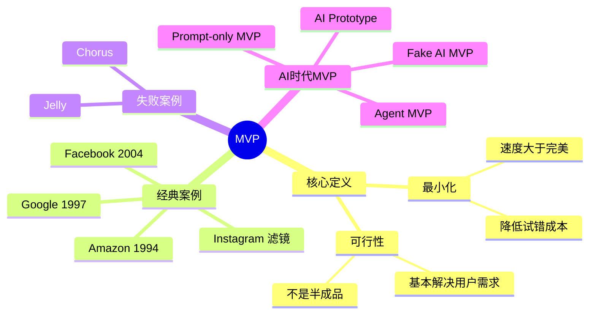
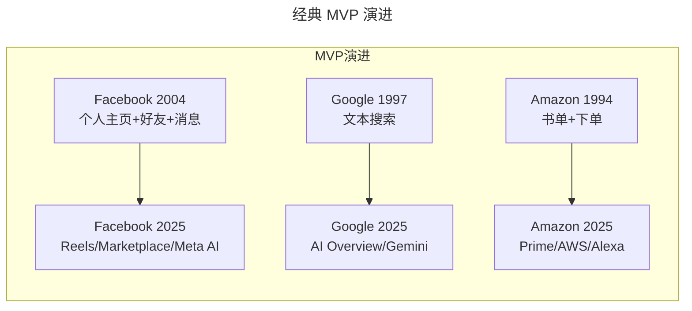
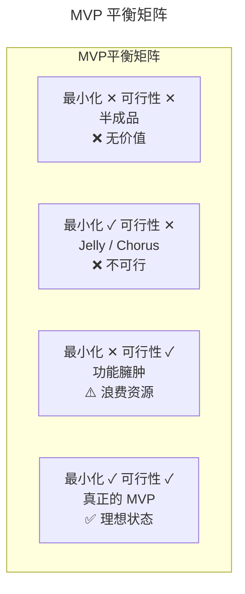
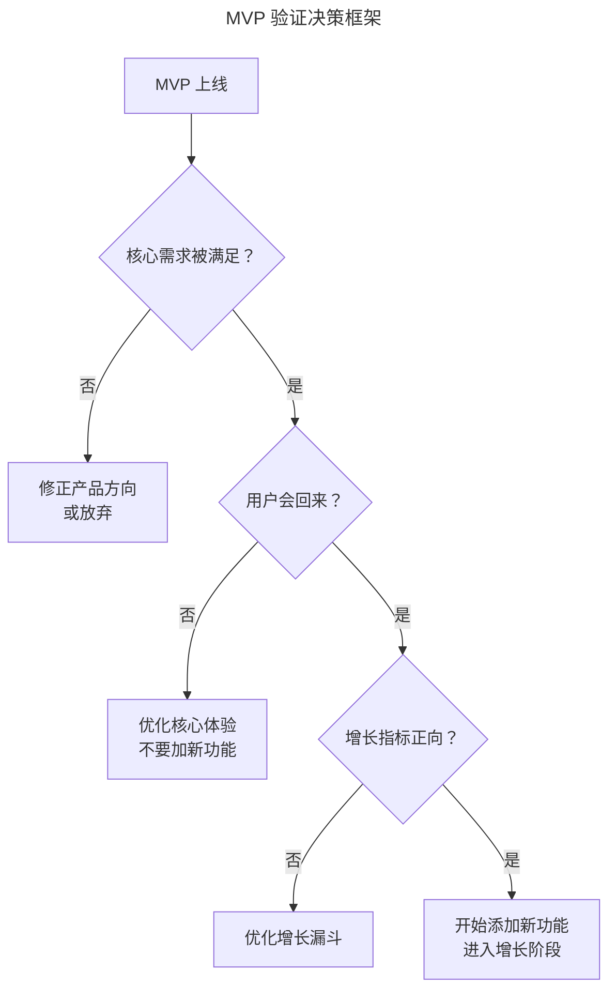
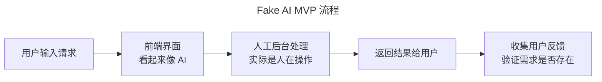
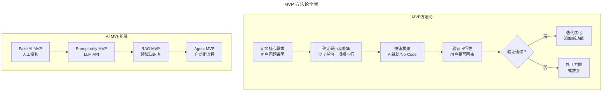

# 10 | 什么是最小化可行产品（MVP）？

> **适用范围**：产品经理、创业者、需要验证产品需求的团队负责人。适用于产品创意验证、MVP 设计、精益创业实践、AI 产品验证等场景。
>
> **更新摘要（v2 · 2026-08 更新）**：
> - 结构化升级为 6 节骨架（导言 / 核心方法论 / 关键流程 / 工具与实战 / 常见误区 / 进阶延展）
> - 保留原文"凤凰男"比喻、经典案例与 AI 时代 MVP 新范式内容
> - 保留全部 Mermaid 图并补充 `--- title: ... ---` frontmatter，每张图后追加文字解读

---

## 1. 导言

### 1.1 精益创业的核心理念

最小化可行产品（Minimum Viable Product, MVP）是现在硅谷产品开发最推崇的理念，其思想来源于"精益创业"（Lean Startup），由埃里克·莱斯（Eric Ries）在《精益创业：新创企业的成长思维》中提出。

> 精益创业提倡企业进行"验证性学习"，先向市场推出极简的原型产品，然后在不断地试验和学习中，以最小的成本和有效的方式验证产品是否符合用户需求，灵活调整方向。如果产品不符合市场需求，最好能"快速地失败、廉价地失败"，而不要"昂贵地失败"；如果产品被用户认可也应该不断学习，挖掘用户需求，迭代优化产品。

> **图解**：MVP 概念围绕"最小化 + 可行性"双核心展开，通过经典案例（Facebook、Google、Amazon、Instagram）与失败案例（Jelly、Chorus）正反印证，并在 AI 时代演进出 Fake AI MVP、Prompt-only MVP、Agent MVP 等新范式。

---

## 2. 核心方法论

### 2.1 最小化可行产品 = 凤凰男

现在，我喜欢把最小化可行产品描述成一个"凤凰男"：当你刚和他相恋时，他只是对你好，除此之外一无所有，但之后他奋发图强，赚了钱买了房买了车，最终成为"教科书"般迷人的老公。

但是其实你最需要的是他对你好，如果他连最基本的对你好都达不到，那你肯定不会继续交往。所以，最小化可行产品就好比一个奋斗阶段的"凤凰男"，它至少要满足你的一个需求，并且可以比较好地满足。

> **"最小化"在这里的意思就是：没有任何一个功能是"加上去也挺好的"，但是少了任何一个功能都无法解决用户最基本的需求。**

### 2.2 最小化 = 降低试错成本，速度 > 完美

很多时候，我们把一个产品做到完美再推向市场所花费的成本太高了，有可能付出了几年时间做出的产品却未能解决真正的用户需求。那不如把事情简单化，在一开始只做出一个能够解决用户需求的、最最基本的产品，然后再一步一步通过用户和产品的互动，不断优化、不断创新，最终形成优秀的产品。

### 2.3 经典 MVP 案例

> **图解**：Facebook、Google、Amazon 的 MVP 都始于极简功能（个人主页+好友+消息、文本搜索、书单+下单），经过多年演进成为今天的巨头产品。

- **Facebook（2004 年）**：只有填写个人介绍、联系方式、政治观点、个人兴趣，显示朋友、加入的小组和发消息功能。没有朋友圈（News Feed），但满足了用户窥探欲和与人交流的基本需求。
- **Google（1997 年）**：只有简单的文本搜索功能，还有"I'm feeling lucky"按钮。当年雅虎靠人工筛选目录，而谷歌的 PageRank 算法实现规模化和自动化，大获成功。
- **Amazon（1994 年）**：内容就是一个书单，你看中哪本书就下单，亚马逊帮你找到这本书寄给你，这时连自己的物流管理系统都没有。

这些产品共同特点是：初级阶段功能非常简单，但都能以最好的方式满足用户一个未被满足的需求。

> **视角提示**：MVP 的核心不是"做得少"，而是"只做最关键的"。Facebook 的 MVP 没有朋友圈，但有了"好友关系"这个核心——因为社交产品的核心价值是"连接人"。

### 2.4 可行性 = 确保产品基本解决用户需求

加快进入市场的速度，并不是说产品什么也没解决就可以进入市场。如果最小化可行产品连最基本的唯一需求都解决不好，首先需要提升这个产品的体验，而不是着急增加新功能。

**Instagram 的滤镜故事**：Instagram 刚创立时只有发图片功能，用户体验并不好。CEO 凯文·斯特罗姆的女朋友说"能不能把这些照片弄得好看一点"，他茅塞顿开，联合开发了几款滤镜。没有滤镜功能的 Instagram 不能算 MVP，因为用户需求不只是分享照片，而是要轻松分享拿得出手的照片。

### 2.5 MVP 的"最小化"与"可行性"平衡

> **图解**：MVP 平衡矩阵——半成品（两缺，无价值）、Jelly/Chorus（最小化够但不可行）、功能臃肿（可行但浪费资源）、真正的 MVP（最小化+可行性兼备，理想状态）。

---

## 3. 关键流程

### 3.1 两个失败案例的启示

**Jelly（Twitter 联合创始人比兹·斯通创立）**：定位是做朋友互动的搜索引擎。两个主要问题：只解决提问者需求，对回答者毫无意义，回答量逐渐减少；等到朋友的回答需要时间，用户没有耐心等待。

**Chorus（Twitter 前 CEO 迪克·卡斯特罗创立）**：帮助一群朋友互相监督定期健身。试图通过社交压力让大家坚持健身，但过大的社交压力却适得其反，上线 8 个月后下架。

> **启示**：这两个产品的失败，归根结底是忽视了"可行性"，并没有真正地解决用户最基本的需求，或者说没有以很好的方式解决这个需求。

### 3.2 MVP 验证方法论

**传统验证方法**：

| 方法 | 描述 | 适用场景 |
|------|------|---------|
| 用户访谈 | 直接问用户是否需要 | 需求探索期 |
| 假门测试 | 放一个假按钮看点击率 | 功能优先级验证 |
| A/B 测试 | 对比两个方案的效果 | 方案选择 |
| 着陆页测试 | 只做一个注册页看转化率 | 市场需求验证 |

### 3.3 MVP 验证的决策框架

> **图解**：MVP 验证决策框架逐层判断——核心需求是否被满足、用户是否会回来、增长指标是否正向，逐层决定修正方向、优化核心体验、优化增长漏斗或进入增长阶段。

---

## 4. 工具与实战

### 4.1 四种 AI 时代的 MVP 类型

| MVP 类型 | 描述 | 构建成本 | 验证效果 | 适用场景 |
|---------|------|---------|---------|---------|
| Fake AI MVP | 人工模拟 AI 输出（绿野仙踪法） | 极低 | 高（真实用户反馈） | 验证需求是否存在 |
| Prompt-only MVP | 用现有 LLM API + 简单界面 | 低 | 中（受限于通用模型） | 验证 AI 能否解决问题 |
| RAG MVP | LLM + 领域知识库 | 中 | 高（领域定制） | 需要专业知识的场景 |
| Agent MVP | AI Agent + 工具调用 | 中高 | 高（自动化流程） | 复杂工作流场景 |

### 4.2 Fake AI MVP（绿野仙踪法）

这是 AI 时代最经典的 MVP 方法——**用户以为在用 AI，实际上是人工在后台操作**：

> **图解**：Fake AI MVP 流程——用户输入请求，前端界面看起来像 AI，实际是人工后台处理，返回结果后收集用户反馈验证需求是否存在。经典案例包括 Zappos 早期（拍鞋店照片放网上，有人下单再去买）和 AI 客服 MVP（前端像 AI 聊天机器人，后台是人工客服）。

### 4.3 AI MVP 的构建速度对比

| 产品类型 | 2018 年 MVP 构建时间 | 2025 年 AI 辅助构建时间 | 加速比 |
|---------|-------------------|---------------------|-------|
| 简单 Web 应用 | 2-4 周 | 2-3 天 | 5-10x |
| 移动应用 | 4-8 周 | 1-2 周 | 3-5x |
| AI 聊天机器人 | 8-12 周 | 3-5 天 | 10-20x |
| 数据分析仪表盘 | 4-6 周 | 1 周 | 4-6x |

### 4.4 AI 时代最新实践（2024-2026）

- **AI 原生产品的 MVP**：ChatGPT 本身就是一个经典 MVP——GPT-3.5 发布时只有对话功能，但完美解决了"用自然语言与 AI 对话"的核心需求，后续才逐步添加 GPTs、联网搜索、文件分析等功能。
- **No-Code + AI 的 MVP 构建**：v0.dev（生成前端界面）、Cursor + Claude（生成后端 API）、Dify（搭建 AI 工作流）、Supabase（即时数据库）、Vercel（一键部署）。
- **MVP 的"去泡沫化"**：不再接受"AI 演示"作为 MVP；质量阈值要求提高（AI 输出准确率低于 80% 很难留住用户）；成本意识增强（Token 消耗必须纳入 MVP 验证）。

---

## 5. 常见误区

### 5.1 MVP 认知误区

| 误区 | 表现 | 正确认知 |
|------|------|---------|
| **把 MVP 当半成品** | 功能残缺、不解决核心需求 | MVP 是"恰好满足核心需求的最简产品" |
| **片面追求最小** | 一味做少功能忽略可行性 | 最小化 + 可行性必须平衡 |
| **只解决单方需求** | 只满足提问者/单方，忽略其他参与方 | 像 Jelly 那样对回答者无意义就失败 |
| **忽视用户回来** | 用了一次就不来还加新功能 | 判断可行性关键是用户会不会回来 |

### 5.2 AI MVP 的"可行性"陷阱

| 陷阱 | 表现 | 解决方案 |
|------|------|---------|
| 准确率不足 | AI 回答错误率太高，用户不信任 | 定义最低质量阈值，低于阈值时降级为人工 |
| 延迟过高 | AI 推理太慢，用户等不及 | 设置超时机制，超时返回缓存结果 |
| 成本失控 | Token 消耗远超预期 | 设置每用户每日调用上限 |
| 幻觉问题 | AI 编造不存在的信息 | 添加事实核查层 + 来源引用 |

---

## 6. 进阶延展

### 6.1 方法论全景

> **图解**：MVP 方法论全景——核心路径是"定义核心需求→确定最小功能集→快速构建→验证可行性→验证通过则迭代优化，否则修正方向或放弃"；AI 时代扩展出 Fake AI MVP→Prompt-only MVP→RAG MVP→Agent MVP 的演进路径。

### 6.2 关键术语

| 术语 | 英文 | 释义 |
|------|------|------|
| 最小化可行产品 | MVP (Minimum Viable Product) | 恰好满足核心需求的最简产品 |
| 精益创业 | Lean Startup | 以 MVP 为核心的创业方法论 |
| 绿野仙踪法 | Wizard of Oz | 人工模拟 AI 输出的 MVP 验证方法 |
| 假门测试 | Fake Door Test | 用假入口测试用户需求的方法 |
| 最低可接受质量 | MAQ (Minimum Acceptable Quality) | AI 产品 MVP 的最低输出质量标准 |
| 人在回路 | Human-in-the-Loop | AI + 人工协作的模式 |

### 6.3 思考题

1. **进阶题**：你需要设计一个 APP，帮助学生家长和中学老师联系。这个 APP 的 MVP 需要具备什么样的功能？哪些功能是"加上去也挺好的"但 MVP 不需要的？
2. **资深题**：选择一个你想做的 AI 产品，设计它的 Fake AI MVP。你如何用人工模拟 AI 输出来验证需求？这个 MVP 的最低可接受质量（MAQ）是什么？
3. **专家题**：AI 产品的 MVP 面临"速度 vs 质量"的独特困境。你如何设计一个"AI + Human-in-the-Loop"的 MVP，既保证速度又保证可行性？

### 6.4 延伸阅读

- Eric Ries, *The Lean Startup* (2011)
- Steve Blank, *The Startup Owner's Manual* (2012)
- Ash Maurya, *Running Lean* (2012)
- Marty Cagan, *Inspired* (2nd Edition, 2017)
- Marty Cagan, "AI-Native Product Teams" (2024)
