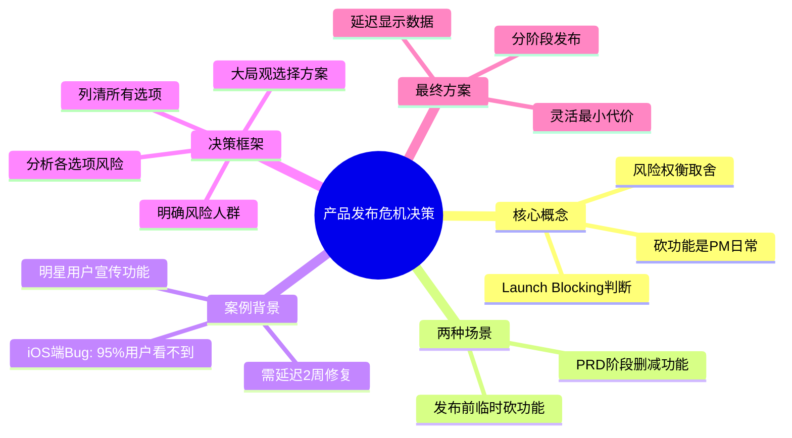
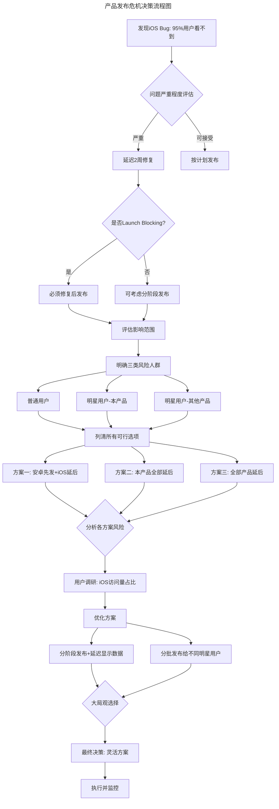
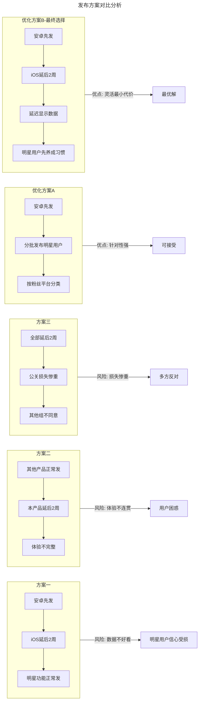
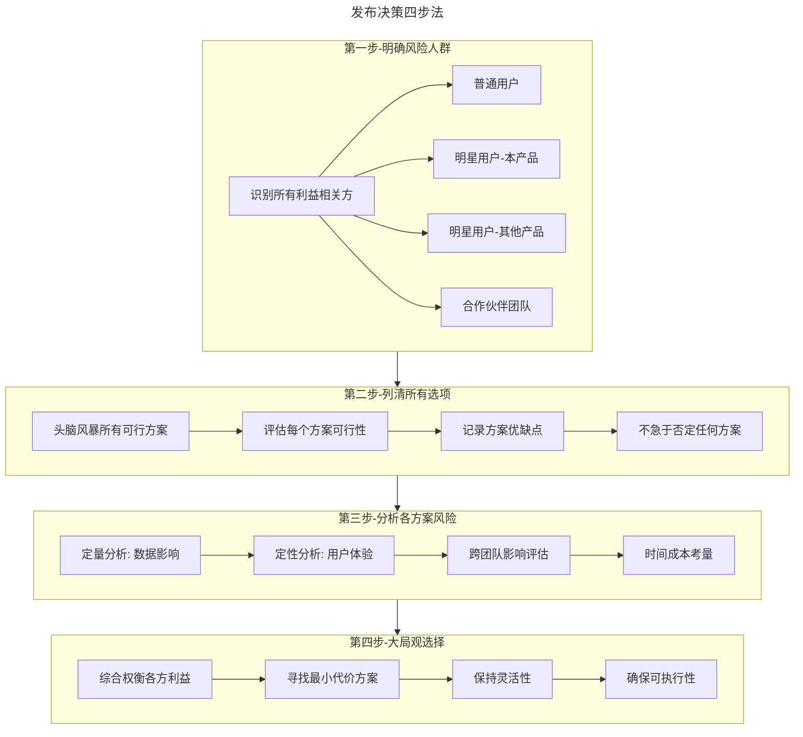
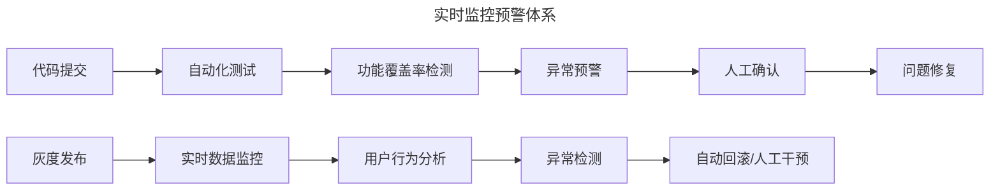
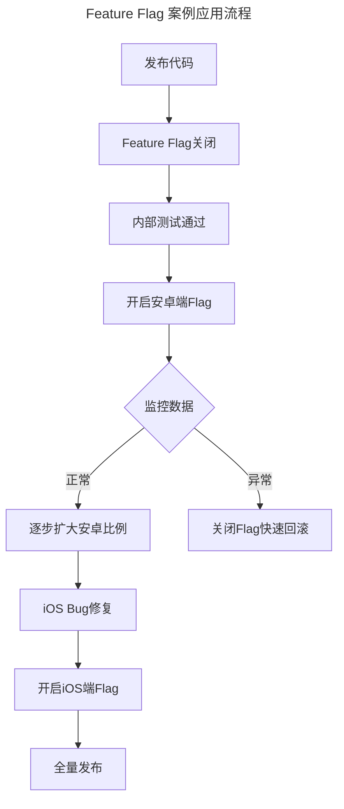
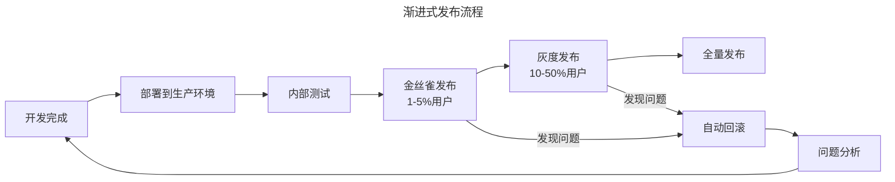

# 11 | 案例：产品发布之前出了乱子，如何权衡取舍？

> **适用范围**：产品经理（各阶段）、需要处理发布危机的团队负责人、创业者。适用于发布决策、Launch Blocking 判断、风险权衡、跨团队协调、灰度发布/Feature Flag 等场景。
>
> **更新摘要（v2 · 2026-08 更新）**：
> - 结构化升级为 6 节骨架（导言 / 核心方法论 / 关键流程 / 工具与实战 / 常见误区 / 进阶延展）
> - 保留明星用户功能案例、四步决策框架、三层深度视角
> - 保留全部 Mermaid 图并补充 `--- title: ... ---` frontmatter，每张图后追加文字解读

---

## 1. 导言

上一次程序员和产品经理的战争中，说得最多的是：产品经理每天就知道加功能蹂躏程序员。但实际上，**作为一个产品经理，我每天做得最多的事情就是砍功能**：一是，删减产品需求文档上的功能，只保留最重要的功能；二是，已经决定了要加功能，但出现了突发情况，需要临时决定到底要不要砍功能。

第一种情况下，砍掉产品的哪些功能主要考虑每个功能对总体指标的贡献有多大，以及工程难度有多大；而第二种砍产品功能的情况往往出现在产品发布之前，还可能会涉及到和其他组合作的情况，需要考虑各个方面的因素，操作起来比较复杂。

平时在 Facebook 的工作中，我最常说的一句话是"这个是不是 launch blocking？"，即没有这个功能会不会影响产品发布。我经常在以下两种情况下说这句话：第一是产品刚刚开始内测，收到用户反馈说某个功能不好用，讨论要不要推后发布；第二是产品需要和其他组合作完成，但其他组出现突发情况，某个功能无法按时完成。

### 1.1 核心导图



> **图解**：产品发布危机决策——核心概念（砍功能是 PM 日常、Launch Blocking 判断、风险权衡取舍）、两种场景（PRD 阶段删减、发布前临时砍）、案例背景、四步决策框架（明确风险人群→列清选项→分析风险→大局观选择）、最终方案（分阶段发布、延迟显示数据、灵活最小代价）。

### 1.2 功能发布背景介绍

我们产品要发布的新功能：帮助一类明星用户宣传自己，让这些明星用户们获得更多普通用户的关注，从而提升明星用户的点击量。明星用户需要先完成一些任务，才可以得到宣传机会。所以这个新功能主要包括两部分：一是，普通用户的部分；二是，明星用户完成任务后开启这个新功能得到平台的宣传，并且可以查看因此增加的点击量。要和我们的产品同时发布的还有其他几个针对明星用户的产品，这些产品对应的明星用户是一样的。

经历了一段时间的开发，第二部分明星用户的功能已经开发完毕，第一部分的功能也接近尾声了。突然，负责我们产品普通用户部分开发的 iOS 工程师说："大事不好，我刚刚发现了一个 Bug，也就是说这个功能上线后，只有 5% 的 iOS 普通用户能看到，而剩下的 95% 的 iOS 用户都看不到。"

那么问题就来了，iOS 一周才会发布一次新版本，新版本给到 App Store 还要经过一周的审核，因此如果这个问题解决不了，那么这个新功能的上线就要延迟 2 周的时间。但是，这个功能在安卓平台已经测试完，并且参加测试的明星用户好评如潮。所以，我们需要做出决定：是先解决 iOS 平台部分的问题，然后两个平台同时上线，那么上线时间就要延后两周；还是先在安卓平台发布新功能。

---

## 2. 核心方法论

### 2.1 决策流程图



> **图解**：产品发布危机决策流程——发现 iOS Bug（95% 用户看不到）→评估严重程度→判断是否 Launch Blocking→评估影响范围→明确三类风险人群（普通用户、本产品明星用户、其他产品明星用户）→列清所有可行选项（三个方案）→分析各方案风险→用户调研（iOS 访问量占比）→优化方案→大局观选择→最终决策执行并监控。

### 2.2 思考方式：三类风险人群

现在这个问题其实涉及到普通用户和明星用户：对普通用户来说，iOS 有没有这个功能并没什么影响，因为这次的新功能只是增加了一个可以让他们看推荐的明星用户的版块；而对明星用户来说，我们需要显示这个新功能给他们增加了多少点击量，来保证他们有足够的动力完成预设的任务。

因为要同时发布的这几个产品对应的明星用户是一致的，所以我们产品的这个新功能在所有平台都晚发布两周，那么其他几个产品的功能就会不完整。但是，现在公关方案已经接洽好了，如果把这几个产品全部延后两周发布，那必然损失惨重。

如果只有安卓端的用户可以看到推荐并点击，那这个明星用户的总体点击量会因为 iOS 端的用户无法看到并点击而降低，而最先发布的两周时间里用户点击量的增加量，是明星用户评价这个功能好坏的关键。所以，如果这些明星用户看到点击量并没有因为这个新功能增加多少的话，他们就会觉得这个功能不实用，以后也就不会用这个产品了。

---

## 3. 关键流程

### 3.1 方案对比分析



> **图解**：发布方案对比分析——三个基础方案各有风险（方案一数据不好看明星用户信心受损、方案二体验不连贯用户困惑、方案三损失惨重多方反对），优化方案 A（分批发布明星用户，针对性强，可接受）与优化方案 B 最终选择（安卓先发+iOS 延后+延迟显示数据+明星先养成习惯，灵活最小代价，最优解）。

针对我们产品现在的情况，以及上面考虑到的风险，我们讨论出了三个方案：
- **方案一**：我们产品的普通用户部分的功能，先在安卓平台发布，而 iOS 平台晚两周再发布，明星用户部分的功能发布日当天全部发布；其他几个产品正常发布。需要考虑两个问题：要和明星用户解释一下数据两周后才有说服力；数据不好看，明星用户依然会对我们的产品丧失信心。
- **方案二**：先发布其他几个针对明星用户的产品，而我们产品在安卓端和 iOS 端的发布全部推后两周。风险是，因为我们产品延后发布，导致其他几个产品缺乏完整性、用户体验不连贯。
- **方案三**：所有的产品全部推后两周调试完美后再发布。风险是，全部计划包括公关计划都会受影响，损失惨重，其他的组不会同意。

其实，上面三个方案都不理想，我们需要思考一些更好的方法。所以，我们换了一个思考问题的角度：iOS 平台的普通用户点击量对整体点击量的影响有多大？针对这个问题，我们专门做了用户调研。用户调研结果显示：有些明星用户高达 80% 的访问量来自 iOS 平台，而有些明星用户的很多粉丝都在用安卓系统。

于是，我们针对调研结果，把明星用户根据大部分访问量的来源分成了两类，并提出了两个比较"聪明"的方案：
- **优化方案一**：我们产品普通用户部分的功能先在安卓平台发布，而明星用户部分功能，选择先发布给大部分点击量来自安卓平台的部分明星用户；其他几个针对明星用户的产品，也先发布给安卓粉丝量占比较大的明星用户。这样一来，对外的新闻稿，可以把"今日发布给所有人"改成"今日开始发布"。
- **优化方案二**：其他几个针对明星用户的产品，以及我们产品的明星用户部分的功能，正常发布；我们产品的普通用户部分功能先在安卓平台发布，但是等两周后 iOS 平台发布这部分功能后，再向明星用户显示点击量提升的数据。

这样，明星用户可以先在这个两周的时间里做任务，毕竟做任务也需要时间，等所有的平台都发布完成之后，再给他们显示包含了所有 iOS 和安卓用户的数据，"好看"的数据可以激励他们更好地完成任务。因此，先让明星用户形成使用习惯，再用数据激励他们继续使用，也不失为一个好方法。

经过各种讨论、思考，最终我们愉快地决定，选择更灵活的第二种方式：除了我们产品在 iOS 平台推迟两周发布普通用户部分的功能、并且在两周后才向明星用户显示增长的用户点击量外，其他产品照常发布。

### 3.2 四步决策方法论



> **图解**：发布决策四步法——第一步明确风险人群（识别所有利益相关方）、第二步列清所有选项（头脑风暴、评估可行性、不急于否定）、第三步分析各方案风险（定量/定性/跨团队/时间成本）、第四步大局观选择（综合权衡、最小代价、灵活性、可执行性）。

---

## 4. 工具与实战

### 4.1 三层深度视角

**🟢 进阶视角（1-3 年产品经理）：建立 Launch Blocking 判断意识**——对于 1-3 年的产品经理，最重要的是建立"Launch Blocking"的判断意识。不是所有问题都需要在发布前解决，关键是要区分哪些是"必须有"，哪些是"最好有"。实践要点：建立检查清单（列出所有功能优先级，标注哪些是 Launch Blocking）；提前沟通预期；学会说"不"（区分"致命问题"和"优化建议"）；建立应急预案（为每个关键功能准备 Plan B）。常见误区：追求完美导致发布延期；忽视跨团队依赖；没有优先级意识。

**🔵 资深视角（3-5 年产品经理）：系统性风险评估与跨团队协调**——需要具备系统性思考能力，快速评估风险影响范围，并在多个团队之间进行有效协调。建立风险评估框架（影响面评估、影响深度评估、时间敏感度评估）；跨团队协调技巧（提前建立沟通机制、明确各方利益诉求、寻找共赢方案）；数据驱动决策（通过用户调研获取关键数据、用数据支撑决策）；灵活应变能力（不拘泥于原有方案、善于转换思考角度）。

**🟣 专家视角（5 年+产品经理）：战略级决策与组织影响力**——需要具备战略级决策能力，不仅解决当前问题，还要建立组织级的应对机制。建立组织级决策框架（将个人经验沉淀为团队可复用方法论）；战略层面的权衡（考虑决策对产品长期发展的影响、平衡短期利益与长期品牌价值）；危机管理能力（建立危机预警机制、制定多套应急预案）；影响力建设（通过成功案例建立决策权威、培养下一代产品经理的决策能力）。

### 4.2 AI 时代的新变化（2024-2026）

**AI 辅助决策**——AI 可以基于历史数据，快速评估问题的严重程度和影响范围：自动分析用户分群数据，预测不同方案的影响；基于历史发布数据，预测修复时间和成功率；智能推荐最优解决方案。

```
传统方式：产品经理手动收集数据 → 分析影响 → 提出方案 → 团队讨论
AI辅助方式：AI自动分析影响 → 推荐Top3方案 → 产品经理决策 → 快速执行
```

**案例中的 AI 应用**：如果案例发生在今天，AI 可以：自动分析每个明星用户的粉丝平台分布；预测不同发布策略下的点击量变化；推荐最优的分阶段发布方案；实时监控发布后的数据异常。

**自动化 A/B 测试**——在案例中，团队通过用户调研获取数据。今天，可以通过自动化 A/B 测试快速验证：不同发布策略对用户行为的影响；数据展示方式对明星用户满意度的影响；分阶段发布 vs 一次性发布的对比。实践建议：建立自动化实验平台；设定清晰的实验指标；预先定义实验终止条件；快速迭代优化方案。

**实时监控预警**——案例中的 Bug 是在发布前才发现的。今天，通过实时监控系统可以：在开发阶段就发现潜在问题；自动检测功能覆盖率异常；预警发布风险。



> **图解**：实时监控预警体系分两条线——代码提交→自动化测试→功能覆盖率检测→异常预警→人工确认→问题修复；灰度发布→实时数据监控→用户行为分析→异常检测→自动回滚/人工干预。

### 4.3 最新实践（2024-2026）

**灰度发布（Gradual Rollout）**——核心理念是小范围验证、逐步扩大：

| 阶段 | 用户比例 | 目的 | 持续时间 |
|------|----------|------|----------|
| 内测 | 0.1% | 内部验证 | 1-2天 |
| 灰度1% | 1% | 小范围验证 | 1-2天 |
| 灰度10% | 10% | 扩大验证 | 2-3天 |
| 全量 | 100% | 正式发布 | - |

**案例应用**：如果案例中的产品采用灰度发布：先在安卓端灰度 1% 用户，验证功能正常；发现 iOS Bug 后，暂停 iOS 端灰度；安卓端继续灰度，同时修复 iOS 问题；iOS 修复后，从灰度 1% 开始验证；两端都验证通过后，逐步扩大到全量。

**Feature Flag（功能开关）**——核心理念是功能与发布解耦。核心优势：快速回滚（发现问题立即关闭功能）；精准控制（按用户分群、平台、地区控制功能开关）；A/B 测试友好；降低发布风险。



> **图解**：Feature Flag 案例应用流程——发布代码后 Flag 关闭→内部测试通过→开启安卓端 Flag→监控数据正常则逐步扩大，异常则关闭 Flag 快速回滚→iOS Bug 修复后开启 iOS 端 Flag→全量发布。

**渐进式发布（Progressive Delivery）**——核心理念是发布是一个过程，而非一个事件：



> **图解**：渐进式发布流程——开发完成→部署到生产环境→内部测试→金丝雀发布（1-5% 用户）→灰度发布（10-50% 用户）→全量发布，任一阶段发现问题自动回滚→问题分析→回到开发。

---

## 5. 常见误区

| 误区 | 表现 | 正确做法 |
|------|------|---------|
| **追求完美发布** | 所有问题都在发布前解决，导致延期 | 区分 Launch Blocking 与"最好有" |
| **忽视跨团队依赖** | 临时发现其他组阻塞 | 提前建立跨团队沟通机制 |
| **没有优先级意识** | 所有问题同等对待 | 建立检查清单，标注功能优先级 |
| **凭直觉决策** | 不做用户调研直接拍板 | 用数据支撑决策（如 iOS 访问量占比调研） |
| **方案僵化** | 只盯着最初的方案，不转换角度 | 灵活应变，善于转换思考角度 |

---

## 6. 进阶延展

### 6.1 关键术语表

| 术语 | 英文 | 定义 | 应用场景 |
|------|------|------|----------|
| Launch Blocking | Launch Blocking | 没有该功能会影响产品发布的关键问题 | 发布前评估 |
| 灰度发布 | Gradual Rollout | 逐步向用户发布新功能，降低风险 | 产品发布 |
| Feature Flag | Feature Flag | 通过配置控制功能开关，无需重新发布 | 功能控制 |
| 渐进式发布 | Progressive Delivery | 分阶段、可监控、可回滚的发布方式 | 产品发布 |
| 金丝雀发布 | Canary Release | 先向小部分用户发布，验证后再扩大 | 风险控制 |
| A/B测试 | A/B Testing | 对比不同方案效果，数据驱动决策 | 方案验证 |
| 降级方案 | Fallback Plan | 主方案失败时的备选方案 | 风险预案 |
| 回滚 | Rollback | 发布后发现问题，恢复到之前版本 | 问题处理 |
| 热修复 | Hotfix | 不发版本的情况下修复线上问题 | 紧急修复 |
| 用户体验降级 | Graceful Degradation | 部分功能不可用时，保证核心功能可用 | 容错设计 |

### 6.2 总结

我通过一个具体的案例，跟你分享了如何权衡取舍，以及在产品发布之前部分功能出现问题时如何统筹。通过这个具体的案例，我要表达的内容包括以下四个方面：

**第一**，要明确功能造成问题的风险以及受影响的人群，这个案例里涉及到了三类人群：使用我们产品新功能的普通用户、使用我们产品新功能的明星用户、使用其他产品的明星用户。

**第二**，要列清楚所有可行的选项，以及对每个群体的影响。

**第三**，分析各个选项之间的风险。

**第四**，要有大局观，选择最合适的方案。在这个案例里，我们最终考虑了其他产品想要完整体验、准时发布的要求，选择了最灵活、代价最小的处理方式。

在 AI 时代，产品发布决策正在经历深刻变革。AI 辅助决策、自动化 A/B 测试、实时监控预警等新技术，让产品经理能够更快速、更精准地做出决策。但无论技术如何进步，产品经理的核心能力——系统性思考、跨团队协调、战略级判断——永远不会过时。

### 6.3 延伸阅读

**经典方法论**：1. 《启示录：打造用户喜爱的产品》- Marty Cagan；2. 《精益创业》- Eric Ries；3. 《持续交付》- Jez Humble & David Farley。

**技术实践**：1. Feature Flag 最佳实践（LaunchDarkly 官方文档）；2. 灰度发布实践（Netflix、阿里巴巴）；3. 可观测性建设（Google SRE 手册）。

**案例研究**：1. Facebook 的发布实践（Gatekeeper 系统、暗启动）；2. Netflix 的 Chaos Engineering（Chaos Monkey）；3. Google 的发布审查（Launch Review Committee）。
