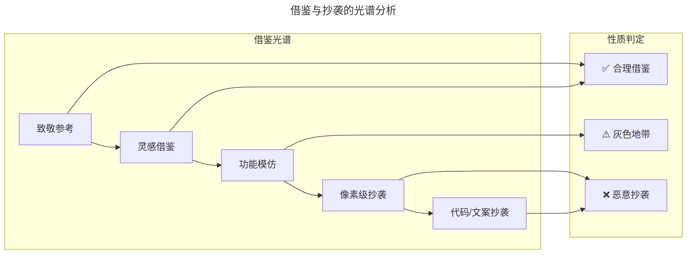
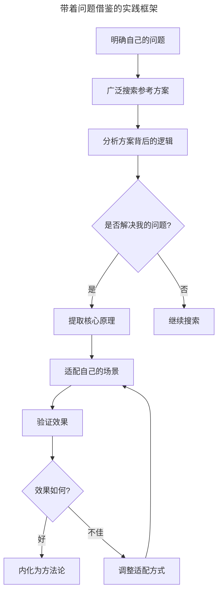
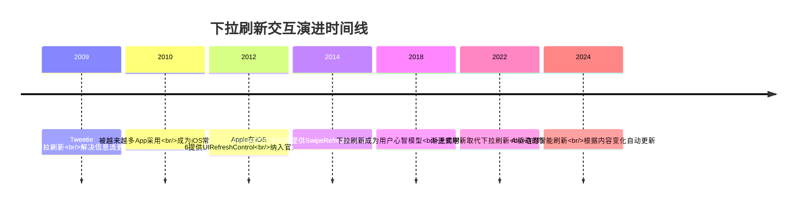
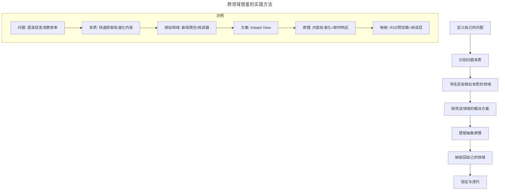
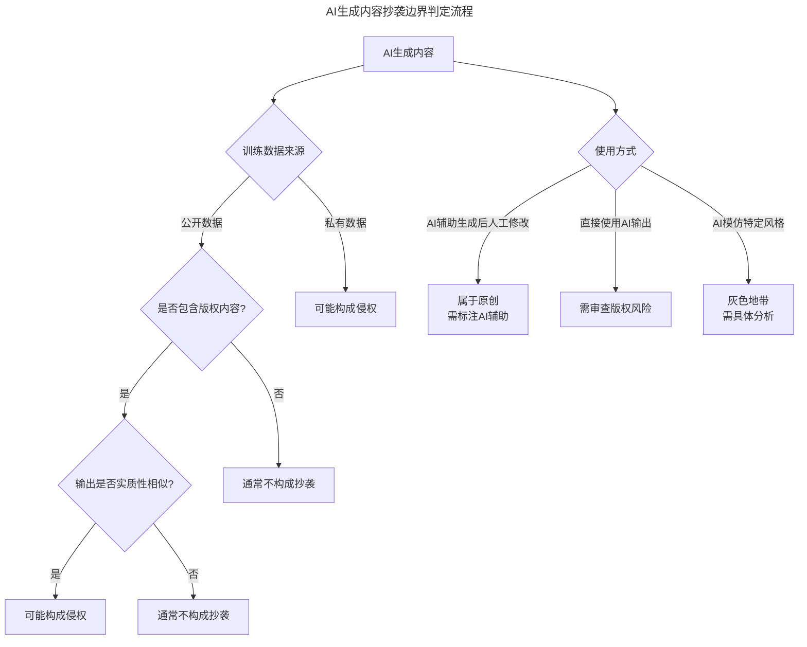
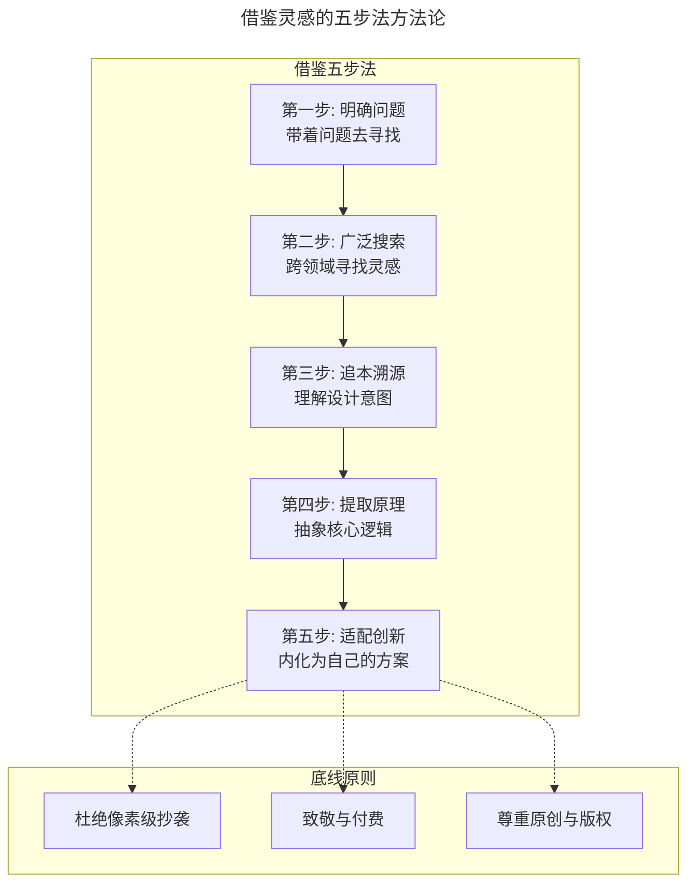

# 如何借鉴灵感？

> **适用范围**：产品经理（需要借鉴灵感）、设计师、创业者、需要跨领域创新的团队。适用于灵感借鉴、抄袭边界判断、追本溯源、跨领域借鉴、AI 时代借鉴伦理等场景。
>
> **更新摘要（v2 · 2026-08 更新）**：
> - 结构化升级为 6 节骨架（导言 / 核心方法论 / 关键流程 / 工具与实战 / 常见误区 / 进阶延展）
> - 保留借鉴光谱、带着问题借鉴、追本溯源、跨领域借鉴、致敬付费、AI 抄袭边界
> - 保留全部 Mermaid 图并补充 `--- title: ... ---` frontmatter，每张图后追加文字解读

---

## 1. 导言

**"The Early Bird Catches The Worm, But The Second Mouse Gets The Cheese." ——Francis J. Kong**

上一次我们聊到如何应对抄袭，提到需要找到相对优势、建立积累效应。然而在产品设计过程中，我们确实需要大量从其他产品中获得启发。就连 Facebook 都在内部新增了一条备忘，嘱咐员工："不要骄傲到不屑于抄袭（Don't be too proud to copy）"。

关键在于：如何在不伤害别人、也不伤害自己的基础上正确地借鉴他人产品中的灵感？

> **核心摘要**：借鉴灵感是产品经理的核心能力之一，但借鉴与抄袭之间存在清晰的边界。核心原则包括：杜绝像素级抄袭、带着自己的问题去借鉴、追本溯源理解设计意图、跨领域寻找灵感、致敬与付费。AI 时代，借鉴的边界更加模糊——AI 生成内容是否构成抄袭、AI 辅助设计如何影响原创性，都是产品经理需要思考的新命题。借鉴的终极目标是内化他人智慧，形成自己的方法论。

### 1.1 借鉴与抄袭的边界

> **图解**：借鉴与抄袭并非二元对立，而是一个连续光谱——致敬参考、灵感借鉴属合理借鉴；功能模仿属灰色地带；像素级抄袭、代码/文案抄袭属恶意抄袭。产品经理需要根据具体场景判断自己所处的位置，避免滑向抄袭端。

---

## 2. 核心方法论

### 2.1 杜绝像素级抄袭

**什么是像素级抄袭**——乔布斯在一次访谈中引用毕加索的话说："能工抄，巧匠偷"，并表示他并不觉得借鉴别人的创意可耻。但"偷"与"抄"有本质区别。"偷"是理解精髓后内化为自己的能力，"抄"是照搬表面形式。像素级抄袭就是后者——流程、界面或文案一模一样。在前些年引发热议的抄袭事件中，被抄袭一方列出的证据中有一项就是文案抄袭，大量文案一字不改地抄走。除了界面之外，直接抄代码、抄文档，都算是某种意义上的像素级抄袭，背后通常藏着懒惰和不负责任。

**"收敛一致"不等于抄袭**——或许有人会反驳说，在某个场景下，界面的优化效果最终会收敛一致，比如天下所有的登录页面都几乎是像素级相似的。诚然，形成固定模式的页面确实容易相似，这种相似是合理的。但每个产品都有其核心业务或核心机制，越是核心的东西，越有独特创意，对待这一部分的借鉴就应该越加谨慎和克制。

**AI 时代的像素级抄袭新形态**：

| 抄袭形态 | 传统方式 | AI增强方式 | 危害程度 |
|----------|----------|------------|----------|
| 界面抄袭 | 手动复刻UI | AI生成相似界面 | 高（速度更快） |
| 文案抄袭 | 逐字复制 | AI改写后相似 | 中（更难识别） |
| 代码抄袭 | 直接复制源码 | AI辅助重写 | 高（逻辑相同） |
| 交互抄袭 | 模仿操作流程 | AI分析后复现 | 中（交互模式有限） |

AI 让"改头换面"式抄袭变得更容易——表面看起来不同，但核心逻辑和体验完全一致。这种"AI洗稿"式抄袭比传统像素级抄袭更隐蔽，也更难维权。

### 2.2 脑子里带着自己的问题

**问题意识是借鉴的灵魂**——一个产品经理有没有抄袭别人，其实他自己心里很清楚。借鉴别人时，关键点在于脑子里有没有带着自己的问题。当脑海中有问题时，看到别人的方案是钥匙，可以打开自己脑子里的锁，最终内化成自己的武器库。但倘若脑海中没有问题，看到别的方案就是另一把锁，你只能把它照样搬过来，却永远无法打开它。

齐白石说过的"学我者生，像我者死"便是这个道理——不能用别人的工具去解决自己的问题，而应该研究别人的工具，体会它的精妙之处，变成自己的工具，去解决自己的问题。

**带着问题借鉴的实践框架**：

> **图解**：带着问题借鉴的实践框架——借鉴不是简单的"看到-照搬"，而是"明确问题→广泛搜索→分析逻辑→提取原理→适配场景→验证效果→内化为方法论"的完整闭环。

**案例深化：从 Telegram Instant View 到 Readhub**——在做 Readhub 时，我们希望尽可能在不抢占信源流量的前提下提高信息消费效率。带着这个问题看了很多设计后，在 Telegram 的 Instant View 中找到了灵感。Instant View 通过积累大量网站规则，理解对应网站的内容结构，使用户可以在 App 中按照统一格式快速查看目标页面中的信息。这个方案中的格式内容标准化和在当前页面快速即时反应给我们带来了启发。我们将通过算法筛选的内容利用 RSS 协议格式化后做预加载，并设计了在当前页面快速打开的阅读层，解决了此前困扰我们的问题。

**Telegram Instant View 的后续演进**：

| 阶段 | Instant View演进 | 对行业的启发 |
|------|-------------------|--------------|
| v1.0(2016) | 基于模板的页面解析 | 标准化阅读体验的价值 |
| v2.0(2018) | 引擎重写、支持多页文章 | 规模化覆盖的挑战 |
| 后续(2018至今) | 模板由社区持续编写与投票维护 | 众包模式解决规模化 |

Readhub 借鉴的是 Instant View 的核心理念——"标准化+即时响应"，而非具体实现方式。这正是"带着问题借鉴"的精髓。

### 2.3 追本溯源，知其所以然

**理解设计决策的上下文**——很多手机端信息流产品都有下拉刷新的特性，这来自 Twitter 客户端 Tweetie。这个特性流行起来后，越来越多非纵向信息流的产品也采用这一交互方式触发刷新。然而，这一特性并不适用于所有场景：从用户角度，最好的体验应当是不需要主动刷新就能看到最新信息（如股票应用或直播应用）；没有纵向滚动信息流设置时，缺乏明确提示，用户可能不知道如何触发刷新。如果追本溯源，找到下拉刷新交互的源头——它应用在纵向信息流中，且基于苹果惯性滑动特性——或许就不会不分场景地"借鉴"这一交互方式。

**下拉刷新：从创新到标准交互范式**——下拉刷新的演变是"创新→流行→标准化"的典型路径：

> **图解**：下拉刷新交互演进时间线——从 2009 年 Tweetie 2 首创，到 2012 年 iOS 6 提供 UIRefreshControl、2014 年 Android 官方支持库跟进，成为标准交互范式，再到 2024 年 AI 驱动的智能刷新。一个创新交互从诞生到成为标准范式通常需要 5-10 年。当交互成为标准时，借鉴是合理的；但在它还是创新时，盲目借鉴可能适得其反。

**追本溯源的方法论**：

| 分析维度 | 关键问题 | 示例 |
|----------|----------|------|
| 用户场景 | 这个设计解决什么用户问题？ | 下拉刷新解决信息流更新问题 |
| 技术约束 | 当时的技术条件如何？ | 早期推送技术不成熟 |
| 竞争环境 | 为什么是这个方案而非其他？ | 比按钮刷新更自然 |
| 演进路径 | 后续有哪些改进？ | 渐进式加载、智能刷新 |

---

## 3. 关键流程

### 3.1 跨领域、跨行业借鉴

**为什么跨领域借鉴更有效**——同行业中通常聚集着思维模式和习惯类似的人，盯着同行业产品"借鉴"容易陷入抄袭漩涡——面对类似用户群体，做类似的事情。跨领域借鉴之所以有效，是因为不同行业面对不同的约束条件，解决方案的思路差异大，更容易产生真正的灵感碰撞。

**经典案例：深泽直人的无印良品CD机**——深泽直人在设计无印良品的 CD 机时借鉴了换气扇。他在设计笔记中说，当拉动电源线时，碟片像扇叶一样旋转起来，音乐迎面吹来，像风拂过脸庞。这个案例的精髓在于：不是借鉴换气扇的"形式"，而是借鉴"拉动电源线→启动旋转"这个交互隐喻，将其映射到 CD 播放场景中。

**跨领域借鉴的实践方法**：

> **图解**：跨领域借鉴的关键是"抽象-映射"——先将问题抽象到本质层面（问题→本质→相似领域→方案→原理），在其他领域找到相似本质的解决方案，再映射回自己的领域（映射→验证与迭代）。

**更多跨领域借鉴案例**：

| 产品功能 | 借鉴来源 | 跨领域映射 | 效果 |
|----------|----------|------------|------|
| 社区收藏功能 | 音乐播放器"喜欢"加入列表 | 音乐→社区内容 | 降低收藏操作成本 |
| Snapchat阅后即焚 | 酒吧聊天 | 物理场景→数字产品 | 创造私密社交体验 |
| Twitter | 警察监控广播对话 | 专业通信→大众社交 | 简洁信息传播模式 |
| iPhone滑动解锁 | 滑动门锁 | 物理交互→数字交互 | 直觉式操作体验 |
| Figma实时协作 | Google Docs | 文档→设计 | 降低协作门槛 |

### 3.2 致敬与付费

**为创意付费的价值**——我在上家公司时，有一次主管 Fenng 叫我到他办公室，让我看一款应用，说打算把它买下来，把其中的机制引入医患问答领域。我说这个产品的 Code Base 跟我们不同，而且当时整体业务逻辑还没有做完整，买了也没什么太大用处，迟早要重做，给我几个人我很快就能做一个类似的。他瞪着我说："你去抄一个，别人怎么看你，怎么看我们？我们应该为创意付费。"我一时哑口无言，非常惭愧。最终我们还是支付了费用，将这个产品买下来，虽然在一两个版本之后就完全重写了。

**开源社区的赞助生态**——为创意付费的理念在开源社区有了更成熟的实践。2020 年后，开发者赞助生态蓬勃发展：

| 平台 | 模式 | 典型案例 | 适用场景 |
|------|------|----------|----------|
| GitHub Sponsors | 直接赞助开发者 | Vue.js 作者尤雨溪 | 持续维护的开源项目 |
| Patreon | 订阅制赞助 | 独立开发者/创作者 | 内容创作型项目 |
| Open Collective | 透明化资金管理 | Webpack、Babel | 需要资金透明度的项目 |
| Ko-fi | 一次性捐赠 | 独立工具开发者 | 小型工具/插件 |
| Buy Me a Coffee | 轻量级赞助 | 个人开发者 | 表达感谢的轻量方式 |

**案例**：Vue.js 作者尤雨溪通过 GitHub Sponsors 和 Patreon 获得社区赞助，实现全职维护 Vue.js。这种模式让"为创意付费"从个人行为变成可持续的生态机制。

**致敬的方式**——当从别处借鉴产品 Idea 时，如果条件允许，不妨支付一些费用，不论是购买版权还是向社区捐款。最不济也应该心存感激，在博客或产品公关稿中致以敬意。把自己放在阳光下，不但光明磊落，也从根源上杜绝了恶意抄袭的倾向——毕竟恶意的抄袭不好意思拿出来晒。致敬的具体方式：公开致谢（在产品文档、博客中明确标注灵感来源）；社区贡献（向开源项目提交代码或文档改进）；财务支持（通过赞助平台支持创作者）；知识回馈（分享自己的经验，帮助社区成长）。

---

## 4. 工具与实战

### 4.1 AI 生成内容与抄袭的新边界

**AI 生成内容是否构成抄袭？**——这是 2023-2025 年行业最热议的话题之一。AI 生成内容的抄袭边界需要分层讨论：

> **图解**：AI 生成内容的抄袭判定需要综合考虑训练数据来源（公开/私有）、输出相似度（实质性相似与否）和使用方式（辅助生成后修改/直接使用/模仿风格）三个维度。

**产品经理使用 AI 工具的伦理准则**：

| 场景 | 合理使用 | 不当使用 |
|------|----------|----------|
| 竞品分析 | AI辅助整理公开信息 | AI爬取竞品私有数据 |
| 界面设计 | AI生成初稿后人工调整 | AI直接复刻竞品界面 |
| 文案撰写 | AI辅助头脑风暴 | AI模仿竞品文案风格 |
| 功能设计 | AI辅助分析用户需求 | AI照搬竞品功能逻辑 |

**AI 辅助借鉴的正确姿势**：用 AI 扩展视野（让 AI 帮你发现跨领域的相似解决方案）；用 AI 分析原理（让 AI 帮你理解设计决策背后的逻辑）；用 AI 验证假设（让 AI 帮你评估借鉴方案的适用性）；不要用 AI 替代思考（AI 是工具，不是替代品）。

### 4.2 方法论框架：借鉴灵感的五步法

> **图解**：借鉴灵感的完整流程是"明确问题→广泛搜索→追本溯源→提取原理→适配创新"，全程需守住"不像素级抄袭、致敬付费、尊重版权"三条底线。

### 4.3 实战要点

| 要点 | 说明 | 适用场景 |
|------|------|----------|
| 杜绝像素级抄袭 | 核心业务逻辑不可照搬 | 所有产品设计场景 |
| 带着问题借鉴 | 先明确自己的问题再寻找灵感 | 产品设计全过程 |
| 追本溯源 | 理解设计决策的上下文和约束 | 借鉴具体交互或功能时 |
| 跨领域寻找 | 向行业外探寻灵感 | 创新突破阶段 |
| 提取原理 | 借鉴抽象原理而非具体实现 | 方案设计阶段 |
| 致敬与付费 | 为创意付费，公开致谢 | 借鉴明确来源时 |
| AI辅助借鉴 | 用AI扩展视野和分析原理 | 日常产品设计 |
| AI伦理底线 | 不用AI直接复刻竞品 | 使用AI工具时 |
| 标准交互可复用 | 已成标准的交互模式可合理使用 | 基础交互设计 |

---

## 5. 常见误区

| 误区 | 表现 | 正确做法 |
|------|------|---------|
| **像素级抄袭** | 流程、界面或文案一模一样 | 理解精髓后内化为自己的能力（"偷"而非"抄"） |
| **盲目借鉴新交互** | 不看场景就套用下拉刷新等 | 追本溯源，理解设计决策的上下文和约束 |
| **盯同行业抄袭** | 只盯着同行业产品"借鉴" | 跨领域借鉴，容易产生真正灵感碰撞 |
| **不致敬不付费** | 借鉴后不付费用不致敬 | 为创意付费，公开致谢 |
| **用 AI 替代思考** | 直接用 AI 复刻竞品 | AI 是工具，辅助扩展视野和分析原理 |
| **忽视 AI 抄袭边界** | 认为 AI 生成内容不算抄袭 | 综合考虑训练数据、输出相似度、使用方式 |

---

## 6. 进阶延展

### 6.1 核心观点总结

借鉴灵感是产品经理的核心能力之一，但借鉴与抄袭之间存在清晰的边界。核心原则包括：杜绝像素级抄袭、带着自己的问题去借鉴、追本溯源理解设计意图、跨领域寻找灵感、致敬与付费。

AI 时代，借鉴的边界更加模糊——AI 生成内容是否构成抄袭、AI 辅助设计如何影响原创性，都是产品经理需要思考的新命题。借鉴的终极目标是内化他人智慧，形成自己的方法论。

### 6.2 延伸阅读

1. 《设计中的设计》- 原研哉：理解设计的本质与跨领域思维
2. 《创新者的窘境》- 克莱顿·克里斯坦森：颠覆式创新与借鉴的边界
3. 《Steal Like an Artist》- Austin Kleon：如何正确地"偷"灵感
4. 《AI时代的知识产权》- WIPO 2024 报告：AI 生成内容的版权边界
5. 《开源之道》- 中国开源软件推进联盟：开源社区生态与赞助机制
