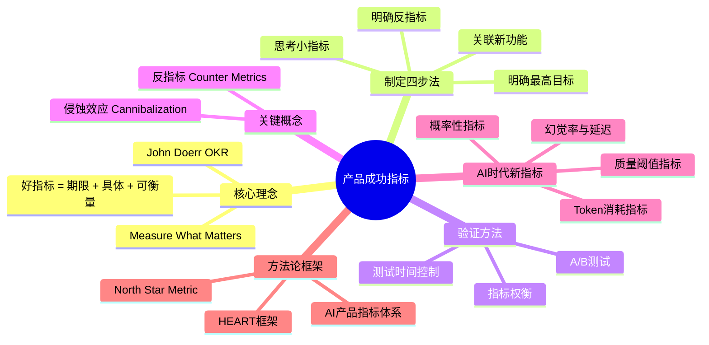
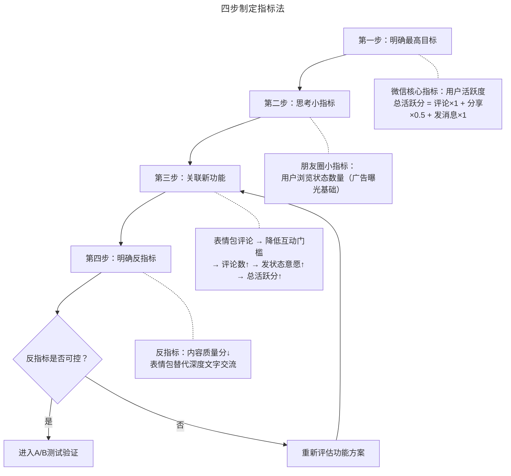
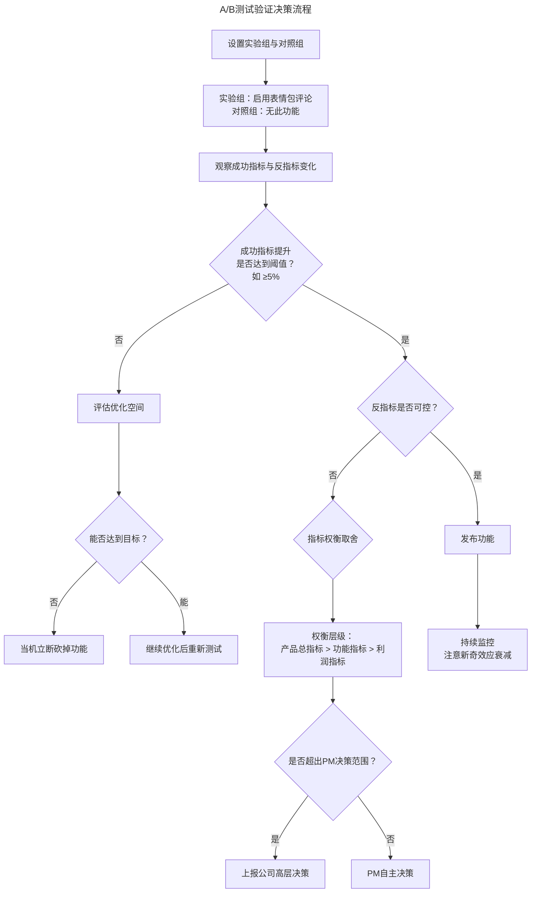
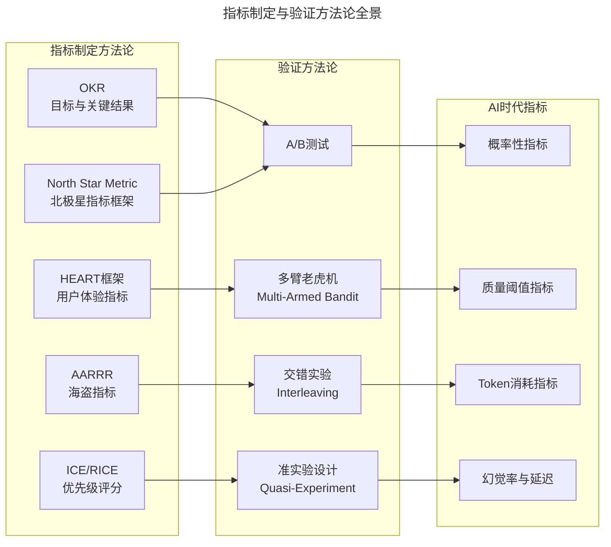
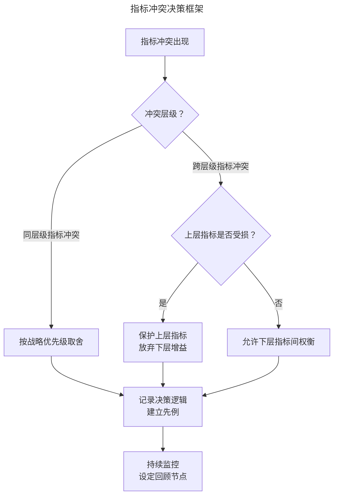

# 12 | 制定产品成功指标

> **适用范围**：产品经理（各阶段）、需要制定指标体系的管理者、创业者、AI 产品经理。适用于指标制定、A/B 测试验证、反指标/侵蚀效应识别、AI 时代指标体系等场景。
>
> **更新摘要（v2 · 2026-08 更新）**：
> - 结构化升级为 6 节骨架（导言 / 核心方法论 / 关键流程 / 工具与实战 / 常见误区 / 进阶延展）
> - 保留 OKR 理念、四步制定指标法、A/B 测试、侵蚀效应、North Star/HEART 框架
> - 保留全部 Mermaid 图并补充 `--- title: ... ---` frontmatter，每张图后追加文字解读

---

## 1. 导言

**约翰·道尔（John Doerr）** 是硅谷最具影响力的风险投资人之一，他是谷歌、亚马逊、网景、升阳电脑等公司的早期投资人。1999 年投资谷歌时，他将成功指标（OKR）的概念引入谷歌，帮助谷歌从一家初创公司成长为今天的科技巨头。2018 年，他出版了《Measure What Matters》，系统阐述了 OKR 方法论。

他在书中指出：**指标是为了定义你想要完成的目标，需要表达清楚在什么期限之内、要达到什么具体的、可衡量的结果。**

一个好的指标应该像"2026年Q4末实现100万日活"这样清晰，而"让用户多花时间在APP上"、"争取用户规模达到100万"都因为缺少关键信息而不能算好指标。

作为产品经理，**当你确定了正确的成功指标，你就成功了一半。**

### 1.1 核心导图

> **图解**：产品成功指标——核心理念（OKR、好指标 = 期限+具体+可衡量）、制定四步法（明确最高目标→思考小指标→关联新功能→明确反指标）、验证方法、关键概念（反指标、侵蚀效应）、AI 时代新指标、方法论框架（North Star、HEART）。

### 1.2 选错指标的代价

电商的成功指标应该是下单用户数，而非总用户数。你可以通过抽奖福利让大量用户下载 APP，但如果他们不下单，千万用户也无法支撑公司运转。错误的成功指标导致后续产品策略失误，最终结果是产品失败。

再看微信朋友圈：如果成功指标是"用户在朋友圈花的时间"，为了达成这个目标，微信会推送更多耗时内容（文章、视频），减少朋友发的文字和图片。看似增加了停留时间，却忽略了用户使用朋友圈的核心目的是和朋友互动。当需求得不到满足时，用户反而会减少甚至放弃使用朋友圈。**产品的成功指标必须和用户需求相契合。**

---

## 2. 核心方法论

### 2.1 四步制定指标法

> **图解**：四步制定指标法——明确最高目标→思考小指标→关联新功能→明确反指标，反指标可控则进入 A/B 测试验证，否则重新评估功能方案。以微信朋友圈表情包评论为例：最高目标为总活跃分（评论×1+分享×0.5+发消息×1），小指标为用户浏览状态数量，关联逻辑为表情包评论降低互动门槛提升总活跃分，反指标为内容质量分下降。

### 2.2 案例：微信朋友圈表情包评论功能

假设你是微信朋友圈的产品经理，要在朋友圈加一个可以用表情包评论的功能，需要通过制定成功指标、进行 A/B 测试，来确定这个功能值不值得发布。

**第一步，弄清楚整个产品的最高目标。** 朋友圈是微信的功能模块，需要从微信的核心指标出发。假设微信的核心指标是用户活跃程度，包括评论、分享、发消息、发图片等行为。通过用户数据和调研确定衡量指标为：**用户的总活跃分 = 评论×1 + 分享×0.5 + 发消息×1。** 朋友圈的设计初衷是让用户分享生活、增加朋友间互动，从而提升微信的总活跃分。

**第二步，思考产品功能还有哪些指标需要注意。** 朋友圈正计划在用户状态间穿插广告，每隔几个状态穿插一条广告。用户多刷几条状态就能提高广告曝光量，因此**用户浏览朋友状态的数量**也是一个重要指标。

**第三步，思考新功能与指标的关系。** 表情包评论降低了朋友间互动的门槛。发表评论的用户可以通过一个表情表达文字无法传达的情感；发表状态的用户发现评论从 2 条增加到 10 条甚至更多，感受到朋友的关注，激发再次发状态的热情，最终**增加微信的总活跃分**。

**第四步，明确反指标。** **反指标（Counter Metrics）是指产品带来的负面影响。** 假设微信对朋友圈内容质量打分，表情包评论的反指标就是降低了内容质量分。以前纯文字交流比较"走心"，现在几个暴走漫画、卖萌表情替代了深度交流，让互动流于表面，降低了整个朋友圈的内容质量分数。

通过分析，明确了：
- **成功指标：提升微信的总活跃分 + 用户每天浏览朋友状态的数量**
- **反指标：降低朋友圈内容质量分**

---

## 3. 关键流程

### 3.1 A/B 测试验证与决策

> **图解**：A/B 测试验证决策流程——设置实验组与对照组→观察成功指标与反指标变化→成功指标是否达到阈值（如 ≥5%）：未达则评估优化空间，无法达到则当机立断砍掉，能优化则继续；反指标是否可控：可控则发布功能，不可控则按"产品总指标 > 功能指标 > 利润指标"权衡，超 PM 范围上报高层，发布后持续监控注意新奇效应衰减。

设置实验组和对照组，实验组增加表情包评论功能，对照组没有，其他条件一致，观察两组成功指标和反指标的变化。如果实验组的成功指标增加显著，且反指标被控制住，说明功能达到了预期效果。

**量化标准至关重要**——一般会设定一个指标提升的具体目标，比如 5%。如果新功能对成功指标的提升低于这个目标，就不能算成功。比如花了两个月只提升了 0.1%，通过数据分析和估算发现继续优化也无法达到 5% 的目标，那就应该当机立断砍掉，不再浪费资源。

**两个关键问题**：
1. **指标权衡取舍**——当产品有多个指标需要提升时，必须按重要性排序。以表情包评论为例，如果测试发现微信总活跃分下降、但用户浏览状态数量增加（意味着广告收入增加），该如何取舍？一般情况下，确保新功能不影响产品总指标，选择放弃。但这个案例更复杂：广告收入增加 vs 产品总指标下降。这种决定往往超出产品经理的决策范围，需要公司高层裁定。
2. **测试时间与数据稳定性**——A/B 测试时间需根据产品情况而定，过短的测试时间得到的指标不具有稳定性。表情包评论功能可能一开始因为新鲜感使用频率很高，各项指标好看；但几天后用户发现评论全是表情包、缺乏实质内容，逐渐丧失兴趣导致指标大跌。**必须等数据稳定后再做决定，警惕新奇效应（Novelty Effect）。**

### 3.2 侵蚀效应：当新功能吃掉旧价值

**侵蚀效应（Cannibalization）** 是指新产品或新功能在带来新价值的同时，蚕食了原有产品或功能的价值。

| 维度 | 侵蚀效应表现 | 朋友圈表情包案例 |
|------|------------|----------------|
| 用户行为 | 新行为替代旧行为 | 表情包评论替代文字评论 |
| 时间分配 | 新功能占用旧功能时间 | 评论表情包占用浏览状态时间 |
| 收入来源 | 新收入蚕食旧收入 | 广告收入增加但会员价值下降 |
| 体验质量 | 新体验降低旧体验 | 内容深度下降影响高质量用户留存 |

侵蚀效应是反指标的重要来源。制定指标时必须评估：新功能带来的增量价值是否大于它侵蚀的存量价值？

---

## 4. 工具与实战

### 4.1 方法论全景图

> **图解**：指标制定与验证方法论全景——指标制定方法论（OKR、North Star、HEART、AARRR、ICE/RICE）、验证方法论（A/B 测试、多臂老虎机、交错实验、准实验设计）、AI 时代指标（概率性指标、质量阈值指标、Token 消耗指标、幻觉率与延迟）。

**North Star Metric 框架**——North Star Metric（北极星指标）是 2018 年后被广泛采用的产品指标框架，由 Amplitude 等公司推广。它将产品指标分为四个层级：

| 层级 | 说明 | 微信案例 |
|------|------|---------|
| 北极星指标 | 最能体现产品核心价值的单一指标 | 用户总活跃分 |
| 输入指标 | 驱动北极星指标的领先指标 | 评论数、分享数、发消息数 |
| 功能指标 | 具体功能层面的指标 | 表情包评论使用率 |
| 反指标 | 需要监控的负面影响 | 内容质量分、卸载率 |

北极星指标的关键原则：**一个产品同一时期只有一个北极星指标**，所有团队围绕它对齐目标。

**HEART 框架**——HEART 是 Google 提出的用户体验度量框架，特别适合功能级别的指标制定：

| 维度 | 全称 | 含义 | 典型指标 |
|------|------|------|---------|
| H | Happiness | 满意度 | NPS、满意度评分 |
| E | Engagement | 参与度 | DAU/MAU、使用频次 |
| A | Adoption | 采纳率 | 新功能采用率 |
| R | Retention | 留存率 | 次日/7日/30日留存 |
| T | Task Success | 任务完成率 | 完成率、错误率 |

以朋友圈表情包评论为例：H（用户对评论体验的满意度）、E（评论频次、表情包使用占比）、A（表情包评论功能的采用率）、R（使用表情包评论用户的留存率）、T（评论发送成功率）。

---

## 5. 常见误区

| 误区 | 表现 | 正确做法 |
|------|------|---------|
| **选错指标** | 用总用户数而非下单用户数 | 成功指标必须和用户需求相契合 |
| **指标模糊** | "让用户多花时间"缺少关键信息 | 好指标 = 期限 + 具体 + 可衡量 |
| **忽视反指标** | 只设成功指标，不设反指标 | 每个功能至少列出 1 个反指标 |
| **测试时间过短** | 新奇效应导致误判 | 等数据稳定再做决策，警惕新奇效应 |
| **忽视侵蚀效应** | 不评估新功能蚕食旧价值 | 评估增量价值是否大于侵蚀的存量价值 |
| **对 AI 用确定性指标** | 用准确率 >95% 衡量 AI 输出 | 用质量分布百分位数，设定质量阈值 |

---

## 6. 进阶延展

### 6.1 AI 时代的产品指标新变化

AI 产品的概率性输出特性，使传统确定性指标体系面临根本性挑战。

**概率性指标**——传统软件产品的输出是确定性的，但 AI 产品不同：同样的查询可能得到不同的回答，且质量波动很大。

| 维度 | 传统产品指标 | AI 产品指标 |
|------|------------|-----------|
| 输出确定性 | 确定性输出 | 概率性输出 |
| 质量波动 | 几乎无波动 | 同一用户可能体验差异巨大 |
| 成功定义 | 功能是否正常工作 | 输出是否在可接受质量范围内 |
| 衡量方式 | 通过率/成功率 | 质量分布的百分位数 |

**实践方法**：不再追求单一成功率，而是衡量质量分布。例如"90%的查询响应质量评分≥4分（满分5分）"，而非"准确率≥95%"。

**质量阈值指标**——AI 产品需要设定明确的质量底线，低于阈值时即使其他指标达标也不应发布：准确率阈值（医疗 AI 诊断准确率不得低于专业医生平均水平）；相关性阈值（搜索推荐相关性评分不得低于 3.5 分）；安全性阈值（内容生成不得产生有害内容的比例超过 0.1%）。质量阈值指标是 AI 产品最关键的反指标防线。

**Token 消耗指标**——AI 产品的每次交互都有可变的边际成本（Token 消耗），这彻底改变了产品指标的经济模型：

| 指标 | 定义 | 重要性 |
|------|------|--------|
| 单次交互Token数 | 每次用户交互消耗的平均Token数 | 直接影响边际成本 |
| Token产出比 | 用户价值（如付费）/ Token消耗 | 衡量AI交互的经济效率 |
| Token消耗增长率 | Token消耗的环比增长速度 | 预测成本趋势 |
| 高消耗用户占比 | Token消耗Top10%用户占比 | 识别成本集中点 |

传统互联网产品的边际成本趋近于零，但 AI 产品的边际成本显著不为零。**一个 DAU 增长但 Token 产出比下降的产品，可能正在"越增长越亏钱"。**

**AI 产品反指标**：

| 反指标 | 定义 | 阈值建议 | 影响 |
|--------|------|---------|------|
| 幻觉率 | AI生成虚假信息的比例 | <2%（关键场景<0.5%） | 信任崩塌、法律风险 |
| 延迟（Latency） | 从请求到响应的时间 | P95 < 3秒 | 用户流失、体验下降 |
| 一致性偏差 | 相似输入产生矛盾输出的比例 | <5% | 用户困惑、可靠性受损 |
| 过度依赖率 | 用户不验证AI输出直接使用的比例 | 监控即可 | 潜在风险放大 |
| 成本失控率 | 实际Token消耗超过预算的比例 | <10% | 商业模型不可持续 |

**幻觉率是 AI 产品最致命的反指标。** 一个翻译 App 如果翻译准确率 95% 但偶尔产生严重误译（如将"服药"翻译为"不服药"），那 5% 的幻觉可能比 95% 的准确率更有决定性——用户会因为一次严重错误而永久流失。

### 6.2 三层深度视角

**🟢 进阶视角（1-3 年）**：学会制定清晰的功能级指标。每个新功能上线前必须写出成功指标和反指标各至少一个；好指标检验标准为期限+具体+可衡量；A/B 测试中先确保数据稳定再做决策，警惕新奇效应；反指标是决策的必要输入。实操清单：用"在 X 时间前，将 Y 指标提升 Z%"格式写指标；每个功能至少列出 1 个反指标；A/B 测试至少运行 2 个完整周期；测试前确定最小显著提升阈值。

**🔵 资深视角（3-5 年）**：构建产品级指标体系，处理指标冲突。掌握 North Star Metric 框架，为产品确定唯一北极星指标；理解输入指标与输出指标的因果关系；处理指标冲突时建立清晰的优先级框架（产品总指标 > 功能指标 > 利润指标）；识别侵蚀效应。

> **图解**：指标冲突决策框架——指标冲突出现后判断冲突层级：同层级指标冲突按战略优先级取舍；跨层级指标冲突看上层指标是否受损，受损则保护上层指标放弃下层增益，否则允许下层指标间权衡；最终记录决策逻辑建立先例，持续监控设定回顾节点。

**🟣 专家视角（5 年+）**：设计组织级指标体系，应对 AI 时代新挑战。将指标体系从产品级扩展到组织级；在 AI 产品中引入概率性指标思维，接受质量波动但守住阈值底线；设计 Token 经济模型，确保 AI 产品单位经济健康；建立反指标预警机制，而非事后补救；处理"好指标但坏体验"的悖论——指标达标但用户投诉增加时，质疑指标本身。

**AI 产品指标设计原则**：① 概率思维（用分布代替点估计，用百分位数代替平均值）；② 阈值守护（设定不可逾越的质量底线，作为一票否决条件）；③ 成本意识（每次 AI 交互都有成本，Token 产出比是核心经济指标）；④ 反指标前置（幻觉率、延迟等反指标必须在设计阶段就纳入）。

### 6.3 关键术语表

| 术语 | 英文 | 定义 |
|------|------|------|
| OKR | Objectives and Key Results | 目标与关键结果，由Intel首创、Google发扬的目标管理方法 |
| 北极星指标 | North Star Metric | 最能体现产品核心价值的单一指标，所有团队围绕其对齐 |
| 反指标 | Counter Metrics | 产品带来的负面影响指标，用于制衡成功指标 |
| 侵蚀效应 | Cannibalization | 新功能在带来新价值的同时蚕食旧价值的现象 |
| 新奇效应 | Novelty Effect | 用户因新鲜感而短期提高使用率，随后回归正常的现象 |
| A/B测试 | A/B Testing | 将用户随机分为实验组和对照组，对比功能效果的实验方法 |
| HEART框架 | HEART Framework | Google提出的用户体验度量框架 |
| AARRR模型 | AARRR Pirate Metrics | 获客/激活/留存/推荐/收入，用户生命周期指标模型 |
| 幻觉率 | Hallucination Rate | AI生成虚假或无依据信息的比例 |
| Token产出比 | Token Yield Ratio | 用户价值与Token消耗的比值，衡量AI交互经济效率 |
| 质量阈值 | Quality Threshold | AI产品输出的最低可接受质量标准 |
| 延迟 | Latency | 从用户请求到系统响应的时间 |
| 交错实验 | Interleaving | 将多个算法结果混合展示给用户，更高效的实验方法 |
| 多臂老虎机 | Multi-Armed Bandit | 在探索（测试新方案）和利用（使用最优方案）间动态平衡的实验方法 |

### 6.4 三层思考题

1. 🟢 **进阶题**：如果你是抖音的产品经理，现在要加一个加强版美颜功能，请按照四步法制定成功指标和反指标。注意：好指标必须包含期限、具体数值、可衡量标准。
2. 🔵 **资深题**：你负责一个内容社区产品，DAU 持续增长但内容质量分持续下降。请用 North Star Metric 框架分析：当前的北极星指标是否选错了？如何处理增长与质量的指标冲突？
3. 🟣 **专家题**：你负责一款 AI 法律咨询产品，请设计完整的指标体系：如何定义和衡量幻觉率？Token 产出比的经济模型如何设计？当准确率提升需要消耗 3 倍 Token 时，如何做决策？反指标预警机制如何设计？

### 6.5 延伸阅读

| 资源 | 作者/来源 | 关键内容 |
|------|----------|---------|
| 《Measure What Matters》 | John Doerr | OKR方法论的经典著作 |
| 《Inspired》 | Marty Cagan | 产品指标在产品发现与交付中的应用 |
| North Star Metric 框架 | Amplitude | 北极星指标的设定方法与层级拆解 |
| HEART 框架 | Google UX Research | 用户体验度量的五维框架 |
| 《Trustworthy Online Controlled Experiments》 | Kohavi, Tang & Xu | A/B测试的权威指南 |
| AI Product Metrics | a16z | AI产品指标体系，概率性指标与经济模型 |
| 《Building LLM Apps》 | Valentina Alto | AI产品的质量指标、幻觉率与成本控制 |
