# 无用却必要：产品规划

> **适用范围**：产品经理（需要做产品规划）、产品负责人、创业者、需要制定路线图的团队。适用于产品规划、路线图、OKR、双轨敏捷、留白与节奏、数据驱动规划等场景。
>
> **更新摘要（v2 · 2026-08 更新）**：
> - 结构化升级为 6 节骨架（导言 / 核心方法论 / 关键流程 / 工具与实战 / 常见误区 / 进阶延展）
> - 合并"产品规划（上）：无用却必要"与"产品规划（下）：留白与节奏"为单篇完整文档
> - 保留全部 Mermaid 图并补充 `--- title: ... ---` frontmatter，每张图后追加文字解读

---

## 1. 导言

**"In preparing for battle I have always found that plans are useless, but planning is indispensable." ——Dwight D. Eisenhower**

大部分产品经理都需要定期做产品规划，包括年度规划、半年规划、季度规划甚至月度规划。每个规划需要画产品路线图（Roadmap），做幻灯片，先逐级汇总、向上汇报，再向下分解落地。如果速度慢一点，可能还没来得及彻底落地，就要开始新一轮规划了。

就像艾森豪威尔所说的"作战计划书没什么用"一样，产品规划书通常也会跟现实情况有出入：用户反馈、市场环境变化、竞争对手策略、组织架构调整等都会导致规划被修改或推翻。

> **核心摘要**：产品规划虽然常与现实脱节，但规划过程本身不可或缺——它实现战略对齐、激发团队能动性、明确方向与优先级。好的规划应结合自上而下的战略方向与自下而上的策略填充，且产品规划不等于功能发布计划，应从宏观视角出发，聚焦"为什么"和"做什么"，而非"怎么做"和"什么时候做"。OKR 框架、双轨敏捷和数据驱动方法为现代产品规划提供了更科学的实践路径。同时，产品规划需要"留白"——空间留白让团队释放创造力，时间留白为变化预留缓冲；产品迭代需要节奏感，阶段性专注是执行的关键。

---

## 2. 核心方法论

### 2.1 规划的真正价值

规划的价值不在于文档本身，而在于规划过程：

| 价值维度 | 说明 | 具体体现 |
|----------|------|----------|
| 战略对齐 | 确保团队方向一致 | 每个人清楚公司方向与自身工作的联系 |
| 优先级排序 | 明确资源分配 | 知道什么先做、什么后做、什么不做 |
| 风险预判 | 提前识别潜在问题 | 对关键依赖和风险点有预案 |
| 团队共识 | 建立共同认知 | 减少信息不对称导致的内耗 |
| 沟通工具 | 向上汇报向下传达 | 规划文档是沟通的载体 |

**规划失效的常见原因**：

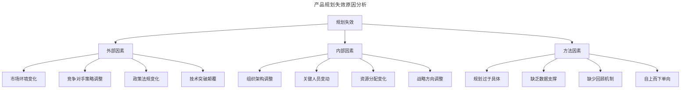

> **图解**：规划失效可归因为外部（市场环境变化、竞争对手策略、政策法规、技术突破）、内部（组织架构调整、人员变动、资源分配、战略调整）和方法三类因素。方法因素是产品经理可以主动改善的领域。

### 2.2 自上而下还是自下而上？

不同的公司有不同的产品规划方式。有的公司自上而下，从最高管理层制定战略开始，分解到各事业群，再向下细化到产品线，最后拆解到每个职能。还有一部分公司由每个具体的组发起，汇总到产品线，不断向上传递，最终形成公司战略。

| 维度 | 自上而下 | 自下而上 |
|------|----------|----------|
| 优势 | 利于资源战略安排和协调；方便战略沟通传递 | 给团队更多发挥空间；激发主观能动性 |
| 劣势 | 一线判断难融入战略；可能错失机会 | 缺乏一致性；协调困难；各自为战 |
| 适用场景 | 成熟产品线、复杂组织 | 早期产品、创新团队 |
| 典型代表 | 传统大企业、国企 | 创业公司、创新实验室 |

**上下结合的规划模式**——从两种方式的利弊中，可以看到产品规划的两个重要目的：① 针对产品愿景和公司战略进行自上而下的沟通，让每个人清楚组织接下来一段时间的方向和重心；② 激发大家的积极性和能动性，给前线"可以听到炮声"的员工足够的话语和决策空间。

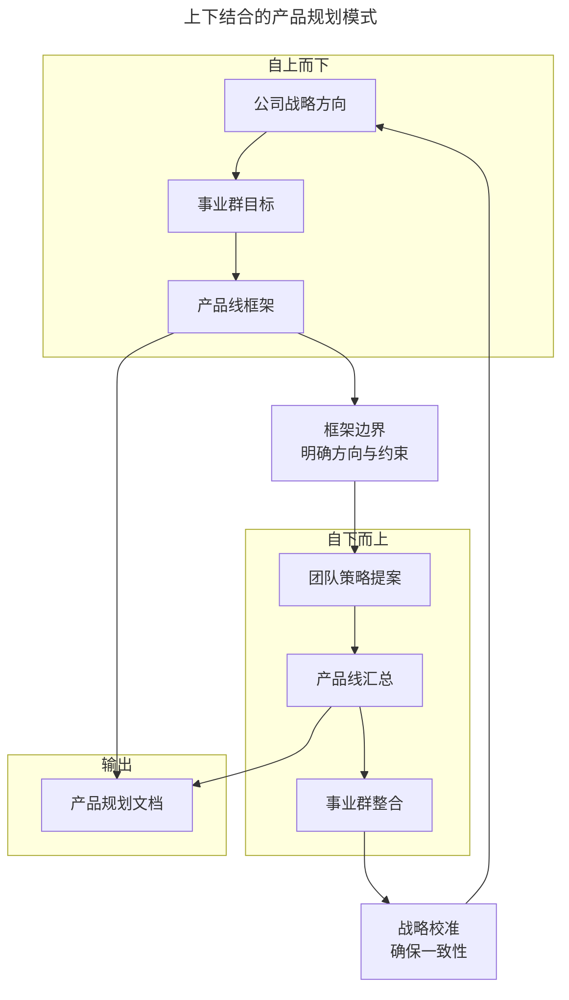

> **图解**：上下结合的产品规划模式——自上而下提供方向和框架（公司战略→事业群目标→产品线框架），自下而上填充策略和细节（团队策略→产品线汇总→事业群整合），两者通过"框架边界"和"战略校准"形成闭环，汇入产品规划文档。

**实践案例**——比如某个面向 C 类市场的产品，公司管理层认为用户增量红利基本没有了，所以公司决定接下来集中资源改进和完善用户体验，重心不再放在增加用户量上。在这样的方向和战略下，服务部门可能会确定关注服务质量而非服务数量的规划框架。至此，自上而下结束，自下而上开始。假设我是做支付的产品经理，基于用户体验的大方向，我可能会提出"支持更多的支付手段"或"提高用户交易安全性"等具体规划。在类似过程中，我们能清楚知道公司接下来的业务重心和希望达成的目标，同时又有自由的决策和发挥空间。

当然，具体问题具体分析。公司的阶段、规模和迭代速度不同，都会大大影响产品规划的方式和粒度。比如在产品非常早期的阶段，并不建议做太多规划；对于复杂组织架构和成熟产品线，可能只选择自上而下的规划方式等。总之在做规划时要灵活，选择适合自己的流程。

### 2.3 OKR 框架下的产品规划

OKR（Objectives and Key Results）框架在 2010 年后被 Google、LinkedIn 等公司广泛采用，到 2020 年代已成为产品规划的主流工具。OKR 天然适合"上下结合"的规划模式：

| OKR层级 | 对应规划层级 | 示例 |
|---------|-------------|------|
| 公司O | 公司战略方向 | "成为用户体验最好的支付平台" |
| 部门O | 事业群目标 | "提升支付成功率至99.5%" |
| 团队O | 产品线框架 | "降低支付失败率" |
| 个人O | 具体策略 | "优化3种主流支付渠道的异常处理" |

**OKR 规划的优势与局限**——优势：聚焦（OKR 限制目标数量通常 3-5 个，强制优先级排序）；可衡量（Key Results 必须可量化）；透明（全员可见，减少信息不对称）；敏捷（季度为周期，快速调整）。局限：短视风险（季度 OKR 可能导致团队忽视长期目标）；量化陷阱（不是所有重要目标都能量化）；对齐成本（跨团队 OKR 对齐需要大量沟通）；形式主义（可能沦为填表游戏）。

**OKR 规划的实践要点**：

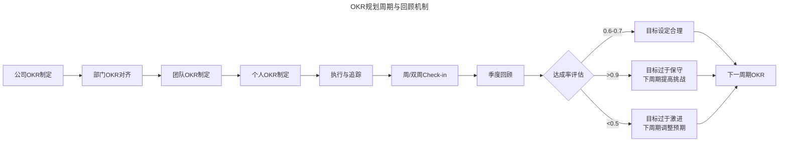

> **图解**：OKR 以季度为周期，通过周 Check-in 和季度回顾实现持续对齐和调整。0.6-0.7 的达成率被认为是"恰到好处"的挑战水平。

### 2.4 Discovery & Delivery 双轨敏捷

传统产品规划面临一个根本矛盾：规划需要确定性，但产品开发充满不确定性。Discovery & Delivery 双轨敏捷模式（由 Marty Cagan 在《Inspired》中系统阐述）为解决这一矛盾提供了框架。

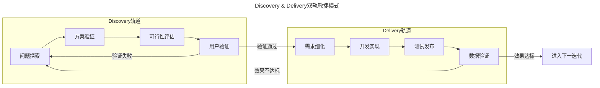

> **图解**：Discovery 轨道负责"做正确的事"（验证问题与方案），Delivery 轨道负责"正确地做事"（高效实现与交付）。两条轨道并行运行，Discovery 为 Delivery 提供经过验证的输入。

**双轨敏捷对产品规划的影响**：

| 传统规划 | 双轨敏捷规划 |
|----------|-------------|
| 规划=功能列表+时间线 | 规划=问题假设+验证计划 |
| 先规划再执行 | Discovery与Delivery并行 |
| 功能是否按时交付 | 问题是否被有效解决 |
| 年度/季度固定规划 | 滚动规划，持续调整 |
| PM写PRD→开发实现 | PM验证假设→开发实现已验证方案 |

**实践案例**——某支付产品在规划"提升用户体验"目标时：Discovery 阶段（假设支付失败是核心问题；验证发现 15% 用户在支付环节流失，其中 60% 因超时；方案优化支付超时处理机制；5 名用户测试确认有效）；Delivery 阶段（细化需求设计超时重试和智能路由切换；2 周 Sprint 完成；数据验证支付成功率从 98.5% 提升至 99.3%）。

---

## 3. 关键流程

### 3.1 数据驱动规划

传统产品规划主要依赖经验判断，现代产品规划越来越依赖数据驱动。数据驱动不是替代判断，而是为判断提供更可靠的依据。

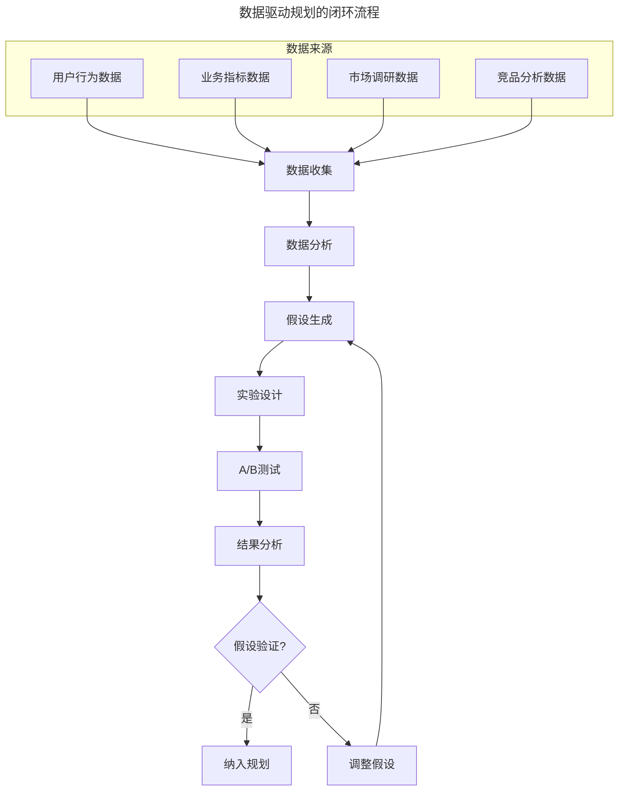

> **图解**：数据驱动规划是"收集-分析-假设-实验-验证"的闭环，A/B 测试是验证假设的关键手段。数据来源包括用户行为、业务指标、市场调研、竞品分析。

**A/B 测试调整规划的实践**——A/B 测试不仅用于优化功能，也可以用于调整规划方向。某内容社区在规划"提高内容生产能力"目标时，通过 A/B 测试发现：降低发布门槛（发布量+30%，质量-15%，需配合质量把控机制）；激励优质内容（发布量+5%，质量+25%，优先纳入规划）；社区运营引导（发布量+20%，质量+10%，作为辅助策略）。基于测试结果，规划调整为：优先实施"激励优质内容"策略，辅以"社区运营引导"，暂缓"降低发布门槛"。

**数据驱动规划的局限**——数据滞后（数据反映过去，规划面向未来）；相关性 ≠ 因果性；创新难量化（颠覆性创新在数据上往往"不成立"）；局部最优；幸存者偏差。

### 3.2 产品规划不等于功能发布计划

很多产品规划文档由若干项目的简述和预计发布计划构成。这样的发布计划很重要，但不能算是好的产品规划——它相当于跳过了"为什么"和"怎么做"，直接描述"做什么"和"什么时候做"。

**好的产品规划应该从更宏观的视角和判断入手，尽量避免过分关注具体的项目和特性列表。**

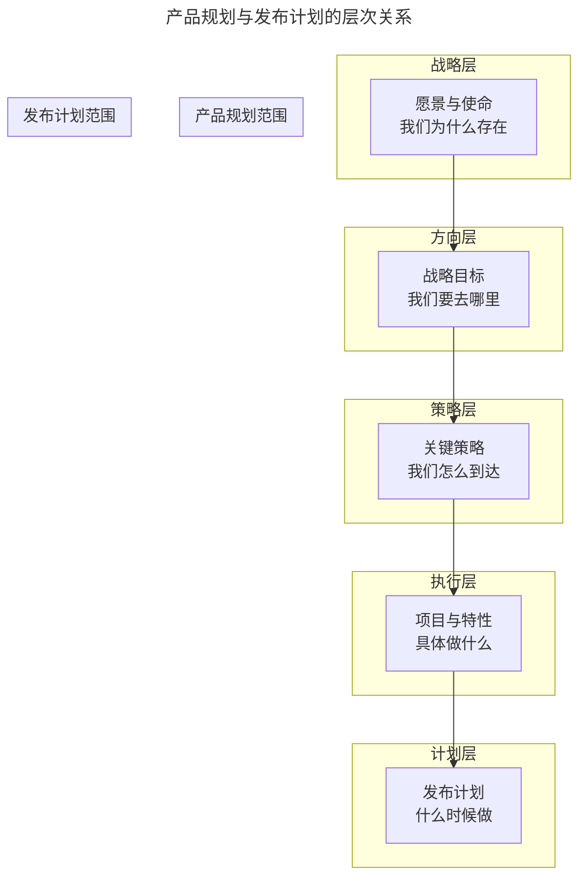

> **图解**：产品规划聚焦战略层、方向层和策略层，发布计划聚焦执行层和计划层。好的规划从上层出发，向下指导而非跳过中间层。

**实践案例**——之前做某条社区产品线时，我们分析认为当时短板在于内容生产不足，于是决定接下来先投入力量提高整个社区的内容生产能力，下一步再提高内容分发与消费的效率，然后再关注社区用户的互动氛围。在此基础上，下一件事情是明确检验每件事情是否做到的标准，比如通过监测新发帖子数量来判断社区的内容生产能力是否有所提高。至于具体的"做什么项目来提高内容生产"，则是更进一步的具体实施阶段才需要关注的事情。

**关于承诺的建议**——有人会说："既然大家都知道不靠谱，我随便说一个到时候再调整是不是就可以了？"我的建议是：万万不可，宁可不给承诺，也不要承诺了却交付不了。前者别人最多说你怂，后者可是会丧失信任的。信任是产品经理的身家性命，一定要想办法守好。

我的经验是尽量打个提前量，提前进行战略的沟通和团队群策群力的讨论，在此基础上做一些笼统的项目规划，具体的特性能多模糊就多模糊，交付时间范围能多大就多大。比如产品规划是增加用户支付手段，不要去规划类似"支持微信、支付宝和银联支付，11月20日前上线"这样的项目，写成"支持3种以上主流支付方式，在11月下旬至12月上旬完成"更好。

---

## 4. 工具与实战

### 4.1 产品规划的留白

**空间留白：从"怎么做"到"该做什么"**——Ruby on Rails 的创始人 DHH 曾说，当你面前有艰巨而冗长的任务队列等待实施时，你的创造力将会被严重抑制。具体任务如何抑制创造力：如果规划文档中的项目任务是"支持 VISA 和 MasterCard 信用卡支付，12月30日之前发布"，我们脑子里想的一定是先去查接口文档、申请资质，以及整体的技术架构和页面流程。但我们其实更需要知道的是这个项目背后的动机。当我们关注这些动机和目标时，思考会上升一个维度，从研究"怎么做"转向"该做什么"。

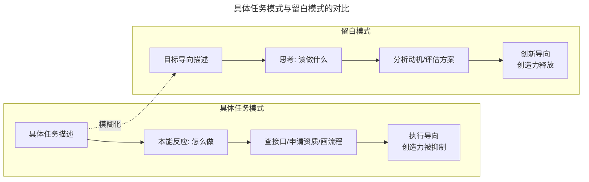

> **图解**：具体任务描述触发"怎么做"的执行思维，留白的目标描述触发"该做什么"的创新思维。模糊化是从前者向后者的关键转换手段。

**时间留白：精确的代价**——关于时间的留白，其实就是指尽量别把时间点定得太精确。精确必须以具体为代价，而提前规划出来的具体十有八九都不靠谱。

| 规划周期 | 建议时间精度 | 示例 | 适用场景 |
|----------|-------------|------|----------|
| 年度规划 | 季度级别 | "Q2完成" | 战略级目标 |
| 季度规划 | 月度级别 | "5月完成" | 策略级目标 |
| 月度规划 | 周级别 | "第3周完成" | 执行级任务 |
| Sprint规划 | 天级别 | "周三前完成" | 具体开发任务 |

原则是：**规划越远，时间越模糊；规划越近，时间越精确。**

**留白的边界**——留白不等于空白：留白 ≠ 不规划（方向和目标必须明确）；留白 ≠ 逃避责任（对目标的承诺不变）；留白 ≠ 含糊其辞（用目标语言替代任务语言，不是用模糊语言替代清晰语言）；留白需要信任基础。

### 4.2 定期回顾和更新产品规划

**回顾的目的：防止破窗效应**——产品规划的作用不是一次性释放的，在实际业务进展过程中，应当不时地把产品规划拿出来回顾和更新。回顾产品规划的目的是经常性地帮助团队换换脑子。产品规划也有破窗效应——一旦其中有一条失败了却没有被拿出来严肃地讨论更新，就会让大家觉得整个规划是否能实现无所谓，规划也就彻底流于形式了。

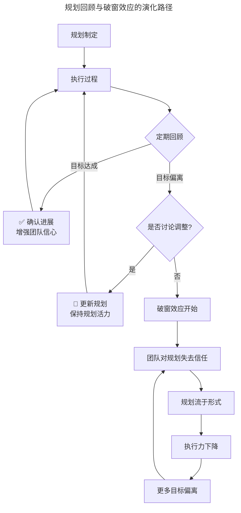

> **图解**：定期回顾是防止破窗效应的关键。一旦目标偏离却未讨论调整，就会触发破窗效应的恶性循环（失去信任→流于形式→执行力下降→更多偏离），最终导致规划完全失效。

**回顾的频率与方法**——一般季度规划两周回顾一次，年度规划一个月回顾一次就差不多了。回顾会议议程建议：数据同步（15min，关键指标变化）；进展回顾（20min，各项目进展与阻塞）；策略讨论（30min，哪些策略有效/无效）；环境变化（15min，市场/竞品/组织变化）；行动确认（10min，下一步行动项）。

**OKR 作为回顾框架**：

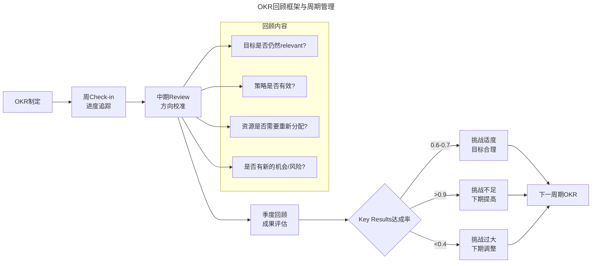

> **图解**：OKR 通过周 Check-in、中期 Review 和季度回顾形成三级回顾机制，确保规划持续对齐和调整。0.6-0.7 的达成率是"恰到好处"的挑战水平。OKR 回顾的关键问题：Objective 是否仍然 relevant？Key Results 的达成路径是否有效？资源是否需要重新分配？是否有新的机会或风险？

### 4.3 产品规划到项目交付的节奏感

产品规划是一张蓝图，它的作用在于为具体的项目实施确定路线图和方案，所以最后还是要靠做出来实打实的特性和功能才能产生价值。产品迭代也需要节奏——团队要能大概判断多久会有一次项目发布、多久会有一次重构升级、多久会有界面更新等。

**英特尔的节奏模型：从 Tick-Tock 到 P-A-O**——芯片制造品牌英特尔的产品迭代策略有个有趣的名字叫 Tick-Tock，就是钟表摆动的滴答声。它表示英特尔会以两年为周期，第一年提升工艺（Tick），第二年更新架构（Tock）。由于工艺发展遇到瓶颈，英特尔在 2016 年将 Tick-Tock 两年周期改为 Process-Architecture-Optimization（P-A-O）三年周期。

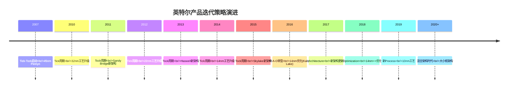

> **图解**：Tick-Tock 是两年周期（工艺-架构），P-A-O 是三年周期（工艺-架构-优化）。当技术发展遇到瓶颈时，节奏需要调整——这对产品迭代节奏有重要启示。

**P-A-O 三年周期详解**：

| 阶段 | 代号 | 核心任务 | 产品映射 |
|------|------|----------|----------|
| 第一年 | Process（工艺） | 制程工艺升级 | 技术基础设施升级、性能优化 |
| 第二年 | Architecture（架构） | 全新微架构设计 | 产品架构重构、核心功能创新 |
| 第三年 | Optimization（优化） | 工艺和架构的优化组合 | 体验打磨、效率提升、Bug修复 |

**产品迭代的节奏模型**：

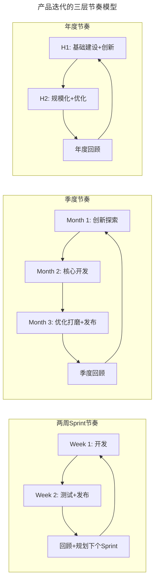

> **图解**：Sprint 节奏（2 周）保证持续交付，季度节奏（3 月）保证创新与优化的平衡，年度节奏（半年）保证战略落地与调整。三层节奏嵌套运行，形成稳定的律动。

### 4.4 阶段性专注

**每个阶段聚焦一件事**——在每个阶段都要专注，尤其在战略思考已经明确的情况下，尽量在每个阶段聚焦做一件事情，不要做着东还惦记着西。比如决定在当前阶段针对老用户全面提高留存，那就尽可能不去做拉新的事情。现实中，专注很难做到。常见的干扰包括：老板的临时需求、竞品的动态、用户的噪音、团队的焦虑。

**Speed vs Quality 框架**——在阶段性专注中，需要权衡速度与质量。Speed vs Quality 框架提供了决策工具：

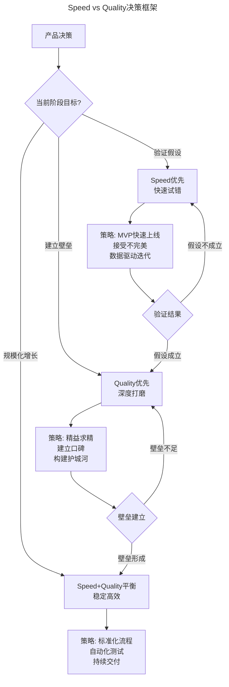

> **图解**：不同阶段对速度和质量的要求不同。验证假设阶段 Speed 优先，建立壁垒阶段 Quality 优先，规模化阶段两者平衡。阶段之间形成自然的迭代循环。

**Lean Startup 与节奏把控**——Eric Ries 的 Lean Startup 方法论为节奏把控提供了系统框架：

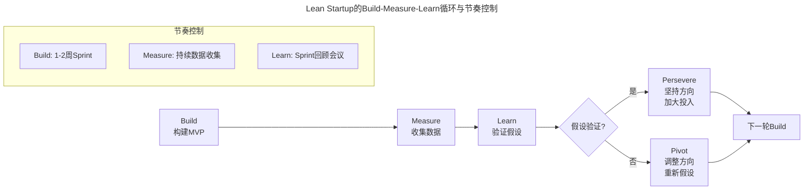

> **图解**：Build-Measure-Learn 是 Lean Startup 的核心循环。关键在于加速这个循环——循环越快，学习越快，产品越容易找到正确方向。Persevere 是坚持方向加大投入，Pivot 是调整方向重新假设。

**Lean Startup 对节奏的启示**——快速实验（用最小成本验证假设，Sprint 周期要短）；数据驱动（用数据而非直觉决策，Measure 环节不可省略）；持续学习（每个循环都要有学习产出，回顾会议必须认真执行）；敢于 Pivot（方向错误时果断调整，规划要有调整空间）；避免虚荣指标（关注真实价值而非表面数据）。

**规划时谨慎，执行时凶悍**——战略上有决议之后，执行要尽可能凶悍，不要绣花，该低头拉车的时候就低头拉车。规划方向时要谨慎，尽可能想周全想清楚；可一旦落定，就应该坚决、激进，不要完美主义，接受 80 分，边做边迭代，快速调整，这样才是优秀的节奏和状态。

| 阶段 | 节奏特征 | 心态 | 关键词 |
|------|----------|------|--------|
| 规划阶段 | 慢、谨慎、周全 | 开放、质疑、探索 | 想清楚 |
| 执行阶段 | 快、坚决、激进 | 专注、果断、行动 | 做出来 |
| 回顾阶段 | 中速、客观、反思 | 冷静、诚实、学习 | 看明白 |

### 4.5 AI 时代产品节奏的新特征

**AI 加速迭代节奏**——AI 工具正在改变产品迭代的节奏：需求分析从 1-2 周缩短到 AI 辅助 1-3 天；设计从 1-2 周缩短到 2-5 天；开发从 2-4 周缩短到 AI 辅助编码 1-2 周；测试从 1-2 周缩短到 AI 自动化测试 3-5 天；数据分析从 1 周缩短到 AI 实时分析 1 天。

**AI 时代的节奏陷阱**——速度陷阱（执行快不等于方向对，AI 加速可能让团队更快地走向错误方向）；质量陷阱（AI 生成的内容需要人工审核，省下的时间可能被审核消耗）；创新陷阱（过度依赖 AI 可能导致思维同质化）；节奏失控（各环节加速后，整体节奏可能失衡）。

**AI 时代的节奏建议**：

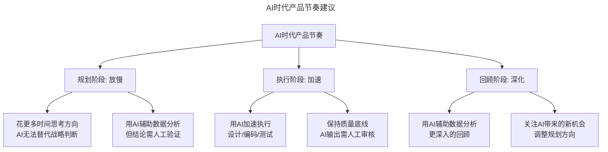

> **图解**：AI 时代的产品节奏应该是"规划放慢、执行加速、回顾深化"。AI 加速了执行环节，但规划和回顾环节反而需要更多时间，因为方向比速度更重要。

### 4.6 方法论框架：留白与节奏

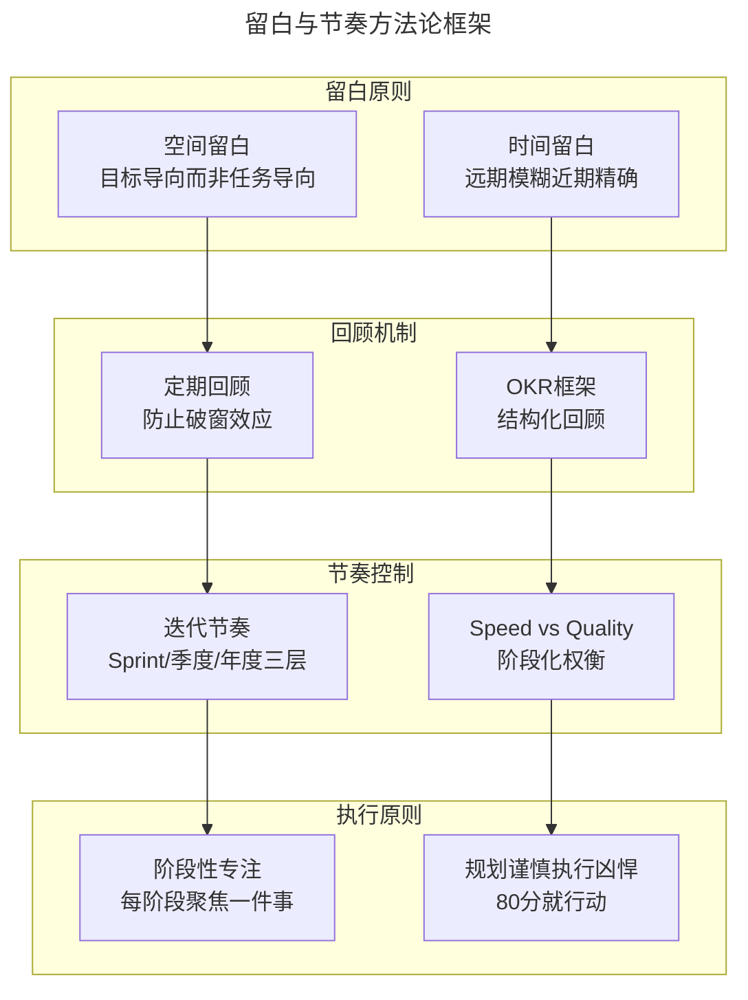

> **图解**：留白原则、回顾机制、节奏控制和执行原则四个维度构成完整的方法论体系。留白为回顾提供空间，回顾为节奏提供校准，节奏为执行提供框架。

### 4.7 实战要点

| 要点 | 说明 | 适用场景 |
|------|------|----------|
| 规划过程重于文档 | 规划的价值在于思考过程而非最终文档 | 所有规划场景 |
| 上下结合 | 自上而下定方向，自下而上填策略 | 中大型团队规划 |
| OKR量化目标 | 用OKR让规划目标可衡量、可追踪 | 季度/年度规划 |
| 双轨敏捷 | Discovery验证假设，Delivery高效交付 | 产品迭代规划 |
| 数据驱动 | 用数据验证假设，而非纯经验判断 | 策略选择与优先级排序 |
| 规划≠发布计划 | 聚焦"为什么"和"做什么" | 规划文档撰写 |
| 模糊化承诺 | 宁可不承诺，也不要承诺做不到的事 | 项目时间规划 |
| 空间留白 | 用目标语言替代任务语言，释放创造力 | 规划文档撰写 |
| 时间留白 | 远期模糊近期精确，为变化预留缓冲 | 项目时间规划 |
| 防止破窗效应 | 目标偏离时及时讨论调整 | 规划回顾会议 |
| 迭代节奏感 | 建立Sprint/季度/年度三层节奏 | 团队流程建设 |
| 阶段性专注 | 每个阶段聚焦一件事 | 战略执行阶段 |
| Speed vs Quality | 根据阶段目标权衡速度与质量 | 阶段策略制定 |
| Lean Startup | Build-Measure-Learn快速循环 | 产品验证阶段 |
| 规划谨慎执行凶悍 | 规划时想清楚，执行时坚决果断 | 所有执行阶段 |
| AI加速执行 | 用AI加速执行环节，但规划和回顾需放慢 | AI工具应用 |

---

## 5. 常见误区

### 5.1 产品规划误区

| 误区 | 表现 | 正确做法 |
|------|------|---------|
| **规划=功能发布计划** | 规划文档由项目简述和发布计划构成 | 聚焦"为什么"和"做什么"，从宏观视角入手 |
| **规划过于具体** | 项目内容和发布时间写得太精确 | 规划越远越模糊，时间留白 |
| **自上而下单向** | 一线判断无法融入战略 | 上下结合，先自上而下定方向再自下而上填策略 |
| **规划一次成型** | 规划做完就束之高阁 | 定期回顾，防止破窗效应 |
| **承诺做不到的事** | 为了表现随便承诺 | 宁可不承诺，也不要承诺了却交付不了 |
| **执行不凶悍** | 规划定下来还反复改方向 | 规划时谨慎，执行时凶悍 |

### 5.2 留白与节奏误区

| 误区 | 表现 | 正确做法 |
|------|------|---------|
| **留白=不规划** | 留白导致方向和目标都不明确 | 方向和目标必须明确，留的是实现路径和时间 |
| **留白=含糊其辞** | 用模糊语言替代清晰语言 | 用目标语言替代任务语言，不是模糊语言 |
| **忽视破窗效应** | 目标偏离却不讨论调整 | 定期回顾，及时更新规划 |
| **节奏混乱** | 发布频率忽快忽慢 | 建立 Sprint/季度/年度三层节奏 |
| **不专注** | 每阶段同时做多件事 | 阶段性专注，每阶段聚焦一件事 |

---

## 6. 进阶延展

### 6.1 AI 辅助产品规划

AI 工具正在改变产品规划的实践方式：

| 应用场景 | AI辅助方式 | 代表工具 | 注意事项 |
|----------|------------|----------|----------|
| 数据分析 | 自动分析用户行为数据 | Amplitude AI、Mixpanel | 需人工验证结论 |
| 竞品监测 | 自动追踪竞品动态 | SimilarWeb、Sensor Tower | 数据可能滞后 |
| 趋势预测 | 基于历史数据预测趋势 | 各种BI工具的AI模块 | 预测≠事实 |
| 文档生成 | 辅助生成规划文档 | ChatGPT、Notion AI | 需深度人工审核 |
| 优先级排序 | 辅助评估需求优先级 | Productboard、Aha! | 框架仍需人工设定 |

**AI 辅助规划的边界**——AI 可以辅助规划，但不能替代规划：AI 擅长数据处理、模式识别、信息汇总；AI 不擅长战略判断、价值取舍、团队激励；产品经理的核心价值是在不确定性中做出判断，在模糊中找到方向。

### 6.2 方法论框架：现代产品规划

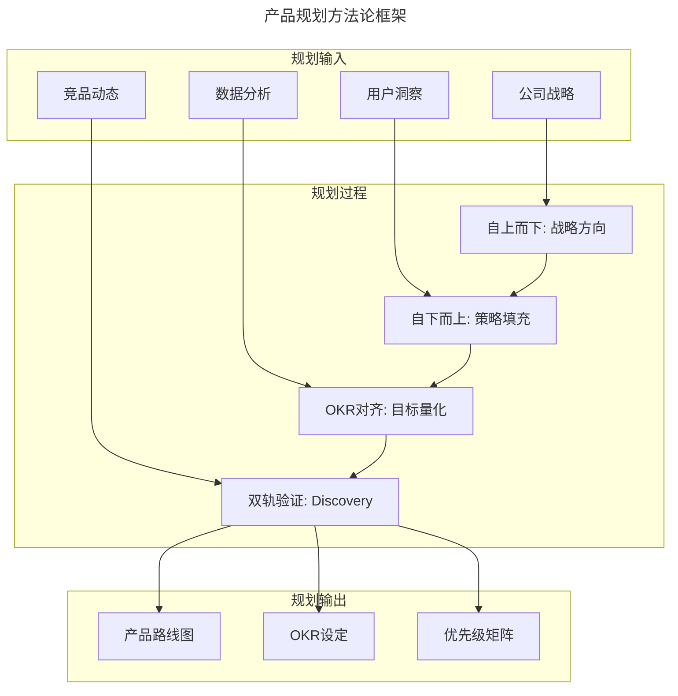

> **图解**：现代产品规划是"战略输入→上下结合→OKR 量化→双轨验证→路线图输出"的完整流程，每个环节都有对应的工具和方法支撑。

### 6.3 延伸阅读

1. 《Inspired》- Marty Cagan：双轨敏捷与产品规划的现代实践
2. 《Measure What Matters》- John Doerr：OKR 框架的系统阐述
3. 《Lean Analytics》- Alistair Croll：数据驱动产品决策的方法论
4. 《产品规划实战》- Roman Pichler：产品路线图与规划敏捷化
5. 《The Lean Startup》- Eric Ries：Build-Measure-Learn 循环与 Pivot 决策
6. 《Sprint》- Jake Knapp：Google Ventures 设计冲刺方法
7. 《AI时代的Product Management》- Product School 2024：AI 辅助产品管理实践
8. 《Speed vs Quality: Product Decisions》- Reforge 2024：速度与质量的阶段化权衡框架
