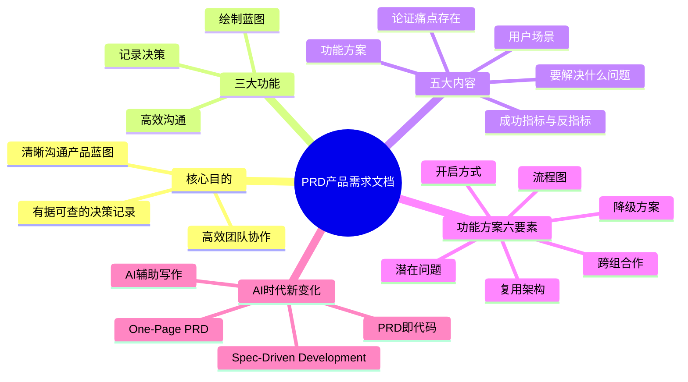
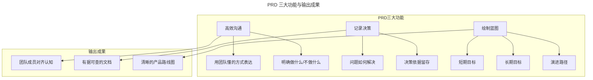
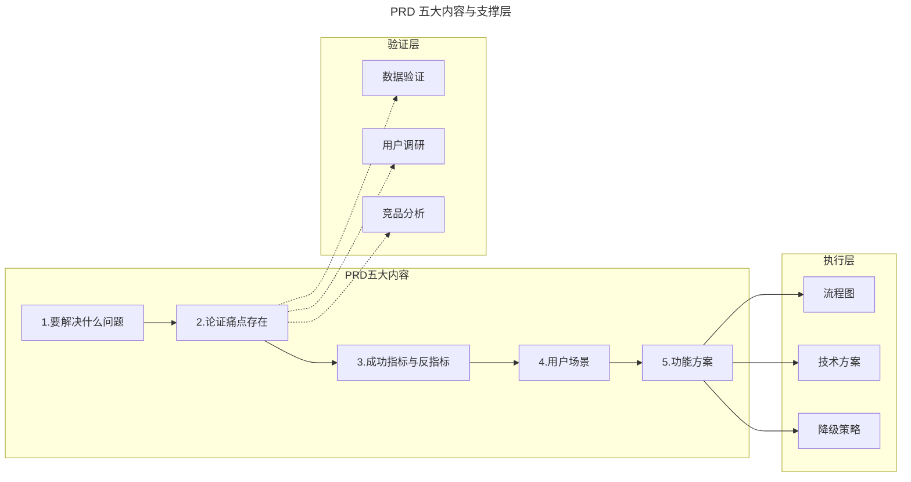
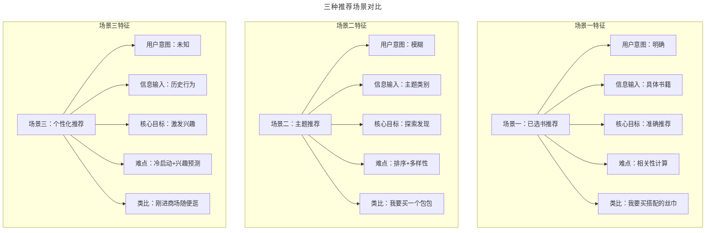
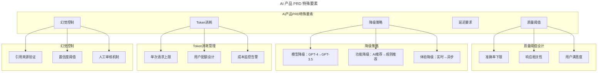
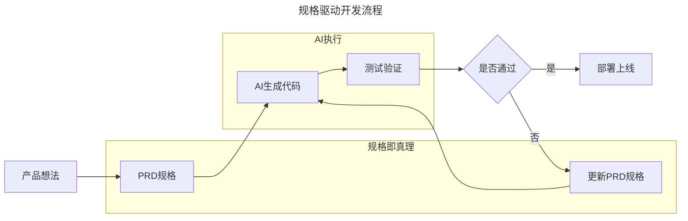
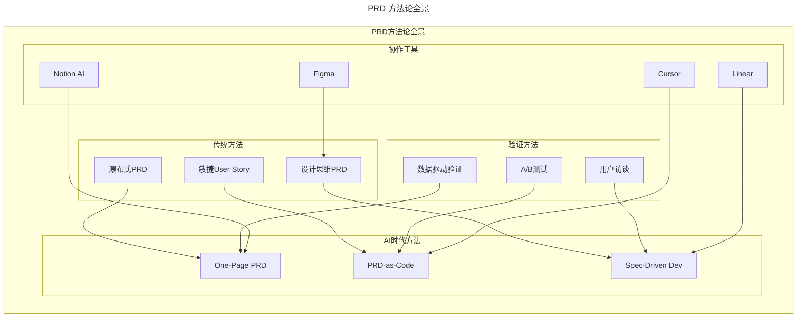

# 13 | 如何撰写产品需求文档？

> **适用范围**：产品经理（入门到资深各阶段）、产品负责人、需要撰写 PRD 的团队成员。适用于 PRD 撰写、需求沟通、AI 时代 PRD 新范式应用等场景。
>
> **更新摘要（v2 · 2026-08 更新）**：
> - 结构化升级为 6 节骨架（导言 / 核心方法论 / 关键流程 / 工具与实战 / 常见误区 / 进阶延展）
> - 保留 PRD 五大内容、功能方案六要素与 AI 时代 PRD 新范式
> - 保留全部 Mermaid 图并补充 `--- title: ... ---` frontmatter，每张图后追加文字解读

---

## 1. 导言

很多产品经理给人的印象就是每天开会，开完会就趴在桌子上写产品需求文档。有的产品经理花好几个星期写的一份产品需求文档，工程师没看完就扔一边了；有的产品经理的产品需求文档非常精确，工程师照着文档一行一行写代码就可以了。

硅谷的很多产品经理不喜欢把大量时间花在写产品需求文档上，认为应该直接和工程师、设计师面对面沟通，当面讲清楚。这样做的好处是决策速度快；缺点是如果团队成员还不具备自己做一些小决定的能力，或者公司对基本 UI 部件没有固定标准，可能出现功能不协调的问题，尤其是一个成员辞职后，整个产品组需要花很长时间填补空缺。

**所以，我们还是要写产品需求文档，只不过在产品需求文档中只写清楚最最重要的内容就可以了。** 这篇文章更重要的目的是带给你一个新的思考方式。

> **图解**：PRD 概念全景——核心目的是清晰沟通产品蓝图、高效团队协作、有据可查的决策记录；包含三大功能、五大内容、功能方案六要素，并在 AI 时代演进出一系列新范式。

---

## 2. 核心方法论

### 2.1 明确产品需求文档的目的

撰写产品需求文档是为了和工程师、设计师、数据科学家等团队成员清晰地沟通产品蓝图，讲清楚产品要解决的问题、实现的场景、成功的标准等，并有据可查。

> **图解**：PRD 三大功能——高效沟通（用团队懂的方式表达、明确做什么/不做什么）、记录决策（问题如何解决、决策依据留存）、绘制蓝图（短期/长期目标、演进路径），分别产出团队成员对齐认知、有据可查的文档、清晰的产品路线图。

### 2.2 产品需求文档的核心结构：五大内容

> **图解**：PRD 五大内容呈递进关系——要解决什么问题→论证痛点存在→成功指标与反指标→用户场景→功能方案。痛点论证依赖数据验证、用户调研、竞品分析，功能方案落到流程图、技术方案、降级策略。

---

## 3. 关键流程

### 3.1 第一：要解决什么问题

工程师、设计师等对产品解决的问题都有自己的理解，而且根本不在一个频道，这在产品经理的工作中非常常见。

**案例**：要在直播上增加给主播唱歌打分的功能，工程师认为是为了让主播提高唱歌水平，设计师却认为是让粉丝在主播换歌空当不感到无聊，按这个思路设计的产品必然不成功。问题出在产品经理没在 PRD 中讲清楚到底要解决的问题是什么。

**豆瓣图书推荐案例**：如果要添加图书推荐功能，我会先讲清楚这个功能要解决的问题——用户已经可以通过豆瓣浏览评价高的图书、通过豆列找感兴趣的书，新的图书推荐功能是进一步解决用户渴望通过个性化方式、找到自己感兴趣且评分比较高的书。

### 3.2 第二：论证痛点问题是否真实存在

在很多工程师眼中，产品经理只会吹牛、空谈，确实有不少产品经理随便写出用户痛点，而没有验证过这些痛点到底存不存在。

**豆瓣案例验证**：如何验证用户是真的有寻找读书建议的需求？可以通过数据验证——如果发现 35% 的豆瓣用户已经习惯通过豆瓣找书阅读，特别是通过豆瓣探索新书，那上一步提出的问题就是真实存在的。

### 3.3 第三：写清楚成功指标和反指标

**豆瓣图书推荐的成功指标**：通过这个功能用户在豆瓣下载或购买图书的次数。如果使用功能用户多、频率高，说明功能有人用；如果用户通过推荐找到书后下载或购买次数增加，说明功能对豆瓣有好处。

**反指标**：增加功能后用户使用其他豆瓣产品的频率。如果因图书推荐功能导致豆瓣其他产品（电影、电视剧等）的用户数量和使用频率降低，那这个功能对豆瓣整体是否有好处就有待研究。**如果一项新功能的成绩会挤占原有产品的成绩，这叫做侵蚀效应（Cannibalization）。**

### 3.4 第四：讲清楚用户场景

> **图解**：三种推荐场景特征对比——已选书推荐（用户意图明确、需准确推荐、类比"买搭配的丝巾"）、主题推荐（意图模糊、需探索发现、类比"买一个包包"）、个性化推荐（意图未知、需激发兴趣、类比"刚进商场随便逛"），不同场景对推荐算法的要求差异很大。

### 3.5 第五：解释清楚产品功能方案

功能方案一般包含六个方面：

1. **如何开启这个功能**。
2. **功能流程图**：最重要的部分，针对每种场景画流程图。
3. **复用已有架构**：哪些部分可以使用已有架构或产品流，大大节约开发时间。比如豆瓣已存在电影推荐和音乐推荐功能，图书推荐列表可以参照以前的产品流。
4. **跨组合作**：涉及和其他组合作时，先和其他部门沟通好。如和其他组功能在 UI 上有冲突，需在 PRD 中记录。
5. **降级方案**：功能无法达到预期效果时的解决方案。如用户没有任何图书浏览记录，无法提供个性化推荐时，要么随便推荐一堆书，要么直接导入畅销书单。
6. **潜在问题**：事先没想清楚的地方都可能会出现问题。如推荐系统经常出现重复推荐现象——不同出版社的同一本书，或同一本书的 2014 年版、2015 年修订版。需找到去掉重复书名的方式。

> **案例**：如《爱的教育》这本书有无数个版本（宝宝版、小学必读版、精编版、简化版），如果销量或评论数是推荐系统的重要指标，所有版本加起来有 1 万条评论，但系统默认是不同的书，导致每个版本的几百个评论在畅销排名都很低，这本书压根儿不会出现在书单上。

---

## 4. 工具与实战

### 4.1 AI 时代的 PRD 新范式

**One-Page PRD（极简主义的回归）**：强调将核心信息压缩到一页纸内。核心要素：问题陈述（1-2 句话）、目标用户与场景、成功指标、关键功能点、风险与降级方案。特别适合敏捷开发环境，让团队在 5 分钟内理解产品意图。

**AI 辅助 PRD 写作（2024-2026）**：
- Notion AI：输入产品想法自动生成 PRD 框架，基于历史模板智能补全，自动生成用户故事和验收标准。
- Cursor：AI 编辑器同时修改 PRD 与代码，可在 PRD 旁边直接生成技术方案，帮助文档与实现保持同步。
- PRD 即代码（PRD-as-Code）：使用 Markdown + YAML 格式，版本控制与代码同步，自动化测试与验证，CI/CD 集成。

### 4.2 AI 产品 PRD 特殊模板

> **图解**：AI 产品 PRD 特殊要素——质量阈值（准确率下限、响应相关性、用户满意度）、降级策略（模型/功能/体验降级）、Token 消耗管理（单次上限、用户配额、成本监控）、幻觉控制（引用验证、置信度阈值、人工审核）。

### 4.3 Spec-Driven Development：规格驱动开发

> **图解**：规格驱动开发流程——产品想法→PRD 规格→AI 生成代码→测试验证，测试失败时更新 PRD 规格而非直接改代码。核心理念：PRD 规格是唯一真理来源，规格与代码始终保持同步。

---

## 5. 常见误区

### 5.1 PRD 撰写误区

| 误区 | 表现 | 正确做法 |
|------|------|---------|
| **没讲清解决的问题** | 团队对产品要解决的问题理解不一致 | 明确要解决什么问题，让大家对用户痛点保持一致 |
| **不验证痛点** | 随便写出用户痛点，未验证是否真实存在 | 用数据、调研、竞品分析验证痛点 |
| **无反指标** | 只设成功指标，忽视侵蚀效应 | 设计反指标衡量对整体产品的负面影响 |
| **不考虑潜在问题** | 事先没想清楚数据去重、边界情况 | 提前考虑重复推荐、数据分散等问题 |

### 5.2 两个最易踩的坑

1. **没有论证痛点是否真的存在**，而是想当然认为用户肯定有这个痛点。
2. **没有提前考虑到产品可能出问题、实际执行影响预期功能计划的情况**，导致产品发布时间推后。

---

## 6. 进阶延展

### 6.1 方法论全景图

> **图解**：PRD 方法论全景——传统方法（瀑布式、敏捷 User Story、设计思维）演进到 AI 时代方法（One-Page PRD、PRD-as-Code、Spec-Driven Development），验证方法（数据驱动、A/B 测试、用户访谈）和协作工具（Notion AI、Cursor、Linear、Figma）为各方法提供支撑。

### 6.2 三层深度视角

- **进阶视角（1-3 年）**：结构化思维训练（用固定模板、培养逻辑链条）、场景分析能力（识别 3-5 种核心场景）、指标意识（区分成功指标与反指标）、协作沟通技巧。实践建议：每周至少写 1 份完整 PRD。
- **资深视角（3-5 年）**：产品蓝图规划、复杂场景处理、跨团队协作、风险预判。深度应用 AI 工具（Notion AI 快速生成初稿、Cursor 验证技术可行性）。
- **专家视角（5 年+）**：PRD 标准制定、方法论创新、人才培养、战略决策支持。AI 时代领导力——定义 AI 产品 PRD 新标准、推动团队 AI 工具采纳、平衡 AI 效率与人工判断。

### 6.3 延伸阅读

- 《启示录：打造用户喜爱的产品》- Marty Cagan
- 《用户故事与敏捷方法》- Mike Cohn
- "The Lean Product Playbook" - Dan Olsen
- "The Art of the One-Pager" - Product Hunt
- "Writing PRDs in the Age of AI" - Lenny's Newsletter
- "Spec-Driven Development with AI" - Cursor Blog
