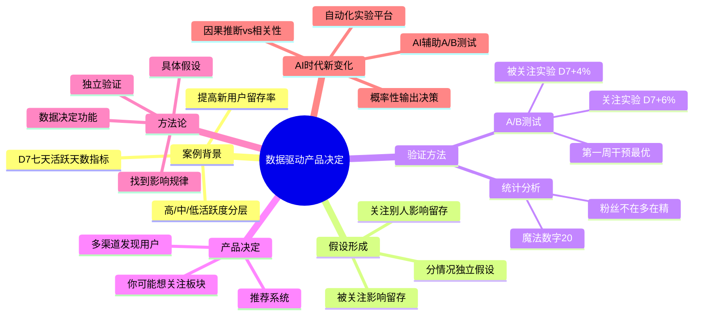
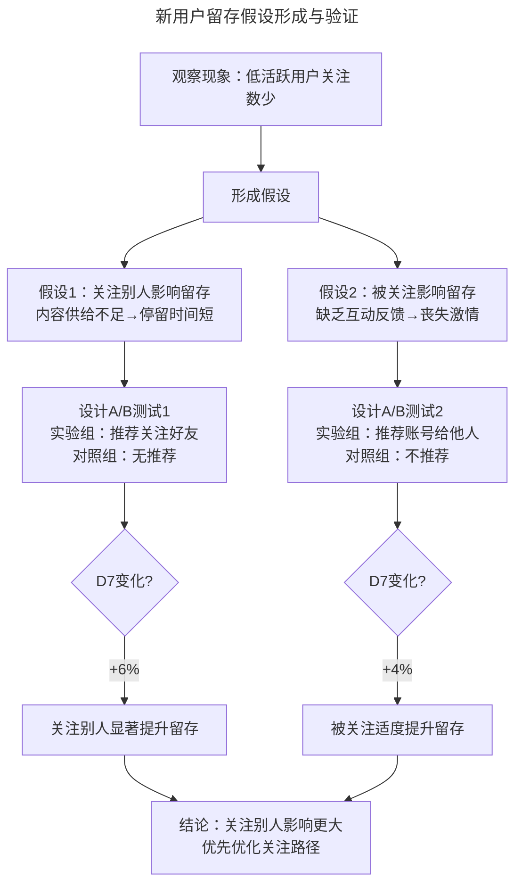
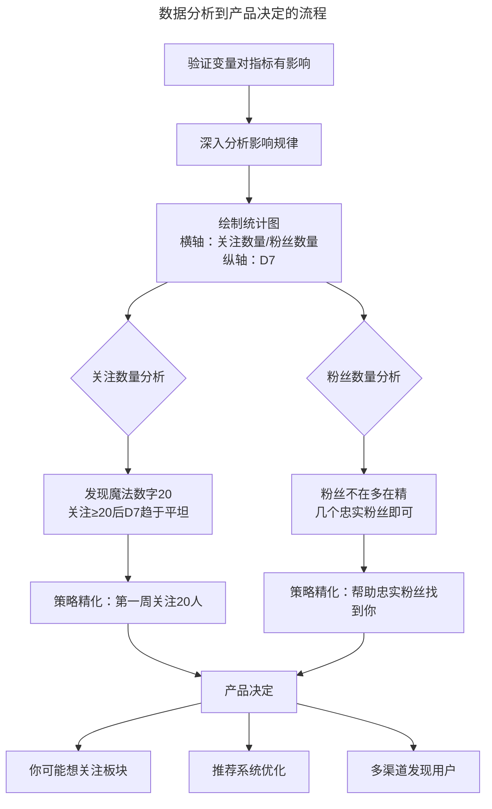
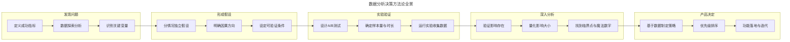

# 14 | 如何用数据做出产品决定？

> **适用范围**：产品经理（各阶段）、需要用数据驱动决策的管理者、AI 产品经理。适用于数据分析、假设验证、A/B 测试、魔法数字发现、AI 时代数据决策等场景。
>
> **更新摘要（v2 · 2026-08 更新）**：
> - 结构化升级为 6 节骨架（导言 / 核心方法论 / 关键流程 / 工具与实战 / 常见误区 / 进阶延展）
> - 保留新用户留存 D7 案例、假设形成、A/B 测试验证、魔法数字、产品决定
> - 保留全部 Mermaid 图并补充 `--- title: ... ---` frontmatter，每张图后追加文字解读

---

## 1. 导言

今天这篇文章我用一个增长日活数的案例，跟你分享一下如何用数据做出产品决定。

### 1.1 核心导图

> **图解**：数据驱动产品决定——案例背景（提高新用户留存率、D7 指标、活跃度分层）、假设形成（关注别人/被关注影响留存、分情况独立假设）、验证方法（A/B 测试、统计分析、魔法数字）、产品决定（你可能想关注板块、推荐系统）、方法论、AI 时代新变化。

### 1.2 案例背景：通过提高新用户的留存率来提高日活数

我们希望能够把不同活跃程度的用户区分开来，于是就发明了一个指标：**七天活跃天数（D7）**。D7=1，代表用户在过去的 7 天只使用了这个 APP 一天；D7=7，代表用户在过去的 7 天中每天至少使用这个 APP 一次。D7>4 代表高活跃度用户，2<D7<4 代表中等活跃度用户，D7<2 代表低活跃度用户。

通过对已有数据的分析，我们发现很多低活跃度用户并没有关注其他用户，他们的朋友圈根本没有任何内容，只能通过搜索来看内容。因此，我们认为用户关注其他用户的数量会影响到用户留存率，此时我们并不是非常清楚其他因素是否会影响留存率，所以我们可以先假设，关注其他用户对提高用户留存率非常重要。

---

## 2. 核心方法论

### 2.1 形成假设

**第一个问题是，影响用户留存率的原因是什么。** 这个问题需要考虑以下两种情况：
- **第一种假设**是，用户没有关注其他用户（或关注的数量非常少），他们的朋友圈里没有足够的内容，因此在 APP 里停留的时间也就非常短。
- **第二种假设**是，用户没有被其他用户关注（或关注他的人非常少），他们的朋友圈虽然有内容，但是他们自己发出内容时很少会有人回复，久而久之丧失了对 APP 的激情。

我们假设这两种情况都会影响用户的留存率，但是影响留存率的原因并不一样。所以我们需要弄清楚，哪种情况发生的频率更高、对用户留存率的影响最大、应该先优化哪部分。

**第二个问题是，用户的关注数量到底会不会影响留存率。** 当用户关注 100 个人、1000 人和只关注 1 个人时，对留存率的影响是同一个级别的吗？用户自己的粉丝数量会不会影响留存率？

**形成假设时要避免的坑**是，切记要分情况考虑。不能简单地归类为增加关注数，而是要考虑清楚增加关注数其实影响了两类人，一类是关注别人的人，一类是被关注的人，这两种情况很有可能带来的结果完全不一样，所以要分开考虑、分开假设。

> **图解**：新用户留存假设形成与验证——观察现象（低活跃用户关注数少）→形成假设（关注别人影响留存、被关注影响留存）→设计两组独立 A/B 测试→关注实验 D7+6%、被关注实验 D7+4%→结论关注别人影响更大，优先优化关注路径。

---

## 3. 关键流程

### 3.1 解决问题：A/B 测试与统计分析

**第一个问题，影响用户留存率的原因是什么，我们通过 A/B 测试的方式来解决。** 我们需要设计两组独立的实验来区分关注和被关注对用户留存率的影响。

- **关注其他用户与否**：我们给实验组用户的朋友圈推荐好友关注，他们可以直接一键关注所有人。对照组用户的朋友圈没有添加这个功能，只显示已经关注的朋友的内容。
- **被其他用户关注与否**：我们把实验组用户的账号作为推荐放到其他用户朋友圈的第一条，增加他被其他用户关注的概率。对照组用户的账号，我们会避免它们被推荐给其他好友。

我们通过两组实验对比发现，当我们帮助用户关注更多其他用户后，他们的 D7 增加了 6%；而当我们帮助用户获取更多粉丝后，他们的 D7 增加了 4%。这说明，帮助用户关注更多人或者帮他们吸粉，可以增加他们的留存率。

我们还设置了一组对比实验，分别在用户使用 APP 的第一周、第二周、第三周和第四周帮助他们关注其他更多用户。通过实验数据，我们发现，**在用户开始使用的第一周时就让他们关注更多人，否则他们非常容易流失，而且再也不回来了。** 除了帮助用户尽快关注别人，也要考虑尽快帮助用户吸粉，为此我们对比了第一周帮他们吸粉和过几周后再帮他们吸粉的数据，结果发现虽然第一周帮他们吸粉的效果会好一些，但是影响没有很明显。

通过上面的分析过程，我们制定了产品策略：增加一个"你可能想关注"的版块，在新用户第一周使用 APP 时，向他们推荐其他用户，并在这个板块里预留几个名额给其他的新用户。那么，这个版块既可以帮助新用户关注更多其他用户，又可以帮助新用户吸粉，相当于一箭双雕。之后我们又做了一些优化：增加推荐系统，根据新用户提供的个人信息、所在位置、年龄、手机类型等进行推荐。

**第二个问题，用户的关注数量到底会不会影响留存率，我们用统计图的方式来解决。**

1. **针对帮助用户关注更多其他用户的假设，统计图的横轴设置为新用户第一个周内关注其他用户的数量，纵轴为 D7。** 我们发现，当用户关注的其他用户数量在 20 个左右的时候就到了所谓的临界点，也就是说，D7 逐渐趋于平坦，增速显著放缓。因此，我们发现了"20"这个魔法数字。所以我们把"帮助新用户在第一周内关注更多的其他用户"的策略，调整为"帮助新用户在第一周关注 20 个其他用户"。通过上面的数据，我们做出了另一个重要决定，我们需要开发一系列功能，来帮助新用户快速发现、搜索其他用户，探索值得关注的主题以及每个主题对应的活跃用户，最终达到一周关注 20 个其他用户的目的。

2. **针对用户粉丝数量对留存率的影响，我们做了同样的统计图。** 通过数据，我们发现用户的粉丝量不在多，如果有几个特别忠实的粉丝给你评论、发消息，你照样可以坚持在 APP 上发状态，增加 D7。所以，我们需要帮助你的忠实粉丝找到你，让你的忠实粉丝在你刚使用 APP 发东西时就能找到你、关注你。

> **图解**：数据分析到产品决定的流程——验证变量对指标有影响→深入分析影响规律→绘制统计图（横轴关注/粉丝数量，纵轴 D7）→关注数量分析发现魔法数字 20、粉丝数量分析发现"粉丝不在多在精"→策略精化→产品决定（你可能想关注板块、推荐系统优化、多渠道发现用户）。

> **核心警示**：当你验证了某个指标对你的成功指标有影响时（比如用户关注其他用户的数量对于产品留存率有积极作用），不要仅仅停留于此，还要更深入的研究这个影响是正面的还是负面的、到底有多大、在什么情况下影响最大。你要找到那个可以发挥最大影响力的点，比如这个例子中的"20"，否则就会出现效果未达到预期或者事倍功半的结果。

---

## 4. 工具与实战

### 4.1 产品决定

根据上面的数据分析，我们决定做以下的产品功能：
1. 将"你可能想关注"板块作为重点，特别是针对第一周使用 APP 的新用户。
2. "你可能想关注"板块中，涵盖高质量老用户以及其他新用户。高质量老用户用来帮助这个新用户找到有意思的内容，推荐其他新用户是为了帮助他们增加粉丝量。
3. 除此之外，想尽可能多的方式帮助新用户在第一个星期内关注 20 个用户。我们可以通过优化搜索推荐的方式，给这些新用户推荐更有价值的用户，并引领他们到广场上发现有意思的内容从而增加他们关注其他用户的数量等。

### 4.2 数据分析决策方法论全景图

> **图解**：数据分析决策方法论全景——发现问题（定义成功指标→数据探索→识别关键变量）→形成假设（分情况独立假设→明确因果方向→设定可验证条件）→实验验证（设计 A/B 测试→确定样本量→运行实验）→深入分析（验证影响→量化影响→找到临界点与魔法数字）→产品决定（制定策略→优先级排序→功能落地）。

### 4.3 三层深度视角

**🟢 进阶视角（1-3 年）**：学会用数据说话，而不是凭直觉做决定。假设先行（每次产品决策前先写出明确、具体、可验证、可量化的假设）；A/B 测试基本功（确保唯一变量、随机分组、足够样本量）；读懂统计图（关注数量-D7 曲线的拐点就是"魔法数字"）；第一周是黄金窗口（新用户 Onboarding 阶段的干预效果远超后续阶段）。

**🔵 资深视角（3-5 年）**：从单点实验到系统化实验体系。假设的优先级排序（用 ICE 框架评估假设优先级，聚焦高 ROI 实验）；实验的交互效应（关注实验和被关注实验可能存在交互作用，需设计因子实验验证）；魔法数字的动态性（需要建立定期重新校准机制）；从相关到因果（通过工具变量、断点回归等因果推断方法排除混杂变量）；实验文化的建立（推动团队从"老板说了算"到"数据说了算"）。

**🟣 专家视角（5 年+）**：构建数据驱动的组织能力与战略决策框架。指标体系的顶层设计（北极星指标与护栏指标如何搭配）；网络效应下的实验设计（采用集群随机化或时间片轮转实验消除溢出效应）；长期效应评估（设计长期持有实验 Holdout Group）；决策的灰度（当数据不显著时如何决策、多指标方向矛盾时如何权衡）；组织级实验平台（推动建设统一的 Experimentation Platform）。

---

## 5. 常见误区

| 误区 | 表现 | 正确做法 |
|------|------|---------|
| **简单归类假设** | 把"增加关注数"当作单一假设 | 分情况考虑，关注别人和被关注分开假设 |
| **多变量同时改** | A/B 测试同时改变多个变量 | 确保唯一变量，否则无法归因 |
| **停在"有影响"** | 验证有影响就不再深挖 | 深入研究影响正负、大小、临界点 |
| **忽视魔法数字漂移** | 以为"20"永远不变 | 定期重新校准魔法数字 |
| **相关性当因果** | 关注数与 D7 相关就以为因果 | 用因果推断方法排除混杂变量 |
| **对 AI 用确定性假设** | AI 输出不确定还做传统 A/B | 多次采样评估输出质量分布 |

---

## 6. 进阶延展

### 6.1 AI 时代的新变化

**AI 辅助 A/B 测试**——传统 A/B 测试需要人工设计实验、配置分组、等待结果、解读数据，整个周期可能持续数周。AI 正在改变这一流程：智能假设生成（基于历史实验数据和用户行为模式，LLM 辅助生成更全面的假设树）；自适应实验设计（Multi-Armed Bandit 算法动态调整流量分配）；自动异常检测（AI 实时监控实验数据，检测样本比例偏差、新奇效应衰减、节假日干扰）；结果解读辅助（AI 自动生成实验报告）。

**因果推断 vs 相关性**——AI 时代更需要警惕"相关性陷阱"：传统陷阱（关注数与 D7 相关，但可能是活跃用户本身就更爱关注）；AI 加剧的风险（大模型擅长发现相关性模式，但不理解因果）；因果推断方法（工具变量 IV、断点回归 RDD、双重差分 DID、逆概率加权 IPW）；Do-演算（Judea Pearl 的因果框架提供数学化的因果推理语言）。

**AI 产品数据决策的特殊性**——概率性输出（同一输入可能产生不同输出，需要多次采样评估输出质量分布）；质量阈值效应（AI 输出存在"够用即可"的阈值，继续提升的边际收益趋近于零）；用户适应效应（用户会学习如何更好地使用 AI 产品）；评估指标体系（AI 产品需要有用性、诚实性、无害性新维度）；A/B 测试的伦理边界（需要设计更精细的实验策略）。

### 6.2 最新实践（2024-2026）

**Experimentation Platform**——现代科技公司正在构建统一的实验平台，将实验从个人行为升级为组织能力：实验即服务（标准化实验创建、配置、运行、分析的全流程）；自动样本量计算（基于历史数据和最小可检测效应 MDE 自动计算所需样本量）；实验冲突检测（多个实验同时修改同一页面时自动检测预警）；统一指标仓库；Meta 分析能力。

**Feature Flag 驱动实验**——Feature Flag（功能开关）已成为实验的基础设施：渐进式发布（先对 1% 用户开放逐步扩大）；精准定向（基于用户属性精准控制功能可见范围）；即时回滚（一键关闭 Feature Flag）；实验与发布解耦（代码部署与功能上线分离）；Kill Switch（为高风险功能设置紧急开关）。

**AI 产品实验方法**——AI 产品的实验方法正在快速演进：LLM A/B 测试（对比不同模型版本、Prompt、参数配置）；interleaving 实验（将两个模型结果交替展示给同一用户）；模型回放评估（用历史输入数据在新模型上重新推理）；人类偏好对齐（通过 RLHF 收集用户偏好数据）；安全护栏实验（对 AI 输出的安全性、合规性进行专项实验）。

### 6.3 关键术语表

| 术语 | 英文 | 定义 |
|------|------|------|
| D7 | Day 7 Active Days | 七天活跃天数指标，衡量用户在7天内的活跃程度 |
| A/B测试 | A/B Testing | 将用户随机分为实验组和对照组，对比不同方案效果的实验方法 |
| 魔法数字 | Magic Number | 关键变量的临界值，超过此值后边际收益显著递减 |
| 留存率 | Retention Rate | 用户在特定时间后仍继续使用产品的比例 |
| 北极星指标 | North Star Metric | 反映产品核心价值的单一关键指标 |
| 护栏指标 | Guardrail Metric | 与北极星指标搭配使用的约束性指标 |
| 因果推断 | Causal Inference | 从数据中识别变量间因果关系的统计方法 |
| Feature Flag | Feature Flag | 代码级功能开关，控制功能的可见范围和启用状态 |
| MDE | Minimum Detectable Effect | 最小可检测效应 |
| Multi-Armed Bandit | Multi-Armed Bandit | 在探索与利用之间动态平衡的算法 |
| ICE框架 | ICE Framework | 用Impact/Confidence/Ease评估实验优先级的方法 |
| 交互效应 | Interaction Effect | 两个或多个变量同时作用时产生的额外效应 |
| 溢出效应 | Spillover Effect | 实验组的行为影响对照组，导致实验结果偏差 |
| 集群随机化 | Cluster Randomization | 以群体而非个体为单位进行随机分组的实验设计 |
| RLHF | RLHF | 基于人类反馈的强化学习 |
| Interleaving | Interleaving | 将多个模型结果交替展示给同一用户的实验方法 |

### 6.4 三层思考题

1. 🟢 **进阶题**：如果你是抖音的产品经理，如何增加新用户的留存率？请写出至少 3 个具体、可验证的假设。如果 A/B 测试结果显示实验组 D7 提升了 5% 但 p-value=0.08，你会如何决策？
2. 🔵 **资深题**：社交产品中，用户之间存在网络效应，传统 A/B 测试的"个体独立"假设被打破。你会如何设计实验来消除溢出效应的影响？"魔法数字 20"在产品不同阶段可能发生变化，你会建立什么机制来持续监控和更新？
3. 🟣 **专家题**：AI 产品（如 ChatGPT）的输出具有概率性。这给 A/B 测试带来了什么根本性挑战？你会如何重新设计实验框架？在无法做 A/B 测试的情况下（如定价策略、市场进入），你会如何用观测数据 + 因果推断方法做出可信的产品决策？

### 6.5 延伸阅读

- 《Trustworthy Online Controlled Experiments》— Kohavi, Tang & Xu（2020）：A/B 测试领域的权威著作
- 《The Book of Why》— Judea Pearl（2018）：因果推理的科普经典
- 《Hacking Growth》— Sean Ellis & Morgan Brown（2017）：增长黑客方法论
- 《Experimentation for AI Products》— Google Research（2024）：AI 产品实验的特殊挑战
- Microsoft Experimentation Platform 论文 — Kohavi et al.：大规模实验平台的设计与运营
- 《Causal Inference: The Mixtape》— Scott Cunningham（2021）：因果推断的实践指南
