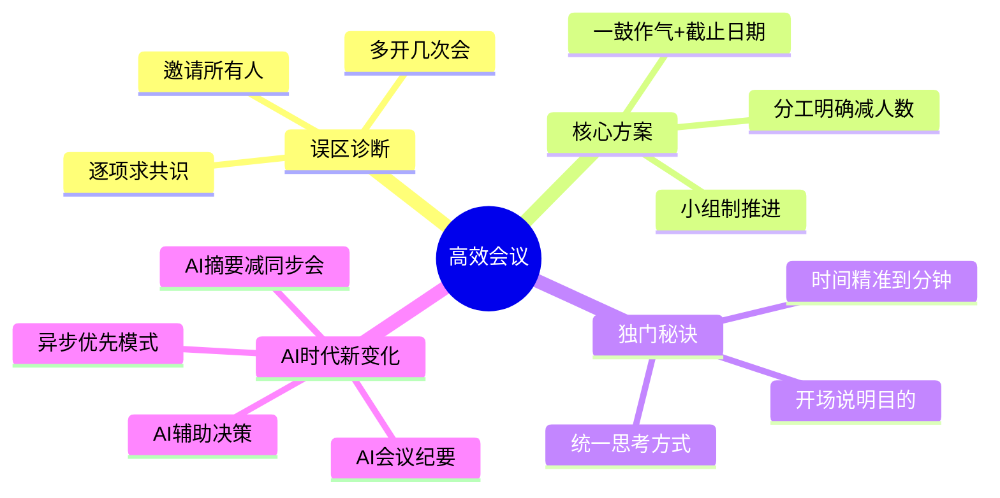
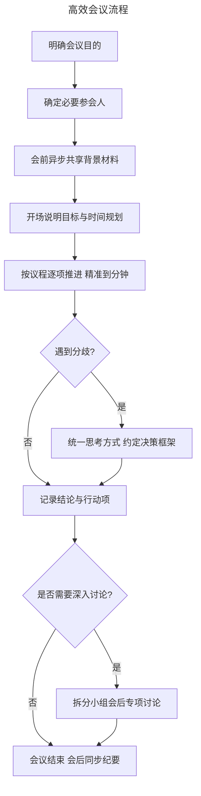
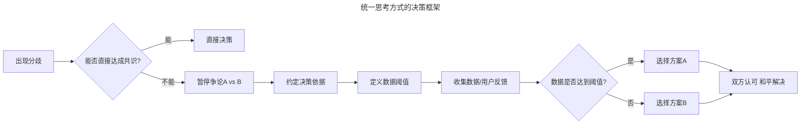
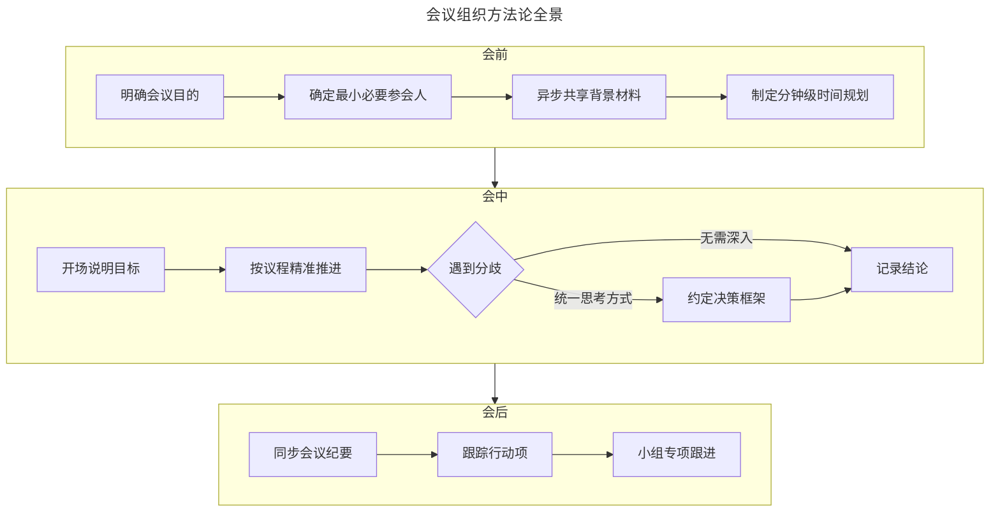

# 15 | 如何组织有效的会议？

> **适用范围**：产品经理（各阶段）、需要组织产品需求讨论会的团队负责人、创业者和项目管理者。适用于会议组织、需求评审、决策效率、AI 时代异步协作等场景。
>
> **更新摘要（v2 · 2026-08 更新）**：
> - 结构化升级为 6 节骨架（导言 / 核心方法论 / 关键流程 / 工具与实战 / 常见误区 / 进阶延展）
> - 保留失败会议案例、三个解决方案、独门秘诀、决策框架与三层深度视角
> - 保留全部 Mermaid 图并补充 `--- title: ... ---` frontmatter，每张图后追加文字解读

---

## 1. 导言

产品需求讨论会对产品经理来说是家常便饭。

当产品经理对我们应该解决什么痛点、有哪些功能有了一个计划，接下来就需要组织产品需求讨论会了。我会和工程师、设计师等团队成员坐在一起讨论对这个功能的看法，跟他们讲讲这些功能一步一步的体验是什么样的：设计师是不是觉得这个设计是以人为本的；工程师会不会说我们的底层结构不支持，这个根本做不了。

**简单地说，产品需求讨论会的目的是要明确我们的功能、量化成功的标准和时间表，团队成员达成一致意见后就开始全力以赴投入执行了。**

> **图解**：高效会议——误区诊断（邀请所有人、多开几次会、逐项求共识）、核心方案（一鼓作气+截止日期、分工明确减人数、小组制推进）、独门秘诀（时间精准到分钟、统一思考方式、开场说明目的）、AI 时代新变化（AI 会议纪要、AI 辅助决策、异步优先、AI 摘要减同步会）。

首先，我跟你分享一个失败的产品需求讨论会，通过这个例子让你明白会议低效的几个常见原因，以及组织会议的几个误区。然后，针对这个案例的具体情况，我会告诉你怎么才能提高产品需求会的效率。最后，我会结合以前自己经历过的失误（说多了都是泪啊），跟你分享几个组织高效会议的独门秘诀。

---

## 2. 核心方法论

### 2.1 案例：一个失败的产品需求讨论会

前段时间，隔壁组的产品经理组织了一个产品需求讨论会，讨论一个由他们主导的新功能，因为这个功能需要和我们合作才能实现，所以我们组也被邀请去开会。这个产品经理写了一本厚重的产品需求文档，组织大家每天一个小时讨论这个文档。

这个会议共有 21 人参加，包括：我们组的产品经理、工程经理、工程负责人和运营经理，他们组的产品经理、高级工程经理、工程经理、工程负责人、5 个工程师、2 个律师、设计师、设计师经理、数据科学家、用户体验调研师、运营经理、运营专员。

如此多的人员每天聚在一起一个小时，逐项地讨论这个需求文档，进展非常慢。在第五天的时候，他们的高级工程经理忍无可忍，当场问责："每天在这里浪费时间，结果什么都没有讨论出来，这个模式根本不行"。这个产品经理瞬间不知道该怎么办了。

这次的产品需求讨论会，可以说是我在 Facebook 三年多以来开过的最杂乱无章的会。那么，我来给你分析一下这个产品需求讨论会失败的原因，其实这些原因都源于对产品需求会认知的误区。

### 2.2 会议低效的三个误区

**1. 以为开会要让全组的人都有参与感，所以邀请了所有人，导致参会者众多。** 这个新功能是针对众多媒体公司的，有点类似企业软件。它是一个复杂的工作流，涉及非常多的情况，每种情况对应的逻辑都不同，而且要符合对应的法律、政策等要求。其实真正懂这个功能的也只有三四个人，但是团队其他成员都想参与进来，可以对产品功能做一些决定，而这个产品经理也希望可以讨好团队的每个成员。所以，会议的大部分时间都花在给这些不懂产品的人解答最基本的问题上，因此效率非常低。

**2. 以为多开几次会，多聊聊，效率会很高，但是大家都有很多会议要参加，因此每次开会都有不一样的人缺勤，导致会议效率低下。** 每次开会都要跟上次缺席的人同步进度，往往会议开始的前十分钟甚至更长的时间，都浪费在这里了，这就导致了会议效率特别低下。

**3. 以为开会的目的是要从头开始逐项讨论，并得到大家一致的认同，所以细节讨论占据了会议大部分时间，反而来不及做重要的决定。** 会议的模式决定了，如果一个成员有疑问，大家就都要停下来解决这个问题，一个小时很快就过去，于是未来得及做的重要决定又要第二天的会议来讨论。

### 2.3 失败会议的结构性反思

| 误区 | 表现 | 后果 | 深层原因 |
|------|------|------|----------|
| 邀请所有人 | 21 人参会 | 大量时间解答基础问题 | 讨好团队每个成员 |
| 多开几次会 | 每天 1 小时×多天 | 每次同步缺席者进度 | 以为多聊效率高 |
| 逐项求共识 | 细节讨论占用时间 | 重要决定来不及做 | 以为要一致认同 |

> **核心洞察**：会议的失败源于把"参与感""多开""共识"误当成目的，而忽略了会议的真正目的——高效决策。过度追求全员参与和一致同意，反而牺牲了决策效率。

---

## 3. 关键流程

### 3.1 高效会议流程

> **图解**：高效会议流程——明确会议目的→确定必要参会人→会前异步共享背景材料→开场说明目标与时间规划→按议程逐项推进精准到分钟→遇到分歧时统一思考方式约定决策框架→记录结论与行动项→需要深入讨论则拆分小组会后专项讨论，否则会议结束会后同步纪要。

### 3.2 三个解决方案

**1. 一鼓作气，并设定一个需要作出决定的时间。** 比如，这个复杂功能的需求讨论会可以把大家集中在一起 5 个小时，将 100% 的精力投入到整个会议中，一次搞定而不要分散成多次进行。如果这 5 个小时讨论不出结果，可以设定一个截止日期（比如周五之前），如果讨论不出来就加班继续讨论。

人类其实是一个很有意思的物种，没有截止日期的话，大家就会觉得有的是时间，拖来拖去；如果设置了截止日期，大家就会觉得工作压力大，最终争分夺秒赶在截止日期的时候完成。所以，即使不知道这个会议需要多久才能开完，也一定要设置一个截止日期，哪怕到时候没能完成，往后推两天也比没有截止日期的效果来得好。

**2. 分工明确，减少参会人数。** 可以先开一个项目启动会议。你可以邀请团队所有成员参加这个启动会，告诉他们这个产品开发的背景知识、调研结果、核心原则等战略和原则性的内容。比如，对于网红新的赚钱方式的讨论，你可以告诉大家一定不能允许网红自行植入软广，这样才能保证我们可以控制营销内容和普通内容的比例。

按照工作内容划分小组，并确定每个小组的成功标准、具体负责人，然后每个小组分别开会。这个小组划分的工作可以在项目启动会上完成。在这个案例里，你可以成立一个小组专门负责法律问题，小组成员包括律师、运营人员；再设置一个小组负责帮助网红适应和开启新的功能，小组成员包括用户体验分析师、负责增长的工程师、数据科学家等。

每周召集所有成员开一次会，由每个小组的负责人汇报工作进度，并解决他们遇到的问题。这样既可以满足其他成员了解整个项目进展的需求，增加他们的归属感，又可以减少每个决定需要的人员数量，提高会议效率。

**3. 用决策框架统一思考方式。**

> **图解**：统一思考方式的决策框架——出现分歧后能否直接达成共识，不能则暂停争论 A vs B，改为约定决策依据、定义数据阈值、收集数据/用户反馈，数据达到阈值选 A，否则选 B，双方认可和平解决。这是让僵持双方统一的"迂回战术"。

---

## 4. 工具与实战

### 4.1 组织成功产品需求会的秘诀

**秘诀 1：精准管理开会的时间。** 在会议开始前，做好会议时间规划文档，精准到分钟，你可以采用"上周数据更新（3 分钟，张娜）""产品测试结果（5 分钟，小王）"这样的方式。比如，第一部分由某工程师介绍功能开发计划，你给他规划的时间是 5 分钟。如果大家讨论无足轻重的细节问题或者快要到 5 分钟的时候，你可以礼貌地提醒大家注意时间。虽然这种方式打断了大家的讨论，但会议非常有效率，会后也没有人因为被打断觉得不被尊重。

以前我没有做会议时间规划时，不好意思打断别人，结果每次开会都有二十分钟甚至更长的时间在讨论无关紧要的问题，而且往往只有两个人针对这种问题争论不休，其他人都无所事事。但是，自从有了精确管理开会时间的文档，我可以非常礼貌地打断这种无关紧要的争论，并且他们会非常自觉地把这个问题留到会后单独讨论解决。

**秘诀 2：如果无法做出统一的决定，那就统一大家做决定的思考方式。** 这是一个可以让团队意见统一的迂回战术。比如，开会的时候大家一直在争论到底是做 A 决定还是 B 决定，这样的情况我们可以先不讨论到底是选 A 还是 B。我们可以约定用更多的数据或者用户反馈来做决定，并统一做下一步决定的思考方式：如果数据达到 X% 我们就选择 A，否则就选 B。

我以前就遇到过这个问题，设计师、工程师虎视眈眈，公说公有理，婆说婆有理，谁都不肯让步，即使我更认同工程师的想法，也不能在这个时候直接怼设计师，否则这场争论不但不会停止，反而会扩大。但是，我采用"统一他们思考问题的方式"的迂回战术，那双方很快就点点头表示认可，问题随之解决了。原因是什么呢？两个人的看法可以说都是对的，因为他们看重的情况不一样。但是，看完数据后，我和设计师说："你的假设很有道理，但是通过数据我们发现，这种情况并不多见，所以综合考虑，我们决定做 XXX"。这时，设计师会点点头，表示认可。最终，和平就这么来了。

**秘诀 3：会议开始时先说明会议要达到的目的。** 比如，在会议开始时，告诉大家未来的 30 分钟我们需要一起做出什么决定。那么当会议开始后，大家一般都会直奔主题，可以非常有效率地得到你想要的结果，会议成员也会觉得这三十分钟没有白白浪费掉。

我刚开始做产品经理时，就犯了一个错误。我组织了一个确定成功指标的会，但是没有和参会者说明会议目的，最终三十分钟的会议什么问题都没有解决。会后就有人跟我的老板反映，白白浪费了三十分钟，什么问题都没解决。被老板大骂一通后，我认识到了问题出在哪里，所以吃一堑长一智，在每次会议开始时先说明要达到的目的，这种问题就再也没有出现过了。

### 4.2 方法论全景图

> **图解**：会议组织方法论全景——会前（明确目的→确定最小必要参会人→异步共享背景材料→制定分钟级时间规划）、会中（开场说明目标→按议程精准推进→遇分歧统一思考方式约定决策框架→记录结论）、会后（同步会议纪要→跟踪行动项→小组专项跟进）。

### 4.3 三层深度视角

**🟢 进阶视角（1-3 年产品经理）**——掌握会议组织基本功：学会说"不"（不是每个人都需要参会，只邀请对决策有直接贡献的人，想了解的人用会后纪要满足）；会前准备是关键（提前 24 小时发送议程和背景材料）；时间管理是纪律（制定分钟级议程并严格执行，设计时器到点推进下一项）；会后跟进不能少（24 小时内发出纪要和行动项，明确责任人和截止日期）。

**🔵 资深视角（3-5 年产品经理）**——从"组织好一场会"进化到"设计会议体系"：区分会议类型（决策会 5-7 人 30 分钟内、讨论会 3-5 人 60 分钟内、同步会全员 15 分钟内）；设计决策机制（明确哪些决定用共识制、哪些用负责人拍板制、哪些用投票制）；异步优先思维（安排任何同步会议前先问"能否异步解决"）；管理会议文化（倡导"无议程不开会""准时开始准时结束"）。

**🟣 专家视角（5 年+产品经理）**——思考会议在组织协作中的系统性角色：会议是组织设计的镜像（频繁低效会议往往是组织架构、职责边界、决策权限不清晰的症状，治本之道是优化组织设计）；构建决策树而非会议链（将复杂决策拆解为条件分支，会议只做数据确认和最终拍板）；度量会议 ROI（建立人均会议时长、决策到执行时间、会议结论落地率等量化指标）；AI 时代的会议重构（重新审视哪些会议被 AI 完全替代、哪些人机协作、哪些必须面对面）。

---

## 5. 常见误区

| 误区 | 表现 | 正确做法 |
|------|------|---------|
| **邀请所有人** | 让全组都有参与感，参会者众多 | 只邀请对决策有直接贡献的人 |
| **多开几次会** | 以为多聊效率高 | 一鼓作气，设置截止日期 |
| **逐项求共识** | 从头逐项讨论并求一致认同 | 明确目的，聚焦重要决定 |
| **不设截止日期** | 大家觉得有时间拖来拖去 | 一定要设置截止日期 |
| **不说明会议目的** | 会议开始不说明要达到的目的 | 开场先说明会议要达到的目的 |
| **不管理时间** | 不好意思打断无关争论 | 精准管理到分钟，礼貌打断 |

---

## 6. 进阶延展

### 6.1 AI 时代的新变化

**AI 会议纪要**——传统会议中，专人记录纪要既耗时又容易遗漏要点。如今，Otter.ai、飞书妙记、Notion AI 等工具可以实时转录会议内容，自动提取关键决策、行动项和待办事项。产品经理不再需要边开会边做笔记，可以全身心投入讨论本身。会议结束后，AI 生成的纪要可以在几分钟内同步给所有参会者和相关方，大幅减少"上次缺席的人需要同步进度"的问题。

**AI 辅助决策**——当团队在 A 方案和 B 方案之间僵持不下时，AI 可以成为客观的第三方。你可以将双方论据输入大语言模型，让它分析各方案的优劣、风险和适用场景。更进阶的做法是：让 AI 基于历史数据和行业案例，给出数据驱动的建议，作为团队讨论的起点而非终点。这和"统一思考方式"的秘诀一脉相承——AI 帮助团队更快地建立共同的决策框架。

**异步优先会议模式**——AI 时代最重要的会议理念变革是"异步优先"。核心原则是：**能异步解决的，绝不同步开会。** 具体做法包括：会前用 Loom 录制 3-5 分钟异步视频，讲解背景和方案，参会者自行观看并留下评论；用 Notion 或 Confluence 文档协作，让各方在文档中异步标注疑问和建议；只有真正需要实时讨论和决策的议题，才安排同步会议；会议时间从 1 小时压缩到 25 分钟或 50 分钟，留出缓冲。

**AI 摘要减少同步会议**——很多同步会议的本质是"信息同步"，而非"实时决策"。AI 摘要工具可以将长文档、长讨论串自动浓缩为关键要点，让团队成员在 5 分钟内掌握核心信息。这意味着大量原本需要开会的场景，可以通过"AI 摘要+异步评论"的方式解决，同步会议的数量可以减少 30%-50%。

### 6.2 最新实践（2024-2026）

- **Loom 异步视频**：产品经理在会前录制 Loom 视频，逐页讲解 PRD 的关键部分，工程师和设计师在视频时间轴上留下精准的评论和疑问。2024 年 Loom 被 Atlassian 收购后，与 Jira、Confluence 的深度集成让异步协作更加流畅。
- **Notion AI 纪要**：其会议纪要功能已从简单的转录进化为智能摘要+行动项提取+自动分配负责人。产品经理可以在 Notion 中创建会议页面，AI 自动关联相关的 PRD、设计稿和 Jira 任务。
- **远程/混合会议最佳实践**：讨论型会议鼓励开摄像头，信息同步型会议不强制；使用 Miro 或 FigJam 替代实体白板；跨时区团队优先异步，同步会议安排在重叠时段并录制回放；会议同时开启 Slack/飞书线程让不方便发言的人实时输入观点；跨国团队利用 AI 实时翻译消除语言障碍。

### 6.3 关键术语表

| 术语 | 定义 |
|------|------|
| 异步优先 | 一种会议理念，优先通过非实时方式（文档、视频、评论）处理信息，仅在必要时才安排同步会议 |
| 决策框架 | 预先约定的决策规则和条件，如"数据达到X%则选A"，用于在分歧时快速达成一致 |
| 小组制 | 将大型会议拆分为按职能或主题划分的小型讨论组，每组独立推进后汇总 |
| 分钟级议程 | 将会议时间精确分配到每个议题和发言人，以分钟为单位管理会议节奏 |
| 统一思考方式 | 当无法统一决定时，先统一团队做决定的依据和逻辑，再基于共同框架做出选择 |
| 会议ROI | 会议投入的时间成本与产出的决策价值之比，用于衡量会议效率 |
| 同步会议 | 所有参会者同时在线的实时会议，适合需要即时互动和决策的场景 |
| 异步视频 | 预录制的视频内容（如Loom），参会者可在自己方便时观看并留言评论 |
| AI纪要 | 利用AI工具自动转录、摘要和提取会议关键信息的纪要生成方式 |
| 信息同步会 | 以传达信息为主要目的的会议，通常可被异步方式替代 |

### 6.4 三层思考题

- 🟢 **进阶层（1-3 年）**：回想一下，上一次你组织的或者参加的失败的产品需求会议，你认为会议效率低下的原因是什么？如果可以重新来一次，你会在哪些方面进行改进？
- 🔵 **资深层（3-5 年）**：你所在的团队中，有多少比例的同步会议可以被异步方式替代？请列出 3 个可以"消灭"的会议，并设计对应的异步替代方案。
- 🟣 **专家层（5 年+）**：如果你要为一家 500 人的产品团队设计一套"会议治理体系"，你会如何定义会议的分类标准、决策权限和效率度量指标？请画出你的框架图。

### 6.5 延伸阅读

- 《Robert's Rules of Order》——议会程序的经典著作，理解正式决策流程的基石
- Patrick Lencioni《Death by Meeting》——剖析会议失败的深层原因，提出"结构化冲突"理念
- Amazon 的"6 页备忘录"实践——贝佐斯禁止 PPT，要求会前阅读 6 页叙事文档，确保深度思考
- GitLab 的异步沟通手册——全球最大全远程公司的异步协作最佳实践，公开可查
- Basecamp《Shape Up》——提出"pitch"和"betting table"替代传统需求评审会
- OpenAI 的会议文化——2024 年报道显示，OpenAI 内部大量采用异步文档+短同步决策会的模式
