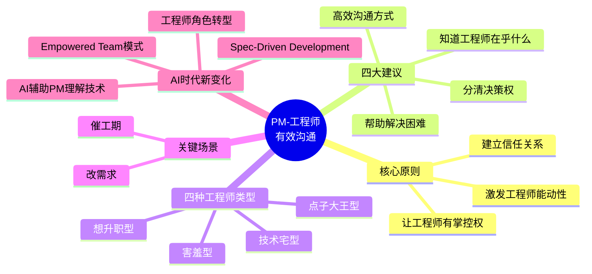
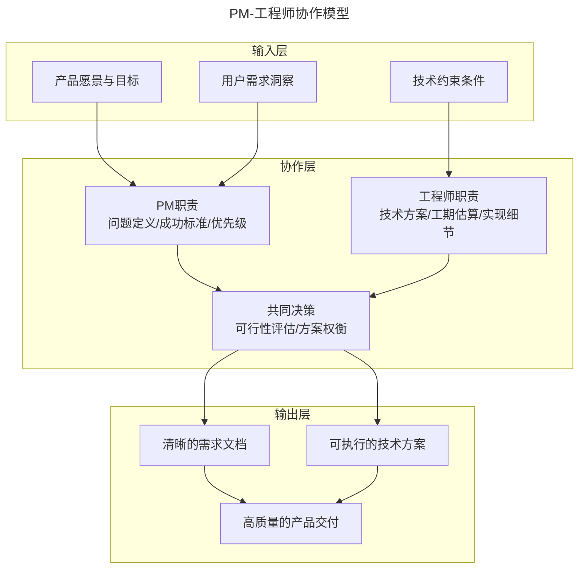
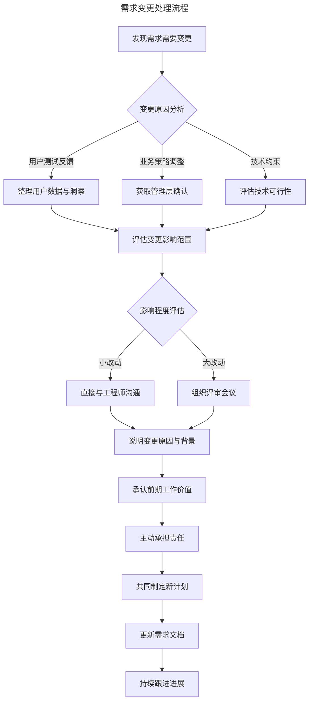
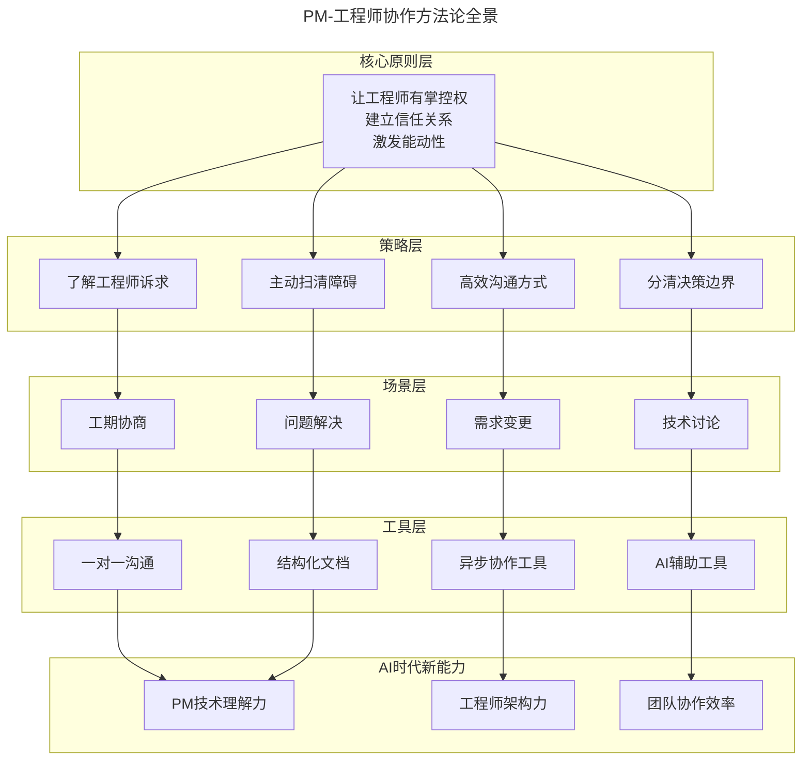
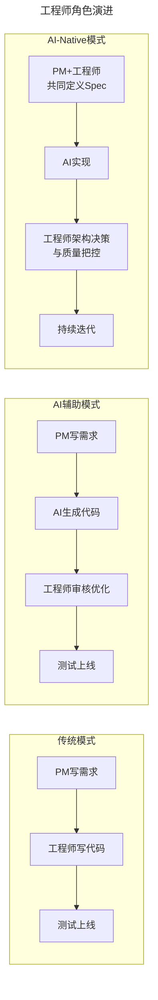

# 16 | 如何和工程师有效沟通？

> **适用范围**：产品经理（各阶段）、需要与工程师协作的团队负责人、创业者。适用于跨职能沟通、需求变更、工期协商、AI 时代人机协作等场景。
>
> **更新摘要（v2 · 2026-08 更新）**：
> - 结构化升级为 6 节骨架（导言 / 核心方法论 / 关键流程 / 工具与实战 / 常见误区 / 进阶延展）
> - 保留四大建议、四种工程师类型、催工期/改需求场景、三层深度视角
> - 保留全部 Mermaid 图并补充 `--- title: ... ---` frontmatter，每张图后追加文字解读

---

## 1. 导言

工程师和产品经理之间的恩怨情仇，一直是科技圈茶余饭后久盛不衰的一个话题。"产品狗"摧残"码农"的故事、或者工程师吐槽产品经理什么也不懂只会乱提需求的段子屡见不鲜。那么，产品经理和工程师到底能不能和谐共处，成为一个战线上的好伙伴？

其实，一个优秀的产品经理不仅能和工程师有效合作，甚至可以让工程师觉得跟定了你，没你不行。在硅谷，我们常说一个顶尖的产品经理每次跳槽，都能拉走一堆优秀的工程师，究其原因：一是，这样的产品经理确实不多见；二是，遇到一个好的产品经理，工程师可以把更多精力花到他们感兴趣的、有巨大影响力的方面，可以更有效率地做出优秀的产品。

> **图解**：PM-工程师有效沟通——核心原则（让工程师有掌控权、激发能动性、建立信任）、四大建议、四种工程师类型、关键场景（催工期、改需求）、AI 时代新变化。

---

## 2. 核心方法论

### 2.1 PM-工程师协作模型

> **图解**：PM-工程师协作模型——输入层（产品愿景、用户需求、技术约束）→协作层（PM 职责定义问题/成功标准/优先级、工程师职责技术方案/工期/实现、共同决策可行性评估/方案权衡）→输出层（清晰需求文档、可执行技术方案、高质量交付）。

### 2.2 优秀的产品经理能激发工程师的能动性

在硅谷的很多顶尖科技公司，都是"工程师导向"的文化，也就要求产品经理不能像监工一样告诉工程师应该做什么。如果产品经理对工程师指手画脚，那工程师会顿时失去工作的兴趣，吵着嚷着要换组、换产品经理。

但是，一个真正优秀的产品经理能够让工程师兴奋起来，满腔热情地投入到产品开发中；而这种热情一旦被激发出来，产品经理就再也不用担心工程师会拖延工期、消极怠工，相反工程师甚至会比你更积极。

那怎么才能激发工程师的能动性呢？我至少和百位不同背景、不同资历的工程师工作过，在无数次"试错"后，我总结了下面的这些建议。

---

## 3. 关键流程

### 3.1 建议一：知道工程师在乎什么

他是一个刚毕业不久、满腔激情、想赶快升职加薪的工程师？还是一个想解决最高难度的技术问题，哪怕产品没人用，只要解决的问题难度足够高就高兴的工程师？还是一个满肚子主意，极其讨厌产品经理告诉他该做什么的"点子大王"？还是一个有些害羞、很多想法都憋在心里，但其实特别希望自己有存在感的人？

**知道了他在乎什么，你才能知道怎么激发他的能动性，以及该让什么人做什么样的项目。**

| 工程师类型 | 核心诉求 | 激发策略 | 典型话术 |
|-----------|---------|---------|---------|
| 想升职型 | 老板可见度、晋升资本 | 安排高曝光项目、帮助出风头 | "这个项目VP很关注，做好了对你晋升很有帮助" |
| 技术宅型 | 技术挑战、解决难题 | 强调技术难度、满足虚荣心 | "这个问题其他团队都放弃了，你能解决吗？" |
| 点子大王型 | 创意认可、参与感 | 引导说出想法、给予表扬 | "你的弹幕想法太棒了，我们就这样做" |
| 害羞型 | 存在感、被重视 | 创造表达机会、主动询问 | "你觉得这个方案怎么样？想听听你的看法" |

想升职的工程师肯定喜欢做老板能看得见的项目，哪怕这些项目没有多高的难度，帮助这些工程师在老板面前"出出风头"，他们肯定对你死心塌地。

技术宅？那你就给他们强调一下，这个项目的哪些技术问题是其他工程师想想就头疼、根本解决不了的，满足他们的虚荣心。

"点子大王"？那就找机会表扬他的点子又多又好，就算这个想法是你先想出来的，你也可以在和他交流时循循善诱，引导他说出你的想法，然后赞叹他的想法真厉害。比如，如果你认为应该在视频平台上做一个让用户发弹幕的功能，不要直接和"点子大王"说："你负责做弹幕"，而是要从问题出发，你可以说"我们的视频互动性太差，用户都不喜欢发评论"，然后引导他说出做弹幕的主意。

至于害羞的工程师，你可以在开会的时候刻意给他们表达自己的机会，他们绝对对你感激涕零，期待和你继续合作。

**知道工程师要什么，想办法在现有的项目里给他们相应的机会，会让你们之间的合作事半功倍。** 至于怎么知道工程师要什么，你不如和他约个时间喝杯咖啡私聊一下，了解他的个人情况，你甚至可以直接问他："你是如何决定自己做的事情有没有价值的，你在乎的是什么？"

### 3.2 建议二：高效沟通方式

很多工程师最讨厌的就是开会，因为 30 分钟的会议打断了他们的思考时间，拖慢了他们写代码的进度。所以作为产品经理，虽然你每天要花很多时间在开会上，但是要考虑一下这个会到底有没有必要让工程师参加，可不可以安排到这个工程师其他会议之前或者之后的时间，这样尽量少地打断他们的思考，以便于他们有效率地编程。你还需要思考，除了开会之外，还有没有其他可以高效做决定的方式，比如发个邮件。

### 3.3 建议三：分清决策权

比如，某个按钮是 100 像素还是 120 像素，类似这样的决定，是不是可以让工程师和设计师自己决定？**很多产品经理常犯的错误是，自己做出所有的决定，和工程师交流时只是要求他们按照指定要求来做，但实际上有些要求根本就不切实际。** 更或者，按钮是 100 像素还是 120 像素，可能对于产品的成败来说，并不是最重要的决定，你完全没必要在这种决定上花时间。

还有些产品经理只告诉工程师要做什么，从来不解释产品的目的、成功的标准，工程师完全不知道这些决定背后的策略和思考过程，结果就是事事都需要产品经理告诉他们要怎么做。

其实，**一个好的产品经理一定会清晰表达产品要解决的问题、如何衡量成功、需要最先解决的用例以及原因，让产品团队的工程师、设计师、数据科学家等都有足够的背景信息。** 这样，很多的小决定完全可以让团队成员自己做，从而既可以大大提高产品效率，又可以提高团队成员的能动性。

当然，这并不是说产品经理什么决定也不用做，**一个优秀的产品经理，会确保自己的时间花在"非我不可"的事情上**，其他决定都会交给他人。设想，如果一个产品经理把每天的时间都花在解决按钮是 100 像素还是 120 像素这种问题上，他们哪还有时间去和客户做一对一交流、制定产品战略、思考"脑洞大开"的新功能。

### 3.4 建议四：帮助解决困难

很多工程师在开发过程中会遇到一些困难，比如因为其他组工程师进展缓慢而导致开发工作停滞，因为开发的新功能被律师认为风险太大而面临一些质疑，等等。因此，产品经理应该积极询问工程师："你需不需要我为你提供一些帮助"，帮助工程师解决开发过程中遇到的障碍。

**因此，帮助工程师扫清开发路上的各种障碍，可以提升你的产品开发效率，而这正是优秀的产品经理需要做的事情。** 比如，我常常对工程师说："现在有哪些工作是你不喜欢做的，告诉我，无论是繁琐的基础工作，我来帮你做"。其实，这也是一个帮助你和工程师建立信任关系的过程。

### 3.5 怎么催工程师加快进度？

这个问题是很多刚入行的产品经理最担心的，我的建议是，让工程师先自己估计需要的工期，然后再设定截止日期。如果他们预估的工期太长，我可能会提出一些问题，弄清楚为什么需要这么长时间，看看哪些部分可以砍掉，到底值不值得为截止日期砍掉这些功能。

工程师估计完自己需要的时间后，我会和工程师说明我们的发布计划，比如某月某日营销团队会开始宣传产品功能、某月某日我们需要开始运营工作等等，这样可以让工程师了解其他部门的进度，增强他们的归属感。

刚入行不久的工程师估计工期的能力比较差，如果他们的工期估计得太长，我就会想方设法让他们告诉我工期是怎么估计出来的，然后跟他一起讨论，哪些部分可以用现成的 API，哪些部分可以少花一些时间。

如果遇到确实要将截止日期提前的情况，我会告诉工程师需要提前的详细原因。这样做的目的是，让工程师觉得你和他是一起的，让他感觉到你的信任、你在思考如何一起解决工期提前的问题。

所以，我一般不会直接说要花多长时间，而是让工程师先估计工期，如果我觉得估计得过长，我会诚恳地告诉他我们需要加快进度，看看有没有什么方式能够重新组合一些计划，以加快工期。

在这里，**一定要让工程师觉得自己是有掌控权的，而不是产品经理凭主观臆断，就决定个截止日期。** 就算这个截止日期是你自己凭直觉决定或者老板要求的，在表达日期的时候也要尽量体现出对工程师的尊重，用问问题的形式表达自己的看法，积极地和工程师一起寻求提前工期的方式。

### 3.6 需要改需求怎么办？

改产品需求是一个非常常见的过程，有些时候前期计划做得很好，开始 Beta 测试时却发现，用户对某个功能根本不理解，还是需要改动。

其实，开发本来就是一个不断迭代的过程，所以应该首先认识到，产品开发不是产品经理闷头花几个星期写一个文档，然后再抛给工程师让他们按照这个文档执行的过程。

但是，改需求并不代表产品经理可以在产品需求文档上胡写乱写，做出一些不靠谱的决定，这是在浪费工程师的时间。这里我就跟你说说有哪些方式能够避免在开发后期改需求，如果真的要改需求，如何和工程师有效沟通。

> **图解**：需求变更处理流程——发现需求变更→分析变更原因（用户测试反馈/业务策略调整/技术约束）→评估变更影响范围→判断影响程度（小改动直接沟通、大改动组织评审）→说明变更原因与背景→承认前期工作价值→主动承担责任→共同制定新计划→更新需求文档→持续跟进进展。

**方式一：尽早和工程师进行产品功能设计的讨论，让他们提前了解各种背景信息。** 我平时的工作方式是，先在产品需求文档中写明需要解决的问题、如何判断成功，并写几个产品方案的初稿，和工程师、设计师们进行讨论，回答他们的问题，让他们一开始就参与进来。通过这个讨论过程，我可以知道有什么技术上的局限性，然后根据大家的反馈修改产品需求文档。这样可以避免在工程师花费大量时间后才发现问题，然后重新来过，导致工程师做无用功。

**方式二：如果确实需要让工程师们重新写已经写好的东西，或者砍掉他们已经写好的东西，一定要积极承担责任。** 这种情况，可能是因为你作为产品经理少考虑了某些情况，也可能是突然发生了一些变故，比如公司改变了策略、竞争对手突然"搞事情"。虽然这并不一定是你的责任，但是这时你还是应该积极和工程师交流，主动承担责任，告诉他们："这个赖我，辛苦你了"。

其实很多时候，就算产品经理自己主动承担责任，工程师也不会"顺杆爬"埋怨你，他们反而觉得你是个靠得住的好产品经理，甚至会过来安慰你。积极承担责任，说句"抱歉，辛苦了"，虽然对你来说就是一句话的事儿，但这可以很好地安抚已经努力工作了一个月、每天加班加点儿的工程师。很多时候，给工程师们一些鼓励和温暖，虽然看上去微不足道，但却能让他们干劲儿百倍，对你死心塌地。

---

## 4. 工具与实战

### 4.1 方法论全景图

> **图解**：PM-工程师协作方法论全景——核心原则层（让工程师有掌控权、建立信任关系、激发能动性）→策略层（了解诉求、高效沟通、分清边界、扫清障碍）→场景层（工期协商、需求变更、技术讨论、问题解决）→工具层（一对一沟通、异步协作、AI 辅助、结构化文档）→AI 时代新能力。

### 4.2 三层深度视角

**🟢 进阶视角（1-3 年 PM）**——核心任务是建立基本信任关系：学会倾听（技术讨论中多问"为什么"）；尊重专业（技术决策交给工程师）；透明沟通（及时同步业务背景、优先级变化）；承担责任（需求变更时主动认错，保护工程师）。常见误区：试图用"老板说的"来压工程师；频繁打断工程师的深度工作时间；需求文档写得太模糊。实践建议：每周与核心工程师一对一沟通；学会用工程师熟悉的协作工具；提出需求前先自己用 AI 工具评估技术可行性。

**🔵 资深视角（3-5 年 PM）**——核心任务是从"个人关系"升级到"系统建设"：建立协作规范（定义清晰的决策流程、沟通机制）；培养工程师产品感（让工程师参与用户研究、数据分析）；优化团队节奏（平衡需求交付与技术债务）；跨团队协调（处理依赖关系，减少工程师等待时间）。AI 时代新能力：用 AI 工具快速理解代码库；与工程师共同定义 AI 生成代码的质量标准；建立 AI 辅助的需求评审流程。

**🟣 专家视角（5 年+ PM）**——核心目标是打造 Empowered Team：定义问题空间（清晰表达用户问题、成功指标，让团队自主探索解决方案）；培养技术领导力（帮助工程师成长为技术决策者）；建立信任文化（让团队敢于尝试、快速失败、持续学习）；战略对齐（确保技术决策与业务战略一致）。组织影响力：推动工程团队参与产品战略讨论；建立 PM-工程师轮岗机制；设计激励机制奖励协作创新。AI 时代战略思考：如何重新定义 PM 和工程师的职责边界；如何利用 AI 提升团队整体效率而非替代人力；如何培养团队的 AI 协作能力。

---

## 5. 常见误区

| 误区 | 表现 | 正确做法 |
|------|------|---------|
| **把工程师当执行工具** | 只告诉做什么，不解释目的和成功标准 | 清晰表达要解决的问题、如何衡量成功 |
| **事事亲自决策** | 按钮 100px 还是 120px 也要自己定 | 时间花在"非我不可"的事情上 |
| **凭主观定截止日期** | 不尊重工程师的时间估算 | 让工程师先估计工期，用问问题的方式沟通 |
| **改需求不担责** | 砍掉工程师的工作却不道歉 | 积极承担责任："这个赖我，辛苦你了" |
| **频繁开会打断** | 不考虑工程师深度工作时间 | 尽量少打断，用异步沟通 |

---

## 6. 进阶延展

### 6.1 AI 时代的 PM-工程师协作新范式

**AI 辅助 PM 理解技术约束**——2024 年以来，AI 编程工具的普及正在改变 PM 与工程师的沟通方式。Cursor、GitHub Copilot、Claude 等工具让 PM 能够更深入地理解技术实现：快速理解代码库结构和技术栈；评估功能实现的技术可行性；生成初步的技术方案供工程师参考；理解工程师提出的技术约束原因。实践案例：某硅谷创业公司的 PM 在使用 Cursor 后，能够在需求讨论前先用 AI 分析现有代码库，了解哪些模块可以复用、哪些需要新建。这让需求讨论的效率提升了 40%，工程师不再需要花大量时间解释技术背景。

**AI 时代工程师角色的转变**：

> **图解**：工程师角色演进——传统模式（PM 写需求→工程师写代码→测试上线）、AI 辅助模式（PM 写需求→AI 生成代码→工程师审核优化→测试上线）、AI-Native 模式（PM+工程师共同定义 Spec→AI 实现→工程师架构决策与质量把控→持续迭代）。

AI 正在将工程师从"代码编写者"转变为"架构决策者"和"质量把控者"：

| 维度 | 传统工程师 | AI时代工程师 |
|-----|----------|------------|
| 核心工作 | 编写代码 | 架构设计、代码审核、技术决策 |
| 与PM关系 | 执行需求 | 共同定义问题、协作设计 |
| 技能重点 | 编程语言熟练度 | 系统思维、AI协作能力、技术判断力 |
| 价值创造 | 代码产出 | 技术方向把控、风险识别 |

**Empowered Team 模式**——硅谷顶尖科技公司正在推行"Empowered Team"模式，这与传统的"Feature Team"形成鲜明对比。Feature Team（传统模式）：PM 决定做什么、怎么做；工程师按需求执行；沟通成本高、工程师主动性低。Empowered Team（新模式）：PM 定义问题空间和成功指标；工程师自主决定解决方案；团队共同对结果负责；沟通从"传递需求"变为"协作探索"。

**Spec-Driven Development**——2024-2025 年兴起的 Spec-Driven Development 正在成为 PM-工程师协作的新范式。核心流程：PM 编写结构化的功能规格（Spec）→工程师审核 Spec 的技术可行性→AI 工具根据 Spec 生成代码→工程师审核、优化、集成。Spec 文档的关键要素：问题陈述与用户场景；功能行为描述（Given-When-Then 格式）；边界条件与异常处理；验收标准与测试用例。对 PM 的新要求：更精确的需求表达能力；对技术实现的基本理解；结构化思维能力。

**AI-Native 团队协作实践（2024-2026 年最新实践）**：异步协作优先（使用 Linear、Notion 等工具减少同步会议，让工程师有更多深度工作时间）；AI 辅助需求评审（PM 先用 AI 工具检查需求的完整性、一致性，再提交给工程师）；技术文档 AI 化（工程师用 AI 生成技术文档，PM 能更快理解技术决策）；实时协作编程（PM 参与工程师的 AI 辅助编程会话，实时了解技术约束）；数据驱动迭代（使用 AI 分析用户行为数据，PM 和工程师共同决定迭代方向）。

### 6.2 关键术语表

| 术语 | 定义 | 应用场景 |
|-----|------|---------|
| Empowered Team | 授权型团队，PM定义问题，团队自主决定解决方案 | 团队组织模式设计 |
| Feature Team | 功能型团队，PM决定做什么怎么做，团队执行 | 传统协作模式 |
| Spec-Driven Development | 规格驱动开发，先定义清晰规格再由AI/工程师实现 | AI时代开发流程 |
| Technical Debt | 技术债务，为短期速度牺牲长期代码质量 | 工期与技术权衡 |
| Async Communication | 异步沟通，不要求即时响应的沟通方式 | 减少工程师打断 |
| Deep Work | 深度工作，需要长时间专注的工作状态 | 保护工程师时间 |
| Stakeholder | 利益相关者，对产品有影响或被影响的人 | 沟通对象识别 |
| PRD | Product Requirements Document，产品需求文档 | 需求传递载体 |
| User Story | 用户故事，从用户角度描述需求 | 需求表达方式 |
| Acceptance Criteria | 验收标准，定义需求完成的条件 | 质量把控 |
| Code Review | 代码审核，工程师互相检查代码质量 | 质量保障机制 |
| Sprint | 冲刺，敏捷开发中的固定周期迭代 | 开发节奏管理 |

### 6.3 三层思考题

- 🟢 **进阶思考（1-3 年 PM）**：① 你的一个工程师平日少言寡语，从不会主动表达自己的想法，会议的时候也不怎么发言，但你在产品开发的过程中发现他并不完全同意大家的决定，也不能顺畅地执行，你作为产品经理应该怎么做？② 你的一个产品功能因为测试体验太差有被砍掉的风险，而这个主意是你自己提出来的，你会怎么和工程师沟通这个糟糕的结果？③ 你的一个工程师鄙视你没有工程背景，做决定时并不信任你提出的建议，你该怎么取得他的信任？
- 🔵 **资深思考（3-5 年 PM）**：① 团队中有一位资深工程师技术能力很强但产品意识薄弱，经常实现的功能与用户需求有偏差。你如何帮助他建立产品思维，同时不伤害他的技术自尊心？② 公司引入 AI 编程工具后，工程师代码产出效率提升 50%，但 PM 发现需求理解偏差导致返工的情况反而增加。你如何设计新的协作流程来解决这个问题？③ 产品需要跨三个工程团队协作，每个团队都有自己的优先级和技术栈。你如何建立有效的跨团队协作机制？
- 🟣 **专家思考（5 年+ PM）**：① 在 AI 时代，PM 和工程师的职责边界正在模糊。你认为 PM 是否需要具备编程能力？工程师是否需要具备产品能力？如何重新定义这两个角色的核心价值？② 你被任命为一个新的 AI-Native 产品团队负责人，团队成员包括 2 名 PM、5 名工程师、1 名设计师。你如何设计团队的工作模式，让 AI 工具最大化团队效率，同时保持团队的创造力和判断力？③ 公司的工程文化很强，工程师习惯质疑 PM 的每一个需求。你如何建立一种既尊重工程师专业判断、又能高效推进产品决策的协作文化？请结合 Empowered Team 的理念，设计具体的机制和流程。

### 6.4 延伸阅读

**经典书籍**：*《Inspired》by Marty Cagan*（硅谷产品管理圣经，深入讲解 Empowered Team）；*《The Lean Startup》by Eric Ries*（精益创业方法论，迭代开发的核心理念）；*《Peopleware》by Tom DeMarco*（软件团队管理经典，理解工程师工作特点）。

**AI 时代新阅读**："AI-Native Product Development"（a16z 博客系列）；"The Future of Software Engineering with AI"（GitHub 官方研究）；"Spec-Driven Development with AI"（Cursor 官方最佳实践）。

**实践案例**：Spotify 的 Squad 模式（小型自治团队实践）；Google 的 Product Review 流程（PM-工程师协作机制）；Meta 的 Engineering-Driven Culture（工程师文化下的 PM 角色）。
