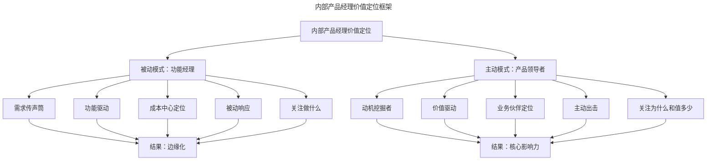
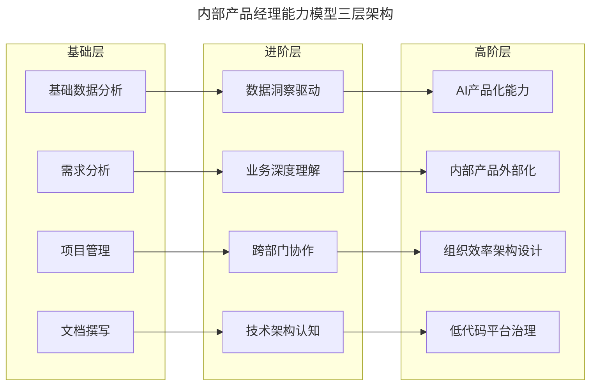
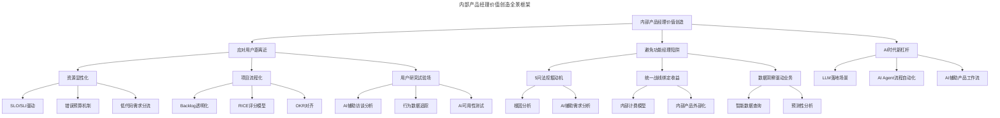

# 16 | 在内部产品中找到产品经理的价值

> **适用范围**：内部产品经理（CRM/ERP/CMS 等）、产品负责人、需要提升内部产品价值的团队。适用于内部产品定位、资源管理、需求治理、避免"功能经理"陷阱、AI 时代内部产品转型等场景。
>
> **更新摘要（v2 · 2026-08 更新）**：
> - 结构化升级为 6 节骨架（导言 / 核心方法论 / 关键流程 / 工具与实战 / 常见误区 / 进阶延展）
> - 保留资源显性化、项目流程化、用户研究试验场三大策略与 5 问法、统一战线等方法
> - 保留全部 Mermaid 图并补充 `--- title: ... ---` frontmatter，每张图后追加文字解读

---

## 1. 导言

**"心事浩茫连广宇，于无声处听惊雷。"——鲁迅**

当提到产品经理时，大部分人都会想到用户产品、商业产品或者平台产品。然而，有一类产品经理总是处在产品领域的阴影中，这就是内部产品的产品经理。

大部分产品经理都不太愿意做内部产品，觉得这份工作受气还没有出头之日。其实，做内部产品不但可以帮产品经理打下扎实的产品基本功，也能磨炼一个人的心性。尤其在 AI 时代，内部产品正迎来前所未有的价值重估——当 LLM 能力让内部工具的智能化门槛大幅降低，内部产品经理反而拥有了更大的杠杆效应。

### 1.1 什么是内部产品

内部产品通常是指自己公司内部员工使用的产品，比如 CRM、ERP、CMS、广告管理系统、法务合规、财务系统等。随着企业数字化转型的深入，企业内部知识库、AI 助手、RPA 流程自动化平台、低代码/无代码应用搭建平台等新型内部产品大量涌现，逐渐成为企业运营效率的核心基础设施。

### 1.2 内部产品的分类演进

| 类型 | 传统形态 | 2026 年新形态 | 典型代表 |
|------|----------|-------------|----------|
| 业务支撑 | CRM/ERP/CMS | 智能化 CRM + AI 销售助手 | Salesforce Einstein、纷享销客 AI 版 |
| 知识管理 | 文档系统/Wiki | AI 驱动的企业知识库 | Notion AI、飞书智能知识库 |
| 流程自动化 | 工单系统/BPM | RPA + AI Agent | 影刀 RPA、UiPath |
| 数据分析 | 报表系统/BI | 智能数据洞察平台 | Tableau AI、QuickBI |
| 应用搭建 | 定制开发 | 低代码/无代码平台 | 钉钉宜搭、Retool、Mendix |

---

## 2. 核心方法论

### 2.1 用户离你很近：内部产品的核心特征

内部产品最显著的特点：**产品经理和用户的距离很近**——你甚至能看到你的需求方，他们通常坐在你工位附近。这让他们不再是你脑海中设计的用户模型，而是随时能冲到你位置上跟你争个面红耳赤的同事。

这直接导致你很难在产品设计中说不。所谓见面三分情，你经常看到用户甚至一起吃午饭，很容易融入他们的立场和喜怒，保持不住冷静和理性。

### 2.2 内部产品经理价值定位框架：避免成为"功能经理"

内部产品经理容易遇到的问题之一是缺乏主动性。内部产品的需求通常铺天盖地袭来，产品经理稍有不慎就会处在一个消极应付的局面中，逐渐开始放弃思考，只是把业务部门提来的需求转发给开发，变成一个传声筒。这样的产品经理被称为"功能经理"——所有工作都由功能驱动，关注的是特性和功能逻辑，而不是产品层面的价值和取舍。

> **图解**：内部产品经理价值定位框架——被动模式下产品经理沦为功能经理（需求传声筒、功能驱动、成本中心定位），最终被边缘化；主动模式下产品经理通过动机挖掘、价值驱动、业务伙伴定位，建立核心影响力。

---

## 3. 关键流程

### 3.1 应对"用户距离近"的三大策略

**策略一：资源显性化**——把仓库的门打开，将技术资源显性化。让业务部门清楚了解整个技术部门有多少人力、多少工作任务。推算部门每个时间段的可用人力情况（如每周 100 个人日），扣除日常 Bugfix 和重构（一般 20%）后和盘托出。同时尽可能跟业务部门介绍系统的基础架构和实现原理，从技术层面解释清楚原委，避免不必要的压力和对立。

**DevOps/SRE 实践下的精细化资源模型**（2026）：
- **SLO/SLI 驱动的资源分配**：通过定义服务等级目标（SLO）和服务等级指标（SLI），将技术资源与业务可靠性挂钩。例如订单系统 SLO 要求 99.9% 可用性时，据此推算冗余资源，让业务理解"稳定性不是免费的"。
- **错误预算（Error Budget）机制**：将技术资源的弹性空间显性化。当错误预算耗尽，团队必须从功能开发转向稳定性建设。
- **可观测性平台**：借助 Datadog、Grafana、Prometheus 等工具实时可视化系统负载、资源利用率，让业务方从数据层面理解资源约束。

**低代码/无代码平台的资源杠杆**（2024-2026）：简单表单、流程审批类需求可由业务部门在低代码平台上自行完成；技术资源定义扩展为低代码平台许可数、API 调用量、AI Agent 的 Token 额度；低代码平台让"什么需求需要技术团队介入"这个边界变得可讨论、可量化。

**策略二：项目流程化**——内部产品的需求收集与确认可以周期化。比如根据业务节奏两周或一个月一次（节奏快每周一次），大家拿出专门时间确定下一阶段的交付计划。这样有仪式感的流程可以合理管理需求方的预期。

**敏捷实践中的需求治理**（2026）：
- **需求池（Backlog）透明化**：使用 Jira、Linear、飞书项目等工具，将需求池对业务方开放只读权限，减少"我的需求去哪了"的焦虑。
- **需求评分机制**：引入 RICE（Reach × Impact × Confidence / Effort）或 ICE 评分模型，让需求优先级从"谁嗓门大"变为"谁价值高"。
- **OKR 对齐**：将内部产品迭代计划与业务部门 OKR 对齐，每个迭代交付的特性都能追溯到具体业务目标。

**策略三：用户研究的最佳试验场**——内部产品为产品经理提供了亲手做交互设计的空间。收集用户反馈效率极高，不用精心设计问卷，可以直接走到用户工位聊三五分钟。产品可用性研究成本极低廉，直接坐到用户旁边看他的操作即可。

**AI 时代的用户研究新范式**（2026）：
- **AI 辅助用户访谈分析**：使用 Otter.ai、飞书妙记自动转录访谈，再通过 LLM 进行主题提取和情感分析，将数小时的访谈整理压缩到分钟级。
- **行为数据分析**：通过 Mixpanel、GrowingIO 自动追踪内部用户操作路径，识别高频操作、卡点页面和功能盲区。
- **AI 驱动的可用性测试**：利用 AI 眼动追踪模拟（如 Attention Insight）快速评估界面布局视觉焦点分布。

### 3.2 避免"功能经理"的三大方法

**方法一：跳过方案，寻找背后的动机和诉求**——内部产品的用户在提需求时通常都会直接提出"解决方案"。如"订单列表增加按时间排序的选项""订单号字段增加至 128 位"。产品经理一定要避免不假思索地将需求直接交给工程师团队，需要多追问几个为什么。

**5 问法（5 Whys）的进阶应用**：

| 层级 | 问题示例 | 挖掘深度 |
|------|----------|----------|
| 第 1 问 | 为什么需要订单号字段增加至 128 位？ | 表面需求 |
| 第 2 问 | 为什么订单号体系需要变更？ | 业务流程变化 |
| 第 3 问 | 为什么业务流程发生了变化？ | 业务模式调整 |
| 第 4 问 | 为什么业务模式需要调整？ | 市场或战略变化 |
| 第 5 问 | 为什么市场/战略发生了变化？ | 根本驱动力 |

**方法二：统一战线，成本收益一致**——将自己推到业务部门甚至整个公司的立场上，从业务的角度考虑投入产出比。将技术成本并入业务成本，同时把业务收益和内部产品技术团队的收益绑定。除此之外，内部产品经理必须深入了解业务——做财务系统要了解财务部门职责、会计师准则；做 ERP 要深入了解供应链知识。

**从成本中心到利润中心的转型**（2024-2026）：
- **内部产品外部化**：如 Amazon 的 AWS 最初是内部基础设施，后来成为全球最大云服务；字节跳动的飞书从内部协作工具发展为全球 SaaS 产品。
- **内部计费模型**：通过内部结算机制，让业务部门按使用量付费，使内部产品团队有独立的"收入"指标。
- **效率量化**：通过 RPA、AI 自动化等手段，将内部产品带来的效率提升量化为具体成本节约金额。

**方法三：发挥强项，用技术帮助业务**——内部产品是金矿，里面有大量流程和业务数据。产品经理应主动出击，经常分析数据，将简单的数据统计进化为数据洞察，做出直接帮助业务部门做决策的数据产品。比如对客服支撑系统，可以在基础数据需求之外提供服务效率报表，甚至通过数据挖掘建模做出服务量预测。

---

## 4. 工具与实战

### 4.1 内部产品经理能力模型

> **图解**：内部产品经理能力模型三层架构——基础层聚焦核心技能（需求分析、项目管理、文档撰写、基础数据分析），进阶层强调业务与技术融合（业务深度、数据洞察、跨部门协作、技术架构认知），高阶层面向 AI 时代战略能力（AI 产品化、内部产品外部化、组织效率架构、低代码治理）。

### 4.2 LLM/AI 在内部产品中的落地实践（2024-2026）

- **智能客服知识库**：利用 RAG 技术将企业内部知识库与 LLM 结合，让客服人员通过自然语言快速检索解决方案。案例：某电商平台将 10 万+ 条客服知识条目接入 LLM，客服首次解决率从 62% 提升至 85%，平均处理时长缩短 40%。
- **智能文档处理**：利用 LLM 信息抽取能力，自动从合同、发票、报表等非结构化文档中提取关键信息。案例：某金融科技公司利用 LLM 处理贷款审批材料，单笔审批时间从 45 分钟压缩至 8 分钟。
- **业务数据自然语言查询**：通过 Text-to-SQL 技术，让业务人员用自然语言查询数据库。案例：某零售企业部署基于 LLM 的数据查询助手后，业务团队自助查询比例从 15% 提升至 70%。
- **流程自动化 AI Agent**：利用 AI Agent 替代人工完成重复性流程操作。案例：某制造企业部署 AI Agent 处理采购订单审核，审核周期从 2 天缩短至 4 小时。

### 4.3 AI 辅助内部产品效率提升

- **需求文档生成**：利用 LLM 根据需求讨论记录自动生成 PRD 初稿。
- **测试用例自动生成**：AI 根据需求描述自动生成测试用例。
- **数据分析自动化**：AI 自动完成数据清洗、异常检测和趋势分析。
- **用户反馈聚类**：AI 自动对大量用户反馈进行分类和优先级排序。

### 4.4 实战要点

| 要点 | 说明 | 适用场景 |
|------|------|----------|
| 资源显性化 | 将技术资源、系统架构、交付能力对业务方透明化 | 需求方不理解技术成本、频繁施压时 |
| SLO/错误预算 | 用可靠性指标和错误预算量化技术资源边界 | 业务方对稳定性要求高但不愿投入资源时 |
| 低代码需求分流 | 将简单需求引导至低代码平台自行搭建 | 需求量大但技术资源有限时 |
| 项目流程化 | 周期化需求收集与确认，管理需求方预期 | 需求收集随意、优先级混乱时 |
| RICE 评分 | 用数据模型替代"谁嗓门大"的需求排序 | 多业务方竞争有限资源时 |
| 5 问法 | 层层追问挖掘需求背后的真正动机 | 业务方直接提方案式需求时 |
| 统一战线 | 将技术成本并入业务成本，绑定收益 | 产品团队缺乏话语权时 |
| LLM 落地 | 利用 RAG、Text-to-SQL 等技术提升内部效率 | 大量非结构化数据处理时 |

---

## 5. 常见误区

| 误区 | 表现 | 正确做法 |
|------|------|---------|
| **沦为"功能经理"** | 需求传声筒、功能驱动、被动响应 | 跳过方案寻找动机，从被动变主动 |
| **陷入用户立场** | 因"见面三分情"难以保持理性 | 用资源显性化、项目流程化管理预期 |
| **缺乏话语权认命** | 抱怨不被业务部门尊重 | 统一战线绑定收益，提升话语权 |
| **忽视深入了解业务** | 不了解财务/供应链等业务知识 | 向业务专家请教学习，丰富见识 |
| **只做成本中心** | 被动服务、无独立价值 | 从成本中心向价值中心/利润中心转型 |

---

## 6. 进阶延展

### 6.1 方法论框架全景

> **图解**：内部产品经理价值创造全景框架——从应对核心挑战（资源显性化、项目流程化、用户研究试验场）、避免功能经理陷阱（5 问法、统一战线、数据洞察）到 AI 时代新杠杆（LLM 落地、AI Agent 自动化、AI 辅助工作流），系统呈现价值创造路径。

### 6.2 核心观点

越是内部的产品经理，越应该努力往外走，通过自己的竞争优势（对产品、技术和业务流程的理解），去站到业务里面去成为一个攻击型选手，而非后勤补给选手。在 AI 时代，这个建议更加重要——当 AI 可以完成大量执行层工作时，内部产品经理的核心价值就在于对业务的深度理解和对技术可能性的判断力。

### 6.3 延伸阅读

- 《SRE：Google 运维解密》——理解 SLO/SLI 和错误预算机制
- 《低代码时代：企业数字化新范式》——低代码/无代码平台选型与实践
- 《Building LLM Apps》——LLM 应用开发实战指南
- 《精益数据分析》——内部产品数据洞察方法论
- 《丰田生产方式》——5 问法的源头与精益思维
