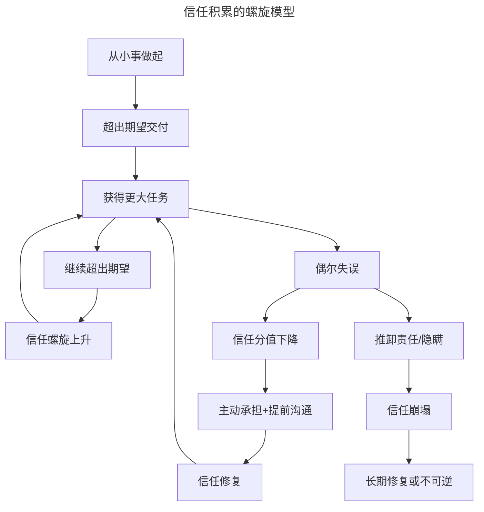
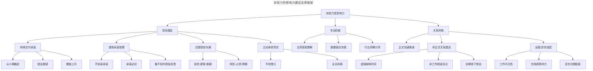
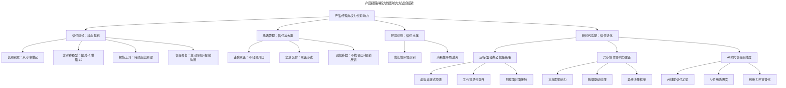

# 17 | 产品经理如何获得非权力性的影响力？

> **适用范围**：产品经理（各阶段）、需要跨职能协作的从业者、创业者、管理者。适用于信任建设、承诺管理、试错沟通、影响力构建、远程/异步协作、AI 时代影响力等场景。
>
> **更新摘要（v2 · 2026-08 更新）**：
> - 结构化升级为 6 节骨架（导言 / 核心方法论 / 关键流程 / 工具与实战 / 常见误区 / 进阶延展）
> - 整合原"更新说明 v2.0"与核心摘要，补充组织行为学理论支撑、远程/混合办公信任策略
> - 保留全部 Mermaid 图并补充 `--- title: ... ---` frontmatter，每张图后追加文字解读

---

## 1. 导言

**"何况异形体，信任为股肱。"——（唐）孟郊**

我曾看过一篇文章，里面提到了 Google 的产品经理招聘要求里有一条，大意是："无需通过汇报关系或权利，就可以影响技术团队和其他跨职能团队，完成任务"。这个要求其实也让不少产品经理很郁闷，没有胡萝卜也没有大棒，不能威逼不能利诱，如何才能对团队施加影响力，让大家聚在一起做事情？

我记得之前有个同行私下里跟我吐槽，说他们 CEO 给他打鸡血说，产品经理就是没有权利的 CEO，他很激动，说没有权利还 CE 哪门子 O，让他自己来试试。

其实，在我看来，这一要求并非不可行。产品经理不依靠权利和汇报关系建立影响力的最好办法，就是建立信任。当大家相信你在推进正确的事情，自然也就愿意聚在你周围，配合你去交付产品特性。

> **核心摘要**：产品经理的非权力性影响力，核心建立在信任之上。信任的积累遵循"做对+1、做错-10"的非对称模型，这意味着信任建设是长期工程，而信任崩塌只需一次失误。本文从建立信任的长期性、试错中的提前沟通策略、承诺管理的重要性、成长性环境识别四个维度展开论述，并新增远程/混合办公场景下的信任建立挑战、异步协作中的影响力建设方法，以及 AI 时代对信任机制的影响分析。

在我看来，在不同职能组成的团队中建立信任的唯一办法，就是持续地、保质保量地交付承诺。产品经理的大部分工作都带着未知，是否有成果要在未来才能检验出来，而这些成果的前提，是需要各种其他角色投入大量的资源和精力。设想一下，如果一个人现在要你投一笔钱到某个基金，什么因素会让你更愿意做出投资的决策？最重要的就是信任，你对这个人，以及这件事情的信任。

---

## 2. 核心方法论

### 2.1 建立信任是个长期的过程

建立信任不是一蹴而就的，好多资历稍微深一点的产品经理刚到一个公司，就想要大刀阔斧地进行改革，重构产品模式，推出新的产品计划。除非你已经是行业内非常有名的产品经理，做成过很多产品，否则这个过程通常会经常碰壁。

之前有同事或朋友换工作，问我到了新的环境怎么落地，我都会建议要从小事做起，多做少说，死磕自己少磕别人，先建立一定的好感与信任，然后再琢磨干大事儿。

这其实就是建立信任的过程，先从小事做起，哪怕就是发个数据日报，甚至帮人整理个产品文档。干干净净，妥妥当当地做好，做到超出期望。坚持一段时间，事情自然就会升级，公司会倾向于交给你更难的任务，也会愿意给你更多的资源。这时继续把新任务做妥当，超出期望地交付，周而复始，信任就会建立起来。

我记得之前看过一句鸡汤，说什么叫人才，人才就是交给他一件事情，他完成了，再交给他一件事情，又完成了。这其实就是建立信任的过程，给你一个人日的开发资源，做一个小需求，你按时交付，做得非常漂亮，那下次给五个人日，又保质保量地交付，再下次试试十个人日，你或许就有机会做项目了。

但注意，很多时候并不是一帆风顺，也会有做砸的时候，做砸的时候会影响你的信任分值。有个公式，说的是每做对一件事情，信任分值可以加 1 分，但做砸一件事，分值会降 10 分。所以一个人在团队中的信任和影响力也是个动态的过程，要时刻保持重视。

拿前面投资基金的例子来类比，如果一个基金经理干了十年，每年收益率都高达 30%，另一个虽然以前收益率也挺高的，但最近三年每年都亏 20%，第三个则是新手，还没有任何业绩历史，你会选择投资哪个？我想，答案一目了然。

### 2.2 信任分值公式的组织行为学解读

"做对+1、做错-10"这个非对称模型，并非经验之谈，而是有深厚的组织行为学和心理学研究支撑：

- **前景理论（Prospect Theory）**：Kahneman 和 Tversky 的经典研究表明，人类对损失的敏感度约为收益的 2-2.5 倍。在信任场景中，"被辜负"的痛苦远大于"被满足"的愉悦，因此信任的损失权重（-10）远高于收益权重（+1）是符合认知规律的。
- **信任不对称性研究**：组织行为学中的信任不对称研究发现（如 Dirks & Ferrin 等人的系列研究），负面事件对信任的破坏力远大于正面事件对信任的建设力。这与我们的+1/-10 模型方向一致。
- **信任修复研究**：Kim 等人（2004）的研究指出，能力型失误（如判断错误）的信任修复相对容易，而品德型失误（如推卸责任、欺骗）的信任修复极其困难。这意味着"做错"的性质不同，扣分幅度也应不同——品德型失误可能不止 -10，而是直接归零。

**信任分值的精细化模型**：

| 事件类型 | 信任分值变化 | 修复难度 | 示例 |
|----------|-------------|----------|------|
| 日常交付完成 | +1 | — | 按时交付需求文档 |
| 超出期望交付 | +2~+3 | — | 提前交付且质量超出预期 |
| 能力型失误 | -3~-5 | 中等 | 需求判断失误导致返工 |
| 流程型失误 | -5~-8 | 较高 | 未提前沟通导致项目延期 |
| 品德型失误 | -20~归零 | 极高 | 推卸责任、隐瞒问题、失信 |

### 2.3 信任积累的螺旋模型

> **图解**：信任积累的螺旋模型——信任通过"从小事做起→超出期望交付→获得更大任务→继续超出期望→信任螺旋上升"的循环持续上升；偶发失误（信任分值下降）可通过"主动承担+提前沟通"修复后回到循环；但推卸责任/隐瞒会导致信任崩塌，长期修复或不可逆。

---

## 3. 关键流程

### 3.1 如何试错

或许有人会问，产品发展不就是个试错的过程吗？总要有做砸的时候，如果做错就会扣分，会不会让大家宁可不做事，也不愿做错事，最终整个团队没人敢于尝试，都缩起头来自保？

首先，一直不做事也是会减分的。如果你长期没有实实在在的产出，大家也一样会丧失对你的信任，而且还耽误了你自己宝贵的时间成本，得不偿失，所以一定不要成为这样的人或待在这样的环境。

其次，对于所有尝试，都一定要进行提前沟通。把目的、逻辑、数据、可能的风险和不确定性因素都提前交代清楚。比如，我们决定为一个内容产品做文章分享功能，我们要说清楚目的是让用户帮助我们筛选和传播优质内容，吸引更多潜在用户；逻辑是用户愿意分享好的内容，而内容可以吸引潜在用户通过二维码或者链接进入产品，最终注册激活成为新用户；数据是我们通过测试发现分享的比例比较高，而且分享内容的用户转化率也不错。于是我们定了一个目标，会有 5-10% 的内容消费用户做分享动作，每个分享的内容可以吸引 5-10 个用户进入，其中 10% 转化为我们的新用户。风险当然是数据估测过于乐观，或许还有分享渠道可能被封禁等等。

把这些沟通清楚之后，哪一环可能会出问题，可能会出什么问题，大家都清楚并且达成一致，万一真的出问题，对产品经理信任度的影响相对小一点。我们还拿刚才的那个例子来看，如果基金的投资策略和风险都交代的很清楚，比如告诉你其中 80% 投资企业债券，20% 投指数基金，即便是最终赔了，或许你对基金经理的责难就能轻一些，毕竟策略和假设早就说清楚了，你对风险和收益有预判。

最后还是要说，即便所有的提前沟通都非常充分，错了，依然要扣分，还是会影响信任，这就是职场的丛林法则，必须认。

**试错沟通的结构化框架**——将提前沟通的方法结构化，可以形成一套可复用的试错沟通框架：

| 维度 | 内容 | 示例 |
|------|------|------|
| 目的（Why） | 为什么要做这个尝试 | 提升用户分享率，获取新用户 |
| 逻辑（How） | 因果链和假设条件 | 分享→曝光→点击→注册→激活 |
| 数据（What） | 支撑决策的数据和基准 | 测试分享率8%，转化率10% |
| 风险（Risk） | 可能出问题的环节 | 分享率低于预期、渠道封禁 |
| 止损线（Stop） | 什么条件下放弃 | 2周内分享率<2%则回滚 |
| 预期（Expect） | 合理的预期范围 | 新用户增长5%-15% |

这种结构化的沟通方式，不仅让团队对风险有预判，更重要的是建立了"理性试错"的文化——试错不是赌博，而是有假设、有数据、有止损的科学实验。

### 3.2 要重视承诺，不要找借口

有的信任是完成被动任务，而更重要的信任是来自于你的主动承诺。你开口承诺一件事情，然后按时成功交付了，这个过程对于建立信任非常有价值，这意味着你的下一次承诺更有力度了。

对产品经理来说，承诺重于生命，在没把握的时候，能不承诺尽量少承诺。可一旦承诺了，就要尽一切可能交付。不要随口答应，也不要态度暧昧，如果做不到就礼貌地拒绝。

比如业务部门来提你需求，当面你不好意思驳人家面子，或许说得模棱两可，结果人家误会了以为可以做，等了两个礼拜看没动静来问你进度，你说还没做，对方对你的信任程度就会降低，你说冤不冤。或者你拍着胸脯说项目一定在某天发布，到了那个点儿没发，可能本身不差那一两天，但下次你再定项目计划的时候，别人就要打个折听了。

我之前的公司有个开发，偶尔会做项目经理，可是答应的时间基本没兑现过，后来每次他做项目经理，公布项目计划发布时间的时候，大家都会半开玩笑地说我们照着这个时间往后加一个礼拜做准备就行，都形成固定人设了。

可是，总有意外，万一承诺了没做到怎么办？牢记三点，第一不要找借口，第二要提前反馈，第三要有耐心在未来逐渐找补回来。不找借口这个挺难的，我对曾经经历过的两次项目延期印象很深，每次延期的时候，项目负责人都会专门做个幻灯片，列出一大堆客观理由，理由中很多一部分都是在推卸责任，让人感觉很糟糕。如果承诺是你给的，就尽可能自己出来背锅，该道歉道歉，把精力放到寻找解决方案上，而不要找借口。说其他人不配合你交付这个承诺，只能说明你没有能力罩得住这么多合作方的大型任务，依然是失职。提前反馈的意思是，当有风险出现，影响到了承诺交付时，尽可能提前进行沟通，发个预警。不要到最后时刻才报告，那样会显得既控制不了局面还缺乏责任心；而且，提前的沟通会暴露问题，更方便尽早引入外力，把影响降到最低。当然，每一次失信还是会有伤害，但是没必要自暴自弃，洗把脸重新出发，依靠未来持续不断地交付新承诺去挽回损失，照样是一条好汉。

**承诺管理的三个层级**：

| 层级 | 行为 | 信任影响 | 典型场景 |
|------|------|----------|----------|
| 谨慎承诺 | 不轻易承诺，做不到时礼貌拒绝 | 中性偏正 | 业务方提需求时说"我评估后回复你" |
| 坚决交付 | 承诺后尽一切可能按时保质完成 | +2~+3 | 承诺周五交付PRD，周四晚完成 |
| 诚信补救 | 做不到时不找借口、提前反馈、主动承担 | -3~-5（可修复） | 发现延期风险，提前2天预警并给出方案 |

---

## 4. 工具与实战

### 4.1 远程与混合办公：信任建立的新挑战

2020 年以来，远程和混合办公模式已成为大量科技公司的常态。根据 McKinsey 2025 年报告，全球约 30% 的知识工作者采用混合办公模式，中国科技企业中这一比例也在持续上升。这种工作模式对产品经理建立非权力性影响力带来了全新的挑战。

**远程环境下信任建立的困难**——非正式交流缺失（办公室里的吸烟室闲聊、午餐交流、走廊偶遇都是建立信任的隐性渠道，远程中几乎消失）；信息不对称加剧（团队成员的工作状态和进度更难感知，"他在不在干活"的疑虑更容易滋生）；情感连接弱化（面对面的表情、语气、肢体语言在文字沟通中被过滤）；时区差异（分布式团队的响应延迟可能被误解为"不重视"或"不靠谱"）。

**远程/混合办公下的信任建设策略**：
1. **创造虚拟的非正式交流空间**：定期组织虚拟咖啡时间（Virtual Coffee）；在 Slack/飞书中建立非工作频道（如 #pets、#books、#food）；利用 Donut 等工具随机配对 1:1 视频聊天。
2. **提高工作的可见性**：主动在团队频道中分享工作进展；使用 Loom、飞书视频消息录制简短工作汇报；在项目管理工具中保持任务状态实时更新。
3. **建立异步协作中的信任规范**：明确响应时间预期（如"工作消息 4 小时内响应，紧急消息 30 分钟内响应"）；文档先行（重要讨论先写文档再开会）；决策透明（重要决策记录在 Confluence/Notion 中，注明决策人、依据和替代方案）。
4. **刻意增加面对面接触**：定期安排线下聚会（如每季度一次团队 Offsite）；关键项目的启动和复盘尽量安排线下。

### 4.2 异步协作中的影响力建设

在远程/混合办公环境中，大量协作是异步进行的。这种模式下，影响力建设需要新的方法：

- **文档即影响力**：一份逻辑清晰、数据充分、方案完整的文档，可以在你不在场的情况下影响决策。产品经理应当将"写好文档"视为建设影响力的核心技能。
- **异步决策框架**：采用 RFC（Request for Comments）或决策文档模式，将提议、讨论和决策过程文档化，让每个人都能在自己的时间内参与，避免"不在场就没有影响力"的困境。
- **数据驱动说服**：在异步环境中，主观说服力被削弱，数据的说服力被放大。用 A/B 测试结果、用户调研数据、竞品分析来支撑你的观点，比"我觉得"更有力。
- **持续可见的贡献**：定期在团队频道中分享行业洞察、用户反馈摘要、产品数据分析，建立"这个人总能带来有价值信息"的认知。

### 4.3 AI 时代的信任新维度

**AI 辅助下的信任加速**——利用 AI 辅助文档撰写、数据分析、竞品研究，可以在更短时间内交付更高质量的产出，加速信任积累；善于利用 AI 工具获取和分析信息的产品经理，能在讨论中提供更全面的数据和洞察，增强说服力；AI 辅助下，产品经理可以更快地响应团队的需求和问题。

**AI 带来的信任风险**——"AI 代写"的信任危机（如果团队成员发现文档、分析全部由 AI 生成而未经深度思考，信任反而会受损）；透明度要求（使用 AI 辅助决策时应当对团队透明，隐瞒 AI 的使用可能在未来被发现时造成信任崩塌）；判断力的不可替代性（AI 可以加速信息处理，但产品经理的核心价值在于判断力，这是 AI 无法替代的，也是信任的真正基础）。

### 4.4 非权力性影响力建设全景框架

> **图解**：非权力性影响力建设全景框架——影响力由信任建设、专业权威和关系网络三大支柱构成。信任建设（持续交付承诺、谨慎承诺管理、试错提前沟通、主动承担责任），专业权威（业务深度理解、数据驱动决策、行业洞察分享），关系网络（正式渠道、非正式关系、远程/异步适配）。

### 4.5 实战要点

| 要点 | 说明 | 适用场景 |
|------|------|----------|
| 从小事做起 | 新环境中先通过小任务建立信任基础 | 入职新公司、接手新团队 |
| 信任非对称性 | 做对+1/做错-10，时刻警惕信任崩塌 | 日常所有工作场景 |
| 试错提前沟通 | 目的-逻辑-数据-风险-止损-预期六要素 | 尝试新功能、新方向时 |
| 谨慎承诺 | 不轻易承诺，做不到时礼貌拒绝 | 业务方提需求时 |
| 坚决交付 | 承诺后尽一切可能按时保质完成 | 所有承诺场景 |
| 诚信补救 | 做不到时不找借口、提前反馈、主动承担 | 项目延期、交付风险时 |
| 虚拟非正式交流 | 创造远程环境下的闲聊和社交空间 | 远程/混合办公团队 |
| 工作可见性 | 主动分享进展，保持任务状态更新 | 远程协作、跨时区团队 |
| 文档即影响力 | 用高质量文档在异步环境中建立专业权威 | 异步协作、跨团队沟通 |
| AI辅助加速 | 利用AI提升交付质量和响应速度 | 文档撰写、数据分析 |
| AI使用透明 | 对团队坦诚AI工具的使用，不隐瞒 | AI辅助产出时 |
| 环境识别 | 识别成长性环境与消耗性环境的信号 | 职业选择、团队评估 |

---

## 5. 常见误区

| 误区 | 表现 | 正确做法 |
|------|------|---------|
| **想一步到位** | 刚入职就想大刀阔斧改革 | 从小事做起，先建立信任再干大事 |
| **忽视信任非对称** | 以为多做对几件事能抵消一次失误 | 做对+1/做错-10，时刻警惕信任崩塌 |
| **不提前沟通试错** | 闷头尝试，出问题才报告 | 提前交代目的、逻辑、数据、风险 |
| **随意承诺** | 随口答应却做不到 | 承诺重于生命，做不到礼貌拒绝 |
| **找借口推卸** | 延期时列一堆客观理由推卸责任 | 主动背锅，不找借口，提前反馈 |
| **不识别环境** | 在消耗性环境中空耗 | 识别成长性环境与消耗性环境信号 |

---

## 6. 进阶延展

### 6.1 不要在不重视承诺交付的环境中工作

最后多啰嗦一点，就是大家要学会识别工作环境。如果你发现你的工作中，那些不交付承诺的人没有受到组织的惩治和淘汰，而相反，交付承诺的人却经常受到伤害；发现大部分人都不重视信任，而你对信任的追求也并没有给你带来更多的机会和不断提高难度的挑战；那这多半不是一个成长性的环境，建议你可以考虑换个地方了。

**成长性环境 vs 消耗性环境的识别信号**：

| 维度 | 成长性环境 | 消耗性环境 |
|------|-----------|-----------|
| 承诺文化 | 交付承诺者获得更多机会 | 承诺无关紧要，画饼者受宠 |
| 试错氛围 | 理性试错被鼓励，失败有复盘 | 失败被惩罚，无人敢尝试 |
| 信任机制 | 信任积累带来影响力 | 关系和权力决定一切 |
| 信息透明 | 决策过程透明可追溯 | 信息被垄断，决策黑箱 |
| 反馈机制 | 坦诚反馈被重视 | 只听好话，报喜不报忧 |

识别环境是产品经理的职业素养之一。在消耗性环境中，无论你多么努力建立信任，回报都是有限的。与其消耗自己，不如尽早转向一个尊重信任和承诺的组织。

### 6.2 方法论框架

> **图解**：产品经理非权力性影响力方法论框架——以信任建设为核心基石，承诺管理为放大器，环境识别为土壤，新时代适配为进化方向，系统构建影响力体系。

### 6.3 延伸阅读

- Dirks & Ferrin, "Trust in Leadership: Meta-Analysis"——组织行为学信任研究经典
- Kim, Ferrin, Cooper & Dirks, "Removing the Shadow of Suspicion"——信任修复研究
- Kahneman & Tversky, "Prospect Theory"——前景理论与损失厌恶
- 《Remote: Office Not Required》——Jason Fried，远程办公信任建设
- 《异步协作手册》——GitLab 远程工作实践
