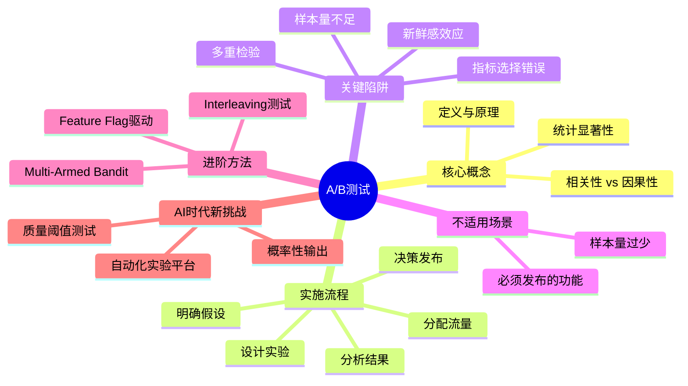
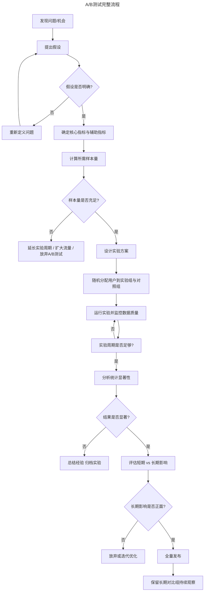
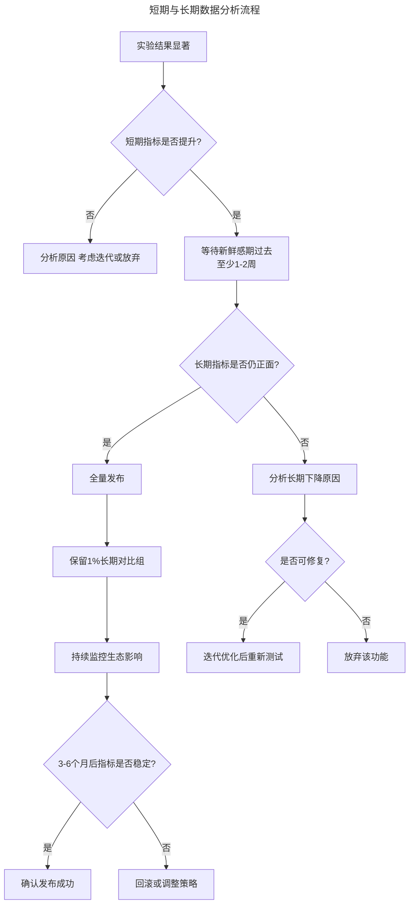
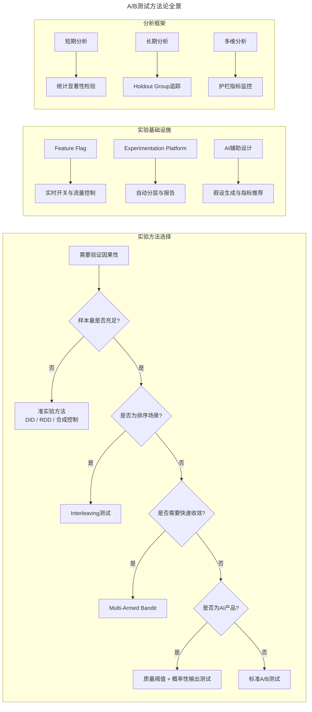

# 18 | 如何搞定A/B测试？

> **适用范围**：产品经理（各阶段）、增长工程师、需要做数据驱动决策的团队负责人。适用于 A/B 测试设计、因果性验证、样本量估算、长期效应评估、AI 产品实验等场景。
>
> **更新摘要（v2 · 2026-08 更新）**：
> - 结构化升级为 6 节骨架（导言 / 核心方法论 / 关键流程 / 工具与实战 / 常见误区 / 进阶延展）
> - 保留 A/B 测试完整流程、隐私设置案例、短期 vs 长期数据、AI 时代新变化
> - 保留全部 Mermaid 图并补充 `--- title: ... ---` frontmatter，每张图后追加文字解读

---

## 1. 导言

A/B 测试，是用两组及以上随机分配的、数量相似的样本进行对比，如果实验组和对比组的实验结果相比，在目标指标上具有统计显著性，那就可以说明实验组的功能可以导致你想要的结果，从而帮你验证假设或者做出产品决定。小到一个按钮用红色好还是用黑色好，大到有没有朋友圈这个功能对微信日活数的影响，都可以通过 A/B 测试来解决。

你可能会认为，A/B 测试很简单啊，只要需要对比一个功能添加前后的指标变化，我就可以进行 A/B 测试。但是，错误往往隐藏在你认为最不容易出错的地方，因此如果你想最大程度地发挥 A/B 测试的作用，你就需要绕过一些"坑"。



> **图解**：A/B 测试——核心概念（定义与原理、统计显著性、相关性 vs 因果性）、实施流程（明确假设→设计实验→分配流量→分析结果→决策发布）、关键陷阱（新鲜感效应、样本量不足、指标选择错误、多重检验）、不适用场景、进阶方法（Multi-Armed Bandit、Interleaving、Feature Flag）、AI 时代新挑战。

---

## 2. 核心方法论

### 2.1 A/B 测试完整流程



> **图解**：A/B 测试完整流程——发现问题→提出假设（假设不明确则重新定义问题）→确定核心指标与辅助指标→计算所需样本量（样本量不足则延长周期/扩大流量/放弃）→设计实验方案→随机分配用户→运行实验并监控数据质量→分析统计显著性→结果显著则评估短期 vs 长期影响→长期影响正面则全量发布并保留长期对比组，否则放弃或迭代优化。

### 2.2 进行 A/B 测试前，你必须明确要测什么、如何测

无论采用哪种测试方法，你都必须在产品测试前弄清楚要测试什么、如何测，这就要求你在设计产品时要先从问题出发做出假设。

比如，你可能会说："微信中'加好友'这个按钮不好找，导致用户加好友的次数不够，我认为把这个按钮从屏幕上方改到下方，可以让体验更顺畅，以增加用户加好友的次数"。这时，你已经明确了需要测试什么、如何测，以及用什么指标来衡量的问题，那接下来就可以进行 A/B 测试了，通过对比"加好友"这个按钮在屏幕上方和下方时，用户使用次数的数据指标，来验证你观点的正确性。如果把这个按钮改到屏幕下方后，用户使用频率增加了，那就可以说明这样的改动达到了目的。

**如果你还不能 100% 清楚你要改变的是什么、提高的是什么，以及用什么指标来衡量，那么 A/B 测试并不适合你。**

> 🟢 **进阶 1-3 年**：每次实验只测一个变量，确保结果可归因。写清楚"如果 X 改变，Y 会怎样"的假设句式。
> 🔵 **资深 3-5 年**：设计指标体系时区分 OEC（Overall Evaluation Criterion）与辅助指标。OEC 是决策的唯一判据，辅助指标用于解释原因和监控副作用。
> 🟣 **专家 5 年+**：构建指标护栏（Guardrail Metrics），确保实验不会伤害核心生态指标。例如，点击率提升但不能以停留时间下降为代价。

### 2.3 验证因果性的唯一途径是 A/B 测试

这里，首先需要明确相关性和因果性是两个不同的概念。因果性是指，因为有 X，才会有 Y。比如，因为用户没有内容可以看，所以他们流失了。而相关性是指，X 变化会导致 Y 变化，但是不能明确 Y 的变化是由 X 的变化引起的。比如，你发现没有内容可以看的用户，流失的比例更高，但是你不能确定是因为没有内容可以看，所以他们才流失的。

**隐私设置案例**——我们做了一款 APP，数据显示启用了"隐私设置"的用户中，活跃用户的比例比较高。单单这个数据，只能说明用户活跃程度和"隐私设置"功能具有相关性，而不能说明这二者之间的因果关系。这里的相关性是指，启用"隐私设置"功能的更可能是活跃用户，而不能确定说"隐私设置"功能可以提升用户的活跃程度。而因果性，就是明确了用户开启"隐私设置"功能后，就可以提升他们的活跃程度。

你可能会问，这个因果关系是怎么形成的？比如用户启用了"隐私设置"功能后，他们可以控制谁能看到他们的内容，而不用再担心被不相关的人看到，所以他们会更放心、更大胆地发新内容，也就变得更活跃了。

那如何通过 A/B 测试，验证用户活跃程度和"隐私设置"功能间是否有因果关系呢？你可以这样设计实验：实验组用户可以使用"隐私设置"的功能，而对照组用户无法使用这个功能，其他实验条件完全一致。结果，A/B 测试显示，"隐私设置"并不能提升用户活跃程度，二者并没有任何因果关系。而活跃用户启用"隐私设置"的比例比较高，原因竟是这个按钮不好找。

在这个例子中，如果你没有进行 A/B 测试，而草率地下决定，把"隐私设置"的按钮做得非常大，鼓励更多用户启用"隐私设置"以提升他们的活跃程度，那最终的结果就是花费了大量的时间改设计、重新开发，却是"徒劳无功"。但是，如果 A/B 测试的结果证明，用户活跃程度和"隐私设置"有因果关系，那么你就可以很自信地把"隐私设置"的功能设计得尽可能得显眼，以提升用户活跃度指标。

**某些功能的优化可能需要整个产品团队花费很多的时间、精力去改设计、重新开发，但是优化后并不能达到预期的效果，这种情况下，你可以先进行 A/B 测试，验证这个功能的优化与指标提升是否具有因果关系。这就是 A/B 测试的魔力，它可以帮助你做出科学、合理的产品决定。**

> 🟢 **进阶 1-3 年**：牢记"相关性≠因果性"，看到数据关联时先问"有没有混杂变量？"，再考虑做 A/B 测试验证。
> 🔵 **资深 3-5 年**：掌握 DID（Difference-in-Differences）、工具变量等准实验方法，在无法做随机实验时逼近因果推断。
> 🟣 **专家 5 年+**：设计"阴性对照实验"——同时运行一个预期无效的实验，如果阴性对照也显著，说明实验系统存在偏差。

---

## 3. 关键流程

### 3.1 明确到底需不需要 A/B 测试

A/B 测试适用的场景是，你的产品功能有多种选择，而你需要通过数据做出选择，这也就意味着并不是所有功能上线前都要经过 A/B 测试。

**第一种情况是，无论新功能上线后的数据怎么样，都要发布这个新功能，这时你要做的是如何优化用户体验，而完全没有必要进行 A/B 测试。** 比如，一些功能是法律规定的，或者是属于公司策略性的，这些功能无论如何都要发布。

**第二种情况是，样本数量太少，不能通过 A/B 测试得出合理、科学的结论。** 比如，你要测试某个按钮的颜色设置为红色、绿色、蓝色，还是紫色的效果好，那么进行 A/B 测试时，你就需要至少 4 组对比实验，而且要确保每一组实验都有足够的样本数量来保证对比结果具有统计显著性。如果这个按钮一共才 20 个人用，每组只有 5 个用户，那么得出的实验结果必然带有很大的偶然性，你无法根据这个实验数据做出科学的结论。这种情况下，你如果还要通过 A/B 测试做产品决定，那你就必须增加样本数量。

**那么需要达到什么样的实验样本规模，才可以进行 A/B 测试呢？** 这个问题没有一个明确的答案，往往取决于你的产品实验组和对比组之间的区别到底有多大。比如，Facebook 的朋友圈（News Feed），它是世界上最大的信息流产品，如果增加一个新功能可以让日活数增加 1%，那这个功能就是巨大的成功。这时，A/B 测试需要的样本数量就非常大，才能保证这 1% 的进步具有统计显著性而不是误差。但是，很多创业公司，它们的产品思路还没有定型，产品功能千变万化，有时一个新功能的发布可以将产品指标提升 100%。这种情况下，即使没有那么多的样本数量，你也可以肯定这个新功能可以给产品指标带来质的飞跃。

> 🟢 **进阶 1-3 年**：实验前用在线样本量计算器（如 Evan Miller's Calculator）估算所需样本，避免"跑完才发现不够"的尴尬。
> 🔵 **资深 3-5 年**：掌握 MDE（Minimum Detectable Effect）的概念——在有限流量下，选择能检测到的最小效应量，而非盲目追求检测微小差异。
> 🟣 **专家 5 年+**：建立实验优先级框架，用 ICE 评分（Impact × Confidence × Ease）排列实验队列，将有限流量分配给最高优先级实验。

### 3.2 短期数据 vs 长期数据



> **图解**：短期与长期数据分析流程——实验结果显著后先看短期指标是否提升，等待新鲜感期过去（至少 1-2 周）再看长期指标是否仍正面：正面则全量发布并保留 1% 长期对比组持续监控；长期下降则分析原因，可修复则迭代优化重新测试，否则放弃该功能。

如果微信的"摇一摇"突然出现在了微信开启页面里，那我可以肯定，"摇一摇"功能的用户使用量会直线上升。这时，设置一个 A/B 测试。实验组的"摇一摇"设置在微信开启页面，而对照组的"摇一摇"依然保留在"发现"页面，短期内肯定是实验组的数据更好看。但是，如果你根据前两天的数据，就直接得出"摇一摇"在微信开启页面的效果会更高的结论，那我会觉得你这个产品经理是不可信的。

为什么呢？因为你没有意识到新功能的短期新鲜感和长期的生态系统影响。微信开启页面突然出现"摇一摇"的功能，用户使用数据会因为刚开始的新鲜感而非常好看，用户这时正在劲儿头上。但是，这个"好看"的数据可以延续么？并不是每个新功能或者产品都可以延续这样的势头，大部分产品的新鲜感只能持续一个星期，最多一个月。新鲜感的劲儿头过后，产品的数据会直线下降，可以说是成了"持续低迷"，再也提不上来了。

很多产品经理就是犯了这样的错，因为前几天"好看"的数据过早的下了结论，最终产品发布后的表现远不如预期得好。所以我的建议是，在判断一个功能是不是值得发布时，你应该等至少一个星期、短期的新鲜感褪去后，再衡量是否值得发布。另外，如果你通过 A/B 测试的结果决定要发布这个产品，我还建议你应该留一个长期的对比实验组，比如 1% 的用户无法使用新产品，来观察这个产品对整个生态系统产生的影响，并适时作出调整。

**Instagram"超级赞"案例**——假如 Instagram 要增加一个给好友点"超级赞"的功能，目的是提高用户分享的频率。刚开始用户的活跃程度确实提高了，因为有了"超级赞"，他们发新鲜事兴致高昂，分享数量大幅度提升，短期数据棒极了。但从长期来看，增加了"超级赞"的功能后，用户会因为只是得到了"赞"而没有获得"超级赞"，而感觉自尊心受损，最终不愿意也不敢分享了，所以从长期来看是数据下降了。

> 🟢 **进阶 1-3 年**：任何实验至少运行 1-2 周再下结论，不要被前 3 天的数据冲昏头脑。
> 🔵 **资深 3-5 年**：设计"时间切片分析"——按天/周拆解指标趋势，识别新鲜感衰减曲线，用差分法分离短期效应与长期效应。
> 🟣 **专家 5 年+**：构建"长期持有组"（Holdout Group）机制，1%-5% 用户长期不接触新功能，持续 6-12 个月追踪 LTV、留存等滞后指标，评估生态级影响。

---

## 4. 工具与实战

### 4.1 AI 时代的 A/B 测试新变化

**AI 辅助实验设计**——传统 A/B 测试最大的成本不在运行，而在设计。2024 年以来，LLM 正在重塑实验设计环节：假设生成（基于历史实验数据和用户反馈，AI 可以自动生成候选假设）；指标推荐（AI 分析功能变更的影响面，推荐主指标和护栏指标组合）；样本量预估（基于历史方差数据，AI 自动计算各实验所需的最小样本量和运行周期）。

**自动化 A/B 测试平台**——现代实验平台已经从"手动配置"进化到"自助式+自动化"：

| 能力 | 传统方式 | 现代平台 |
|------|---------|---------|
| 实验配置 | 手动写代码 | Feature Flag一键开关 |
| 流量分配 | 固定比例 | 自适应流量分配 |
| 结果分析 | 手动跑SQL | 自动计算显著性+效应量 |
| 多实验并行 | 互斥分层 | 正交分层实验 |
| 异常检测 | 人工巡检 | 自动预警数据异常 |

**AI 产品 A/B 测试的特殊性**——AI 产品的输出具有概率性，这给 A/B 测试带来了全新挑战：

**概率性输出问题**：同一个用户输入，AI 产品可能给出不同结果。传统 A/B 测试假设同一组用户体验一致，但 AI 产品中同一用户每次体验都可能不同。解决方案是增加同一用户内的重复采样，或用"体验一致性"作为辅助指标。

**质量阈值测试**：AI 产品的质量不是简单的"好/坏"，而是存在质量分布。A/B 测试不仅要看平均指标，还要关注质量的长尾分布——P50、P90、P99 的用户体验是否都达标。一个平均分提升但 P99 恶化的实验，可能需要被否决。

**延迟与质量的权衡**：AI 推理延迟直接影响用户体验，A/B 测试需要同时追踪质量指标和延迟指标，找到帕累托最优点。

### 4.2 多臂老虎机（Multi-Armed Bandit）

传统 A/B 测试在实验期间固定流量分配，即使某组明显更差也会持续分配流量，造成机会成本。Multi-Armed Bandit 算法动态调整流量分配——表现好的变体获得更多流量，表现差的变体自动减少流量。

```
传统A/B测试：  A组 50% ──────────────→ 分析 → 决策
               B组 50% ──────────────→ 分析 → 决策

MAB算法：      A组 50% → 40% → 25% → 10%（表现差，自动减流）
               B组 50% → 60% → 75% → 90%（表现好，自动加流）
```

MAB 适合的场景：流量成本高、实验变体多、需要快速收敛。不适合需要严格统计推断的场景。

> 🟢 **进阶 1-3 年**：了解 MAB 的基本思想，知道什么时候该用传统 A/B、什么时候可以用 MAB 加速决策。
> 🔵 **资深 3-5 年**：在 AI 产品实验中设计"质量-延迟"双指标评估框架，掌握分层实验（Layered Experimentation）的流量正交分配。
> 🟣 **专家 5 年+**：构建组织级实验平台，实现 Feature Flag 驱动的持续实验文化，设计 AI 产品的评估体系（包括公平性、安全性等非常规指标）。

### 4.3 最新实践（2024-2026）

**Feature Flag 驱动实验**——Feature Flag（功能开关）将代码部署与功能发布解耦，使 A/B 测试从"发版实验"进化为"实时实验"：开发人员合并代码但不影响用户；产品经理通过 Flag 控制功能的开关和流量比例；实验结束后一键全量或一键回滚，无需重新部署；支持渐进式发布（1% → 5% → 25% → 50% → 100%）。主流工具：LaunchDarkly、Unleash、Statsig、自建平台。

**Experimentation Platform**——大型科技公司已建立统一的实验平台，核心能力包括：实验设计向导；自动分层（多个实验自动分配到不同正交层）；实时监控面板；自动报告生成（自动生成包含效应量、置信区间、p 值、样本量检验的完整报告）；实验知识库。代表案例：Microsoft 的 ExP 平台、Google 的 Causal Impact、Meta 的 Deltalab。

**Interleaving 测试**——当 A/B 测试需要大量样本和长时间运行时（如搜索排序算法），Interleaving 测试提供了一种更高效的替代方案。原理：不将用户分为两组，而是将两个算法的结果混合呈现给同一用户，通过用户对混合结果的点击偏好判断哪个算法更优。优势：所需样本量仅为传统 A/B 测试的 1/100 到 1/10，因为每个用户自身就是对照。局限：仅适用于排序类场景（搜索、推荐、信息流），无法测试 UI 交互变更。

### 4.4 方法论全景图



> **图解**：A/B 测试方法论全景——实验方法选择（样本量不足用准实验方法、排序场景用 Interleaving、需快速收敛用 Multi-Armed Bandit、AI 产品用质量阈值测试）、实验基础设施（Feature Flag、Experimentation Platform、AI 辅助设计）、分析框架（短期统计显著性、长期 Holdout Group 追踪、多维护栏指标监控）。

---

## 5. 常见误区

| 误区 | 表现 | 正确做法 |
|------|------|---------|
| **相关性当因果** | 数据显示相关就下因果结论 | 用 A/B 测试验证因果性 |
| **忽略新鲜感效应** | 用前几天"好看"的数据过早下结论 | 等至少 1-2 周新鲜感褪去再判断 |
| **样本量不足** | 样本太少，结果带偶然性 | 计算所需样本量，确保统计显著性 |
| **必须发布还做 A/B** | 法律规定/策略性功能也做测试 | 必须发布的功能做体验优化，不必测试 |
| **忽视长期生态影响** | 只发布不留长期对比组 | 保留 1% 长期对比组，持续观察生态影响 |

---

## 6. 进阶延展

### 6.1 关键术语表

| 术语 | 英文 | 定义 |
|------|------|------|
| 统计显著性 | Statistical Significance | 实验结果差异由偶然因素产生的概率低于阈值（通常p<0.05），可以认为差异真实存在 |
| 效应量 | Effect Size | 实验组与对照组之间差异的大小，不仅关注"是否显著"，更关注"显著多少" |
| 置信区间 | Confidence Interval | 真实效应量以一定概率（通常95%）落入的区间范围 |
| MDE | Minimum Detectable Effect | 在给定样本量和统计功效下，实验能够可靠检测到的最小效应量 |
| OEC | Overall Evaluation Criterion | 实验的核心决策指标，所有实验结论以此为准 |
| 护栏指标 | Guardrail Metrics | 用于监控实验副作用的指标，确保实验不会伤害核心生态 |
| 新鲜感效应 | Novelty Effect | 用户因新功能的新奇感而短期提升使用量，但长期回落的效应 |
| Holdout Group | 长期对比组 | 产品发布后仍保留的小比例对照组，用于追踪长期生态影响 |
| Feature Flag | 功能开关 | 将代码部署与功能发布解耦的技术，支持实时开关和流量分配 |
| 正交分层 | Orthogonal Layering | 多个实验分配到不同层，层间流量正交，使实验互不干扰 |
| Interleaving | 交叉测试 | 将两个算法结果混合呈现给同一用户，通过偏好判断优劣 |
| MAB | Multi-Armed Bandit | 动态调整流量分配的算法，表现好的变体自动获得更多流量 |
| DID | Difference-in-Differences | 准实验方法，通过比较处理组和对照组在干预前后的差异变化来推断因果 |
| 功效 | Statistical Power | 当真实效应存在时，实验能正确检测到的概率（通常要求≥0.8） |

### 6.2 思考题

- 🟢 **基础层（1-3 年）**：① 你有没有经历过哪些产品（或者功能）的短期数据很好看，而长期数据却不好看？出现这个问题后，负责的产品经理是怎么处理的？② 如果你的实验结果显示 p=0.06，略高于 0.05 的显著性阈值，你会怎么做决定？
- 🔵 **进阶层（3-5 年）**：① 你负责的产品同时有 3 个团队想跑 A/B 测试，但总流量只够支持 2 个实验，你会如何分配？请设计一个优先级框架。② 当 A/B 测试的短期指标和长期指标方向相反时（短期提升但长期下降），你会如何向利益相关者解释和决策？
- 🟣 **专家层（5 年+）**：① 设计一个 AI 聊天机器人的 A/B 测试框架，需要同时评估回答质量、响应延迟、用户满意度和安全性四个维度。你会如何定义 OEC 和护栏指标？② 在网络效应强的社交产品中，用户行为互相影响，传统 A/B 测试的 SUTVA 假设被打破。你会如何设计实验来应对这种溢出效应？

### 6.3 延伸阅读

- **《Trustworthy Online Controlled Experiments》** — Ron Kohavi, Diane Tang, Ya Xu 著。A/B 测试领域的权威著作
- **《Designing Experiments on Networks》** — 网络效应下的实验设计
- **Microsoft ExP Platform 论文** — "Online Controlled Experiments at Large Scale"
- **Google Overlapping Experiment Infrastructure 论文** — 正交分层实验系统的经典论文
- **Evan Miller's A/B Testing Tools** — evanmiller.org，实用的样本量计算器
- **"Interleaving for Online Ranking Evaluation"** — Interleaving 测试方法的原始论文
