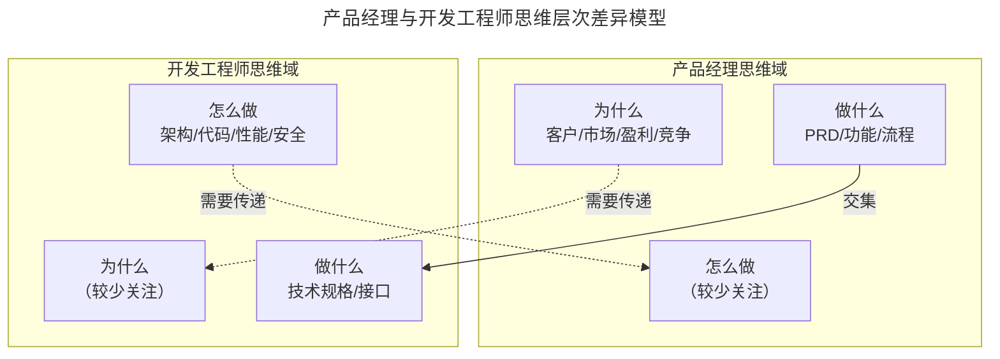
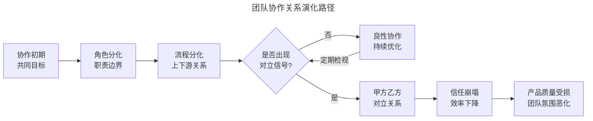
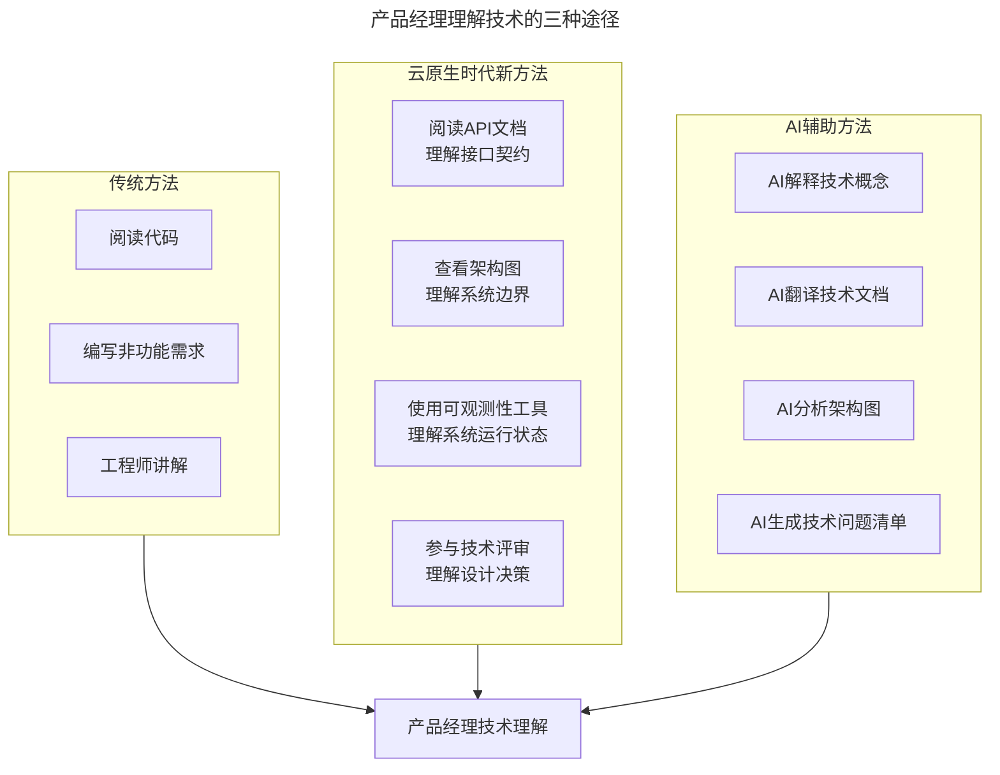
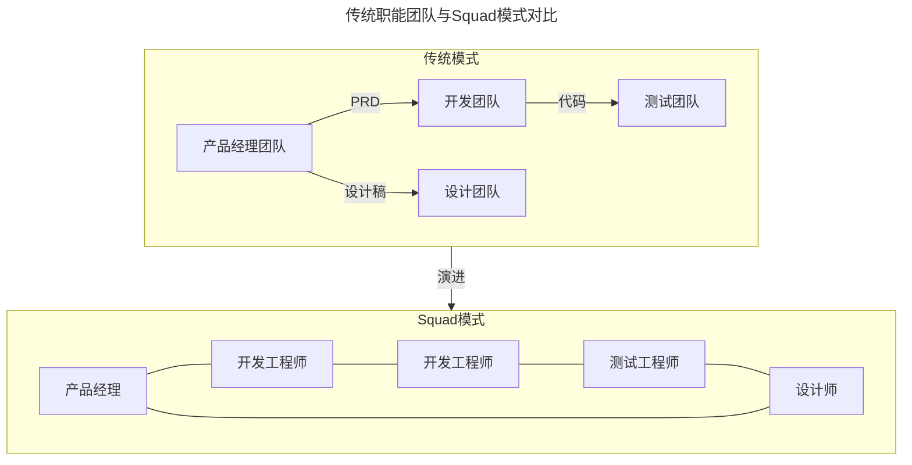
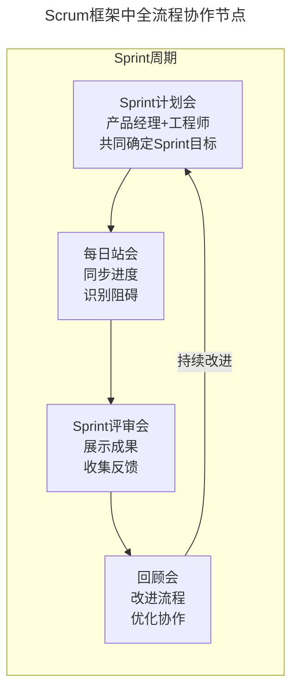
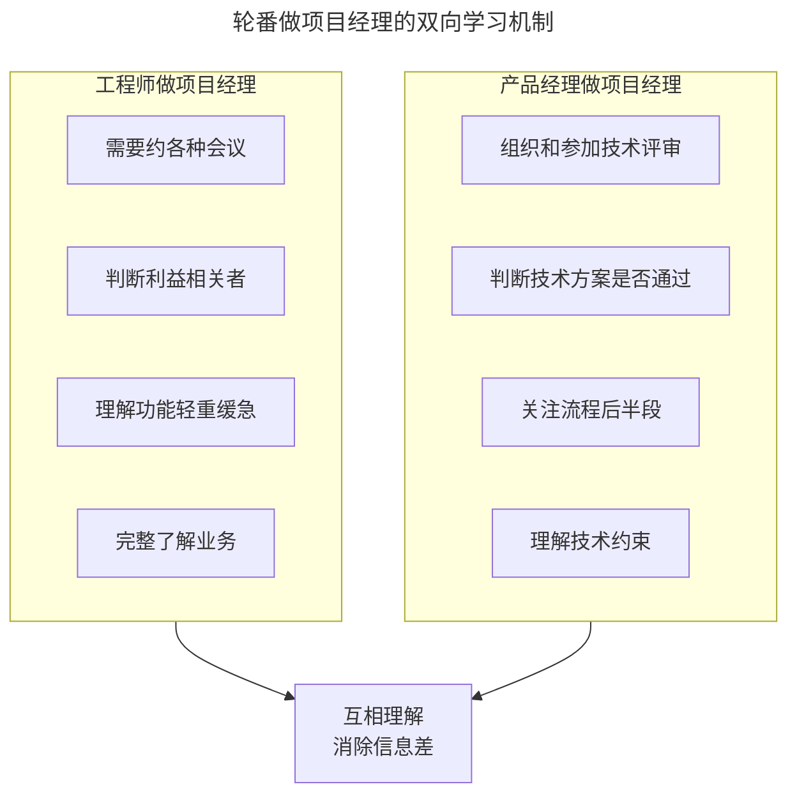
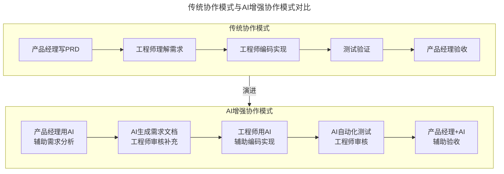
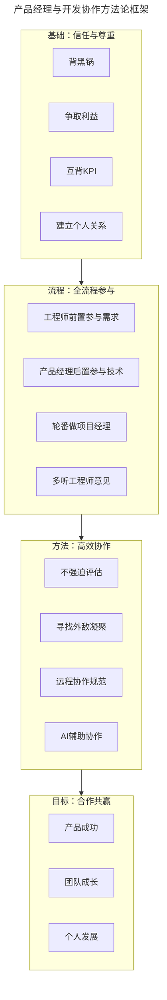

# 产品经理如何与开发打交道

> **适用范围**：产品经理（各阶段）、需要与开发协作的团队负责人、创业者。适用于跨职能协作、思维差异理解、全流程参与、AI 时代人机协作等场景。
>
> **更新摘要（v2 · 2026-08 更新）**：
> - 结构化升级为 6 节骨架（导言 / 核心方法论 / 关键流程 / 工具与实战 / 常见误区 / 进阶延展）
> - 合并"打破思维的边界"（上）与"从协作到共赢"（下）为单篇完整文档
> - 保留全部 Mermaid 图并补充 `--- title: ... ---` frontmatter，每张图后追加文字解读

---

## 1. 导言

**"横看成岭侧成峰，远近高低各不同。"——苏轼**

在产品经理的日常工作中，开发工程师可能是我们打交道最多的角色，然而这两个角色之间却存在诸多难以调和的矛盾。网络上关于开发工程师怒怼产品经理的创作层出不穷，各种吐槽图片和文章俯拾即是。在技术会议上，甚至流传着这样的段子：不同公司相互陌生的工程师，都靠吐槽自己公司产品经理迅速建立了友谊。这种现象背后，折射出的是两个角色深层次的思维差异。

> **核心摘要**：产品经理与开发工程师之间的矛盾，本质上源于思维方式的差异——产品经理关注"为什么"与"做什么"，而工程师聚焦"做什么"与"怎么做"。这种差异若不被理解，会演变为甲方乙方式的对立关系。合作共赢需要双方全流程参与、互相理解、共同担责。在云原生与 AI 时代，产品经理需要掌握新的技术理解方法，借助 API 文档、架构图、AI 辅助工具等手段，打破思维边界，建立真正的协作关系。

---

## 2. 核心方法论

### 2.1 思维差异的本质：三层思维模型

面对产品或特性时，产品经理和开发脑子里装的东西截然不同：

**产品经理的思维层次**：
- **为什么（Why）**：客户需求、市场机会、盈利模式、竞争优势、政策风险、获客渠道
- **做什么（What）**：PRD 文档、功能需求描述、交互设计、业务流程
- **怎么做（How）**：较少关注，通常认为"技术实现是工程师的事"

**开发工程师的思维层次**：
- **为什么（Why）**：较少关注，通常认为"业务决策是产品经理的事"
- **做什么（What）**：功能需求、技术规格、接口定义
- **怎么做（How）**：系统架构、技术栈选择、代码实现、性能优化、安全防护

> **图解**：产品经理与开发工程师的思维层次差异模型——双方共同关注"做什么"（交集），产品经理独有关注"为什么"（需要传递），工程师独有关注"怎么做"（需要传递），虚线表示需要主动传递的信息流。

### 2.2 思维差异的后果

作为产品经理，我们常常低估一个特性背后的技术成本。看什么都觉得简单——"淘宝也有这个特性，为什么工程师说做不了？"尤其是在业务初期，为了快速推进，工程师在实现上会做一些临时的技术债务。后期随着流量和复杂度提高，即便功能没变，也要花费大量精力去调整技术架构。这些"水面下的工作"，产品经理往往看不见。

久而久之，不理解演变为不信任，越不信任越缺乏交流，最终形成对立。这种对立不仅影响工作效率，更会损害产品质量和团队氛围。

### 2.3 甲方乙方：从合作到对立的信号

**组织演化的必然趋势**——大部分公司在设计组织时，都会把产品和开发放在一起，希望两个角色合力完成产品的设计和实现。但随着团队规模扩大，角色分化随之而来，流程分化紧随其后，慢慢形成了甲乙方或上下游关系。

**识别对立的四个信号**——如何分辨团队从合作关系变成甲方乙方关系？以下四个信号值得警惕：

| 信号 | 表现 | 风险等级 |
|------|------|----------|
| **留证据** | 口头沟通不算数，必须邮件确认、签字画押 | 中 |
| **开小会** | 正式会议前先开内部小会，商量"对付对方"的策略 | 高 |
| **用词谨慎** | 沟通时措辞越来越谨慎，避免"把柄" | 中 |
| **区分你我** | 闲聊时区分"我们"和"他们"，通过第三方了解对方评价 | 高 |

> **图解**：团队协作关系演化路径——协作初期（共同目标）→角色分化（职责边界）→流程分化（上下游关系）→是否出现对立信号：否则良性协作持续优化（定期检视），是则甲方乙方对立关系→信任崩塌→效率下降→产品质量受损。菱形节点为关键决策点，"对立关系"之后的节点为需警惕的负面状态。

---

## 3. 关键流程

### 3.1 打破边界：沟通与理解

**核心原则：互通有无**——克服矛盾的关键在于沟通。产品经理要把"为什么"告诉开发，让开发把"怎么做"告诉产品经理。彼此说清楚顾虑和困难，英文里有个说法叫"on the same page"——双方能看到彼此看到的东西，互诉衷肠，互相温暖。

**专程交代业务规划和产品价值**——不要只在需求评审时才介绍产品来龙去脉，要拿出专门的时间和精力做沟通。在闲聊、下午茶、一起吃饭时，不讲项目和需求，而是讲：目前产品的状态；为什么要做现在的东西；之前做的东西近况如何；业务目前是什么状态；接下来可能向什么方向发展。

为什么这样做有效？在项目沟通时，工程师会本能地有所防备——你有企图心，想说服他们投入时间和精力。但专程沟通时，企图心被放下，久而久之就会产生共鸣。一开始这样做可能显得"像个神经病"，但坚持下来，工程师会理解你是在真诚沟通。最终效果是：当你真的开始提需求时，工程师会非常理解，有种心照不宣的默契。

### 3.2 掌握技术概念与技术语言

**传统方法：看代码与写非功能需求**——每个公司都有技术栈，技术栈有不同的特点。方法一：阅读代码（效率不高但非常扎实，适合有编程背景的产品经理）；方法二：编写非功能需求（可用性要求 SLA、安全性要求防注入/防 XSS、浏览器/设备兼容性、性能指标响应时间/并发量）。通过编写非功能需求，产品经理可以理解"水面下的工作量"——做一个简单的文本框可能需要大量安全防护工作。

**云原生时代的新方法**——在微服务、云原生架构普及的今天，产品经理有了更多理解技术的方式：阅读 API 文档（理解系统提供了哪些能力、数据结构、业务逻辑、系统边界）；查看架构图（理解系统由哪些服务组成、服务间依赖关系、数据流向、技术债务）；使用可观测性工具（如 Grafana、Jaeger，查看系统运行状态、理解用户行为路径、发现性能瓶颈）；参与技术评审（理解设计决策）。

> **图解**：产品经理理解技术的三种途径——传统方法（阅读代码、编写非功能需求、工程师讲解）、云原生时代新方法（阅读 API 文档、查看架构图、使用可观测性工具、参与技术评审）、AI 辅助方法（AI 解释技术概念、翻译技术文档、分析架构图、生成技术问题清单）。

**AI 辅助理解技术**——2023 年以来，大语言模型为产品经理理解技术提供了全新工具：

| AI应用场景 | 具体用法 | 效果 |
|------------|----------|------|
| **概念解释** | "用产品经理能理解的语言解释什么是微服务" | 快速建立认知 |
| **文档翻译** | 将技术文档翻译为业务语言 | 降低理解门槛 |
| **架构分析** | 上传架构图，让AI解释各组件作用 | 系统性理解 |
| **问题生成** | 让AI生成与技术方案相关的问题清单 | 提升沟通质量 |
| **代码解读** | 让AI解释某段代码的业务含义 | 理解实现逻辑 |

**实践建议**：使用 AI 时要注意验证，AI 可能产生"幻觉"。建议将 AI 作为初步理解的工具，再与工程师确认关键信息。

### 3.3 新组织范式：Product Engineer 与 Squad 制

**Product Engineer 的兴起**——近年来，一种新的角色正在兴起——Product Engineer。这类工程师不仅关注"怎么做"，也深度参与"为什么"和"做什么"的讨论。Product Engineer 的特征：具备产品思维，能从用户角度思考问题；主动参与产品决策，提出建设性意见；关注业务指标，理解技术实现与业务价值的关联；能够独立做出产品层面的权衡。对于产品经理而言，与 Product Engineer 合作是理想状态。但现实中，大多数工程师仍需要产品经理来传递"为什么"。

**Squad 制的实践**——Spotify 推广的 Squad 制（小队制）为产品与开发的协作提供了新范式：

> **图解**：传统职能团队与 Squad 模式对比——传统模式（产品团队→PRD→开发团队→代码→测试团队，线性上下游）；Squad 模式（跨职能小团队围绕产品目标紧密协作，环形网状连接）。Squad 制核心特点：跨职能小团队（通常 8-12 人）；团队对产品目标负责，而非对职能负责；长期稳定合作，而非临时组建；自主决策，减少审批流程。在 Squad 制下，产品经理与开发工程师的边界更加模糊，协作更加紧密，"甲方乙方"的问题自然减少。

### 3.4 全流程参与：打破上下游壁垒

**核心原则**：让工程师尽可能早地参与流程，让产品经理尽可能晚地从流程中退出。

**工程师前置参与**——早期非正式沟通：当某个业务有苗头时，产品经理就应该开始跟工程师交流。注意不要正式提需求，而是做非正式沟通；后期如有变化，不会让工程师觉得你出尔反尔；避免带着截止期限的突然袭击。反面案例：11 月 3 日通知工程师"11 月 11 日大促，三个需求尽快做"——这种带着截止期限的突然袭击会让工程师非常反感。邀请工程师参与需求过程：一定要邀请工程师参与项目前期的需求收集和需求评审，让工程师更全面了解项目和特性的目的、理解不同利益相关者的顾虑和立场、理解产品经理对产品细节的坚持。

**产品经理后置参与**——产品经理也要主动往流程后半部分延伸，参与设计、开发、上线中的技术部分。典型场景：线上故障处理。优秀产品经理问具体什么问题，需不需要帮助，协调资源规避问题（如临时免费、绕过故障流程）。**注意**：产品经理可以参与，但不要添乱。工程师在紧急写补丁时，不要拉着人家说"别写，先给我讲讲"。

**敏捷框架中的全流程参与**——在 Scrum 框架中，全流程参与有了更制度化的保障：

> **图解**：Scrum 框架中产品经理与工程师的全流程协作节点——Sprint 计划会（共同确定 Sprint 目标）→每日站会（同步进度识别阻碍）→Sprint 评审会（展示成果收集反馈）→回顾会（改进流程优化协作）→持续改进回到 Sprint 计划会。每个仪式都是双方共同参与的机会。在 SAFe（Scaled Agile Framework）大规模敏捷框架中，产品经理的角色进一步扩展为 Product Manager 和 Product Owner 的分层协作。

### 3.5 多听工程师的意见

**摆正心态**——在产品设计过程中，要多鼓励工程师给产品经理提意见。产品经理的心态：不能听不得反对意见，觉得工程师都是在指手画脚；工程师角度提出的想法有时非常有价值；他们能指出逻辑缺陷，或从可行性角度提出更有创造力的实现方法。工程师的心态：不能觉得产品做成什么样子跟自己没关系；不能认为"做不好是产品经理背锅"。**长期后果**：如果产品经理总是不愿意听取工程师建议，时间久了大家都不愿意提建议，状态越来越被动，隔阂越来越深。

**轮番做项目经理**——让工程师和产品经理轮番做项目经理，是一种非常有效的互相理解方法：

> **图解**：轮番做项目经理的双向学习机制——工程师做 PM 时被迫理解业务（约会议、判断利益相关者、理解轻重缓急、完整了解业务），产品经理做 PM 时被迫理解技术（组织技术评审、判断技术方案、关注流程后半段、理解技术约束），共同达成互相理解消除信息差。

### 3.6 不要强迫工程师做评估

这是产品经理常犯的错误——强迫工程师给出精确的发布时间点，不给的话就说不负责任。但很多时候工程师确实无法给出具体发布时间点。

| 错误做法 | 后果 | 正确做法 |
|----------|------|----------|
| 强迫给出精确时间点 | 工程师随便定一个，结果还是延期，关系闹僵 | 做模糊处理，如"7月第一周"而非"7月1日" |
| 代替工程师做评估 | 承诺无法兑现，损害信任 | 让工程师自己来做预判 |
| 评价工程师的评估 | "这有什么难的，腾讯早做出来了" | 理解技术基础和积累不同，不做简单横向对比 |
| 在评估时施压 | 工程师给出保守估计后继续压缩 | 尊重评估结果，在关键路径前后留缓冲 |

**AI 时代的评估辅助**——AI 工具为工期评估提供了新的辅助手段：历史数据参考（AI 可以分析类似项目的历史工期数据）；代码复杂度评估（AI 工具可以初步评估代码改动范围和复杂度）；依赖分析（AI 辅助识别任务间的依赖关系和潜在风险）。但要注意：AI 只能提供参考，最终评估仍应由工程师做出。产品经理可以用 AI 生成的参考数据来更好地理解评估结果，而非用来质疑工程师的判断。

### 3.7 背黑锅与争取利益

**产品经理的天职：背黑锅**——产品经理要勇敢地、毫不犹豫地在第一时间站出来帮工程师承担责任。要有这样的姿态，不要往后躲。并不是说工程师不能自己承担责任，工程师一般也都不是软蛋，但产品经理应该有这样的意识和态度。让大家知道这个产品经理是敢去担当的——不能跟人家看月亮的时候叫人家小甜甜，出了事儿又喊牛夫人。长此以往，工程师就不愿意依赖和相信你了。

**帮工程师争取利益**——产品经理一定要帮工程师争取利益。很多时候产品经理是有这个渠道的——产品经理会跟技术主管有更多的接触。具体做法：给优秀的工程师争取利益，努力帮他做背书；施加影响力帮他晋升、加薪；有些工程师比较腼腆，在争取利益上很儒雅，产品经理应该帮他争取；他很多优秀的地方或许只有你有机会看到，要勇于去表达。

### 3.8 互背 KPI，同仇敌忾

**互背 KPI**——产品经理的 KPI 一般是产品指标、业务指标，而工程师可能是可用性、特性交付等。建议产品经理背一点工程 KPI（如稳定性和可用性）：让产品经理对工程师的顾虑有切身的理解；不能说不在乎系统挂不挂，随意上线；防止立场对立——跟工程师谈具体项目时，开发有时会以影响稳定性作为推脱，如果稳定性也是产品经理的 KPI，很多事情就容易沟通。建议工程师背一点业务 KPI：让工程师理解业务压力和紧迫性；避免纯技术视角的决策；增强团队对业务目标的共同责任感。

**寻找外敌凝聚团队**——这个说起来有点腹黑，但确实非常好用。当有共同的敌人时，团队就更容易结合在一起。**"外敌"的层次**：行业级外敌（如制药公司 vs 癌症、新能源 vs 传统化石能源，凝聚力最强）；竞争级外敌（如对标竞品的核心指标、市场份额争夺，凝聚力中等）；内部对标（如与兄弟团队比拼、季度 OKR 竞赛，凝聚力较弱，但最容易操作）。实践建议：在内部找一个具体的竞争对手，把业务指标对标起来；大家本着这个指标去努力，很多内部矛盾会被消解；团队空前团结，效率自然提升。

---

## 4. 工具与实战

### 4.1 远程协作：新挑战与新方法

**远程/混合办公的协作挑战**——2020 年以来，远程和混合办公模式成为常态，产品经理与开发工程师的协作面临新挑战：

| 挑战 | 具体表现 | 应对方法 |
|------|----------|----------|
| **沟通减少** | 非正式沟通机会消失（吸烟室、下午茶） | 定期安排非正式线上交流 |
| **信任难建** | 缺乏面对面互动，信任建立缓慢 | 增加视频沟通，减少纯文字交流 |
| **信息不对称** | 看不到对方的工作状态和困难 | 使用协作工具透明化工作进展 |
| **时区差异** | 分布式团队响应延迟 | 建立异步协作规范，明确响应时间 |
| **文化差异** | 跨地区/跨国团队理解偏差 | 建立共享文档，统一术语和流程 |

**远程协作的最佳实践**——建立异步协作规范（文档驱动：重要决策必须有文档记录；录屏分享：用 Loom 等工具录制需求讲解视频；异步评审：使用 Figma/Confluence 的评论功能进行异步评审）；保持非正式沟通（定期安排虚拟咖啡时间 Virtual Coffee；创建非工作话题的 Slack 频道；组织线上团建活动）；透明化工作进展（使用 Jira/Linear 等工具让工作状态可视化；定期分享产品数据和技术进展；建立共享的产品-技术看板）。

### 4.2 AI 时代的产品与开发协作新模式

2023 年以来，大语言模型和 AI 编程助手的普及，正在重塑产品经理与开发工程师的协作方式：

> **图解**：传统协作模式与 AI 增强协作模式对比——传统模式（产品经理写 PRD→工程师理解需求→编码实现→测试验证→产品经理验收，线性）；AI 增强模式（AI 辅助需求分析→AI 生成需求文档工程师审核→AI 辅助编码→AI 自动化测试工程师审核→产品经理+AI 辅助验收）。AI 在需求分析、编码实现、测试验证等环节提供辅助，但核心决策仍由人做出。

**AI 辅助的具体场景**——需求阶段：AI 辅助将模糊需求转化为结构化用户故事；AI 分析历史需求数据识别遗漏场景；AI 生成需求变更影响分析。开发阶段：GitHub Copilot 等 AI 编程助手提升编码效率；AI 辅助代码审查识别潜在问题；AI 生成技术文档降低沟通成本。测试阶段：AI 自动生成测试用例；AI 辅助回归测试；AI 分析测试覆盖率识别风险点。验收阶段：AI 辅助生成验收清单；AI 对比需求与实现的差异；AI 分析用户反馈辅助产品决策。

**AI 协作的注意事项**：

| 注意事项 | 说明 |
|----------|------|
| **AI是辅助而非替代** | AI可以提升效率，但核心决策仍需人做出 |
| **验证AI输出** | AI可能产生"幻觉"，关键信息必须人工验证 |
| **不要用AI对抗工程师** | 不要用AI生成的评估数据来质疑工程师的判断 |
| **共享AI工具** | 产品经理和工程师使用相同的AI工具，减少信息差 |
| **持续学习** | AI工具迭代迅速，保持对新工具的敏感度 |

### 4.3 方法论框架：从信任到共赢

> **图解**：产品经理与开发合作共赢的方法论框架——从信任与尊重（背黑锅、争取利益、互背 KPI、建立个人关系）→流程全流程参与（工程师前置、产品经理后置、轮番做 PM、多听意见）→方法高效协作（不强迫评估、寻找外敌、远程规范、AI 辅助）→目标合作共赢（产品成功、团队成长、个人发展）。

### 4.4 实战要点

| 要点 | 说明 | 适用场景 |
|------|------|----------|
| **专程沟通** | 在非项目场景下分享业务背景和产品规划 | 日常工作中持续进行 |
| **学习技术语言** | 掌握基本技术概念，理解技术成本 | 入职新公司或新项目时 |
| **阅读API文档** | 通过接口文档理解系统能力边界 | 云原生/微服务架构项目 |
| **查看架构图** | 理解系统组成和依赖关系 | 复杂系统、遗留系统改造 |
| **AI辅助学习** | 利用大模型快速建立技术认知 | 遇到不熟悉的技术概念 |
| **识别对立信号** | 及时发现团队协作关系恶化 | 定期团队健康度检查 |
| **推动Squad制** | 建立跨职能小团队，减少职能壁垒 | 组织架构调整时 |
| **全流程参与** | 工程师前置参与需求，产品经理后置参与技术 | 所有项目 |
| **轮番做PM** | 互换角色，消除信息差 | 中长期项目 |
| **不强迫评估** | 尊重工程师的评估，留缓冲 | 工期评估阶段 |
| **背黑锅** | 第一时间站出来承担责任 | 出现问题时 |
| **争取利益** | 帮优秀工程师做背书、争取晋升 | 绩效评估周期 |
| **互背KPI** | 产品经理背工程KPI，工程师背业务KPI | KPI制定阶段 |
| **寻找外敌** | 树立竞争对手，凝聚团队 | 团队士气低落时 |
| **远程协作规范** | 建立异步协作、透明化进展的规范 | 远程/混合团队 |
| **AI辅助协作** | 利用AI工具提升协作效率 | 需求分析、编码、测试等环节 |

---

## 5. 常见误区

| 误区 | 表现 | 正确做法 |
|------|------|---------|
| **低估技术成本** | 看什么都觉得简单，"淘宝也有这功能为什么做不了" | 理解"水面下的工作"（技术债务、架构调整） |
| **忽视对立信号** | 对"留证据/开小会/用词谨慎/区分你我"不敏感 | 定期检视团队协作关系，及时干预 |
| **只在评审时沟通** | 只在需求评审时介绍产品来龙去脉 | 专程沟通业务规划，放下企图心建立共鸣 |
| **强迫做评估** | 强迫工程师给出精确时间点 | 做模糊处理，尊重工程师评估 |
| **替工程师背锅反着来** | 出了问题往后躲 | 第一时间站出来承担责任 |
| **不帮争取利益** | 只让工程师干活不帮争取晋升加薪 | 帮优秀工程师做背书、争取利益 |
| **AI 对抗工程师** | 用 AI 生成的评估数据质疑工程师 | AI 只提供参考，不用于质疑判断 |

---

## 6. 进阶延展

### 6.1 核心结论

到这里我们关于如何与工程师打交道的分享就全部结束了。我们提到：产品经理会更多地关注为什么和做什么，而开发会关注做什么和怎么做，可能彼此之间并不尽然理解对方的思维方式，另外角色的分化又会导致双方逐渐成为上下游的对立关系。解决之道在于：尽可能让产品经理和工程师都全流程参与到一个产品的规划和实施中，多去听取工程师的建议，不要强迫或代替工程师做评估，尽量帮工程师争取利益。

在敏捷和 AI 时代，产品与开发的协作有了更多工具和方法（Scrum/SAFe、远程协作、AI 辅助），但所有这些方法都只是方法，最重要的还是要始终重视打造与工程师之间的合作氛围，与工程师相互尊重，始终保持合作的态度和意识，只有这样才能发挥各自的优势和长处，把产品做好，把事情做成。

### 6.2 延伸阅读

- 《构建之法》——邹欣，理解软件工程与团队协作
- 《团队之美》——Andrew Oram & Greg Wilson 编，团队协作最佳实践
- 《Scrum 指南》——Ken Schwaber 等，理解 Scrum 框架
- 《SAFe 精粹》——理解大规模敏捷框架
- 《微服务设计》——Sam Newman，理解微服务架构
- 《远程工作革命》——理解远程协作最佳实践
- 《Product Management for AI》——理解 AI 时代产品管理新挑战
