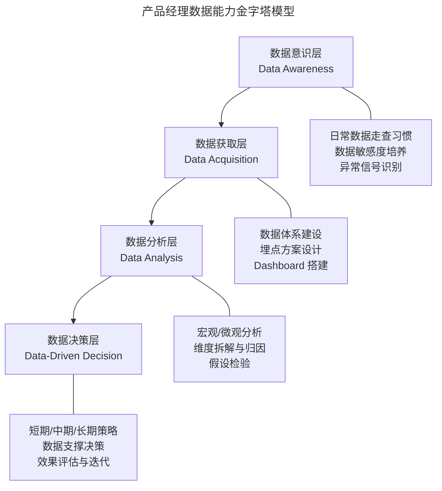
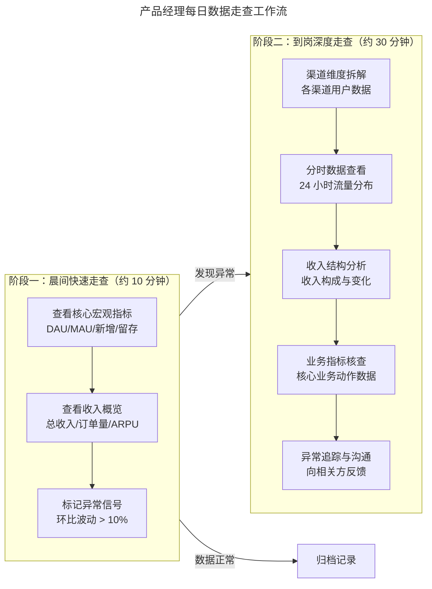

# 产品经理的数据能力体系与意识框架

> **适用范围**：产品经理（需要提升数据能力）、数据产品经理、需要建立数据分析体系的团队负责人。适用于数据意识培养、日常数据走查、数据基础设施建设、现代分析框架应用等场景。
>
> **更新摘要（v2 · 2026-08 更新）**：
> - 结构化升级为 6 节骨架（导言 / 核心方法论 / 关键流程 / 工具与实战 / 常见误区 / 进阶延展）
> - 保留数据能力四层金字塔、HEART、OSM 等框架
> - 保留全部 Mermaid 图并补充 `--- title: ... ---` frontmatter，每张图后追加文字解读

---

## 1. 导言

数据是产品经理理解产品现状的基础，也是做出产品决策的核心依据。在数字化产品管理实践中，数据分析能力已成为产品经理技能图谱中最具辨识度的专业能力之一。

产品经理的数据能力与数据产品经理（Data Product Manager）的技能树存在本质差异：前者关注如何利用数据驱动产品决策与运营优化，后者聚焦于数据基础设施与数据产品的规划与建设。本文讨论的范畴为前者——即所有产品经理均需具备的数据素养（Data Literacy）。

根据 Gartner（2023）的定义，数据素养是指"阅读、撰写和沟通数据的能力，以及理解数据来源、构建方法、分析技术和应用场景的素养"。在 2024-2026 年间，随着 AI 增强分析（AI-Augmented Analytics）的快速普及，产品经理的数据能力要求正在经历结构性升级：从手动查阅报表，转向与 AI 分析助手协作完成洞察提取与决策支持。

---

## 2. 核心方法论

### 2.1 产品经理数据能力模型：四层金字塔

产品经理的数据能力可划分为四个层次，形成由基础到进阶的能力金字塔：

> **图解**：产品经理数据能力四层金字塔——数据意识层（数据走查、敏感度、异常识别）→ 数据获取层（体系、埋点、Dashboard）→ 数据分析层（宏观/微观、归因、假设检验）→ 数据决策层（策略、支撑决策、效果评估）。

各层次的核心能力要求：

| 能力层次 | 核心能力 | 典型产出 | 评估标准 |
|---------|---------|---------|---------|
| 数据意识层 | 数据走查习惯、异常敏感度 | 每日数据简报、异常预警 | 是否能在 1 小时内发现数据异常 |
| 数据获取层 | 指标体系设计、埋点规划、Dashboard 配置 | 数据需求文档、埋点方案 | 指标覆盖率、数据可用性 |
| 数据分析层 | 维度拆解、归因分析、假设检验 | 分析报告、归因结论 | 分析深度、结论准确性 |
| 数据决策层 | 策略制定、效果评估、决策支撑 | 策略方案、ROI 评估 | 决策质量、业务影响度 |

### 2.2 现代产品分析框架

**HEART 框架**（Google 提出，适用于以用户为中心的产品指标体系构建）：

| 维度 | 英文全称 | 核心问题 | 典型指标 |
|------|---------|---------|---------|
| H | Happiness | 用户满意度如何？ | NPS、CSAT、应用评分 |
| E | Engagement | 用户参与度如何？ | DAU/MAU、使用频次、会话时长 |
| A | Adoption | 用户是否采纳新功能？ | 新功能使用率、注册转化率 |
| R | Retention | 用户是否持续使用？ | 次日/7日/30日留存率、churn rate |
| T | Task Success | 用户能否完成任务？ | 任务完成率、错误率、耗时 |

**OSM 模型**（连接业务目标与数据指标的桥梁）：
- **Objective（目标）**：业务希望达成的结果，如"提升用户留存"。
- **Strategy（策略）**：达成目标的路径，如"优化新用户引导流程"。
- **Measurement（度量）**：衡量策略执行效果的具体指标，如"新用户 7 日留存率"。

OSM 模型的价值在于避免"有指标无目标"或"有目标无度量"的常见问题，确保数据体系与业务目标的对齐。

**AARRR 与 North Star Metric**：AARRR 海盗指标模型（Acquisition-Activation-Retention-Referral-Revenue）从用户生命周期视角构建指标体系；North Star Metric（北极星指标）帮助团队在众多指标中聚焦唯一核心指标。2024-2026 年实践趋势是将上述框架与 AI 分析能力结合，利用 AI 自动识别各阶段的关键驱动因素（Key Drivers），实现从静态指标体系到动态指标体系的演进。

---

## 3. 关键流程

### 3.1 日常数据走查体系

数据走查（Data Walkthrough）是产品经理每日的必修功课，也是整体感知产品健康状态最有效的手段。建议将每日数据走查分为两个阶段：

> **图解**：每日数据走查分两阶段——晨间快速走查（约 10 分钟，看宏观指标、收入概览、标记异常信号，环比波动 >10% 预警）和到岗深度走查（约 30 分钟，渠道拆解、分时数据、收入结构、业务指标、异常追踪）。晨间发现异常则进入深度走查，数据正常则归档记录。

对于负责多条产品线的产品经理，可采用"宏观指标监控 + 异常下钻"策略：每条产品线仅关注 3-5 个核心宏观指标，发现显著波动时，将细节分析任务分配至对应产品负责人。

### 3.2 数据基础设施建设：三种实施策略

| 策略 | 适用阶段 | 优势 | 劣势 | 典型工具组合 |
|------|---------|------|------|------------|
| 第三方工具 | 早期/验证期 | 快速上线、功能丰富、社区完善 | 业务指标结合度低、定制性受限 | GA4 + Amplitude |
| 完全自建 | 成熟期/数据密集型 | 深度业务结合、高度定制 | 建设周期长、初期体验差 | 自建数仓 + 自研 BI |
| 混合方案 | 成长期/资源受限 | 兼顾效率与深度、投入产出比高 | 数据口径统一难度大 | GA4 + Tableau/Metabase |

### 3.3 埋点方案设计

当第三方工具的通用事件追踪无法满足业务分析需求时，需要进行个性化埋点（Instrumentation/Tracking）。埋点方案设计需遵循以下原则：
- **业务导向**：每个埋点事件必须对应明确的业务问题，避免"先埋后想"。
- **命名规范**：采用层级命名法（如 `page_view → product_detail → click_buy_button`）。
- **属性完整**：每个事件需携带充分的上下文属性（Properties）。
- **版本管理**：埋点方案需纳入版本控制，与产品迭代同步更新。

2024-2026 年间，无埋点（Auto-capture）技术日趋成熟，PostHog、Heap 等工具支持自动采集全量用户行为数据，大幅降低了埋点成本与遗漏风险。但无埋点方案在业务指标结合、数据精度与存储成本方面仍存在权衡。

### 3.4 数据仪表盘设计

数据仪表盘（Dashboard）是数据走查的核心载体。**核心原则：数据的价值源于对比**——单一数据指标缺乏意义，只有在横向或纵向对比中才能产生洞察。

- **横向对比**：不同渠道、模块、用户群体的拆解对比。
- **纵向对比**：按不同时间粒度观察环比（MoM/WoW）与同比（YoY）变化。
- **逻辑对比**：具有因果或相关关系的指标间的趋势对比（如新增用户与留存率通常呈反向关系）。

产品经理不应被动依赖预设仪表盘，而应根据业务特征与阶段性目标进行个性化定制。

---

## 4. 工具与实战

### 4.1 AI 增强的数据走查实践（2024-2026）

| 维度 | 传统方式 | AI 增强方式 |
|------|---------|------------|
| 异常发现 | 人工逐项对比环比 | 自动异常检测（Datadog Watchdog、Amplitude Compass） |
| 根因定位 | 手动维度拆解 | AI 自动归因建议（Mixpanel Spark、Amplitude AI） |
| 报告生成 | 手动撰写分析邮件 | 自然语言自动生成洞察摘要（NLG） |
| 预测能力 | 基于经验的趋势判断 | 时序预测模型（Time Series Forecasting） |
| 走查频率 | 每日 1-2 次 | 持续监控 + 实时告警 |

主流产品分析工具在 2024-2026 年间的 AI 能力演进：Amplitude 的 AI Assistant 支持自然语言查询与自动洞察生成；Mixpanel 的 Spark 功能可自动识别数据异常模式并生成解释；PostHog 的 AI 洞察功能可自动发现用户行为中的隐藏模式。产品经理应将 AI 作为数据走查的"副驾驶"（Copilot），而非替代品。

### 4.2 AI 增强分析的前沿趋势

- **自然语言查询（NL2SQL）**：产品经理可通过自然语言直接查询数据，降低 SQL 门槛。
- **自动洞察生成**：AI 自动扫描数据，识别异常模式与隐藏关联。
- **预测性分析**：基于历史数据的时序预测，从"事后分析"走向"事前预警"。
- **因果推断自动化**：AI 辅助的因果推断（Causal Inference）方法，如 DoWhy、CausalML 等框架。

### 4.3 实时数据与流式分析

传统 T+1 批处理模式正在向实时流式分析演进，Apache Kafka、Flink 等流处理框架的普及使产品经理可以近乎实时地监控产品状态，对异常的响应时间从"小时级"压缩至"分钟级"。

---

## 5. 常见误区

### 5.1 数据质疑意识

产品经理需对数据保持审慎态度，避免"数据说什么就信什么"：
- **口径确认**：同一指标在不同工具中的定义可能不同（如"活跃用户"的判定标准）。
- **采样偏差**：部分工具采用采样统计，小流量场景下数据可能失真。
- **归因谬误**：相关不等于因果（Correlation ≠ Causation）。
- **幸存者偏差**：分析结果可能仅反映留存用户特征，忽略已流失用户。

### 5.2 数据驱动与数据启发的边界

| 概念 | 定义 | 适用场景 |
|------|------|---------|
| **数据驱动**（Data-Driven） | 决策完全由数据决定 | 效果衡量与优化 |
| **数据启发**（Data-Informed） | 数据作为输入之一，结合战略判断、用户洞察与行业经验 | 创新探索与方向选择 |

> **关键警示**：过度依赖数据驱动可能导致局部优化陷阱（Local Optimum），忽视突破性创新的可能性。

### 5.3 数据敏感度误区

- **量级感知缺失**：对指标绝对值与变化幅度的直觉判断不足。
- **关联感知缺失**：不理解指标间逻辑关系。
- **时效感知缺失**：对数据延迟与统计口径的认知不足。

---

## 6. 进阶延展

### 6.1 隐私合规与数据治理

随着 GDPR、CCPA 及中国《个人信息保护法》的深入实施，数据采集与分析面临更严格的合规约束。产品经理需关注：
- **隐私友好的数据采集方案**：如 Server-Side Tracking、Cookieless Tracking。
- **数据最小化原则**：仅采集业务必需的数据，避免过度采集。
- **用户同意管理**：Consent Management Platform（CMP）的集成。

### 6.2 总结

产品经理的数据能力体系可概括为"意识-获取-分析-决策"四层金字塔模型。日常数据走查是数据意识的基础训练，两阶段走查流程确保宏观与微观的兼顾。数据基础设施建设需根据团队阶段选择合适的实施策略，混合方案在多数场景下提供了最优的投入产出比。HEART、OSM 等现代分析框架为指标体系构建提供了系统方法论，而 AI 增强分析正在重塑产品经理与数据协作的方式。

> **核心观点**：数据能力的培养不是一蹴而就的过程，而是在持续实践中逐步深化的专业素养。在 AI 时代，产品经理的核心竞争力不在于手动分析的速度，而在于提出正确问题的能力、对业务逻辑的深度理解，以及将数据洞察转化为产品行动的执行力。

### 6.3 参考文献

- Amplitude. (2025). *Amplitude AI: Intelligent analytics for product teams*.
- Gartner. (2023). *Data literacy: What it is and why it matters*.
- Google. (2023). *HEART framework for measuring user experience*.
- Mixpanel. (2025). *Spark: AI-powered anomaly detection and insights*.
- PostHog. (2025). *PostHog AI insights: Automatic pattern discovery*.
