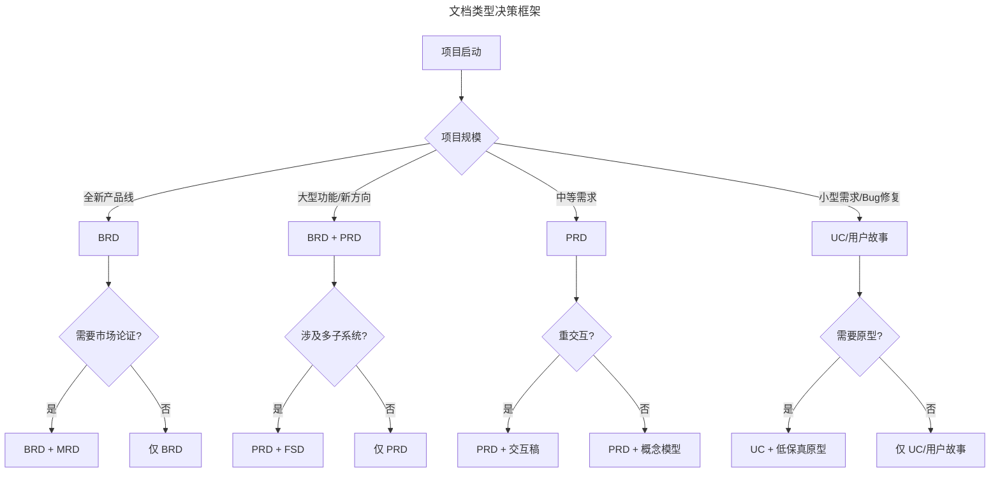
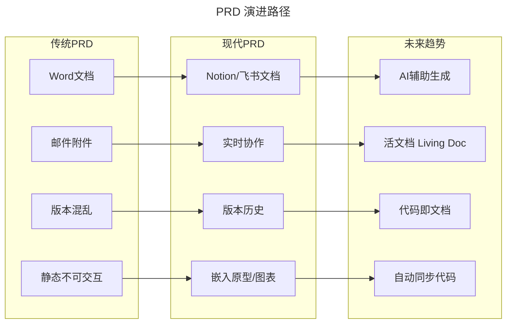
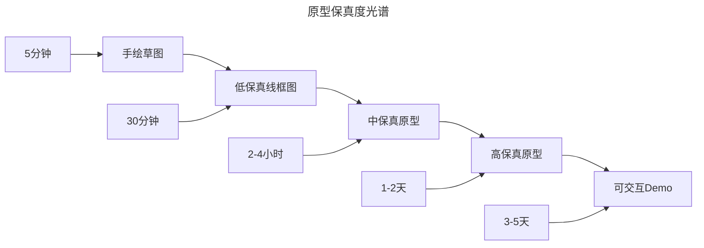
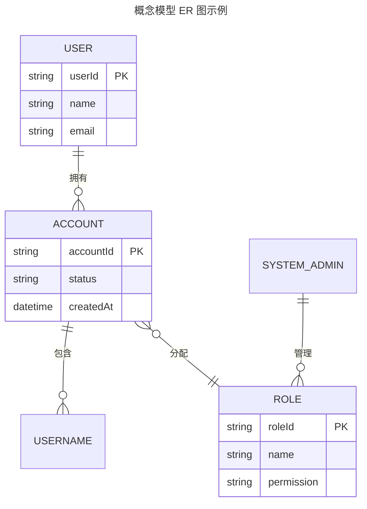
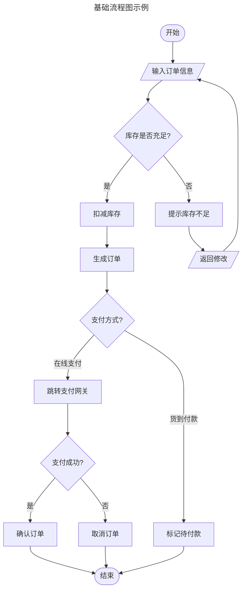
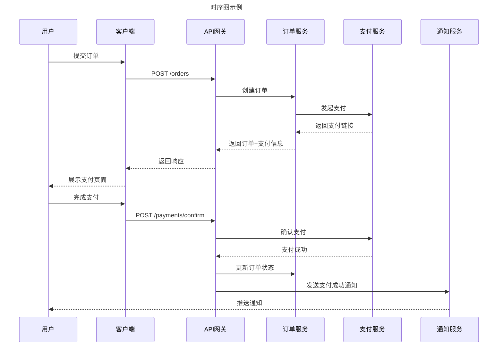
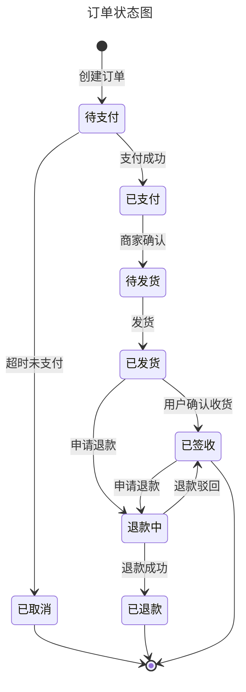
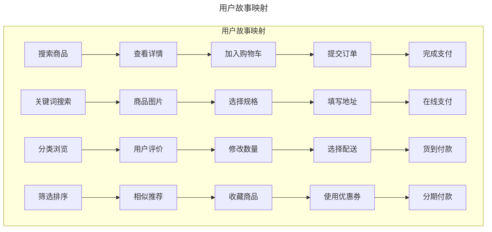
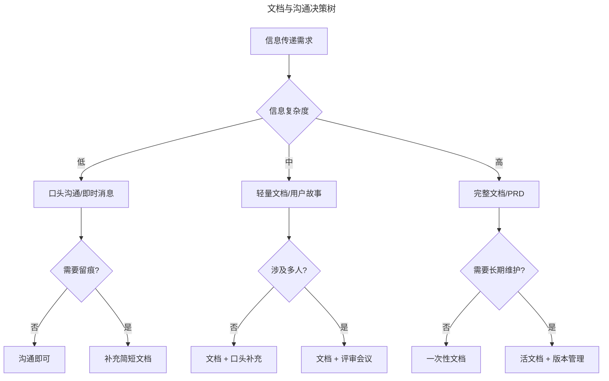

# 22 | 产品经理的图文基本功

> **适用范围**：产品经理（需要掌握文档与图例基本功）、产品文档撰写者、需要结构化表达业务逻辑的团队。适用于 BRD/MRD/PRD/UC/FSD 撰写、产品原型制作、概念模型/流程图/状态图/用例图绘制等场景。
>
> **更新摘要（v2 · 2026-08 更新）**：
> - 结构化升级为 6 节骨架（导言 / 核心方法论 / 关键流程 / 工具与实战 / 常见误区 / 进阶延展）
> - 合并原"产品文档"与"产品图例"上下篇为单篇完整文档
> - 保留全部 Mermaid 图并补充 `--- title: ... ---` frontmatter，每张图后追加文字解读
> - 移除失效图片引用（Readhub 线框图手稿、原型标注示例、概念模型/泳道/状态/用例示意图），改为文字化描述

---

## 1. 导言

**"没有内容的形式和没有形式的内容，都是不能存在的；即使存在的话，那么，前者有如奇形怪状的空洞的器皿，后者则是虽然大家都看得见、但却不认为是实体的空中楼阁。"**——（俄）别林斯基《论人民的诗第一篇》

产品经理的大部分工作是无形的，比如思考、分析、协调，在日常的工作中，我们能交出来的、唯一看得到摸得着的产出，就是各种各样的产品文档或产品原型，所以才会有人戏称产品经理就是写文档或做 PPT 的。

文档（包括原型和 PPT 等等）是产品经理重要的基本功，也是产品经理的脸面，很多时候会决定别人跟你合作的初始心态；而且从某种意义上来说，产品文档也是产品经理设计的一个"产品"，也是有用户（阅读者），目的（文档的目的）和特性设计（如何表述，用什么逻辑和工具等）的。

虽然现在越来越多的流派在提倡削减文档，用更敏捷和直接的方式驱动产品发展，我依然认为产品经理需要掌握做出漂亮文档的能力，这也是对产品设计过程的尊重。

产品图例是产品经理结构化表达业务逻辑的核心工具。**"世间无限丹青手，一片伤心画不成。"——唐·高蟾** 上次讲了一些产品文档的模式，以及应用场合和特点，这部分内容实践性挺强。今天我们接着产品文档的话题，介绍几种常用的图例，以及它们的功能特点。

> **核心摘要**：产品文档是产品经理最核心的可见产出，也是产品经理设计的"产品"——有用户（阅读者）、有目的（文档目标）、有特性设计（表述方式与工具选择）。产品图例是结构化表达业务逻辑的核心工具。在敏捷与 AI 时代，文档的价值不在于厚度而在于精准：BRD 回答"做不做"，PRD 回答"做什么与为什么做"，原型回答"长什么样"。文档类型应根据项目规模和受众灵活裁剪，避免形式化，追求"恰如其分"。

---

## 2. 核心方法论

### 2.1 文档类型决策框架

> **图解**：文档类型应根据项目规模灵活选择。大型项目需要完整的文档体系，小型需求则应精简到最小必要文档。核心原则是"每一份文档都有明确的受众和目的"，避免为文档而文档。

### 2.2 BRD：商业需求文档

BRD 是商业需求文档（Business Requirement Document），通常在启动全新产品线的时候才需要用到。它描述的是商业级别的内容和判断，通常逻辑和内容会比较短小精悍，但背后要有广泛的调研和思考基础，而且 BRD 是站在公司和股东层面的，它回答的问题是**我们要不要做**，比如我们是否需要面向所有用户新增一种新的商业产品，或者我们是否需要将一次性收费模式变更为订阅模式。

我在过去的工作中，大部分要用到 BRD 的机会都伴随着重大的战略决策，需要比较长时间的周密推演和讨论，最终一般会是高层非常慎重的决策过程。从另一个角度来说，我觉得大部分的项目是不需要 BRD 的，尤其是有些项目，都已经决定要做了，还要去准备 BRD 论证其合理性，就很形式化，没有太大价值。

> **现代 BRD 的变化**：在 AI 时代，BRD 中需要增加对 AI 能力边界的评估。例如，某功能是否依赖 AI 能力？AI 的准确率是否满足商业目标？数据合规性如何保障？这些已成为现代 BRD 不可忽视的维度。

### 2.3 MRD：市场需求文档

MRD 是市场需求文档（Marketing Requirement Document），一般会在既有的产品路线上启动比较大的项目或者新功能时用到，但我在过去的工作中却很少专门写 MRD。

我自己的理解是：MRD 是 BRD 和 PRD 之间承上启下的一种形式，交代市场机会、竞争情况、产品和运营策略和计划等等，有点像是对 BRD 的拆解和细化，也有点像是高度概括、没有细节的 PRD；所以我会选择干脆把这样的内容拆到 PRD 或 BRD 里面去。

如果说 BRD 回答的是"我们要不要做"，那 MRD 回答的就应该是"我们怎么做"，它会比 BRD 多了很多细节，却又不涉及详细的功能逻辑和流程。在大部分项目中，我的习惯是把 MRD 的内容放到 PRD 中去，在不同的场合着重讲不同的部分。比如在对业务和运营部门宣讲的时候，我会避开产品特性的细节逻辑，着重讲偏向 MRD 的部分，而在向工程师宣讲的时候，则会反过来，主要精力放在讲具体要实现些什么特性，只需要简明扼要地交代商业背景。

**BRD/MRD 的现代替代方案**：

| 传统方式 | 现代替代 | 适用场景 |
|----------|----------|----------|
| BRD 文档 | Lean Canvas / Business Model Canvas | 创业团队、快速验证 |
| MRD 文档 | Opportunity Backlog + 用户故事映射 | 敏捷团队、迭代开发 |
| 战略评审 PPT | Miro 工作坊 + 实时协作 | 远程团队、跨部门协作 |

**Lean Canvas** 是一种一页纸的商业模型画布，包含问题、解决方案、关键指标、竞争优势、渠道、客户细分、成本结构、收入来源等九个模块。相比传统 BRD，它更精炼、更聚焦、更易于迭代。

---

## 3. 关键流程

### 3.1 PRD：产品需求文档

PRD 是 Product Requirement Document 的缩写，意思是产品需求文档。PRD 是产品经理写得最多的文档，按照惯例，它一般是写具体的功能逻辑和细节，给工程师看的；但正如我刚才提到的，在操作过程中，产品经理还是应该在 PRD 中写一些包含商业、业务背景、市场机会等等内容；也就是交代清楚"为什么做"，而不是简单地描述流程和功能。

网上能找到的 PRD 的模板有很多，除非有强制文档格式要求，否则大家完全没有必要拘泥于其中的任何一种。最好是可以把各种模板都研究一下，根据不同的产品或项目类型挑选合适的框架。比如重操作的 To C 产品可能需要交互流程描述和线框图，而 To B 的产品可能注重的是概念模型和业务流程。

记住所有的模板都是为文档服务的，我们的目标是清晰和准确的文档描述，而不是把文档模板的空档填满。我看到过不少照着模板写的 PRD，其中有些部分明显就是为了避免空白硬填的内容，比如"数据字典"，作为一个操作类的特性，不涉及什么数据字典，去掉这部分就好了，完全没必要硬着头皮往里面填充没有意义的内容。

**现代 PRD 的演进**：

> **图解**：PRD 正经历从静态文档到动态协作、再到 AI 辅助的演进。现代 PRD 强调"活文档"理念——文档与代码同步更新，而非一次性交付后束之高阁。

**现代 PRD 工具选择**：

| 工具 | 核心优势 | 适用场景 |
|------|----------|----------|
| **Notion** | 数据库驱动、模板丰富、AI 辅助写作 | 中小团队、个人知识管理 |
| **飞书文档** | 企业级协作、与飞书生态集成 | 国内企业 |
| **Confluence** | 与 Jira 深度集成、权限管理 | 大型技术团队 |
| **语雀** | 知识库管理、技术文档友好 | 国内技术团队 |

> **AI 辅助 PRD 写作**：Notion AI、飞书 AI 等工具已能辅助生成 PRD 初稿、提炼需求要点、检查逻辑完整性。但 AI 生成的内容需要产品经理深度审视和修正，AI 是"加速器"而非"替代者"。

### 3.2 UC：用例文档与用户故事

UC 是指用例文档，通常是以用户角度的完整功能单位为粒度，描述用户跟系统的交互过程以及系统的输出逻辑。如果项目是重交互，以用户场景驱动的话，我会推荐用 UC 来组织 PRD，也就是 PRD 里面按照用例的方式来描述功能实现，这样做更容易向工程师交代产品价值。

用例文档的模板比较简单，网上一搜一大把，最核心的部分是流程，通常会把主流程和分支流程分开描述，再复杂的业务，主流程一般都简明扼要，所有的复杂度最好都放到分支流程里面去，分支流程里面的一些限制和规则，可以整理一下，在业务规则的那个部分重写一份，便于工程师在开发过程中去查阅。

建议你去仔细研究用例模板中的每一部分（比如背景、涉众、主流程和分支流程、业务规则等等）存在的价值。它给我们提供了一个研究用户以及思考用户行为的框架，能够帮助我们去有条理地从用户角度出发理解场景和系统功能。

> **用户故事 vs 用例文档**：在敏捷开发中，很多团队用"用户故事"替代传统用例文档。用户故事的格式是"作为一个 [角色]，我想要 [功能]，以便于 [价值]"。相比用例文档，用户故事更轻量，但表达深度有限。建议根据项目复杂度选择：简单需求用用户故事，复杂业务逻辑仍需用例文档。

### 3.3 FSD：功能详细说明

FSD 是功能详细说明（Function Specifications Document），有时候我们也称作 FRD，我们经常说"写 Spec"，其实就是指它。这时的文档就偏向实现了，交代具体的数据字典，概念模型结构，业务接口规范等等，一般 FSD 会跟 PRD 合并，不会单独拆出来。

大部分项目中，如果你写了 PRD，就不大需要再写 FSD 了。除非项目的规模很大，涉及各种各样的子项目，可能整个项目组有一套 PRD，但每个具体的子项目会准备专门的 FSD。

> **API-First 趋势**：在现代微服务架构下，FSD 的角色正被 API 文档工具（如 Swagger/OpenAPI）部分替代。接口规范由后端工程师通过代码注解自动生成，产品经理更多关注业务逻辑而非接口细节。

### 3.4 产品原型：从手绘到 AI 生成

不论是否有交互设计师，产品经理通常都需要出不同保真程度的产品原型，这也是产品经理干的最多的事情之一。

**原型保真度光谱**：

> **图解**：原型保真度应与项目阶段匹配。早期探索用低保真（5 分钟），快速验证方向；中期用中保真（2-4 小时）确认逻辑；后期才需要高保真（1-2 天）。过度追求保真度是产品经理常见的效率陷阱。

- **手绘原型**：在"产品经理的工具指南"一文中，我提到自己经常会用纸笔画线框草图，拍照贴在文档里。在跟交互或者视觉设计师达成默契的基础上，这么做的效率其实还不错。（原 Readhub 早期线框图手稿图片因失效已移除）
- **Figma 原型**：已成为产品原型的主流工具，优势在于实时协作、组件复用、原型交互、Dev Mode（开发者直接获取标注和代码片段）、版本管理。工作流建议：在 FigJam 中做前期梳理（用户旅程、信息架构）→ 在 Figma Design 中制作原型 → 通过 Dev Mode 交付开发 → 利用评论功能收集反馈。
- **AI 辅助原型生成**：

| 工具 | 输入 | 输出 | 适用阶段 |
|------|------|------|----------|
| **v0 by Vercel** | 自然语言描述 | React 组件代码 | 技术验证 |
| **Galileo AI** | 自然语言描述 | 高保真 UI 设计 | 概念探索 |
| **Uizard** | 手绘草图/截图 | 可编辑高保真设计 | 快速迭代 |
| **Figma AI** | 上下文提示 | 智能填充、自动布局 | 效率提升 |

> **实践建议**：AI 生成的原型适合早期概念验证和灵感探索，但不应替代对用户需求的深度思考。将 AI 视为"从 0 到 1 的加速器"，而非"从 1 到 100 的替代者"。

**原型制作的两个核心提醒**：

**提醒一：做到刚刚好就够了**。很多产品经理喜欢炫技，把原型做得极其逼真，细节、动效俱全。大家要想清楚做原型图的目的是什么，做到什么程度可以达成这个目的，有时候原型做到八十分，把逻辑和框架表达清楚就足够了，结果产品经理非要做到一百分甚至一百二十分，这样一来会耗费没有必要的精力。《团队之美》里面有对 Mike Cohn 的一段采访，他提到："一个应用中所有的代码不一定要处于同样的质量水平""不是每件事都要做到第一流，在大多数情况下，我们根本没机会做到第一流"。

**提醒二：原型需要明确的阅读线索**。除非面对面讲解，否则产品原型需要一个明确的阅读线索。很多产品经理画完原型图就完了，往文档上一贴，不解释不说明，让开发自己去读图。开发读完做出来的东西有偏差，产品经理会从图里挑出一个并不引人注目的细节说："你看，我早就画在图上了，你没看见怪谁？"这种行为就挺招人恨的。大部分人也很难系统性地读完一张产品原型图，因为图不是一个线性信息，需要引导。分享一个方法：在产品原型图上齐整地加上标注——可以用数字标记，在下方注释，或是用细线引导在原型图边上加注释。（原图例标注示例图片因失效已移除）用这样的方式，将原型图中的组件逻辑和数据规则说清楚，读图者也有线索依赖，不会让一个人对着图不知所措。

---

## 4. 工具与实战

### 4.1 概念模型图

概念模型的目的是要将产品中的业务概念分门别类地整理出来，并在同时确定概念之间的关系。在复杂业务的系统中，这一工具非常重要，它是一切业务流程的基础。

**概念模型的构建方法**：抽取概念模型的过程并不复杂，但需要一些时间，我们可以首先去尽可能详细地描述系统各种场景和逻辑，然后注意描述中的所有名词。比如我们说用户可以创建账号、设置用户名，登录系统，系统管理员为其指定一个角色。这样简单的一句话中就包含了用户、账号、用户名、系统、系统管理员和角色等名词，我们把这些名词不断地取出来，去分析他们之间的关系。（原概念模型示意图因失效已移除，下方用 Mermaid ER 图替代）

> **图解**：概念模型图用实体关系图表达业务概念之间的关联。图中每个实体框代表一个业务概念，连线两端的乌鸦脚符号（如 `||--o{`）表示基数对应关系（1:1、1:N、M:N）。这是产品经理与工程师共同关注的"地基"——概念模型的设计质量直接决定系统的扩展潜力。

**概念模型的战略价值**：越是基础的东西，在这时越需要谨慎设计，比如有多少系统错将用户名作为主键，导致未来有用户需要更换用户名时无比复杂。所以概念模型的梳理最大的作用是回答系统的根本性问题，从而可以帮助工程师设计数据结构，也帮助业务找到设计出发点。一个产品的架构扩展潜力，很多时候就受限于概念模型的设计。比如订单管理系统在最初设计中，订单和标的之间的关系被设为一一对应，那将来要多产品搭售的时候，整个产品技术团队就会无比痛苦。

**概念模型与领域驱动设计（DDD）**：

| DDD 概念 | 对应产品经理工作 | 实践意义 |
|----------|------------------|----------|
| 限界上下文（Bounded Context） | 业务边界划分 | 明确各子系统的职责边界 |
| 聚合根（Aggregate Root） | 核心业务实体 | 确定系统的核心概念 |
| 值对象（Value Object） | 实体属性 | 区分可变与不可变属性 |
| 领域事件（Domain Event） | 业务触发条件 | 梳理系统间的异步交互 |

> **关键观点**：概念模型有点偏技术，又不是一个酷炫的东西，很难拿出来做展示，而且它的作用不那么立竿见影，所以没有得到应有的重视。但它在业务逻辑复杂的产品设计中确实非常重要，希望你动手去尝试一下，挖掘它的价值，为自己所用。

### 4.2 流程图/泳道图/时序图

所有的业务系统都有流程，我们的文档中一定会或多或少涉及"流程图"。

**基础流程图**：最基础的流程图是面向过程的描述性流程图，有些图形规范，比如开始结束是圆角矩形，数据操作是矩形，判断是菱形等等。但我很少见过真的完全按照标准格式画的，基本就用到矩形和菱形，有时为了加以区分会有颜色上的差异。

> **图解**：基础流程图适合描述单一角色、单一模块内的业务流程。圆角矩形表示开始/结束，矩形表示操作，菱形表示判断，平行四边形表示输入/输出。注意主流程应保持简明，复杂度放到分支流程中。

**泳道图**：如果流程比较复杂，涉及的角色或子系统、模块多起来的时候，传统的流程图就会开始捉襟见肘，应接不暇；所以除非描述单一功能模块内部的流程外，我一般很少会用传统流程图，而是用泳道图和时序图。泳道图就是在传统的流程图上加入角色，因为每个角色之间是平行的，从图上看起来每个角色就像是一个泳道。通过这些泳道去标识每个动作是由哪个角色（或子系统）做出的。这种图形一般用于比较宏观的流程描述中，比如划分各业务角色之间大的流程步骤，或描述子系统之间的边界和职能。（原泳道示意图因失效已移除）

> **泳道图的现代实践**：在 Miro 和 FigJam 中，泳道图可以通过模板快速创建，支持团队实时协作标注。相比传统桌面工具，在线协作白板让泳道图的评审和迭代效率大幅提升。

**时序图**：当进一步细致到具体的用例或方法时，则可以用时序图。时序图整体看起来像很多根竹签，每根竹签代表用户、业务对象、子系统甚至"时间"，凡是可以向其他竹签发出请求的都可以表示为一根竹签，而有些过程是需要定时执行的，在时序图上，我们就可以将其表示为"时间"。每根竹签向自己或其他竹签发起请求，然后响应请求的竹签则根据这个请求开始一个过程，这个过程可以是同步，也可以是异步，可以是判断过程，也可以是循环。

> **图解**：时序图精确描述了系统间的交互顺序和消息传递。实线箭头表示请求，虚线箭头表示响应。适合描述微服务架构下的系统交互，是产品经理与工程师沟通接口逻辑的最佳工具。我有一段时间非常迷恋时序图，连项目管理中的不同角色的流程安排都用时序图表达，强烈建议你深入学习一下，把它用到你的流程分析中。

**三种流程图的选择指南**：

| 图例类型 | 核心优势 | 适用场景 | 推荐工具 |
|----------|----------|----------|----------|
| 基础流程图 | 简单直观、上手快 | 单一角色、单一模块内部流程 | Draw.io/ProcessOn |
| 泳道图 | 清晰展示角色分工 | 多角色协作、跨部门流程 | Miro/FigJam |
| 时序图 | 精确描述交互顺序 | 系统间接口调用、微服务交互 | Mermaid/PlantUML |

### 4.3 状态图

系统中所有的概念实体都应该有状态，用户有状态，订单有状态，账单也有状态。在数据结构设计时，经常会在业务对象表里加一个"状态"字段。产品经理有时不会将状态显式地单独表达出来，而是让工程师自己通过读业务逻辑去区分和判断业务对象的状态。

**状态沟通的风险**：这样的沟通断层会产生一些风险，有时描述同一个状态用了不同的用词，导致工程师记录成了两个状态，比如前一条业务逻辑写的是"完成对账后系统进入休眠状态"，后一条写成了"完成角色更新后系统挂起"，这可能来自于产品经理的不严谨，结果系统里就出来一条没有必要的脏状态。更吓人的是有时产品经理描述不清，导致本来应该是不同的状态，被开发理解为同一个，未来需要再做拆分时，难上加难。比如用户欠费挂起和用户到期挂起应该分开不同的状态，但产品经理在文档里都写着"挂起"，导致未来给用户开通服务的时候不知道该怎么直接从数据表里区分，还要去关联行为日志的表。

**状态图的绘制方法**（用 Mermaid 绘制状态图）：

> **图解**：状态图以节点表示状态，以有向边表示状态转换，边上的标注是触发转换的条件。实心圆表示初始状态，圆环表示终态。状态图的核心价值在于**穷尽性**——确保所有可能的状态转换都被覆盖，避免遗漏。

**状态图绘制的实践建议**：统一术语（确保每个状态只有一个名称，避免同义多词）；区分终态（明确哪些状态是终态，哪些是中间态）；标注触发条件（每条转换边必须标注触发条件）；考虑异常路径（除了正常流程，还要考虑超时、失败、回退等异常状态转换）；与工程师对齐（状态图是产品经理与工程师最需要达成共识的图例）。

### 4.4 用例图

用例图是 UML 的标准图示，看起来特别简单，一个火柴人和一些椭圆。每个椭圆是一个用例描述，然后把椭圆和人连起来。用例图复杂起来很复杂，还有扩展点、互相之间的关联包含关系等等。但开始使用它很容易，只用火柴人和椭圆就够了。

那这么简单、甚至有点蠢的图，能干吗呢？首先是可以让读者一眼看到一个产品或一个项目需要实现的用户价值，以及它可能的规模是什么；另外则是可以利用用例来组织产品文档的结构，很容易理解，也容易作为标准来管理进度。（原用例示意图因失效已移除）

**用例粒度的划分艺术**：用例图的一个老大难问题是区分用例的粒度，这是个没有唯一答案的问题。我最喜欢的标准是来自一场 UML 培训，说的是"以卖点作为粒度"，也就是设想你的系统是按功能收费的，你从兜里一个接一个地往外掏用例，每掏一个用户就要付一份钱，你要保证每个用例用户都是愿意买单的，同时又要保证用例尽量丰富，以求收到足够多的钱。假设你现在做"极客时间"，你从兜里掏出一个"修改密码"，用户不会认为它是个卖点；但你假设现在做的是一个复杂的金融保险系统，很可能"修改密码"就会成为一个独立的卖点。所以用例粒度划分一定是因系统而异的。

**用户故事映射：用例图的现代演进**：

> **图解**：用户故事映射的横轴是用户旅程（Backbone），纵轴是优先级递减的细节故事。第一行是 MVP（最小可行产品），后续行是增量迭代。相比用例图，用户故事映射更强调用户旅程的连贯性和优先级排序。

**用例图 vs 用户故事映射**：

| 维度 | 用例图 | 用户故事映射 |
|------|--------|--------------|
| 核心目的 | 概览系统功能范围 | 规划迭代优先级 |
| 组织方式 | 按角色-功能 | 按用户旅程-优先级 |
| 适用阶段 | 需求分析早期 | 迭代规划阶段 |
| 优势 | 简洁、易理解 | 支持优先级排序、迭代规划 |
| 局限 | 不表达优先级和旅程 | 复杂系统可能过于庞大 |

### 4.5 图例制作工具的演进

**UML 使用频率变化**：

| 图示类型 | 使用频率趋势 | 原因 |
|----------|-------------|------|
| 类图 | 稳定 | 概念模型不可替代 |
| 时序图 | 上升 | 微服务架构下系统交互更复杂 |
| 状态图 | 稳定 | 状态管理仍是核心问题 |
| 用例图 | 下降 | 被用户故事映射部分替代 |
| 活动图 | 下降 | 被流程图/泳道图替代 |
| 部署图 | 下降 | DevOps 工具自动生成 |

**代码生成图工具：Mermaid 与 PlantUML**——Mermaid 语法简洁、原生支持 Markdown 嵌入（GitHub、Notion、飞书等）、支持流程图/时序图/状态图/类图/甘特图；PlantUML 语法更丰富、支持完整 UML 规范、与 IDE 集成良好。**代码生成图的优势**：文本格式便于 Git 版本管理，可追踪每次变更；修改即改图，无需手动调整布局；与 Markdown 文档无缝集成。**局限**：学习曲线、复杂图形表达受限、不适合非技术背景的协作对象。

**在线协作白板：Miro 与 FigJam**——Miro（无限画布、模板丰富、集成生态，适用泳道图/用户旅程图/概念模型图）、FigJam（与 Figma 无缝集成、轻量易用，适用流程图/头脑风暴/用例图）、飞书白板（与飞书生态集成、中文友好）。**协作白板的工作流**：在 Miro/FigJam 创建画布→团队成员实时添加节点和连线→通过评论和投票收集反馈→定稿后导出为图片嵌入文档→链接嵌入 Notion/Confluence 保持同步。

**AI 辅助生成图例**：

| 工具 | 能力 | 输入方式 | 适用场景 |
|------|------|----------|----------|
| **ChatGPT/Claude** | 生成 Mermaid/PlantUML 代码 | 自然语言描述 | 快速生成标准图例 |
| **Whimsical AI** | 生成流程图、思维导图 | 自然语言描述 | 早期概念梳理 |
| **Eraser.io** | 生成架构图、流程图 | 自然语言描述 | 技术架构图 |

> **实践建议**：AI 生成的图例代码通常需要人工调整，尤其是业务逻辑的准确性和完整性。将 AI 视为"从描述到代码的翻译器"，而非"从需求到完美图例的魔法棒"。

---

## 5. 常见误区

### 5.1 文档维度误区

| 误区 | 表现 | 正确做法 |
|------|------|---------|
| **为文档而文档** | 照着模板硬填空档（如无意义的"数据字典"） | 目标是清晰准确的描述，而非填满模板 |
| **文档一次成型** | 写完不更新，文档与产品脱节 | 坚持"活文档"理念，随迭代持续更新 |
| **过度追求完美** | 每份文档都要做到 100 分 | 做到刚刚好，专业的事交给专业的人 |
| **信息分散** | 同一信息在多个文档重复且不一致 | 建立单一信息源（Single Source of Truth） |

### 5.2 图例维度误区

| 误区 | 表现 | 正确做法 |
|------|------|---------|
| **图为例服务** | 追求图形规范美观，忽略逻辑表达 | 图例的目的是表达逻辑，不是追求规范 |
| **状态遗漏** | 状态图不覆盖异常路径和终态 | 穷尽性检查，考虑超时、失败、回退等 |
| **术语不统一** | 同一状态用不同词语（"休眠"/"挂起"） | 统一术语，每个状态只有一个名称 |
| **泳道粒度不一** | 泳道划分标准不一致 | 保持泳道划分粒度一致 |

### 5.3 AI 使用误区

| 误区 | 表现 | 正确做法 |
|------|------|---------|
| **AI 替代思考** | 完全依赖 AI 生成的文档/图例 | AI 是"加速器"而非"替代者"，深度思考仍需产品经理完成 |
| **敏感信息泄露** | 将敏感业务数据输入公共 AI 服务 | 敏感信息不应输入到公共 AI 服务中 |
| **AI 结果盲信** | 不审视 AI 生成的业务逻辑和边界条件 | AI 生成的内容需要人工审视，尤其是业务逻辑和边界条件 |

---

## 6. 进阶延展

### 6.1 图例的专业深度分层

**基础层：清晰定义概念**——概念模型图（描述业务实体及其关系）、流程图（描述业务操作的顺序）、泳道图（描述多角色的业务流程）、时序图（描述系统间的消息传递顺序）、状态图（描述实体的状态变迁）、用例图（概览系统的用户价值）。

**进阶层：方法论应用场景与局限**——概念模型图（复杂业务系统基础架构，局限是简单系统过度设计）；流程图（单一模块操作流程，局限是多角色时难以表达）；泳道图（跨部门协作流程，局限是角色过多时图面混乱）；时序图（微服务接口调用逻辑，局限是不适合表达分支逻辑）；状态图（核心业务对象生命周期，局限是状态过多时难以维护）；用例图（项目初期功能范围概览，局限是不表达优先级）。

**高阶层：前沿趋势**——**代码即图**（Mermaid/PlantUML 将图例纳入版本管理）；**AI 辅助生成**（自然语言描述自动生成图例代码）；**实时协作**（在线白板让图例评审从异步变为同步）；**动态图例**（图例与数据源联动）；**图例即接口**（时序图直接生成 API 接口定义）。

### 6.2 敏捷时代的文档哲学

**文档精简趋势**：敏捷宣言提出"工作的软件高于详尽的文档"，但这不意味着不需要文档，而是强调文档的必要性和有效性：
- **Just Enough Documentation**：只写必要的文档，每份文档都有明确的受众和目的。
- **Living Document**：文档应随产品迭代持续更新，而非一次性交付。
- **Single Source of Truth**：避免信息分散在多个文档中，建立唯一信息源。

**文档与沟通的平衡**：

> **图解**：文档与沟通不是对立关系，而是互补关系。信息复杂度低时优先口头沟通，复杂度高时需要文档支撑。关键判断标准是：是否需要留痕、是否涉及多人、是否需要长期维护。

**AI 对文档工作的影响**：
1. **文档生成加速**：Notion AI、飞书 AI 等工具可以根据提示生成文档初稿，将产品经理从"从空白页开始"的困境中解放出来。
2. **文档质量提升**：AI 可以检查文档的逻辑完整性、识别遗漏的边界条件、统一术语使用。
3. **文档消费方式变化**：读者可以通过 AI 对话式地查询文档内容，而非逐页阅读。这意味着文档的结构化程度变得更加重要——AI 能否准确理解和检索文档内容，取决于文档的结构化质量。

### 6.3 总结

我们今天从概念模型开始，说到流程图、状态图和用例图，从表面的图讲到图背后的工具和方法，这些东西最主要的作用是可以辅助我们找到思维框架，用完整而有条理的逻辑去把一个业务描述出来。他们就像是工具箱，只有熟悉了这些工具的效用，同时又足够熟悉环境，才知道什么场合拿出哪一样工具是恰当的。

这也是产品经理的基本功，即便用不上，也不要让自己的工具箱里只有单调的几样工具，因为掌握的工具会影响你解决问题的思路，正像那句古话说的，手里拿着锤子，看起来全世界都是钉子。而这些已经被大量的前人应用和雕琢过的工具，自然带着他们的智慧，研究这些工具本身，也是一种对于经验的学习。

### 6.4 延伸阅读

- 《领域驱动设计》— Eric Evans
- 《用户故事映射》— Jeff Patton
- 《Lean Canvas 实践指南》
- 《Notion 产品文档工作流搭建》
- 《AI 辅助产品文档写作最佳实践》
- 《Mermaid 官方文档》— https://mermaid.js.org
- 《PlantUML 实践指南》
- 《Miro 产品团队工作流搭建》
