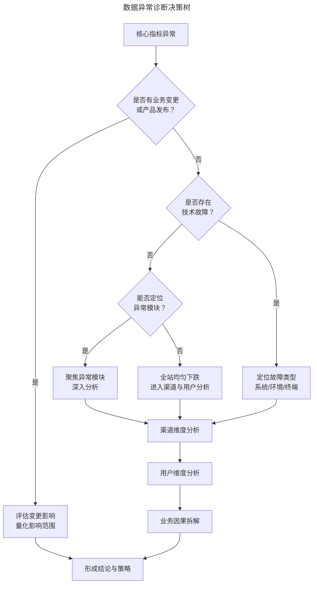
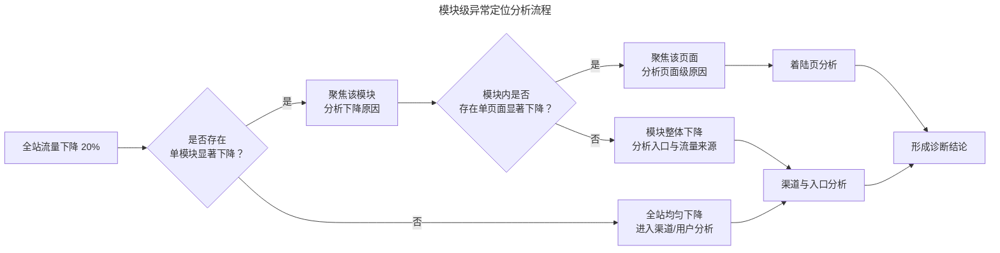

# 数据异常的系统性诊断：分析框架

> **适用范围**：产品经理（各阶段）、数据产品经理、需要处理数据异常的团队负责人。适用于数据异常诊断、根因分析、业务变更排查、技术故障排除、渠道分析、AI 辅助诊断等场景。
>
> **更新摘要（v2 · 2026-08 更新）**：
> - 结构化升级为 6 节骨架（导言 / 核心方法论 / 关键流程 / 工具与实战 / 常见误区 / 进阶延展）
> - 保留分层排查框架（业务变更→技术故障→模块定位→渠道分析）与 AI 2024-2026 自动化诊断
> - 保留全部 Mermaid 图并补充 `--- title: ... ---` frontmatter，每张图后追加文字解读

---

## 1. 导言

在产品经理的日常实践中，数据异常是最常见且最考验专业素养的场景之一。所谓"数据异常"（Data Anomaly），是指核心业务指标偏离预期基线（Baseline）的显著波动，如流量环比骤降 20%、转化率突降 15% 等。面对此类情境，产品经理的应对方式在很大程度上反映了其整体的产品专业素养——能否系统性地排除干扰因素、快速定位根因、形成有效结论并驱动行动。

本文基于"流量环比骤降 20%"这一典型场景，构建一套系统性的数据异常诊断框架，覆盖从业务变更排查、技术故障排除、产品模块定位到渠道分析的全链路分析方法论。

### 1.1 数据异常诊断决策树

面对数据异常，产品经理的第一反应不应是立即展开复杂的数据分析，而应按照结构化的排查路径，由简到繁、由近到远地逐步缩小问题范围。以下决策树提供了系统性的排查框架：

> **图解**：数据异常诊断决策树的核心逻辑遵循"先排除确定性因素，再分析不确定性因素"的原则。确定性因素（业务变更、技术故障）通常能快速定位并解决，而不确定性因素（渠道波动、用户行为变化）则需要更深入的维度拆解。流程：核心指标异常→业务变更/产品发布？→评估变更影响量化范围（是）或技术故障？（否）→定位故障类型（是）或能否定位异常模块？（否）→聚焦异常模块（是）或全站均匀下跌进入渠道与用户分析（否）→渠道维度分析→用户维度分析→业务因果拆解→形成结论与策略。

---

## 2. 核心方法论

### 2.1 第一层：业务变更与产品发布排查

**排查原则**——面对数据异常，首要排查的是近期是否存在业务变更或产品发布。此类变更对数据的影响通常直接且显著，应首先确认而非遗漏。常见的业务变更类型包括：定价调整（商品调价、会员价格变动、促销活动结束）；内容变更（版权到期下架、热门内容移除、推荐策略调整）；功能变更（页面改版、流程重构、入口位置调整）；运营活动（活动到期、优惠券失效、投放暂停）。

实际工作中，部分产品经理在发现数据异常后急于展开深度分析，经过长时间排查后才想起近期有业务调整，导致时间与精力的浪费。因此，建立"变更台账"（Change Log）机制至关重要——每次业务变更均应记录在案，并预设可能的数据影响范围，便于异常发生时快速对照排查。

**变更影响的量化评估**——确认存在业务变更后，需量化评估其对数据的影响：影响范围（变更涉及的用户群体占比、功能模块占比）；影响程度（受影响模块的数据变化幅度与整体数据变化幅度的对比）；影响时效（变更的生效时间与数据异常的起始时间是否吻合）；持续性判断（变更是一次性影响还是持续性影响）。若业务变更能解释数据异常的全部或绝大部分，则诊断可基本结案，进入后续的结论形成与策略制定阶段。

### 2.2 第二层：技术故障排除

**系统故障排查**——排除业务变更因素后，需排查技术故障的可能性。排查路径包括：确认技术发布（向工程团队确认近期是否存在产品经理未被告知的技术变更）；查看系统监控（检查服务器监控与告警记录，如 CPU、内存、错误率、响应时间）；分析分时数据（查看 24 小时内的流量变化曲线，若某时段流量骤降甚至归零，极可能为系统故障）。

**环境与终端故障排查**——若自有系统运行正常，则需排查外部环境与终端故障。此时需对用户按技术参数进行分类比对：

| 排查维度 | 具体指标 | 典型故障模式 |
|---------|---------|------------|
| 网络条件 | 运营商、网络类型（Wi-Fi/4G/5G） | 某运营商 DNS 劫持、CDN 节点故障 |
| 浏览器类型 | Chrome/Safari/微信内置浏览器等 | 特定浏览器兼容性问题 |
| 设备型号 | 手机品牌、操作系统版本 | 特定机型适配问题 |
| 屏幕分辨率 | 屏幕尺寸、像素密度 | 布局错位导致功能不可用 |
| 地域分布 | 省份、城市 | 区域性网络故障、合规限制 |

实际案例中，某产品流量下跌，系统功能表面正常，但按运营商细分后发现某运营商来源流量大幅降低，深入调查发现该运营商实施 DNS 劫持但未正确处理 HTTPS 访问，导致大量用户访问出错。另一案例中，全站流量下跌但仅微信内置浏览器流量显著降低，排查后发现某功能在微信浏览器下存在兼容性缺陷。

**分时数据的分析价值**——分时数据（Hourly Breakdown）在技术故障排查中具有关键价值。通过观察 24 小时内的流量分布，可以：定位故障时段（流量骤降的起始时间点）；判断故障类型（突发性归零通常为系统崩溃，渐进性下降可能为性能退化）；评估恢复速度（故障恢复的时间特征，瞬时恢复 vs. 逐步恢复）。

---

## 3. 关键流程

### 3.1 第三层：异常模块定位

**模块级流量拆解**——排除技术故障后，需定位数据异常的"案发现场"——即在产品的各个页面与功能模块中，是否存在某一模块的数据显著降低，驱动了整体指标的异常。此步骤要求产品经理对产品信息架构（Information Architecture）有清晰认知，至少需掌握产品包含哪些核心页面与模块。以电商产品为例，需关注的模块包括搜索页、类目页、推荐位、店铺页、商品详情页等，逐一检查各模块的流量变化情况。

**模块定位的分析逻辑**：

> **图解**：模块级异常定位分析流程——全站流量下降后判断是否存在单模块显著下降：是则聚焦该模块分析下降原因（再判断是否存在单页面显著下降，是则聚焦页面级原因，否则分析入口与流量来源）；否则全站均匀下降进入渠道/用户分析。

**关键原则**：定位到异常模块并不等于找到了具体原因，而是确定了进一步分析的方向。若运气较好，能定位到单一模块的显著下降，后续归因分析将大幅简化；若全站各模块均匀下降，问题通常更为复杂，需进入渠道与用户层面的深度拆解。

### 3.2 第四层：渠道维度分析

**Web 产品渠道分类**——对于 Web 产品与小程序，渠道维度是数据异常分析的重要切入点。Web 流量按来源可分为三大类型：

| 渠道类型 | 定义 | 分析难度 | 典型异常原因 |
|---------|------|---------|------------|
| 直接流量（Direct Traffic） | 用户直接输入 URL 或从书签访问 | 高 | 隐私策略变更导致更多流量归入此类，难以追溯 |
| 搜索引擎流量（Search Traffic） | 来自搜索引擎的自然搜索与付费搜索 | 低 | 搜索引擎降权、算法更新、关键词排名变化 |
| 引荐流量（Referral Traffic） | 来自其他网站的引荐链接 | 中 | 合作站点下线、社交平台限流、外链失效 |

**搜索引擎流量分析**——搜索引擎流量是最易追踪的渠道类型，分析维度包括：来源搜索引擎（百度、Google、Bing 等的流量变化对比）；关键词维度（高频关键词的排名变化，可通过站长工具检查收录与排名情况）；着陆页组合（搜索流量与着陆页的交叉分析，定位流量下降的具体页面）。典型案例：某产品全站流量暴跌，分析发现主要源于百度流量下降，通过高频关键词查询发现网站排名大幅后移，进一步通过站长工具确认网站被搜索引擎降权。确认原因后即可制定恢复策略。

**引荐流量与社交流量分析**——引荐流量通常来自自然引荐与合作站点，其中合作站点的流量应有明确的来源标识（如 UTM 参数），便于统计分析。社交网络来流需单独划出分析，若该渠道出现大幅波动，需考虑社交平台的限流策略变更。

**小程序渠道分析**——微信小程序的渠道分析依托微信官方分析工具，主要渠道包括：模板消息（现称订阅消息）、公众号文章、二维码扫一扫、二维码长按识别、微信会话分享。每个渠道的流量波动均有具体场景对应：模板消息来流减少可能是消息未发出或模板被禁用；长按识别或会话来流波动可能触发了朋友圈限流策略。

**移动应用渠道分析**——移动应用与 Web/小程序的渠道分析逻辑存在本质差异。大部分用户通过桌面图标或推送通知直接打开 App，不存在传统意义上的流量渠道概念。在移动应用语境中，"渠道"通常指应用下载激活的新增渠道（如应用市场、渠道投放等），而非流量来源渠道。移动应用的流量变化需从用户维度做进一步分析。

---

## 4. 工具与实战

### 4.1 自动化异常检测与 AI 辅助诊断（2024-2026）

**自动化异常检测系统**——传统数据异常发现依赖人工走查，存在发现延迟与遗漏风险。2024-2026 年间，自动化异常检测（Automated Anomaly Detection）已成为现代产品分析平台的标准能力：

| 工具 | 核心能力 | 异常检测方法 | 适用场景 |
|------|---------|------------|---------|
| Datadog Watchdog | 自动检测指标异常 | 机器学习基线 + 多维度关联 | 基础设施与应用性能监控 |
| Amplitude Compass | 自动检测产品指标异常 | 时序分解 + 统计检验 | 产品行为数据分析 |
| Mixpanel Spark | 异常检测与根因分析 | 贝叶斯变化点检测 | 用户行为分析 |
| Anodot | 业务指标异常检测 | 无监督学习 + 自适应基线 | 财务与运营指标监控 |
| Elastic Observability | 日志与指标异常 | 机器学习异常检测 | 全栈可观测性 |

**AI 根因分析**——2024-2026 年的 AI 根因分析（AI-Powered Root Cause Analysis）能力正在重塑产品经理的异常诊断方式：自动维度拆解（AI 自动遍历所有维度组合，识别贡献度最大的维度值）；关联事件发现（自动关联时间线上可能相关的系统事件、发布记录、外部事件）；因果推断辅助（基于因果推断框架区分相关性与因果性）；自然语言解释（以自然语言生成异常解释报告，降低理解门槛）。

产品经理应将 AI 辅助诊断视为"增强"而非"替代"——AI 能快速缩小排查范围，但最终的业务判断与决策仍需产品经理基于领域知识完成。

**AIOps 与产品监控的融合**——AIOps（Artificial Intelligence for IT Operations）的成熟使得系统监控与产品指标监控的边界逐渐模糊。Datadog、New Relic 等平台已将基础设施指标（如错误率、延迟）与业务指标（如转化率、DAU）纳入统一监控体系，产品经理可在同一平台内完成从技术故障到业务异常的全链路诊断。

### 4.2 诊断框架的执行要点

**时间优先级**——数据异常诊断应遵循严格的时间优先级：0-15 分钟（排查业务变更与产品发布，确定性最高）；15-45 分钟（排查技术故障，确定性较高）；45-90 分钟（定位异常模块与渠道分析，需要数据支持）；90 分钟以上（用户维度拆解与业务因果分析，深度分析）。

**诊断文档化**——每次数据异常诊断均应形成文档记录，包含：异常描述（指标名称、变化幅度、起始时间）；排查过程（各层排查的结论与排除依据）；根因结论（最终确认的根因与置信度）；数据附件（关键数据截图与查询语句）。诊断文档的积累可形成团队的"异常知识库"，加速未来类似异常的诊断速度，并为自动化规则提供训练数据。

### 4.3 实战要点

| 要点 | 说明 | 适用场景 |
|------|------|----------|
| 建立变更台账 | 每次业务变更记录在案，预设数据影响范围 | 所有产品线 |
| 先排除确定性因素 | 先查业务变更和技术故障，再分析不确定性 | 数据异常诊断 |
| 分时数据定位 | 观察24小时流量分布，判断故障时段和类型 | 技术故障排查 |
| 维度拆解归因 | 按运营商/浏览器/设备/地域等维度细分 | 环境终端故障 |
| 模块级定位 | 找到数据异常的"案发现场" | 全站指标异常 |
| 渠道来源分析 | Web按直接/搜索/引荐，小程序按官方渠道 | 渠道流量异常 |
| 诊断文档化 | 每次诊断形成文档，沉淀异常知识库 | 团队级能力建设 |
| AI辅助诊断 | 用AI自动维度拆解、根因分析 | 大型产品、高频异常 |

---

## 5. 常见误区

### 5.1 常见诊断陷阱

| 陷阱 | 表现 | 正确做法 |
|------|------|----------|
| **确认偏差（Confirmation Bias）** | 先有结论再找数据支持，而非从数据推导结论 | 从数据推导结论，而非先入为主 |
| **锚定效应（Anchoring Effect）** | 过度关注第一个发现的信息，忽视其他可能性 | 系统排查各层因素，避免被首个信息锚定 |
| **可得性偏差（Availability Heuristic）** | 优先考虑最近发生的或记忆深刻的原因 | 依据变更台账和数据证据，而非记忆 |
| **过度分析（Over-Analysis）** | 在确定性因素已排除的情况下仍重复排查 | 按时间优先级合理分配诊断精力 |

### 5.2 诊断流程误区

| 误区 | 表现 | 正确做法 |
|------|------|---------|
| **急于深度分析** | 发现异常就立即展开复杂数据分析 | 先按决策树排查确定性因素（业务变更/技术故障） |
| **忽视变更台账** | 排查很久才发现近期有业务调整 | 建立变更台账机制，异常时快速对照 |
| **模块定位即根因** | 定位到异常模块就认为找到原因 | 模块定位只是确定方向，仍需归因分析 |
| **渠道概念混淆** | 移动应用也用 Web 渠道逻辑分析 | 移动应用"渠道"指新增渠道，流量需从用户维度分析 |
| **盲信 AI 诊断** | 完全依赖 AI 根因分析结果 | AI 是"增强"而非"替代"，最终判断需产品经理完成 |

---

## 6. 进阶延展

### 6.1 总结

数据异常诊断遵循"业务变更 → 技术故障 → 模块定位 → 渠道分析"的分层排查路径，核心原则是"先排除确定性因素，再分析不确定性因素"。每个排查层级均有对应的分析方法与工具支持，产品经理需根据时间优先级合理分配诊断精力。

2024-2026 年间，AI 增强的自动化异常检测与根因分析正在显著提升诊断效率，但产品经理的业务判断力与领域知识仍然是不可替代的核心能力。诊断过程的文档化与知识沉淀，是实现团队级诊断能力持续提升的关键。

### 6.2 参考文献

- Ahmed, M., Mahmood, A. N., & Hu, J. (2016). A survey of network anomaly detection techniques. *Journal of Network and Computer Applications, 60*, 19-41.
- Datadog. (2025). *Watchdog: AI-powered anomaly detection and root cause analysis*. https://docs.datadoghq.com/watchdog
- Keogh, E., Lin, J., & Fu, A. (2005). HOT SAX: Efficiently finding the most unusual time series subsequence. *Proceedings of the IEEE International Conference on Data Mining (ICDM)*, 226-234.
- Laptev, N., Amizadeh, S., & Flint, I. (2015). Generic and scalable framework for automated time-series anomaly detection. *Proceedings of the ACM SIGKDD International Conference on Knowledge Discovery and Data Mining*, 1939-1947.
- Mixpanel. (2025). *Spark: AI-powered anomaly detection*. https://mixpanel.com/blog/spark-ai
- Pearl, J. (2009). Causal inference in statistics: An overview. *Statistics Surveys, 3*, 96-146.
- Amplitude. (2025). *Compass: Automated anomaly detection for product metrics*. https://amplitude.com/product/compass
