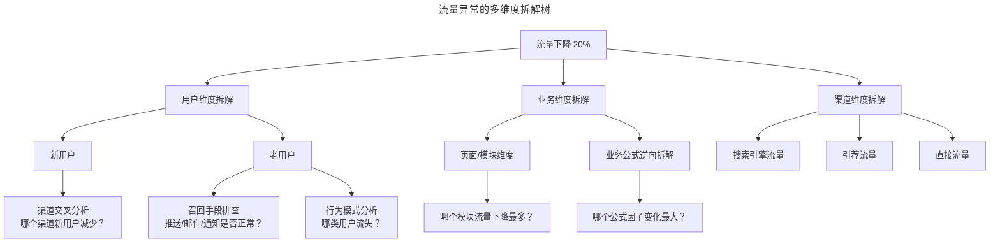
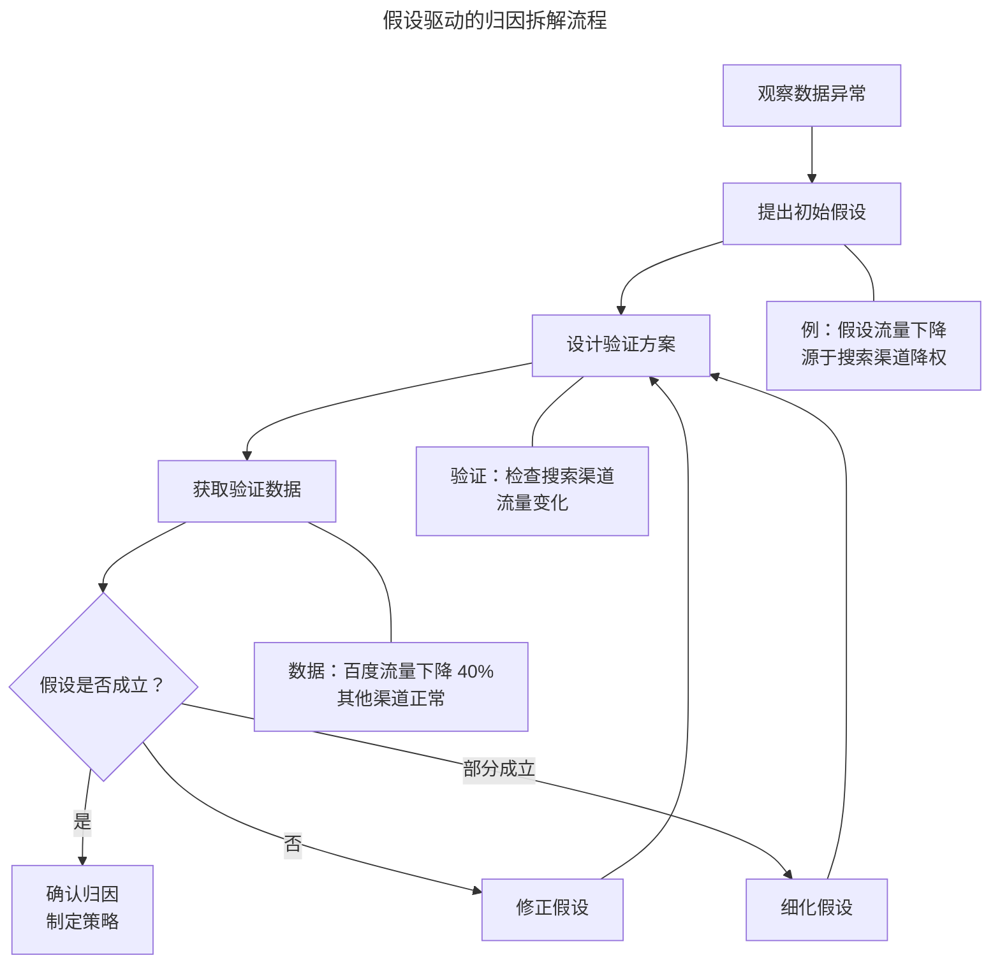

# 数据异常的归因拆解：维度与假设

> **适用范围**：产品经理（各阶段）、数据产品经理、需要做根因分析的数据分析师。适用于归因拆解、维度分析、业务因果推理、AI 辅助归因等场景。
>
> **更新摘要（v2 · 2026-08 更新）**：
> - 结构化升级为 6 节骨架（导言 / 核心方法论 / 关键流程 / 工具与实战 / 常见误区 / 进阶延展）
> - 保留 MECE 原则、维度拆解树、用户维度/业务维度/外部因素拆解、因果推断方法
> - 保留全部 Mermaid 图并补充 `--- title: ... ---` frontmatter，每张图后追加文字解读

---

## 1. 导言

在前文《数据异常的系统性诊断：分析框架》中，已构建了从业务变更排查到渠道维度分析的系统化诊断路径。本文将在该框架基础上，深入数据异常归因拆解的核心方法——从用户维度拆解、行为模式分类到业务因果推理，系统阐述如何将宏观的指标异常逐步拆解至可定位、可归因、可行动的微观层面。

归因拆解（Attribution Decomposition）的本质是回答"数据为什么变了"这一核心问题。产品经理作为专业人士与普通人的最大差异，正在于能否看到并理解足够完整的微观信息，并将其有逻辑地串联为因果链条。

### 1.1 归因拆解的核心原则：MECE

MECE（Mutually Exclusive, Collectively Exhaustive，相互独立、完全穷尽）原则是归因拆解的根本方法论。该原则要求：
- **相互独立（Mutually Exclusive）**：各拆解维度之间不存在重叠，避免重复计算
- **完全穷尽（Collectively Exhaustive）**：所有拆解维度的加总等于整体，避免遗漏

在数据异常归因中，MECE 原则的应用确保了拆解的完备性——即总指标的变化可被各子维度的变化完全解释，不存在"说不清的残差"。若拆解后各子维度变化之和与总变化不一致，则意味着拆解维度选择不当或存在遗漏因素。

### 1.2 维度拆解树

维度拆解是归因分析的核心工具，其结构为从整体到局部的逐层细分：



> **图解**：流量异常的多维度拆解树——从顶部异常指标出发，按照用户、业务、渠道三个主维度逐层拆解，在每个维度下进一步细分（用户维度拆为新/老用户并交叉渠道与召回手段、业务维度拆为页面/模块与业务公式、渠道维度拆为搜索/引荐/直接），直至找到贡献度最大的子维度值。

各维度的贡献度（Contribution Rate）计算方式为：

> 贡献度 = (子维度值变化量) / (总指标变化量) × 100%

当某子维度的贡献度超过 50% 时，可认为该维度是异常的主要驱动因素，应优先深入分析。

---

## 2. 核心方法论

### 2.1 用户维度拆解

**新用户与老用户**——用户维度的首要拆解是新用户（New User）与回访用户（Returning User）的区分。这两类用户群体对产品的认知程度与行为倾向存在本质差异，应作为完全不同的用户群体进行分析与管理。将产品用户存量类比为水池，水位突然下降的可能原因有二：进水管流量减少（新用户获取下降），或水池出现新的漏水点（老用户流失加剧）。

| 拆解维度 | 指标变化模式 | 可能原因 | 下一步分析方向 |
|---------|------------|---------|--------------|
| 新用户下降，老用户不变 | 获客环节异常 | 投放到期/欠费、渠道入口变更、ASO 排名下降 | 与渠道做交叉分析，定位具体渠道 |
| 老用户下降，新用户不变 | 留存/召回环节异常 | 推送失败、邮件服务中断、核心功能体验劣化 | 与产品模块做交叉分析，排查召回手段 |
| 新老用户均下降 | 系统性问题 | 技术故障、品牌舆情、行业性事件 | 回到技术故障排查与外部因素分析 |

**新用户下降的常见原因**通常较为直接：投放到期、预算耗尽、渠道合作终止等。新用户流量变化需与渠道维度做交叉分析，定位"哪个龙头关掉了"。**老用户下降的常见原因**则与召回手段直接相关：推送消息未发出、邮件服务中断、通知模板被平台禁用等。此类原因可通过与产品模块做交叉分析进一步确认——例如，日常推送内容为商品推荐，若推送失败，则商品详情页流量应显著下降。

**基于行为模式的用户分类**——除客观属性分类外，更有效的方法是基于用户在产品中的行为轨迹（Behavioral Trajectory）进行分类。这种方法从业务出发，为用户赋予行为标签（Behavioral Tags），具有更强的业务可解释性。

**高阶实践：动态用户画像系统**——成熟的用户画像（User Persona/Profile）系统可实现对用户行为偏好的精准分类。电商网站通常考虑用户的购买力、信用特征、心理特征、社交网络连接等维度，通过日志系统提取用户行为轨迹，经去时效性与非典型性行为处理后，进行聚类（Clustering）与分类（Classification），归入各用户维度。此类系统在电商与内容平台的推荐系统中广泛部署。

**务实实践：基于关键行为的粗粒度分类**——多数团队不具备完整的用户画像系统，但可通过关键行为特征实现快速分类：

| 产品类型 | 分类维度 | 用户群体 A | 用户群体 B |
|---------|---------|-----------|-----------|
| 电商 | 着陆页类型 | 购买意图型（着陆商品页） | 学习浏览型（着陆内容页） |
| 电商 | 是否查看商家联系方式 | 高意向购买者 | 逛逛型用户 |
| 电商 | 单会话商品详情页浏览数 | 诚意购买者（多页浏览） | 路过型用户（单页浏览） |
| 内容平台 | 内容消费深度 | 深度阅读者 | 标题点击者 |
| 工具产品 | 功能使用类型 | 功能发起者 | 功能参与者 |

通过上述维度与流量变化做交叉对比，可发现诸如"流量下降是因为高意向购买者减少，还是浏览型用户减少"等精细洞察，为后续策略制定提供方向。

**流量指标与用户指标的辨析**——需特别注意的是，本文场景使用的是"流量"指标而非"用户量"指标。两者存在关键差异：流量下降 ≠ 用户量下降（用户量不变但访问深度减少，同样导致流量下降）。流量下降的可能组合：用户量减少 + 访问深度不变 → 用户流失；用户量不变 + 访问深度减少 → 用户参与度下降；用户量减少 + 访问深度减少 → 双重恶化。因此，在分析流量变化时，需同时关注用户数量、浏览数量（Page Views）与用户停留时长（Session Duration）三个指标。在大部分场景下，只要用户数与停留时长没有显著波动，流量变化不会立即威胁产品的健康状态。

### 2.2 业务维度拆解：因果推理

**业务公式逆向拆解**——业务维度拆解的核心方法是业务公式逆向推演——产品中的任何业务数字，均应可逆向推出计算方法。当数据异常是"果"时，需向前分解找到业务上的"因"。

以极客时间流量下降 20% 为例，假设定位到流量下降的主要位置是专栏文章详情页，则逆向拆解为：

> 文章详情页浏览量 = 当日更新文章数 × 当日文章平均浏览量 + 存量文章数 × 存量文章平均浏览量

在此基础上进一步分析：是当日更新文章数减少？还是新文章的平均浏览量下降？是存量文章数变化？还是存量文章的平均浏览量下降？每个因子对应不同的业务原因与解决策略。

**假设驱动的拆解流程**——业务公式拆解应遵循假设驱动的分析方法（Hypothesis-Driven Analysis），避免无目的的"数据漫游"：



> **图解**：假设驱动的归因拆解流程——观察数据异常→提出初始假设（如假设流量下降源于搜索渠道降权）→设计验证方案（检查搜索渠道流量变化）→获取验证数据（百度流量下降 40%）→判断假设是否成立：是则确认归因制定策略，否则修正假设，部分成立则细化假设。

假设驱动的核心优势在于效率——每个假设都限定了数据验证的范围，避免无方向的数据探索。同时，假设的修正与迭代也确保了分析的完备性。

**粒度最小化原则**——业务数据分析的关键原则是将粒度拆到尽可能细。粒度越细，归因越精确，策略越有的放矢。例如：粗粒度（"流量下降了" → 无法行动）；中粒度（"商品详情页流量下降了" → 方向明确但原因不清）；细粒度（"来自百度搜索的商品详情页流量因关键词排名下降而减少了 60%" → 可直接制定 SEO 恢复策略）。粒度最小化是产品经理专业性的体现——能够将宏观现象拆解至微观可行动的层面，是区分"数据传声筒"与"数据驱动者"的关键标准。

---

## 3. 关键流程

### 3.1 外部不可抗因素分析

**常见不可抗因素**——归因拆解中存在一类特殊因素——产品团队无法直接控制的外部变量，包括：

| 因素类型 | 典型场景 | 影响特征 | 应对策略 |
|---------|---------|---------|---------|
| 季节性因素 | 开学季流量下降、假期流量波动 | 周期性、可预测 | 提前预判、调整运营节奏 |
| 政策法规 | 平台规则变更、行业监管加强 | 突发性、不可逆 | 快速适应、合规调整 |
| 搜索引擎算法更新 | Google Core Update、百度算法调整 | 影响面广、恢复慢 | SEO 优化、流量来源多元化 |
| 社交平台策略调整 | 微信分享策略变更、朋友圈限流 | 特定渠道影响 | 渠道多元化、减少单一依赖 |
| 竞争格局变化 | 竞品重大发布、市场格局重塑 | 持续性、需评估 | 竞品分析、差异化策略 |
| 宏观环境 | 经济周期、公共卫生事件 | 全行业影响 | 战略调整、韧性建设 |

**不可抗因素的识别方法**——识别不可抗因素需结合以下线索：行业横向对比（同类产品是否同步出现数据波动？若全行业同步变化，则指向外部因素）；时间相关性（数据异常的起始时间是否与已知的政策变更、算法更新时间吻合？）；排除法（当内部因素业务变更、技术故障、渠道问题均被排除后，外部因素的概率上升）；社区与行业信息（关注行业论坛、开发者社区中其他从业者的反馈）。

### 3.2 归因拆解的执行规范

**拆解记录模板**——每次归因拆解应形成标准化记录，确保分析过程可追溯、可复现：

```
【异常描述】
- 指标：XXX
- 变化：环比下降 XX%
- 时间：YYYY-MM-DD

【拆解过程】
1. 用户维度：新用户下降 XX%，老用户下降 XX%
2. 渠道维度：渠道 A 下降 XX%，渠道 B 下降 XX%
3. 模块维度：模块 X 下降 XX%，模块 Y 下降 XX%
4. 业务公式：因子 M 变化贡献 XX%，因子 N 变化贡献 XX%

【归因结论】
- 主要原因：XXXX（置信度：高/中/低）
- 次要原因：XXXX
- 排除因素：XXXX

【待验证假设】
1. XXXX（需进一步数据验证）
2. XXXX
```

**归因置信度评估**——归因结论应标注置信度（Confidence Level），以反映结论的确定性程度：高置信度（有明确的数据证据链支撑，如技术故障记录 + 故障时段流量归零）；中置信度（有较强的数据相关性支撑，但因果链尚不完整）；低置信度（基于经验推断或间接证据，需进一步验证）。

---

## 4. 工具与实战

### 4.1 AI 辅助归因分析（2024-2026）

**自动化维度拆解**——2024-2026 年，AI 辅助归因分析能力取得了显著进展：自动贡献度分析（现代分析平台可自动计算各维度值对总指标变化的贡献度，并按贡献度排序。Amplitude 的 Compass 功能可在指标异常时自动列出贡献最大的维度值组合）；异常切片自动发现（AI 算法可自动遍历高维度的维度组合，如"运营商 × 地区 × 设备类型"，发现贡献度异常的切片，这在传统手动分析中因维度组合爆炸几乎无法完成）。

**因果推断方法**——传统的归因分析主要基于相关性（Correlation），难以区分因果与巧合。2024-2026 年，因果推断（Causal Inference）方法在产品分析领域的应用日趋成熟：

| 方法 | 核心原理 | 适用场景 | 局限性 |
|------|---------|---------|-------|
| 差分中的差分（DID） | 对比处理组与对照组的变化差异 | 政策/功能上线效果评估 | 需要合适的对照组 |
| 工具变量法（IV） | 利用外生变量识别因果效应 | 内生性问题场景 | 难以找到有效工具变量 |
| 断点回归（RD） | 利用阈值处的局部随机性 | 有明确阈值规则的场景 | 仅适用于阈值附近 |
| 合成控制法（SCM） | 构造合成对照组 | 单一处理单元的场景 | 需要足够的预处理期数据 |
| DoWhy 框架 | 基于 Pearl 因果层级的形式化因果推断 | 通用因果分析场景 | 需要明确的因果图假设 |

微软开源的 DoWhy 框架与 Uber 开源的 CausalML 库为产品团队提供了可落地的因果推断工具。产品经理无需掌握算法细节，但需理解各方法的适用场景与局限性，以便与数据科学团队有效协作。

**大语言模型在归因分析中的应用**——2024-2026 年，大语言模型（LLM）在数据归因中的应用场景日益丰富：假设生成（基于异常描述与历史案例，自动生成可能的归因假设列表）；报告撰写（将分析过程与结论自动转化为结构化的分析报告）；跨源信息整合（将内部数据与外部信息，如行业新闻、平台公告，关联辅助识别外部因素）；交互式分析（通过自然语言对话驱动数据分析，降低分析门槛）。

### 4.2 实战要点

| 要点 | 说明 | 适用场景 |
|------|------|----------|
| MECE原则 | 拆解维度相互独立、完全穷尽，避免遗漏 | 所有归因分析 |
| 贡献度计算 | 子维度变化量/总变化量×100%，>50%为主要驱动 | 维度拆解后 |
| 新老用户区分 | 新用户下降查获客，老用户下降查召回 | 用户维度拆解 |
| 行为模式分类 | 用关键行为特征快速分类用户 | 无完整画像系统时 |
| 业务公式拆解 | 业务数字逆向推出计算方法 | 业务维度归因 |
| 假设驱动分析 | 每个假设限定验证范围，避免数据漫游 | 所有归因分析 |
| 粒度最小化 | 拆到尽可能细，让结论可行动 | 宏观指标异常 |
| 外部因素排查 | 用行业对比/时间相关性/排除法识别 | 内部因素排除后 |
| AI辅助归因 | 自动贡献度、异常切片、因果推断 | 大型产品、高频异常 |

---

## 5. 常见误区

### 5.1 常见归因误区

| 误区 | 表现 | 正确做法 |
|------|------|----------|
| **混淆相关与因果** | A 与 B 同时变化不代表 A 导致 B | 用因果推断方法排除混杂变量 |
| **选择性归因** | 只关注支持预设结论的数据，忽视矛盾证据 | 客观评估所有数据，包含矛盾证据 |
| **过度归因** | 将随机波动强行归因于某个因素 | 评估置信度，区分真因与偶然 |
| **单一归因** | 多因素共同作用时仅归因于其中一个因素 | 识别多因素共同作用 |
| **归因倒置** | 将结果误认为原因 | 理清因果方向 |

### 5.2 拆解流程误区

| 误区 | 表现 | 正确做法 |
|------|------|----------|
| **无方向数据漫游** | 不做假设就直接探索数据 | 用假设驱动分析，限定验证范围 |
| **粗粒度结论** | 只定位到"流量下降"无法行动 | 粒度最小化，拆解到可行动层面 |
| **忽略外部因素** | 只查内部因素 | 用行业对比/时间相关性识别外部因素 |
| **忽视流量与用户差异** | 把流量下降等同于用户流失 | 同时关注用户数、浏览数、停留时长 |

---

## 6. 进阶延展

### 6.1 总结

归因拆解是数据异常诊断的核心环节，其方法论基础是 MECE 原则与假设驱动分析。拆解维度包括用户维度（新/老用户、行为模式分类）、业务维度（业务公式逆向推演）与外部因素维度。粒度最小化原则确保拆解结果可行动，假设驱动原则确保分析过程高效且有方向。

2024-2026 年，AI 辅助归因分析与因果推断方法正在显著提升归因的效率与准确性。自动化贡献度分析与异常切片发现减轻了产品经理的重复劳动，因果推断方法则提升了归因结论的科学性。然而，产品经理对业务逻辑的深度理解、对假设的合理构建、以及对归因结论的业务判断，仍然是 AI 无法替代的核心能力。

归因拆解的最终目标不是完成分析，而是为后续的应急响应与长效治理提供精准、可信的决策输入。

### 6.2 参考文献

- Imbens, G. W., & Rubin, D. B. (2015). *Causal inference for statistics, social, and biomedical sciences: An introduction*. Cambridge University Press.
- Pearl, J., & Mackenzie, D. (2018). *The book of why: The new science of cause and effect*. Basic Books.
- Sharma, A., & Kiciman, E. (2021). DoWhy: An end-to-end library for causal inference. *arXiv preprint arXiv:2011.04216*.
- Uber Engineering. (2025). *CausalML: Python package for causal machine learning*. https://github.com/uber/causalml
- Amplitude. (2025). *Compass: Automated contribution analysis*. https://amplitude.com/product/compass
