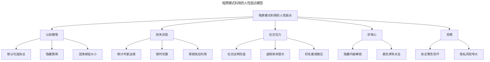
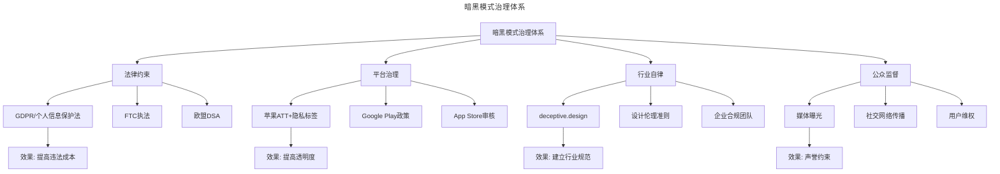
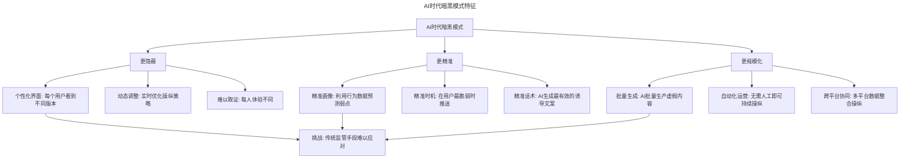
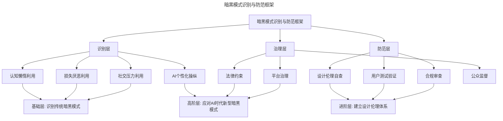

# 产品世界的暗黑模式：操纵的诱惑

> **适用范围**：产品经理（各阶段）、用户体验设计师、创业者、合规/法务负责人。适用于设计伦理、暗黑模式识别、用户权益保护、AI 时代欺骗性设计等场景。
>
> **更新摘要（v2 · 2026-08 更新）**：
> - 结构化升级为 6 节骨架（导言 / 核心方法论 / 关键流程 / 工具与实战 / 常见误区 / 进阶延展）
> - 整合原"更新说明 v2.0"与核心摘要，补充 deceptive.design 更名、法规治理、AI 新型暗黑模式
> - 保留全部 Mermaid 图并补充 `--- title: ... ---` frontmatter，每张图后追加文字解读

---

## 1. 导言

暗黑模式（Dark Patterns）是通过界面或流程的有意精心设计，诱导用户做出本不打算做出的举动。这类设计利用人性弱点——懒惰、恐惧、贪念——进行操纵，在市场竞争中形成"劣币逐良币"的困境。

> **核心摘要**：2018-2026 年间，暗黑模式治理取得了重要进展：darkpatterns.org 更名为 deceptive.design，GDPR 和个人信息保护法对暗黑模式形成法律约束，FTC 对暗黑模式进行了多次执法，苹果 App Store 要求开发者披露数据收集。然而，AI 时代催生了新型暗黑模式——AI 驱动的个性化操纵、深度伪造、算法偏见利用——对用户权益构成了更隐蔽的威胁。

### 1.1 经典案例回顾

2018 一开年，支付宝年度账单运营活动流程中，默认选中"我同意《芝麻服务协议》"，这一举动被指利用运营活动套取用户数据使用权，在社交网络引起轩然大波，芝麻信用官方随后出面澄清并向用户致歉。在此之前，由于变着法搭售旅行产品，携程受到了一位知名女艺人的公开炮轰，之后不久携程调整了订票流程，去掉了一些哄骗用户做捆绑的机制。

类似的事情我们并不陌生，早在互联网时代的前期，各种客户端软件通过不体面的捆绑安装手段，占领用户电脑的把戏就很成熟了。腾讯、百度、搜狐、360 等等大厂都不能免俗，安装软件步步惊心，你本来想装个输入法，结束以后发现从杀毒软件到浏览器到防火墙甚至电子词典，一应俱全，恨不得连屏幕保护都给你顺便换掉了。

这样的例子不是中国特色，著名的职场社交平台领英 LinkedIn 一度以哄骗用户的方式拿下邮箱通讯录权限，而后对其中的好友进行狂轰乱炸，我之前有个同事不幸中招，悲剧的是公司的邮件列表在他的通讯录里面，有段时间几乎所有人的邮箱里都满是 LinkedIn 发来的垃圾邮件，气得人咬牙切齿。

### 1.2 暗黑模式的定义

这样通过网页或 App 的界面或流程的有意精心设计，诱导用户做出本不打算做出的举动，比如购买、注册、点击广告、发送垃圾邮件等等，被统一定义为"暗黑模式"（Dark Patterns）。

一位叫做 Harry Brignull 的设计师还专门创建了一个叫做 Dark Patterns 的网站，用来收集和传播这类把戏。Brignull 将各种暗黑模式分成 11 类，包括隐形费用、强制续费、垃圾邮件等等，其中有一类以 Facebook CEO 扎克伯格命名，叫 Privacy Zuckering，指的就是利用一些手段让你无意间泄露更多个人信息。

**2026 年更新**：darkpatterns.org 已于 2022 年正式更名为 **deceptive.design**，反映了业界对"暗黑模式"从"模式描述"到"欺骗性设计"的认知升级。Brignull 将暗黑模式分类扩展到了更多类型，并增加了 AI 相关的新型欺骗性设计。

你有空可以去这个网站上看看，感受一下来自全世界的暗黑招数。不得不惊叹于一些暗黑模式设计者的聪明才智，相比之下支付宝默认勾选阅读并同意协议甚至显得非常清新。

这其实也是大部分暗黑模式设计者为自己找的借口：别人也是这么做的。当时携程搭售事件被讨论的时候，很多人觉得携程委屈，出来为它鸣不平，他们的解释就是：大部分的机票预定工具都是这么干的，凭什么要单骂携程，另外平台不是做公益，当然要赚钱云云。这个观点逻辑非常奇怪，首先，很多人都在犯的错误依然是错误，小时候就应该知道这道理了。另外，用户反感的是各种鸡贼的隐藏搭售，而不是一个正经商人的合法利润。我们当然知道不是做公益，为什么不大大方方教育市场，用光明磊落的方式赚钱呢？为什么不？其实这个问题的答案很简单，就是因为暗黑模式确实有效率。

---

## 2. 核心方法论

### 2.1 操纵来自于基因：利用人性弱点

如果你仔细去 deceptive.design 网站上研究各种分类，或许会发现，大部分蒙骗用户的手段都是在利用人与生俱来的一些弱点，或者说特点。

比如我们每个人都有节省脑力和体力的倾向，再说直白一点儿，就是懒，比如懒得去仔细阅读用户协议，懒得把漫长的表单一个接一个填完整，懒得仔细分辨每个按钮的文案而是直接点击最大最醒目的那一颗，我们也懒得探索订单详情里的每一个收费条目，会天真地以为在列表页看到的那个数字就是最终需要付的费用。

所以当我们落入设计者精心设计的陷阱中时，我们的第一个念头是自责，哎呀，都怪我自己没看仔细。如果你愤怒地打电话投诉，对方也会用一句："我们界面上写着的啊，您自己没看仔细"，云淡风轻地化解。

别急着自责，这样的特点是漫长的进化带给我们的，从远古时期开始，我们就自觉不自觉地学着给东西打标签，因为事无巨细地分辨每一个细节是非常耗费能量的，我们的大脑需要建立捷径，只要这样才能在能量摄入匮乏的环境中存活下来。想象一下，那些听到巨大的声响却不逃跑，站在原地仔细分辨跑来的是什么东西的祖先，很容易就被自然选择淘汰掉了，而那些懂得在大脑中建立捷径的基因得以幸存，所以我们会忽略写在页面底部的小字，或跳过冗长的用户协议，或直接点击那个最大最醒目的按钮。

人类眼睛的进化也遵从类似的逻辑，有一本叫做《设计中的视觉思维》很详细地分析了视神经与进化的关系，比如，我们现在望向任何方向，只有视线中心很小的区域是清晰的，其他地方都非常模糊，靠大脑的低级神经活动填充，这是视神经的结构决定的。而这些模糊的视觉区域对应的生理结构对物体的移动非常敏感，这也很容易从进化的角度来解释，当我们待在野外时，远处突然靠近的危险需要立刻捕获我们的注意力。现代设计利用了这一点，所以互联网世界中一度充斥着飞来飞去的旗帜广告和动画广告。

对这些根植在人性中的特点进行操纵总是有效的，它诉诸于本能，可有效的设计一旦用到暗黑模式中，就像落到魔鬼手里的权杖，让人心生厌恶和绝望。

### 2.2 暗黑模式利用的人性弱点模型

> **图解**：暗黑模式利用五类人性弱点——认知懒惰（默认勾选协议、隐藏费用、混淆按钮大小）、损失厌恶（倒计时紧迫感、限时优惠、禀赋效应利用）、社交压力（社交证明伪造、虚假库存提示、好友邀请施压）、好奇心（隐藏内容解锁、悬念诱导点击）、恐惧（安全警告恐吓、隐私风险夸大）。每种弱点对应不同的暗黑模式手法。

### 2.3 尊重和磊落的用户感知价值低

用这样的方式操纵用户，用户自然会感到不被尊重、沮丧受挫，进而流失，难道这不会让这些软件设计者们知难而退吗？很不幸，答案是不会。迄今我们很少听说大量用户因为这些暗黑模式的小把戏而放弃某个产品，转投他选。用户的选择主要会源自更优惠的价格、更便捷的操作、更熟悉的流程等等。

换句话来说，当 A 平台能买到比 B 平台更全、更便宜的机票，那么 A 平台是否会变着花样的搭售保险，或是否会偷偷地收集和利用你的私人数据，似乎就不是那么重要。即便我们感受到了被冒犯，或许还是会忍着恶心选择 A 平台。

难道我们真的这么怂和傻，面对着各种如同当面羞辱我们智商的产品形态还要奴颜婢膝地选择对方的服务吗？其实当面对服务提供者时，我们脑子里面自然有一架天平，我们不会因为任意一个侧面而选择接受或拒绝它，我们会综合判断和比较，从而决定哪些方面的收益对我们更加重要，值得我们牺牲其他方面的收益。

在做类似分析的时候有个模型叫做"价值曲线"，这个话题我以后会找机会展开来跟你详细地分享。在这里我们只需要思考一件事，就是对于大部分用户来说，尊重和磊落，并不能成为相对重要的价值。

这样的价值判断是主观的，我们就用整改前的携程来举例子，如果有一天携程去掉所有的搭售，轻轻松松一键就可以订到最合适的机票，但所有的机票价格比原来上浮 100 块钱，你会愿意吗？上浮 200 呢？如果与此同时，去哪儿保持机票价格不变，却暗藏各种操纵性的猫腻，你又会怎样选择呢？无意奉承，我相信能读到这些文字的你，或许会说尊重无价，愿意为一个道德水准更高的产品付出更高的费用。但市场竞争的结果已经告诉我们，大部分的用户其实并不是特别介意，他们甚至不会把它上升到"尊重"的高度来考虑问题。

---

## 3. 关键流程

### 3.1 不成熟期的劣币逐良币

我用类似的问题问过不少人，我说你看这个产品这里会不怀好意地默认选中发送邮件资讯的选项，你会反感吗？如果有一个其他功能一模一样的产品，只是这里没有这个默认选中，你会不会选择后者？我得到的答案都不温不火，很多人会勉强反感一下，更多的人则是无所谓的态度，同时大家都会很无奈地表示，这难道不是行业潜规则吗？

这让我想起锤子科技早先的一系列产品设计，完全从尊重用户知情权和隐私的出发，整个产品几乎没有道德瑕疵，这样的特点即便在面对精英用户时，似乎也没有构成一个足够强的卖点，而只是一个不错的有传播性的话题。但这样的克制和磊落却势必会导致服务提供方的利益受损，比如无法利用垃圾邮件制造更大范围内的传播等等。在同样的功能特性面前，一个尊重客户的，具有美德的产品，却处在了竞争劣势之中。

作为一个产品设计者，这样境况让人有些难过，这意味着在很多情况下，选择的天平会被利益所驱动。就像北岛的那句诗："卑鄙是卑鄙者的通行证，高尚是高尚者的墓志铭。"除了大肆鼓吹尊重用户的设计，抨击那些暗黑模式，或像 Harry Brignull 一样把公开羞辱这些设计之外，似乎并没有什么系统性的解决方案。还有别的希望吗？我想希望就存在于这个行业发展的未来，当混战期过去后，行业变得更加成熟，竞争不再像现在这样粗放，用户的基本需求已经被满足得很完善之后，尊重才会显得愈加重要。

正如同早先的餐饮行业关注的是能不能吃饱，没有人关注口味、卫生和服务，而随着行业和用户的发展，如今我们挑选餐馆时精神和心理的满足感变得越来越重要，当然也一定会选择那些不在菜单和用户协议上动手脚的餐馆。

### 3.2 2018-2026 年：治理进展与希望

**2018 年的判断**：希望在于行业成熟后，尊重会成为竞争优势。**2026 年的现实**：行业确实在向更成熟的方向发展，但驱动力不仅是市场成熟，更是法规和平台治理：

| 治理进展 | 时间 | 内容 |
|----------|------|------|
| GDPR生效 | 2018 | 欧盟通用数据保护条例，要求明确同意 |
| CCPA生效 | 2020 | 加州消费者隐私法 |
| 个人信息保护法 | 2021 | 中国个人信息保护法实施 |
| FTC执法 | 2022-2024 | 美国FTC多次对暗黑模式执法 |
| 苹果App Tracking Transparency | 2021 | 要求App获得用户授权才能追踪 |
| 苹果隐私营养标签 | 2020 | App Store要求披露数据收集 |
| 欧盟Digital Services Act | 2024 | 禁止在线平台使用暗黑模式 |
| deceptive.design更名 | 2022 | darkpatterns.org→deceptive.design |

**关键执法案例**：FTC vs Epic Games（2022，因违反儿童隐私法规罚款 2.75 亿美元，并因暗黑模式计费设计向用户支付 2.45 亿美元退款）；中国工信部整治（2021-2024，多次通报 App 违规收集个人信息、欺骗性诱导）；欧盟 DSA 执法（2024-2025，对 AliExpress、TikTok 等平台暗黑模式调查）。

> **图解**：暗黑模式治理已形成四层体系——法律约束（GDPR/个人信息保护法、FTC 执法、欧盟 DSA，效果：提高违法成本）、平台治理（苹果 ATT+隐私标签、Google Play 政策、App Store 审核，效果：提高透明度）、行业自律（deceptive.design、设计伦理准则、企业合规团队，效果：建立行业规范）、公众监督（媒体曝光、社交网络传播、用户维权，效果：声誉约束）。2018 年的"劣币逐良币"困境正在被多层次的治理体系逐步缓解。

### 3.3 AI 时代的新型暗黑模式

AI 技术让暗黑模式从"一刀切"进化为"个性化操纵"：

| 新型暗黑模式 | 说明 | 危害程度 |
|--------------|------|----------|
| AI个性化定价 | 根据用户画像动态定价，不同用户看到不同价格 | 高 |
| AI生成虚假评论 | 大模型批量生成逼真的虚假好评 | 高 |
| AI深度伪造 | 用Deepfake技术伪造名人代言 | 极高 |
| 算法偏见利用 | 利用用户心理弱点精准推送操纵性内容 | 高 |
| AI聊天机器人欺骗 | 假装真人客服，诱导消费或授权 | 中-高 |
| 暗黑个性化 | 根据用户行为数据动态调整界面以诱导操作 | 高 |

**AI 暗黑模式的特征**：

> **图解**：AI 时代的暗黑模式具有三个新特征——更隐蔽（个性化界面、动态调整、难以取证）、更精准（精准画像、精准时机、精准话术）、更规模化（批量生成、自动化运营、跨平台协同）。这些特征使传统监管手段难以应对。

**应对 AI 暗黑模式的新思路**：算法审计（要求企业公开算法逻辑，接受第三方审计）；AI 水印（要求 AI 生成内容标注水印，便于识别）；个性化透明度（要求企业告知用户为何看到特定内容）；反 AI 欺骗法规（明确禁止 AI 驱动的欺骗性设计）；用户数据权利（强化用户对个人数据的控制权）。

---

## 4. 工具与实战

### 4.1 方法论框架：暗黑模式识别与防范

> **图解**：暗黑模式识别与防范框架从三个层面展开——识别层（识别各类暗黑模式，包括认知懒惰、损失厌恶、社交压力、AI 个性化操纵）、防范层（设计伦理自查、用户测试验证、合规审查）、治理层（法律、平台、公众）。基础层识别传统暗黑模式，进阶层建立设计伦理体系，高阶层应对 AI 时代新型暗黑模式。

### 4.2 实战要点

| 要点 | 说明 | 适用场景 |
|------|------|----------|
| 识别暗黑模式 | 了解暗黑模式的分类和手法，避免无意中使用 | 所有产品设计 |
| 设计伦理自查 | 在设计评审中增加伦理维度检查 | 所有产品设计 |
| 合规审查 | 确保产品符合GDPR/个人信息保护法等法规 | 涉及用户数据的产品 |
| 警惕AI新型操纵 | AI个性化定价、虚假评论、深度伪造等新型暗黑模式 | AI驱动产品 |
| 用户测试验证 | 通过用户测试验证设计是否无意中构成操纵 | 关键流程设计 |
| 透明度优先 | 让用户清楚知道正在发生什么，而非隐藏信息 | 所有产品设计 |

### 4.3 专业深度分层

**基础层**：识别传统暗黑模式（默认勾选、隐藏费用、虚假紧迫感等）；在设计中避免使用暗黑模式；理解暗黑模式利用的人性弱点。

**进阶层**：建立设计伦理自查流程；通过用户测试验证设计是否无意中构成操纵；确保产品符合隐私保护法规。

**高阶层**：识别和应对 AI 时代的新型暗黑模式；设计算法审计和透明度机制；在商业目标与用户权益之间建立可持续的平衡。

---

## 5. 常见误区

| 误区 | 表现 | 正确做法 |
|------|------|---------|
| **"别人也这么做"** | 用行业潜规则为暗黑模式开脱 | 很多人都在犯的错误依然是错误 |
| **"合法利润"混淆** | 把搭售当合法利润 | 用户反感的是隐藏搭售，不是合法利润 |
| **低估用户感知** | 以为用户不介意操纵 | 尊重和磊落对大部分用户感知价值低是现实，但不应以此为借口 |
| **忽视治理进展** | 认为劣币逐良币无解 | 法规和平台治理正在改变格局 |
| **忽视 AI 新型操纵** | 只防传统暗黑模式 | 警惕 AI 个性化定价、深度伪造、算法偏见 |

---

## 6. 进阶延展

### 6.1 核心结论

暗黑模式通过利用人性弱点（懒惰、恐惧、贪念）进行操纵，在市场竞争中形成"劣币逐良币"的困境。然而，2018-2026 年间，通过法律约束（GDPR、个人信息保护法、FTC 执法、欧盟 DSA）、平台治理（苹果 ATT+隐私标签、App Store 审核）、行业自律（deceptive.design、设计伦理准则）和公众监督（媒体曝光、用户维权）的多层次治理，这一困境正在被逐步缓解。

AI 时代催生了新型暗黑模式——AI 驱动的个性化操纵、深度伪造、算法偏见利用——对用户权益构成了更隐蔽的威胁。产品经理需要在商业目标与用户权益之间建立可持续的平衡，坚持透明度优先的设计原则，警惕暗黑模式的诱惑，做一个"有美德的产品设计者"。

### 6.2 延伸阅读

- deceptive.design（原 darkpatterns.org）——暗黑模式分类与案例
- 《设计中的视觉思维》——视觉与进化的关系
- GDPR 官方指南——欧盟数据保护法规
- "AI and Deceptive Design: New Challenges for Consumer Protection"（2024）
- FTC: "Dark Patterns: Bringing Consumer Protection to the Digital Era"
