# 25 | 三分靠策略 七分靠执行

> **适用范围**：产品经理（各阶段）、团队负责人、创业者、管理者。适用于团队执行力建设、责任分明、决策速度把控、优先级管理、AI 时代执行等场景。
>
> **更新摘要（v2 · 2026-08 更新）**：
> - 结构化升级为 6 节骨架（导言 / 核心方法论 / 关键流程 / 工具与实战 / 常见误区 / 进阶延展）
> - 保留结果导向文化、决策权重分级法、优先级三清单制、RACI 责任矩阵、三层视角
> - 保留全部 Mermaid 图并补充 `--- title: ... ---` frontmatter，每张图后追加文字解读

---

## 1. 导言

在产品增长系列文章里，我们讨论了很多制定产品策略、增长指标的方法论。但仅制定策略和指标还远远不够——**最重要、最关键的是执行**。

在硅谷，很多著名风险投资人衡量一个公司是否值得投资，更多看团队执行能力：在有限时间内到底能取得多大进展，而不只是看创始人如何夸夸其谈，或团队背景多么高大上。

**一个团队的成功，三分靠策略，七分靠执行。** 策略再完美，没有执行就是纸上谈兵；策略有缺陷，强执行力可以快速试错迭代。执行力是产品团队的核心竞争力。

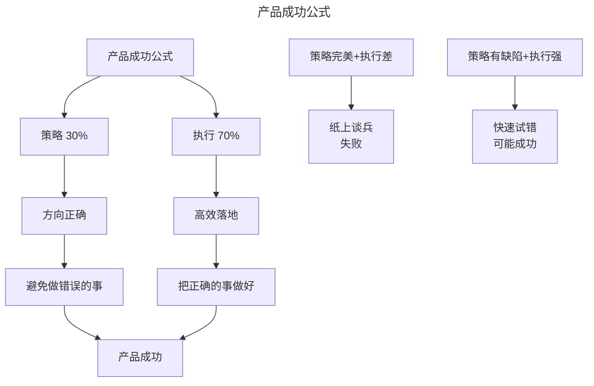

> **图解**：产品成功公式——策略占 30%（方向正确、避免做错误的事）+ 执行占 70%（高效落地、把正确的事做好）= 产品成功。策略完美但执行差是纸上谈兵失败，策略有缺陷但执行强可通过快速试错可能成功。

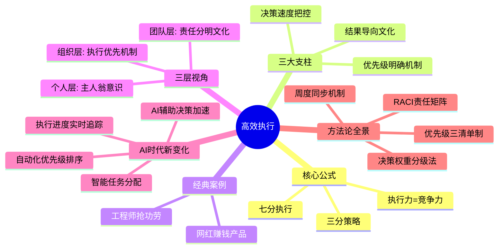

> **图解**：高效执行——核心公式（三分策略七分执行、执行力=竞争力）、三大支柱（结果导向文化、决策速度把控、优先级明确机制）、经典案例、三层视角（个人/团队/组织层）、AI 时代新变化、方法论全景（RACI、决策权重分级、优先级三清单、周度同步）。

---

## 2. 核心方法论

### 2.1 结果导向、责任分明的团队文化

**执行力差的根源**——很多团队的策略听上去非常靠谱，但具体执行时却杂乱无章：群龙无首、内部斗争不断，需要花费大量时间在内部事务上，团队效率低下，产品开发停滞不前。**出现这种问题最根本的原因是：衡量团队成员工作表现的标准出了问题，给了不做事只吹牛的人太多"消极怠工"的机会。**

我曾合作过一个团队，其中有一个工程师非常擅长在大组开会时夸夸其谈，但实际操作时却极其不负责任、能推就推，到头来还抢别人的功劳。团队领导和产品经理并不怎么关注工程师的开发工作，这样的情况一直没有被注意到，这个工程师可以为所欲为。这不仅让其他工程师非常不爽，还大大拖慢了整个团队的效率。

**量化标准三要素**——作为产品经理，应该和工程经理一道，确保每个工程师、设计师的工作表现有明确的量化标准。这要求：

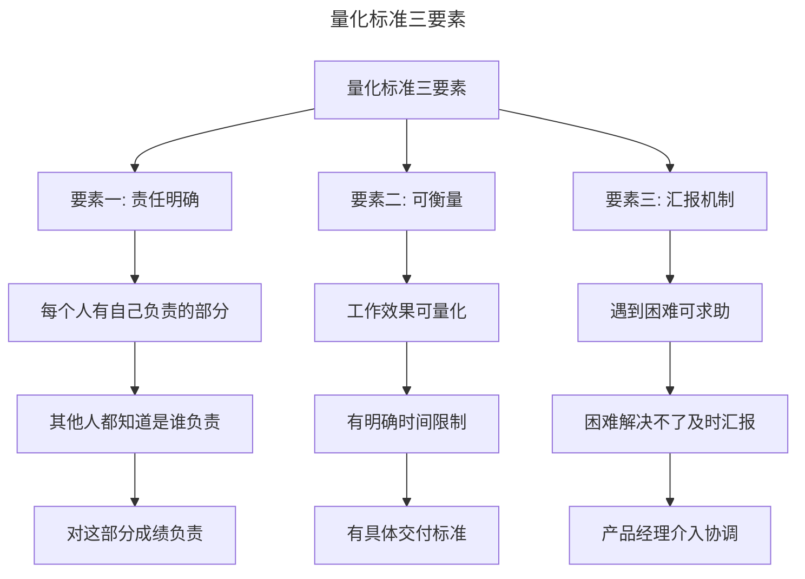

> **图解**：量化标准三要素——责任明确（每个人有自己负责的部分、其他人知道是谁负责、对成绩负责）、可衡量（效果可量化、有明确时间限制、有具体交付标准）、汇报机制（遇到困难可求助、解决不了及时汇报、产品经理介入协调）。

**核心逻辑**：让每个工程师和设计师觉得自己是这个部分的负责人，引导他们的主人翁意识，这样才能真正推动他们的能动性，让他们真正在乎自己所做工作的结果。

**杜绝抢功劳**——当你发现有抢别人功劳的事情发生时，绝不能手软，要明确说明这样的行为不被允许，从而保证不会因此影响团队士气。**有了明确的量化标准和责任范围，抢功劳和碌碌而为混日子这样的行为就没有了滋生的土壤，这对提高团队的执行力非常重要。**

**RACI 责任矩阵**——RACI 矩阵是明确责任分工的经典工具：

| 角色 | R (Responsible) | A (Accountable) | C (Consulted) | I (Informed) |
|------|-----------------|-----------------|---------------|--------------|
| 定义 | 执行任务的人 | 对结果负责的人 | 被咨询意见的人 | 被告知结果的人 |
| 数量 | 可以多人 | 必须仅一人 | 可以多人 | 可以多人 |
| 案例 | 工程师A写代码 | 产品经理对功能负责 | 设计师提供UI建议 | 市场部被告知发布时间 |

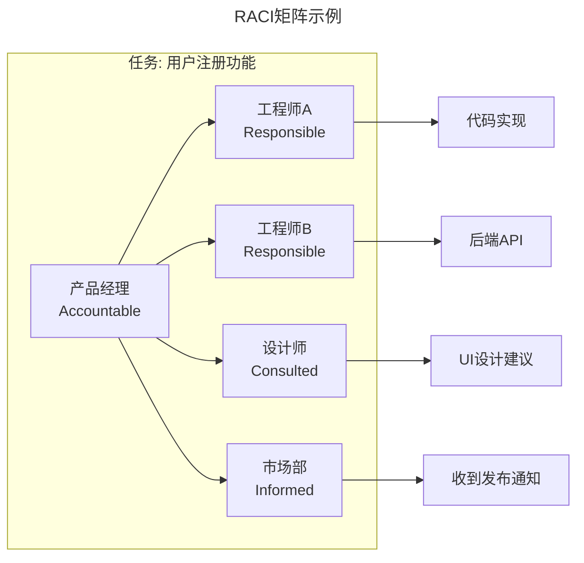

> **图解**：RACI 矩阵示例——用户注册功能任务中，产品经理是 Accountable（对结果负责），工程师 A 和工程师 B 是 Responsible（执行任务），设计师是 Consulted（被咨询意见），市场部是 Informed（被告知结果）。R 可以多人，A 必须仅一人。

### 2.2 把控团队做决定的速度

**决策速度的两难**——很多科技公司的文化是希望每个人都有主人翁意识，所以做决定时希望能得到大家的一致同意。这么做的好处是团队每个人都觉得自己受到尊重，激发积极性，增加士气；潜在风险是要花太多时间做决定，增加执行成本，延长产品开发时间。但并不是每个决定都需要每个人一起做出。什么样的决定要快很准地做出，什么样的决定要积极听取大家的意见，需要产品经理来把控。

**决策权重分级法**——**每一个决定都有一个对应的可争论时间，时间长短由这个决定的重要程度决定。**

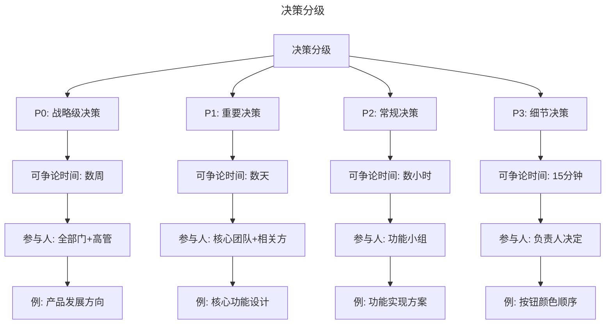

> **图解**：决策分级——P0 战略级（可争论数周、全部门+高管、例：产品发展方向）；P1 重要级（可争论数天、核心团队+相关方、例：核心功能设计）；P2 常规级（可争论数小时、功能小组、例：功能实现方案）；P3 细节级（可争论 15 分钟、负责人决定、例：按钮颜色顺序）。

| 决策级别 | 可争论时间 | 参与人员 | 典型案例 |
|---------|-----------|---------|---------|
| P0 战略级 | 数周 | 全部门+高管 | 产品发展方向、商业模式 |
| P1 重要级 | 数天 | 核心团队+相关方 | 核心功能设计、用户资格标准 |
| P2 常规级 | 数小时 | 功能小组 | 功能实现方案、技术选型 |
| P3 细节级 | 15分钟 | 负责人决定 | UI细节、文案措辞 |

**案例：网红赚钱产品的决策分级**——我们曾做一个帮助网红赚钱的产品，需要对这个产品的具体问题进行讨论并做出决定。

**P1 重要决策：什么样的网红有资格使用这个产品？** 这个决定关系到产品发展模式、网红运营模式等，非常重要。负责网红关系运营的同事、法律和支付部门的同事都参加了讨论，我们花了几周时间才制定出策略。虽然这个决定花了很多时间，但让每个部门的同事都有参与讨论的机会非常重要。

**P3 细节决策：新用户体验的第一步和第二步的顺序应该是什么？** 如果大家争论不休、无法取得统一意见，而工程师在等着这个决定进行下一步开发时，就需要产品经理出面解决。当时我说："这个决定并不是最重要的，不应该花这么多时间讨论，我们可以先按照原来的顺序，后期根据用户反馈，我们还有修改的余地。"这样既让大家意识到时间不多了，我们得赶快开始，又给持不同意见的人留了面子，大家就可以很愉快地推进产品进度了。

**决策速度把控的核心原则**：

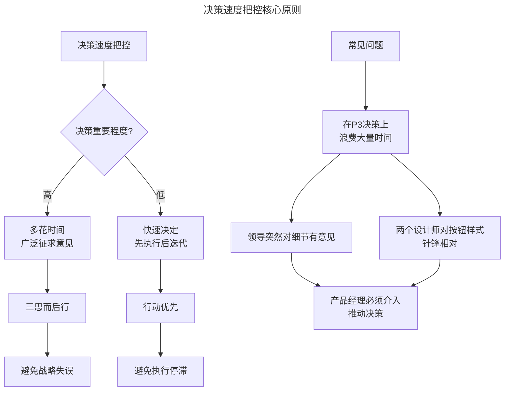

> **图解**：决策速度把控核心原则——根据决策重要程度：高则多花时间广泛征求意见（三思而后行、避免战略失误），低则快速决定先执行后迭代（行动优先、避免执行停滞）。常见问题是在 P3 决策上浪费大量时间（领导突然对细节有意见、设计师对按钮样式针锋相对），此时产品经理必须介入推动决策。

**某个领导突然对某个小细节有意见，或者两个设计师对某个按钮的样式不能统一意见、开始针锋相对，在不值得的决定上浪费太多时间，是我见过的执行能力差的团队的通病。** 作为产品经理，确保产品的执行效率是首要责任，而把控团队做决定的速度是最重要的一环。敢于对团队成员说"这个决定我们讨论得可以了"，并且能够说服他们赶快行动，是衡量一个产品经理能力水平的准绳。

---

## 3. 关键流程

### 3.1 明确产品功能的优先级

**优先级沟通的误区**——每个设计师和工程师都有做不完的任务、写不完的文档和代码、加不完的班。指望大家能把所有工作都做完，不切实际。我刚入行时，发现一些工程师总是慢吞吞的，他们总加班但产品开发工作就是做不完。后来我发现，他们的时间全花在改一些无关紧要的 Bug 上了，而重要的产品开发工作却被扔在一边，拖慢了产品开发进度。

**首先，你必须意识到：不能假设工程师和你对优先级的把控是一样的，在优先级的问题上一定要重复重复再重复，明确明确再明确。**

**优先级三清单制**——**好方法：明确告诉你的团队成员，哪部分工作是优先级较低的。**

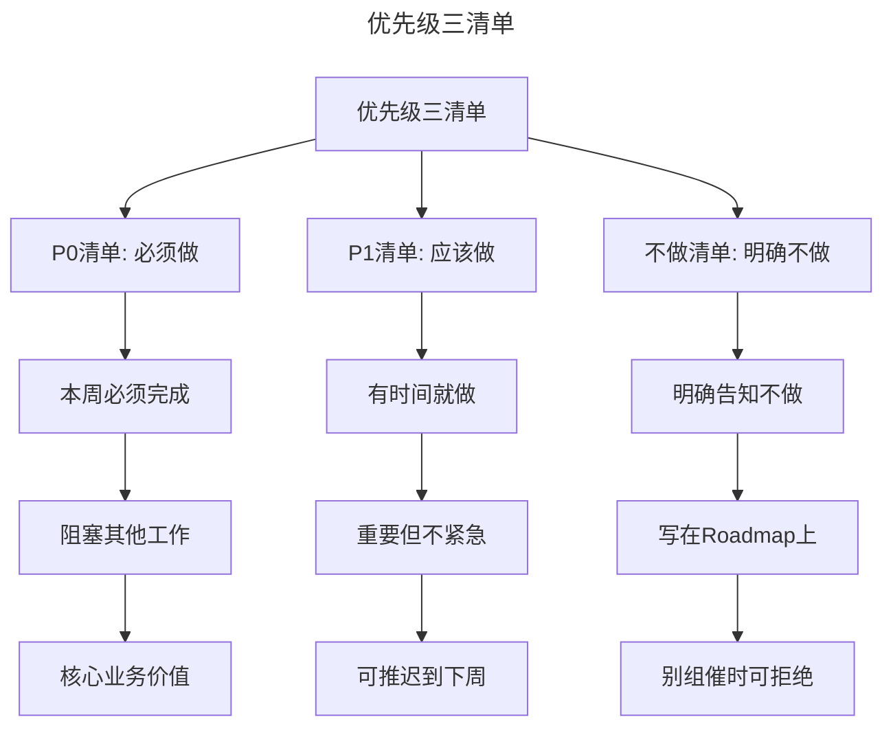

> **图解**：优先级三清单——P0 清单（必须做：本周必须完成、阻塞其他工作、核心业务价值）、P1 清单（应该做：有时间就做、重要但不紧急、可推迟到下周）、不做清单（明确不做：明确告知不做、写在 Roadmap 上、别组催时可拒绝）。

你可以向团队成员说明产品优先级时，顺道说说哪些工作确定不是优先级高的；你还可以在路线图（Roadmap）上说明哪部分是明确不做的。这样做可以让工程师排除不重要的工作，减少浪费时间的情况。

优先级高的内容毕竟有限，但很多时候工程师有非常多的任务需要处理，经常一投入到代码中就忘记了产品优先级、指标，或者别的组的人一催，就忘记了什么工作是最重要的。**如果你能清楚地告诉工程师什么内容是不重要的，这些内容出现的时候可以忽略，别的组的人催的时候可以拒绝，就可以帮工程师减少很多分散精力的工作。**

**周度优先级同步机制**——**其次，产品的优先级要每周至少沟通一次，这可以强化团队成员的优先级意识，让他们更好地规划自己的时间。** 我的团队每周都有一个工程师优先级会议，会把所有的产品功能一个一个地捋一遍，明确优先级，如果有突发情况需要修改优先级也会在这个时候告诉大家。这样的优先级会议，我一般选在周一召开，以方便工程师和设计师合理分配他们一周的时间。

**跨团队优先级透明化**——**最后，只有团队成员都了解了其他人的优先级，才能更顺利、有效率地合作。** 比如，工程师 A 和 B 都需要我做代码评审，如果我们都知道工程师 A 这部分的内容优先级更高、对产品更重要，我就可以先帮工程师 A 评审，而工程师 B 对此也不会有怨言。因此，清晰沟通了产品优先级，团队的合作和执行就成功了一半。

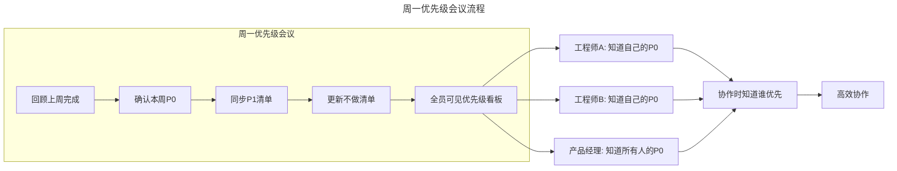

> **图解**：周一优先级会议流程——回顾上周完成→确认本周 P0→同步 P1 清单→更新不做清单→全员可见优先级看板→各角色知道自己的 P0→协作时知道谁优先→高效协作。

---

## 4. 工具与实战

### 4.1 三层视角：从个人到组织的执行力建设

**个人层：主人翁意识**——在个人层面，每个团队成员都需要培养主人翁意识——把自己负责的部分当成自己的产品，对结果负责，而不是仅仅完成任务。主人翁意识不是天生的，需要通过明确的责任边界和量化标准来激发。

**团队层：责任分明文化**——在团队层面，建立结果导向、责任分明的文化。杜绝抢功劳的情况，让每个工程师明确自己的任务是什么、责任是什么、对团队的贡献是什么。当责任边界清晰时，推诿和抢功就失去了土壤。

**组织层：执行优先机制**——在组织层面，建立执行优先的机制。把控每个产品决定值得花费的时间，对于在不重要的决定上花太多时间的情况，要适时果断地给出方向，让大家先执行，避免浪费太多时间。定期召开优先级会议，让每个成员明确自己的优先级，了解他人的优先级。

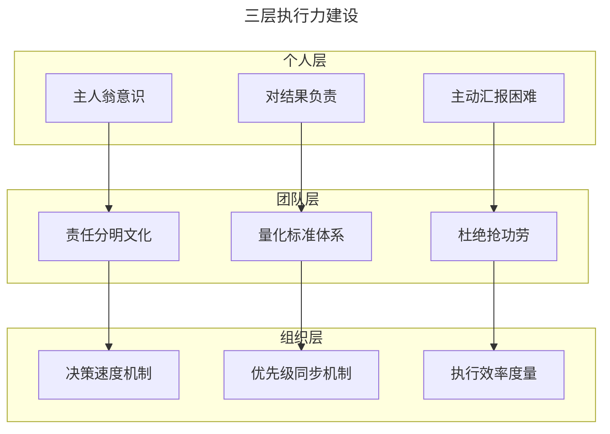

> **图解**：三层执行力建设——个人层（主人翁意识、对结果负责、主动汇报困难）→团队层（责任分明文化、量化标准体系、杜绝抢功劳）→组织层（决策速度机制、优先级同步机制、执行效率度量），逐层支撑。

### 4.2 AI 时代的执行力新范式

**AI 辅助决策加速**——传统决策依赖人工收集信息、分析利弊、征求意见，耗时漫长。AI 可以在秒级完成信息收集、数据分析、方案对比，大幅压缩决策准备时间。产品经理可以把更多时间花在真正需要人工判断的战略决策上。

**自动化优先级排序**——AI 可以根据业务目标、资源约束、依赖关系、风险等级等因素，自动对任务进行优先级排序。这比人工排序更客观、更全面，避免了"谁嗓门大谁优先"的问题。

**智能任务分配**——AI 可以根据工程师的技能匹配度、当前负载、历史表现等因素，智能分配任务，实现资源的最优配置。这比人工分配更高效、更公平。

**执行进度实时追踪**——AI 可以实时追踪每个任务的执行进度，自动识别延期风险，提前预警。产品经理不再需要逐个询问进度，可以把精力放在解决阻塞问题上。

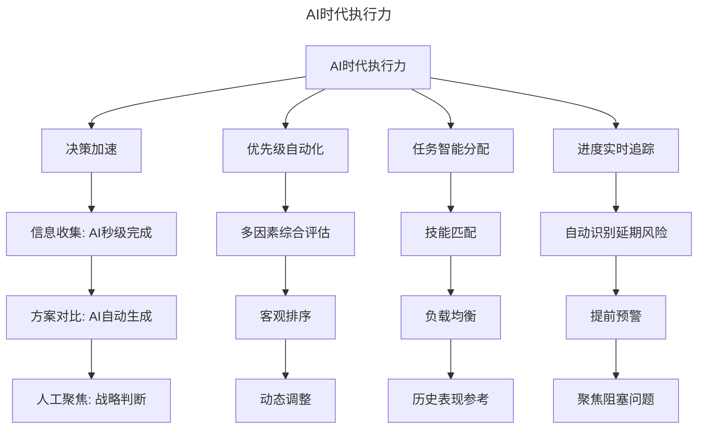

> **图解**：AI 时代执行力——决策加速（信息收集 AI 秒级完成、方案对比自动生成、人工聚焦战略判断）、优先级自动化（多因素综合评估、客观排序、动态调整）、任务智能分配（技能匹配、负载均衡、历史表现参考）、进度实时追踪（自动识别延期风险、提前预警、聚焦阻塞问题）。

### 4.3 方法论全景：高效执行四步法

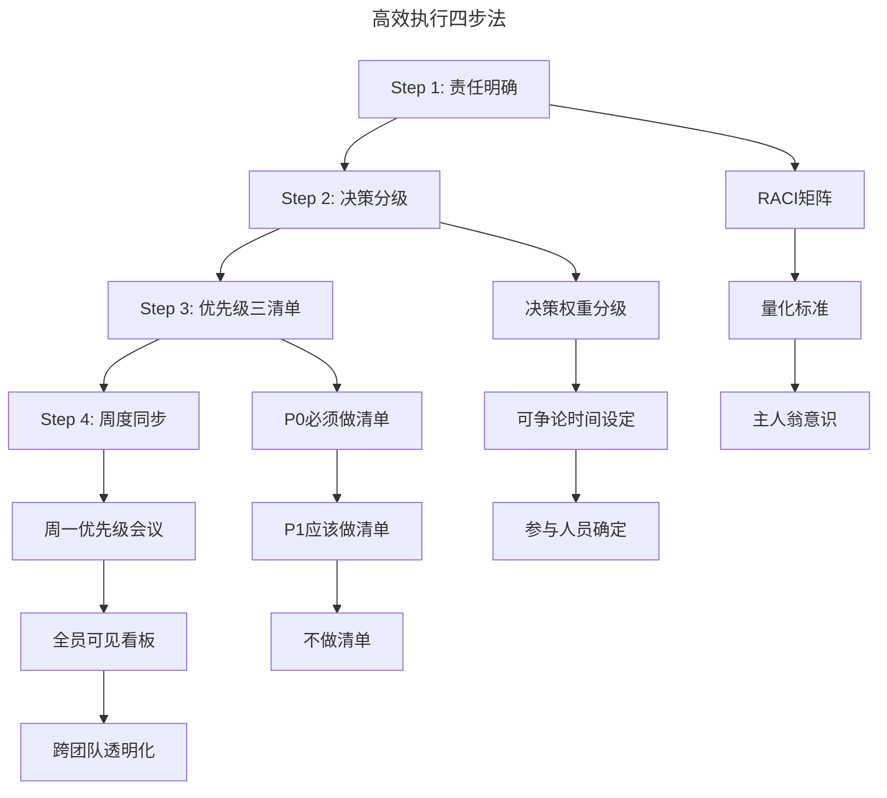

> **图解**：高效执行四步法——Step 1 责任明确（RACI 矩阵、量化标准、主人翁意识）→Step 2 决策分级（决策权重分级、可争论时间设定、参与人员确定）→Step 3 优先级三清单（P0 必须做、P1 应该做、不做清单）→Step 4 周度同步（周一优先级会议、全员可见看板、跨团队透明化）。

| 步骤 | 方法 | 关键动作 | 产出 |
|------|------|---------|------|
| 责任明确 | RACI矩阵+量化标准 | 为每个任务明确R/A/C/I | 责任矩阵文档 |
| 决策分级 | 决策权重分级法 | 为每个决策设定可争论时间 | 决策分级清单 |
| 优先级三清单 | P0/P1/不做清单 | 明确做什么、不做什么 | 优先级看板 |
| 周度同步 | 周一优先级会议 | 全员同步、动态调整 | 周度优先级报告 |

---

## 5. 常见误区

| 误区 | 表现 | 正确做法 |
|------|------|---------|
| **量化标准缺失** | 不关注工程师开发工作，让抢功者钻空子 | 建立量化标准三要素，杜绝抢功劳 |
| **决策不分级** | 在 P3 细节决策上浪费大量时间 | 用决策权重分级法，设定可争论时间 |
| **优先级不明确** | 工程师花时间改无关 Bug | 用优先级三清单制，明确不做什么 |
| **优先级不周同步** | 工程师忘记产品优先级 | 每周至少沟通一次优先级 |
| **不透明化优先级** | 团队不知道彼此的优先级 | 跨团队优先级透明化，高效协作 |

---

## 6. 进阶延展

### 6.1 核心术语

| 术语 | 英文 | 定义 |
|------|------|------|
| 执行力 | Execution Capability | 团队在有限时间内取得进展的能力 |
| 结果导向 | Results-Oriented | 以实际产出而非过程衡量工作表现 |
| 主人翁意识 | Ownership Mindset | 把负责的部分当成自己的产品，对结果负责 |
| RACI矩阵 | RACI Matrix | 责任分配矩阵，明确Responsible/Accountable/Consulted/Informed |
| 决策权重分级 | Decision Weight Grading | 根据决策重要程度设定可争论时间的方法 |
| 优先级三清单 | Priority Three Lists | P0必须做/P1应该做/不做清单的优先级管理方法 |
| 路线图 | Roadmap | 产品发展计划，包含功能和时间安排 |

### 6.2 思考题

1. 你的团队在执行上遇到的最大问题是什么？是责任不明确、决策太慢、还是优先级混乱？
2. 如果一个重要决策需要在一天内做出，但团队意见分歧很大，你会如何处理？
3. 在 AI 辅助决策的时代，产品经理在决策过程中的核心价值是什么？哪些决策必须由人来做？

### 6.3 延伸阅读

1. **《High Output Management》** — Andrew Grove：英特尔前 CEO 安迪·格鲁夫的经典著作，讲述如何管理团队产出，对决策速度和优先级管理有深刻讨论
2. **《Measure What Matters》** — John Doerr：OKR 方法论，如何通过目标和关键结果对齐团队优先级
3. **《The Effective Executive》** — Peter Drucker：德鲁克的管理经典，讲述高效管理者的习惯，包括"要事优先"
4. **RACI Matrix 实践指南** — PMI 项目管理协会的 RACI 矩阵使用指南
5. **Agile 优先级管理** — Scrum 框架中的 Product Backlog 优先级排序方法
