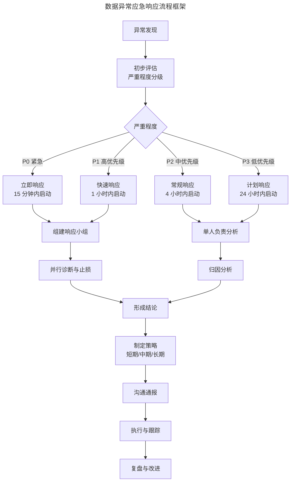
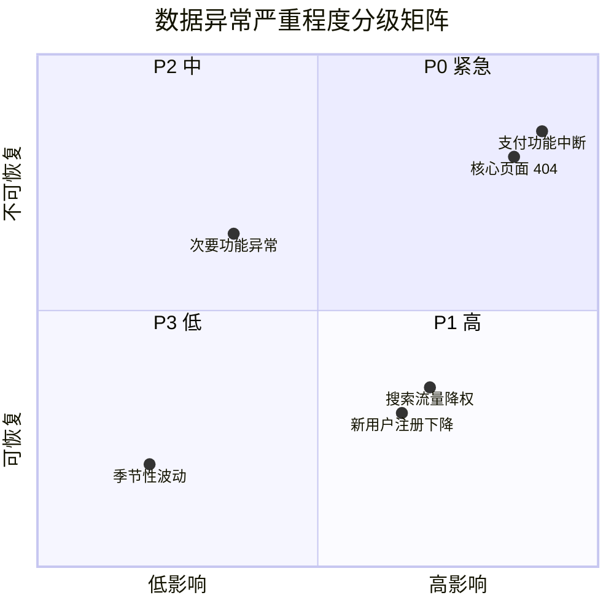
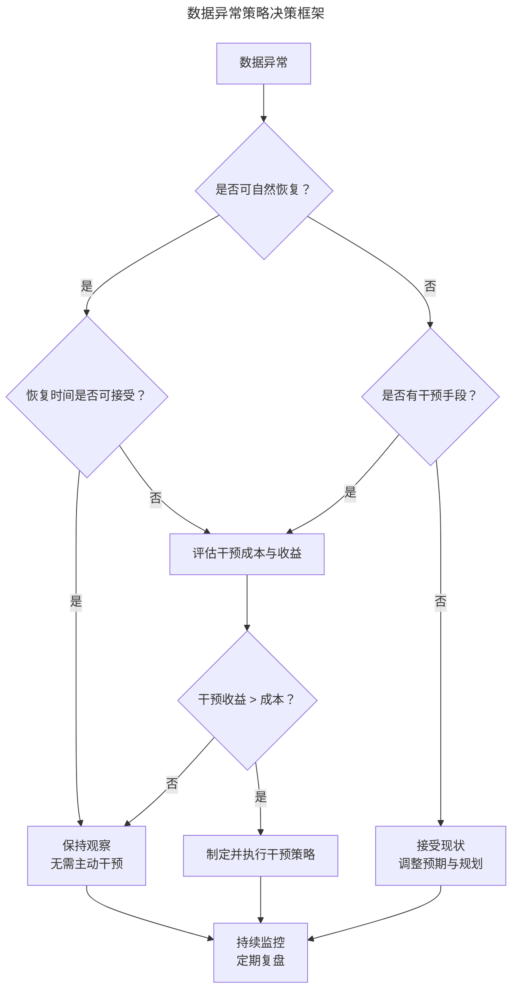

# 数据异常的应急响应与长效治理

> **适用范围**：产品经理（各阶段）、数据产品经理、需要负责数据异常响应的团队负责人。适用于应急响应、严重程度分级、沟通规范、应对策略、长效治理、SRE 实践等场景。
>
> **更新摘要（v2 · 2026-08 更新）**：
> - 结构化升级为 6 节骨架（导言 / 核心方法论 / 关键流程 / 工具与实战 / 常见误区 / 进阶延展）
> - 保留应急响应流程框架、分级矩阵、结论形成规范、沟通规范、应对策略、自动化响应、SRE 借鉴、长效治理
> - 保留全部 Mermaid 图并补充 `--- title: ... ---` frontmatter，每张图后追加文字解读

---

## 1. 导言

数据异常诊断的终点并非完成分析，而是形成结论、有效沟通并驱动行动。产品经理作为产品线的负责人，在数据异常事件中承担着"信息枢纽"与"决策驱动者"的双重角色——既需向相关方通报异常情况与归因结论，更需制定短期、中期、长期的应对策略，将数据洞察转化为产品行动。

本文将系统阐述数据异常的应急响应框架、分级分类机制、沟通规范以及长效治理策略，构建从"发现问题"到"解决问题"的完整闭环。

### 1.1 应急响应流程框架

数据异常的应急响应遵循结构化的流程框架，确保响应的及时性、完整性与可追溯性：



> **图解**：数据异常应急响应流程框架——异常发现→初步评估严重程度分级（P0 紧急 15 分钟内启动、P1 高 1 小时内启动、P2 中 4 小时内启动、P3 低 24 小时内启动）→P0/P1 组建响应小组并行诊断与止损，P2/P3 单人负责归因分析→形成结论→制定短期/中期/长期策略→沟通通报→执行与跟踪→复盘与改进。

该框架的核心设计原则包括：分级响应（根据严重程度匹配响应资源，避免过度响应或响应不足）；并行处理（紧急事件中诊断与止损并行，缩短恢复时间）；闭环管理（从发现到复盘形成完整闭环，确保持续改进）。

---

## 2. 核心方法论

### 2.1 严重程度分级矩阵

**分级标准**——数据异常的严重程度需从业务影响、影响范围、持续时间、可恢复性四个维度综合评估：

| 严重程度 | 业务影响 | 影响范围 | 持续时间 | 可恢复性 | 响应时效 |
|---------|---------|---------|---------|---------|---------|
| P0 紧急 | 核心业务中断、重大收入损失 | 全站/核心用户群 | 持续恶化 | 需立即干预恢复 | 15 分钟内启动 |
| P1 高 | 核心指标显著下降（>30%） | 主要用户群/核心功能 | 超过 24 小时 | 需主动干预恢复 | 1 小时内启动 |
| P2 中 | 重要指标明显下降（10-30%） | 部分用户群/次要功能 | 超过 48 小时 | 可自然恢复或需干预 | 4 小时内启动 |
| P3 低 | 指标轻微波动（<10%） | 小范围用户 | 短期波动 | 可自然恢复 | 24 小时内启动 |

**分级决策矩阵**：



> **图解**：数据异常严重程度分级矩阵——横轴影响程度、纵轴可恢复性。支付功能中断、核心页面 404 落入 P0 紧急（高影响、不可恢复）；搜索流量降权、新用户注册下降落入 P1 高（中高影响）；次要功能异常落入 P2 中；季节性波动落入 P3 低。

**分级调整机制**——严重程度分级并非一成不变，需根据事态发展动态调整：升级条件（影响范围扩大、持续时间超预期、业务损失加剧）；降级条件（问题已定位且可控、影响已开始收敛、业务有替代方案）；调整时机（每次关键信息更新后重新评估）。

### 2.2 分析结论的形成规范

**结论结构化模板**——优秀的数据分析报告应遵循"现象-结论-依据-建议"的结构：

```
【异常通报】
某产品流量昨日环比下降 XX%。

【归因结论】
主要下降原因是平台新用户引流减少，推测是兄弟部门平台产品入口页面改版导致。

【分析依据】
1. 渠道分析：来自兄弟部门平台的引荐流量下降 XX%，其他渠道正常
2. 用户分析：新用户下降 XX%，老用户基本持平
3. 时间分析：流量下降起始时间与兄弟部门改版上线时间吻合

【建议措施】
短期：与兄弟部门沟通确认改版影响，协商恢复入口或调整引流策略
中期：建立跨部门数据监控机制，提前感知类似变更
长期：拓展多元化获客渠道，降低单一渠道依赖
```

**"五个为什么"与"五个那会怎样"**——形成结论的核心方法是向上追溯原因（Why）与向下推测结果（So What）：

**向上追溯：五个为什么**
```
流量降低 20%，为什么？
→ 因为商品详情页流量降低了。
为什么？
→ 因为引荐流量降低了。
为什么？
→ 因为投放渠道到期了。
为什么？
→ 因为预算审批流程延迟导致续费不及时。
为什么？
→ 因为财务审批流程与投放周期不匹配。
```

**向下推测：五个那会怎样**
```
流量降低 20%，那会怎样？
→ 商品详情页曝光减少，转化量下降。
那会怎样？
→ GMV 预计下降 XX%。
那会怎样？
→ 本月收入目标可能无法达成。
那会怎样？
→ 需要调整运营策略或下调业绩预期。
那会怎样？
→ 可能影响团队绩效与资源分配。
```

当"五个为什么"与"五个那会怎样"的自问自答能够形成完整链条，且对结论感到满意时，即可认为分析已形成有效结论。

**结论质量检验标准**：

| 检验维度 | 合格标准 | 不合格表现 |
|---------|---------|-----------|
| 完整性 | 覆盖现象、原因、影响、建议四要素 | 只给现象不给结论 |
| 准确性 | 数据支撑充分，逻辑链条完整 | 结论与数据矛盾或缺乏依据 |
| 可行动性 | 建议具体、可执行、有责任人 | 建议模糊，无法落地 |
| 简洁性 | 一次沟通说清，无需反复补充 | 需多次补充信息才能说清 |

---

## 3. 关键流程

### 3.1 有效沟通规范

**沟通原则**——数据异常沟通的核心原则是"结论先行、信息完整、一次说清"：结论先行（开篇直接给出结论，而非铺垫分析过程）；信息完整（现象、原因、影响、建议四要素齐全）；一次说清（避免"挤牙膏式"沟通，一次性提供完整信息）。

**沟通禁忌**——**禁忌一：只给现象不给结论**。"流量下降了 20%"——这是现象，不是结论。若产品经理仅汇报现象而无分析结论，则沦为"数据工具的传声筒"，未发挥应有的专业价值。

**禁忌二：反复补充信息**。典型反面案例：
> 总监：用户量最近是不是降低了？
> 产品经理：是的。
> 总监：为什么？
> 产品经理：获客不力。
> 总监：哪个渠道出了问题？
> 产品经理：合作方的投放。
> 总监（不耐烦）：哪个合作方？什么问题？怎么解决？你能不能一次把话说完？

此类"挤牙膏式"沟通严重影响沟通效率与专业形象。正确做法是一次性提供完整信息：
> 产品经理：用户量最近下降了 15%，主要原因是合作方 A 的投放因预算到期而暂停。我已与合作方沟通，预计明天恢复投放，预计 3 天内用户量可恢复至正常水平。

**沟通对象与渠道**：

| 沟通对象 | 沟通重点 | 推荐渠道 | 时效要求 |
|---------|---------|---------|---------|
| 技术团队 | 技术排查需求、故障定位 | 即时通讯、工单系统 | 立即 |
| 业务负责人 | 业务影响、资源协调 | 邮件、会议 | 1 小时内 |
| 管理层 | 结论摘要、决策建议 | 邮件摘要、简报 | 4 小时内 |
| 跨部门协作方 | 影响说明、协作请求 | 邮件、正式会议 | 视紧急程度 |

### 3.2 应对策略框架

**短期、中期、长期策略**——应对策略应从时间维度进行分层规划：

| 时间维度 | 目标 | 典型措施 | 资源投入 |
|---------|------|---------|---------|
| 短期（即时-1周） | 快速止损、恢复指标 | 紧急修复、临时方案、应急投放 | 立即投入资源 |
| 中期（1周-1季度） | 修复机制、防止复发 | 流程优化、监控完善、系统改造 | 列入需求池评估 |
| 长期（1季度以上） | 根本治理、战略调整 | 架构优化、战略转型、能力建设 | 纳入规划讨论 |

**案例分析：搜索引擎流量下降**——以"百度自然搜索流量下降导致整站流量下降"为例：
- **短期策略（立即执行）**：向百度站长平台反馈站点收录变化；请 SEO 团队检查收录减少的页面结构；对可能影响收录的功能点做紧急调整；将 SEO 细节数据（爬虫访问、爬虫路径、收录、展示、排名）列入每日监控。
- **中期策略（1-2 周内启动）**：规划自动静态列表页与静态类目页的 SEO 优化项目；重新优化主要搜索引擎着陆页；建立搜索引擎流量监控告警机制。
- **长期策略（季度规划）**：评估当前流量对搜索引擎的依赖程度（当时该产品线搜索引擎流量占比过半，主要来自百度）；规划自有流量池建设：社区产品、工具产品等；稀释搜索引擎流量占比，降低对单一搜索引擎的依赖。

**策略决策框架**——并非所有数据异常都需要主动干预，策略选择需权衡成本与收益：



> **图解**：数据异常策略决策框架——数据异常后判断是否可自然恢复：是则看恢复时间是否可接受（可接受保持观察，否则评估干预成本收益）；否则看是否有干预手段（有则评估干预成本收益，否则接受现状调整预期）。干预收益 > 成本则制定并执行干预策略，否则保持观察。最终持续监控定期复盘。

---

## 4. 工具与实战

### 4.1 自动化应急响应体系（2024-2026）

**事件管理平台集成**——现代应急响应已从人工驱动演进为平台驱动。主流事件管理平台提供了完整的自动化响应能力：

| 平台 | 核心能力 | 集成生态 | 适用场景 |
|------|---------|---------|---------|
| PagerDuty | 值班调度、升级策略、事件聚合 | 300+ 集成 | 企业级事件响应 |
| Opsgenie | 告警路由、值班管理、事后分析 | Jira/Confluence 深度集成 | Atlassian 生态用户 |
| VictorOps (Splunk On-Call) | 告警去重、协作响应、时间线记录 | Splunk 生态集成 | 安全与运维场景 |
| Datadog Incident Management | 指标关联、根因分析、事后复盘 | Datadog 全栈集成 | 可观测性驱动响应 |

**自动化响应工作流**——2024-2026 年的自动化响应能力已实现以下场景：自动告警路由（根据告警类型、严重程度自动路由至对应值班人员）；智能降噪（对相关告警进行聚合，避免告警风暴 Alert Storm）；自动执行修复（对已知问题类型自动执行预设修复脚本，如重启服务、扩容、回滚）；自动生成时间线（记录事件全过程的操作与决策，为复盘提供依据）；自动生成事后报告（基于时间线自动生成 PIR 报告初稿）。

**SRE 实践的借鉴**——站点可靠性工程（SRE, Site Reliability Engineering）的实践对产品经理的数据异常响应具有重要借鉴价值：

| SRE 实践 | 核心概念 | 产品经理应用 |
|---------|---------|------------|
| SLI/SLO/SLA | 服务水平指标、目标、协议 | 定义产品指标的健康阈值与响应标准 |
| Error Budget | 错误预算 | 定义可接受的指标波动范围 |
| Incident Command | 事件指挥体系 | 建立数据异常响应的角色分工 |
| Blameless Postmortem | 无责复盘 | 建立开放、学习的复盘文化 |
| Runbook | 运维手册 | 建立数据异常的标准响应流程 |

### 4.2 长效治理机制

**复盘机制**——每次数据异常事件均应进行复盘（Postmortem/Retrospective），复盘的核心目标是学习与改进，而非追责。复盘报告应包含：事件概述（时间线、影响范围、严重程度）；根因分析（直接原因、深层原因、系统性原因）；响应评估（响应时效、沟通效率、措施有效性）；改进措施（短期修复、中期优化、长期治理）；责任人与时间表（每项改进措施的责任人与完成时间）。

**知识库建设**——将历史异常事件及其响应经验沉淀为知识库，实现以下价值：加速诊断（类似异常发生时可快速参考历史案例）；培训素材（帮助新成员快速建立异常响应能力）；自动化规则输入（为告警规则与自动化响应提供业务逻辑输入）。

**监控体系持续优化**——数据异常响应能力的提升是一个持续迭代的过程：告警规则优化（根据历史误报、漏报情况调整告警阈值与规则）；监控维度扩展（根据历史异常中发现的盲区补充监控维度）；响应流程迭代（根据复盘发现的问题优化响应流程）；工具链升级（引入新的自动化工具提升响应效率）。

**组织能力建设**——长效治理的最终落脚点是组织能力的建设：角色分工明确（定义数据异常响应中的角色：发现者、分析者、决策者、执行者）；值班机制建立（确保关键时段有明确的响应责任人）；演练常态化（定期进行数据异常响应演练，检验流程与工具的有效性）；能力培训体系（建立数据能力培训体系，持续提升团队整体数据素养）。

### 4.3 实战要点

| 要点 | 说明 | 适用场景 |
|------|------|----------|
| 分级响应 | 按严重程度匹配响应资源 | 所有异常响应 |
| 并行诊断止损 | 紧急事件中诊断与止损并行 | P0/P1 事件 |
| 结论结构化 | 现象-结论-依据-建议四要素 | 分析报告撰写 |
| 结论先行沟通 | 开篇直接给结论，一次说清 | 所有沟通场景 |
| 短期/中期/长期策略 | 时间维度分层规划应对 | 异常应对 |
| 权衡干预成本收益 | 并非所有异常都需干预 | 策略选择 |
| SRE借鉴 | SLI/SLO、Error Budget、无责复盘 | 数据异常响应体系 |
| 复盘机制 | 学习与改进，而非追责 | 每次异常后 |
| 知识库建设 | 沉淀历史异常响应经验 | 团队级能力建设 |

---

## 5. 常见误区

| 误区 | 表现 | 正确做法 |
|------|------|---------|
| **只给现象不给结论** | 汇报"流量下降了20%"无分析结论 | 提供"现象-结论-依据-建议"完整信息 |
| **挤牙膏式沟通** | 反复补充信息，一次说不清 | 结论先行、信息完整、一次说清 |
| **过度响应** | 轻微波动也投入大量资源 | 按严重程度分级响应，权衡成本收益 |
| **忽视长期治理** | 只做应急修复，不治本 | 短期止损、中期防复发、长期根本治理 |
| **追责式复盘** | 复盘聚焦追责而非改进 | 用无责复盘（Blameless Postmortem） |

---

## 6. 进阶延展

### 6.1 总结

数据异常的应急响应与长效治理是产品经理数据能力的最终体现。响应流程遵循"分级响应、并行处理、闭环管理"的原则，严重程度分级确保资源投入与问题影响相匹配。分析结论的形成需遵循"现象-结论-依据-建议"的结构，沟通需做到"结论先行、信息完整、一次说清"。

应对策略应从短期、中期、长期三个时间维度进行规划，短期止损、中期防复发、长期根本治理。策略选择需权衡干预成本与收益，并非所有异常都需要主动干预。

2024-2026 年，自动化应急响应体系与 SRE 实践的引入正在重塑产品经理的异常响应方式。事件管理平台、自动化响应工作流、无责复盘机制等工具与方法的结合，使得响应效率与质量显著提升。

长效治理的核心是建立"发现-响应-复盘-改进"的持续学习闭环，通过知识库建设、监控优化、组织能力建设，实现异常响应能力的持续提升。最终目标是构建一个能够快速感知、精准归因、有效响应、持续改进的数据异常治理体系。

### 6.2 参考文献

- Beyer, B., Jones, C., Petoff, J., & Murphy, N. R. (2016). *Site reliability engineering: How Google runs production systems*. O'Reilly Media.
- PagerDuty. (2025). *Incident response best practices guide*. https://www.pagerduty.com/resources/incident-response
- Limoncelli, T. A., Chalup, S. R., & Hogan, C. J. (2014). *The practice of cloud system administration: Designing and operating large distributed systems*. Addison-Wesley.
- Atlassian. (2025). *Opsgenie: Modern incident management*. https://www.atlassian.com/software/opsgenie
- Datadog. (2025). *Incident management: Streamline your response workflow*. https://docs.datadoghq.com/incident_management
- NIST. (2012). *Computer security incident handling guide: Special publication 800-61 revision 2*. National Institute of Standards and Technology.
