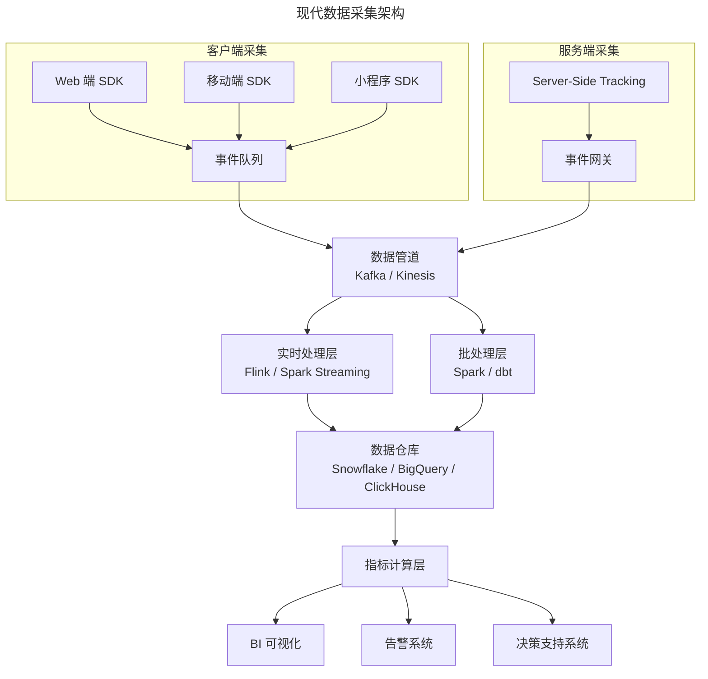
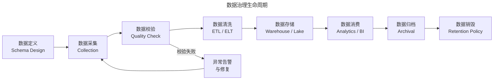

# 数据采集的工程化实践与治理框架

> **适用范围**：产品经理、数据产品经理、数据分析师、数据工程师、需要构建数据采集体系的团队负责人。适用于埋点设计、数据治理、隐私合规、数据基准建立、AI 智能采集等场景。
>
> **更新摘要（v2 · 2026-08 更新）**：
> - 结构化升级为 6 节骨架（导言 / 核心方法论 / 关键流程 / 工具与实战 / 常见误区 / 进阶延展）
> - 保留目标回溯原则、三层采集模型、埋点规范、数据治理生命周期、隐私优先策略
> - 保留全部 Mermaid 图并补充 `--- title: ... ---` frontmatter，每张图后追加文字解读

---

## 1. 导言

数据采集（Data Collection / Data Instrumentation）是产品数据能力的基石。在数据驱动的产品实践中，采集环节的质量直接决定了后续分析、决策与优化的可靠性。然而，许多产品团队在数据采集环节存在两个典型问题：一是"先做后埋"，即在产品上线后才补加数据采集点，导致早期关键数据缺失；二是"野蛮采集"，即无差别地采集所有可能的数据，造成数据冗余、存储成本攀升及合规风险。

本文将从数据采集策略设计、埋点工程化最佳实践、数据治理体系以及隐私合规四个维度，系统阐述如何构建高质量的数据采集体系。同时结合 2024-2026 年隐私优先（Privacy-First）趋势下的最新实践，探讨 Server-Side Tracking、第一方数据（First-Party Data）策略等前沿方向。

---

## 2. 核心方法论

### 2.1 数据采集策略设计

**采集策略的制定原则**——数据采集策略的制定应遵循"目标回溯"原则：从业务决策需求出发，逆向推导所需的指标体系，再由指标体系确定采集点。这一过程可形式化为以下链路：

**业务目标 → 决策问题 → 指标定义 → 数据需求 → 采集方案**

该原则的核心在于：每一次数据采集都必须能够追溯到一个明确的业务决策场景。缺乏决策指向的采集不仅浪费工程资源，还可能引入噪音，干扰后续分析判断。

**采集范围的三层模型**——数据采集范围可划分为三个层次：

| 层级 | 名称 | 内容 | 采集频率 | 典型场景 |
|------|------|------|----------|----------|
| L1 | 基础运营层 | 核心业务指标（DAU、留存率、转化率等） | 实时/准实时 | 日常数据监控、异常告警 |
| L2 | 产品行为层 | 用户行为路径、功能使用深度、交互热力图 | 实时 | 功能优化、体验改进 |
| L3 | 战略决策层 | 竞品对标数据、市场趋势、用户画像 | 周期性（日/周/月） | 方向性决策、资源分配 |

三层模型的价值在于帮助团队区分采集优先级：L1 为必采项，L2 按产品迭代节奏逐步补充，L3 则根据战略需求定向采集。

**数据采集架构**——以下 Mermaid 图展示了现代数据采集的整体架构，涵盖客户端采集、服务端采集、数据管道与存储层：

> **图解**：现代数据采集架构——客户端采集（Web/移动端/小程序 SDK → 事件队列）与服务端采集（Server-Side Tracking → 事件网关）汇入数据管道（Kafka/Kinesis）→实时处理层（Flink/Spark Streaming）与批处理层（Spark/dbt）双轨→数据仓库（Snowflake/BigQuery/ClickHouse）→指标计算层→BI 可视化、告警系统、决策支持系统。

该架构的关键设计决策包括：客户端与服务端采集的分工（客户端采集用户交互行为如点击、滑动、页面停留，服务端采集业务结果数据如订单、支付、状态变更。2024 年以来，受隐私法规和浏览器限制（如 iOS ATT、Chrome 曾计划后暂缓的第三方 Cookie 弃用）影响，服务端采集的权重显著提升）；数据管道的解耦（采集端与处理端通过消息队列解耦，确保采集侧的高吞吐与处理侧的弹性伸缩互不干扰）；实时与批处理的双轨设计（实时处理用于监控告警和即时反馈，批处理用于深度分析和模型训练）。

### 2.2 埋点工程化最佳实践

**埋点设计规范**——埋点（Instrumentation / Event Tracking）是数据采集的核心工程环节。规范的埋点设计应包含以下要素：

| 要素 | 说明 | 示例 |
|------|------|------|
| 事件名称 | 采用 `object_action` 命名规范，保持全局唯一 | `button_click`、`page_view`、`order_complete` |
| 事件属性 | 区分公共属性（Platform、App Version、User ID）与事件特有属性 | `button_name`、`page_source` |
| 数据类型 | 每个属性必须明确类型（String / Number / Boolean / DateTime） | `price: Number` |
| 采集时机 | 明确触发条件（曝光、点击、请求成功、请求失败） | 按钮点击时触发 |
| 版本管理 | 埋点方案随产品迭代演进，需版本化管理 | v2.1 新增 `search_source` 属性 |

**埋点实施流程**——一个成熟的埋点实施流程应包含以下步骤：需求评审阶段（产品经理提出数据需求，数据团队评估可行性并输出《数据采集需求文档》BRD for Data）；方案设计阶段（数据工程师设计埋点方案，输出《埋点说明书》，包含事件清单、属性定义、触发逻辑）；开发实施阶段（前端/客户端工程师按方案实施，数据工程师同步配置服务端采集）；质量验证阶段（QA 团队执行埋点测试，验证事件触发时机、属性完整性、数据准确性）；上线监控阶段（数据团队监控采集完整率 Event Delivery Rate 和异常波动）。

**埋点质量保障**——埋点质量是数据可信度的前提。常见的质量问题及其应对策略如下：

| 质量问题 | 表现 | 根因 | 解决方案 |
|----------|------|------|----------|
| 事件丢失 | 上报量显著低于预期 | 网络异常、SDK 崩溃、页面卸载时未完成上报 | 引入本地缓存与重试机制；使用 `sendBeacon` API |
| 属性缺失 | 部分事件属性为空 | 埋点代码逻辑缺陷、异步数据未就绪 | 属性校验前置，在 SDK 层做字段完整性检查 |
| 事件重复 | 同一行为产生多条记录 | 前端重复触发、重试机制未做幂等 | 引入事件去重逻辑（Event Deduplication） |
| 数据类型错误 | 数值字段收到字符串 | 类型定义不一致 | 强类型 Schema 校验（如 JSON Schema） |
| 时序错乱 | 事件时间戳不符合逻辑顺序 | 客户端时间偏差、网络延迟 | 使用服务端时间校准，或 NTP 同步 |

2024-2025 年，行业主流方案已从手动埋点向自动化与声明式埋点演进。例如，Segment 的 Protocols 功能可强制执行 Schema 约束，Mixpanel 的 Autotrack 可自动采集基础交互事件，减少了人工埋点的遗漏风险。

---

## 3. 关键流程

### 3.1 数据治理体系

**数据治理的生命周期**——数据治理（Data Governance）贯穿数据的全生命周期。以下 Mermaid 图展示了数据治理的核心流程：

> **图解**：数据治理生命周期——数据定义（Schema Design）→数据采集（Collection）→数据校验（Quality Check）→数据清洗（ETL/ELT）→数据存储（Warehouse/Lake）→数据消费（Analytics/BI）→数据归档（Archival）→数据销毁（Retention Policy）；校验失败则异常告警与修复后回到数据采集。

各环节的关键治理动作如下：数据定义阶段（建立统一的数据字典 Data Dictionary，明确每个指标的业务定义、计算口径、数据来源和更新频率）；数据校验阶段（实施自动化质量检查，包括完整性校验 Null Check、一致性校验 Cross-Source Validation、及时性校验 Freshness Check）；数据清洗阶段（ETL/ELT 管道中进行数据标准化、去重、异常值处理）；数据销毁阶段（依据数据保留策略 Data Retention Policy 定期清理过期数据，这是隐私合规的重要环节）。

**数据质量指标体系**——衡量数据治理成效需要建立可量化的质量指标：

| 质量维度 | 定义 | 衡量指标 | 目标值 |
|----------|------|----------|--------|
| 完整性 | 数据是否覆盖所有应采集的范围 | 采集完整率 = 实际采集事件数 / 预期采集事件数 | ≥ 99% |
| 准确性 | 数据是否真实反映业务事实 | 属性准确率 = 准确记录数 / 总记录数 | ≥ 99.5% |
| 及时性 | 数据是否在预期时间内可用 | 数据延迟 = 数据可用时间 - 事件发生时间 | P95 < 5min |
| 一致性 | 跨系统数据是否一致 | 跨源一致率 = 一致记录数 / 对比记录数 | ≥ 99% |
| 唯一性 | 是否存在重复记录 | 去重后记录数 / 原始记录数 | ≥ 99.9% |

**数据资产目录与血缘追踪**——成熟的数据治理体系需要建立数据资产目录（Data Catalog）和数据血缘（Data Lineage）追踪能力。数据资产目录使团队能够快速定位所需数据集及其负责人；数据血缘追踪则记录数据从采集到消费的完整流转路径，当上游数据异常时可快速定位影响范围。主流工具包括：Apache Atlas（开源）、DataHub（LinkedIn 开源）、Atlan、Alation 等。2024-2025 年，AI 驱动的自动化数据目录（AI-Powered Data Catalog）成为重要趋势，如 Atlan 的 AI Assistant 可自动推荐数据集、生成 SQL 查询、识别数据异常。

### 3.2 纵向与横向数据基准的建立

数据采集的最终目的是为决策提供依据，而决策的前提是建立合理的基准（Baseline）。基准的建立需要纵向数据与横向数据的支撑。

**纵向数据基准**——纵向数据来自产品内部的历史表现，用于建立内部参照系。典型的纵向基准包括：单位经济模型（Unit Economics，推算单个用户的 LTV 和 CAC，确定获客成本上限）；现有渠道基线（以当前主力渠道如搜索引擎的获客效率、留存水平作为新方案的最低达标线）；历史趋势（观察核心指标的长期走势，识别季节性波动和增长拐点）。

**横向数据基准**——横向数据来自行业对标，用于校准内部基准的合理性。主要获取渠道包括：

| 渠道 | 数据类型 | 可靠度 | 典型来源 |
|------|----------|--------|----------|
| 上市公司财报 | MAU、ARPU、留存率等 | 高 | SEC 文件、港交所披露 |
| 行业研究报告 | 市场规模、增长率、用户画像 | 中-高 | eMarketer、QuestMobile、艾瑞咨询 |
| 广告代理商数据 | 获客成本、渠道效率 | 中 | 代理商提供的行业 Benchmark |
| 同行交流 | 运营指标、转化率 | 中（需谨慎） | 行业社群、私域交流 |
| 经验标尺 | 资深产品经理积累的行业认知基线 | 中 | 能够快速判断指标是否合理 |

横向与纵向基准的交叉验证，是设定合理目标的关键。仅依赖纵向数据可能导致目标过于保守（因内部惯性），仅依赖横向数据则可能脱离团队实际能力。

---

## 4. 工具与实战

### 4.1 隐私合规与隐私优先的数据采集

**全球隐私法规框架**——2024-2026 年，全球隐私法规持续收紧，对数据采集提出了更高要求。以下是主要法规的对比：

| 法规 | 适用区域 | 核心要求 | 对数据采集的影响 |
|------|----------|----------|------------------|
| GDPR | 欧盟/欧洲经济区 | 合法性基础、数据最小化、被遗忘权 | 需获取明确同意，限制行为画像 |
| CCPA/CPRA | 美国加利福尼亚州 | 消费者知情权、删除权、限制出售权 | 需提供 Opt-Out 机制，数据分类管理 |
| PIPL | 中国 | 单独同意、跨境传输评估、最小必要原则 | 敏感个人信息需单独同意，数据出境需安全评估 |
| LGPD | 巴西 | 合法利益基础、DPO 任免 | 类似 GDPR 的同意管理机制 |

**隐私优先采集策略**——隐私优先（Privacy-First）数据采集是 2024-2026 年的核心趋势，其核心原则与实践如下：

**（1）数据最小化原则（Data Minimization）**——仅采集业务决策所必需的最小数据集。实施方法包括：在埋点评审时强制回答"该数据用于什么决策？"；定期审计存量采集点，淘汰无消费端的数据；对敏感数据字段采用脱敏（Masking）或哈希（Hashing）处理。

**（2）Server-Side Tracking 的崛起**——受浏览器限制 Third-Party Cookie 和 ITP（Intelligent Tracking Prevention）影响，传统的客户端 Pixel Tracking 面临数据丢失问题。Server-Side Tracking 将数据上报从客户端转移至服务端：

| 维度 | Client-Side Tracking | Server-Side Tracking |
|------|---------------------|---------------------|
| 数据完整性 | 受广告拦截器、ITP 影响，丢失率可达 20-30% | 不受浏览器限制，完整率高 |
| 隐私合规 | 数据先发送至第三方服务器，合规风险较高 | 数据先经自有服务器，可控性强 |
| 实施复杂度 | SDK 集成即可，门槛低 | 需搭建服务端管道，工程投入大 |
| 数据时效性 | 实时性好 | 需额外处理延迟，但仍可做到准实时 |
| 成本 | 低 | 服务器与管道成本较高 |

2024-2025 年，Google Tag Manager 的 Server-Side GTM 方案已成为行业标准实践，Meta Conversions API（CAPI）、TikTok Events API 等也全面转向服务端上报。

**（3）第一方数据策略（First-Party Data Strategy）**——随着第三方数据退场，第一方数据（用户直接与产品交互产生的数据）和零方数据（用户主动提供的数据，如偏好设置、问卷反馈）的战略价值显著提升。构建第一方数据策略的关键动作包括：建立统一的用户身份体系（Identity Graph，将 Web、App、小程序等多端行为归因到同一用户）；设计价值交换机制（Value Exchange，让用户在提供数据时获得明确回报，如个性化推荐、会员权益）；投资数据净室（Data Clean Room，在保护用户隐私的前提下实现数据合作，如 Google Ads Data Hub、AWS Clean Rooms）。

**（4）同意管理（Consent Management）**——合规的数据采集必须建立在用户知情同意的基础上。同意管理平台（CMP, Consent Management Platform）是技术实现的关键工具，如 OneTrust、Cookiebot、Usercentrics 等。其核心功能包括：呈现同意弹窗并记录用户选择；根据同意状态动态加载或阻断数据采集 SDK；维护同意记录以应对审计。

### 4.2 前沿趋势与展望

**AI 驱动的智能采集**——2025-2026 年，AI 在数据采集领域的应用正在从辅助走向自动化：智能埋点推荐（基于产品原型或 UI 截图，AI 自动推荐应采集的事件与属性，如 Heap 的 AI-Powered Insights）；自然语言查询（NL2SQL，产品经理通过自然语言描述数据需求，AI 自动生成查询并识别数据缺口）；异常自动检测（ML 模型实时监控数据管道，自动识别采集异常，如事件量突降、属性分布偏移）。

**隐私计算技术的成熟**——隐私计算（Privacy-Enhancing Computation, PEC）正在从学术研究走向工程实践：差分隐私（Differential Privacy，在数据发布时添加校准噪声，确保个体记录无法被推断，Apple 和 Google 已在产品中大规模应用）；联邦学习（Federated Learning，模型在终端设备上训练，仅上传模型参数而非原始数据，从架构层面消除数据泄露风险）；同态加密（Homomorphic Encryption，在加密数据上直接进行计算，适用于多方数据合作场景）。

**实时数据采集与边缘计算**——随着产品对实时反馈的需求增长（如实时个性化推荐、实时风控），数据采集正在向边缘侧延伸。CDN 边缘节点（如 Cloudflare Workers、AWS Lambda@Edge）承担部分数据预处理和聚合任务，减少回传延迟和中心化计算压力。

### 4.3 实战要点

| 要点 | 说明 | 适用场景 |
|------|------|----------|
| 目标回溯原则 | 从决策需求出发逆向设计采集方案 | 所有采集方案设计 |
| 三层采集模型 | 区分L1/L2/L3，合理分配资源 | 采集优先级排序 |
| 工程化埋点规范 | 统一命名、强类型Schema、版本化管理 | 埋点设计 |
| 埋点质量保障 | 事件丢失/重复/时序错乱的处理 | 埋点上线后 |
| 数据治理生命周期 | 从定义到销毁的闭环管理 | 数据治理体系建设 |
| 隐私优先策略 | Server-Side Tracking、第一方数据、同意管理 | 2024-2026必答题 |
| 数据基准建立 | 纵向+横向交叉验证设定合理目标 | 目标设定 |
| AI智能采集 | 智能埋点推荐、NL2SQL、异常检测 | 2025-2026前沿 |

---

## 5. 常见误区

| 误区 | 表现 | 正确做法 |
|------|------|---------|
| **先做后埋** | 产品上线后才补加数据采集点 | 从决策需求出发，逆向设计采集方案 |
| **野蛮采集** | 无差别采集所有数据 | 数据最小化，淘汰无消费端数据 |
| **缺乏决策指向** | 采集数据不知道用于什么决策 | 每次采集都能追溯到一个业务决策场景 |
| **埋点命名混乱** | 事件名称不统一、无版本管理 | 采用 object_action 命名规范，版本化管理 |
| **忽视隐私合规** | 不获取同意就采集用户数据 | 用 CMP 同意管理，遵循 GDPR/PIPL |
| **单一数据基准** | 只用纵向数据设定目标 | 纵向+横向交叉验证 |

---

## 6. 进阶延展

### 6.1 总结

数据采集是产品数据能力的起点，也是最容易产生技术债务的环节。本文从策略设计、工程化实践、数据治理和隐私合规四个维度，系统阐述了数据采集的框架与方法。

核心要点回顾：目标回溯原则（从决策需求出发，逆向设计采集方案，避免"先做后埋"和"野蛮采集"）；三层采集模型（区分 L1 基础运营、L2 产品行为、L3 战略决策三个采集层级，合理分配资源）；工程化埋点规范（统一命名、强类型 Schema、版本化管理，配合质量验证与监控）；数据治理全生命周期（从定义到销毁的闭环管理，配合质量指标体系持续改进）；隐私优先趋势（Server-Side Tracking、第一方数据策略、同意管理是 2024-2026 年的必答题）。

数据采集的投入看似"看不见产出"，但其质量决定了所有下游分析和决策的可信度。正如软件工程中的"垃圾进、垃圾出"（Garbage In, Garbage Out）原则，只有高质量的数据采集，才能支撑高质量的数据驱动决策。

### 6.2 参考文献

- Apple. (2024). *Differential Privacy Overview*. Apple Developer Documentation. https://developer.apple.com/documentation/privacy
- European Parliament and Council. (2016). Regulation (EU) 2016/679 (General Data Protection Regulation). *Official Journal of the European Union*, L119, 1-88.
- Gartner. (2025). *Top Trends in Data and Analytics for 2025*. Gartner Research.
- Google. (2024). *Server-Side Tag Management Guide*. Google Marketing Platform. https://developers.google.com/tag-platform/tag-manager/server-side
- IAB Tech Lab. (2024). *Global Privacy Platform Specification*. Interactive Advertising Bureau.
- McKinsey & Company. (2024). *The Future of Data Privacy: First-Party Data Strategies*. McKinsey Digital.
- National People's Congress of China. (2021). *Personal Information Protection Law of the People's Republic of China*.
- Segment. (2024). *Protocols: Data Governance for Your Customer Data*. Twilio Segment. https://segment.com/docs/protocols/
- Snowflake. (2025). *Data Clean Room: Secure Data Collaboration*. Snowflake Documentation. https://docs.snowflake.com/en/user-guide/data-clean-rooms
