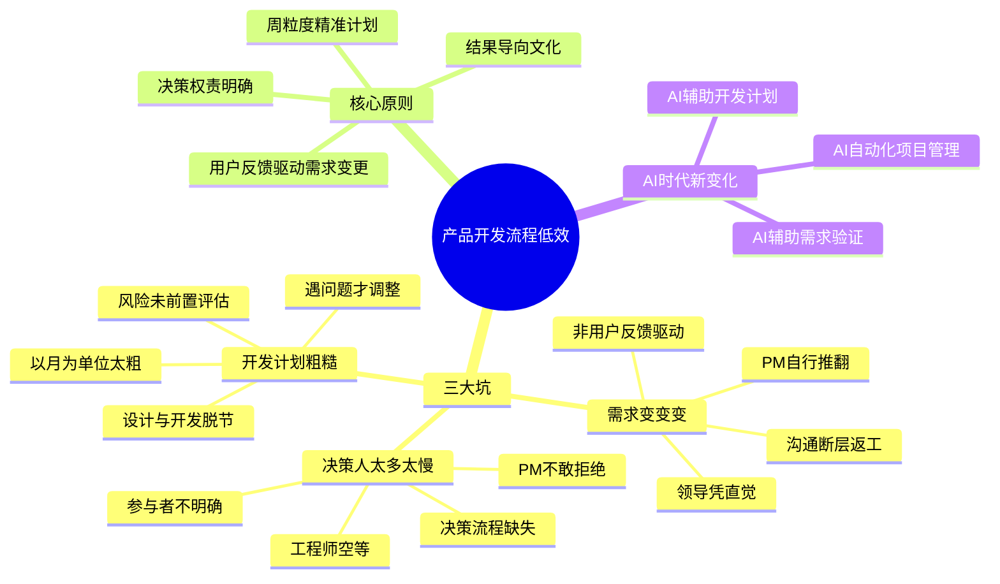
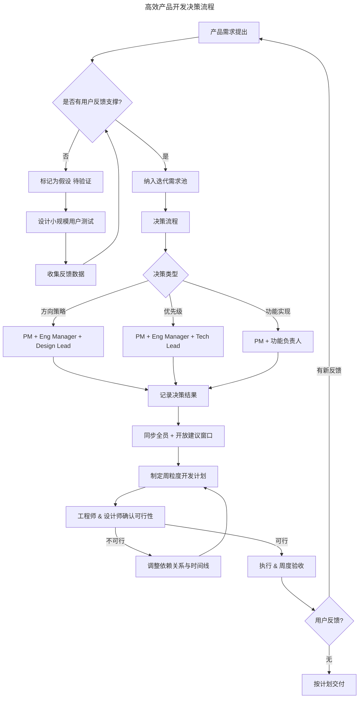

# 26 | 为什么加班很久但是没成果？产品开发流程有问题

> **适用范围**：产品经理（各阶段）、团队负责人、创业者、项目管理从业者。适用于需求变更管理、决策效率、开发计划、结果导向文化、AI 时代流程优化等场景。
>
> **更新摘要（v2 · 2026-08 更新）**：
> - 结构化升级为 6 节骨架（导言 / 核心方法论 / 关键流程 / 工具与实战 / 常见误区 / 进阶延展）
> - 保留三大坑、RAPID 决策框架、BID 准则、周粒度计划法、AI 时代新变化
> - 保留全部 Mermaid 图并补充 `--- title: ... ---` frontmatter，每张图后追加文字解读

---

## 1. 导言

很多团队加班很久却没有成果，这往往不是执行力问题，而是产品开发流程出了问题。

> **图解**：产品开发流程低效——三大坑（需求变变变：非用户反馈驱动、领导凭直觉、PM 自行推翻、沟通断层返工；决策人太多太慢：参与者不明确、PM 不敢拒绝、工程师空等、决策流程缺失；开发计划粗糙：以月为单位太粗、设计与开发脱节、风险未前置评估、遇问题才调整）、核心原则（用户反馈驱动需求变更、决策权责明确、周粒度精准计划、结果导向文化）、AI 时代新变化。

### 1.1 高效产品开发决策流程

> **图解**：高效产品开发决策流程——产品需求提出后判断是否有用户反馈支撑：是则纳入迭代需求池进入决策流程，否则标记为假设待验证（设计小规模用户测试→收集反馈→回到判断）。决策流程按类型分级（方向策略 PM+Eng Manager+Design Lead、优先级 PM+Eng Manager+Tech Lead、功能实现 PM+功能负责人）→记录决策结果→同步全员+开放建议窗口→制定周粒度开发计划→确认可行性（不可行调整依赖关系与时间线）→执行&周度验收→有用户反馈回到起点，否则按计划交付。

---

## 2. 核心方法论

### 2.1 现象与痛点：团队加班却无成果的三大坑

**坑一：需求变变变，但变更并非来自用户反馈**——工程师最反感产品经理频繁改需求，而产品经理往往以"追求更好体验"自辩。双方各执一词，最终陷入内耗。迭代化产品开发的核心在于：从 MVP 出发，依据用户反馈逐步优化。但现实中，需求变更的驱动力常常是——某位领导觉得不够好、其他组同事提出质疑、产品经理自己改了主意，甚至因 PM 与工程师沟通断层导致开发到一半才发现偏离原计划，被迫返工。

**核心判断标准：只有来自用户的最新反馈，才是变更需求的正当理由。** 例如，用户调研显示当前设计缺乏信任感、体验评分显著下降——此时修改需求是必要的。反之，未经市场验证的假设性变更，只会推迟产品接受市场检验的时间，代价远大于收益。产品经理应当主动提议："先选定一批用户进行测试，根据反馈再决定是否修改，比推迟发布更有效。"当然，对于前期投入巨大的产品（如硬件、金融产品），开发阶段需要更严格的审批与调整机制，这是例外。

**坑二：做决定的人太多、速度太慢，工程师上班空等**——每个决定都应该明确：需要什么人参与、需要几个人、为什么需要他们。

| 决策类型 | 参与者 | 说明 |
|---------|--------|------|
| 产品方向策略 | PM + Eng Manager + Design Lead → 向上汇报 | 基层工程师可提意见，但无需等其同意 |
| 产品优先级 | PM + Eng Manager + Tech Lead | 与每位工程师协商个人优先级 |
| 功能实现方法 | PM + 功能负责人 | 涉及法律/政策则拉入法务，敏感功能向上汇报 |

**关键原则：如果一个人无法改变决定，就不必叫他参与决策会议。** 这样可以最快达成一致，提升执行效率。难点在于：很多产品经理根基不够硬，不敢告诉对方"这个决定不需要你参与"，为了礼貌把所有人都拉进来，严重拖慢决策速度。建议与团队共同制定决策流程，提前约定规则，避免尴尬。决策结果必须记录并同步全员，同时开放建议窗口——让成员有参与感，但不让所有人参与决策过程本身。

**坑三：开发计划粗糙，团队各自为战**——有些团队抱着"到截止日产品会自动变出来"的幻想，每一步都拖沓，最终无法按期交付。**开发计划必须精准到周：每周明确每位工程师和设计师要达成的结果。** 制定计划时，PM 先输出 PRD，分别制定工程计划和设计计划，将目标精确到每周。关键在于——计划必须与工程师和设计师共同商定，确认可执行性，识别不合理之处并调整。例如：工程师需要先拿到设计稿才能开发，则需调整设计计划确保前置交付；工程师需要在第三周确认表格行/列布局（影响数据结构），则需确保设计师的计划满足此依赖。这些依赖关系应在开发前就规划好，而非让设计师和工程师各做各的、遇到问题才补救。好的计划减少加班，因为每一步都是最优的。

---

## 3. 关键流程

### 3.1 方法论与框架：从试错到避坑的系统解法

**RAPID 决策框架**——RAPID 是贝恩咨询（Bain & Company）提出的决策权责框架，适用于明确产品决策中的角色分工：

- **R**ecommend（推荐者）：提出方案的人
- **A**gree（同意者）：拥有否决权的人
- **P**erform（执行者）：落地执行的人
- **I**nput（建议者）：提供意见但无决策权的人
- **D**ecide（决策者）：最终拍板的人

将此框架应用于产品决策，可以彻底解决"决策人太多太慢"的问题——每个决定只有 D 有最终拍板权，I 可以提意见但不能拖延决策。

**需求变更的 BID 准则**——每次需求变更必须通过 BID 检验：
- **B**acklog（需求池）：变更是否已进入需求池并排序？
- **I**nsight（洞察）：变更是否基于用户洞察而非个人偏好？
- **D**ata（数据）：是否有数据支撑变更的必要性？

无法通过 BID 检验的变更，一律进入"待验证"状态，先做小规模测试再决定。

**周粒度计划法（Weekly Sprint Planning）**：
1. **W0**：PRD 定稿，工程计划与设计计划初稿完成
2. **W1-Wn**：每周明确交付物，标注跨职能依赖节点
3. **依赖前置**：设计交付 → 工程开发的衔接点精确到天
4. **风险日历**：每周标注 Top 3 风险项及应对方案
5. **周度验收**：每周五 Demo，验证本周交付是否符合预期

**结果导向文化构建**：

| 维度 | 加班导向文化 | 结果导向文化 |
|------|------------|------------|
| 衡量标准 | 在岗时长 | 交付质量与速度 |
| 行为模式 | 表演式加班 | 聚焦高价值任务 |
| 团队氛围 | 内卷与焦虑 | 信任与自主 |
| 产出结果 | 高工时低产出 | 高效率高产出 |

---

## 4. 工具与实战

### 4.1 AI 时代的新变化

**AI 辅助需求验证**——传统流程中，需求变更往往依赖 PM 的主观判断或领导的直觉。AI 时代带来了根本性变化：情感分析引擎（自动分析用户评论、客服工单、社交媒体提及，提取高频痛点，量化需求变更的紧迫性）；A/B 测试智能设计（AI 自动生成多套方案，快速完成小流量实验，用数据替代争论）；需求影响预测（基于历史数据，AI 可预测某项需求变更对交付时间线的影响，帮助团队做出更理性的决策）；用户反馈聚类（利用 NLP 将海量反馈自动归类，识别真正的用户需求而非噪音）。

**AI 自动化项目管理**——依赖关系自动识别（AI 分析 PRD 和设计稿，自动标注设计与工程之间的依赖节点，预警潜在阻塞）；智能排期（基于团队历史速率数据，AI 自动生成周粒度开发计划，并标注置信区间）；风险预警（实时监控任务进度，当某项任务偏离预期时自动触发预警）；决策日志自动化（AI 自动记录每次决策的参与者、结论和理由，确保信息透明）。

**AI 辅助开发计划**——故事点自动估算（基于历史数据，AI 辅助估算每个需求的故事点，减少人为偏差）；资源冲突检测（当同一工程师被分配到多个项目时，AI 自动预警资源冲突）；迭代回顾洞察（AI 分析每个 Sprint 的计划完成率，识别系统性偏差并给出改进建议）；跨团队协调（AI 自动识别跨团队依赖，提前协调时间线）。

### 4.2 最新实践

**Shape Up (Basecamp)**——Basecamp 的 Shape Up 方法论摒弃了传统 Sprint，以 6 周为一个周期（Appetite），先"塑形"（Shape）再"下注"（Bet），强调在固定时间内做多少，而非做多久。这种方法天然避免了需求频繁变更——因为周期内不接受新需求插入。

**Continuous Discovery (Teresa Torres)**——Teresa Torres 提出的持续发现习惯（Continuous Discovery Habits）要求产品团队每周与用户对话，将用户反馈持续注入产品决策，而非依赖季度调研。这与"只有用户反馈才应改需求"的原则高度一致。

**DORA 指标与工程效能**——Google 的 DORA 研究提出四个关键指标衡量工程效能：部署频率、变更前置时间、变更失败率、服务恢复时间。这些指标比"加班时长"更能反映团队的真实产出能力。

### 4.3 实战要点

| 要点 | 说明 | 适用场景 |
|------|------|----------|
| 用户反馈驱动变更 | 只有用户最新反馈才是改需求的正当理由 | 需求变更 |
| 决策权责明确 | 每个决定明确参与者、为什么需要 | 所有决策 |
| 不叫无关人参与决策 | 无法改变决定的人不必参加决策会议 | 决策效率 |
| 周粒度精准计划 | 每周明确交付物，标注跨职能依赖 | 开发计划 |
| RAPID框架 | 明确Recommend/Agree/Perform/Input/Decide | 决策权责 |
| BID准则 | 每次变更通过Backlog/Insight/Data检验 | 需求变更 |
| 结果导向文化 | 衡量交付质量与速度，而非在岗时长 | 团队文化 |
| AI辅助需求验证 | 情感分析、反馈聚类、影响预测 | 需求变更决策 |

---

## 5. 常见误区

| 误区 | 表现 | 正确做法 |
|------|------|---------|
| **非用户反馈驱动变更** | 领导凭直觉、PM 自行推翻需求 | 只有用户最新反馈才是改需求的正当理由 |
| **决策人太多太慢** | 不敢拒绝无关人员参与，工程师空等 | 不叫无法改变决定的人参与决策 |
| **开发计划粗糙** | 以月为单位太粗，遇问题才调整 | 周粒度精准计划，依赖前置 |
| **设计与开发脱节** | 各自为战，遇到问题才补救 | 提前规划依赖关系 |
| **加班导向文化** | 用加班时长衡量贡献 | 结果导向，衡量交付质量与速度 |

---

## 6. 进阶延展

### 6.1 术语表

| 术语 | 定义 |
|------|------|
| MVP | Minimum Viable Product，最小化可行产品 |
| RAPID | 贝恩咨询（Bain & Company）决策权责框架：Recommend/Agree/Perform/Input/Decide |
| BID 准则 | 需求变更检验：Backlog/Insight/Data |
| Shape Up | Basecamp 的产品开发方法，以 Appetite 驱动而非 Estimate 驱动 |
| Continuous Discovery | 持续发现习惯，每周与用户对话以持续获取洞察 |
| DORA 指标 | Google 提出的工程效能衡量体系 |
| Sprint | 敏捷开发中的迭代周期，通常 1-4 周 |
| Story Point | 故事点，敏捷中用于估算工作量的相对单位 |
| PRD | Product Requirements Document，产品需求文档 |
| Appetite | Shape Up 中的概念，指愿意投入的时间预算 |

### 6.2 思考题

1. 你团队的效率低下踩了哪个"坑"？如果用 RAPID 框架重新定义决策流程，会有什么变化？
2. 如果 AI 可以自动分析用户反馈并量化需求变更的紧迫性，产品经理的角色会发生什么转变？
3. 在"结果导向"与"加班文化"之间，你观察到的组织惯性来自哪里？如何破局？
4. 尝试用 BID 准则审视你团队最近的三次需求变更，有多少能通过检验？

### 6.3 延伸阅读

1. Teresa Torres — *Continuous Discovery Habits*：系统化持续用户发现的方法论
2. Ryan Singer — *Shape Up*：Basecamp 的固定时间、可变范围开发方法
3. Nicole Forsgren 等 — *Accelerate*：DORA 指标背后的研究，数据驱动的工程效能提升
4. Marty Cagan — *Inspired*：产品需求决策与团队协作的经典框架
5. 贝恩咨询（Bain & Company）RAPID 决策框架：明确决策权责的组织设计工具
