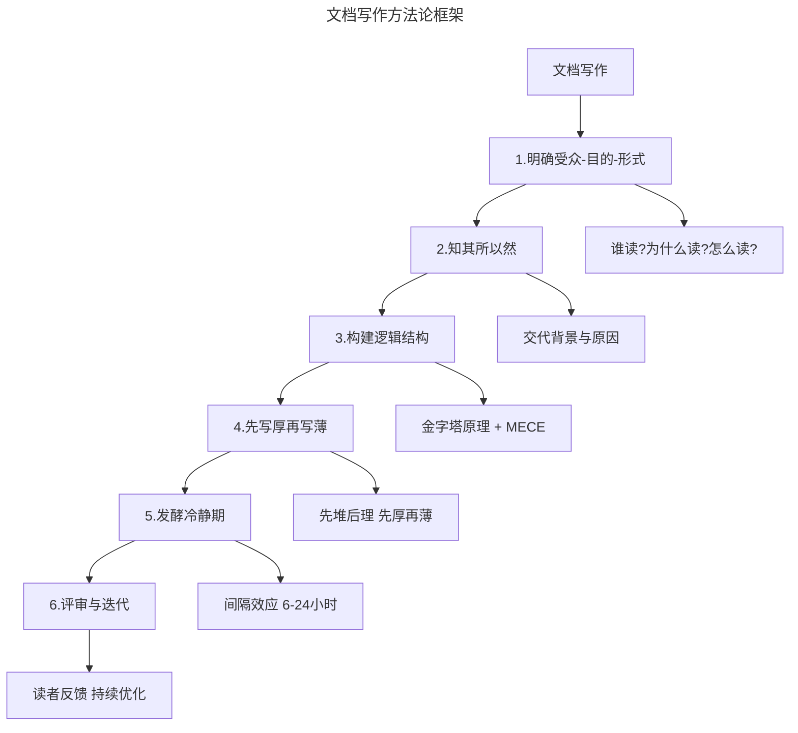
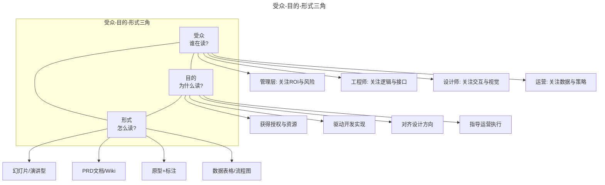
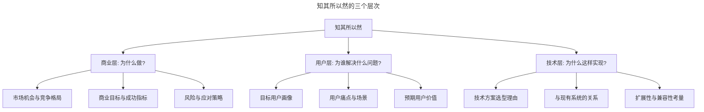
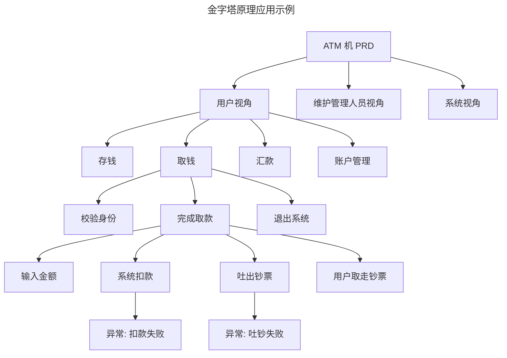
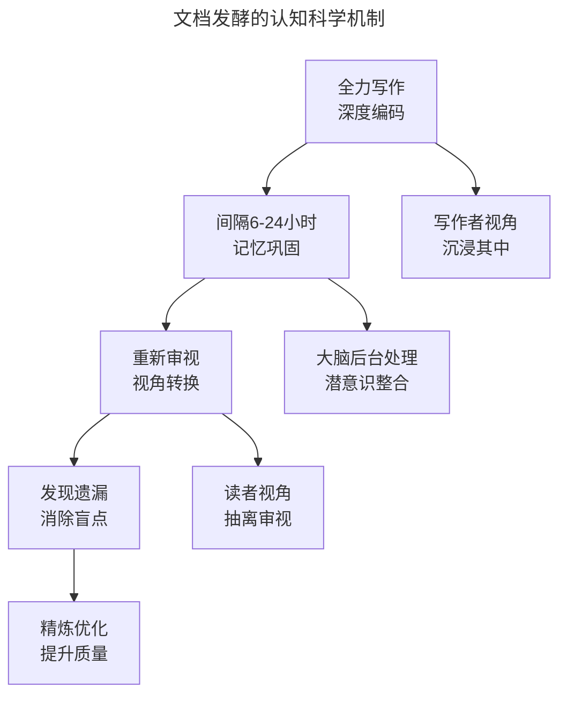
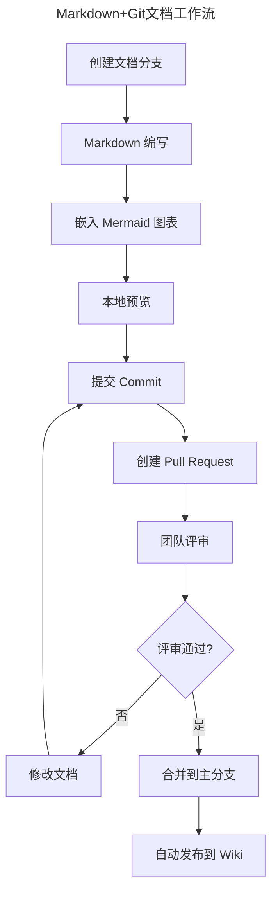
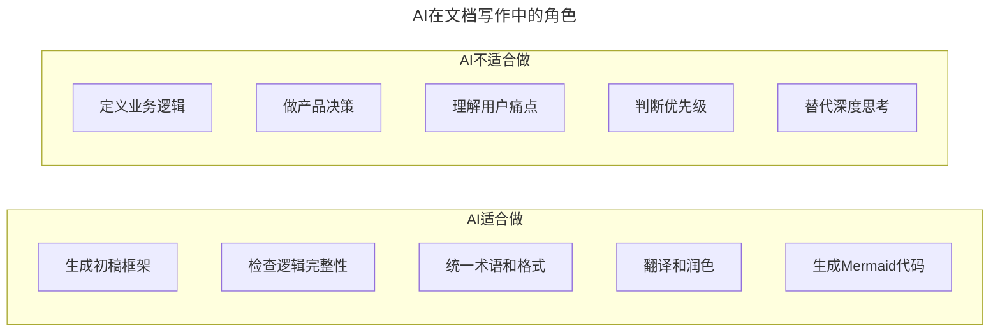

# 26 | 写好产品文档的诀窍

> **适用范围**：产品经理（各阶段）、需要撰写产品文档的从业者、文档规范负责人。适用于 PRD/BRD 撰写、文档逻辑结构、用户故事映射、文档发酵、AI 辅助写作等场景。
>
> **更新摘要（v2 · 2026-08 更新）**：
> - 结构化升级为 6 节骨架（导言 / 核心方法论 / 关键流程 / 工具与实战 / 常见误区 / 进阶延展）
> - 整合原"更新说明 v2.0"与核心摘要，补充用户故事映射、Markdown+Git 工作流、间隔效应、AI 辅助写作
> - 保留全部 Mermaid 图并补充 `--- title: ... ---` frontmatter，每张图后追加文字解读

---

## 1. 导言

**"产品文档是产品经理交出的第一个产品。" —— 邱岳**

我们之前的两次分享，聊到了产品文档以及图例的类型和作用，当时我说文档也是产品经理设计出来的一种"产品"，所以做好产品文档的诀窍其实跟做好产品的诀窍一脉相承，也讲究用户、场景、目的和体验。接下来我就结合自己的经验，跟你分享写好一份产品文档的诀窍。

> **核心摘要**：写好产品文档的诀窍与做好产品的诀窍一脉相承：明确受众-目的-形式三角，知其所以然而后知其然，用金字塔原理（MECE）构建逻辑结构，先写厚再写薄，引入"发酵冷静期"借助认知科学间隔效应提升文档质量。在 AI 与 Markdown+Git 工作流时代，文档写作的效率工具已大幅升级，但深度思考与逻辑严谨仍是不可替代的核心能力。

### 1.1 文档写作方法论框架

> **图解**：文档写作是一个六步迭代过程——明确受众（谁读？为什么读？怎么读？）→知其所以然（交代背景与原因）→构建逻辑结构（金字塔原理 + MECE）→先写厚再写薄（先堆后理）→发酵冷静期（间隔效应 6-24 小时）→评审与迭代（读者反馈持续优化）。每一步都有明确的方法论支撑，核心是"以读者为中心"。

---

## 2. 核心方法论

### 2.1 明确受众、目的和形式

第一次写产品文档的时候，我拿来文档模板就开始照葫芦画瓢，模板上有什么就写什么，好像只要把模板中所有的空位填满就能写出好文档了。其实不然，好的产品文档应该有非常强的针对性。就像做产品要先明确用户一样，写产品文档的第一步就是要明确文章的目标受众是谁。知道谁是文档的主要受众或者读者，结合他们的思考维度，才能知道该用什么样的语言、逻辑和形式。

之后，我们是要清楚每个文档的目的，而不是把写文档本身当做目的。去设想一个文档的读者在读之前的状态和读完之后的状态，你希望他能获得什么信息，做出什么决定，以及有些什么后续的动作。弄清楚受众和目的之后，你就可以判断用什么形式来呈现文档，是静态的产品原型，动态的 Demo，一张流程图，幻灯片还是一篇 PDF 或一封邮件，大概是什么长度等等。

**受众-目的-形式三角**：

> **图解**：受众、目的、形式三者相互制约。受众决定语言风格和关注点，目的决定内容深度和结构，形式决定呈现方式和长度。三者必须对齐——给管理层看的技术细节、给工程师看的商业愿景，都是"形式与受众错配"的典型错误。

**典型场景的受众-目的-形式匹配**：

| 场景 | 受众 | 目的 | 形式 |
|------|------|------|------|
| BRD | 管理层/业务部门 | 获得支持和授权，申请资源 | 幻灯片（演讲型+阅读型各一份） |
| PRD | 工程师 | 驱动设计和实现 | Wiki/Markdown 文档，图文并茂 |
| 原型评审 | 设计师+工程师 | 对齐交互方案 | Figma 原型 + 标注 |
| 需求宣讲 | 全团队 | 统一理解，消除歧义 | 幻灯片 + 现场讲解 |
| 迭代计划 | 敏捷团队 | 确认迭代范围和优先级 | 用户故事映射 + 看板 |

比如 BRD 通常面向管理层和业务部门，目的一般是要获得支持和授权，申请到足够的资源，那就应该避免说产品实现细节，不要用技术的语言，而是从潜在的市场机会和风险解释要做什么，文档的形式可能是幻灯片。幻灯片也分阅读型和演讲型的，阅读型要把逻辑写下来，演讲型则写提纲或放图，通常要准备两份，因为很多时候是既要做演讲，也有时候是发邮件的。

而 PRD 通常是面向工程师，让他们知道要做什么，以及为什么做，进而驱动他们设计和实现具体功能。PRD 通常是写成文档，PDF 或者写在 Wiki 上（建议不要用 Word，很多工程师如果不用 Windows 系统，排版会失控），工程师不喜欢长篇大论，最好能图文并茂，如果有机会能给现场给他们讲解一下，就更好了。

**现代 PRD 的形式演进**：在 Markdown + Git 工作流下，PRD 推荐用 Markdown 格式编写，存储在 Git 仓库中。这样做的好处是：版本历史自动记录，每次变更可追溯；与代码仓库统一管理，文档与代码同步更新；支持 Mermaid 图表嵌入，流程图和时序图随文档版本同步；Pull Request 机制支持文档评审；工程师在熟悉的工具链中阅读和评论。

### 2.2 知其所以然，然后知其然

在面向职能部门的文档中，目的主要是为了推进执行，所以很多人只在文档中交代其"然"，不交代其"所以然"。比如只告诉开发要做什么功能，只告诉运营要推什么入口，却不交代为什么。很多文档模板里有"项目背景"一项，结果产品经理只是随便写一两句话就算充数。

这是个非常糟糕的习惯，有句话叫做："想让人造船，应该先激起他们对大海的向往"，执行层面的策略如果不能跟宏观的判断一脉相承，就很容易在落地的过程中走样。另外交代背景和原因还有个好处是可以得到职能部门的建议和反馈。没有人比一线的工程师更了解系统实现，他们或许可以给你更好的解决方案。比如我曾经设计一个订单项的排序规则，目的是为了让销售可以更灵活地安排订单行的位置。我把场景讲给工程师听之后，他给我做了一个直接用鼠标拖动排序的功能（那个年代这个交互效果在 Web 上还很罕见）。

**"所以然"的三个层次**：

> **图解**："所以然"不是简单的"项目背景"一段话，而是三个层次的完整交代——商业层（为什么做：市场机会、商业目标、风险）、用户层（为谁解决什么问题：用户画像、痛点、价值）、技术层（为什么这样实现：方案选型、系统关系、扩展性）。不同受众关注不同层次——管理层关注商业层，设计师关注用户层，工程师关注技术层。

**用户故事映射：组织"所以然"的现代方法**——**用户故事映射（User Story Mapping）** 是 Jeff Patton 提出的需求组织方法，它天然地将"所以然"（用户旅程和价值）与"其然"（具体功能）关联起来：先画 Backbone（从左到右排列用户的核心旅程步骤）；再添加细节故事（在每个步骤下方添加具体的功能故事）；划分迭代切片（横向切出 MVP 和后续增量）。用户故事映射的优势在于：读者可以一眼看到"为什么做"（用户旅程）和"做什么"（功能故事）的关联；天然支持优先级排序（上方的故事优先级更高）；适合敏捷团队的迭代规划。

---

## 3. 关键流程

### 3.1 打造良好的阅读体验——金字塔原理、逻辑及格式

文档的阅读体验也非常重要，有的文档逻辑杂乱无章，东一榔头西一棒子，不忍卒读。要保证文档的可读性，不能随性起笔写到哪儿算哪儿，而应该有提前的谋篇布局。

**金字塔原理**——有个著名的方法论叫金字塔原理，就是从一个论点出发（通常是文档的目的），找到支持它的三到五个方面，每个方面再向下拆分，形成一个逻辑上的金字塔。每一层的拆分都要尽可能保证观点是相互独立，同时又完全覆盖的。

> **图解**：金字塔原理的核心是"自上而下，逐层拆解"。顶层是文档的核心论点，每一层向下拆分时遵循 MECE 原则。ATM 机 PRD 的例子展示了从角色到用例、从用例到流程、从流程到异常的完整拆解路径。

**MECE 原则的深度应用**——MECE 是金字塔原理的核心约束，确保每一层拆分既不遗漏也不重叠。**MECE 的四种拆解方式**：二分法（按对立维度拆分，如已登录/未登录、付费/免费）；过程法（按流程步骤拆分，如售前/售中/售后）；要素法（按组成要素拆分，如人/货/场、前端/后端/数据）；矩阵法（按两个维度交叉拆分，如重要/紧急四象限）。**MECE 的常见违反**：重叠（两个分类有交集，如"新用户"和"首次购买用户"）；遗漏（有未覆盖的情况，如用户状态只分"活跃"和"流失"，遗漏"沉默"）；层级混乱（不同层级的概念并列，如"取钱"和"输入金额"并列）。**MECE 检查方法**：穷尽性检查（问自己"还有没有其他可能？"）；互斥性检查（问自己"这两个分类有没有交集？"）；同层性检查（问自己"这些分类是否在同一抽象层级？"）。

**写文档的拆解实践**——写文档就是一个不断拆分，再向上合并的过程。比如我们举个常见的例子，现在要给 ATM 机写 PRD，首先第一层拆分是 ATM 机的不同角色，用户、维护管理人员、系统（有时我们会将系统也当做一个角色）等。从用户这里拆分下来，有存钱、取钱、汇款、账户管理之类的用例，继续从存钱这个用例去拆解，可以分解出"校验身份，完成取款，退出系统"的主流程。如果我们看"完成取款"的流程，可以继续拆到"用户输入金额，系统从账户上扣款，系统吐出钞票，用户取走钞票"的具体交互步骤，任何一个交互步骤又可以长出各种分支流程，比如系统扣款失败，或者扣款成功后，吐出钞票失败等等。

如果像写故事一样，想到哪里写哪里，这就很容易遗漏关键流程，也会让读文档的人陷入混乱，不知所云。对于上面的拆解过程，我们通常的做法是：对每个角色给出一系列用例，每个用例有一个用例文档，用例文档中先描述正常流程逻辑，然后单独描述正常流程每个节点上可能出现的异常情况。在文档描述过程中可能会出现一系列商业规则，比如取款每次不得超过 3000 块钱，每天每张卡不得超过 20 万等等，这些规则在流程中即便阐述了，也最好可以单独在某一个地方列出来，一来方便工程师查漏补缺，二来也方便测试时去设计测试用例，提高效率。

**格式与阅读体验**——最后还要重点提一下格式，好多人写文档完全不注意格式，包括字体排版之类。虽说这不是关键，可还是建议处理处理，不一定要多好看，起码看起来易读一些，比如增加一点段间距和页边距，该对齐的对齐，该加粗的加粗，这是文档的第一印象，最好还是正儿八经收拾收拾。**Markdown 格式规范建议**：标题层级（最多 4 级，不跳级）；列表（并列用无序，步骤用有序）；强调（关键词加粗，术语用代码格式）；表格（超过 5 行考虑分表）；图表（复杂逻辑优先用图表）；链接（外部链接用引用格式）。

### 3.2 先写厚，再写薄

写文档通常不是一蹴而就的，写的过程也是整理思路，查漏补缺的过程。所以一开始的时候可以尽量多写一点，然后不断重读，不断裁剪、重构、修改和调整。可能在写主流程的时候会突然意识到遗漏了分支流程，那就立刻写下来，等到修改的时候再把它摘出来放到分支流程的文档结构里。另外是写的过程中可能没注意遣词造句，会写得比较啰嗦，或存在二义性。这些都需要在修改的过程里不断地提炼，这个过程跟写作很像，都是先堆后理，先厚再薄的过程。

**"写厚"阶段的方法**：

> **图解**：文档写作是"发散-收敛-精炼"的三阶段过程——写厚阶段（自由书写、捕捉所有想法、不追求完美、记录关联灵感、形成初稿）重在发散；结构化阶段（结构化整理、归类与排序、补充遗漏、形成二稿）重在收敛；精炼阶段（精炼裁剪、删除冗余、统一术语、优化表达、形成终稿）重在裁剪。每个阶段的目标不同，心态也应不同。

**写厚阶段的实践建议**：不要回头修改，保持写作流；想到什么就写什么，不要自我审查；用思维导图辅助发散；标记不确定的地方，后续补充。**写薄阶段的实践建议**：删除与核心论点无关的内容；合并重复表述；用表格替代冗长的文字描述；用图表替代复杂的逻辑描述；统一术语，消除二义性。

### 3.3 文档"发酵"与认知科学

在堆和理之间，可以尝试引入一个"冷静期"，我在之前的文章中提到过，我会建议同事在写完文档后不着急定稿和评审，而是搁置在那里，放一晚上，睡一觉或者忙一点别的事情之后，等思路开始从深陷其中抽离出来了，再把文档翻出来重读和修改。我们把这个过程叫做文档的发酵。当你全力写的时候，很容易陷入在写作者的角度抽不出身，有些东西会在你脑子里，但没有落到文档中；而文档的写作最主要的目的还是为了读，当你放下文档晾它一会儿，重新再捡起来的时候，你会更容易站到读者的角度。

**间隔效应：文档发酵的认知科学基础**——"文档发酵"并非经验之谈，而是有认知科学的理论支撑。**间隔效应（Spacing Effect）** 是认知心理学中最重要的发现之一：学习或思考后间隔一段时间再回顾，比连续集中处理的效果更好。

> **图解**：文档发酵的底层机制是认知科学的间隔效应。写作时大脑处于"深度编码"模式，专注于内容生成；间隔后重新审视，大脑进入"提取与重组"模式，更容易发现逻辑漏洞和表达不清的地方。6-24 小时的间隔是最优区间——太短无法实现视角转换，太长则上下文遗忘过多。

**间隔效应的关键发现**：

| 认知机制 | 对文档写作的启示 |
|----------|------------------|
| 记忆巩固 | 间隔后重新审视，大脑已完成后台整合，能发现写作时忽略的问题 |
| 视角转换 | 从"写作者"切换到"读者"视角，更容易发现表达不清的地方 |
| 遗忘曲线 | 适度遗忘细节后，反而更能抓住核心逻辑 |
| 潜意识处理 | 间隔期间大脑在后台处理信息，常带来"灵光一现"的改进 |

**发酵时间的建议**：

| 文档类型 | 建议发酵时间 | 原因 |
|----------|-------------|------|
| 小需求文档 | 2-4小时 | 复杂度低，快速审视即可 |
| 标准PRD | 6-12小时（过夜） | 需要视角转换，间隔效应最佳 |
| 大型BRD | 24-48小时 | 复杂度高，需要充分的后台整合 |
| 紧急文档 | 至少30分钟 | 即使短暂间隔也比连续写作效果好 |

**替代发酵的方法**——另一个更简单的办法是把写出的文档给熟悉的自己人先读读看，获得一些从读者角度来的反馈。就像白居易写完诗会念给隔壁大妈听一样，这也是一个精进文档写作的方法。我以前偶尔会把初稿文档发给我媳妇让她帮我看看，一来她之前在业务部门工作，大概能理解业务，二来她不太会担心我的自尊心，会比较直接地指出她看不懂的地方。**现代替代方案**：AI 审阅（用 AI 检查逻辑完整性和表达清晰度，快速自查）；同行评审（请同事阅读并反馈，正式文档）；朗读法（自己朗读文档，发现不通顺之处，短文档）；换位思考清单（用读者视角逐项检查，所有文档）。**AI 审阅的实践方法**：将文档输入 AI，要求其"以工程师视角审阅，指出逻辑漏洞和遗漏"；要求 AI"检查文档中是否有未定义的术语或二义性表述"；要求 AI"总结文档的核心观点，检查是否与我的意图一致"；注意敏感信息应脱敏后再输入。

---

## 4. 工具与实战

### 4.1 Markdown + Git：现代文档工作流

**为什么选择 Markdown + Git**——传统文档工作流（Word + 邮件附件）存在诸多问题：版本混乱、协作困难、格式失控、难以追踪变更。Markdown + Git 工作流从根本上解决了这些问题：

| 维度 | Word + 邮件 | Markdown + Git |
|------|-------------|----------------|
| 版本管理 | 手动命名 v1/v2/v3 | Git 自动记录每次变更 |
| 协作方式 | 邮件附件轮流编辑 | Pull Request 并行评审 |
| 格式一致性 | 依赖个人排版习惯 | Markdown 语法统一格式 |
| 图表管理 | 截图嵌入，难以更新 | Mermaid 代码嵌入，随文档更新 |
| 搜索 | 依赖文件名 | 全文搜索 + Git grep |
| 历史追溯 | 需要保留多个文件 | git log / git diff |

**文档工作流设计**：

> **图解**：Markdown + Git 文档工作流借鉴了代码开发的最佳实践——创建文档分支→Markdown 编写→嵌入 Mermaid 图表→本地预览→提交 Commit→创建 Pull Request→团队评审（不通过则修改文档再提交，通过则合并到主分支）→自动发布到 Wiki。分支隔离写作、Pull Request 评审、合并后自动发布，确保文档的质量和可追溯性。

**工具链推荐**：VS Code（编辑器，Markdown 预览 + Mermaid 插件）；Git（版本管理，追踪每次文档变更）；GitHub/GitLab（协作平台，Pull Request 评审）；Notion/飞书（发布平台，团队 Wiki 展示）。

### 4.2 AI 辅助文档写作的实践

AI 正在成为文档写作的"超级助手"，但需要正确使用才能发挥价值。

> **图解**：AI 擅长"形式化"工作（生成框架、检查完整性、统一格式、翻译润色、生成 Mermaid 代码），不擅长"判断性"工作（业务逻辑、产品决策、用户理解、优先级判断、替代深度思考）。正确的方式是让 AI 处理形式化工作，产品经理专注于判断性工作。

**AI 辅助文档写作的工作流**：

| 阶段 | AI 辅助方式 | 人工审视重点 |
|------|------------|-------------|
| 构思 | AI 生成文档大纲 | 业务逻辑是否完整 |
| 写作 | AI 生成段落初稿 | 表述是否准确 |
| 检查 | AI 检查逻辑漏洞 | 遗漏的边界条件 |
| 优化 | AI 润色和精简 | 是否丢失关键信息 |
| 翻译 | AI 翻译为英文 | 专业术语是否准确 |

**注意事项**：敏感业务数据不应输入公共 AI 服务；AI 生成的内容必须逐段审视，尤其是业务规则和边界条件；AI 是"加速器"而非"替代者"，深度思考仍需产品经理亲自完成；建立 AI 使用规范，团队统一工具和流程。

### 4.3 专业深度分层

**基础层：清晰定义概念**——受众-目的-形式（明确谁读、为什么读、怎么读，写文档前先回答三个问题）；知其所以然（交代背景和原因，不只是描述，补充"为什么做"）；金字塔原理（自上而下逐层拆解，先写核心论点再写支撑论据）；先厚再薄（先发散后收敛，先多写再精炼）；文档发酵（间隔后重新审视，放一晚上再改）。

**进阶层：方法论应用场景与局限**——受众-目的-形式（最佳：多受众文档的差异化表达；局限：单一受众时过度分析；误用：形式与受众错配）；知其所以然（最佳：跨部门协作文档；局限：紧急修复时过度解释；误用：背景写成流水账）；金字塔原理（最佳：复杂业务逻辑的文档组织；局限：创意性文档可能受限；误用：强行 MECE 导致机械拆解）；先厚再薄（最佳：新领域、新产品的文档；局限：熟悉领域可跳过厚阶段；误用：停留在"厚"阶段不精炼）；文档发酵（最佳：重要文档的质量提升；局限：紧急文档时间不够；误用：发酵时间过长导致上下文遗忘）。

**高阶层：前沿趋势**——AI 辅助写作（从"空白页"到"AI 初稿 + 人工精炼"，写作效率提升 3-5 倍）；文档即代码（Markdown + Git 工作流，文档与代码统一管理）；活文档（文档与产品同步更新，告别"文档过时"问题）；对话式文档（读者通过 AI 对话查询文档内容，文档结构化程度决定 AI 检索质量）；自动生成文档（从代码注释、API 定义自动生成技术文档，产品经理聚焦业务文档）。

### 4.4 实战要点

| 要点 | 说明 | 适用场景 |
|------|------|----------|
| 受众优先 | 写文档前先明确谁读、为什么读 | 所有文档 |
| 交代"所以然" | 不仅说做什么，更要说为什么做 | PRD/BRD |
| MECE 检查 | 每层拆解确保互斥且穷尽 | 逻辑结构设计 |
| 先厚再薄 | 先发散后收敛，先多写再精炼 | 新领域文档 |
| 发酵冷静期 | 间隔 6-24 小时后重新审视 | 重要文档 |
| AI 辅助 | 用 AI 加速初稿和检查，人工审视业务逻辑 | 文档写作 |
| Markdown + Git | 文档纳入版本管理，与代码同步 | 技术团队 |
| 读者反馈 | 请他人阅读并反馈，或用 AI 审阅 | 定稿前 |

---

## 5. 常见误区

| 误区 | 表现 | 正确做法 |
|------|------|---------|
| **照葫芦画瓢** | 拿来模板填满所有空位 | 先明确受众-目的-形式三角 |
| **只交代"其然"** | 只告诉做什么不交代为什么 | 交代背景和原因，知其所以然 |
| **逻辑杂乱** | 想到哪写到哪，遗漏关键流程 | 用金字塔原理 + MECE 构建结构 |
| **急于定稿** | 写完不发酵直接评审 | 引入发酵冷静期，借助间隔效应 |
| **形式与受众错配** | 给管理层看技术细节 | 三者必须对齐 |
| **完全依赖 AI** | AI 生成内容不审视业务逻辑 | AI 处理形式化工作，人工审视判断性工作 |

---

## 6. 进阶延展

### 6.1 核心结论

正如同我们做产品的套路一样，我们从用户、场景出发，通过挖掘文档读者的需求和背景来撰写文档。强调了文档逻辑结构的完整和条理，最后又一次建议你不要急于求成，写好的东西放下来冷静发酵一下，进行一个二次加工。

在 AI 与 Markdown+Git 工作流时代，文档写作的效率工具已大幅升级，但核心诀窍不变：明确受众-目的-形式三角，知其所以然，用金字塔原理构建逻辑，先写厚再写薄，借助间隔效应发酵提升质量。工具在变，方法在演进，但"以读者为中心"的文档写作哲学永恒。

### 6.2 延伸阅读

- 《金字塔原理》— Barbara Minto
- 《用户故事映射》— Jeff Patton
- 《认知心理学与学习》— 间隔效应研究
- 《Docs as Code 实践指南》
- 《AI 辅助写作最佳实践》
