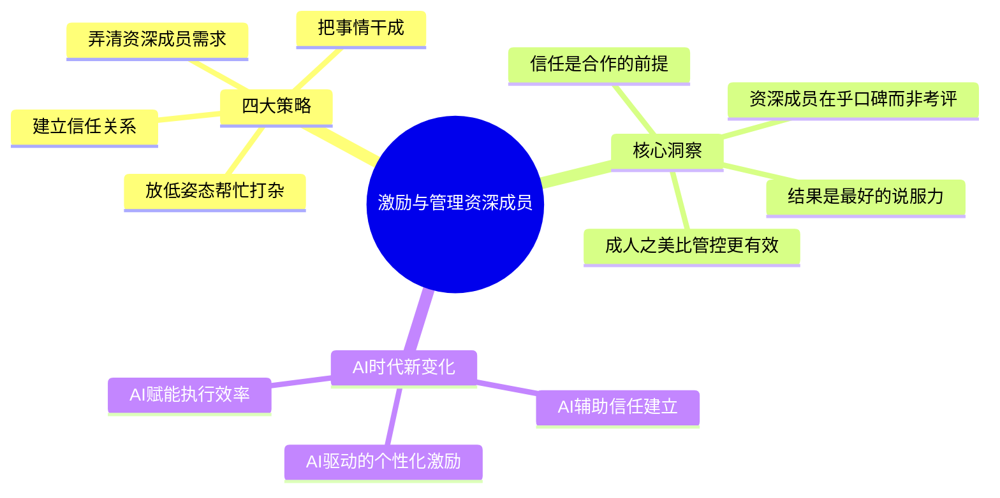
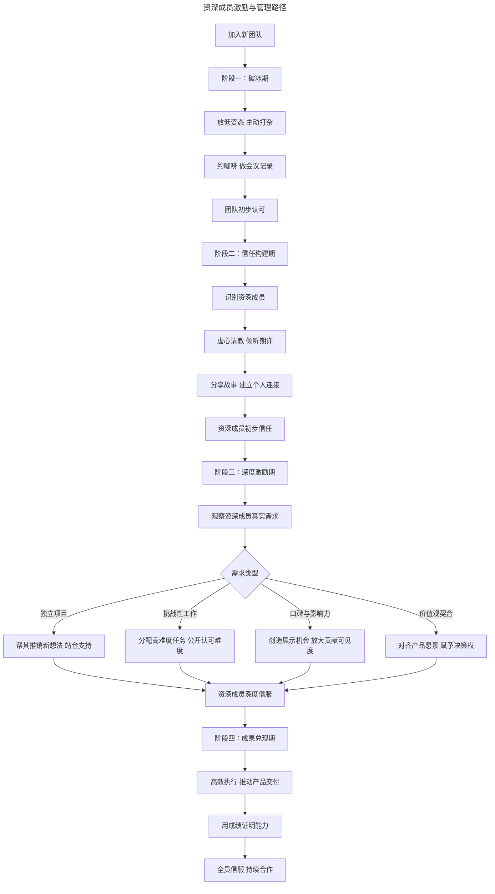

# 27 | 如何激励和管理比你资深的工程师、设计师？

> **适用范围**：产品经理（尤其新人）、需要管理资深成员的团队负责人、创业者。适用于激励资深成员、建立信任、无职权领导、AI 时代激励等场景。
>
> **更新摘要（v2 · 2026-08 更新）**：
> - 结构化升级为 6 节骨架（导言 / 核心方法论 / 关键流程 / 工具与实战 / 常见误区 / 进阶延展）
> - 保留四大策略、信任方程式、HER 激励模型、情境领导力、AI 时代新变化
> - 保留全部 Mermaid 图并补充 `--- title: ... ---` frontmatter，每张图后追加文字解读

---

## 1. 导言

产品经理，尤其是刚入行的 PM，常常面对比自己资深的工程师和设计师。他们聪明绝顶、深受尊敬，连领导都会征求他们的意见。如果资深成员带头质疑你的方案，其他成员必然跟风，你的领导力将瞬间瓦解。

这不是"权力斗争"，而是信任缺失。资深成员的质疑本质上是在问：你凭什么领导我？

> **图解**：激励与管理资深成员——四大策略（放低姿态帮忙打杂、建立信任关系、弄清资深成员需求、把事情干成）、核心洞察（资深成员在乎口碑而非考评、信任是合作的前提、成人之美比管控更有效、结果是最好的说服力）、AI 时代新变化。

### 1.1 资深成员激励与管理路径

> **图解**：资深成员激励与管理路径四阶段——破冰期（放低姿态主动打杂、约咖啡做会议记录→团队初步认可）→信任构建期（识别资深成员、虚心请教倾听期许、分享故事建立个人连接→资深成员初步信任）→深度激励期（观察真实需求，按类型应对：独立项目帮其推销、挑战性工作分配高难度任务、口碑与影响力创造展示机会、价值观契合对齐愿景赋予决策权→资深成员深度信服）→成果兑现期（高效执行推动产品交付、用成绩证明能力→全员信服持续合作）。

---

## 2. 核心方法论

### 2.1 困境本质与四招破局

困境本质是信任缺失。四招破局：

**第一招：放低姿态，从帮忙打杂开始**——进入新团队，切忌一上来就指手画脚。此时团队对你的能力尚不了解，利益关系也未看清，你对产品环境和策略还不够熟悉。帮团队做简单的小事，比直抒胸臆强得多。实操技巧：约咖啡（告诉工程师"我是新来的，对团队的事还不懂，有没有繁琐的基础工作我先帮你干"）；主动做会议记录（不要急着发言，先通过记录了解产品现状，再通过邮件同步给大家）；不装经验丰富（表演骗不了人，放低姿态、踏实做事，展现努力和进取心，让大家看到你的潜力）。**当你肯放低姿态、不摆经理架子、愿意帮大家做琐事时，你就已经比大部分产品经理更受团队欢迎了。**

**第二招：建立与资深成员的信任关系**——每个团队都有几位资深的、深受尊敬的核心成员。得罪他们，推进工作处处受阻；与他们建立良好关系，其他成员自然不敢为难你。建立信任的方法：虚心请教（问他们对团队的期许、与前任 PM 合作的问题、自己如何避免同样的问题）；分享个人故事（像交朋友一样沟通，让他们了解你的经历和价值观）；倾听而非说服（先理解他们的立场，再寻求共识）。只有让资深成员信任你，他们才会帮助你，其他团队成员才会更信服你。

**第三招：弄清资深成员的真实需求**——资深成员已经赢得了团队尊重和领导重视，常规的表扬和考评激励对他们效果有限。他们真正在乎的是：

| 需求类型 | 表现形式 | PM 的应对策略 |
|---------|---------|-------------|
| 独立发起项目 | 想推销自己的新想法 | 帮其推销，给其站台，支持创新 |
| 挑战性工作 | 希望做最有难度的事 | 分配高难度任务，公开强调难度与价值 |
| 口碑与影响力 | 在乎工作是否对公司有价值 | 创造展示机会，放大贡献可见度 |
| 价值观契合 | 追求符合自身价值观的工作 | 对齐产品愿景，赋予更大决策权 |

**弄清资深成员的需求，才能在信任之上建立更深层次的合作关系。** 资深成员到了这个职场阶段，在乎的是口碑、工作价值是否与自身价值观和野心一致，而非今年的考评等级。激励必须精准，了解他们想要什么并最大程度满足，才能赢得真正的信服。

**第四招：把事情干成——终极核心策略**——学历再厉害、经验再丰富，如果无法把产品做出来、把执行做到位，一切都是空谈。团队成员在乎的是：加班加点的工作能否做出满足用户需求的产品，而非瞎忙活半天什么都没发布。**如果你是产品新人，没有成功案例，最紧迫的任务就是尽快发布一个产品并取得好成绩，用成绩证明能力。** 一个真正能推动产品进展的 PM，在见惯了"只空谈不做实事"的资深工程师和设计师眼中，比什么都强。只有以身作则拿出成绩，大家才会真心服你、愿意跟从你。这对产品新人和资深 PM 同样重要——资深 PM 虽不必亲力亲为，但遇到事情能顶上，同样关键。

**四招概括：放低姿态、建立信任、成人之美、踏实做事。**

---

## 3. 关键流程

### 3.1 方法论与框架：从经验到系统的管理智慧

**信任方程式（Trust Equation）**——David Maister、Charles Green、Robert Galford 在《The Trusted Advisor》（2000）中提出的信任方程式，是理解资深成员信任机制的核心框架：

$$Trust = \frac{Credibility + Reliability + Intimacy}{Self-Orientation}$$

- **Credibility（可信度）**：你的专业能力是否让人信服 → 通过"把事情干成"建立
- **Reliability（可靠度）**：你是否言行一致、说到做到 → 通过"踏实做事"建立
- **Intimacy（亲密度）**：对方是否感到安全、愿意敞开 → 通过"约咖啡、分享故事"建立
- **Self-Orientation（自我导向）**：你是为自己还是为团队 → 通过"放低姿态、帮忙打杂"降低

分母越小，信任越大。当你表现出强烈的自我导向（急于证明自己、摆架子），信任会急剧下降。

**HER 激励模型**（注：HER 模型为本文提出的自有框架，非业界通用激励理论；截至 2026-09-11 未检索到该框架的公开出处）——针对资深成员的激励，传统的外在激励（奖金、晋升）效果递减，需要转向内在激励：Heuristic（启发型工作：给予自主权，让他们自己探索解决方案）；Extrinsic → Intrinsic（外在转内在：从考评驱动转向价值观驱动）；Reputation（口碑驱动：创造让他们的工作被看见、被认可的机会）。

**情境领导力模型（Situational Leadership）**——Hersey 和 Blanchard 提出的情境领导力模型指出，领导方式应根据下属的成熟度调整：

| 下属成熟度 | 领导方式 | 对应资深成员 |
|-----------|---------|------------|
| 低（能力低、意愿低） | 指令式 | 不适用 |
| 中低（能力低、意愿高） | 推销式 | 不适用 |
| 中高（能力高、意愿低） | 参与式 | 偶尔适用（资深成员对某方向缺乏热情时） |
| 高（能力高、意愿高） | 授权式 | **主要适用** |

对资深成员，最有效的领导方式是**授权式**——给予方向和资源，不干预执行细节。

**影响力金字塔**——产品经理没有正式职权，需要依靠影响力领导团队。影响力构建遵循自下而上的路径：帮助他人（底层：帮忙打杂、解决实际问题）；建立关系（第二层：约咖啡、分享故事、建立个人连接）；理解需求（第三层：弄清资深成员真正想要什么）；交付成果（顶层：用产品成绩证明自己）。每一层都是上一层的基础，跳过任何一层都会导致影响力不稳。

---

## 4. 工具与实战

### 4.1 AI 时代的新变化

**AI 辅助信任建立**——传统信任建立依赖大量面对面沟通和时间积累，AI 时代加速了这一过程：团队知识图谱（AI 自动分析团队历史项目、技术栈、协作记录，帮助新 PM 快速了解每位资深成员的专业领域和贡献）；沟通风格适配（AI 分析资深成员的沟通偏好：邮件 vs 即时消息 vs 面对面，建议最佳沟通方式）；会议智能摘要（AI 自动生成会议记录和行动项，PM 不必手动记录，同时确保信息准确同步）；协作历史洞察（AI 分析资深成员与前任 PM 的协作模式，识别潜在的摩擦点和最佳合作方式）。

**AI 驱动的个性化激励**——需求洞察引擎（AI 分析资深成员的代码提交、设计产出、会议发言，识别其兴趣方向和未被满足的需求）；贡献可视化（AI 自动追踪并可视化每位成员的贡献，让资深成员的工作被更多人看见）；成长路径推荐（基于资深成员的技能图谱和职业轨迹，AI 推荐最适合的挑战性项目）；价值观匹配（AI 分析产品路线图与资深成员历史项目的契合度，帮助 PM 更精准地分配任务）。

**AI 赋能执行效率**——智能任务分解（AI 将产品目标自动分解为可执行的任务，减少 PM 在执行层面的负担，让资深成员看到 PM 的高效）；进度自动追踪（AI 实时监控项目进度，自动识别阻塞并建议解决方案，PM 可以更快地"把事情干成"）；跨职能协调（AI 自动识别设计与工程之间的依赖，减少因协调不力导致的延误）；成果自动归档（AI 自动记录每个迭代的成果和关键决策，为 PM 积累可展示的成绩）。

### 4.2 最新实践

**无职权领导力（Leadership Without Authority）**——Patricia Ward Biederman 和 Warren Bennis 在《Organizing Genius》中研究了多个伟大团队，发现最有效的领导者往往不是拥有正式职权的人，而是能够激发团队热情、协调资源、推动成果的人。产品经理正是这种角色的典型——你需要在没有正式职权的情况下领导资深成员。

**心理安全感（Psychological Safety）**——Amy Edmondson 的研究表明，高绩效团队的核心特征是心理安全感——团队成员敢于提出问题、承认错误、分享想法。对资深成员而言，心理安全感意味着他们可以坦诚地表达对产品方向的不同意见，而不必担心被边缘化。PM 的"放低姿态"和"虚心请教"正是构建心理安全感的第一步。

**仆人式领导（Servant Leadership）**——Robert Greenleaf 提出的仆人式领导哲学，强调领导者的首要职责是服务团队而非控制团队。这与"帮忙打杂"的策略不谋而合——PM 先服务团队，赢得信任后再施加影响。

**OKR 与自主性**——Intel 和 Google 推广的 OKR 方法，通过设定目标而非规定路径，给予资深成员充分的自主权。PM 设定 O（方向），资深成员自主决定 KR（如何达成），这正符合情境领导力模型中对高成熟度成员的授权式管理。

### 4.3 实战要点

| 要点 | 说明 | 适用场景 |
|------|------|----------|
| 放低姿态 | 不摆经理架子，帮忙打杂 | 加入新团队初期 |
| 建立信任 | 虚心请教、分享故事、倾听 | 与资深成员接触 |
| 成人之美 | 帮资深成员满足真实需求 | 深度激励期 |
| 把事情干成 | 用成绩证明能力 | 所有阶段 |
| 信任方程式 | 提升可信度/可靠度/亲密度，降低自我导向 | 信任评估 |
| HER激励模型 | 从外在激励转向内在激励 | 资深成员激励 |
| 情境领导力 | 对高成熟度成员用授权式 | 领导方式选择 |
| 无职权领导力 | 用影响力而非职权领导 | 所有产品经理 |

---

## 5. 常见误区

| 误区 | 表现 | 正确做法 |
|------|------|---------|
| **一上来指手画脚** | 新团队还没建立信任就发号施令 | 放低姿态，帮忙打杂 |
| **把质疑当权力斗争** | 资深成员质疑就对抗 | 理解这是信任缺失，主动建立信任 |
| **用考评激励资深成员** | 以为表扬和考评能激励他们 | 他们在乎口碑、价值观、挑战性工作 |
| **只空谈不做事** | 无成功案例却不尽快发布产品 | 尽快发布产品，用成绩证明能力 |
| **表现自我导向** | 急于证明自己、摆架子 | 降低自我导向，先服务团队 |

---

## 6. 进阶延展

### 6.1 术语表

| 术语 | 定义 |
|------|------|
| Trust Equation | 信任方程式，Maister、Green、Galford 在《The Trusted Advisor》中提出：Trust = (Credibility + Reliability + Intimacy) / Self-Orientation |
| HER 激励模型 | 针对资深成员的激励框架：Heuristic/Extrinsic→Intrinsic/Reputation（本文自创框架，非业界通用术语） |
| Situational Leadership | 情境领导力模型，Hersey & Blanchard 提出，根据下属成熟度调整领导方式 |
| Servant Leadership | 仆人式领导，Greenleaf 提出，领导者首要职责是服务团队 |
| Psychological Safety | 心理安全感，Edmondson 提出，团队成员敢于表达而不必担心惩罚 |
| OKR | Objectives and Key Results，目标与关键成果法 |
| Influence Without Authority | 无职权影响力，在没有正式职权的情况下领导他人 |
| Delegation | 授权式管理，给予方向和资源，不干预执行细节 |
| Stakeholder Mapping | 利益相关者映射，识别团队中的关键影响者 |

### 6.2 思考题

1. 用信任方程式评估你与团队资深成员的信任关系，哪个维度最薄弱？如何改善？
2. 如果 AI 可以自动识别资深成员的未满足需求，PM 的"虚心请教"还有价值吗？为什么？
3. 你团队中的资深成员属于 HER 激励模型中的哪种类型？你目前的激励方式是否匹配？
4. "放低姿态"与"建立权威"之间如何平衡？在什么节点应该从服务者转变为决策者？

### 6.3 延伸阅读

1. David Maister, Charles Green, Robert Galford — *The Trusted Advisor*：信任方程式的经典阐述，理解信任的构成要素
2. Amy Edmondson — *The Fearless Organization*：心理安全感的理论与实践，构建高绩效团队
3. Robert Greenleaf — *Servant Leadership*：仆人式领导哲学，领导者即服务者
4. Hersey & Blanchard — *Management of Organizational Behavior*：情境领导力模型的完整框架
5. Patricia Ward Biederman & Warren Bennis — *Organizing Genius*：伟大团队的领导力研究
