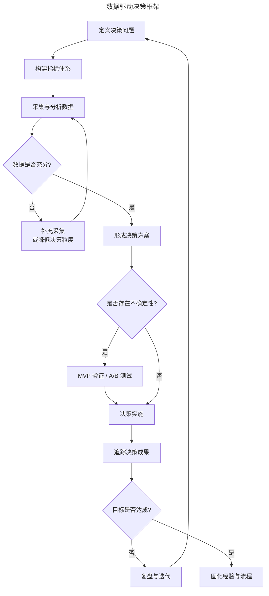
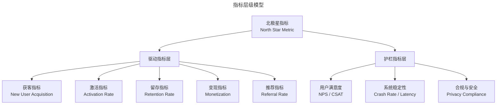

# 数据驱动决策的方法论与业务实践

> **适用范围**：产品经理、数据产品经理、数据分析师、需要做数据驱动决策的团队负责人。适用于决策框架设计、指标体系构建、用户洞察、因果推断、AI 增强决策等场景。
>
> **更新摘要（v2 · 2026-08 更新）**：
> - 结构化升级为 6 节骨架（导言 / 核心方法论 / 关键流程 / 工具与实战 / 常见误区 / 进阶延展）
> - 保留决策框架、指标体系、用户洞察三方法、因果推断、AI 增强决策、决策智能、前沿趋势
> - 保留全部 Mermaid 图并补充 `--- title: ... ---` frontmatter，每张图后追加文字解读

---

## 1. 导言

数据驱动决策（Data-Driven Decision Making, DDDM）已成为产品管理的核心能力之一。然而，在实际业务中，"数据驱动"常被简化为"看数据做决定"，忽视了从数据到决策之间的方法论支撑。数据本身并不产生决策——真正驱动决策的是对数据的结构化分析与系统性推理。

本文将从数据驱动决策的框架设计、指标体系构建、用户洞察方法、决策矩阵工具以及因果推断等维度，系统阐述如何将数据转化为可靠的产品决策。同时结合 2024-2026 年 AI 增强决策（AI-Augmented Decision Support）、因果推断工具（Causal Inference Tools）和决策智能（Decision Intelligence）等前沿实践，探讨数据驱动决策的演进方向。

### 1.1 数据驱动决策框架

一个完整的数据驱动决策过程包含五个阶段：定义决策问题、构建指标体系、采集与分析数据、形成决策方案、追踪决策成果。以下 Mermaid 图展示了该框架的完整流程：

> **图解**：数据驱动决策框架——定义决策问题→构建指标体系→采集与分析数据→数据是否充分（否则补充采集或降低决策粒度）→形成决策方案→是否存在不确定性（是则 MVP 验证/A/B 测试）→决策实施→追踪决策成果→目标是否达成（否则复盘与迭代回到起点，是则固化经验与流程）。

该框架的关键设计要点：决策问题先行（一切数据工作必须始于明确的决策问题，而非始于数据本身。"想看什么数据"应被转化为"需要做什么决策"）；不确定性分流（当数据充分时可直接决策；当存在不确定性时，通过 MVP 或 A/B 测试降低风险，而非在不确定性下贸然投入）；闭环反馈（决策实施后的成果追踪是下一轮决策的输入，形成持续优化的闭环）。

**决策类型的分类与应对**——不同类型的决策对数据的需求和依赖程度不同，需要采用不同的策略：

| 决策类型 | 特征 | 数据角色 | 典型方法 | 示例 |
|----------|------|----------|----------|------|
| 可逆型决策（Type 2） | 影响范围小、可回滚 | 数据提供方向参考 | 快速实验、A/B 测试 | 按钮颜色调整、文案优化 |
| 不可逆型决策（Type 1） | 影响范围大、不可回滚 | 数据提供关键约束 | 深度分析、压力测试 | 产品方向选择、市场进入 |
| 时间敏感型决策 | 决策窗口短 | 数据提供快速判断依据 | 实时监控、预设规则 | 运营活动调整、危机响应 |
| 探索型决策 | 不确定性极高 | 数据帮助缩小搜索空间 | 定性研究、MVP 验证 | 新市场开拓、品类扩张 |

Amazon 的"双向门与单向门"（Two-Way Door vs. One-Way Door）决策框架是这一分类的经典实践。对于 Type 2 决策，应追求速度而非完美数据；对于 Type 1 决策，则应在数据充分性上设置更高门槛。

---

## 2. 核心方法论

### 2.1 指标体系构建

指标体系（Metrics System）是数据驱动决策的"语言"。一个结构化的指标体系应包含三个层级：北极星指标（North Star Metric）、驱动指标（Driver Metrics）和护栏指标（Guardrail Metrics）。

> **图解**：指标层级模型——北极星指标（North Star Metric）下辖驱动指标层（获客、激活、留存、变现、推荐）与护栏指标层（用户满意度、系统稳定性、合规与安全）。北极星指标是单一核心指标，驱动指标是其拆解因子，护栏指标防止负外部性。

各层级的定义与职能：

**北极星指标**：单一指标，反映产品为核心用户创造的核心价值。其选择标准包括：(1) 能否反映用户获得的价值；(2) 能否反映产品战略方向；(3) 能否作为团队对齐的焦点。例如，Spotify 的北极星指标是"用户收听时长"，Airbnb 是"预订夜间数"。

**驱动指标**：北极星指标的拆解因子，构成增长模型（Growth Model）的核心。经典的 AARRR 模型（Acquisition-Activation-Retention-Revenue-Referral）是驱动指标层的常用框架。驱动指标应与北极星指标存在明确的数学或逻辑关系。

**护栏指标**：防止团队在追求北极星指标时产生负外部性的约束条件。护栏指标的缺失是 Goodhart 法则（"当指标成为目标时，它就不再是好指标"）生效的典型场景。例如，若仅关注"内容发布量"而不设"内容质量"护栏，可能导致低质内容泛滥。

**指标设计的关键原则**：

| 原则 | 说明 | 常见错误 |
|------|------|----------|
| 可归因性 | 指标变化应能追溯到具体行动 | 选用过于宏观的指标（如"公司总营收"）作为产品指标 |
| 可操作性 | 团队能通过产品动作影响该指标 | 选用团队无法影响的指标（如"行业增长率"） |
| 敏感性 | 指标能及时反映变化 | 选用滞后指标（如"年度流失率"）监控短期变化 |
| 鲁棒性 | 指标不易被操纵或博弈 | 未设护栏指标，导致刷量行为 |
| 一致性 | 同一指标在不同场景下计算口径一致 | 不同团队对"活跃用户"定义不同 |

---

## 3. 关键流程

### 3.1 用户洞察：从数据理解用户

**属性数据与行为数据**——理解用户是产品决策的起点。用于描述用户的数据可分为两类：

| 数据类型 | 来源 | 分析方法 | 典型应用 |
|----------|------|----------|----------|
| 属性数据（Attribute Data） | 注册表单、第三方画像、调研问卷 | 描述统计、交叉分析 | 用户分层、画像构建 |
| 行为数据（Behavioral Data） | 产品交互日志、埋点数据 | 行为序列分析、聚类分析 | 需求推断、动机推测 |

属性数据提供"用户是谁"的静态画像，行为数据提供"用户做什么"的动态线索。两者的结合才能形成完整的用户理解。以开发者社区产品为例：属性数据（用户注册信息显示 70% 为工作 1-3 年的一线开发工程师）+ 行为数据（用户浏览和订阅行为显示，Python/AI 相关内容的消费深度显著高于其他领域，且存在大量交叉订阅行为）→ 两类数据的交叉分析可推导出更有价值的洞察：这部分初级-中级开发者正在系统性地学习 AI 技能，可能存在对实践交流社区的需求。

**三种需求洞察方法**——从行为数据推断用户需求，是产品经理的核心技能。以下介绍三种经过实践验证的方法：

**方法一：搜索词分析（Search Query Analysis）**——搜索行为是用户动机最直接的表达窗口。操作要点：聚合产品内搜索日志及搜索引擎来源关键词（Search Console / Search Terms）；按频次排序识别高频搜索意图；对搜索词进行意图分类（导航型/信息型/交易型）；识别"零结果搜索"（Zero-Result Search），即用户搜索了但未获得结果的需求——这往往是最具价值的未满足需求。行业实践表明，搜索词分析不仅能发现产品功能缺口，还能识别出全新的业务机会。某互联网公司曾从搜索日志中发现大量岗位和商品相关搜索，由此衍生出招聘和电商业务线。

**方法二：反向假设验证（Adversarial Hypothesis Testing）**——当团队形成初始假设后，应主动寻找能够反驳假设的数据，而非仅收集支持性证据。这是对抗确认偏误（Confirmation Bias）的核心方法。操作流程：将假设形式化为可证伪的命题（Falsifiable Statement）；明确哪些数据能够反驳该命题；主动搜寻反驳数据；若反驳数据不足，则假设获得阶段性成立。示例：假设"用户有旺盛的内容分享意愿"，反向验证方向是检查分享/评论/点赞的参与率（而非绝对量）、内容产出者的集中度（是否头部 1% 用户贡献了 80% 内容）、内容的深度与情绪倾向；若数据显示参与率极低且内容产出高度集中，则假设不成立。这种"左右互搏"的方法既可发生在个人思维中，也可通过团队角色分工实现——指定专人扮演"魔鬼代言人"（Devil's Advocate），在需求评审中系统性地质疑假设。

**方法三：行为轨迹深描（Behavioral Session Replay）**——抽样观察单个用户的完整行为轨迹（Session Replay），通过微观行为还原用户心理过程，再回溯验证该行为模式是否普遍存在。操作要点：随机抽取 20-50 个用户会话（Session），覆盖不同用户分群；逐事件观察用户路径：进入页面 → 停留时长 → 点击行为 → 退出路径；对异常行为（如反复返回同一页面、长时间停留在搜索结果页）形成猜想；回到聚合数据验证该行为模式的普遍性；若普遍存在，进一步分析驱动因素。2024-2025 年，FullStory、Hotjar、LogRocket 等 Session Replay 工具已集成 AI 能力，可自动识别异常会话并生成行为摘要，显著提升了这一方法的效率。

### 3.2 竞争分析与触达效率评估

**竞争现状评估**——在确定解决方案方向前，必须进行竞争现状（Competitive Landscape）评估，避免进入已形成垄断的市场。评估框架包括：

| 评估维度 | 数据来源 | 关键问题 |
|----------|----------|----------|
| 市场集中度 | 行业报告、应用商店排名 | CR3/CR5 是否超过 70%？ |
| 用户满足度 | 社交媒体评论、应用商店评分 | 用户核心痛点是否已被充分满足？ |
| 进入壁垒 | 技术分析、资金需求评估 | 网络效应/规模经济是否存在？ |
| 差异化空间 | 功能对比、用户访谈 | 现有方案是否存在系统性盲区？ |

**触达效率评估**——对于旨在构建"流量发动机"的产品，触达效率（Reach Efficiency）是决定方向选择的关键指标。评估维度包括：自获客能力（产品是否能通过自然流量 Organic Traffic 独立获取用户）；留存能力（用户首次使用后是否形成回访习惯）；裂变潜力（产品是否具备用户间传播 Viral Loop 的机制）；流量反哺能力（能否向核心产品输送精准流量）。当多个方向在需求端都有支撑时，触达效率的差异往往成为决策的关键变量。此时应采用 MVP（Minimum Viable Product）快速测试，用最小成本验证各方向的触达效率假设。

---

## 4. 工具与实战

### 4.1 因果推断：相关性与因果性的辨析

**相关不等于因果**——"相关不等于因果"（Correlation Does Not Imply Causation）是数据驱动决策中最常被提及、却也最常被违反的原则。在产品实践中，将相关性误判为因果性可能导致严重的决策失误。典型误区案例：

| 案例 | 观察到的相关性 | 错误的因果推断 | 真实因果 |
|------|----------------|----------------|----------|
| iOS 用户付费能力更强 | iOS 端 ARPU 高于 Android | 使用 iPhone 导致付费意愿提升 | 高付费能力用户倾向于购买高端设备，设备选择与付费能力共同受收入水平影响 |
| 后退后付款率更高 | 用户在付款页后退再返回后，付款率提升 | "后退"行为促进付款 | 优惠券金额未自动刷新，用户被迫后退刷新，真实驱动因素是优惠而非后退 |
| 摩羯座用户占比极高 | 社交平台摩羯座用户比例远超预期 | 摩羯座性格特征导致偏好该平台 | 注册表单默认生日为 1 月 1 日，大量用户使用默认值 |

**因果推断方法**——为避免将相关性误判为因果性，产品团队应掌握以下因果推断（Causal Inference）方法：

| 方法 | 适用场景 | 实施难度 | 置信度 |
|------|----------|----------|--------|
| A/B 测试（Randomized Experiment） | 可随机分配用户、可控制实验条件 | 中 | 高 |
| 工具变量法（Instrumental Variable） | 存在混淆变量、无法随机分配 | 高 | 中-高 |
| 差分法（Difference-in-Differences） | 有处理组和对照组的前后数据 | 中 | 中 |
| 回归不连续设计（Regression Discontinuity） | 存在自然阈值分割 | 中 | 中-高 |
| 倾向性评分匹配（Propensity Score Matching） | 观测数据、需控制混淆变量 | 高 | 中 |

2024-2025 年，一批专注于因果推断的工具使这些方法的工程化落地成为可能。Eppo、Statsig、Optimizely 等平台提供了从实验设计到结果分析的完整工具链；Google 的 CausalImpact 可对时间序列数据进行反事实推断。这些工具降低了因果推断的技术门槛，使产品团队在非实验场景下也能进行更可靠的因果分析。

**决策矩阵工具**——当面临多方案选择时，决策矩阵（Decision Matrix）可帮助团队将数据判断结构化：

| 评估维度 | 权重 | 方案 A：社区 | 方案 B：工具 |
|----------|------|-------------|-------------|
| 用户需求强度 | 30% | 8 | 7 |
| 竞争格局空间 | 20% | 7 | 6 |
| 触达效率预期 | 25% | 6 | 8 |
| 团队能力匹配 | 15% | 7 | 8 |
| 资源投入风险 | 10% | 6 | 7 |
| **加权总分** | **100%** | **7.0** | **7.2** |

决策矩阵的价值不在于得出"谁赢"，而在于迫使团队将隐性判断显性化、将模糊感觉量化。当两个方案得分接近时，说明数据不足以做方向性判断，应通过 MVP 测试进一步降低不确定性。

### 4.2 AI 增强决策与决策智能

**AI 在决策支持中的角色演进**——2024-2026 年，AI 在决策支持中的角色正在从"分析助手"向"决策伙伴"演进：

| 阶段 | AI 角色 | 典型能力 | 代表工具 |
|------|---------|----------|----------|
| L1：数据获取 | 报表自动化 | 自动生成看板、定时推送 | Tableau AI、Looker |
| L2：洞察发现 | 异常检测与归因 | 自动识别指标异常、初步归因 | Anodot、Datadog Watchdog |
| L3：决策建议 | 方案推荐与模拟 | 基于历史数据推荐方案、预测效果 | Eppo、Statsig |
| L4：决策自动化 | 规则化决策自动执行 | 低风险决策自动执行，高风险决策人工审核 | Dynamic Yield、Algolia Recommend |

当前行业主流处于 L2-L3 阶段。值得注意的是，AI 增强决策并不意味着将决策权交给 AI——人类保留最终决策权（Human-in-the-Loop）是 2024-2026 年的行业共识。

**决策智能（Decision Intelligence）**——决策智能是 Gartner 在 2021 年提出、2024-2026 年持续发展的概念，指将数据科学、管理科学和行为科学整合为统一的决策框架。其核心主张是：决策是一个工程问题（可以像软件工程一样，对决策流程进行设计、测试、优化和自动化）；上下文优先于数据（同样的数据在不同的业务上下文中可能指向不同的决策）；反馈闭环是关键（决策的输出行动结果应成为下一轮决策的输入）。对于产品团队而言，决策智能的实践起点是建立"决策日志"（Decision Log）：记录每次重要决策的上下文、假设、数据依据、预期结果和实际结果。这不仅是个体学习的工具，也是组织知识沉淀的载体。

### 4.3 决策追踪与复盘

**目标设定与追踪**——决策实施后，必须建立系统性的追踪机制。目标设定应遵循 SMART 原则（Specific, Measurable, Achievable, Relevant, Time-bound），并区分以下两类指标：滞后指标（Lagging Indicator，反映决策成果的最终指标，如留存率、收入增长）；领先指标（Leading Indicator，预测滞后指标走向的早期信号，如用户激活率、功能采用率）。领先指标的价值在于缩短反馈周期——当滞后指标发生变化时，决策纠偏已为时过晚。

**复盘框架**——每次重要决策实施后应进行结构化复盘，核心问题包括：决策前提是否成立（决策所依据的假设是否被实际结果验证？）；数据判断是否准确（对数据的解读是否正确？是否存在误读？）；执行偏差有多大（决策方案在执行中是否偏离？偏离的原因是什么？）；意外收获与损失（是否出现了决策时未预料到的正面或负面结果？）；可复用的经验（哪些判断逻辑可以固化为决策流程？）。

### 4.4 实战要点

| 要点 | 说明 | 适用场景 |
|------|------|----------|
| 框架先行 | 决策问题定义是起点，数据服务决策 | 所有决策 |
| 指标体系 | 北极星-驱动-护栏三层结构 | 指标体系构建 |
| 决策类型分类 | 双向门/单向门，Type 1/Type 2 | 决策策略 |
| 搜索词分析 | 识别高频意图与零结果搜索 | 需求发现 |
| 反向假设验证 | 主动寻找反驳数据 | 假设验证 |
| 行为轨迹深描 | 微观行为还原用户心理 | 用户洞察 |
| 因果推断 | 相关不等于因果，用 A/B 测试验证 | 因果分析 |
| 决策矩阵 | 将隐性判断显性化 | 多方案选择 |
| AI 增强决策 | Human-in-the-Loop 保留人类决策权 | AI 决策 |
| 决策日志 | 记录决策上下文、假设、数据依据 | 组织知识沉淀 |

---

## 5. 常见误区

| 误区 | 表现 | 正确做法 |
|------|------|---------|
| **把数据驱动当看数据** | 忽视从数据到决策的方法论支撑 | 用决策框架五阶段（定义问题→指标体系→分析→方案→追踪） |
| **始于数据而非问题** | "想看什么数据"而非"需要做什么决策" | 决策问题先行 |
| **相关当因果** | 将相关性误判为因果性 | 用 A/B 测试和因果推断工具 |
| **指标选择不当** | 用过于宏观/滞后/可被操纵的指标 | 遵循可归因性/可操作性/敏感性/鲁棒性/一致性 |
| **忽视护栏指标** | Goodhart 法则生效，刷量行为 | 设护栏指标防止负外部性 |
| **AI 替代决策** | 把决策权交给 AI | 人类保留最终决策权（Human-in-the-Loop） |

---

## 6. 进阶延展

### 6.1 前沿趋势与展望

**合成数据与模拟决策**——2025-2026 年，合成数据（Synthetic Data）在产品决策中的应用正在兴起。当真实用户数据不足以支撑决策时（如新产品上线初期），可通过生成式 AI 创建符合统计特征的合成数据集，用于方案模拟和效果预估。Gartner 曾预测（2019 年发布），到 2024 年，AI 与分析项目开发所使用的数据中将有 60% 由合成方式生成。

**实时决策系统**——随着流式计算和边缘计算的成熟，产品决策正在从"批处理"走向"实时"。实时决策系统（Real-Time Decision System）可在用户交互的毫秒级时间窗口内做出个性化决策（如推荐内容、定价策略、风控判断），并实时追踪决策效果。这一趋势对数据采集的时效性和决策模型的推理速度提出了更高要求。

**多臂老虎机与自适应实验**——传统的 A/B 测试需要预先确定样本量和实验周期，在实验期间无法根据中间结果调整流量分配。多臂老虎机（Multi-Armed Bandit, MAB）算法通过动态调整各方案的流量分配，在探索（Exploration）与利用（Exploitation）之间寻求平衡，既能快速识别优势方案，又能最小化实验期间的流量损失。2024-2025 年，MAB 算法已在内容推荐、定价优化等场景中广泛部署。

### 6.2 总结

数据驱动决策是一个系统工程，涵盖从问题定义到成果追踪的完整闭环。核心观点总结：框架先行（决策问题定义是起点，数据服务于决策而非相反）；指标体系是语言（北极星-驱动-护栏三层结构确保方向对齐与边界清晰）；洞察需要方法论（搜索词分析、反向假设验证、行为轨迹深描三种方法各有适用场景）；因果推断是底线（相关不等于因果，A/B 测试和因果推断工具是避免误判的关键）；AI 是增强而非替代（AI 在数据获取和洞察发现层面已成熟，但在决策建议层面仍需人类把关）；闭环是关键（决策追踪与复盘是持续改进的基础）。

数据驱动决策的终极目标不是消除不确定性，而是在不确定性中做出更优的选择。正如决策智能所主张的——决策是一个可以被持续优化的工程问题。

### 6.3 参考文献

- Eppo. (2025). *Causal Inference for Product Teams*. Eppo Documentation. https://docs.geteppo.com
- Gartner. (2024). *Decision Intelligence: Making Better Decisions in a Complex World*. Gartner Research.
- Gartner. (2025). *Top Trends in Data and Analytics for 2025*. Gartner Research.
- Google. (2024). *CausalImpact: An R Package for Causal Inference*. Google Research. https://google.github.io/CausalImpact/
- Kohavi, R., Tang, D., & Xu, Y. (2020). *Trustworthy Online Controlled Experiments: A Practical Guide to A/B Testing*. Cambridge University Press.
- Statsig. (2025). *Experimentation and Causal Inference Platform*. Statsig Documentation. https://docs.statsig.com
- Varian, H. R. (2016). Causal inference in economics and marketing. *Proceedings of the National Academy of Sciences*, 113(27), 7310-7315.
- Verenich, I. (2024). *AI-Augmented Analytics: From Insights to Decisions*. O'Reilly Media.
