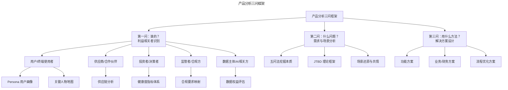
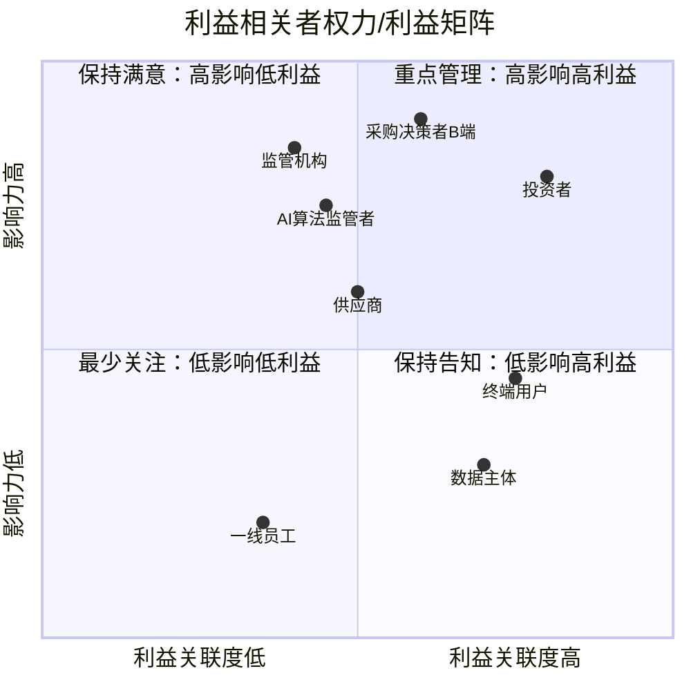
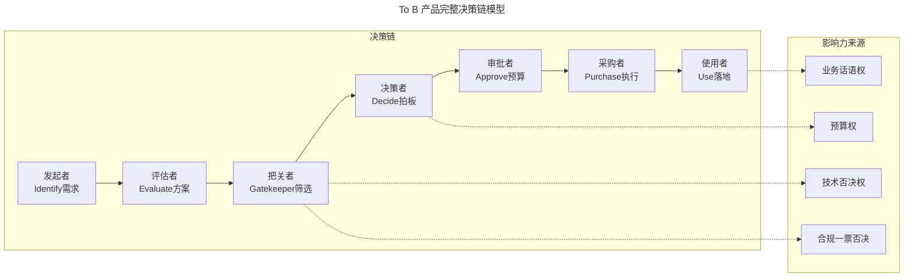
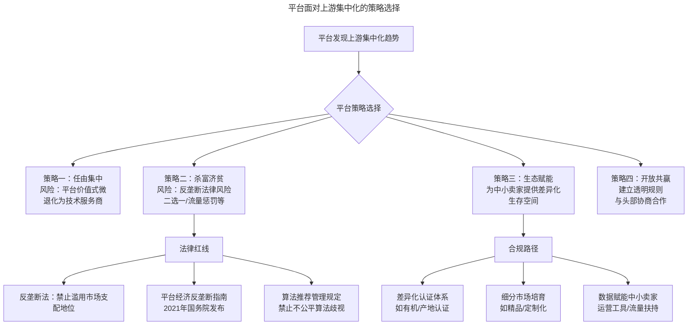
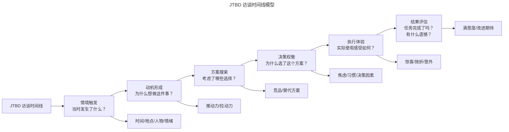
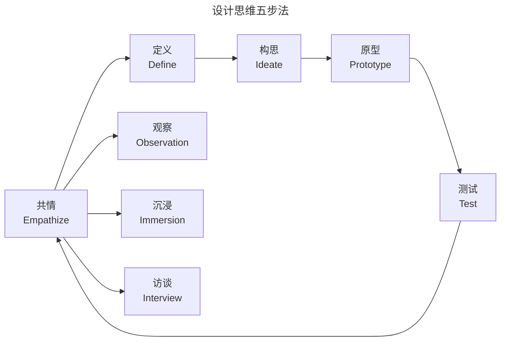
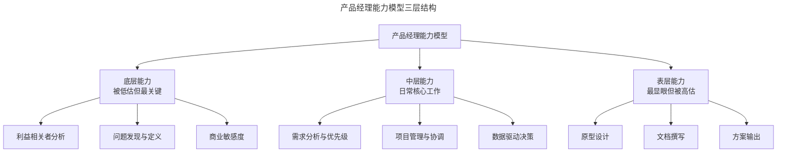
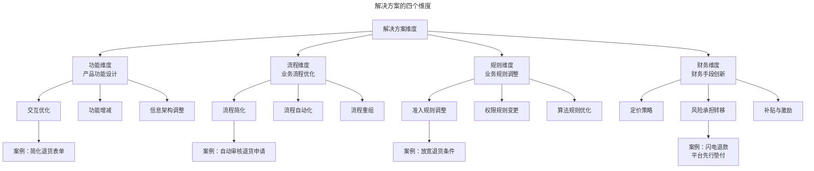
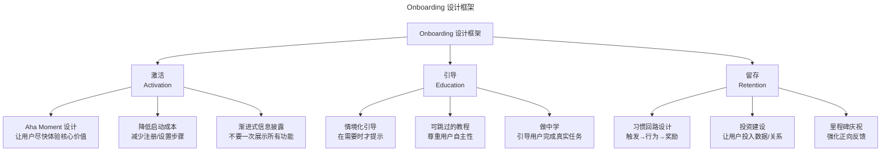
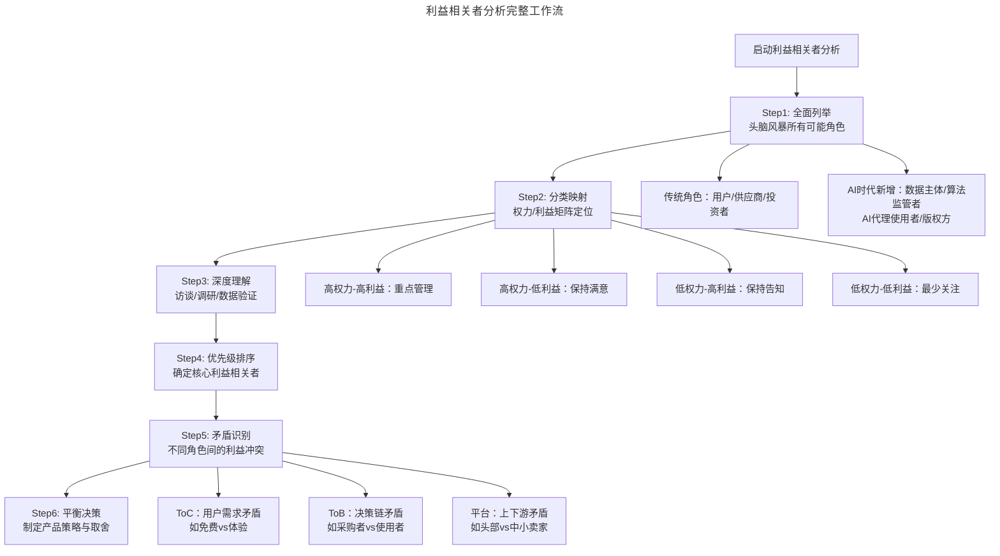

# 产品分析的套路（上中下合并）：谁是利益相关者？解决什么问题？如何出解决方案？

> **适用范围**：产品经理（各阶段）、创业者、需要做产品分析的团队负责人。适用于利益相关者识别、需求本质挖掘、场景理解、方案设计、AI 时代产品分析等场景。
>
> **更新摘要（v2 · 2026-08 更新）**：
> - 结构化升级为 6 节骨架（导言 / 核心方法论 / 关键流程 / 工具与实战 / 常见误区 / 进阶延展）
> - 合并"谁是利益相关者"（上）、"解决什么问题"（中）、"如何出解决方案"（下）三篇为单篇完整文档
> - 保留全部 Mermaid 图并补充 `--- title: ... ---` frontmatter，每张图后追加文字解读

---

## 1. 导言

产品分析的核心套路是反复追问"用什么方法，解决谁的什么问题"，其中三个关键点分别是："用什么方法""谁的"以及"什么问题"。这三个问题的思考顺序应该是："谁的"→"什么问题"→"用什么方法"。这个顺序不可颠倒——先搞清楚为谁服务，再理解他们的问题，最后才考虑解决方案。许多产品失败的根本原因，恰恰是跳过了前两步直接进入方案设计。

> **核心摘要**：利益相关者识别（第一问）是第一优先级。利益相关者远不止用户，还包括供应商、投资者、监管者、数据主体等多元角色。To B 与 To C 产品的决策链结构截然不同，平台型产品的价值与上下游分散度密切相关。第二问"解决什么问题"强调从问题出发而非从解决方案出发（X-Y Problem），用五问法、JTBD 框架挖掘问题本质。第三问"用什么方法"是方案的最终输出，从见多识广、跳出功能思维、借鉴游戏设计三条路径提升方案能力。在 AI 时代与 PLG 模式兴起的背景下，产品分析框架需要与时俱进，纳入算法监管、数据权益等新维度。

### 1.1 产品分析三问框架



> **图解**：产品分析三问框架——第一问"谁的"（利益相关者识别：用户、供应商、投资者、监管者、数据主体，各用 Persona、供应链分析、健康度指标、合规映射、数据权益评估等方法）；第二问"什么问题"（需求与场景分析：五问法、JTBD 框架、场景还原与共情）；第三问"用什么方法"（解决方案设计：功能方案、业务/财务方案、流程优化方案）。利益相关者识别（第一问）是整个分析的基石。

---

## 2. 核心方法论

### 2.1 第一问：利益相关者，不只用户

**基础层：理解利益相关者的范围**——"谁的"是了解需求背后主体的过程。每个产品背后都会有多个利益相关者，也就是我们常说的 Stakeholder、涉众。我们平时最容易关注到的利益相关者可能是用户——也就是产品的直接使用者；但对于产品经理来说，我们不能只关注用户。产品经理的段位高低，很多时候取决于能看到和平衡利益相关者有多少，对他们的了解有多深。

比如在电商领域中，我们要关注作为产品上游的供应商、仓储、物流等等。在医疗行业中，可能有患者、医生、医院、药企甚至一些学会和机构等等，都是我们需要关注的利益相关者。除此之外，当评估整个产品的效率和盈利能力时，我们还要学会站在投资者的角度去看问题。这是一个很大的话题，从投资者角度所关注的具体指标去看产品、服务，是一个产品经理有没有完成进阶的标志。

需要注意的是，这里的投资者关注的或许不仅仅是财务指标，还有整个产品的健康程度和存续指标。比如一款工具的日启、日活、留存、传播，或者社区型产品的用户数量，用户之间的关系数量等。可能有朋友会说，我是一个创业企业、小团队，我还没有投资者这个利益相关者。其实这里的投资者算是一个代称，所指就是要对一个产品或者服务的存续、健康和效率负责的那个角度，当然，最直接的就是财务指标。

除了刚才提到的这些容易被漏掉的利益相关者之外，产品经理最需要关注的依然是用户本身。我们经常提到产品经理的"共情能力"，其实指的是对用户立场和偏好的深刻理解，理解他们的关注点，并把它们变成指标。这个过程有一些工具，比如做用户角色分析（Persona）、关键人物地图等等，它们是做用户研究的一些基本功。这些对角色的理解除了对单一功能点的分析很有价值之外，也对我们后面会提到的，合理排定需求优先级有决定性的影响。不论是用户还是其他利益相关者，我们需要了解他们对哪些事情最为关心，不同的角色关心的指标或许会有关联，甚至有矛盾，产品经理要在其中做出平衡和决策。

**进阶层：Stakeholder Mapping 与权力/利益矩阵**——仅仅列出利益相关者是不够的，我们还需要系统性地评估他们的影响力与利益关联度。经典的 **Mendelow's Stakeholder Matrix**（权力/利益矩阵）是一个实用的分析框架：



> **图解**：利益相关者权力/利益矩阵——将各利益相关者按影响力和利益关联度进行四象限分类，帮助产品经理决定对不同角色的投入策略。注意：AI 算法监管者作为新兴角色已进入"保持满意"象限。

**四象限策略**：

| 象限 | 特征 | 管理策略 | 典型角色 |
|------|------|----------|----------|
| 高权力-高利益 | 最关键角色 | 重点管理，深度参与 | 投资者、核心客户 |
| 高权力-低利益 | 有否决权但不关心细节 | 保持满意，避免阻力 | 监管机构、法务 |
| 低权力-高利益 | 深度受影响但无决策权 | 保持告知，收集反馈 | 终端用户、数据主体 |
| 低权力-低利益 | 关联度最低 | 最少关注，定期扫描 | 边缘合作伙伴 |

**高阶层：AI 时代的新利益相关者**——AI 时代催生了全新的利益相关者类别，传统分析框架必须扩展：

**1. 数据主体（Data Subjects）**：当产品依赖用户数据训练 AI 模型时，数据提供者本身成为重要的利益相关者。他们关心数据隐私、算法公平性和数据使用的透明度。欧盟 GDPR、中国《个人信息保护法》等法规赋予了数据主体知情权、删除权、可携带权等法定权益，产品经理必须将数据主体纳入利益相关者分析。

**2. 算法监管者（Algorithm Regulators）**：随着 AI 监管趋严（如欧盟 AI Act、中国《生成式人工智能服务管理暂行办法》），算法监管者成为新的高权力利益相关者。他们关注算法透明度、偏见控制、安全评估等维度。产品经理需要在设计阶段就考虑合规要求，而非事后补救。

**3. AI 代理使用者（AI Agent Users）**：当用户通过 AI 代理（如 ChatGPT Plugin、AI 助手）间接使用产品时，传统的"用户"概念被拆分为"意图表达者"和"操作执行者"两个角色。这要求产品经理重新思考交互设计和价值传递路径。

**4. 内容创作者与版权方**：AIGC 产品涉及训练数据来源的版权方，他们是不可忽视的利益相关者。纽约时报诉 OpenAI、Getty Images 诉 Stability AI 等案例表明，版权方拥有足够的影响力来改变产品形态甚至存续。

### 2.2 第一问：To B 和 To C 的不同决策方式

**基础层：决策链差异**——通常面向消费者的产品（To C 类产品），考虑利益相关者的套路跟面向企业用户（To B 类产品）是相差很大的。对于 To B 类用户，做出购买决定的人、影响决定的人和使用最终产品的人、甚至是掏钱的人可能都是不同的，他们在购买决策链上的角色和作用，以及发生作用的时机也是不同的。To C 类产品通常是一人一票，只要打动一个用户，就会投一票，一票就是一个实打实的 deal。

我们许多人可能都见过那种界面超丑又特别难用的银行系统或者医院系统。这种系统的产生有时就是因为类似产品购买决策链上没有具体终端的使用者，或者他的话语权弱一些；当然，也有可能"视觉和交互体验"并不是这些人的核心问题。你可以思考一个问题，如果再做一个医院的管理系统（HIS 系统），这个系统提供更加先进和优雅的人机交互界面，可以击败现有市场上的其他产品吗？如果做的管理系统不是为医院服务，而是诊所呢？这两个问题听起来似乎很像，但答案或许是不同的。在医院中，负责采购系统的人可能并不真正使用这些系统，他们会更在意系统是否安全，是否稳定，系统服务商的口碑好不好，甚至是价格合不合适；而小诊所里，做采购决策的人可能就是系统的直接使用者，对他来说，系统的易用性可能就会是一个需要特别关注的方面。

**进阶层：To B 决策链的完整模型**——To B 产品的决策链远比"购买者≠使用者"复杂。现代 B2B 采购决策通常涉及 6-10 个角色，可以归纳为以下模型：



> **图解**：To B 产品完整决策链模型——从需求识别到最终使用，涉及 7 个关键角色（发起者→评估者→把关者→决策者→审批者→采购者→使用者），每个角色拥有不同的影响力来源（决策者有预算权、把关者有技术否决权和合规一票否决、使用者有业务话语权）。产品经理需要针对不同角色设计差异化的价值主张。

**关键洞察**：在 To B 决策链中，产品经理需要为每个角色准备不同的"弹药"——对决策者强调 ROI 和战略价值，对把关者提供安全合规证明，对使用者保证易用性和效率提升。

**高阶层：PLG 模式下的利益相关者融合**——**PLG（Product-Led Growth）** 模式正在模糊 To B 和 To C 的边界。在 PLG 模式下，产品本身成为获客、转化和扩张的核心驱动力，使用者（End User）成为产品传播的起点，自下而上地影响决策链。Slack、Figma、Notion、Linear 等产品的成功证明了 PLG 的力量。在这种模式下，利益相关者分析需要重新审视：

| 维度 | 传统 To B | PLG 模式 |
|------|-----------|----------|
| 决策起点 | 采购部门/高管 | 终端使用者 |
| 价值验证 | 销售演示/PoC | 免费试用/自服务 |
| 扩张路径 | 自上而下 | 自下而上 |
| 核心利益相关者 | 决策者 | 使用者→决策者 |
| 产品设计重心 | 满足采购标准 | 首次使用体验/Aha Moment |

PLG 并非万能药。对于安全合规要求极高的行业（如金融、医疗），传统销售驱动模式仍然占主导。产品经理需要根据产品特性选择合适的增长模式，并相应调整利益相关者分析的重点。

### 2.3 第一问：上下游特点与平台价值

**基础层：平台价值的核心逻辑**——对于市场容量比较大的 B 端客户，我们的思考方式和市场容量比较小的 B 端客户也是不同的。这里的市场容量指的不是财务市场的大小，而是玩家数量的多寡。通常 B2B 平台型的产品会偏向于认为市场容量越大、越散，玩家越多，平台越有价值。这个结论背后逻辑是，当交易其中一方相对集中时，通常意味着该方在交易中掌握更大的议价权，任何一方的相对集中都会导致中间平台退化为其代理。

比如我们想象一个桔子交易市场，如果卖方非常集中，只有一家，所有买桔子的人都要从他手上购买桔子，那他拥有绝对的桔子定价权。想象你现在要做一个桔子交易平台，你的上游是这唯一一家桔子供应商，你是很难对他有控制力或影响力的，最终你将退化为这一家供应商的代理或技术服务公司，帮助其向下游销售桔子，此时可能你只剩下技术价值，没有平台价值。现在设想另一种情况，倘若卖家和买家都很多，卖家之间互相竞争争取买家，买家有各自的性格，有人喜欢个头大的，有人喜欢水分多的，有人喜欢便宜的，他们为了买到心仪的桔子需要对比、甄别、挑选，耗费很多心力。这时，你决定做一个桔子交易平台，把买卖双方都搬上来，卖家可以在这里展示自己桔子的特点，平台提供不同维度的信息筛选机制和认证机制，买家则可以通过这些机制找到自己喜欢的桔子，买卖双方还能够在平台上留下自己的信用记录。如此一来，平台价值就逐渐地显现出来，正是由于你创建的桔子交易平台，桔子交易成本被大幅度降低，买卖双方都很开心，甚至都有为此付费的意愿。平台也就逐渐掌握了桔子交易市场上的议价权。

**进阶层：真实平台案例验证**——桔子交易的思想实验在现实中有着丰富的对应：
- **拼多多——从分散到聚拢的逆袭**：拼多多崛起时，中国电商市场看似已被淘宝/天猫和京东瓜分。但拼多多敏锐地发现了一个被忽视的利益相关者群体——低线城市的价格敏感消费者和大量分散的小型制造商/农产品供应商。这些供应商在淘宝/天猫的流量分配机制下越来越集中化，中小卖家被边缘化。拼多多通过拼团模式重新分散了流量分配权，让大量中小卖家获得了触达消费者的机会，平台价值由此建立。
- **美团——多边平台的平衡术**：美团的外卖业务是一个典型的多边平台：消费者、骑手、商家三方利益相关者。美团的平台价值建立在三方都足够分散的基础上。但当部分商家形成连锁品牌（如麦当劳、星巴克）时，它们的议价权显著提升，平台需要通过独家合作、流量倾斜等策略维持平衡。2021 年美团因"二选一"行为被罚款 34.42 亿元，正是平台"杀富济贫"策略触碰法律边界的典型案例。
- **App Store——平台权力的极致形态**：苹果 App Store 是平台权力高度集中的典型。当上游（开发者）和下游（用户）都足够分散时，苹果作为平台方拥有绝对议价权。Epic Games 诉苹果案（2020-2023）揭示了当上游出现强势玩家时，平台与利益相关者之间的权力博弈如何升级。

**高阶层：平台经济反垄断与"杀富济贫"的法律约束**——顺着桔子交易平台的例子再思考下去。如果平台充分竞争，有一个桔子卖家，假设名叫小池柑桔，以质优价廉、服务周到逐渐占领了市场，吞并了其他卖家，逐渐成为了桔子交易平台的寡头。他的桔子出货量、交易量、收入和利润，都占据了整个平台的较大比例。最早由于规范上下游的分散而形成的平台价值，会开始逐渐式微。买家到平台来不再根据自己的喜好筛选桔子卖家，而是直接进到小池柑桔的店铺里去买桔子。这时，你作为交易平台方，会怎么想？怎么做？是顺应市场竞争规律，任由小池柑桔形成垄断？还是杀富济贫，用平台规则和制度打压小池柑桔，扶持其他中小桔子卖家，维护上下游的分散，保持平台价值存续？如果这时出现了其他的桔子交易平台跟你竞争呢？

**这个思想实验在 2020-2025 年的平台反垄断浪潮中有了真实的答案。** 原答案中"杀富济贫"是平台的理性选择，但如今这个选择面临严格的法律约束：



> **图解**：平台面对上游集中化的策略选择与法律约束——平台发现上游集中化趋势后有四个策略选择：任由集中（风险：平台价值式微、退化为技术服务商）、杀富济贫（风险：反垄断法律风险、二选一/流量惩罚等）、生态赋能（为中小卖家提供差异化生存空间）、开放共赢（建立透明规则与头部协商合作）。传统的"杀富济贫"策略在反垄断监管下已触及法律红线，产品经理需要转向生态赋能和开放共赢等合规路径。

**关键法规梳理**：

| 法规/政策 | 发布时间 | 核心约束 | 对产品经理的影响 |
|-----------|----------|----------|------------------|
| 《关于平台经济领域的反垄断指南》 | 2021.02 | 禁止"二选一"、大数据杀熟 | 平台规则设计需合规审查 |
| 《互联网平台分类分级指南》（征求意见稿） | 2021.10 | 超级平台需承担额外义务 | 大平台产品需考虑互联互通 |
| 《互联网信息服务算法推荐管理规定》 | 2022.03 | 算法透明、用户选择权 | 推荐算法需提供关闭选项 |
| 《生成式人工智能服务管理暂行办法》 | 2023.08 | AI服务安全评估、内容标注 | AIGC产品需合规备案 |

试着从这个角度去理解平台价值，或对平台类的产品做一些观察和分析，或许你会有些有趣的发现。今天的平台产品经理，不仅要理解商业逻辑，还要具备基本的法律合规意识——这不是束缚，而是新的专业能力要求。

---

## 3. 关键流程

### 3.1 第二问：重视解决的问题，而不是解决方案

**基础层：X-Y Problem 的陷阱**——产品要做的任何事情，都应该围绕着某一个或某几个利益相关者的具体问题来展开。很多产品经理在这里投入的精力和时间是不够的，大家更喜欢花时间在解决方案上，也就是后面会提到的"用什么方法"上面。这样不妥，应该在理解谁的问题、什么问题之后，才去想解决方案。这种错误也被称作 **X-Y Problem**，也就是，我们希望解决 X 问题，然后想到了 Y 方案，随后把所有的精力放在 Y 这个解决方案上，而忽略了对要解决问题本身的理解。

映射到我们的日常工作中，产品经理接到的需求通常不是真正意义上的"需求"，而是提出需求的人，基于某一个需求提出的"解决方案"。我们举一个例子，比如用户提出所谓的需求——"希望增加收藏功能"，如果你只是拿到这个所谓的需求，画个原型，让开发做出来，那么你最多是一个需求翻译和分发的机器，而不是一个产品经理。正确的做法应该是：把类似的所谓需求当做一个线索，抓住这个线索不断地向上追问背后的需求动机和需要被解决的问题。

**进阶层：五问法与问题本质挖掘**——利用"五问法"（5 Whys），来挖掘需求背后的需求，就是穿过解决方案抵达问题本质的好办法。比如关于收藏，不同形态产品的收藏功能背后要解决的问题是不同的，浏览器的收藏可能是为了重复访问，所以演化为书签；阅读工具的收藏可能是为了日后检索，所以需要准备标签和检索功能；社区的收藏有索引和聚合功能，所以很多社区的收藏增加了发布和分享功能，成了另一种 UGC。

**五问法的实战应用**：

```mermaid
---
title: 五问法挖掘收藏功能背后的本质问题
---
flowchart TD
    A[表面需求：增加收藏功能] --> B{第一问：为什么需要收藏？}
    B --> C[用户回答：想保存有价值的内容]
    C --> D{第二问：保存后打算怎么用？}
    D --> E[用户回答：以后可能会再看]
    E --> F{第三问：多久会看一次？}
    F --> G[用户回答：其实很少回头看...]
    G --> H{第四问：那为什么还想收藏？}
    H --> I[用户回答：怕以后找不到了<br/>主要是求个安心]
    I --> J{第五问：如果有一个<br/>"智能推荐相关内容"功能呢？}
    J --> K[本质问题：不是存储需求<br/>而是"怕错过有价值内容"的焦虑]
    K --> L[解决方案方向：<br/>智能推荐/稍后阅读/内容摘要]
```

> **图解**：五问法挖掘收藏功能背后的本质问题——通过连续追问，发现表面需求背后隐藏的真实动机——"怕错过有价值内容"的焦虑，而非真正的存储需求。这打开了完全不同的解决方案空间（智能推荐/稍后阅读/内容摘要）。

**高阶层：Jobs-to-be-Done（JTBD）框架**——五问法是挖掘问题本质的经典工具，但在更系统化的需求分析中，**Jobs-to-be-Done（JTBD）** 框架提供了更完整的理论支撑。JTBD 的核心理念是：用户不是购买产品，而是"雇佣"产品来完成某项任务。这个任务（Job）包含功能性、情感性和社会性三个维度。

**JTBD 框架的核心要素**：

| 要素 | 说明 | 示例（以"收藏功能"为例） |
|------|------|--------------------------|
| 功能性任务 | 用户想要完成的具体目标 | 保存内容以备后用 |
| 情感性任务 | 用户在完成任务时的感受 | 减轻"怕错过"的焦虑、获得掌控感 |
| 社会性任务 | 用户在他人眼中的形象 | 展示自己是有品位的内容消费者 |
| 待完成任务 | 用户真正想解决的问题 | "当我遇到有价值的内容但没时间细读时，我需要一个方式让我安心继续浏览" |
| 推动力（Push） | 促使改变的痛点 | 信息过载、时间碎片化 |
| 拉动力（Pull） | 新方案的吸引力 | 智能整理、跨设备同步 |
| 焦虑 | 阻碍改变的因素 | 担心收藏后找不到、担心学习成本 |
| 习惯 | 现有行为的惯性 | 已经习惯截图保存、转发到微信 |

**JTBD 访谈法**：与传统的用户访谈不同，JTBD 访谈聚焦于"最近一次"的具体行为，通过还原时间线来挖掘真实的任务场景：



> **图解**：JTBD 访谈时间线模型——从情境触发到结果评估的完整行为链路（情境触发→动机形成→方案搜索→决策权衡→执行体验→结果评估），每个环节都有对应的深挖问题（时间/地点/人物/情绪、推动力/拉动力、竞品/替代方案、焦虑/习惯/决策因素、惊喜/挫折/意外、满意度/改进期待）。这种方法比传统的"你想要什么功能"更能揭示真实的任务需求。

### 3.2 第二问：把自己放进场景，吃"自己的狗粮"

**基础层：场景是需求的灵魂**——在理解各种利益相关者的需求动机，尤其是用户的需求动机的过程中，有一个非常重要的概念叫做"场景"。我们常说场景是需求的灵魂。也就是我们在考虑需求时，不应该只是孤立地考虑功能逻辑，而应该把这些功能和流程放到具体的用户使用上下文里面去。场景这个词来源于戏剧和电影，包含了时间、空间、角色等等许多因素。在考虑功能特性的时候，我们得把自己放到实际场景中去。我之前经常给同事举过一个例子，就是现在很多 ATM 机是有免卡操作功能的，你可以不用带银行卡就能取款或者查询余额。结果有这样功能的 ATM 机很多时候是锁在一个必须刷卡才能打开的 24 小时银行房间里的。我们试着去模拟一下这个过程，到细节里面去，在脑子里演一遍，就会发现问题。把需求放在场景中考虑最好的办法是在脑海中把所有的功能过程演一遍，充分地把自己带入，把每个细节都摸到。闭上眼一步步地演进，考虑具体利益相关人的情绪、关注点、好恶，以及所处的环境，所用的终端等等。

**进阶层：Customer Zero——从"吃狗粮"到"零号客户"**——我们一般认为，为自己做一款产品是一件相对容易的事情，许多做产品的书也提到建议产品经理"吃自己的狗粮"（Eat your own dog food），也就是成为自己产品的重度用户。这是因为当你成为自己产品重度用户后，就压根不需要演的过程，不需要"带入""模拟"或者"共情"之类的过程，便可以全然沉浸在产品的使用场景中从而发现和理解问题。**但在 B2B SaaS 领域，这一理念已经演进为更成熟的"Customer Zero"实践。** Customer Zero 指的是：产品团队在产品正式发布给客户之前，自己先作为"零号客户"深度使用产品，发现并解决所有问题。这比简单的"吃狗粮"更系统化：

| 维度 | "吃自己的狗粮" | Customer Zero |
|------|----------------|---------------|
| 使用深度 | 成为重度用户 | 模拟真实客户场景的完整工作流 |
| 使用时机 | 产品发布后持续使用 | 产品发布前的必经阶段 |
| 使用目的 | 发现体验问题、建立共情 | 验证产品可用性、发现阻塞问题 |
| 组织方式 | 个人自发行为 | 团队制度化流程 |
| 问题处理 | 发现问题后按优先级处理 | 发现阻塞问题必须修复后才能发布 |

**典型案例**：Microsoft 在开发 Azure DevOps（原 VSTS）时，整个开发团队使用自己的产品来管理 Azure DevOps 的开发——用 Azure DevOps 开发 Azure DevOps。这种"自我托管"（Self-hosting）实践确保了产品在发布前已经经过最严苛的真实场景验证。

**高阶层：场景还原的系统化方法**——场景还原不应仅依赖产品经理的个人想象，而应建立系统化的方法：用户体验地图（User Journey Map，可视化用户与产品交互全过程的工具，将用户的行为、情绪、痛点和机会点沿时间线展开）；服务蓝图（Service Blueprint，在用户体验地图基础上，增加前台、后台、支持过程的可见性分层，帮助产品经理理解用户可见体验背后的组织支撑）。

**共情研究：从本能到方法论**——共情也叫"移情"或者"投情"，大概就是"设身处地""感同身受"的意思。一个很著名的研究动物和心理学的科学家弗朗斯·德瓦尔有一本书叫做《共情时代》，他认为共情是人甚至动物的本能。**设计思维（Design Thinking）** 将共情从本能提升为可操作的方法论。斯坦福 d.school 提出的设计思维五步法中，"共情"（Empathize）是第一步：



> **图解**：设计思维五步法迭代循环——共情（Empathize，通过观察、沉浸、访谈三种方法深入理解用户）→定义（Define）→构思（Ideate）→原型（Prototype）→测试（Test）→回到共情形成迭代闭环。共情是整个流程的起点和持续输入。

**共情研究的具体方法**：影子观察（跟随用户在真实环境中工作/生活，记录行为细节，适用于 B2B 产品、复杂工作流）；沉浸体验（产品经理亲自扮演用户角色，完成真实任务，适用于 To C 产品、生活服务类）；深度访谈（1v1 开放式访谈，探索用户动机和情感，适用于早期需求探索）；同理心地图（可视化用户的所说、所做、所想、所感，适用于团队共创、洞察整理）；极端用户访谈（访谈极端用户：超级用户/拒绝用户，适用于发现隐藏需求、边界场景）。

**高阶层：AI 辅助用户研究的新工具**——AI 正在改变用户研究的方式，但不是替代共情，而是放大共情的效率：AI 辅助访谈分析（自动转录 Otter.ai/讯飞听见、情感分析、主题提取、洞察聚类）；合成用户 Synthetic Users（基于真实用户画像数据训练，模拟不同用户群体反应，但只能用于早期方向探索，绝不能替代真实用户研究）；行为数据分析增强（异常检测、路径分析、预测模型）；AI 驱动的可用性测试（Maze、UserTesting、Lookback）。

---

## 4. 工具与实战

### 4.1 第三问：解决方案能力——被高估但仍重要

**基础层：方案能力在产品经理能力模型中的位置**——给出解决方案能力的重要性在整个产品经理的能力模型里面其实是被高估了。但这并不代表我认为出解决方案不重要，恰恰相反，解决方案是一个产品设计者最终输出的东西，你的一切思考、平衡和执行，都会在这里被体现出来。



> **图解**：产品经理能力模型三层结构——底层能力（利益相关者分析、问题发现、商业敏感度）最关键却常被忽视，表层能力（原型设计、方案输出）最显眼却常被高估。解决方案能力属于表层，但它是底层和中层能力的最终体现。

另外，出解决方案也是产品经理硬技能被体现最多的地方。比如你会不会用 Figma，懂不懂领域建模，能不能写出漂亮的文档，以及用各种图来分析流程、逻辑关系等等。**工具演进**：原文中提到的 Axure 和 Photoshop 已经不再是主流选择。当前产品经理的方案设计工具栈已经发生了显著变化：原型设计（Axure → Figma，协作优先、实时多人编辑）；UI 设计（Photoshop → Figma/Sketch，设计系统化、组件化）；流程图（Visio → Miro/FigJam，在线协作、模板丰富）；文档协作（Word/Confluence → Notion/Linear，结构化、关联性）；AI 辅助（无 → v0/Cursor/Galileo AI，AI 生成界面与代码）。

**进阶层：方案能力的三重境界**——提高出方案能力的最好方法就是大量把玩各种各样的互联网产品和服务。但要注意一点，这个把玩的过程不应该是随便用一下、体验一下就完了。所谓内行看门道，外行看热闹，产品经理需要通过看到特性就能理解背后的问题、用户，尽可能地去抽象考虑同样的问题还有哪些不同的方案。见得足够多了，理解得透彻了，自然出方案的能力就相应地增强。就像一个工具箱，工具越是丰富，你面对问题时就越是游刃有余。有人会说，这不是纵容抄袭嘛，其实并不是。在这个行业中，方案和手段上的创新机会并不多，真正困难的是挑选和平衡。另外就是再提醒一遍，不要陷入 X-Y Problem 中，不要忘记要解决的问题和要达成的目标。一旦我们执着于解决方案，就很容易变成一个不合格的产品经理。

**方案能力的三重境界**：第一重模仿（见多识广积累方案库：大量体验产品、拆解优秀设计、建立方案模式库）→第二重组合（跨领域借鉴与重组：游戏设计借鉴、跨界思维迁移、多方案对比权衡）→第三重创新（基于深层洞察的原创方案：洞察驱动的创新、技术前沿的应用、AI 赋能的方案探索）。大多数产品经理在第一重和第二重之间，AI 时代为第三重境界提供了新的可能性。

**高阶层：AI 时代的方案设计新范式**——AI 正在重塑方案设计的工作方式，但不是替代产品经理的判断力：AI 辅助原型生成（v0 by Vercel 通过自然语言描述生成 React 组件和页面、Galileo AI 通过文字描述生成高保真 UI 设计、Cursor AI 辅助编码工具、Figma AI 内置 AI 功能）；AI 辅助方案探索（方案发散：让 AI 基于问题描述生成多个备选方案；方案评估：让 AI 从不同利益相关者视角评估方案的优劣；方案模拟：用 AI 模拟用户在不同方案下的行为路径）。⚠️ **关键提醒**：AI 生成的方案是起点而非终点。产品经理的核心价值在于——判断哪个方案最适合当前的问题和利益相关者，以及如何在约束条件下做出取舍。AI 可以生成 100 个方案，但选择和平衡的工作必须由人完成。

### 4.2 第三问：跳出功能思维——业务与财务手段

**基础层：锤子与钉子**——有个肥皂厂，因为生产线的问题总是会出现包装盒里没有肥皂的现象，大厂的产品经理解决这个问题的方法是花费很多精力做各种探测装置，在生产线末端去分拣没有装进肥皂的包装盒。另一个小厂的产品经理没有这么多资源，灵光一现想到了一个办法：弄了俩电扇在生产线旁边儿呼呼猛吹，把那些没装肥皂的包装盒全都吹到一边去，留下没有问题的肥皂盒。虽然，后一种方案未必就一定比前一种方案好，但这个故事还是可以给我们一些启发。我们互联网产品经理主要是做产品功能设计，所以有时候会本能地想通过做功能解决一些问题，就像我们聊工具的时候提到过的，手里有一把锤子，看到满世界都是钉子，其实产品经理还要学会通过改变业务规则、流程，甚至利用财务手段去解决问题。

**进阶层：解决方案的四个维度**——比如优化退款流程体验这样的事情，我们可以在经过一些数据分析之后，去承担一些潜在的财务风险，你可以去研究一下各大电商平台的退货退款流程，很多地方都是在用财务手段优化体验。比如多少天内无条件退款，或者高等级用户闪电退款之类的功能。这样的优化不是通过把表单设计得更简洁更美观，或者减少提交退货的操作步骤之类的功能完成的，而是抓住了退款体验的核心，用业务的方式解决问题。



> **图解**：解决方案的四个维度——产品经理最习惯从功能维度出发，但流程、规则、财务维度往往能以更低的成本解决更根本的问题。闪电退款就是典型的财务维度解决方案——平台先行垫付退款金额，用财务手段消除用户等待时间。

**高阶层：Design Sprint——系统化的方案探索流程**——**Design Sprint（设计冲刺）** 是 Google Ventures 开发的 5 天流程，用于快速验证想法和探索解决方案。它将方案设计从个人灵感驱动升级为团队系统化流程：Day 1 理解（专家访谈、问题定义、目标设定→共识的问题陈述）；Day 2 发散（竞品分析、方案草图、投票决策→选定的方案方向）；Day 3 决策（方案细化、故事板绘制→详细的用户故事板）；Day 4 原型（快速制作可测试原型→可交互的原型）；Day 5 验证（5 位用户测试、学习与迭代→用户反馈与验证结论）。Design Sprint 的适用场景：新功能探索方向不明确时、高风险决策需要快速验证时、团队意见分歧需要对齐时、时间紧迫需要快速推进时。AI 时代的 Design Sprint 变体：AI 工具可以显著压缩 Design Sprint 的时间——Day 4 的原型制作可以从 1 天缩短到 2-3 小时（使用 v0 或 Galileo AI），Day 5 的用户测试可以借助 AI 工具进行初步筛选（但最终验证仍需真实用户）。

### 4.3 第三问：游戏设计的借鉴与 Onboarding 设计

**游戏化思维**——关于产品方案设计还有一个非常值得学习和借鉴的领域就是游戏设计，游戏把很多人性的东西利用得很好。有不少做游戏策划的高手把自己游戏设计的经验总结出来，也出版了很多书，比如《游戏改变世界》，还有图灵出的《游戏设计的 100 个原则》、《通关》等等。很多游戏设计的点和原则，这些内容单独拿出来放到产品里其实都会非常有力量。

**Octalysis 游戏化设计框架**——**Yu-kai Chou** 提出的 **Octalysis 框架** 是目前最系统的游戏化设计方法论，它将驱动用户行为的核心动力归纳为 8 个维度：史诗意义与使命感（Epic Meaning，案例：维基百科、蚂蚁森林）；发展与成就感（Development，案例：LinkedIn 档案完成度、Duolingo 连续打卡）；创造力的发挥（Empowerment，案例：Minecraft 自由建造、Notion 自定义模板）；社交影响与关联性（Social Influence，案例：微信社交关系链、GitHub Star 与 Fork）；稀缺性与不确定性（Scarcity，案例：限量发售、Clubhouse 早期邀请）；避免损失（Loss Avoidance，案例：优惠券过期提醒、积分清零机制）；不可预测性（Unpredictability，案例：盲盒/抽奖机制、随机奖励）；所有权与占有欲（Ownership，案例：集卡/收集系统、虚拟资产积累）。

**Octalysis 的实践要点**：不要全部使用（选择 2-3 个与产品调性匹配的维度深入设计）；白帽 vs 黑帽（史诗意义、发展成就、创造力、社交影响属于"白帽"驱动力正向激励，稀缺性、避免损失、不可预测性、占有欲属于"黑帽"驱动力紧迫感驱动。过度依赖黑帽驱动力会损害用户长期体验）；左脑 vs 右脑（发展成就、稀缺性、避免损失、占有欲偏向逻辑左脑，史诗意义、创造力、社交影响、不可预测性偏向情感右脑。好的游戏化设计需要左右脑平衡）。

**游戏化设计的伦理边界**——游戏化设计是一把双刃剑。过度使用"黑帽"驱动力（如避免损失、不可预测性）可能导致：成瘾性设计（利用人性弱点制造不健康的使用习惯）；暗黑模式 Dark Pattern（诱导用户做出非本意的操作）；短期指标好看但长期信任崩塌（用户一旦意识到被操控，会迅速流失）。产品经理在使用游戏化设计时，需要建立伦理底线：**游戏化应该让用户感到"有趣"而非"被操控"，应该增强而非削弱用户的自主感。**

**首因效应与 Onboarding 设计**——我们需要特别拿出精力来设计"第一印象"。比如第一次打开 App，用户第一次发布内容，第一次尝试支付等等。这背后的心理学依据叫做"首因效应"（primacy effect），就是人们会根据最先得到的信息快速地做出判断，就像认识一个人一样，第一印象基本决定了全部印象。

**系统化 Onboarding 设计方法论**——首因效应在产品设计中的直接应用就是 **Onboarding（新手引导）** 设计。优秀的 Onboarding 不是简单的功能介绍，而是一个精心设计的"第一次体验"：



> **图解**：Onboarding 设计框架——从激活（Activation：Aha Moment 设计让用户尽快体验核心价值、降低启动成本、渐进式信息披露）、引导（Education：情境化引导、可跳过教程、做中学）、留存（Retention：习惯回路设计、投资建设、里程碑庆祝）三个阶段，每个阶段都有具体的设计策略。核心原则是：让用户尽快到达 Aha Moment，在真实使用中学习，通过习惯回路建立粘性。

**经典 Onboarding 案例分析**：Slack（引导创建第一个频道并发送消息，Aha Moment 是收到第一条回复，7 天内发送 2000 条消息的团队留存率 93%）；Notion（提供模板库一键创建第一个页面，Aha Moment 是看到自己创建的页面，模板使用率比空白创建高 3 倍）；Duolingo（第一课只需 1 分钟立即获得经验值，Aha Moment 是完成第一课获得奖励，首日留存率提升 20%+）；Figma（打开即用无需安装提供示例文件，Aha Moment 是第一次实时协作编辑，协作功能使用率是单人使用的 2.5 倍）。

**高阶层：AI 时代的个性化 Onboarding**——AI 使个性化 Onboarding 成为可能：动态引导路径（根据用户画像和行为数据，为不同用户展示不同的 Onboarding 流程）；智能提示时机（AI 分析用户行为，在最需要的时刻提供最相关的提示）；自适应难度（根据用户学习速度调整引导的节奏和深度）；预测性 Aha Moment（AI 预测每个用户最可能产生"Aha"的功能点，优先引导）。

### 4.4 第三问：破除知识的诅咒——可用性测试

**基础层：简化版可用性测试**——另一个是破除知识的诅咒，所谓知识的诅咒是指由于你掌握了某种知识，所以无法假装自己不知道这些东西，并重新回到无知的状态，就像被诅咒一样。在产品设计上，通常就是产品经理或者设计师在某种路径或逻辑上沉浸太久，非常熟悉，以至于无法发现其中的错误和遗漏。传统的用户研究流程会用可用性测试来应对这类问题，这里给你介绍一个成本低很多，效果还不错的方案。就是去找一个不相干的同事，最好比较细腻，而且比较外向，创造一个比较放松的条件，让他来体验整个流程。我们团队里经常会让行政、HR、法务和财务的同事来做这样的测试，不断地问他，你现在想什么，你想点哪儿，哪里看着别扭，跟你想象中不太一样？如果你想完成某个任务，你会从哪里开始，等等。在这个过程中，最重要的是要让这个同事放下心里戒备，不能担心自己说错或说蠢话。作为产品经理必须要克制反驳，尤其不要长篇大论地倾诉自己的设计理念，而是要全心全意引导他去讲出困惑。我们团队每次做类似的事情，产品经理都会说的一句台词是："这不是在测验你，而是你在测验我们"。每一次我邀请同事来做类似的测试（其实就是简版的可用性测试），都会有意外的惊喜，建议你也试试。

**进阶层：远程可用性测试工具**——在远程办公和全球化团队日益普遍的今天，可用性测试也有了更丰富的工具选择：Maze（无人值守测试，行为分析、热力图、可用性评分，免费起步）；UserTesting（有人值守/无人值守，视频录制、AI 洞察提取，企业级定价）；Lookback（有人值守，实时观察、AI 情绪标记，中等定价）；Hotjar（行为分析，热力图、录屏、反馈收集，免费起步）；Lyssna 原 UsabilityHub（无人值守，五秒测试、偏好测试、导航测试，免费起步）。

**远程可用性测试的最佳实践**：5 人法则依然有效（Jakob Nielsen 的研究表明，5 个用户就能发现 85% 的可用性问题）；任务设计是关键（给用户具体的任务而非开放式的"你觉得怎么样"）；关注行为而非意见（用户说什么不重要，做什么才重要，录屏和行为数据比问卷反馈更有价值）；尽早测试、频繁测试（在原型阶段就进行测试，而非等到开发完成）。

**高阶层：AI 驱动的可用性测试**——AI 正在将可用性测试从"人工观察"升级为"智能分析"：自动化可用性评估（AI 视觉分析自动检测界面中的可用性问题如对比度不足、点击目标过小、信息层级混乱；AI 路径分析自动识别用户在任务中的犹豫、回退、迷失等行为模式；AI 情感识别通过面部表情和语音分析用户在测试中的情绪变化）；持续可用性监控（传统可用性测试是"一次性"的，AI 可以实现"持续监控"：异常行为检测、A/B 测试自动化、个性化体验优化）；合成可用性测试（AI 可以模拟不同类型的用户进行"合成可用性测试"，在真实用户测试前进行预筛选：快速验证明显的可用性问题、测试极端场景和边界条件、评估无障碍性）。⚠️ **再次强调**：AI 测试只能发现"可预测的问题"，真正的创新洞察和意外发现仍然需要真实用户参与。

### 4.5 利益相关者分析的完整工作流

将以上所有内容整合，我们可以形成一个系统化的利益相关者分析工作流：



> **图解**：利益相关者分析完整工作流——从全面列举（头脑风暴所有可能角色，传统角色用户/供应商/投资者 + AI 时代新增数据主体/算法监管者/AI 代理使用者/版权方）→分类映射（权力/利益矩阵定位）→深度理解（访谈/调研/数据验证）→优先级排序（确定核心利益相关者）→矛盾识别（不同角色间的利益冲突，如 ToC 用户需求矛盾、ToB 决策链矛盾、平台上下游矛盾）→平衡决策（制定产品策略与取舍）的六步闭环。

### 4.6 实战要点

| 要点 | 说明 | 适用场景 |
|------|------|----------|
| 全面列举利益相关者 | 不要只盯着用户，用头脑风暴列出所有可能角色 | 产品规划初期、新项目启动 |
| 权力/利益矩阵分类 | 用 Mendelow 矩阵评估影响力和利益关联度 | 利益相关者过多时优先级排序 |
| To B 决策链拆解 | 识别7个关键角色：发起者、评估者、把关者、决策者、审批者、采购者、使用者 | B2B 产品设计、销售策略制定 |
| PLG 模式适配 | 当产品具备自服务能力时，优先服务使用者，自下而上影响决策 | SaaS 产品、协作工具 |
| 平台分散度评估 | 评估上下游的集中度，判断平台价值空间 | 平台型产品可行性分析 |
| 反垄断合规意识 | 平台规则设计需考虑反垄断法规约束 | 平台规则制定、商家管理策略 |
| AI 时代新角色纳入 | 数据主体、算法监管者、AI 代理使用者纳入分析 | AI 产品、数据驱动型产品 |
| 识别 X-Y Problem | 把需求当线索，追问背后的真实问题 | 接到任何需求时 |
| 五问法挖掘本质 | 连续追问"为什么"，直达问题根源 | 需求分析、问题诊断 |
| JTBD 框架应用 | 从功能性、情感性、社会性三个维度理解用户任务 | 产品定位、功能设计 |
| 场景还原演练 | 在脑海中完整演练用户使用过程 | 功能设计、流程优化 |
| Customer Zero 实践 | 团队作为零号客户深度使用产品 | B2B SaaS 产品发布前 |
| 用户体验地图 | 可视化用户旅程全过程的情绪和痛点 | 体验优化、服务设计 |
| 设计思维共情 | 通过观察、沉浸、访谈深入理解用户 | 早期需求探索 |
| 见多识广积累方案库 | 大量体验和分析不同产品，建立个人方案模式库 | 日常积累 |
| 四维度思考方案 | 功能/流程/规则/财务四个维度寻找解决方案 | 遇到问题时不要只从功能角度思考 |
| Octalysis 游戏化框架 | 从8个核心驱动力维度设计游戏化体验 | 用户激励、留存设计 |
| Onboarding 系统设计 | 激活→引导→留存三阶段设计 | 新用户首次体验 |
| 简化版可用性测试 | 找不相干同事体验流程，收集反馈 | 快速验证、低成本测试 |
| 破除知识诅咒 | 用外部视角审视自己的设计，克制反驳 | 每次方案评审 |

---

## 5. 常见误区

| 误区 | 表现 | 正确做法 |
|------|------|---------|
| **只关注用户** | 忽视供应商、投资者、监管者等利益相关者 | 全面列举所有利益相关者 |
| **跳过问题直接方案** | 陷入 X-Y Problem，把精力放在解决方案 | 先理解谁的问题、什么问题，再想解决方案 |
| **把需求当最终需求** | 拿到"增加收藏功能"就画原型做开发 | 把需求当线索，用五问法追问本质 |
| **执着于解决方案** | 执着于方案就忘了要解决的问题 | 不要忘记要解决的问题和要达成的目标 |
| **只从功能维度思考** | 手里有锤子看满世界都是钉子 | 用功能/流程/规则/财务四维度思考 |
| **过度使用黑帽驱动力** | 用避免损失、不可预测性操纵用户 | 游戏化应让用户感到"有趣"而非"被操控" |
| **忽视知识诅咒** | 沉浸太久无法发现设计错误 | 用简化版可用性测试破除知识诅咒 |
| **AI 替代判断** | 直接采用 AI 生成的方案 | AI 生成方案是起点，选择平衡由人完成 |

---

## 6. 进阶延展

### 6.1 核心结论

产品分析三问框架（谁的→什么问题→用什么方法）是产品经理进行需求分析和决策的核心套路。利益相关者识别是第一优先级，需要全面列举并理解多元角色的利益平衡；问题挖掘需要从解决方案回归问题本质，用五问法、JTBD 框架、场景还原、共情研究等方法深入理解；方案设计需要见多识广积累方案库、跳出功能思维善用业务与财务手段、从游戏设计等领域借鉴经验。

AI 时代为产品分析带来了全新的工具和可能性（AI 辅助原型生成、合成用户、自动化可用性测试），但产品经理对利益相关者的平衡、对问题本质的判断、对方案的取舍等核心能力依然不可替代。今天的平台产品经理，不仅要理解商业逻辑，还要具备基本的法律合规意识——这不是束缚，而是新的专业能力要求。

### 6.2 延伸阅读

- Mendelow, S. (1991). "Stakeholder Mapping" — 经典权力/利益矩阵原始论文
- 《平台革命》— Parker, Van Alstyne & Choudary — 平台经济学系统论述
- 《反垄断法》与《关于平台经济领域的反垄断指南》— 中国平台监管法规
- Clayton Christensen (2016). "Competing Against Luck" — JTBD 理论创始人经典著作
- Teresa Torres (2021). "Continuous Discovery Habits" — 持续发现方法论
- IDEO (2015). "The Field Guide to Human-Centered Design" — 设计思维实战指南
- servicedesigntools.org — 服务设计工具在线资源
- 《共情时代》— 弗朗斯·德瓦尔 — 共情的科学与哲学
- Jake Knapp (2016). "Sprint" — Design Sprint 方法论原始著作
- Yu-kai Chou (2015). "Actionable Gamification" — Octalysis 框架详细论述
- Jakob Nielsen (1994). "Usability Engineering" — 可用性测试经典理论
- Samuel Hulick. "The Elements of User Onboarding" — Onboarding 设计方法论
