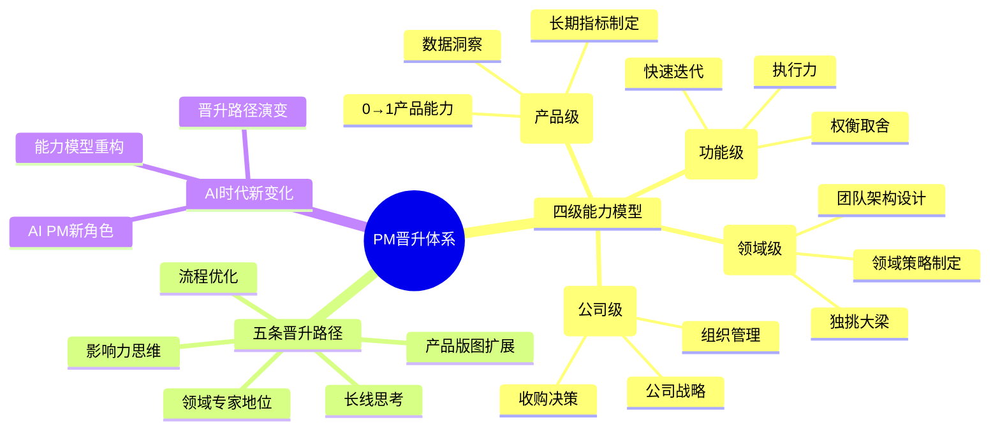
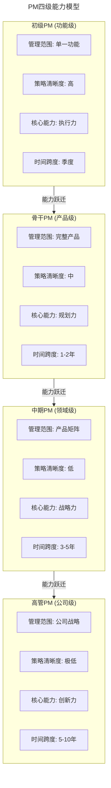
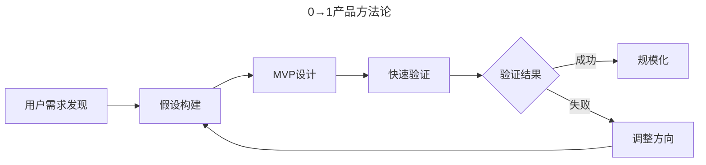
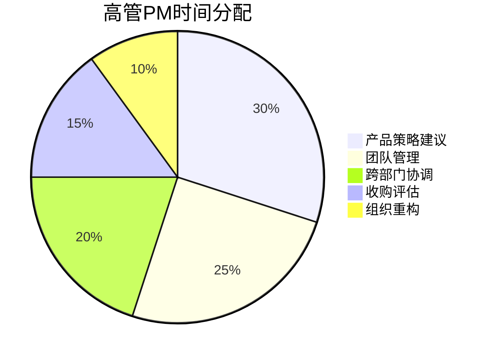
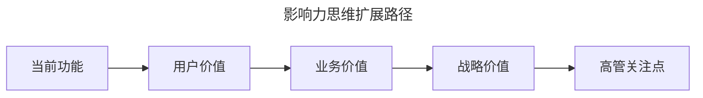
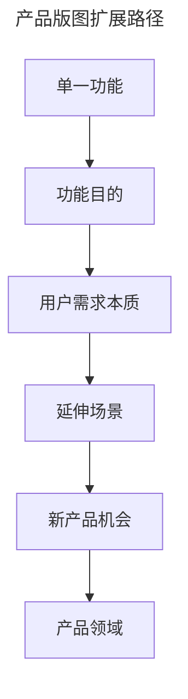
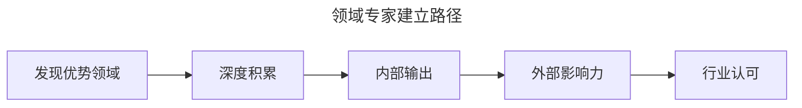
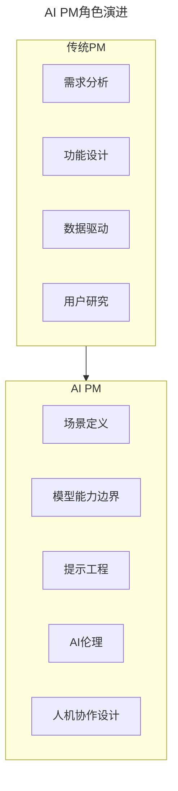

# 28 | 产品经理的晋升秘密

> **适用范围**：产品经理（各阶段）、产品负责人、希望晋升的管理者。适用于能力模型认知、晋升路径规划、影响力建设、AI 时代晋升等场景。
>
> **更新摘要（v2 · 2026-08 更新）**：
> - 结构化升级为 6 节骨架（导言 / 核心方法论 / 关键流程 / 工具与实战 / 常见误区 / 进阶延展）
> - 保留四级能力模型、五条晋升路径、AI 时代新变化、RICE 评估框架、STAR 法则
> - 保留全部 Mermaid 图并补充 `--- title: ... ---` frontmatter，每张图后追加文字解读

---

## 1. 导言

产品经理的晋升体系分为四级能力模型（功能级→产品级→领域级→公司级），每一级对能力的要求、管理范围、策略清晰度和时间跨度都有本质区别。理解这套体系，可以帮助产品经理明确自己当前的位置、找准下一级需要补足的能力，并制定清晰的晋升路径。

> **图解**：PM 晋升体系——四级能力模型（初级功能级、骨干产品级、中期领域级、高管公司级）、五条晋升路径（影响力思维、产品版图扩展、长线思考、流程优化、领域专家地位）、AI 时代新变化。

---

## 2. 核心方法论

### 2.1 PM 四级能力模型详解

> **图解**：PM 四级能力模型——初级 PM（管理范围单一功能、策略清晰度高、核心能力执行力、时间跨度季度）→骨干 PM（完整产品、策略清晰度中、核心能力规划力、时间跨度 1-2 年）→中期 PM（产品矩阵、策略清晰度低、核心能力战略力、时间跨度 3-5 年）→高管 PM（公司战略、策略清晰度极低、核心能力创新力、时间跨度 5-10 年）。每一级通过能力跃迁晋升。

**第一层：初级 PM（功能级）**——工作特征：管理范围是单一产品功能（如 Facebook 头像功能）；策略状态是公司已明确方向，需细化执行；核心任务是将策略转化为可执行的功能。能力要求：

| 能力维度 | 具体表现 | 评估标准 |
|---------|---------|---------|
| 执行力 | 推动功能从设计到上线 | 能否按时交付 |
| 权衡取舍 | 分清主次，聚焦核心 | 是否能说"不" |
| 快速迭代 | 基于数据快速优化 | 迭代周期长度 |
| 短期指标 | 制定季度OKR | 指标达成率 |

**第二层：骨干 PM（产品级）**——工作特征：管理范围是完整产品（如 Facebook 主页）；策略状态是需制定 1-2 年产品策略；核心任务是连接长期目标与短期数据。能力要求：

| 能力维度 | 具体表现 | 评估标准 |
|---------|---------|---------|
| 长期指标 | 制定年度成功指标 | 指标与愿景对齐度 |
| 数据洞察 | 从短期数据预判长期趋势 | 预测准确率 |
| 0→1能力 | 从需求发现到产品验证 | MVP成功率 |
| 团队协作 | 管理扩大的工程团队 | 团队满意度 |

**0→1 产品方法论**：

> **图解**：0→1 产品方法论——用户需求发现→假设构建→MVP 设计→快速验证→验证结果（成功则规模化，失败则调整方向回到假设构建）。

**第三层：中期 PM（领域级）**——工作特征：管理范围是产品领域（如"用户自我表达"产品矩阵）；策略状态是老板问"我们应该做什么"；核心任务是制定领域策略，设计团队架构。能力要求：

| 能力维度 | 具体表现 | 评估标准 |
|---------|---------|---------|
| 战略制定 | 定义领域发展方向 | 战略清晰度 |
| 产品分类 | 设计产品矩阵结构 | 分类逻辑性 |
| 团队架构 | 设计PM分工方案 | 架构合理性 |
| 资源配置 | 分配团队资源 | 效率最大化 |

**产品分类决策框架**——案例：帮助用户"更好表达自己"的产品领域。分类维度：表现形式（工具型产品，如视频/文字/GIF/表情包）；用户群体（人群差异大的产品，如高中生/年轻人/中年/老年）；使用场景（场景驱动型产品，如社交/工作/娱乐）。决策依据：阿里巴巴按年龄划分（同龄人购买偏好相似）；美图秀秀按表现形式划分（用户对形式有不同要求）。

**第四层：高管 PM（公司级）**——工作特征：管理范围是公司整体产品战略；策略状态是探索创新方向；核心任务是定义公司未来。能力要求：

| 能力维度 | 具体表现 | 评估标准 |
|---------|---------|---------|
| 战略洞察 | 判断行业趋势 | 战略前瞻性 |
| 收购决策 | 评估收购标的 | 收购ROI |
| 组织管理 | 管理几百人团队 | 组织效率 |
| 人才培养 | 建立PM培养体系 | 人才密度 |

**工作重心变化**：

> **图解**：高管 PM 时间分配——产品策略建议 30%、团队管理 25%、跨部门协调 20%、收购评估 15%、组织重构 10%。成功标准是公司行业地位提升、股价积极影响、产品矩阵协同效应。

---

## 3. 关键流程

### 3.1 五条晋升路径

**路径一：影响力思维**——核心方法是**从"我的功能"思考到"对公司的影响"**。

> **图解**：影响力思维扩展路径——从当前功能→用户价值→业务价值→战略价值→高管关注点。案例：头像功能的价值扩展——基础（用户更换头像）→扩展（社交美妆，圈出头像上的美妆产品）→进阶（购买时自动更换头像）→战略（社交电商入口）。

**路径二：产品版图扩展**——核心方法是**从功能目的出发，发现延伸机会**。思考框架：功能 → 目的 → 延伸 → 新产品（头像 → 表达自我 → 卡通形象/弹幕/表情包 → 表达产品线）。扩展路径：

> **图解**：产品版图扩展路径——单一功能→功能目的→用户需求本质→延伸场景→新产品机会→产品领域。

**路径三：长线思考**——核心方法是**从当下数据思考到 3-5 年影响**。思考维度：

| 时间跨度 | 关注点 | 典型问题 |
|---------|-------|---------|
| 发布时 | 短期数据 | 首日DAU如何？ |
| 3个月 | 用户留存 | 用户会回来吗？ |
| 1年 | 产品健康度 | 增长可持续吗？ |
| 3年 | 竞争壁垒 | 护城河够深吗？ |

反面案例：过度推送 → 用户屏蔽 → 长期流失；短期补贴 → 用户薅羊毛 → 真实需求被掩盖。

**路径四：流程优化**——核心方法是**从执行者到流程改进者**。可优化领域：PM 培训机制；新人 onboarding；跨部门协作流程；决策机制；招聘标准。行动建议：观察现有流程痛点；提出改进方案；主动承担改进任务；分享最佳实践。

**路径五：领域专家地位**——核心方法是**建立独特专业影响力**。建立路径：

> **图解**：领域专家建立路径——发现优势领域→深度积累→内部输出→外部影响力→行业认可。影响力形式：内部（成为某领域咨询对象）；外部（出版书籍、行业演讲）；社区（开源贡献、博客文章）。

---

## 4. 工具与实战

### 4.1 AI 时代 PM 晋升新变化

**AI PM 角色演进**：

> **图解**：AI PM 角色演进——传统 PM（需求分析、功能设计、数据驱动、用户研究）演进为 AI PM（场景定义、模型能力边界、提示工程、AI 伦理、人机协作设计）。

**AI PM 能力模型**：

| 能力维度 | 传统PM | AI PM | 变化程度 |
|---------|-------|-------|---------|
| 需求分析 | 用户访谈 | 场景挖掘+AI可行性评估 | 高 |
| 产品设计 | 功能流程 | 人机交互流程 | 中 |
| 数据能力 | 数据分析 | 数据标注+模型评估 | 高 |
| 技术理解 | 基础技术 | AI模型原理+能力边界 | 高 |
| 伦理意识 | 隐私保护 | AI偏见+安全+可控性 | 高 |

**AI 时代晋升路径变化**——新增能力要求：AI 场景洞察（识别 AI 能创造价值的场景）；模型能力评估（理解模型能做什么、不能做什么）；人机协作设计（设计 AI 与人的最佳分工）；AI 产品伦理（处理偏见、安全、可控性问题）。晋升加速器：主导 AI 产品从 0 到 1；建立 AI 产品方法论；成为 AI PM 领域专家；推动组织 AI 转型。

**AI PM 层级能力**：初级（理解 AI 基础，能设计 AI 功能）；骨干（能评估 AI 可行性，设计 AI 产品）；中期（能制定 AI 领域策略，规划 AI 产品矩阵）；高管（能判断 AI 战略方向，推动组织 AI 转型）。

### 4.2 最新实践与方法论

**晋升评估框架（RICE 模型）**：

| 维度 | 含义 | 评估问题 |
|-----|------|---------|
| Reach | 影响范围 | 你的工作影响了多少人？ |
| Impact | 影响深度 | 产生了多大的业务价值？ |
| Confidence | 可信度 | 结果是可复制的吗？ |
| Effort | 投入产出 | 效率如何？ |

**晋升答辩准备**——STAR 法则：Situation（背景与挑战）；Task（你的任务）；Action（你采取的行动）；Result（可量化的结果）。关键问题准备：你做过的最难决策是什么？你如何处理与他人的冲突？你如何证明你的影响力？你的独特价值是什么？

**晋升信号识别**：

| 信号 | 含义 | 行动 |
|-----|------|------|
| 被咨询 | 成为专家 | 扩大影响力 |
| 带新人 | 管理能力 | 建立方法论 |
| 跨部门项目 | 影响力 | 主动承担 |
| 战略讨论 | 高层认可 | 积极参与 |

### 4.3 实战要点

| 要点 | 说明 | 适用场景 |
|------|------|----------|
| 四级能力模型自评 | 对照功能/产品/领域/公司四级评估当前位置 | 职业规划 |
| 影响力思维 | 从"我的功能"思考到"对公司的影响" | 日常工作 |
| 产品版图扩展 | 从功能目的出发发现延伸机会 | 晋升规划 |
| 长线思考 | 从当下数据思考到3-5年影响 | 产品决策 |
| 流程优化 | 从执行者到流程改进者 | 组织贡献 |
| 领域专家地位 | 建立独特专业影响力 | 长期影响力 |
| AI场景洞察 | 识别AI能创造价值的场景 | AI时代晋升 |
| RICE评估框架 | 用Reach/Impact/Confidence/Effort评估 | 晋升自评 |
| STAR法则 | Situation/Task/Action/Result结构化答辩 | 晋升答辩 |
| 晋升信号识别 | 被咨询/带新人/跨部门/战略讨论 | 机会识别 |

---

## 5. 常见误区

| 误区 | 表现 | 正确做法 |
|------|------|---------|
| **只关注功能** | 停留在"我的功能"思维 | 用影响力思维思考对公司的影响 |
| **忽视长线思考** | 只看当下数据不看长期影响 | 从当下数据思考到3-5年影响 |
| **不扩展版图** | 守住单一功能不拓展 | 从功能目的出发发现延伸机会 |
| **AI 能力缺失** | 不学习 AI 场景洞察、模型能力 | 新增 AI 场景洞察、模型评估、人机协作设计 |
| **忽视流程贡献** | 只做执行者不做流程改进 | 从执行者到流程改进者 |
| **不识别晋升信号** | 错过被咨询/带新人/跨部门机会 | 识别晋升信号并主动承担 |

---

## 6. 进阶延展

### 6.1 核心术语

| 术语 | 英文 | 定义 |
|-----|------|------|
| 产品经理 | Product Manager (PM) | 负责产品策略、设计、执行的角色 |
| 功能级PM | Feature PM | 管理单一功能的初级PM |
| 产品级PM | Product PM | 管理完整产品的骨干PM |
| 领域级PM | Area PM | 管理产品领域的中期PM |
| 公司级PM | Company PM | 负责公司战略的高管PM |
| 0→1 | Zero to One | 从无到有创建新产品 |
| MVP | Minimum Viable Product | 最小可行产品 |
| OKR | Objectives and Key Results | 目标与关键结果 |
| Reorg | Reorganization | 组织重构 |
| Roadmap | Product Roadmap | 产品路线图 |
| AI PM | AI Product Manager | AI产品经理 |
| 提示工程 | Prompt Engineering | 设计AI交互提示的技术 |

### 6.2 思考题

1. **自我评估**：对照四级能力模型，你目前处于哪个级别？距离下一级还差什么能力？
2. **版图扩展**：如果你负责"搜索当日新闻并阅读全文"功能，如何从这个功能出发扩展产品版图？
3. **AI时代思考**：AI 时代，PM 的核心竞争力会发生什么变化？哪些能力会变得更重要，哪些会贬值？
4. **晋升路径**：在五条晋升路径中，哪一条最适合你当前的情况？为什么？
5. **组织观察**：观察你所在公司的 PM 晋升机制，有哪些可以改进的地方？

### 6.3 延伸阅读

1. **《Inspired》** - Marty Cagan：产品经理必读经典
2. **《Empowered》** - Marty Cagan：产品领导力
3. **《The Lean Startup》** - Eric Ries：精益创业方法论
4. **《Good Strategy Bad Strategy》** - Richard Rumelt：战略思维
5. **《AI Product Management》** - 各种 AI PM 资源与案例
6. **Google/Amazon/Meta PM 面试指南**：了解顶级公司 PM 能力要求
